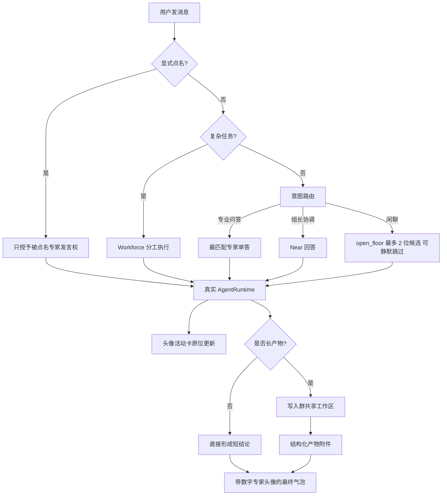

# 群聊控制室体验总计划

Planned-with: GPT-5.6 Sol
Suggested-Impl-Model: Cursor Grok 4.6（四个子计划均按其可独立实施的精度编写）
Status: implemented
Plan-Id: 2026-08-20-group-chat-control-room-experience

> **For implementer:** 这是总计划，只规定目标、依赖和跨计划不变量；不要直接按本文件改代码。实施时逐个移动并执行下列子计划。不要把四个子计划揉成一次无边界的大改。不要 commit，除非用户明确要求。

**Goal:** 把 Near 群聊做成一个简洁、可信、可执行的多专家控制室：系统决定本轮谁有发言权，没增量的人完全静默；长任务真实执行并把产物放入群工作区；用户始终能看到哪个数字专家在工作；最终聊天只保留带专家头像的短结论、产物和下一步。

**Architecture:** 保留已经落地的 `open_floor`，但不照搬外部产品的“全员轮询 + `(pass)` 气泡”。群聊分成四层：发言权控制、执行与产物、运行状态、消息视觉。后端通过现有 `GroupReply` / SSE 暴露真实状态和结构化产物；Desktop 用数字专家头像统一呈现活动行、确认卡和最终气泡。聊天是控制面，文件系统是长产物的数据面，但用户明确要求全文时仍可在群里完整回答。

**Tech Stack:** Python 3.10、AgentRuntime、GroupChatRouter、Studio SSE、React/Zustand/Electron、pytest、vitest。

---

## 这次吸收什么，不吸收什么

### 吸收

1. **系统级发言权**：不是把“少说话”只写在人设里。路由器先选本轮参与者，未获权成员不启动 runtime。
2. **静默 pass**：`__SKIP__` 是内部控制信号，用户永远看不到 `(pass)`、`Passed.`、`User tagged X. Passed.`。
3. **群聊是控制面**：默认只回“结论 + 产物 + 下一步”，长文和代码落到群共享工作区。
4. **真实工作态**：专家工作时有头像和原位更新状态；阻塞、失败、完成有明确状态，不让用户面对一句“等我回复”无限等待。
5. **数字专家身份**：最终回复、工作态、阻塞确认都使用该专家真实头像；没有图片时才用稳定的颜色和首字 fallback。

### 不吸收

1. 不做“每条用户消息后所有成员都轮一遍”；这会增加成本和等待时间。
2. 不展示 pass 气泡；静默才是没有噪音。
3. 不允许同一专家用两条英文气泡报告“已回答 / 等待追问”；状态不冒充正文。
4. 不把角色约定当权限锁；能否写仓库由工具权限和工作区约束决定。
5. 不强制所有回答落盘；闲聊和短问答直接回，用户要求全文时直接给全文。
6. 不展示裸工具参数、结果或 traceback；必要详情放可折叠状态卡，最终失败只给可行动原因。

---

## 目标链路

---

## 子计划与实施顺序

### P1：发言权、短答契约与真执行

文件：`.cursor/plans/pending/2026-08-20-group-chat-floor-control-execution.plan.md`

负责：

- 点名只唤醒当事人，未点名按职责选择 1 位；闲聊才允许最多 2 位 `open_floor`
- `group_skipped` 永远静默
- 删除用户可见 `group_nudge`
- 给意图结果增加“是否需要真实执行”
- 执行型 `meta_direct` 必须走带工具的 runtime，不能只口头承诺
- 最终回复默认 1–3 句；执行型回答无证据时不得声称完成

### P2：群共享工作区与结构化产物

文件：`.cursor/plans/pending/2026-08-20-group-chat-shared-artifact-delivery.plan.md`

负责：

- `group:<gid>` 会话绑定 `~/.agenticx/groups/<gid>/workspace`
- 同群跨 session 复用同一工作区
- 成员执行前后扫描文件增量
- `GroupReply.artifacts` → SSE → Desktop `MessageAttachment`
- 群里显示可点击产物芯片；不依赖模型正确拼绝对路径
- 中断后已落盘文件保留，未完成文件不伪装成最终产物

### P3：带头像的专家活动卡

文件：`.cursor/plans/pending/2026-08-20-group-chat-expert-activity-card.plan.md`

负责：

- 用一条原位更新的活动卡替代 “我去查 / Answered / Waiting” 等过程气泡
- 卡片显示专家头像、名称、阶段、最近工具动作和耗时
- 默认折叠工具细节；确认/澄清就近展开
- 完成后活动卡消失，最终回复接管；失败则保留可行动失败态
- 活动卡不写入普通聊天历史，不刷屏

### P4：头像轨与紧凑群聊气泡

文件：`.cursor/plans/pending/2026-08-20-group-chat-avatar-compact-ui.plan.md`

负责：

- 最终回复恢复数字专家头像
- 名字改成气泡上方灰字，去掉“名字 + 展开/折叠”胶囊
- 中性灰实心、内容自适应气泡
- 操作按钮仍常驻但收紧间距
- Meta 单聊视觉不变

---

## 跨计划不变量

1. **一个用户轮次只有路由器选中的专家能启动。** `__SKIP__` 不是可见消息。
2. **活动不是回复。** `group_progress`、typing、工具步骤不得持久化为助手正文。
3. **最终回复必须结束等待感。** 禁止以“稍等 / 等我回复 / 我去处理”作为本轮 FINAL；若任务仍未完成，必须给当前事实和阻塞原因。
4. **完成必须有证据。** 执行型任务至少存在工具调用、结构化产物或成功 graph node 之一，才能使用“完成 / 已落地 / 已修复”。
5. **头像身份一致。** 同一 `agent_id` 在最终气泡、活动卡、确认卡使用同一个 `avatarUrl` / fallback 颜色。
6. **用户明确要求优先。** 用户要求全文贴群里时可以展开，不强制落盘；用户点名者必须回复，即使结论是“暂无增量”。
7. **不改正确能力。** 保留 `open_floor`、成员间 @ 接话、Workforce、确认门、澄清门、停止生成、上下文续问。
8. **不碰无关端。** 四个子计划均不得改 Enterprise；除 P2 明确列出的后端文件外，不触碰 `server.py`。

---

## 统一验收场景

### 场景 A：点名

输入：`@Bob 查一下这个仓库的许可证。`

期望：

- 只有 Bob 出现活动卡
- 其他专家无 pass 气泡、无 working 行
- Bob 最终用自己的头像回复 1–3 句，并附证据或产物

### 场景 B：闲聊

输入：`你们平时怎么配合？`

期望：

- 最多 2 位相关成员发言
- 内容被前一位覆盖的候选静默
- Near 不公开催人

### 场景 C：长任务

输入：`分析这个模块并给出可实施方案。`

期望：

- 用户立即看到被选专家的头像活动卡，而不是“等我回复”正文
- 工具步骤在同一张卡原位更新
- 详细方案写入群工作区
- 最终气泡只给一句结论、可点击产物芯片和下一步

### 场景 D：用户要求全文

输入：`不要落文件，把完整分析直接贴群里。`

期望：

- 直接完整回答
- 不因“控制面”规则擅自截成路径

### 场景 E：失败与中断

输入：执行中点击停止。

期望：

- 活动卡变为“已停止”，不显示“完成”
- 已经写完的产物仍可打开
- 新追问能基于上一轮 query、部分结果和新 query 继续

---

## 发布门槛

每个子计划独立通过自己的测试后再进入下一个。最终必须：

1. 后端群聊 smoke 全绿
2. Desktop 群聊相关 vitest 全绿
3. `agx serve` 冷启动及核心 API 200（仅实施触碰 `server.py` 的 P2 时强制）
4. light / dim / dark 三主题人工验收
5. 旧群历史回放不出现 pass 气泡，数字专家头像不丢失
6. 同一任务至少做一次：执行、落盘、点击产物、停止、续问

---

## 明确废弃的旧方案

- `.cursor/plans/pending/2026-08-16-group-chat-humanlike-multi-bubble.plan.md` 不再实施。其“用 `group_say` 发我去查一下”会把状态变成聊天噪音；P3 用原位活动卡替代。
- `.cursor/plans/pending/2026-08-16-group-project-workspace-binding.plan.md` 由 P2 吸收并扩展。
- `.cursor/plans/pending/2026-08-19-group-chat-avatar-compact-bubbles.plan.md` 由 P4 吸收并补齐活动/确认场景头像。

