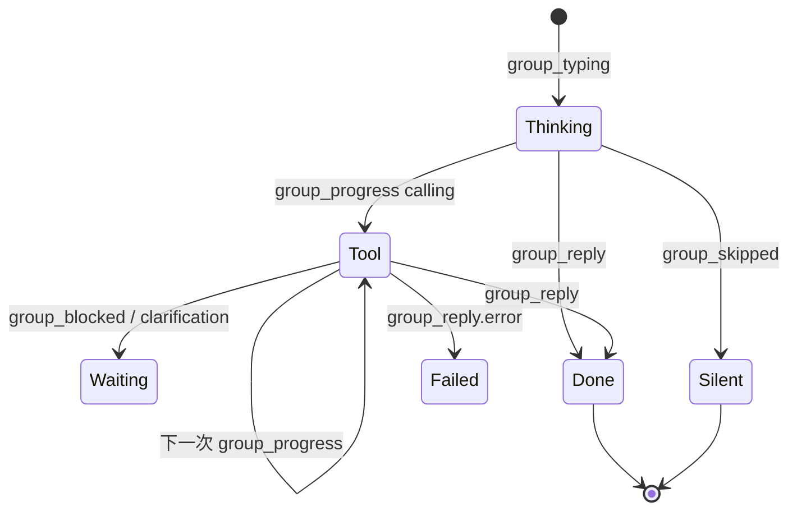

# 群聊数字专家活动卡

Planned-with: GPT-5.6 Sol
Suggested-Impl-Model: Cursor Grok 4.6（实时 SSE 状态聚合 + 视觉状态机）
Status: implemented
Plan-Id: 2026-08-20-group-chat-expert-activity-card
Parent-Plan: 2026-08-20-group-chat-control-room-experience

> **For implementer:** 只实现“运行中的原位状态”，不要新增过程聊天气泡，不要实现 `group_say`。现有工作区侧栏和 RunGraphPanel 仍依赖 `groupActivityHint` / `groupMemberPhase`，不得删掉这些状态或改变它们的公开 props。不要 commit，除非用户明确要求。

**Goal:** 用户发出任务后，立即看到被选数字专家的头像、名称和真实工作阶段；状态在一行卡片中原位更新，不再靠“我去查一下 / 已回答 / 等待追问”等正文制造进度感。

**Architecture:** 后端继续使用现有 `group_typing`、`group_progress`、`group_blocked`、`group_clarification`、`group_reply`、`group_skipped`，不新增协议。Desktop 把当前分散的 `groupTyping`、`groupActivityHint`、`groupMemberPhase` 派生为 `GroupExpertActivity`，交给独立组件渲染。状态卡不是 `Message`，不进入聊天历史；reply / skip 到达后立即移除。

**Tech Stack:** React、Zustand、现有 group SSE、lucide-react、vitest。

---

## 目标外观



默认一行：

`[专家头像] Near  正在检查仓库…  12s  [展开]`

展开后只显示本专家本轮最近工具步骤（最多 6 条），不显示参数全文和结果正文。

---

## In scope

- 新建 `GroupExpertActivityCard`
- 数字专家头像、名称、阶段、耗时
- thinking / tool / waiting 文案中文化
- 一位专家一张卡，原位更新
- 多专家可并列多张，但每人只一张
- 工具详情可折叠，最多 6 条
- reply / skip 后清理
- session 切换、停止、重连后不残留幽灵状态
- vitest

## Out of scope

- 不持久化活动卡
- 不把工具详情写入普通消息
- 不显示工具参数、stdout、result 正文
- 不改工具权限和后端路由
- 不改最终气泡（P4）
- 不实现 side panel 新功能
- 不实现 `group_say`

---

## FR-1：活动数据模型与纯函数

**Files:**

- Create: `desktop/src/utils/group-expert-activity.ts`
- Create: `desktop/src/utils/group-expert-activity.test.ts`

```ts
export type GroupExpertActivityPhase =
  | "thinking"
  | "tool"
  | "waiting";

export type GroupExpertToolStep = {
  callId: string;
  toolName: string;
  phase: "calling" | "done";
  updatedAt: number;
};

export type GroupExpertActivity = {
  agentId: string;
  avatarName: string;
  avatarUrl?: string;
  phase: GroupExpertActivityPhase;
  summary: string;
  startedAt: number;
  updatedAt: number;
  toolSteps: GroupExpertToolStep[];
};
```

导出 reducer：

```ts
export function reduceGroupExpertActivity(
  current: GroupExpertActivity | undefined,
  event: {
    type: "typing" | "progress" | "blocked" | "clarification";
    agentId: string;
    avatarName: string;
    avatarUrl?: string;
    content?: string;
    toolName?: string;
    toolPhase?: string;
    toolCallId?: string;
    now: number;
  },
): GroupExpertActivity;
```

规则：

- typing 新建：`phase=thinking`，summary=`正在思考…`
- progress + tool calling：`phase=tool`，summary=`正在使用 {toolName}…`
- progress + tool done：保留 `phase=tool`，summary=`已完成 {toolName}，继续处理中…`
- 普通 progress content：优先使用已净化中文 content
- blocked / clarification：`phase=waiting`，summary 为 prompt 或 `等待你的确认…`
- 同 callId 更新而不是新增
- 最多保留最近 6 条工具步骤
- `startedAt` 首次后不变
- avatarUrl 后到可补全，但空值不能覆盖已有 URL

**AC:** reducer 单测覆盖以上每条和 cap 6。

---

## FR-2：活动卡组件

**Files:**

- Create: `desktop/src/components/messages/GroupExpertActivityCard.tsx`
- Create: `desktop/src/components/messages/GroupExpertActivityCard.test.tsx`
- Reuse: `ChatImAvatar`（P4 实施前可先用现有 32px 默认；P4 后传 `size="sm"`）

Props：

```ts
type Props = {
  activity: GroupExpertActivity;
  now: number;
};
```

视觉：

- 根：`ml-3 mb-2 flex max-w-[min(100%,680px)] items-start gap-2`
- 头像：28×28 圆形，真实 `avatarUrl` 优先
- 主体：无厚边框，`bg-surface-card/60`，`rounded-xl px-3 py-2`
- 名称：12px `text-text-faint`
- summary：13px `text-text-muted`
- running：三点动画；waiting：amber 小图标
- 耗时：`Math.floor((now-startedAt)/1000)`，每秒更新
- 折叠按钮用 `HoverTip`，不使用原生 `title`
- 工具步骤默认折叠；展开列表只显示中文工具名映射和完成/进行中状态

组件禁止出现：

- `is working...`
- `Answered all...`
- `Waiting on follow-up`
- `(pass)`
- 工具 arguments / result

**AC:** 静态渲染含头像、中文阶段、耗时；默认不显示工具列表；展开后最多 6 条。

---

## FR-3：ChatPane 接线，不再用 ImBubble 渲染活动态

**Files:** Modify `desktop/src/components/ChatPane.tsx`

现状锚点：

- state：`groupTyping` / `groupActivityHint`（约 `2985-2995`）
- SSE：`group_typing` / `group_progress`（约 `9732-9779`）
- 渲染：`Object.entries(groupTyping).map(... <ImBubble id=typing-*>)`（约 `8239-8263`）

新增：

```ts
const [groupExpertActivities, setGroupExpertActivities] =
  useState<Record<string, GroupExpertActivity>>({});
```

helper：

```ts
const applyGroupActivityEvent = useCallback(
  (agentId: string, event: Parameters<typeof reduceGroupExpertActivity>[1]) => {
    setGroupExpertActivities((prev) => ({
      ...prev,
      [agentId]: reduceGroupExpertActivity(prev[agentId], event),
    }));
  },
  [],
);

const clearGroupActivity = useCallback((agentId: string) => {
  setGroupExpertActivities((prev) => {
    if (!(agentId in prev)) return prev;
    const next = { ...prev };
    delete next[agentId];
    return next;
  });
}, []);
```

SSE 接线：

- `group_typing`：同时更新原有 `groupTyping` 和新 activity
- `group_progress`：保留原有 side panel / graph store 更新，同时 reduce activity
- `group_blocked` / `group_clarification`：先 reduce 为 waiting；真正的确认/澄清交互仍按当前 tool message 逻辑显示，P4 会给交互卡补头像
- `group_reply` / `group_skipped`：`clearGroupActivity(eventAgentId)`
- error / stop / session switch / 新一轮开始：清空整个 map

把原来的 typing `ImBubble` map 替换为：

```tsx
{Object.values(groupExpertActivities).map((activity) => (
  <GroupExpertActivityCard
    key={activity.agentId}
    activity={activity}
    now={activityClockNow}
  />
))}
```

活动卡排序：`startedAt asc`，同时间 `agentId`。

**不要删除** `groupTyping`、`groupActivityHint`、`groupMemberPhase`；工作区成员列和 RunGraphPanel 继续使用。

---

## FR-4：稳定耗时和清理

**Files:** Modify `desktop/src/components/ChatPane.tsx`

只在 `Object.keys(groupExpertActivities).length > 0` 时开启 1 秒 interval：

```ts
useEffect(() => {
  if (Object.keys(groupExpertActivities).length === 0) return;
  const id = window.setInterval(() => setActivityClockNow(Date.now()), 1000);
  return () => window.clearInterval(id);
}, [groupExpertActivities]);
```

以下场景必须清空：

- `pane.sessionId` 变化
- 用户点击 stop 且当前 group run 终止
- SSE reader finally / error
- 发起新用户轮次前
- reattach 收到 done

不要仅靠 component unmount。

**AC:** fake timers 验证 interval 仅活动时存在；session 切换后无旧专家卡。

---

## FR-5：活动文案规范化

**Files:**

- Modify: `desktop/src/utils/group-expert-activity.ts`
- Optional Modify: `agenticx/runtime/group_router.py:_runtime_event_to_progress_text` 仅当现有值无法满足；优先前端映射，避免触碰后端

最小映射：

```ts
const TOOL_LABELS: Record<string, string> = {
  bash_exec: "终端",
  file_read: "文件读取",
  file_write: "文件写入",
  web_search: "网络检索",
  knowledge_search: "知识库检索",
  session_search: "历史检索",
};
```

未知工具显示 `正在执行工具…`，不直接暴露内部 snake_case 名。

现有后端 `正在调用工具：web_search` 可解析 toolName 后替换，不能把原文本原样展示。

---

## FR-6：确认和澄清的交接

活动卡进入 waiting 时：

- summary 显示 `等待你的确认…` / `需要你补充信息…`
- 紧随其后的现有 InlineConfirmCard / ClarificationCard 仍承担按钮交互
- 不再额外显示 typing dots
- 用户提交后，同 agent activity 回到 thinking，保留 startedAt

若当前代码在 blocked 时立即清掉 typing/activity，调整为：

1. 保留 `groupExpertActivities[agentId]` waiting
2. 原有 `groupTyping` / `groupActivityHint` 可清理（side panel 语义不变）
3. reply / skip 才删除 activity

---

## 测试与验收

```bash
cd desktop && npx vitest run \
  src/utils/group-expert-activity.test.ts \
  src/components/messages/GroupExpertActivityCard.test.tsx
```

再跑现有：

```bash
cd desktop && npx vitest run src/components/messages/ImBubble.test.tsx
pytest tests/test_smoke_group_progress_tool_step.py -q
```

手工：

1. 点名一个专家执行搜索：只出现该专家一张活动卡。
2. 连续多个工具：卡片原位更新，不新增聊天行。
3. 两位专家并行：各一张，均有自己的头像。
4. skip：卡片静默消失。
5. reply：卡片消失，最终气泡出现。
6. confirm：活动卡显示等待，确认按钮就近可用。
7. stop / 切 session：无幽灵 working。

