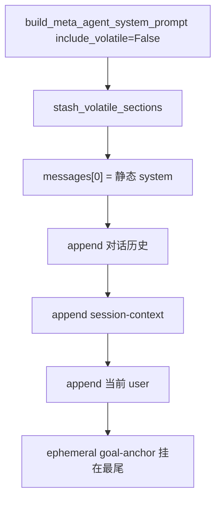

# Kimi 前缀缓存可观测性与 Token 成本优化（修订稿）

Planned-with: Cursor Grok 4.6
Suggested-Impl-Model: P0 用代码专精中档；session-context / runtime 收口用强推理档

> **本文件是 2026-08-22 主线回灌 Wave B 的实施稿。**
> 相对 `.cursor/plans/pending/` 旧稿：用交付侧 `<session-context>` **替换**原 FR-1.2/1.3「只在 system prompt 内重排」。
> **禁止**两条方案并行，也**禁止**零散 cherry-pick `866cf539` `f5dce2e9` `812790c4` `e275bdf0` `d9a613be` `6949090f` `c1d8ce9a` `824d68f1` `a4c5e806`。
> `4dd27476` 已在 Wave A，本 Wave 跳过。
> **P0 不过不许进 P1。** 不改 `enterprise/`。只动 `agenticx/` + `tests/`。改 `server.py` 只许精确改调用行，禁止动顶部 import。

---

## 背景与根因（实施者可自行复核）

用户反馈：Near Desktop 开知识库时「响应很快但账单掉得很快」，怀疑没吃到隐式前缀缓存。

Moonshot 按 **256-token 块**做隐式前缀缓存。前 256 token 内任一字节变化，整份缓存归零。本地 `usage.sqlite` 的 `cached_tokens` 列长期全 0，因为 `TokenUsage` 没有该字段、provider `_parse_response` 丢弃 `prompt_tokens_details`，且 `usage_metadata_from_llm_response` 一旦命中裁剪后的 `token_usage` 就不再回落 `response.usage`。

旧 FR-1.2 只把易变块挪到 **同一条** `messages[0]` 的尾部。交付侧更彻底：易变状态离开 `messages[0]`，渲染成 `<session-context>`，插在**对话历史之后、当前 user 之前**。前缀（system + 历史）可缓存；易变块在缓存边界下游，且离当前问题更近。



---

## In scope / Out of scope

**In scope**

- P0：`TokenUsage.cached_tokens` 端到端 + `cache_stats()`
- P1：`session_context.py` + `include_volatile` + 时间块拆分 + Studio 调用改 `False`
- ToolSearch 默认 `auto` + defer 闸门反转（CORE 以外默认可延迟）
- `tool_discipline.py`：用法细则进工具 description
- goal-anchor 只挂尾部；强模型跳过
- P2 仍有效且与 session-context 不互斥：归档批量、`tools[]` 确定性+指纹、`implicit_prefix` 标签
- Compaction journal + prune-first（Wave B 末段）
- `tests/test_prompt_token_diet.py` 作门禁

**Out of scope**

- 不改 `enterprise/`、Desktop 前端
- 不整文件覆盖 `meta_agent.py`（保留主线独有文案：分身优先、todo 粒度、`show_widget`、browser-use MCP、`_build_inline_photo_display_block` 等）
- 不做原 FR-1.2/1.3 的 system 内重排
- 不做原 FR-2.3「只提高 prepend 阈值」——改为永远 tail
- 不引入交付品牌 / 客户 pricing

---

## P0：缓存可观测性（必须最先做）

### FR-0.1 `TokenUsage` 增加字段

`agenticx/llms/response.py`：只新增 `cached_tokens: int = 0`、`reasoning_tokens: int = 0`。

### FR-0.2 provider 透传

`litellm_provider.py` / `kimi_provider.py` / `bailian_provider.py` / `ark_provider.py` 的 `_parse_response` 用公开别名 `extract_cached_reasoning(usage)` 填新字段。litellm 的 `_hidden_params`/`raw_usage` 回落路径也要取 cached。

`usage_metadata.py`：新增 `extract_cached_reasoning`，私有名转调它。

### FR-0.3 回落

`usage_metadata_from_llm_response`：`token_usage` 分支算出 `cached==0` 时，再读 `response.usage` 与 `response.metadata` 里的原始 usage。`reasoning` 同理。**不改** input/output/total 的既有优先级。返回值始终带 `cached_tokens` / `reasoning_tokens`。

### FR-0.4 SSE / 账本

`agent_runtime` 已传 `cached_tokens`，本 FR 不改那段。

### FR-0.5 `cache_stats`

`usage_store.py` 新增只读方法，返回 `{requests, input_tokens, cached_tokens, cache_ratio, zero_cache_requests}`。不改 schema。

### AC-0

新建 `tests/test_smoke_prompt_cache_observability.py`（AC-0.1–0.5，见旧稿）。P0 绿之前禁止开 P1。

既有 `tests/test_smoke_deerflow_token_usage.py` 的精确 dict 断言须补上 `cached_tokens=0` / `reasoning_tokens=0`。

---

## P1：用 session-context 替换「system 内重排」

### FR-1.1 时间块只留日期

`current_time.py`：`get_current_time_facts()` **结构不变**。`build_current_time_block()` 去掉 `%H:%M:%S`，保留星期/时区与禁止 `web_search` 查日期等规则。新增 `build_current_time_reminder()`（秒级），只进 session-context 尾部。

同一自然日内 `build_current_time_block()` 两次调用必须 `==`（中间 sleep 1.1s）。

### FR-1.2（替换旧稿）离开 `messages[0]`

新建 `agenticx/runtime/prompts/session_context.py`（可整文件取自 `origin/hc-0818`，约 141 行）：

- `build_session_context_message` / `stash_volatile_sections` / `pop_volatile_sections`
- `PENDING_SESSION_CONTEXT_ATTR = "_pending_volatile_sections"`
- `build_deferred_tools_manifest`

`meta_agent.py`：

- 新增 `include_volatile: bool = True`（默认保老行为）
- `include_volatile=False` 时：`workspace_context`、`provider_fault_block`、能力目录、todo/子智能体/记忆/session_summary/taskspaces/code_dev/「当前会话上下文」/context_files **不进** `messages[0]`，改为 `stash_volatile_sections(session, build_meta_agent_volatile_sections(...))`
- 新增 `build_meta_agent_volatile_sections`，与 omit 列表严格配对
- 身份优先级：尾部若有分身/群聊章节仍优先；可加固定文案指向 `<session-context>` 的身份块
- **禁止**覆盖主线独有规则段
- `MetaSkillInjector.inject(..., include_catalog=False)`：技能目录只渲染一次（默认参数保持旧行为）
- `_build_skills_context` 增加 `MAX_SKILL_DESCRIPTION_CHARS` 截断

`agent_runtime.py`：

- `_build_agent_system_prompt(session, include_volatile=False)` + `_build_agent_volatile_sections`（implement 角色同样搬家：Skills/artifacts/todo/scratchpad/context_files/MCP）
- 在历史之后、当前 user 之前：`pop_volatile_sections` + `build_session_context_message`；**不写入** `session.agent_messages`
- goal-anchor：**永远 tail**（`_goal_anchor_placement = "tail"`）；删除 prepend 插入逻辑
- `_goal_anchor_suppressed_for_model`：端点能力 ≥ 1M 则跳过，`AGX_GOAL_ANCHOR_FORCE=1` 可强制开

`studio/server.py` 两处 `build_meta_agent_system_prompt(...)` 加 `include_volatile=False`（约 L3632、L4350）。`cli/main.py` 同理。

`provider_display.build_provider_catalog_block`：保留签名以免破坏调用方，但**不再**写入「当前会话模型」行（该行进 session-context）。

`model_context_window.py`：新增 `declared_window_for_session` / `is_strong_context_model`；**不改**既有 `resolve_context_window()` 的返回语义（避免 Wave A 测试回归）。表中在 `"kimi"` 前插入 `("kimi-k3", 1_048_576)`。

### AC-1（替换旧「公共前缀 ≥ 6000」）

`tests/test_prompt_token_diet.py`（从 `origin/hc-0818` 移植，断言浪费点，不要魔法数字）：

- `include_volatile=False` 时改 todo / context_files / memory / provider_hard_failure / 切模型后，**system 字符串完全相等**
- session-context 在历史之后、当前 user 之前；不进持久历史
- 相邻两轮共享前缀随历史增长
- 时间块跨秒字节稳定；`local_iso` 不在 system 内

旧 AC-1.3「公共前缀 ≥ 6000」作废。

---

## P1 续：ToolSearch 与工具细则

- `ToolSearchConfig.mode` 默认 `"off"` → `"auto"`
- `is_deferred_builtin(name)`：`return name not in CORE_ALWAYS_LOAD_TOOLS`（新工具默认可延迟）
- `project_tools_for_round` 非 CORE、非 defer 的名字按 `sorted()` 输出
- `_project_active_tools` 对投影结果做 sha256 指纹，变化时 `logger.info("tools_prefix_changed ...")`
- 新建 `tool_discipline.py`，`show_widget` / `query_data_source` / `skill_manage` 的 description 追加 USAGE；system prompt 只留触发规则（「强制触发」必须仍在 prompt）

---

## P2（与 session-context 不互斥，一并做）

### FR-2.1 归档批量

`tool_result_budget.py`：`archive_batch_tokens: int = 8000`。预扫描可归档未归档总量，≥ 阈值才归档；已归档不回滚。

### FR-2.3（替换）goal-anchor 永不前置

不要只提高 `AGX_ANCHOR_RESTRENGTHEN_THRESHOLD`。

### FR-2.4 `implicit_prefix`

`prompt_cache_policy.py`：`IMPLICIT_PREFIX_CACHE_PROVIDERS`，命中时 `cache_mode="implicit_prefix"`，不打 `cache_control`。

### AC-2

`tests/test_smoke_turn_prefix_stability.py`：归档轮次下降、已归档不回滚、tools 顺序确定性、kimi 为 `implicit_prefix`。

---

## P3（本 Wave 可不做）

KB payload 瘦身、`static_rules` 度量：不在本 Wave 强制范围。

---

## Compaction journal（末段）

新建 `agenticx/runtime/compaction_journal.py`（取自 `origin/hc-0818`）。`compactor.maybe_compact`：先 journal begin，再 prune-first，压力解除则跳过 LLM 摘要，最后 end。顺序：start → 锁 → 干活 → end → **最后**删锁。移植 `tests/test_compaction_journal.py`。

---

## 验收

```bash
cd /Users/damon/myWork/AgenticX-wave-a
PYTHONPATH=. python -m pytest \
  tests/test_smoke_prompt_cache_observability.py \
  tests/test_prompt_token_diet.py \
  tests/test_smoke_turn_prefix_stability.py \
  tests/test_compaction_journal.py \
  tests/test_smoke_current_time_grounding.py \
  tests/test_smoke_deerflow_token_usage.py \
  tests/test_prompt_cache_policy.py \
  --no-cov --import-mode=importlib -q
```

改 `server.py` 后按 AGENTS.md 做隔离 HOME 冷启动冒烟。
