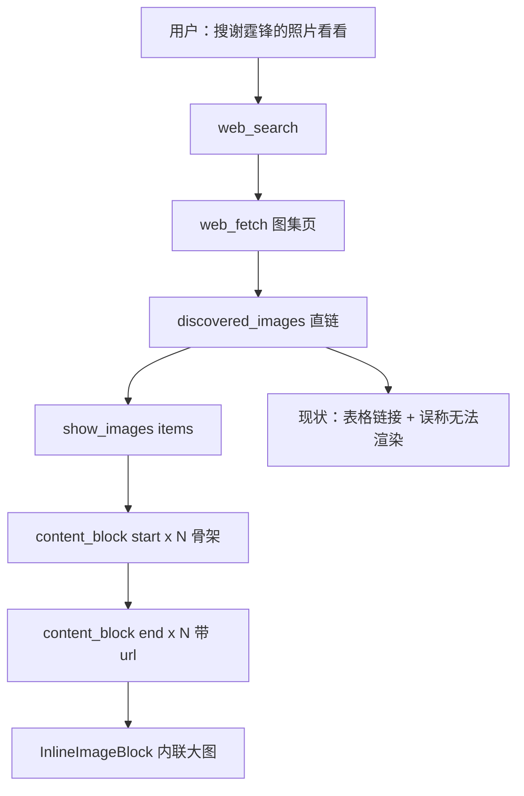

# Near Desktop 搜索结果内联出图

Planned-with: Cursor Grok 4.6
Suggested-Impl-Model: 见「子任务 → 推荐模型」表（协议/多块事件用 `gpt-5.6-sol-medium`，工具+提示词用 `composer-2.5-fast`，InlineImageBlock 远程加载用 `Cursor Grok 4.6`）
Status: pending
Plan-Id: 2026-08-21-near-desktop-search-image-inline

> **For implementer:** 只改本 plan 列出的文件与函数。不要改 `view_image` / `analyze_image` 语义。不要给 `agenticx/studio/server.py` 加路由，import 区禁止整段替换。不要 commit，除非用户明确要求。

**Goal:** 用户说「搜某某的照片看看」时，单聊 Pro 气泡里直接铺远程图（说明 + 来源 + 大图），而不是链接表；文本模型也能展示，不要求视觉能力。

**Architecture:** 不新建搜图引擎。继续用已有 `web_search` + `web_fetch` 的 `[discovered_images]` 拿 http(s) 直链。新增 `show_images` 工具，把 1–6 条远程 URL 收成已有 `content_block` 事件（`url` 字段，不下载、不内联字节）。ChatPane / `InlineImageBlock` 已能按 `url` 出 ``，但 SSE 应用与历史清洗目前会丢掉 `url`，必须补上。系统提示把「模型看图」和「气泡出图」拆开，禁止再写「当前模型无法在气泡内渲染图片」。

**Tech Stack:** Python 3.10（`events.py` / `agent_runtime.py` / `agent_tools.py` / `meta_agent.py`）+ 已有 React `InlineImageBlock` + pytest / vitest。

---

## 规划模型建议

| 子任务 | 推荐模型 | 理由 |
|---|---|---|
| `show_images` schema + 纯函数校验 + 提示词 | `composer-2.5-fast` | 工具样板 + 固定文案 |
| 多图 `content_block` start/end + runtime 循环 | `gpt-5.6-sol-medium` | 与 `generate_image` 单块 id 兼容，序列敏感 |
| SSE `url` 透传 + 远程图 onError + 来源链接 | `Cursor Grok 4.6` | 流式/历史丢字段，加载失败要看得见 |

---

## In scope

- 新增内置工具 `show_images`：入参 `items[{url, alt?, source_url?}]`，返回 `{"type":"image_gallery","images":[...]}`
- `IMAGE_PRODUCING_TOOL_NAMES` 加入 `show_images`
- `content_block` end 抄 `url` / `source_url`（仅 `http`/`https`，永不抄 `data:`）
- 一次工具调用可 yield **多块**（id = `img-<tool_call_id>-<index>`）
- Desktop：`applyContentBlockEvent` / `sanitizeLoadedBlocks` / `synthesizeImageBlocksFromTurn` 保留 `url`、`source_url`
- `InlineImageBlock`：远程 `url` 加载失败显示短文案；有 `source_url` 时展示「来源」链接
- 系统提示：搜照片必须 `show_images`，禁止链接表，禁止把「无视觉」说成「气泡不能出图」
- pytest + vitest

## Out of scope / no-scope-creep

- **不新建**独立搜图 Provider / 不改 `agenticx/studio/web_search/`
- **不改** `view_image` / `analyze_image`（输入方向：喂给模型看）
- **不改** `generate_image` 成功/未配置契约
- **不下载**远程图到本机、不加静态文件路由、不发 thumb/base64
- **不改** 群聊 / Lite `ChatView` / `enterprise/` / AG-UI / IM
- **不重写** markdown 渲染器；本功能走 `blocks`，不靠模型手写 ``
- **不做** 防盗链代理 / Referer 伪造
- P0 **不改** `agenticx/studio/server.py`（通用 SSE 序列化已够用）

---

## 根因与证据链

用户「帮我搜谢霆锋的照片看看」时，模型已用 `web_search`/`web_fetch` 拿到堆糖等直链，但回复写成 Markdown **表格超链接**，并声称「`glm-5.2` 不支持视觉、无法在气泡内渲染图片」。

三件事被混在一起：

1. **模型看图**（`view_image`）——文本模型确实不行。
2. **气泡展示远程图**——UI 不需要视觉模型；`InlineImageBlock` 已有 `url` 字段。
3. **文生图**（`generate_image`）——用户要的是搜现成照片，不是画一张。

P0 出图 plan（`.cursor/plans/2026-08-21-near-desktop-multimodal-streaming-reply.plan.md`）只把 `generate_image` 写入 `IMAGE_PRODUCING_TOOL_NAMES`（`events.py:66`）。`build_content_block_end_event`（`:159-169`）只抄 `path`，不抄 `url`。

前端两处会把远程图弄丢：

- `desktop/src/utils/content-block-sse.ts:33-50` `asImageBlock`：**不读 `url`**
- `desktop/src/utils/content-blocks.ts:191-208` `sanitizeLoadedBlocks`：**不读 `url`**

因此即使补了 SSE `url`，历史回放仍会空白。

`web_fetch` 已在 `_tool_web_fetch`（`agent_tools.py:6076-6081`）输出 `[discovered_images]` 绝对 http(s) URL。缺的是「把这些 URL 嵌进气泡」的硬工具，对标 `show_widget` 对流程图的纪律。

参考交互（内部对照，实施时用产品中性描述）：说明 + 来源链接 + 大图，多张纵向交错。



---

## 已拍板决策（实施者不要再问）

1. **不接新搜图 API。** 发现图继续走 `web_search` → `web_fetch`。质量差（图标/缩略图）P1 再滤，P0 只校验 http(s) 与条数。
2. **必须走 `show_images`，不靠提示词让模型写 ``。** 文本模型已经选过链接表。
3. **一次调用 1–6 张。** 多块 id 为 `img-<tool_call_id>-<index>`（0-based）。`generate_image` 仍是 `img-<tool_call_id>`，禁止改旧 id。
4. **SSE 只带 URL 字符串**，不下载、不转 file://。加载失败由 `` 显示「图片无法加载」。
5. **工具卡默认折叠**（与 `generate_image` 一样，图已内联）。若现网没有单独折叠名单，P0 不必新造折叠白名单；不要为折叠去重构 `ToolCallCard`。
6. **禁止改 plan 文件自身。**

---

## 不变量

1. `generate_image` 的 start/end / 未配置错误 / 本机 `path` 行为与现在完全一致。
2. 无 `blocks` 的旧回复（含本地 markdown ``）像素级不变。
3. `content_block` 帧永不带图片字节 / `data:` URL。
4. `url` / `source_url` 只允许 `http://` 或 `https://`，长度 ≤ 2048。
5. 用户打断：仍为 `generating` 的搜图块变 `cancelled`，已 `ready` 的保留。
6. 不 lock scroll-to-bottom。

---

## 协议增量

### `show_images` 工具结果

成功（给模型看的可见文本就是这段 JSON）：

```json
{
  "type": "image_gallery",
  "images": [
    {
      "type": "image",
      "url": "https://example.com/a.jpg",
      "alt": "西装背头造型",
      "source_url": "https://example.com/gallery"
    }
  ]
}
```

失败：`ERROR: show_images requires at least one http(s) image URL`

非法项（data URL、非 http(s)、空 url）**跳过**，不整单失败；全部非法才 ERROR。

### `content_block`（搜图块）

start（无 url）：

```json
{
  "type": "content_block",
  "data": {
    "mode": "start",
    "block": {
      "type": "image",
      "id": "img-call_abc-0",
      "status": "generating",
      "alt": "西装背头造型",
      "source": "tool"
    }
  }
}
```

end ready：

```json
{
  "type": "content_block",
  "data": {
    "mode": "end",
    "block": {
      "type": "image",
      "id": "img-call_abc-0",
      "status": "ready",
      "url": "https://example.com/a.jpg",
      "alt": "西装背头造型",
      "source_url": "https://example.com/gallery",
      "source": "tool"
    }
  }
}
```

骨架文案：搜图块用「加载图片中… Xs」，**不要**用「生成图片中…」（那是 `generate_image`）。`InlineImageBlock` 用 `block.url` 有值或 `id` 含 `-<digit>` 且无 `path` 来区分；更稳：start 带 `kind: "remote"`。P0 **在 block 上加可选 `kind`: `"remote" | "generated"`**。`generate_image` 不传或传 `"generated"`（旧客户端忽略未知字段即可）。

---

## FR / AC

### FR-1：`show_images` 工具

**落点：**

- `agenticx/cli/agent_tools.py`：`STUDIO_TOOLS` 在 `generate_image` 对象之后、`analyze_image` 之前（约 `:2078`）插入 schema。
- 同文件 `dispatch_tool_async`：紧挨 `generate_image` 分支（约 `:8264-8274`）加 `show_images`。
- `_CONCURRENCY_SAFE_STUDIO_TOOLS`（`:124-152`）加入 `"show_images"`。
- 新文件 `agenticx/tools/show_images.py`：只做 URL 清洗，不发 HTTP。

Schema（必须按此字段，禁止改名）：

```python
{
    "type": "function",
    "function": {
        "name": "show_images",
        "description": (
            "Display 1-6 remote images inline in the chat bubble. "
            "Use when the user wants to SEE photos / 搜照片看看 / 看看图. "
            "Pass direct image http(s) URLs from web_fetch [discovered_images] "
            "or obvious image CDN links. Do not pass HTML gallery pages. "
            "This is display-only: the current model does not need vision. "
            "Never tell the user the bubble cannot render images."
        ),
        "parameters": {
            "type": "object",
            "properties": {
                "items": {
                    "type": "array",
                    "minItems": 1,
                    "maxItems": 6,
                    "items": {
                        "type": "object",
                        "properties": {
                            "url": {"type": "string", "description": "Direct http(s) image URL."},
                            "alt": {"type": "string", "description": "Short caption."},
                            "source_url": {"type": "string", "description": "Page URL for attribution."},
                        },
                        "required": ["url"],
                        "additionalProperties": False,
                    },
                }
            },
            "required": ["items"],
            "additionalProperties": False,
        },
    },
}
```

`show_images(items)` 伪代码：

```python
def normalize_http_url(raw: str) -> str:
    url = str(raw or "").strip()
    if len(url) > 2048:
        return ""
    if not (url.startswith("http://") or url.startswith("https://")):
        return ""
    if url.startswith("data:"):
        return ""
    return url

def show_images(items: list) -> str:
    cleaned = []
    for item in (items or [])[:6]:
        if not isinstance(item, dict):
            continue
        url = normalize_http_url(item.get("url"))
        if not url:
            continue
        row = {"type": "image", "url": url}
        alt = str(item.get("alt") or "").strip()[:80]
        if alt:
            row["alt"] = alt
        src = normalize_http_url(item.get("source_url"))
        if src:
            row["source_url"] = src
        cleaned.append(row)
    if not cleaned:
        return "ERROR: show_images requires at least one http(s) image URL"
    return json.dumps({"type": "image_gallery", "images": cleaned}, ensure_ascii=False)
```

dispatch：

```python
if name == "show_images":
    from agenticx.tools.show_images import show_images
    items = arguments.get("items") or []
    return await asyncio.to_thread(show_images, items)
```

**AC-1**

- 测试：`tests/test_show_images_tool.py`
- 两条合法 https → JSON `type==image_gallery`，`images` 长度 2，保留 `alt`/`source_url`。
- `data:image/png;base64,AAAA` 被丢弃；只剩非法项 → `ERROR:` 前缀。
- 第 7 条被截断，最多 6 条。
- 断言返回值里没有 `base64` 图片体。

### FR-2：多块 `content_block` + 抄 `url`

**落点：** `agenticx/runtime/events.py`

1. `IMAGE_PRODUCING_TOOL_NAMES`（`:66`）改为 `frozenset({"generate_image", "show_images"})`。
2. `image_content_block_id` 增加可选 `index: int | None = None`：`index is None` 时仍为 `img-<tid>`；否则 `img-<tid>-<index>`。
3. `parse_image_tool_result`：`type=="image"` 时除 `path` 外保留合法 `url`/`source_url`。
4. 新增 `parse_image_gallery_result(raw) -> list[dict]`：读 `type=="image_gallery"` 的 `images`；非法 url 跳过。
5. `build_content_block_start_event` 增加 `index=None`、`kind=None`。`kind=="remote"` 时写入 block。
6. `build_content_block_end_event`：ready 时抄合法 `url`/`source_url`；增加 `index`；`kind` 透传。
7. 新增 `iter_content_block_start_events(tool_name, tool_call_id, arguments, agent_id="meta")` 与 `iter_content_block_end_events(...)`，供 runtime 循环 yield。**禁止**在 `agent_runtime.py` 里手写两套 if/else 复制粘贴四次。

`iter_content_block_start_events` 意图：

```python
if tool_name == "show_images":
    items = arguments.get("items") if isinstance(arguments, dict) else None
    # 用与 show_images() 相同的清洗；若清洗后为空，仍 yield 1 个 start（随后 end 会 error）
    rows = _preview_show_items(items)
    if not rows:
        yield build_content_block_start_event(tool_call_id=..., kind="remote")
        return
    for i, row in enumerate(rows):
        yield build_content_block_start_event(
            tool_call_id=..., prompt=row.get("alt") or "", index=i, kind="remote"
        )
    return
if is_image_producing_tool(tool_name):  # generate_image
    yield build_content_block_start_event(tool_call_id=..., prompt=arguments.get("prompt"))
```

`iter_content_block_end_events`：

- `show_images`：用 `parse_image_gallery_result(result)`；与 start 相同 index 对齐；gallery 空或 `ERROR:` → 对已 start 的每块（或 1 块）发 `status=error`，`error` 短中文「没有可用的图片链接」。
- `generate_image`：保持现有单次 `build_content_block_end_event`（无 index）。

**`agenticx/runtime/agent_runtime.py` 四处替换**（只改 yield，不改周围 persist/dispatch）：

| 现锚点 | 改为 |
|---|---|
| `:5777-5782` start | `for ev in iter_content_block_start_events(...): yield ev` |
| `:5829-5837` persist skip end | 同样改为 iter end，`status="error"` |
| `:5883` 附近中断 end | iter end，`status="cancelled"` |
| `:6153-6158` 成功 end | iter end，result=`raw_result` |

`collect_image_blocks_from_tool_rows`（`:182`）：`name` 为 `show_images` 或 `generate_image` 都收集；gallery 展开多块。

**AC-2**

- 扩 `tests/test_content_block_event.py`（不要另起无关文件除非本文件过大）
- `generate_image` 旧用例：id 仍为 `img-call_abc`，start 无 `url`。
- `show_images` 两条 item：两条 start id=`img-call_abc-0/1`，无 `url`；两条 end 带 `url`，无 `path`，无 base64。
- data URL 出现在 item 里 → 该条不进入 end ready。
- 断言 `_runtime_event_to_sse_lines` 仍只需现有通用序列化。

### FR-3：系统提示 — 搜图必须内联

**落点：** `agenticx/runtime/prompts/meta_agent.py`

1. 新增 `_build_inline_photo_display_block()`（放在 `_build_url_vision_capability_block` 之后，约 `:708`）。
2. `build_meta_agent_prompt` 组装处（约 `:1050-1051`）在 url vision 块**之后**插入该函数。
3. **不要改** `_build_url_vision_capability_block` 里 `view_image`/`analyze_image` 的看图流程，只追加展示纪律。

提示词必须包含以下硬性句子（测试按子串断言，实施时原文照抄）：

```text
## 聊天气泡内联出图（show_images）— 硬性纪律
- 用户要「看照片 / 搜照片看看 / 找几张图看看」时，必须把图嵌进气泡，禁止只用表格或超链接交差。
- 「模型能否看图」（view_image）和「气泡能否出图」是两件事。文本模型也可以出图。
- 禁止对用户说「当前模型不支持视觉所以无法在气泡内渲染图片」。
- 正确流程：web_search → web_fetch 图集/新闻页 → 从 [discovered_images] 挑直链 → show_images(items=[...])。
- items.url 必须是图片直链（jpg/png/webp 或 CDN 图），不要传图集 HTML 页。
- 不要用 generate_image 去「画」公众人物照片；那是文生图，不是搜索结果。
- 先写 1–2 句说明找到了什么，再调用 show_images；每张图用短 alt 说明造型/场景，source_url 填来源页。
```

**AC-3**

- 测试：`tests/test_smoke_show_images_prompt.py`（对标 `tests/test_smoke_show_widget_prompt.py`）
- 块内含 `show_images`、`禁止只用表格`、`无法在气泡内渲染图片`、`generate_image`、`discovered_images`。

### FR-4：Desktop 保留 `url` / `source_url`

**落点（只改这些纯函数 + InlineImageBlock，禁止重构 ChatPane SSE 大循环）：**

1. `desktop/src/utils/content-block-sse.ts` `asImageBlock`（`:33-50`）：抄 `url`、`source_url`、`kind`。`url` 若 `data:` 或非 `http(s)` 则丢弃。
2. `desktop/src/utils/content-blocks.ts`：
   - `ContentBlock` image 分支增加 `url?: string`（已有则保留）、`source_url?: string`、`kind?: "remote" | "generated"`。
   - `parseImageToolResultJson` 增加 `url` / `source_url`；另增 `parseImageGalleryJson`。
   - `synthesizeImageBlocksFromTurn`（`:124`）对 `toolName === "show_images"` 展开 gallery。
   - `sanitizeLoadedBlocks`（`:191-208`）抄合法 `url`/`source_url`/`kind`。
3. `desktop/src/components/messages/InlineImageBlock.tsx`：
   - `kind==="remote"` 或（无 `path` 且有 `url`）时，generating 文案为「加载图片中… Xs」。
   - ready：`src = path ? pathToFileUrl(path) : url`（已有逻辑）。
   - `` → 本地 state `loadError`，显示「图片无法加载」，不要红底大卡片。
   - 有 `source_url` 时在图下（或失败文案旁）渲染 `<a>`「来源」，`preventDefault` 后走现有外链打开方式；若本组件没有外链 helper，用 `window.agenticxDesktop?.openExternal?.(url)`，没有则 `window.open(url)`。
4. **不要改** `ChatPane.tsx` 的 `content_block` 分支（`:10449`），它已调用 `applyContentBlockEvent`。

**AC-4**

- `desktop/src/utils/content-block-sse.test.ts`：end 带 `url` 后 block.url 等于该 https；`data:` url 不会出现。
- `desktop/src/utils/content-blocks.test.ts`：`sanitizeLoadedBlocks` 保留 https url；丢掉 data url；`synthesizeImageBlocksFromTurn` 能从 `show_images` gallery 合成两块。
- `InlineImageBlock.test.tsx`：ready + url 有 `img[src=https://...]`；模拟 onError 后无 `img` 或可见「图片无法加载」。

### FR-5：历史清洗允许 http(s) `url`

**落点：** `agenticx/studio/session_manager.py` `_sanitize_content_blocks`（`:512-562`）

现逻辑：`url` 只要不是 `data:` 且 ≤2048 就保留。收紧为：

```python
url = str(item.get("url") or "").strip()
if url.startswith("data:") or len(url) > 2048:
    url = ""
if url and not (url.startswith("http://") or url.startswith("https://")):
    url = ""
if url:
    block["url"] = url
source_url = str(item.get("source_url") or "").strip()
# 与 url 相同的 http(s) 规则
if source_url:
    block["source_url"] = source_url
kind = str(item.get("kind") or "").strip()
if kind in {"remote", "generated"}:
    block["kind"] = kind
```

**AC-5**

- 扩 `tests/test_normalize_messages_blocks.py`
- assistant blocks 带 `url=https://cdn.example/a.jpg` 与 `source_url` → 输出仍在。
- `url=data:image/png;base64,...` → 输出没有该 data URL。
- `url=file:///tmp/x.png` → 不保留（本机图继续走 `path`）。

---

## 分阶段

| 阶段 | 范围 | 交付 |
|---|---|---|
| **P0** | 本 plan 全部 FR-1…FR-5 | 搜照片 → `show_images` → 气泡内联远程图 |
| **P1** | 远程图下载到 session 再 `path`（防盗链）；图标/1×1 过滤 | 热链 403 仍能出图 |
| **P2** | 独立 image search provider；群聊 | 另开 plan |

---

## 验收标准（P0）

1. Pro 单聊「帮我搜谢霆锋的照片看看」（或任意公众人物）：模型调用 `show_images` 后气泡出现内联图，不是「查看照片」链接表。
2. 每张图可点开灯箱；图下（或旁）能看到 alt；有 `source_url` 时可打开来源。
3. 未调用 `generate_image`，也不要求切换视觉模型。
4. 关掉窗格再打开同一 session，远程图仍在（`blocks.url` 活过 `_normalize_messages` + `sanitizeLoadedBlocks`）。
5. 某张热链失败：该块显示「图片无法加载」，其它块不受影响，聊天不崩。
6. 「画一张猫」仍走 `generate_image`，未配置时仍是原来的 error 文案，id 仍为 `img-<tid>`。
7. 工作区本地 `` 预览与改动前一致。

手动 AC 依赖联网与 `web_search` 已开启。自动化不依赖真实外网图：单测用 `https://example.com/a.jpg` 即可。

---

## 风险与缓解

| 风险 | 缓解 |
|---|---|
| 只改提示词，模型继续出表格 | 硬工具 `show_images` + 提示词双保险 |
| 改 `image_content_block_id` 破坏 generate_image 历史 | `index is None` 保持旧 id |
| SSE/历史丢 `url` | FR-4/FR-5 单测锁死 |
| 热链 403 | P0 失败态可见；不在 P0 做代理 |
| `discovered_images` 含小图标 | P0 接受；P1 再滤 |
| 误改 `view_image` | Out of scope |
| 误给 `server.py` 加路由 | 禁止 |

---

## 相关文件索引

- 事件：`agenticx/runtime/events.py`、`agenticx/runtime/agent_runtime.py`（四处 yield）
- 工具：`agenticx/cli/agent_tools.py`、新建 `agenticx/tools/show_images.py`
- 提示词：`agenticx/runtime/prompts/meta_agent.py`
- 持久化：`agenticx/studio/session_manager.py` `_sanitize_content_blocks`
- 桌面：`desktop/src/utils/content-block-sse.ts`、`content-blocks.ts`、`InlineImageBlock.tsx`
- 对照（只读）：`.cursor/plans/2026-08-21-near-desktop-multimodal-streaming-reply.plan.md`
- 提示词测试对照：`tests/test_smoke_show_widget_prompt.py`

---

## 实施顺序（给 Composer 2.5）

1. 先写 `tests/test_show_images_tool.py`（红）→ 实现 `show_images.py` + schema/dispatch（绿）。
2. 扩 `test_content_block_event.py`（红）→ 改 `events.py` helper → 替换 `agent_runtime.py` 四处 yield（绿）。
3. 写 `test_smoke_show_images_prompt.py`（红）→ 加提示词并挂到 `build_meta_agent_prompt`（绿）。
4. 扩 vitest + `test_normalize_messages_blocks.py`（红）→ 改 SSE/sanitize/InlineImageBlock（绿）。
5. 不要顺手改无关文件。不要 commit，除非用户要求。
