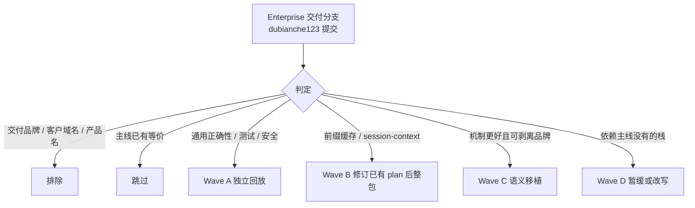

# 从 Enterprise 交付分支回灌主线（通用能力，剥离交付定制）

Planned-with: Cursor Grok 4.6

> **For Claude:** REQUIRED SUB-SKILL: Use superpowers:executing-plans to implement this plan task-by-task.

**Goal:** 把 Enterprise 交付分支上作者 `dubianche123` 的**通用产品能力**回灌到 `origin/main`：先合独立正确性/测试/安全修复，再按主线已有 token-diet plan 整包落地前缀缓存架构；不把交付品牌、客户域名、客户模型 slug、门户产品名硬编码带进主线。

**Architecture:** 不整分支 merge，也不按评估报告「102 个 clean cherry-pick」照单全收。以 `origin/main` 新开 `feat/mainline-port-wave-*` 分支，分波次回放：能独立应用的 commit 按时间正序 `cherry-pick`；成链特性（session-context、附件路由、能力包、群聊 TurnPlan）按语义在主线重放，冲突时保留主线已有 UX（open_floor、控制室、session loop review），只吸收对方机制。

**Tech Stack:** git cherry-pick / 手工移植；Python 3.11 `agenticx` + pytest；Desktop React/Electron；Enterprise TS/Go 仅在安全与通用治理波次触碰。

---

## 0. 实施者必须先读的基线（不要依赖对话记忆）

| 项 | 值（2026-08-22 复核） |
|---|---|
| 源分支 | `origin/hc-0818`（tip `dce6ff83`） |
| 目标 | `origin/main`（tip `030fd818`，比评估报告里的 `06568717` 又前进一天） |
| 分叉点 | `f44415a7`（2026-07-26） |
| 输入评估 | `.cursor/plans/pending/hc-0818 分支 dubianche 提交合并评估报告.md`（2026-08-21；口径仍可用，但 **clean 列表不能当最终清单**） |
| cherry 实测 | `git cherry origin/main origin/hc-0818` → **99 条 `-`（patch 等价已在 main）**、**501 条 `+`（仍未进 main）** |
| 本 plan 抽查 | 报告第 4–8 节列出的 P0/P1 hash **全部 `ancestor=0`**，主线尚未包含 |

评估报告的「102 clean」只表示 **2026-08-21 在当时 main 上文本能应用**。今天 main 已变；且 clean ≠ 该合：交付品牌提交也可能文本干净。



---

## 0.1 纳入判定（本 plan 的唯一标准）

对每一条提交问三问，**全部通过才纳入**：

1. **主线用户能直接受益？** Near Desktop / `agx serve` / 主线 Enterprise（非某一客户项目）至少一方会更好。
2. **不是交付定制？** 不引入交付产品名、客户 org 名、客户 logo、客户域名、客户模型 slug、交付配色替换主线 indigo/violet。
3. **比主线现状更好？** UX 更清楚，或机制更完整（fail-closed、可观测、少崩溃、前缀可缓存）。主线独有能力（`open_floor`、`requires_execution`、控制室、`55e9129c` session loop review）**不得被覆盖丢失**。

例外（用户已授权）：交付分支上的设计若 **UX/机制明显优于主线**，可以纳入，但必须先剥品牌再合。本 plan 里这类项标了「优于主线，纳入」。

---

## 0.2 In scope / Out of scope

### In scope

- `agenticx/` 核心正确性、路径解析、hooks/SSE 泄漏、Studio 会话/附件。
- `tests/` 收集修复，让 `pytest tests/` 真能跑。
- Desktop **独立、低耦合** UX 修复（菜单出屏、工具折叠吞正文、确认卡卡死）。
- Enterprise **安全通用机制**：MCP 上游凭证静态加密、`*_FILE` secret 直读。
- Token-diet / `<session-context>`：通过修订 `.cursor/plans/pending/2026-08-21-kimi-prompt-cache-and-token-cost.plan.md` 落地，不与 FR-1.2「只重排 system prompt」双轨并行。
- 附件路由 / PDF 当图 / 受控会话禁止公网 fallback（机制中性，无品牌字符串）。

### Out of scope（严禁顺手做）

- **不要** `git merge origin/hc-0818`。
- **不要** 把评估报告 102 条 clean 一次性 cherry-pick。
- **不要** 改交付品牌资产、门户产品名常量、启动 splash 客户图标、把主线 primary 改成交付 sky-blue。
- **不要** 改 `AGENTS.md` 里「plan/commit 禁止客户信息」的约束。
- **不要** 用交付分支的 `group_router.py` / `ChatPane.tsx` **整文件覆盖** main。
- **不要** 单独 cherry-pick `24c26e09`（TurnPlan）——main 没有 `analysis_only` / `group_workflow.py`。
- **不要** cherry-pick `23e7b9ed`（会话执行回顾）——main 已有更新实现 `55e9129c`。
- **不要** cherry-pick `1ff504dc`（`.mailmap` 只服务交付作者归并）。
- **不要** 在本 plan 实施时改 `agenticx/studio/server.py` 的顶部 import 区块（历史事故：整段替换误删 `GroupChatRegistry`）。若必须改该文件，只许精确增删目标行，改完按 AGENTS.md 做 `agx serve` 冷启动冒烟。
- **不要** 把能力包 schema（`3a918b9b` 链）拆碎合进 Wave A。
- **不要** 实施 Wave B 时跳过「先做 cached_tokens 可观测性」。

---

## 0.3 子任务 → 推荐实施模型

| 子规划 | Suggested-Impl-Model | 理由 |
|---|---|---|
| Wave A 独立 cherry-pick / 小冲突 | `kimi-k3-max` 或 `composer-2.5-fast` | 多数是单文件正确性 + 测试，冲突面小 |
| Wave A 若碰到 `server.py` / `agent_runtime.py` | `gpt-5.6-sol-medium` | 序列敏感，禁止整段替换 |
| Wave B token-diet 修订 + 落地 | `gpt-5.6-sol-medium` | 与已有 kimi-cache plan P0 同级，跨 provider usage 收口 |
| Wave C 附件路由 / 自动模式风险分级 | `gpt-5.6-sol-medium` | Desktop + Studio + 策略三端 |
| Wave C Enterprise 首登改密 / MCP 锁 | `kimi-k3-max` | 以 TS CRUD 为主 |
| Wave D 群聊 TurnPlan 改写 | 另开 plan；规划用强推理，实施 `gpt-5.6-sol-medium` | 必须保留 main 的 open_floor |
| Wave E 检索/研究质量 | 另开 plan | 与门户能力文案缠在一起，不能盲 pick |
| Wave F 能力包整链 | 产品拍板后再开 plan | schema + 四端联动 |

最终 `Impl-Model` trailer 以实际使用为准，未提供时询问，禁止编造。

---

## 1. 明确排除（A 类：交付定制，整 commit 不要）

实施时用 `git show --stat <hash>` 复核。下列 hash **禁止** `cherry-pick` 进 main。若某条「通用 UX」与品牌改动绑在同一 commit，只允许手工拆出无品牌 hunk。

| hash | 主题（中性转述） | 原因 |
|---|---|---|
| `5701aa9c` | 把 Web 表面改成交付产品名/logo | 硬编码交付产品名 + 客户 logo 资产 |
| `580f6a15` | Desktop 启动体验与打包身份 | `desktop/src/constants/branding.ts`、图标、splash、打包名 |
| `e4800969` | 更新交付品牌指引 | 从 `AGENTS.md` 删掉「禁止客户信息」约束 |
| `71416c0b` | 门户配色与 composer | 交付调色板 + org 显示名 |
| `bb024bda` | 管理入口改到测试控制台 | 硬编码客户测试域名 |
| `5cb00097` | 门户能力说明 | `enterprise/apps/web-portal/src/lib/portal-capabilities.ts` 的产品名常量 |
| `dce6ff83` | 启动/品牌裁剪 | splash 可拆，但同 commit 带 org 标签布局 |
| `b6e3f9cd` | 品牌色 + 组织控件 | 组织树 UX 可后期拆；**禁止**把 `enterprise/packages/ui/src/themes/base.css` primary 改成交付蓝 |
| `b9e538ec` | composer 焦点环跟交付主色 | 离开交付 primary 无独立价值 |

**剥品牌后再考虑的 B 类（不要整包 pick）：**

| hash | 可带走的机制 | 必须丢掉 |
|---|---|---|
| `eeba2a09` | `BillingMultiplier`（区分「未配置」与「系数 0」）+ Go 测试 | `pricing.yaml` 里的客户模型 slug / 免费系数 |
| `eec6dc4d` | 无（垂直行业模板，非主线刚需） | 整 commit |
| `c333a239` | `*_FILE` secret 直读；出网探测「国内可达 + 可配置」 | 任何客户环境专用 URL；探测列表用中性默认（见 Task 12） |

---

## 2. 不要再 pick（主线已有或会被倒退）

评估报告第 3 节 17 条 + 本次复核：

- Patch/语义已在 main：`062ca1cb` `fb2b78e6` `e8f6f491` `4f921467` `d93f0dae` `fdb3f50d` `c05d7d8f` `2cea47e4` `60dbf98d` `bf1c795d` `239cf728` `6168e68e` `0d92f4e4` `c125afdb` `d232e700` `49b61ca7` `4542fd7c`
- **保 main、弃交付分支：** `23e7b9ed`（执行回顾）→ 主线 `55e9129c` 更新
- **禁止覆盖 main 路由 JSON：** 交付分支 `_analyze_intent` **没有** `open_floor` / `requires_execution`（main `agenticx/runtime/group_router.py` `_analyze_intent` ~L1252、`open_floor` ~L2010）
- Portrait：main `15040a49` 已有并行 `portrait.py`，`b2410e6c` / `19a229f1` 只 reconcile，不盲 pick
- `6c22f8ad` 的「两个 undefined 崩溃」**不要整包 pick**：main 的 `ChatPane.tsx` **已经 import `PhoneCall`**（~L22 / ~L12605）；main `MessageRenderer.tsx` **没有** `isHookBlockedToolMessage` 那条路径。只在 Wave C 移植 `fallback_forbidden_reason()`（`agenticx/runtime/provider_fallback.py`）

---

## 3. 优于主线、建议纳入的机制（即使源自交付现场）

这些 **不是品牌**，而是更完整的产品机制：

| 机制 | 源 hash | 为何比主线好 | 纳入方式 |
|---|---|---|---|
| `<session-context>` 把易变块移出 `messages[0]` | `f5dce2e9` → `812790c4` | 主线 pending plan FR-1.2 只在 system 内重排；交付方案更彻底，固定开销约减半 | Wave B 整包，替代 FR-1.2 |
| ToolSearch 默认 `auto` | `d9a613be` | main 已有模块但 `ToolSearchConfig.mode` 默认 `"off"` | Wave B |
| 时间块去掉秒 | `866cf539` | 等同 kimi-cache plan FR-1.1；main `current_time.py` 仍 `%H:%M:%S` | Wave B（可先做） |
| 附件路由 + PDF 当图 + 失败则停轮 | `e0743108`…`86c89540` | main **无** `attachment_routing.py`；私有化/含文档会话不会被兜底到公网 | Wave C |
| 「全部自动执行」改为低风险自动 + fail-closed | `745ffb4a` + `c626fe36` | 名字=承诺；缺 `risk` 当受保护；无人值守拒绝而不是挂起。**比主线「字面跳过全部确认」更完整** | Wave C，见决策门 |
| 首登强制改密 | `3c5653f6` + `50f17fa5` | 主线 Enterprise 缺这道门禁 | Wave C |
| MCP 凭证静态加密 | `58c5bd46` | 安全 P0，与品牌无关 | Wave A |
| 群聊 TurnPlan（讨论 vs 执行） | `24c26e09` 语义 | 比关键词启发式更能避免「让讨论却开始写代码」 | **不直接 pick**；Wave D 改写 |

---

## 4. 决策门（实施前必须得到用户口头确认的两项）

### 门 G1：自动执行语义（推荐纳入）

`745ffb4a` 把「全部自动执行」改名为「低风险自动执行」，高风险仍弹确认。这与主线既有偏好「选了 Run Everything 就必须严格不再问」**冲突**。

**本 plan 推荐纳入**，因为：用户要的自动是「别拿低风险烦我」，不是「删技能/擦盘/桌面操控也静默放行」；fail-closed（未标 `risk=low` 一律受保护）比维护高危名单更抗回归。

实施时：

- 改名与前端镜像：`desktop/src/utils/confirm-scope.ts`（交付分支新增）、`desktop/src/components/ConfirmDialog.tsx`、设置 Permissions 文案
- 后端：`agenticx/runtime/confirm.py`（缺 risk 当受保护；automation/子智能体/loop **拒绝**而不是挂起；超时对受保护强制 deny）
- `agenticx/studio/server.py` 只改确认广播/pending future 注册顺序那几行，禁止动 import 区
- 若用户否决 G1：整组跳过，不影响 Wave A/B

### 门 G2：能力包整链（默认本轮不做）

`3a918b9b` → CRUD → desktop 同步 → 网关撤销。main 无这些表。价值高但冲突面是 enterprise 的 130+。**默认 Out of scope**，产品要「企业技能/能力包治理」时另开 plan。

---

## Wave A — 独立回灌（P0）

**Suggested-Impl-Model:** `kimi-k3-max`（碰 `server.py` 时换 `gpt-5.6-sol-medium`）

**准备：**

```bash
git fetch origin
git switch -c feat/mainline-port-wave-a origin/main
```

每个 Task = 一次（或一小串有依赖的）cherry-pick。冲突则 `git cherry-pick --abort`，按该 commit 的测试与函数锚点**手工移植**，禁止用交付分支整文件覆盖主线已演进文件。

Cherry-pick 命令模板（每条都要带主线 commit 规范，见文末）：

```bash
git cherry-pick -x <hash>
# 冲突 → abort → 按 Task 的 Files/AC 手工改
```

### Task 1: 让 `pytest tests/` 能收集

**源:** `499037d7`（2026-08-19）  
**Files:**

- Modify: `pyproject.toml` `[tool.pytest.ini_options]`（main ~L293）
- Modify: `tests/test_mem0_memory.py` 顶层 import
- Modify: `tests/test_smoke_memory_graph_graphiti.py` 顶层 import

**根因:** main 的 `addopts` **没有** `--import-mode=importlib`。`tests/` 与 `tests/cli/` 同名 `test_mcp_schema.py` 等在 prepend 模式下模块名碰撞，收集阶段 Interrupted。`mem0ai` / `graphiti-core` 可选依赖在模块顶层 import，没装就拖死全套件。

**After 意图:**

```toml
# pyproject.toml [tool.pytest.ini_options] addopts 增加一项（保留 main 现有 --cov 等）
"--import-mode=importlib",
```

两个测试文件：可选依赖缺失时 `pytest.importorskip` / 模块级 skip，不要顶层硬 import。

**Step 1 验证失败（pick 前）**

```bash
python -m pytest tests/ --collect-only -q
```

Expected on main：收集 Interrupted 或同名模块冲突（若本机已手工改过则记录现状）。

**Step 2 应用 `499037d7`，再收集**

Expected：收集成功（交付侧曾到 4213 collected；主线数字会不同，**以「0 collection errors」为准**）。

**AC-1:** `python -m pytest tests/ --collect-only -q` 退出码 0。  
**AC-2:** 未安装 mem0/graphiti 时这两文件 skip，不阻断收集。

**然后立刻 pick:** `ed270f4a`（两个 `/chat` 冒烟挂死整套件）、`281aa751`（`.gitignore` pytest-cov worker 文件）。

**不要**在本 Task 跑完全量 `pytest tests/`（太慢）；全量放到 Wave A 收口。

---

### Task 2: 同步→异步桥 + `@agenticx.tool` + 并行工具

按时间正序 pick（均为 2026-08-20）：

| 顺序 | hash | 关键落点 | 测试 |
|---|---|---|---|
| 1 | `e47a40f4` | **新建** `agenticx/utils/async_bridge.py`（main **无此文件**）；改 `agenticx/core/agent_executor.py`、`agenticx/evaluation/llm_judge.py`、`agenticx/integrations/agentkit/knowledge_bridge.py`、`agenticx/sandbox/base.py`、`agenticx/tools/sandbox_tools.py` | `tests/test_async_bridge.py`（commit 新增） |
| 2 | `64e07a33` | `agenticx/core/tool.py` 的 `@tool`：结果不再被错误 flatten；装饰器可调用 | commit 自带测试（`git show 64e07a33 --stat`） |
| 3 | `e2255b97` | Flow `@start/@listen` 在 3.11 及更早必须 await | 看该 commit 测试文件 |
| 4 | `db3ed698` | LLM `astream` 必须返回 async generator 而不是 coroutine | 看该 commit 测试文件 |
| 5 | `07979044` | `agenticx/core/agent_executor.py` 并行工具真并行 | `tests/test_tool_result_contract.py` |
| 6 | `f07c01a0` | 结构化 logger 每次调用不再 raise | 看该 commit 测试文件 |

**AC:**

```bash
python -m pytest tests/test_async_bridge.py tests/test_tool_result_contract.py -q
```

Expected：PASS。`e47a40f4` 的 `run_sync`：无线程循环则 `asyncio.run`；已在循环内则丢到线程池再 `asyncio.run`，禁止再写 `get_event_loop().run_until_complete`。

---

### Task 3: `~/.agenticx` 路径改为调用时解析

**根因:** 模块级 `Path.home()` 在 import 时固化。测试 `conftest` 改 HOME 太晚 → 污染开发者真实 `~/.agenticx`（交付侧测到 171 个脏条目，含 `MagicMock` 目录名）。

按序 pick：

| 顺序 | hash | 关键落点 |
|---|---|---|
| 1 | `6ae08be9` | **新建** `agenticx/utils/workspace_dir.py`；`agenticx/core/agent_executor.py`；`agenticx/hooks/bundled/session_memory/handler.py`；`tests/conftest.py` |
| 2 | `103707cf` | Studio 用户库路径，禁止按 CWD |
| 3 | `285c49e1` | `agenticx/cli/config_manager.py`：全局配置路径 **read 时**解析，不是 import 时 |
| 4 | `82050ada` | 会话 DB 路径 call-time |
| 5 | `5909b415` | **新建** `agenticx/utils/agx_home.py`：`agx_home()` / `lazy_home_path()`；改 `agenticx/avatar/registry.py`、`group_chat.py`、`delivery/store`、`memory/workspace_memory`、`studio/chat_attachments.py`、`cli/agent_tools.py` bash_bg 日志、`brain/registry.py`、`workspace/loader.py`。模块内调访问器；只加 `__getattr__` 不够（拦不住模块内全局名） |
| 6 | `afd0069e` | `agenticx/delivery/config.py` 的 `DEFAULTS` 不要在模块级求值 `Path.home()`；`brain/registry.py` 补 `__getattr__`；`tests/conftest.py` 改成**递归**数 `~/.agenticx` 条目 |

**AC-1:** `conftest` 闸门：跑一小撮 avatar/delivery 测试前后，开发者 `~/.agenticx` 递归条目数不增。  
**AC-2:**

```bash
python -m pytest tests/conftest.py tests/test_mem0_memory.py -q --collect-only
# 以及该串 commit 新增/修改的测试
```

**Out of scope:** 不要顺手改 Desktop 品牌或 splash。

---

### Task 4: 记忆 / SSE / hooks 泄漏与防护

| 顺序 | hash | 落点 | 测试 |
|---|---|---|---|
| 1 | `a14e102a` | 记忆记录 naive datetime 不再崩 | commit 内测试 |
| 2 | `dce1c8d3` | 记忆图谱 writer 两个 orphaned task | 看 `git show dce1c8d3 --stat` |
| 3 | `817340e0` | `agenticx/server/sse_adapter.py`：生成器丢弃时取消仍挂在 `Queue.get` 的等待 | 无新文件则写最小回归（若已有测试跟上） |
| 4 | `c50d8bff` | turn-archive task 保持强引用，防 GC | commit 内测试 |
| 5 | `18b196e8` | `agenticx/hooks/bundled/pre_tool_guard/handler.py` 补 macOS 擦盘命令 | `tests/test_pre_tool_guard_patterns.py` |
| 6 | `607b28f4` | before/after tool 与 LLM hooks 按文档契约执行 | commit 内测试 |
| 7 | `bd2e4203` | `examples/hooks_custom_template/hooks/notify-on-new/{HOOK.yaml,handler.py}` + README（冒烟测试一直在断言这目录） | `tests/test_smoke_openclaw_hooks_template.py`（若存在） |

**AC:**

```bash
python -m pytest tests/test_pre_tool_guard_patterns.py tests/test_smoke_openclaw_hooks_template.py -q
```

Expected：PASS。hooks 模板用主线/交付分支正式中文 README，不要把桌面备份的旧英文草稿拷回去。

---

### Task 5: Studio 正确性（PDF / 会话 / taskspace / context chip）

| 顺序 | hash | 落点 | 注意 |
|---|---|---|---|
| 1 | `e56f91ce` | `agenticx/studio/chat_attachments.py`；`tests/test_attachment_document_not_read_as_text.py` | PDF 原始字节不得当文本进模型 |
| 2 | `dc84854c` | `agenticx/studio/session_manager.py` + `server.py` **只改会话初始化失败分支**（约 +20 行），禁止碰 import 区 | `tests/test_session_manager_persistence.py`；`tests/test_smoke_session_execution_state_interrupted.py` |
| 3 | `2b6b7952` | 用户绑定 taskspace 优先于默认 workspace | commit 内测试 |
| 4 | `449e06cc` | context-usage 按**投影后的工具表**计价，不是全量工具池 | 与 Wave B ToolSearch 互补，可先合 |
| 5 | `4dd27476` | `agenticx/cli/config_manager.py` 增加 `_yaml_cache` + fingerprint；`server.py` 的 `get_session_context_usage` 用 `asyncio.to_thread` | main 的 `_load_yaml` 每次重解析。改 `server.py` 只动这一个 handler |
| 6 | `403fb2e9` | `agenticx/runtime/model_context_window.py` + `desktop/src/utils/model-context-window-heuristic.ts`：DeepSeek V4 = 1M 不是 128K | 5 行级改动 |

**AC-1:**

```bash
python -m pytest tests/test_attachment_document_not_read_as_text.py tests/test_session_manager_persistence.py -q
```

**AC-2:** 若改了 `server.py`：

```bash
agx serve --host 127.0.0.1 --port 18765
# 另开终端
curl -s -o /dev/null -w "%{http_code}" http://127.0.0.1:18765/api/session
curl -s -o /dev/null -w "%{http_code}" http://127.0.0.1:18765/api/avatars
```

Expected：进程不崩，上述 API 200（需带本机已有 token 时按现有 Desktop/`serve.token` 习惯加 Header）。

---

### Task 6: Desktop 独立 UX（不碰品牌、不碰 ChatPane 整文件）

这些 commit 文件面窄。若 `ChatPane.tsx` / `ChatView.tsx` 冲突：**只移植函数/几行**，保留 main 控制室/流式。

| 顺序 | hash | 落点 | AC |
|---|---|---|---|
| 1 | `34cfd761` | `desktop/src/components/messages/ImBubble.tsx` 菜单定位夹进 viewport | 消息操作菜单在靠近窗口底/右时不再被裁切 |
| 2 | `3e407be7` | 上下文用量弹层同样夹 viewport | 同左 |
| 3 | `b0de3db9` | **新建** `desktop/src/components/messages/react-work-fold.ts` + `react-work-fold.test.ts`；`ChatPane.tsx`/`ChatView.tsx` 只改折叠起点 | 折叠从**第一个工具组**开始，正文不被吞。跑 `desktop` 侧该测试文件 |
| 4 | `fd678b10` | `desktop/src/components/messages/ToolCallCard.tsx` + `tool-call-card-title.test.ts`；`tests/test_confirmation_result_shapes.py` | 确认完成后标题不再停在「等待你确认」 |
| 5 | `1f2e409d` | `desktop` splash-preload 映射 `sortOrder` | 启动后头像排序不丢 |
| 6 | `372cccab` | Desktop 测试 runner 统一，让原先未报告的断言真的跑 | `git show 372cccab --stat` 后按该 commit 的 runner 命令执行 |

**不要 pick:** `2dc3c1f5` / `359e1263` / `c13d7670` / `6b045ebb` / `7ba718e9`（专家设置/MCP 目录重排，和 main Settings 并行演进，冲突价值比低）。需要时单独评审。

**AC:** 在 `desktop/` 跑该串新增/修改的 Vitest；`ChatPane.tsx` diff 不应出现品牌字符串或 splash 客户图。

---

### Task 7: MCP 上游凭证静态加密（安全 P0）

**源:** `58c5bd46`  
**Files:**

- Create: `enterprise/apps/admin-console/src/lib/mcp-backend-config-crypto.ts`（及 `.test.ts`）
- Modify: `enterprise/apps/admin-console/src/lib/db-stores/mysql/mcp-servers-store.ts`
- Modify: `enterprise/apps/admin-console/src/lib/db-stores/postgresql/mcp-servers-store.ts`
- Create: `enterprise/apps/gateway/internal/mcphost/secret_envelope.go` + `_test.go`
- Modify: `enterprise/apps/gateway/internal/mcphost/registry.go`

**After 意图:** `backend_config` 落库用 `agx:gcm1:` AES-256-GCM 信封；TS/Go 互解。无 schema 迁移。

**AC:**

```bash
# 按仓库既有方式
pnpm --filter <admin-console 包名> test -- mcp-backend-config-crypto
cd enterprise/apps/gateway && go test ./internal/mcphost/ -count=1
```

Expected：TS/Go 测试绿；明文密钥不再写入 store。  
**冲突原则:** `secret_envelope.go` 与 TS crypto **必须同一 PR**，禁止只合一侧。

**不要**连带 pick `70bb0a0d`：它改的是交付分支才有的 `drizzle-mysql/0027_enterprise_capability_packs.sql`…`0030_*`。main 的 mysql 迁移只到 ~0019，**文件不存在**。能力包落地时再把「charset 勿覆盖致 FK 3780 + statement-breakpoint + schema-parity 守卫」写进那个 plan。

---

### Task 8: 视觉自动看图（通用 UX，优于「再问模型自己看」）

**源:** `1482a0fe`  
**Files:**

- Modify: `agenticx/llms/vision_fallback.py`
- Modify: `agenticx/runtime/agent_runtime.py`（只加自动描述调用点）
- Create: `agenticx/studio/vision_autodescribe.py`
- Create: `tests/test_vision_autodescribe.py`

**AC:** `python -m pytest tests/test_vision_autodescribe.py -q` PASS。非视觉模型 + 截图时，先本地/辅助描述再问主模型，而不是把「请看图」推给文本模型。

---

### Task 9: Wave A 收口验证与提交

```bash
python -m pytest tests/test_async_bridge.py tests/test_tool_result_contract.py tests/test_pre_tool_guard_patterns.py tests/test_attachment_document_not_read_as_text.py tests/test_session_manager_persistence.py tests/test_vision_autodescribe.py tests/test_confirmation_result_shapes.py -q
python -m pytest tests/ --collect-only -q
```

Expected：列出的文件 PASS；收集 0 error。

每个逻辑分组单独 commit（路径解析一组、async 一组、Studio 一组、Desktop UX 一组、MCP 加密一组）。commit 必须含：

```
Plan-Id: 2026-08-22-mainline-port-from-enterprise-branch
Plan-File: .cursor/plans/2026-08-22-mainline-port-from-enterprise-branch.plan.md
Plan-Model: Cursor Grok 4.6
Impl-Model: <实际实施模型，询问用户>
Made-with: Damon Li
```

subject/body **禁止**出现客户名、交付产品名、第三方对标措辞。用「回灌通用运行时修复」这类中性描述。  
`cherry-pick -x` 会带 `cherry picked from`；若 hook 不允许额外 trailer，改手工移植后新 commit。

实施本波次前，把本 plan **从 pending 移到** `.cursor/plans/2026-08-22-mainline-port-from-enterprise-branch.plan.md`，再按组提交。

---

## Wave B — Token diet / 前缀缓存（P0 架构，禁止盲 cherry-pick）

**Suggested-Impl-Model:** `gpt-5.6-sol-medium`

主线已有未实施 plan：`.cursor/plans/pending/2026-08-21-kimi-prompt-cache-and-token-cost.plan.md`。交付分支 10 个相关 commit **都不在 main**，且 **0 个改 `enterprise/`**。

### Task 10: 修订 kimi-cache plan，再按修订稿实施

**不要**对下列 hash 做零散 cherry-pick（强依赖 + 与 FR-1.2 方案互斥）：

`866cf539` `f5dce2e9` `812790c4` `e275bdf0` `d9a613be` `6949090f` `c1d8ce9a` `824d68f1` `a4c5e806`

**修订要点（写入 kimi-cache plan 正文，不靠口头）：**

1. **先做该 plan 的 P0**（`TokenUsage.cached_tokens` 端到端）。两边都没做；没度量不能验收 diet。
2. **用 session-context 替换 FR-1.2/1.3 的「system 内重排」**：
   - 新建 `agenticx/runtime/prompts/session_context.py`：`build_session_context_message` / `stash_volatile_sections` / `pop_volatile_sections`
   - `agenticx/runtime/prompts/meta_agent.py`：`build_meta_agent_volatile_sections`；易变块（今日记忆、provider 隔离、当前模型行）离开 byte 0
   - `agenticx/runtime/agent_runtime.py`：注入点在历史之后，不是 `messages[0]`
3. **FR-1.1** 直接采用 `866cf539` 语义：`agenticx/runtime/prompts/current_time.py` 的 `build_current_time_block()` 改为日期级；秒级只放 `build_current_time_reminder()` 在尾部。main 现状仍是 `%H:%M:%S` 写进 system（`origin/main:agenticx/runtime/prompts/current_time.py` L23–38）。
4. ToolSearch：main 已有模块，把默认 `mode` 从 `"off"` 改为 `"auto"`，并接 `d9a613be` 的 defer 闸门反转（`agenticx/runtime/tool_search.py` `ToolSearchConfig` / `is_deferred_builtin` / `project_tools_for_round`）。
5. 工具用法细则：新建 `agenticx/runtime/prompts/tool_discipline.py`，从 `meta_agent.py` 常驻块挪到各工具 description（`e275bdf0`）。
6. goal anchor：`_inject_goal_anchor` 改为尾部；强模型跳过（`6949090f` + `c1d8ce9a`）。**不要**再做 plan FR-2.3「只提高 prepend 阈值」。
7. `4dd27476` 若 Wave A 已合，Wave B 跳过。
8. Compaction journal（`824d68f1` + `a4c5e806`）放到 Wave B 末段或独立 PR：`compaction_journal.py` + `compactor.py` prune-first。与 Desktop 通知文件冲突时只移植 prune vs summary 文案。
9. kimi-cache plan 写明 **不改 `enterprise/`** 的约束仍然成立；session-context 只动 `agenticx/` + 必要测试。

**AC:** 沿用 kimi-cache plan 的验收（cached/input 可测 + 时间块不再每秒变 + 系统提示前缀在 `memory_append` 后字节稳定）。另加：`tests/` 里交付分支的 `test_prompt_token_diet.py`（若存在于 `origin/hc-0818`）移植为门禁，断言对准**浪费点**而不是魔法数字。

**参照源（只读，禁止 merge）：**

```bash
git show origin/hc-0818:agenticx/runtime/prompts/session_context.py | head
git show 866cf539 -- agenticx/runtime/prompts/current_time.py
```

---

## Wave C — 通用机制移植（P1，剥品牌）

**Suggested-Impl-Model:** `gpt-5.6-sol-medium`（路由/确认）；IAM/改密用 `kimi-k3-max`

开分支 `feat/mainline-port-wave-c`（基于 Wave A 已合的 main 或 wave-a 分支）。

### Task 11: 附件路由（优于主线：主线无此机制）

**源链（按序语义移植，不要 pick merge `e8b5fa04`）：**

`e0743108` → `b4259c52` → `d60fe49a` → `76e7fed8` → `044f68b0` → `86c89540`

**Files（主线目前都没有附件路由模块）：**

- Create: `agenticx/studio/attachment_routing.py`
- Create: `desktop/src/utils/attachment-routing.ts`
- Create: `agenticx/studio/document_pages.py`（PDF 分页图，替代 8k 字符挤压）
- Modify: `agenticx/cli/agent_tools.py`、`agenticx/studio/server.py`（精确行：路由判定在 LLM resolve 之前；containment 失败则停轮）
- Modify: `desktop/src/components/ChatPane.tsx`、`desktop/src/store.ts`（有文档时锁模型选择器）
- 从 `6c22f8ad` **只取** `agenticx/runtime/provider_fallback.py` 的 `fallback_forbidden_reason()` + `tests/test_provider_fallback_containment.py`：附件锁非空或企业托管 provider 时禁止 `FALLBACK_MODELS` 改写 session

**AC-1:** 单元测试覆盖：策略「文档必须留在私有部署」时，超时不得 fallback 到公网模型。  
**AC-2:** PDF 走页面图，不把原始字节当 text（与 Task 5 `e56f91ce` 叠加）。  
**AC-3:** 对 **staged diff** 做交付标识泄漏检查：不得出现交付产品名、客户 org 名、客户 logo 文件名、客户测试域名、客户模型 slug。检索词由实施者对照排除表（第 1 节）自行列出，**不要把客户字面量写进 commit/PR**。零命中才许提交。

能力包 bootstrap 里「下发路由策略」若依赖 Wave F 表：Wave C 改为 **config/策略文件默认值**，不引入新表。

---

### Task 12: `*_FILE` secret 与国内可达出网探测（剥环境）

**源:** `c333a239`（与 main 冲突，手工移植）

**纳入：**

- TS/Go 读取 `AUTH_JWT_PRIVATE_KEY_FILE` 等 `*_FILE`（与 `start-dev.sh` 展开对齐；直起进程也认文件）。落点按该 commit：`enterprise/apps/admin-console` 的 gateway-internal-token / JWT 读取；Go internal token。
- 深度研究出网探测：不要只用 bing/duckduckgo。默认列表用**中性、国内常可达**的探测 URL（可配置 env，例如 `DEEP_RESEARCH_EGRESS_PROBE_TARGETS`），并发、先通先算。

**不纳入：** 任何客户机房/测试域名。

**AC:** 未设 JWT 明文、只挂 FILE 时，绕过 launcher 直起不再报 missing key；纯内网可通过 env 换探测目标，超时一次即失败而不是卡死。

---

### Task 13: 低风险自动执行（门 G1，用户确认后才做）

**源:** `745ffb4a` + `c626fe36`

**Files:** `agenticx/runtime/confirm.py`、`agenticx/cli/agent_tools.py`（工具 `risk`）、`agenticx/studio/server.py`（pending future **先注册再广播** request_id）、`desktop/src/utils/confirm-scope.ts`、`ConfirmDialog.tsx`、设置 Permissions 文案、`agenticx/runtime/group_router.py` / `team_manager.py` 只改确认策略调用，不改路由 JSON。

**After 意图:**

- 自动模式只放行显式 `risk=low`
- 受保护：有人值守 → 弹确认；automation/子智能体/loop → 直接拒绝
- 受保护超时强制 deny
- 确认框对受保护操作去掉「同类自动允许 / 以后全自动」
- 文案改为「低风险自动执行」，并写清高风险仍会问

**AC:** `desktop/src/components/ConfirmDialog.test.tsx` 及 commit 内测试 PASS；设置里不再承诺「全部都不问」。

用户否决则关闭本 Task。

---

### Task 14: 交付物交接询问（默认跳过）

**源:** `8c52fcd1`（`agenticx/runtime/prompts/file_delivery.py` 等）

机制完整，但会**多一轮询问**，和主线「少噪音」偏好可能打架。**默认不纳入。** 产品要「交付物如何交接」时再开小 PR。

---

### Task 15: Enterprise 通用治理（无品牌）

在门 G2 为否的前提下，只摘独立项：

| hash | 做什么 | 不要做什么 |
|---|---|---|
| `3c5653f6` + `50f17fa5` | 系统生成密码标记 + 首登 40302 改密 | 不要带交付文案/品牌页 |
| `923ed714` | Desktop 尊重企业 MCP 自助安装锁 | 不要锁死主线本地用户的 Skills 扫描（无企业锁时行为与现在一致） |
| `e59a7a9c` + `b4773828` | skill-registry 窄服务（搜索/拉取/扫描） | 不要绑能力包 assignment 表 |
| `eeba2a09` | 只移植 Go `BillingMultiplier` + 测试 | 丢掉客户 pricing 条目 |
| `07cbab96` | Desktop 内置群模板基础设施（产品/调研等中性名） | 不要 `eec6dc4d` 行业模板 |
| `1d031a2d` | 门户复制去掉推理 | 可以合；它在 `enterprise/features/chat/src/assistant-content.ts`，与品牌无关 |
| `0d53addc` | 不要把 plan 文档当代码合，除非要实施改密 | 文档可作参考 |

IAM 大片（`0ae4d9dc` 等）与 main 管理台并行演进，**不在本波次整批 pick**。需要「部门内批量移人」等单点时按主题开 PR。

**AC:** 首登改密可在本地 admin-console 用系统生成密码账号验证；MCP 锁在无企业配置时不影响 Near 本地。

---

## Wave D — 群聊 TurnPlan（P2，改写不 pick）

**Suggested-Impl-Model:** 另开 plan；本文件只定边界。

**不要** cherry-pick `24c26e09` / `e8abeb77` / `fca39eb6`。

main `agenticx/runtime/group_router.py` ~2807 行，已有 `_analyze_intent` + `open_floor`。交付分支 ~3156 行，另有 `TurnPlan` + `group_workflow.py`（main **无此文件**）+ `analysis_only` 工具白名单。

**若产品要「讨论模式不误执行」：**

1. 先移植 `analysis_only` 工具层 + session `_group_analysis_only`（依赖 `0f790c24` 栈，需单独列文件）。
2. 新增 `TurnPlan` / `_plan_turn()`（JSON：`scope` / `collaboration` / `reason`），失败时 **sticky 上一轮 scope**，新会话默认 discussion（两种误判代价不对等）。
3. **保留** main 的 `open_floor`、`requires_execution`、执行证据门控、控制室。
4. Desktop 只加 `mode_reason` 展示，禁止换整份 `ChatPane.tsx`。

**AC（未来 plan）：** 「继续讨论」不再掉到执行；「谁能…」仍可走 main 的 open_floor；测试覆盖 TurnPlan fallback，不删 main 的 open_floor 测试。

---

## Wave E — 检索 / 深度研究质量（P2，另开 plan）

交付分支约 35 个 research/web-search/portal 提交。机制（引用落地、时效排序、页面主文本、直读 lane、计算器门控）**对主线 Enterprise 有价值**，但与门户「产品能力说明」文案缠在一起。

**本轮不做代码。** 后续 plan 必须：

- 只移植 `agenticx` / portal **算法与状态机**
- 能力说明用主线产品名或可配置品牌，禁止交付产品名进 git
- 与 main 已有 chat-history / workbench 语义等价提交去重（报告第 3 节）

优先候选（评审后纳入下一 plan，不在本 PR）：`9b53bb43` 引文落地、`953c0438` 主文本选取、`b7315063` 直读 lane、`821a9f35` 中断流用量结算。

---

## Wave F — 能力包整链（P3，默认不做）

见门 G2。可独立预摘且已在报告中标 clean 的 `e59a7a9c` 放到 Task 15；CRUD/schema/网关撤销必须整链。

---

## 5. 总验收

| ID | 断言 |
|---|---|
| AC-G1 | `git log origin/main..HEAD --format=%s` 无交付产品名、无客户域名、无「对标/对齐 XX」 |
| AC-G2 | 对实施分支 staged/committed diff 跑品牌泄漏检索，零命中 |
| AC-G3 | `pytest tests/ --collect-only` 0 collection error |
| AC-G4 | Wave A 列出的 pytest 文件全绿 |
| AC-G5 | 改过 `server.py` 则 `agx serve` 冷启动 + `/api/session` `/api/avatars` 200 |
| AC-G6 | Desktop：工具折叠不吞正文；确认完成不残「等待确认」；菜单不出屏（手测或 Vitest） |
| AC-G7 | Wave B 未开始前，不得声称 token-diet 已完成 |
| AC-G8 | main 的 `open_floor` 与 session loop review 行为仍在 |

---

## 6. 实施顺序（给 Composer 2.5 的默认路径）

1. 只做 **Wave A**（Task 1→9），每组一 commit。  
2. 停下来让用户验收 Desktop/测试。  
3. 修订 kimi-cache plan 后做 **Wave B**。  
4. 用户确认 G1/G2 后再做 **Wave C** 对应 Task。  
5. D/E/F 不在本 plan 实施范围，只准另开 plan。

**禁止**把 Wave B/C/D 揉进同一个「大回灌」PR。
