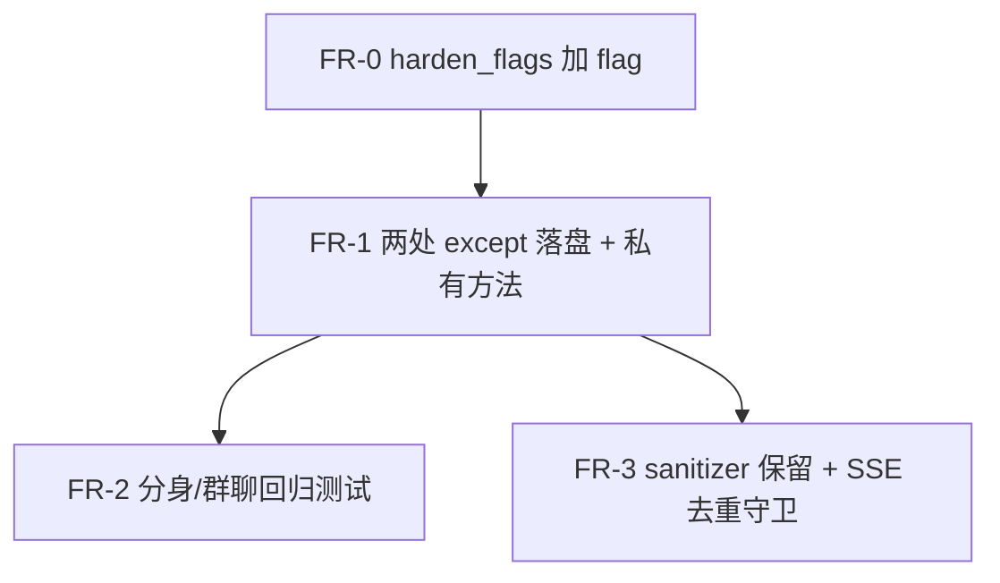

# 取消回答后，已展示前缀要进入模型可见历史

Planned-with: Claude Opus 5 (Cursor)
Suggested-Impl-Model: `gpt-5.x` 档（强推理）——落点在 `agent_runtime.py` 6000+ 行热路径的两个 except 分支，且要改 `_sanitize_context_messages` 的保留语义，属序列/一致性敏感收口；不建议交给便宜档。
Research-Input: `research/codedeepresearch/deepseek-harness/deepseek-harness_delta_2026-08-24.md`（增量笔记 D-001）
Related-Plan: `.cursor/plans/2026-08-14-longrun-runtime-hardening.plan.md`（已交付；本 plan 是其 G-001「中断 closer」的**对侧补丁**，Plan-Id 独立）

> 实施前把本文件移回 `.cursor/plans/` 根目录，再开分支。

---

## 1. 要解决什么

用户点「停止」（或流式看门狗判定用户中断）后：

1. 屏幕上已经出了一截回答，**用户读过了**。
2. 下一句用户接着问「把第二点展开」。
3. 模型看不到那一截 —— 因为它不在 `session.agent_messages` 里。

结果是「人觉得聊到一半，模型觉得上一轮啥也没说」。

### 根因证据链（实施者可自行复核，不依赖任何对话记忆）

| 事实 | 位置 | 现状 |
|---|---|---|
| 下一轮模型上下文的**唯一**来源是 `agent_messages` | `agenticx/runtime/agent_runtime.py` `run_turn` 内 `history = _sanitize_context_messages(session.agent_messages)`（约 L3241） | 不读 `chat_history` |
| 用户中断流式时直接 `return` | 同文件 `except _StreamWatchdogUserStop:` 两处，**L4190**（`stream_with_tools` 路径）与 **L5198**（sync stream 回退路径） | 只 `yield ERROR(STOP_MESSAGE)` 后 `return`，**不写** `agent_messages` |
| Studio SSE 层会补残句，但只补给人看 | `agenticx/studio/server.py` `_finalize_partial_assistant_if_needed`（约 L470–489） | 只 append 到 **`chat_history`**，`metadata.source = "interrupted-partial"` |
| 且该补偿只覆盖 Meta | 同文件 `_accumulate_meta_partial_text`（约 L460–467） | 首行即 `if event.agent_id != "meta" or event.type != EventType.TOKEN.value: return partial` ——**分身窗格与群聊成员连残句都不攒** |
| 完成态判定已把残句排除 | `agenticx/studio/session_manager.py` `_NON_REPLY_ASSISTANT_SOURCES`（L82）、L966、L983 | `interrupted-partial` 不算「本轮已完成答复」。**本 plan 不得改动此语义** |

所以缺口是：**已展示前缀没有进入 `agent_messages`**；且现有补偿只在 SSE 层、只覆盖 Meta。

### 为什么在 runtime 层修（决定「全覆盖」的关键）

本 plan 范围是 **Meta + 分身 + 群聊全覆盖**。不要去扩 `server.py` 的 `_accumulate_meta_partial_text`：

`run_turn` 对所有 agent 共用，`agent_id` 只是入参；两个 stop 分支所在作用域里已经持有本轮累计文本。**在 runtime 层写一次，三种场景自动全覆盖**，比在 SSE 层按 `agent_id` 分叉更省且更不易漏。

---

## 2. In scope / Out of scope

### In scope

- `agenticx/runtime/harden_flags.py`：新增一个 flag 函数
- `agenticx/runtime/agent_runtime.py`：两个 `_StreamWatchdogUserStop` 分支落盘；`_sanitize_context_messages` 加保留规则
- `agenticx/studio/server.py`：`_finalize_partial_assistant_if_needed` 加一个「runtime 已写过就跳过」的守卫（防重复气泡）
- 新增 `tests/test_smoke_cancelled_prefix_finalize.py`

### Out of scope（违反即回退）

- **不改** `_finish_terminal_reply` / `_append_terminal_assistant` 的既有语义
- **不改** `session_manager.py` 的 `_NON_REPLY_ASSISTANT_SOURCES` 与完成态判定（残句仍不算「已完成答复」）
- **不改** `interrupted_closers.py` 及 G-001 的 closer 语义（未配对 `tool_calls` 仍走原路）
- **不动** `desktop/` 任何文件（本 plan 无前端改动；UI 已能渲染 assistant 行）
- **不碰** `server.py` 顶部 import 区；该文件按 `AGENTS.md` 要求只做精确行级增删，禁止整段替换
- 不处理 provider 硬失败（`fault in {"billing","auth",...}`）路径的前缀——那是失败请求，语义不同，本次显式**保持丢弃**
- 不引入 SessionEvent / 事件日志 / 新持久化格式

---

## 3. FR / AC

### FR-0 新增 flag

`agenticx/runtime/harden_flags.py` 末尾（跟在 `fresh_round_loop_enabled` 之后、`group_*` 之前）新增，完全照抄同文件既有写法：

```python
def cancelled_prefix_finalize_enabled() -> bool:
    """``AGX_CANCELLED_PREFIX_FINALIZE`` / ``runtime.cancelled_prefix_finalize``. Default True."""
    return _resolve_bool(
        "AGX_CANCELLED_PREFIX_FINALIZE", "runtime.cancelled_prefix_finalize", True
    )
```

**AC-0**：`tests/test_smoke_cancelled_prefix_finalize.py::test_flag_defaults_on_and_env_off` —— 不设环境变量时返回 `True`；`AGX_CANCELLED_PREFIX_FINALIZE=0` 时返回 `False`。

---

### FR-1 两个用户中断分支落盘已展示前缀

**落点 A**：`agent_runtime.py` **L4190**，`stream_with_tools` 路径

```python
                    except _StreamWatchdogUserStop:
                        yield RuntimeEvent(
                            type=EventType.ERROR.value,
                            data={"text": STOP_MESSAGE},
                            agent_id=agent_id,
                        )
                        return
```

**落点 B**：`agent_runtime.py` **L5198**，sync stream 回退路径（同样的 `except _StreamWatchdogUserStop:` + `yield` + `return` 三行结构，紧跟在 L5190 `streamed_text += str(tok)` 所在的 `async for` 之后）

两处都改成：**先落盘，再 yield，再 return**。

前缀取值（各落点用其作用域内已有变量，不要新建累加器）：

- 落点 A：`str(followup_emitter.raw or response_text or "")`（与同文件约 L4866 既有 `streamed_raw` 取法完全一致）
- 落点 B：`streamed_text`（该分支局部变量，**L5147** 初始化为 `""`；注意 L5222 有同名变量的再次初始化，属另一段逻辑，不要混淆）

落盘逻辑抽成 `AgentRuntime` 的一个私有方法，两处共用：

```python
    def _finalize_cancelled_prefix(
        self,
        session: StudioSession,
        raw_prefix: str,
        *,
        agent_id: str,
        is_system_trigger: bool,
    ) -> bool:
        """Commit the prefix the user already saw into model-facing history."""
        from agenticx.runtime.harden_flags import cancelled_prefix_finalize_enabled

        if not cancelled_prefix_finalize_enabled():
            return False
        parsed = parse_assistant_output(str(raw_prefix or ""))
        body = parsed.visible_body.strip()
        if not body:
            return False
        # agent_messages must stay provider-safe: plain text, no runtime metadata,
        # and never a half-streamed tool_calls payload.
        session.agent_messages.append({"role": "assistant", "content": body})
        if not is_system_trigger:
            _chat_history_append_deduped(
                session.chat_history,
                {
                    "role": "assistant",
                    "content": body,
                    "metadata": {
                        "source": "interrupted-partial",
                        "interrupted": True,
                        "turn_terminal": False,
                    },
                },
            )
        return True
```

关键约束，逐条都要满足：

1. **必须过 `parse_assistant_output`**，写 `visible_body`。半截 `<think>`、只开了头的 `<followups>` 一定要被剥掉——直接把原始流文本塞回上下文会让下一轮解析踩雷。`parse_assistant_output` 已在该文件 import。
2. **`body` 为空则什么都不写**，返回 `False`。纯 reasoning 被打断、或还没吐出可见字就停了，不留空气泡。
3. `agent_messages` 里**只放 `{"role","content"}`**，不带 `metadata`（严格网关如智谱会拒绝额外字段）。这与 `_append_terminal_assistant`（约 L2885）的注释与写法一致。
4. **绝不写 `tool_calls`**。半截工具调用整条丢弃：它还没 dispatch，没有真实结果，写进去会产生无法配对的 `tool_use`。已发出但结果未知的调用继续由 `interrupted_closers.py` 负责，本 plan 不碰。
5. `metadata.source` 沿用既有 `"interrupted-partial"`，**不要发明新值**——`session_manager.py` 的完成态判定依赖它。额外加 `"interrupted": True` 供 FR-3 的守卫识别。
6. `is_system_trigger` 为真时不写 `chat_history`（与该文件其它落盘路径一致）。

**AC-1a**：`tests/test_smoke_cancelled_prefix_finalize.py::test_meta_stream_cancel_commits_visible_prefix` —— 构造一个在吐出 `"部分回答"` 后抛 `_StreamWatchdogUserStop` 的 fake LLM，跑 `run_turn(agent_id="meta")`，断言 `session.agent_messages[-1] == {"role": "assistant", "content": "部分回答"}`。

**AC-1b**：`::test_partial_protocol_markup_is_stripped` —— 前缀为 `"<think>想一半"`，断言写入的 `content` **不含** `<think>`；若 `visible_body` 为空则 `agent_messages` 长度不变。

**AC-1c**：`::test_empty_prefix_writes_nothing` —— 前缀为 `""` 与 `"   "`，断言 `agent_messages` 与 `chat_history` 长度均不变。

**AC-1d**：`::test_no_tool_calls_in_finalized_row` —— 断言写入行不含 `tool_calls` 键。

**AC-1e**：`::test_flag_off_restores_old_behavior` —— `AGX_CANCELLED_PREFIX_FINALIZE=0` 时 `agent_messages` 不变（回滚可用）。

---

### FR-2 分身与群聊同样生效

FR-1 落在 `run_turn` 内，对 `agent_id` 无分支，因此分身与群聊成员天然覆盖。本 FR 只负责**用测试锁住**这个性质，防止后人加 `agent_id == "meta"` 的判断。

**AC-2**：`::test_avatar_and_group_member_cancel_also_commit_prefix` —— 同一 fake LLM，分别以 `agent_id="avatar-x"` 与某群聊成员 id 跑 `run_turn`，断言两者的 `agent_messages[-1]["content"]` 都等于该前缀。测试内**不得**出现 `agent_id == "meta"` 的条件分支。

---

### FR-3 sanitizer 必须保留这类行；SSE 层不得重复写

**改动 3a** —— `agent_runtime.py` `_sanitize_context_messages`（约 L1540 起）。

注意方向：该函数现在会**丢弃**空内容 assistant 行，并**过滤** `metadata.kind in ("turn_interrupted", "continuation_notice", ...)` 的 tool 通知行（约 L1567–1574）。FR-1 写入的是 **assistant 行且 `content` 非空**，因此按现有规则**本就会被保留**。

本改动只做一件事：在该函数的 docstring 规则列表里补一条说明——「被中断的 assistant 前缀行属于真实模型输出，必须保留；它与 `turn_interrupted` 那类 UI 通知行语义相反」。同时新增回归测试锁死。

> 若实施时发现某条既有规则实际会把它丢掉（例如未来新增了按 `metadata.source` 过滤的分支），才允许改代码，且改动必须只针对这一条，不得顺手重构该函数。

**AC-3a**：`::test_sanitizer_keeps_interrupted_prefix_row` —— 把 FR-1 写入的行喂给 `_sanitize_context_messages`，断言输出里仍包含该行；同一份输入里混入一条 `{"role":"tool","metadata":{"kind":"turn_interrupted"}}`，断言后者被过滤。

**改动 3b** —— `agenticx/studio/server.py` `_finalize_partial_assistant_if_needed`（约 L470–489）加守卫。

runtime 现在会写 `chat_history`，SSE 收尾若再写一次，用户会看到**两个残句气泡**。在该函数 `if saw_final: return False` 之后插入：

```python
    history = getattr(session, "chat_history", None) or []
    for row in reversed(history):
        if not isinstance(row, dict):
            continue
        if str(row.get("role", "")).strip() != "assistant":
            continue
        meta = row.get("metadata")
        # Runtime already committed this turn's cancelled prefix.
        if isinstance(meta, dict) and meta.get("interrupted") is True:
            return False
        break
```

只回看到最近一条 assistant 行即 `break`，避免把上一轮的中断残句误判成本轮已写。

**AC-3b**：`::test_sse_finalize_skips_when_runtime_already_wrote` —— 历史尾部已有 `metadata.interrupted is True` 的 assistant 行时，`_finalize_partial_assistant_if_needed(...)` 返回 `False` 且不追加；历史尾部是普通 assistant 行时仍照旧追加（保住旧行为，尤其是 runtime 还没来得及写就崩了的场景）。

---

## 4. 执行顺序



FR-0 极小，由 FR-1 的实施者顺带完成。FR-3 必须在 FR-1 之后（3b 的守卫依赖 FR-1 写入的 `interrupted` 标记）。

---

## 5. 验收门

1. 上述 AC-0 ~ AC-3b 全绿。
2. 既有测试不得回归，至少跑：`tests/test_smoke_interrupted_closers.py`、`tests/test_completeness_truth.py`（含 `_finalize_partial_assistant_if_needed` / `_accumulate_meta_partial_text` 现有断言）、`tests/test_ha_checkpoint_resume.py`、`tests/test_compactor.py`。
3. **改过 `server.py` 就必须冷启动验证**（`AGENTS.md` 强制门槛）：`agx serve --host 127.0.0.1 --port <临时端口>`，确认进程不崩且 `/api/session`、`/api/avatars`、`/api/sessions` 返回 200。
4. 手工回归一次：Meta 单聊发问 → 生成到一半点停止 → 紧接着追问「继续刚才说的」→ 模型应能引用被打断那半截内容。同一流程在一个分身窗格与一个群聊里各做一次。
5. `no-scope-creep`：每个 diff 行都能追溯到上面某条 FR。`agent_runtime.py` 与 `server.py` 的 import 区禁止整段替换。

---

## 6. 回滚

| flag（config key） | env | 默认 |
|---|---|---|
| `runtime.cancelled_prefix_finalize` | `AGX_CANCELLED_PREFIX_FINALIZE` | on |

关掉即回到当前行为：runtime 不写、SSE 守卫因找不到 `interrupted` 标记而照旧补 `chat_history` 残句。

---

## 7. 已知不做（供 review 时对照）

- provider 硬失败流的前缀仍然丢弃。失败轮次没有用户的「停止」决定，保留策略不同，需要单独判断才有意义。
- 不给模型额外插一条「[用户已中断]」提示句。被打断这个事实已由现有 `turn_interrupted` 通知行承载（该行对模型不可见，是有意的）；要不要让模型知道「这段没说完」是独立的产品决定，不在本 plan。
- 不改 `_accumulate_meta_partial_text` 的 `agent_id == "meta"` 过滤。它是 runtime 完全没来得及写时的 SSE 兜底，缩窄或扩大它都会牵动 `test_completeness_truth.py` 的既有断言，收益为零。
