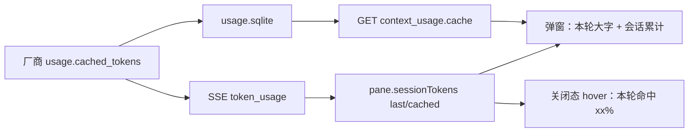

# Desktop 会话缓存命中率可见

Planned-with: Cursor Grok 4.6
Suggested-Impl-Model: `composer-2.5`

> **本 plan 只做「命中率摊到用户眼前」。** 不重做前缀稳定，不预热/保活，不改 `enterprise/`。
> 实施前将本文件移回 `.cursor/plans/` 根目录，再开分支。

---

## Suggested-Impl-Model

| 子规划 | 推荐模型 | 理由 |
|---|---|---|
| FR-1 `cache_stats(session_id)` + last row | `composer-2.5` | 现有 SQLite 查询加两个可选过滤/字段，有现成单测可扩 |
| FR-2 `GET /api/session/context_usage` 附带 cache | `composer-2.5` | 只在 handler 内精确加调用，禁止动 `server.py` 顶部 import |
| FR-3 Desktop 弹窗双卡 + hover 本轮命中 | `composer-2.5` | 改现有 `ContextUsagePopup`，不是视觉重塑 |

---

## 背景与根因（实施者可自行复核）

飞书文 [KV Cache 到一折账单](https://wv18cbjmgi0.feishu.cn/wiki/N6JMwTpzVipABok1CPKceWronuc) 第 7 节「提高命中率的四条军规」：

1. 不变的内容放最前面
2. 同组请求共用同一段前缀
3. 相同前缀的请求相邻发送
4. **用量化指标驱动优化**——厂商 `usage` 里的 hit/cached 必须算成命中率，否则只是玄学

1–3 已在 Wave B 落地（`99276785` session-context / 日期级时间块 / goal-anchor 挂尾；`f513d160` 本地记下 `cached_tokens`）。第 4 条只做到账本，**用户看不见**：

| 已有 | 缺口 |
|---|---|
| `TokenUsage.cached_tokens` + provider 回落 + `usage.sqlite` | `UsageStore.cache_stats()` **不能按 session_id 过滤**，也没有「最近一轮」 |
| `GET /api/session/context_usage` | 只返回占用估算（`used_tokens` / `categories`），**无 cache 字段** |
| SSE `token_usage` 的 `data` 已含 `cached_tokens`（`usage_metadata_from_llm_response` → `server.py` `_runtime_event_to_sse_lines` L351–361） | `ChatPane.tsx` ~L11363 只读 `input_tokens` / `output_tokens`，**丢掉 cached** |
| 输入区「上下文用量」饼图（`ContextUsagePopup.tsx`） | 只有占用 %，hover 也只有 `12.4% · 15.8K / 128.0K` |
| 设置页 `/api/usage/summary` 的 `cached` 字段 | 是全局时间窗汇总，不是「当前这场对话」 |

用户要的体验：开聊后**不用进设置、不用查 sqlite**，在现有用量入口上立刻看到「刚才那一轮命中了没有、这场会话累计多少」。



---

## In scope / Out of scope

**In scope**

- `cache_stats` 增加 `session_id`，并返回该 session **最近一行**的 input/cached/ratio
- `GET /api/session/context_usage` 在占用估算之外附带 `cache` 对象（缺账本时字段为 0，接口仍 200）
- Desktop 用量弹窗顶部改成两卡：左「上下文占用」（现状），右「缓存命中率」（本轮大字 + 会话累计小字）
- 关闭态 hover / `aria-label` 带上本轮命中（有数据才带）
- SSE `token_usage` 把 `cached_tokens` 累进 `sessionTokens`，并记下 last-turn，旧 localStorage 缺字段当 0

**Out of scope**

- 缓存预热 / 闲置保活 / 对抗厂商 LRU
- 再改 `meta_agent.py` / `session_context.py` / ToolSearch / compaction
- `enterprise/`、门户、设置页 Token 看板改版
- `ChatView`（Lite 没有这块用量按钮）
- 把占用饼图改成命中率饼图（饼图语义仍是窗口占用）
- 在聊天气泡里刷每轮命中（噪音）
- 改 `server.py` 顶部 import 区

---

## FR-1 `cache_stats` 按会话 + 最近一轮

**落点：** `agenticx/runtime/usage_store.py` 的 `UsageStore.cache_stats`（约 L138–183）

**Before：** 只接受 `since_ms` / `provider`，对全库或全 provider 求和。

**After：** 增加可选 `session_id: str | None = None`。非空则 `AND session_id = ?`。同一连接再查：

```sql
SELECT input_tokens, cached_tokens
FROM usage_events
WHERE session_id = ?
ORDER BY ts_ms DESC, id DESC
LIMIT 1
```

返回值在现有 5 个 key 上**追加**（旧调用方不传 session 时 last_* 为 0，`cache_ratio` 语义不变）：

```python
{
    "requests": ...,
    "input_tokens": ...,
    "cached_tokens": ...,
    "cache_ratio": ...,          # cached/input，input==0 则为 0.0
    "zero_cache_requests": ...,
    "last_input_tokens": int,    # 无行则为 0
    "last_cached_tokens": int,
    "last_cache_ratio": float,   # last_cached/last_input，last_input==0 则为 0.0
}
```

禁止改表结构。禁止改 `record_sync` / `dashboard_sync`。

**AC-1**（扩 `tests/test_smoke_prompt_cache_observability.py` 的 `test_usage_store_cache_stats`，或同文件新增）：

1. 写入 `s1`（input=2000, cached=768）与 `s2`（input=4000, cached=0）。
2. `cache_stats(session_id="s1")`：`input_tokens==2000`，`cached_tokens==768`，`requests==1`，`last_input_tokens==2000`，`last_cached_tokens==768`。
3. `cache_stats(session_id="s2")`：`cached_tokens==0`，`last_cache_ratio==0.0`，`zero_cache_requests==1`。
4. 不传 `session_id`：仍能看到两行合计（`input_tokens==6000`），行为与现测兼容。
5. 同一 `s1` 再写入一轮 input=3000 / cached=512 后，`last_*` 取新行，累计 `cached_tokens==768+512`。

---

## FR-2 占用接口附带本会话 cache

**落点：** `agenticx/studio/server.py` 的 `get_session_context_usage`（约 L2082–2119）

**约束：** 只在该 handler 函数体内改。`from agenticx.runtime.usage_store import get_usage_store` 写在函数内（与同文件 L7190 的 usage API 一样）。禁止改文件顶部 import。

**Before：** `return {"ok": True, "session_id": session_id, **usage}`，`usage` 只有占用。

**After：** 占用估算仍走现有 `asyncio.to_thread(estimate_session_context_usage, ...)`。cache 另开一次 `to_thread`（或与占用打成同一个同步函数，避免两次线程切换也行，但不要把 sqlite 放进 async 直接查）：

```python
def _load_session_cache(sid: str) -> dict:
    from agenticx.runtime.usage_store import get_usage_store
    raw = get_usage_store().cache_stats(session_id=sid)
    return {
        "session_input_tokens": int(raw.get("input_tokens") or 0),
        "session_cached_tokens": int(raw.get("cached_tokens") or 0),
        "session_cache_ratio": float(raw.get("cache_ratio") or 0.0),
        "last_input_tokens": int(raw.get("last_input_tokens") or 0),
        "last_cached_tokens": int(raw.get("last_cached_tokens") or 0),
        "last_cache_ratio": float(raw.get("last_cache_ratio") or 0.0),
        "requests": int(raw.get("requests") or 0),
        "zero_cache_requests": int(raw.get("zero_cache_requests") or 0),
    }
```

账本异常时 `cache` 仍返回全 0 对象，**不要**让占用接口变 500（占用估算失败保持现有 500）。

响应：

```json
{
  "ok": true,
  "session_id": "...",
  "used_tokens": 15800,
  "max_tokens": 128000,
  "percent": 12.4,
  "categories": {},
  "cache": {
    "session_input_tokens": 390700,
    "session_cached_tokens": 229600,
    "session_cache_ratio": 0.588,
    "last_input_tokens": 15800,
    "last_cached_tokens": 0,
    "last_cache_ratio": 0.0,
    "requests": 12,
    "zero_cache_requests": 3
  }
}
```

不改 `agenticx/studio/context_usage.py` 的占用算法。

**AC-2** 新建 `tests/test_session_context_usage_cache.py`（不要去改 `test_studio_server.py` 的全量起服套件，除非已有轻量 fixture）：

- 用临时 `UsageStore` + `monkeypatch` `get_usage_store`，先 `record_sync(session_id="sid-a", input=1000, cached=400)`。
- 调 `_load_session_cache`（若抽成 `agenticx/studio/context_usage.py` 旁的纯函数更好测；**允许**在 `context_usage.py` **文件末尾**新增 `load_session_cache_payload(session_id: str) -> dict`，`server.py` 只多一行 `from agenticx.studio.context_usage import load_session_cache_payload` 写在 handler 内）。
- 断言 ratio `== 0.4`，`last_cached_tokens==400`。
- 未知 session：全 0，不抛。

改了 `server.py` 后按 AGENTS.md 做隔离 HOME 冷启动：`/api/session`、`/api/session/context_usage?session_id=<已有>` 返回 200，且 JSON 含 `cache`。

---

## FR-3 输入区用量弹窗：本轮命中一眼能看见

**落点：**

- `desktop/src/components/ContextUsagePopup.tsx`（主 UI）
- `desktop/src/components/ChatPane.tsx` ~L11363 `token_usage` 分支（3 行级改动）
- `desktop/src/store.ts`：`sessionTokens` 类型、`accumulatePaneTokens`、`clearPaneMessages` 重置、`upsertSessionTokenCache` / `readSessionTokenCache`
- `desktop/src/App.tsx` ~L156–203 恢复 pane 时兼容缺字段

### 3.1 store：累计 cached + 覆盖 last-turn

`sessionTokens` 从 `{ input, output }` 扩为：

```ts
{
  input: number;
  output: number;
  cached: number;      // 本会话累计 cached（SSE 累加）
  lastInput: number;   // 最近一次 token_usage 的 input（覆盖，不累加）
  lastCached: number;  // 最近一次 token_usage 的 cached（覆盖）
}
```

缺省全 0。`accumulatePaneTokens(paneId, input, output, cached = 0)`：

- `input/output/cached` 累加（与今天 input/output 相同）
- `lastInput` / `lastCached` **赋值为这一次**的 input/cached（不是累加）
- `clearPaneMessages` 与切到新 session 时五字段归零
- `agx-session-token-cache-v1` 读写兼容：旧行没有 `cached` / `last*` 当 0；写入时带上新字段

`ChatPane.tsx` ~L11363：

```ts
if (payload.type === "token_usage") {
  const inp = Number(payload.data?.input_tokens ?? 0);
  const out = Number(payload.data?.output_tokens ?? 0);
  const cached = Number(payload.data?.cached_tokens ?? 0);
  if (inp > 0 || out > 0 || cached > 0) {
    useAppStore.getState().accumulatePaneTokens(pane.id, inp, out, cached);
  }
}
```

禁止改这条分支旁边的 final / compaction / error 逻辑。

### 3.2 弹窗两卡

`ContextUsageButton` 增加从 store 读当前 pane 的 `sessionTokens`（用已有 `paneId`：`useAppStore(s => s.panes.find(p => p.id === paneId)?.sessionTokens)`）。

打开弹窗仍 fetch `/api/session/context_usage`。展示优先级：

| 数字 | 来源 |
|---|---|
| 占用 % / 分项 | 只信 API（与现在相同） |
| **本轮**命中大字 | store 的 `lastInput>0` 用 `lastCached/lastInput`；否则用 API `cache.last_*`；两者都没有则「—」 |
| **会话累计**小字 | API `cache.session_*` 优先（刷新后仍对）；若 API 还是 0 且 store `input>0`，回落 store `cached/input` |

布局（300px 宽已够，不要加宽弹窗）：

- 标题仍是「上下文用量」
- 标题下两列卡片，左占用、右命中，`grid-cols-2 gap-2`
- 右卡大字：本轮命中百分比（一位小数，与占用一致）
- 右卡大字颜色：无数据 `text-text-faint`；`lastInput>0 && ratio==0` 用 `text-text-muted`（真实未命中或厂商没回传，不要用刺眼红）；`ratio>0` 用 `text-emerald-500`（与现有占用条绿色 token 同族）
- 右卡小字：`本轮` 或 `—`；下一行 `累计 {formatK(cached)} / {formatK(input)}`
- 无任何一轮数据时，右卡大字「—」，小字「本轮尚未返回用量」——**禁止把无数据画成 0.0%**
- 分项条与五类列表原样保留，不要插入「缓存」第六类（缓存不是占用分类）

关闭态 hover（`hoverLabel`）在现有占用文案后追加（仅当 `lastInput>0`）：

`12.4% · 15.8K / 128.0K 上下文已使用 · 本轮命中 58.8%`

`aria-label` 同样追加。无 last-turn 时 hover 保持今天的占用-only 文案。

`sessionId` 变化时：现有 `useEffect` 已 refetch；store last-turn 随 `setPaneSessionId` 换 cache 行，不要串台。

**AC-3（手测，写进实施者自检）：**

1. 空会话：用量按钮仍不出现（`ChatPane.tsx` `hasStartedChat` 已守，不要改这个条件）。
2. 发出第一轮且 SSE 带回 `cached_tokens`：不点开饼图，hover 已有「本轮命中」。
3. 点开：左卡占用与现在一致；右卡大字=本轮，小字=累计。
4. 刷新 Desktop / 切走再切回同一 session：右卡累计仍在（API `cache`）；本轮用账本 last row，允许与刷新前最后一次 SSE 一致。
5. 厂商不回 cached（字段 0）：右卡为 0.0% 或「—」按 `lastInput` 规则，占用卡不受影响。
6. 多窗格：A 窗格的命中不得写到 B 的 hover（`paneId` 隔离）。

**AC-4 单测（前端，能跑就跑）：** 若 `desktop/` 已有纯函数测试习惯，把 `formatHitPercent(lastCached, lastInput)` 抽到 `desktop/src/utils/cache-hit.ts`（`lastInput<=0` 返回 `null`，否则返回一位小数 0–100）。用 vitest/现有 runner 测三例：`(0,0)->null`、`(588,1000)->58.8`、`(0,1000)->0`。没有现成 vitest 任务就只抽函数、不新开测试框架。

---

## 验收命令

```bash
PYTHONPATH=. python -m pytest \
  tests/test_smoke_prompt_cache_observability.py \
  tests/test_session_context_usage_cache.py \
  --no-cov --import-mode=importlib -q
```

改 `server.py` 后：隔离 `HOME` 起 `agx serve`，`GET /api/session` 与 `GET /api/session/context_usage?session_id=...` 为 200，后者含 `cache`。

Desktop：在已开聊的窗格点用量饼图，确认两卡；hover 看本轮。

---

## 已知限制（验收时不得粉饰）

1. 命中率是厂商回传的 `cached_tokens / input_tokens`，不是本地估算。厂商不回该字段时会像「0 命中」。
2. 本轮数字在**同一 `/api/chat` 回合里每来一次 `token_usage` 就覆盖**——长工具链会看到「最近一次 LLM 调用」而不是整回合加权（与账本 last row 一致）。累计卡才是整会话加权。
3. 闲置后下次 0 命中是厂商 LRU，本 plan 不修。
4. 设置页全局 Token 看板仍不突出命中率；本 plan 不改那一页。
