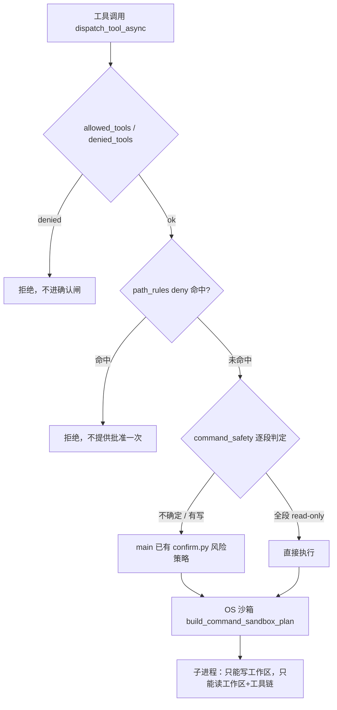

# 回灌主线：命令沙箱与权限强制层

Planned-with: Claude Opus 5
Suggested-Impl-Model: `cursor-grok-4.6-xhigh-fast`

> **这份 plan 只做「让权限承诺在执行路径上真的生效」的后端强制层。**
> Desktop 侧的运行模式词表、风险分级 UI、Pro/Lite 死码清理在姊妹 plan
> `2026-08-25-desktop-permission-ui-consolidation.plan.md`，**不要在本 plan 里做**。
>
> 实施前把本文件移到 `.cursor/plans/` 根目录，再从 `origin/main` 开分支。

---

## 0. 实施者必须先读的基线（不要依赖任何对话记忆）

本 plan 的全部结论来自 2026-08-25 对两个分支的实测。**动手前请自己复核一遍下表**，因为 main 每天在动。

| 项 | 值（2026-08-25 实测） |
|---|---|
| 目标分支 | `origin/main`（tip `db132f40`） |
| 参考源分支 | `origin/hc-0818`（tip `c67f5698`）——**只读参考，禁止 merge，禁止整文件覆盖** |
| 分叉点 | `f44415a7`（2026-07-26） |
| 相关既有 plan | `.cursor/plans/pending/2026-08-22-mainline-port-from-enterprise-branch.plan.md`（Wave A/B/C）。本 plan **不隶属**于它，是它写完之后（8/23–8/25）源分支新产生的一波，见 §0.2 |

复核命令：

```bash
git fetch origin
git log -1 --format='%h %s' origin/main
git log -1 --format='%h %s' origin/hc-0818
git merge-base origin/main origin/hc-0818
```

### 0.1 main 侧现状：有什么，缺什么

**这是本 plan 最重要的一张表。** 「main 已有」的部分**一律不要重做、不要覆盖**。

| 能力 | main 现状 | 缺口 |
|---|---|---|
| 确认闸与风险策略 | **已有** `agenticx/runtime/confirm.py`（`f007c2c3 feat(runtime): keep intercepting protected actions in low-risk auto mode`），配 `tests/test_confirm_risk_policy.py`、`tests/test_confirm_risk_recall.py` | 无。**这一层是 main 自己的实现，本 plan 只在其之上加强制层，禁止替换它** |
| 确认作用域（前端） | **已有** `desktop/src/utils/confirm-scope.ts` + `.test.ts` | 见姊妹 plan |
| 操作系统级沙箱 | **完全没有**（`agenticx/runtime/command_sandbox.py` 在 main 不存在） | Task 1 / Task 5 |
| 命令风险判定 | 只有 `SAFE_COMMANDS` 粗名单（`agenticx/cli/agent_tools.py` **L79**）+ `_bash_exec_is_read_only`（**L158**）+ `_collect_subcommand_risk_reasons`（**L3608**） | Task 2 |
| `permissions.path_rules` | 只能读写，**执行路径上无人检查**（`agenticx/cli/config_manager.py` `PermissionsConfig` **L149–157**；`agenticx/studio/server.py` `/api/permissions` **L7498/L7524**） | Task 3 |
| `permissions.allowed_tools` | 字段存在（`server.py` L7511、L7542）但**没有定义过语义**，运行时不读 | Task 4 |
| 工具调用策略收口 | `dispatch_tool_async`（`agenticx/cli/agent_tools.py` **L8298**）不是策略卡点，绕过路径多 | Task 4 |
| 平台能力如实上报 | 无 | Task 5 |

### 0.2 为什么不 cherry-pick

源分支这一波是 19 个 commit（`19ac1306` → `3503d164`），加 4 个前置（`c223612c` 沙箱基座、`439b4031` Windows 写隔离、`65cb524b` 高危确认、`d5dc0767` 审批作用域）。**全部不在 main。** 但：

1. main 与 hc 在同名文件上已各自大幅演进：`agent_tools.py`（main +754/−117 vs hc +2069/−824）、`server.py`（+873/−57 vs +1622/−331）、`SettingsPanel.tsx`（+657/−416 vs +2324/−1007）。逐 commit cherry-pick 会连环冲突，且极易把 hc 的确认层覆盖掉 main 已有的 `confirm.py`。
2. hc 那一波里 `3c258bbc`（删 Pro/Lite）**夹在权限提交中间**，范围 pick 会把 6 个文件的删除一起拖进来。
3. **结论：按能力语义移植。** 以 hc 源码为权威参考读，用 `git show origin/hc-0818:<path>` 取，落到 main 的当前结构上。**允许**新增文件几乎照搬（`command_safety.py` / `command_sandbox.py` / `path_policy.py` 是自包含新模块），**禁止**用 hc 版本覆盖 main 已演进的 `agent_tools.py` / `server.py` / `confirm.py` / 任何 Desktop 文件。

取参考源：

```bash
git show origin/hc-0818:agenticx/runtime/command_sandbox.py > /tmp/ref_command_sandbox.py
git show origin/hc-0818:agenticx/runtime/command_safety.py  > /tmp/ref_command_safety.py
git show origin/hc-0818:agenticx/runtime/path_policy.py     > /tmp/ref_path_policy.py
```

### 0.3 移植时的代码规范（必须遵守）

hc 源码的 docstring/注释是中文，**与主线 `.cursor/rules/google-python-style.mdc` 冲突**。移植进 main 时：

- 所有 docstring 与注释**改写为英文**，保留原文的论证结构（那些「为什么这么设计」的段落有价值，不要删成一行摘要）
- 每个新文件模块 docstring 末尾保留 `Author: Damon Li`
- 不用相对 import；不在注释/docstring 里放 emoji

---

## 0.4 设计立场（实施者要理解，不只是照抄）

三条贯穿全 plan 的判断，遇到取舍时按这个来：

1. **确认框不是安全边界。** 用户点「批准」之前，进程就已经被操作系统限制在工作区里了。确认框只负责「效果会越出沙箱」或「沙箱内不可逆」这两类事。
2. **过度打扰本身就是安全失效。** 把人训练成闭眼点批准，真正该拦的那次也会被点过去。所以 `sed -n '1,50p' a.py`、`sort`、`jq`、`rg` 不该弹框，而 `find . -delete` 必须弹——旧的粗名单两头都错。
3. **deny 是绝对的，allow 只是免确认。** 用户写下一条 `**/.env` 禁令，不该再被问要不要破例；而一条 `allow` 规则**不能**让路径越出工作区——否则手滑写成 `/**` 就把隔离作废了。



---

## In scope / Out of scope

### In scope

- 新建 `agenticx/runtime/command_sandbox.py`：POSIX/Windows 操作系统级读写隔离
- 新建 `agenticx/runtime/command_safety.py`：复合命令逐段风险判定，取代 `SAFE_COMMANDS`
- 新建 `agenticx/runtime/path_policy.py`：`permissions.path_rules` 的 deny>allow 判定
- `agenticx/cli/agent_tools.py`：bash 执行接沙箱、`dispatch_tool_async` 成为唯一策略卡点、`allowed_tools`/`denied_tools` 语义落地
- `agenticx/cli/config_manager.py`：`PermissionsConfig` 补 read-only 档与沙箱字段
- `agenticx/studio/server.py`：`/api/permissions` 如实返回平台能力两字段（**只改这两个 handler 函数体**）
- `agenticx/project_state/verify.py` + `tools.py`：verify 的 run 也走沙箱
- `agenticx/runtime/meta_tools.py`：委派子会话继承沙箱档位
- 对应 pytest 测试资产（§Task 7 清单）

### Out of scope（严禁顺手做）

- **禁止** `git merge origin/hc-0818`，禁止对这一波做范围 cherry-pick
- **禁止**替换或重写 main 已有的 `agenticx/runtime/confirm.py` 与 `desktop/src/utils/confirm-scope.ts`（main 的 `f007c2c3` 已把「低风险自动执行 + fail-closed」做完了）
- **禁止**碰 `agenticx/studio/server.py` 的**顶部 import 区块**。历史事故：一次无关改动整段替换 import 段，误删 `from agenticx.avatar.group_chat import GroupChatRegistry`，`create_studio_app()` 启动即 `NameError`，Desktop 表现为分身/历史/工作区全空。改该文件只许精确增删目标行，且必须做 §Task 7 的冷启动冒烟
- **禁止**删除 `desktop/src/components/ChatView.tsx`、`CommandPalette.tsx`、`LiteChatView.tsx`、`QuickActions.tsx`、`ShortcutHints.tsx`、`SubAgentPanel.tsx`、`core/command-registry.ts`（那是姊妹 plan 的 gated task）
- **禁止**改 Desktop 的运行模式词表 / `ConfirmDialog.tsx` / `SettingsPanel.tsx` 权限区视觉（姊妹 plan）
- **禁止**碰 `enterprise/`。源分支这一波 0 个 enterprise 文件，本 plan 也是 0
- **禁止**移植 hc 的缓存命中率相关改动（`usage_store.py` / `context_usage.py` / `ContextUsagePopup.tsx` / `cache-hit.ts`）——**main 已经有了**（`e16cb1fc` / `a2b5ffea` / `c11e6d11` / `db132f40`），hc 版是分支适配层（`c67f5698 adapt usage telemetry to the hc runtime`），反向合会倒退
- **不做** deep-research 澄清链路（hc `8214a033` / `7340528d`）——单独 backlog，与本 plan 无依赖

---

## Task 1：操作系统级沙箱基座

**新建：** `agenticx/runtime/command_sandbox.py`（main 无此文件，可基本照搬 `/tmp/ref_command_sandbox.py`，注释改英文）

### 必须落地的公共 API（下游任务依赖这些名字，不要改名）

```python
READ_ONLY = "read-only"
WORKSPACE_WRITE = "workspace-write"        # 默认档
DANGER_FULL_ACCESS = "danger-full-access"  # 显式授权才用
COMMAND_SANDBOX_PERMISSIONS = frozenset({READ_ONLY, WORKSPACE_WRITE, DANGER_FULL_ACCESS})
CONFINED_PERMISSIONS = frozenset({READ_ONLY, WORKSPACE_WRITE})

class CommandSandboxError(RuntimeError): ...
class CommandSandboxUnavailable(CommandSandboxError): ...

@dataclass
class CommandSandboxPlan:
    """argv 前缀 + 环境 + 本次执行专属临时目录。"""

def normalize_command_permissions(value: object) -> str: ...
def build_command_sandbox_plan(...) -> CommandSandboxPlan: ...
```

### 平台实现

| 平台 | 机制 | 参考源函数 |
|---|---|---|
| macOS | `sandbox-exec` + 动态生成的 SBPL profile | `_macos_profile`（ref L730） |
| Linux | `bubblewrap`（`bwrap`） | `_bubblewrap_argv`（ref L791） |
| Windows | MXC ProcessContainer，schema `0.7.0-alpha`，可执行文件路径由 `AGX_WINDOWS_SANDBOX_EXECUTABLE` 覆盖 | `_windows_mxc_argv`（ref L959）、`_windows_readonly_paths`（ref L891） |

**可写集合**：会话 workspace roots + 本次执行专属临时目录（`_private_temp_dir`，ref L377）。
**deny 路径枚举上限** `MAX_ENUMERATED_DENY_PATHS = 512`，超出时不要静默截断——按 Task 3 的降级语义处理。

### 沙箱不可用时怎么办

`bwrap` / `sandbox-exec` 缺失或调用失败 → 抛 `CommandSandboxUnavailable`，调用方**降级为要求确认**，**不许静默直跑**。这条是 fail-closed 的核心，测试会断言它。

### AC-1

新建 `tests/test_command_sandbox.py`（main 已有同名文件？先 `ls tests/test_command_sandbox.py`；有就扩，没有就建）：

1. `normalize_command_permissions` 对 `None` / `""` / 未知值返回 `WORKSPACE_WRITE`；对三个合法值原样返回。
2. `build_command_sandbox_plan(permissions=WORKSPACE_WRITE, workspace_roots=[tmp_path])` 在 macOS/Linux 上返回非空 argv 前缀，且 argv 里出现 `tmp_path`。
3. 强制 `platform_name="unsupported-os"`（或 monkeypatch `shutil.which` 返回 `None`）时抛 `CommandSandboxUnavailable`。
4. 同一 `scope_id` 两次调用拿到的私有临时目录**不同**（不得跨执行复用）。

```bash
PYTHONPATH=. python -m pytest tests/test_command_sandbox.py --no-cov --import-mode=importlib -q
```

---

## Task 2：命令风险逐段判定，退役 `SAFE_COMMANDS`

**新建：** `agenticx/runtime/command_safety.py`（照搬 `/tmp/ref_command_safety.py`，注释改英文）
**修改：** `agenticx/cli/agent_tools.py` — `SAFE_COMMANDS`（**L79**）、`_bash_exec_is_read_only`（**L158**）、`_collect_subcommand_risk_reasons`（**L3608**）

### 根因（写进 plan，实施者可自行复核）

main 现在的判定是「命令名在不在 `SAFE_COMMANDS`」+「整条命令里有没有 shell 元字符」。两条粒度都太粗，结果同时**又吵又漏**：

- 吵：`sed -n '1,50p' a.py`、`sort`、`jq`、`rg`、`diff`、`date`、`stat` 全要人批准，它们一个字节都不写
- 吵：`ls | head` 被判成 high 级 `shell_composition`，尽管两段都在白名单里
- 漏：`find . -delete` 与 `find . -exec rm {} +` **一句都不问**——`find` 在名单上，且没有任何参数检查

粗名单没有能力表达「这条命令的**哪一部分**危险」。

### 必须落地的公共 API

```python
READ_ONLY_COMMANDS: frozenset[str]        # 纯读：ls/cat/grep/rg/jq/sort/diff/stat/date…
GUARDED_COMMANDS: frozenset[str]          # 名字安全但参数可危险：find/git/xargs…
DELEGATING_COMMANDS: frozenset[str]       # 会代跑另一条命令：xargs/env/nohup/timeout…
FIND_UNSAFE_ACTIONS: frozenset[str]       # -delete / -exec / -execdir / -ok…
GIT_READ_ONLY_SUBCOMMANDS: frozenset[str] # status/log/diff/show/rev-parse…

@dataclass
class RiskFinding: ...      # 命中了什么、哪一段
@dataclass
class SafetyVerdict: ...    # contained / requires_approval / opaque + findings

def split_simple_commands(command: str) -> Optional[List[List[str]]]: ...
def classify_simple_command(parts: Sequence[str]) -> SafetyVerdict: ...
def assess_command(command: str) -> SafetyVerdict: ...
def absolute_redirect_targets(command: str) -> List[str]: ...
def categories_requiring_approval(...) -> ...: ...
```

### 判定方法

把复合命令按 `&&` `||` `;` `|` 换行拆成若干简单命令，**逐段判定，全段安全才算安全**。任何可能藏起另一条命令的写法——命令替换 `$(…)`、反引号、进程替换 `<(…)`、后台 `&`——一律返回**不确定（opaque）**，由调用方按受保护处理。

> **宁可退回问一次，也不假装看懂。** `split_simple_commands` 返回 `None` 就是「拆不动」，调用方**不许**把 `None` 当安全。

### `agent_tools.py` 的接线（before / after 意图）

**Before（L158 附近）：**

```python
def _bash_exec_is_read_only(arguments: Dict[str, Any]) -> bool:
    # 取命令名，查 SAFE_COMMANDS，见到元字符就整条判危
```

**After：**

```python
def _bash_exec_is_read_only(arguments: Dict[str, Any]) -> bool:
    from agenticx.runtime.command_safety import assess_command
    verdict = assess_command(str(arguments.get("command") or ""))
    return verdict.is_contained  # opaque -> False
```

`SAFE_COMMANDS`（L79）在所有引用点迁移完之后**删除**。迁移前先 `git grep -n SAFE_COMMANDS -- agenticx/` 列全引用点，逐个改；**不要**留一个「兼容别名」——两套名单并存必然分叉。

`_collect_subcommand_risk_reasons`（L3608）的职责被 `classify_simple_command` 覆盖：保留函数签名给现有调用方，内部改为委托 `command_safety`，不要在两处维护 `find -delete` 这类知识。

### AC-2

新建 `tests/test_command_safety.py`：

| 输入 | 期望 |
|---|---|
| `sed -n '1,50p' a.py` | contained（不需确认）|
| `ls \| head` | contained |
| `rg foo && jq . b.json` | contained |
| `find . -delete` | requires_approval，findings 指向 `-delete` |
| `find . -exec rm {} +` | requires_approval |
| `git status` | contained；`git push` | requires_approval |
| `echo $(rm -rf x)` | opaque |
| `cat a.txt > /etc/hosts` | requires_approval，`absolute_redirect_targets` 含 `/etc/hosts` |
| `xargs rm < list.txt` | requires_approval（delegating）|

另扩 main 已有的 `tests/test_confirm_risk_recall.py`：断言上表「吵」的四条**不再**进确认闸，「漏」的两条**开始**进闸。**不要删** main 已有断言。

```bash
PYTHONPATH=. python -m pytest tests/test_command_safety.py tests/test_confirm_risk_recall.py tests/test_confirm_risk_policy.py --no-cov --import-mode=importlib -q
```

---

## Task 3：`path_rules` 真正生效

**新建：** `agenticx/runtime/path_policy.py`（照搬 `/tmp/ref_path_policy.py`，约 100 行，注释改英文）
**修改：** `agenticx/cli/agent_tools.py` `_resolve_workspace_path`（**L3255**）；`agenticx/runtime/command_sandbox.py`（Task 1 的产物，加 deny 枚举）

### 根因

设置界面对这组规则的承诺是「按 glob 模式匹配文件路径，决定允许或拒绝访问」。但在 main 上它**只被 `/api/permissions` 读写**（`server.py` L7508 / L7539），执行路径上无人检查——是个假开关。

### 两档语义（照抄这段，别自己发明）

- `allow: false`（拒绝）= **绝对拒绝**，在确认闸之前短路，**不提供「批准一次」**。用户写下一条禁令，就不该再被问要不要破例。
- `allow: true`（允许）= **免确认**，不是「放开沙箱」。等价于 `Edit(src/**)`：这条路径上的写不再逐次弹框。它**不能**让路径越出工作区——边界由沙箱和 `_resolve_workspace_path` 负责，一条配置项不该有拆掉隔离的能力。

### 匹配次序：deny 全局优先

设置界面旧文案写的是「首个命中生效」，但那和「deny 是绝对的」自相矛盾：`allow *` 在前、`deny */.env` 在后，`.env` 就被放行了。

```python
def match_path_rules(path, rules) -> tuple[Optional[bool], str]:
    # 1) 先扫全部 deny：任一命中即拒绝，与它排第几无关
    # 2) 都没命中，再按顺序取第一条 allow
    # 3) 全不命中返回 (None, "")
```

畸形规则（非 dict、空 pattern）**跳过而不抛异常**——执行路径上因为一条坏配置整个炸掉，比忽略那条规则更糟。只有显式 `allow: false` 算拒绝，缺省视为允许。Windows 路径同时按原样和正斜杠形式比对。

### 读写一起拒

`**/.env` 这条规则，用户想的是「别碰这个文件」。一条只挡 `rm` 挡不住 `cat` 的规则**保护的是错误的那一半**。所以 deny 条目要同时进沙箱的 read-deny 与 write-deny 枚举。

deny 路径枚举超过 `MAX_ENUMERATED_DENY_PATHS`（512）时：**不要静默截断**。按 `path_deny_enforcement_for_host()` 降级为 `partial` 并在工具返回里说明，Task 5 会把这个状态报到界面。

### AC-3

新建 `tests/test_sandbox_path_deny.py`（hc 侧同名文件 448 行，可参考其用例设计，但断言要对着 main 的实际函数写）：

1. `allow *` 在前、`deny **/.env` 在后 → `.env` 判 **deny**（次序无关）。
2. deny 命中时，调用链**不产生确认请求**（断言没有 pending confirm，而不是断言"用户拒绝了"）。
3. `allow: true` 命中 `src/**` → 免确认，但把路径改成 `../outside/x.py` 仍被 `_resolve_workspace_path` 拒。
4. 一条 `{"pattern": "/**", "allow": true}` **不能**让工作区外的写通过。
5. 畸形规则（`[1, "x", {}, {"pattern": ""}]`）被跳过，不抛异常，其余规则照常生效。
6. `cat` 一个 deny 命中的文件同样被拒（读写对称）。

```bash
PYTHONPATH=. python -m pytest tests/test_sandbox_path_deny.py --no-cov --import-mode=importlib -q
```

---

## Task 4：`dispatch_tool_async` 成为唯一策略卡点

**修改：** `agenticx/cli/agent_tools.py` `dispatch_tool_async`（**L8298**）；`agenticx/cli/config_manager.py` `PermissionsConfig`（**L149–157**）

### 根因

策略检查散在各个工具实现里，等于「每加一个工具就多一条绕过路径」。把闸门收到**所有工具调用都必经**的那一个函数上。

### `allowed_tools` / `denied_tools` 语义（main 目前只有字段，没有定义）

| 字段 | 语义 |
|---|---|
| `denied_tools` | 命中即拒绝，**不进确认闸**（与 path deny 同级） |
| `allowed_tools` | **免确认**白名单，不是「解除沙箱」。命中的工具跳过确认，但仍受沙箱与 path deny 约束 |
| 两者都命中 | **deny 赢** |

`PermissionsConfig` 补字段（保留 main 已有 `path_rules` / `denied_commands` / `denied_tools`）：

```python
allowed_tools: list = field(default_factory=list)
command_permissions: str = "workspace-write"   # Task 1 的三档之一
```

`ConfigManager` 的读取要在**调用时**解析，不要在 import 时固化（main 已有 `_yaml_cache` 习惯，跟着用）。

### 收口顺序（不要打乱）

```
dispatch_tool_async(name, arguments, session):
    1. denied_tools 命中           -> 直接拒绝，返回可读原因
    2. 路径类参数 -> path_rules deny -> 直接拒绝（Task 3）
    3. allowed_tools 命中          -> 标记 skip_confirm
    4. 有副作用的工具              -> 交给 main 已有 confirm.py 判风险
    5. shell 类                    -> command_safety 判定（Task 2）
    6. 真正执行                    -> 套 command_sandbox plan（Task 1）
```

第 4 步**调用** main 现有的 `agenticx/runtime/confirm.py`，**不要**在这里重写风险策略。

### 有副作用的工具要进闸（hc `0983e198` 的那批）

`git grep -n "def .*(" -- agenticx/cli/agent_tools.py` 逐个过一遍写类工具（文件写、移动、删除、skill 管理、MCP 安装、后台 bash 等），确认它们**都**经过 `dispatch_tool_async` 而不是被直接调用。绕过的补进来。

### AC-4

新建 `tests/test_permission_policy_enforcement.py`（hc 侧 1030 行，是这波最重的测试资产，参考其分层设计）：

1. `denied_tools: ["file_write"]` → 调用 `file_write` 被拒，**且没有产生确认请求**。
2. `allowed_tools: ["bash_exec"]` → 一条会写的 bash 不再弹确认，但仍带沙箱 argv 前缀。
3. `denied_tools` 与 `allowed_tools` 同时含某工具 → 拒绝。
4. 沙箱不可用（monkeypatch 抛 `CommandSandboxUnavailable`）→ 降级为**要求确认**，不静默执行。
5. 逐个写类工具参数化：每个都能被 `denied_tools` 拦住（这条防「新工具忘了接闸」回归）。

再新建 `tests/test_permissions_api.py`：`GET/PUT /api/permissions` 往返保真 `allowed_tools` 与 `command_permissions`，未知 key 被忽略而不是 500。

---

## Task 5：macOS / Linux 读隔离，以及如实上报平台差异

**修改：** `agenticx/runtime/command_sandbox.py`；`agenticx/studio/server.py` 的 `get_permissions`（**L7498**）与 `put_permissions`（**L7524**）**函数体内**

### 读侧可读集合

可读 = 工作区根 + 会话显式挂进来的只读引用 + 本次执行专属临时目录 + 系统与工具链前缀（`_toolchain_read_roots`，ref L635）。

**家目录不在其中——`cat ~/.ssh/id_rsa` 必须被拒。** 这是这个 Task 的验收核心。

工具链前缀要覆盖 `PATH` / `NODE_PATH` / 常见语言 SDK 位置（ref `_TOOLCHAIN_PATH_ENV_KEYS` L549、`_HOME_TOOL_CONFIG_NAMES` L583），否则 `node` / `python` 起不来。`_over_broad_read_roots`（ref L613）负责把「整个家目录被某个 env 拖进来」这种过宽项挑出来剔掉。

### 两个平台字段，禁止合并

```python
def shell_read_isolation_for_host(platform_name=None) -> str:   # "full" | "none"
def path_deny_enforcement_for_host(platform_name=None) -> str:   # "full" | "partial" | "none"
```

Windows 目前是 **read=none**（`_windows_readonly_paths` 把整个 `USERPROFILE` 放进 readonlyPaths，好让常用工具链能跑，代价是家目录仍读得到）而 **deny=partial**。

> 合成一个字段就必然有一个平台在说谎。三个平台说同一句话，必然有一个在过度承诺。

`/api/permissions` 的响应里带上这两个字段，界面据此措辞（措辞归姊妹 plan）。

### `server.py` 改动纪律

只在 `get_permissions` / `put_permissions` 两个函数**体内**加读取与字段。`from agenticx.runtime.command_sandbox import ...` 写在**函数内部**（与该文件 L7190 附近 usage API 的既有写法一致）。**禁止碰文件顶部 import 区块。**

### AC-5

新建 `tests/test_sandbox_read_isolation.py`：

1. macOS/Linux：在沙箱内 `cat` 一个家目录下的文件（测试自己造，如 `~/.agx-read-probe`）→ 失败。
2. 同一沙箱内 `cat` 工作区里的文件 → 成功。
3. `python -c "print(1)"` / `node -e "console.log(1)"`（可用则测，否则 skip）→ 成功，证明工具链前缀没被误封。
4. `shell_read_isolation_for_host("Windows")` == `"none"`；`("Darwin")` == `"full"`。
5. `path_deny_enforcement_for_host("Windows")` == `"partial"`。
6. 两个函数**不是**同一实现（防止后来有人图省事合并）。

```bash
PYTHONPATH=. python -m pytest tests/test_sandbox_read_isolation.py --no-cov --import-mode=importlib -q
```

---

## Task 6：verify 与委派子会话的接线

**修改：** `agenticx/project_state/verify.py`、`agenticx/project_state/tools.py`、`agenticx/runtime/meta_tools.py`

1. `verify.py` 里跑用户配置的校验命令的那条路径，同样套 `build_command_sandbox_plan`——verify 不是特权通道。
2. `meta_tools.py` 的 `_run_delegation_in_avatar_session`：分身子会话**继承**主会话的 `command_permissions` 与 `path_rules`，不得回落到更宽档位。（该函数已有 `taskspaces` / `context_files` 继承的先例，照同一处理。）

### AC-6

新建 `tests/test_verify_run_sandbox.py`：

1. verify 命令在 `WORKSPACE_WRITE` 下写工作区外 → 失败。
2. verify 命令写工作区内 → 成功。
3. 委派到分身后，子会话拿到的档位 == 主会话档位（不是默认值）。

---

## Task 7：收口验证与提交

### 7.1 全量测试

```bash
PYTHONPATH=. python -m pytest \
  tests/test_command_sandbox.py \
  tests/test_command_safety.py \
  tests/test_sandbox_path_deny.py \
  tests/test_sandbox_read_isolation.py \
  tests/test_permission_policy_enforcement.py \
  tests/test_permissions_api.py \
  tests/test_verify_run_sandbox.py \
  tests/test_confirm_risk_policy.py \
  tests/test_confirm_risk_recall.py \
  tests/test_agent_tools.py \
  --no-cov --import-mode=importlib -q
```

期望：全绿。**main 已有的 `test_confirm_risk_policy.py` / `test_confirm_risk_recall.py` 一条都不许因本 plan 变红**——它们是 main 那层确认策略的护栏。

再跑一次收集，确认没引入 import 期副作用：

```bash
PYTHONPATH=. python -m pytest tests/ --collect-only -q
```

期望：0 collection error。

### 7.2 `agx serve` 冷启动冒烟（强制门槛，改过 `server.py` 就必须做）

```bash
AGX_HOME_TMP=$(mktemp -d)
HOME="$AGX_HOME_TMP" agx serve --host 127.0.0.1 --port 18771 &
sleep 12
for p in /api/session /api/avatars /api/sessions /api/permissions; do
  printf "%-20s" "$p"
  curl -s --noproxy '*' -o /dev/null -w "%{http_code}\n" "http://127.0.0.1:18771$p"
done
```

期望：进程不崩，四个都 200，`/api/permissions` 的 JSON 含 `shell_read_isolation` 与 `path_deny_enforcement`。

> 若表现是「Desktop 分身/历史/工作区全空」但没人删过数据，**第一优先级是查 `agx serve` 是否存活**（`~/.agenticx/serve.port` 对应端口在不在监听），不要先怀疑数据丢失。

### 7.3 Desktop 侧最小回归

本 plan 只碰后端，但 `/api/permissions` 响应变了。启动 Desktop 确认设置里权限区**不崩**（新字段未被消费也不该白屏）。视觉与文案归姊妹 plan。

### 7.4 提交分组

一个 Task 一个 commit，顺序即 Task 顺序（Task 1 必须最先，其他都依赖它）：

```
feat(runtime): confine shell commands with an OS-level sandbox
feat(runtime): judge command risk segment by segment
feat(runtime): enforce path_rules deny on reads and writes
feat(runtime): make dispatch_tool_async the single policy chokepoint
feat(runtime): confine reads to the workspace on macOS and Linux
feat(runtime): run verification and delegated sessions under the same sandbox
```

每个 commit 的 trailer（顺序固定，只许这五个）：

```
Plan-Id: 2026-08-25-mainline-port-command-sandbox-and-permissions
Plan-File: .cursor/plans/2026-08-25-mainline-port-command-sandbox-and-permissions.plan.md
Plan-Model: Claude Opus 5
Impl-Model: cursor-grok-4.6-xhigh-fast
Made-with: Damon Li
```

若实际实施换了模型，`Impl-Model` 以实际使用为准，不要照抄本行。

subject/body **禁止**出现客户名、交付产品名、第三方产品名，以及「对齐 X / 对标 X / X-style」这类对标措辞。改动动机只写本产品行为变化。

---

## 总验收

| ID | 断言 |
|---|---|
| AC-G1 | `SAFE_COMMANDS` 在 `agenticx/` 中零引用（`git grep -c SAFE_COMMANDS -- agenticx/` == 0） |
| AC-G2 | `sed -n '1,50p' x.py`、`ls \| head`、`jq`、`rg` 不再弹确认 |
| AC-G3 | `find . -delete`、`find . -exec rm {} +` 会弹确认 |
| AC-G4 | 一条 `deny **/.env` 使 `cat .env` 与 `rm .env` **都**失败，且都不产生确认请求 |
| AC-G5 | 一条 `allow /**` 不能让工作区外的写通过 |
| AC-G6 | macOS/Linux 沙箱内读家目录失败，读工作区成功，`node`/`python` 仍可执行 |
| AC-G7 | 沙箱不可用时降级为确认，不静默执行 |
| AC-G8 | main 已有 `confirm.py` 与 `confirm-scope.ts` 未被替换，其测试全绿 |
| AC-G9 | `agx serve` 隔离 HOME 冷启动，四个 API 200 |
| AC-G10 | `git diff --stat origin/main..HEAD -- enterprise/` 为空 |
| AC-G11 | 六个 Pro/Lite 相关 Desktop 文件仍存在（未被本 plan 删除） |

---

## 已知限制（验收时不得粉饰）

1. **Windows 没有读隔离。** `USERPROFILE` 仍在 readonlyPaths 里，家目录读得到。这是为了让工具链能跑的自觉取舍，`shell_read_isolation_for_host` 会如实报 `none`，不要在界面上说成"三平台一致"。
2. **deny 枚举有上限。** 超过 512 条时降级为 `partial`，界面必须说出来。
3. **opaque 判定会略吵。** 命令替换、进程替换一律退回确认。这是有意的：假装看懂的代价比多问一次高。
4. **沙箱不防网络。** 本 plan 只做文件系统隔离，出网管控不在范围内。
5. **`command_safety` 的名单是启发式。** 它比旧 `SAFE_COMMANDS` 细，但不是形式化验证；新工具/新命令需要持续补名单，AC-4 第 5 条的参数化测试是防回归的那道网。
