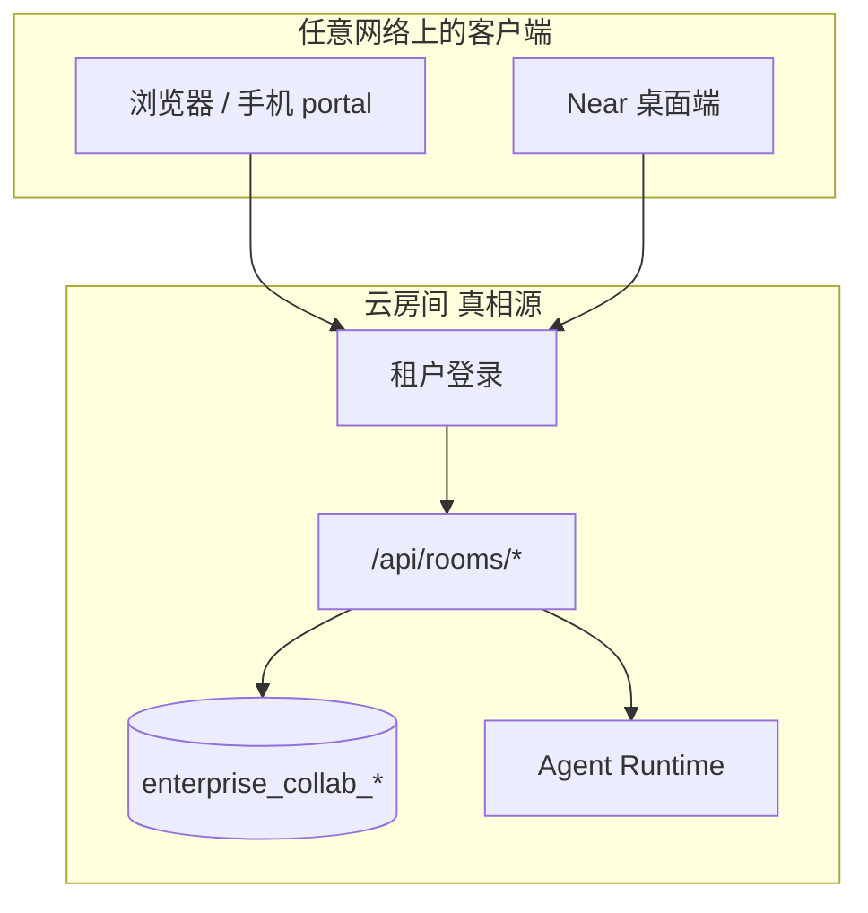
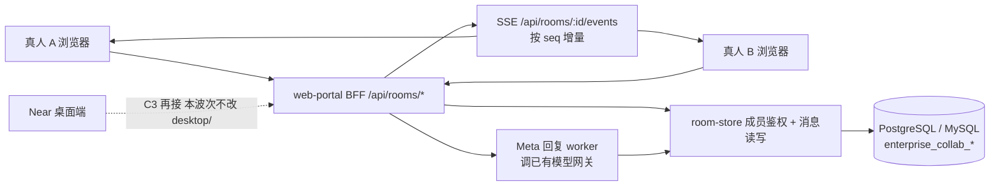

# 多真人协作房间（Collab Room）落地总规划

Planned-with: claude-opus-5

**Goal:** 做成「多个真人 + 智能体在同一个房间里协作」。房间、成员、消息的真相源在云端共享库（PG），不在某台电脑上。浏览器 / 手机 / Near 桌面端都是同一间房的客户端。

**本波次（C1 可执行细化）只交付 web-portal 这一个客户端。** Near 桌面端**不是产品外**，而是上位 plan 的 **C3**：本波次一行都不改 `desktop/`，避免把本机单人群聊和云房间搅在一起。个人聊天历史语义完全不变。

**与既有 plan 的关系（必须先读）：**

| 文件 | 关系 |
|---|---|
| `.cursor/plans/pending/2026-08-13-cloud-project-room.plan.md` | **上位产品总规划，仍有效。** 本文件是它 `Phase C1` 的可执行细化 + 机制定型，不替代其 C2/C3/C4 阶段目标 |
| `.cursor/plans/pending/2026-08-13-multi-human-agent-project-room.plan.md` | 已被上者标记 architecture superseded（LAN/H5 路线），**不要实施** |
| `.cursor/plans/pending/2026-08-13-project-room-phase1-h5.plan.md` | 已作废，**不要实施** |

**证据基线（不依赖对话记忆）：** 本规划的机制选择来自两次上游源码调研，结论与精确行号见：

- `research/codedeepresearch/macro/macro_source_notes.md`（上游 SHA `157875e43db64a4a763aa2289a835016755e4cca`）——已在生产实现多真人房间的参照系
- `research/codedeepresearch/tutti/tutti_source_notes.md`（上游 SHA `97914ef9a1ffdfecf65d5a2e7938785ec5296664`）——只做到「单人 + 多 Agent」，跨人未闭环

（`research/` 已被仓库 `.gitignore` 忽略；这两份文档只在本机。若实施者看不到，本 plan 正文已把需要的结论全部内联，不必回读。）

---

## 一、四条机制定型（照抄这四条，不要自己发明）

这四条是从上游可运行实现中核验出来的，直接决定表结构与查询写法。

### M1 · 房间是成员表，不是「会话所有者」

可见性判定一律是「**当前调用者在该房间有活跃成员行**」，绝不是 `user_id = 调用者`。

- 成员行带 `left_at`；**离开只写 `left_at`，不删成员行、不删房间数据**。
- 所有读写查询用 `left_at IS NULL` 判活跃。
- 上游同样做法：`comms_channel_participants` + `left_at IS NULL`（见 macro source notes E-002 / E-005）。

**为什么不 hard delete：** 保留「谁曾在房间」用于审计与历史归属；靠 join 失效来收回可见性，比级联删数据安全得多。

### M2 · 引用只授「可见」，且调用者必须先有权

未来做「在房间里 @ 一个文档/附件」时（**本波次不做**，见 Out of scope）：

- 只有当调用者**自己已经能访问**该对象，才把它对房间授权；
- 授权档位只给**只读**，不给编辑；
- 已存在则跳过，不降级也不升级。

上游对应 E-004。本波次先把这条写进设计约束，避免第二波实施时发明「@ 一下就给所有人编辑权」。

### M3 · 消息顺序用房间内单调 `seq`，不用时间戳

多真人并发写入时 `created_at` 会撞、会乱序、也无法做「拉取自 X 之后的增量」。

- 每条消息带 `seq bigint`，在房间内单调递增，唯一。
- 客户端增量拉取与 SSE 断线重连都以 `seq` 为游标。
- 分配方式见子 plan 01/02（事务内 `max(seq)+1`，唯一索引兜底）。

### M4 · 聊天扇出与文档共编是两套东西

上游把「频道消息实时」和「文档 CRDT」拆成两条基础设施（Redis pub/sub 网关 vs 每文档一个有状态房间 + CRDT，见 E-007 / E-010）。

**本波次只做聊天扇出**。多人同时编辑同一文档（CRDT / Loro / Durable Object 那一类）**明确不做**，也不要为它预留抽象层。

---

## 二、目标架构

### 2.1 产品终态（上位 plan 已定，本文件不改这条）

房间在云上。Near / 浏览器 / 手机打开的是**同一 `room_id`**，不是各开一份本地副本。



Near 在终态里的角色是**客户端**，不是房间宿主：本机 `agx serve` 不再当云房间的 HTTP 入口。需要碰本机磁盘 / GUI 时，才作为可选 Edge 挂上去（上位 C4，本波次不做）。

### 2.2 本波次实际落地（只做实线）



**执行面边界：** 本波次的「智能体」只有 Meta，且只做一次无工具补全（走已有 `/api/chat/completions` 同源的网关调用方式）。真正的多分身工具循环属于上位 plan 的 C2。Near 接同一套 `/api/rooms/*` 属于 C3。

### 2.3 为什么本波次不改 Near（实施者勿自行「顺手接桌面」）

Near **今天做不到当多真人房间的宿主**，现有「远程模式」也**不是**云房间：

| 现状 | 含义 | 和云房间的关系 |
|---|---|---|
| 默认 Electron 拉起本机 `agx serve`（`127.0.0.1` 随机端口） | 单人本地工作区；群聊真相源是本机 `~/.agenticx/groups` / sessions | 电脑关机 / 不在同一网段，别人进不来 |
| `remote_server`（`.cursor/plans/2026-03-24-desktop-remote-backend.plan.md`） | 桌面壳连**另一台** `agx serve` | 仍是单人 Studio，没有租户成员表，也没有 `enterprise_collab_*` |
| `enterprise.base_url` / capability sync | 从门户同步托管 MCP / 技能 | **不是**登录租户后列出云房间 |

所以：

1. **先把房间建在已有租户身份的 portal 上**（登录、`tenantId` / `userId`、PG 都现成）。两个真人现在就能用浏览器验收「同一间房」。
2. **Near 接入 = 换数据源，不是在本机再造一间房。** C3 要做的是：Near 用同一套 IAM 登录 → 拉云 `room_id` 列表 → 读写 `/api/rooms/*`。本机群聊 yaml 继续只服务个人/离线模式，不得冒充云房间真相源。
3. **本波次改 `desktop/` 风险不对等。** 桌面群聊、多窗格、session 隔离已经很重；此刻接线会把「本机群」和「云房间」状态串台。上位 plan 把 Desktop 明确放到 C3，本文件遵守。

**C3 预告（只写约束，本波次不实施、不开 Desktop 文件）：**

- Near 打开的「协作房间」= 云 `enterprise_collab_rooms.id`，成员判定仍走 M1（活跃成员行），不得用本机 `avatar_id` 冒充租户用户。
- 消息游标仍用房间 `seq`，与 portal SSE 同一协议。
- 禁止把云房间消息写入本机 `messages.json` 再当个人历史；也禁止把本机群聊会话 ID 映射成云 `room_id` 凑合。
- `remote_server` 继续只表示「连远程 agx serve」，不要复用成「连云房间」。云房间走门户/IAM，另开配置项（名称留给 C3 plan）。

---

## 三、现状基线（实施者可直接信任，无需重新摸查）

**可复用：**

- 登录与租户：`enterprise/apps/web-portal/src/lib/session.ts` 的 `getSessionFromCookies()` / `getWorkspaceSessionFromCookies()`；`AuthContext` 含 `tenantId` / `userId` / `deptId` / `scopes`（`enterprise/packages/auth/src/types.ts:15-21`）
- 统一错误响应：`enterprise/apps/web-portal/src/lib/chat-history-http.ts` 的 `chatHistoryUnauthorized` / `chatHistoryForbidden` / `chatHistoryNotFound` / `chatHistoryBadRequest` / `chatHistoryServerError`（**可直接复用，不要新造一套错误码**）
- SQL 抽象：`enterprise/apps/web-portal/src/lib/chat-history/sql-store.ts:19-30` 的 `SqlDialect` / `SqlClient` / `SqlResult`；PG 实现 `chat-history/postgresql.ts:25-55`（含 `transaction()`），MySQL 实现 `chat-history/mysql.ts`
- 方言选择：`resolveDatabaseConfig()`（来自 `@agenticx/iam-core`），用法见 `lib/chat-history.ts:23-35`
- SSE 参考实现：`enterprise/apps/web-portal/src/app/api/chat/deep-research/runs/[runId]/stream/route.ts`（`ReadableStream` + 轮询 + `safeEnqueue` + abort 处理），**本波次的房间事件流照这个骨架写**
- 表结构规范：`enterprise/packages/db-schema/src/schema/_shared.ts`（`ulid()` = varchar(26)，`auditColumns`）；参考样板 `src/schema/user-groups.ts` 与 `drizzle/0047_enterprise_user_groups.sql`

**没有（本波次要新建）：**

- 任何房间/多真人成员表
- 房间 API、房间 UI
- 跨请求的消息实时扇出（现有 SSE 只服务发起者自己的 deep-research run）

**明确不能动（红线）：**

- `chat_sessions` / `chat_messages` 的 `tenant_id + user_id` 语义与所有相关查询（`sql-store.ts` 的 `ownedSession` / `listChatSessions` 等）。个人助手历史保持单人私有。
- `enterprise/apps/admin-console`（后台）与 `desktop/`（Near 桌面端）：本波次一行都不改。Near 接云房间是上位 C3，不是「不做」。

---

## 四、子 plan 与执行顺序

严格按顺序，每个子 plan 独立可验收（typecheck + 对应测试绿）后再进下一个。

| 序 | 文件 | 交付 | 依赖 |
|---|---|---|---|
| 01 | `2026-08-28-collab-room-01-schema.plan.md` | 三张表 × 两方言 + 迁移 + 清单测试更新 | — |
| 02 | `2026-08-28-collab-room-02-store-authz.plan.md` | `room-store`：成员鉴权 + 消息读写 + `seq` 分配 | 01 |
| 03 | `2026-08-28-collab-room-03-http-api.plan.md` | `/api/rooms/*` REST | 02 |
| 04 | `2026-08-28-collab-room-04-realtime-fanout.plan.md` | `/api/rooms/:id/events` SSE 增量 | 03 |
| 05 | `2026-08-28-collab-room-05-portal-ui.plan.md` | `/rooms` 前台页面 | 03（04 可选） |
| 06 | `2026-08-28-collab-room-06-meta-reply.plan.md` | 房间内 Meta 回一条 | 03 |

### 子规划 → 推荐实施模型

用户已指定本批由 **Grok 4.6** 实施，因此各子 plan 的 `Suggested-Impl-Model` 统一为 `cursor-grok-4.6-xhigh-fast`。同时每份子 plan 仍须满足「Composer 2.5 不看对话也能独立完成」的最低细节门槛。

| 子规划 | 风险点 | 备注 |
|---|---|---|
| 01 schema | 迁移编号与清单测试强断言，改错即红 | 编号已在子 plan 里钉死 |
| 02 store/authz | **安全敏感**：可见性判定写错 = 越权看到别人房间 | 必须有「非成员一律不可见」的单测 |
| 03 http api | 错误码与既有 portal 约定一致 | 复用 chat-history-http |
| 04 realtime | 断线重连不能丢消息也不能重复 | 以 `seq` 为唯一游标 |
| 05 ui | 不得改 `enterprise/features/chat` 的个人聊天 store | 房间 UI 自带轻状态 |
| 06 meta reply | 不要在这里做工具循环 | 一次补全即止 |

---

## 五、In scope / Out of scope（总规划层，子 plan 不得越界）

**In scope（本波次）：**

- 新建 `enterprise_collab_rooms` / `enterprise_collab_room_members` / `enterprise_collab_room_messages`（PG + MySQL 双方言）
- 房间 CRUD（建/列/详情）、成员增删（加入/移出/离开）、消息读写
- 基于活跃成员的可见性鉴权（M1）
- 房间消息 SSE 增量推送（单实例可用；多实例升级路径写进子 plan 04 的备注）
- portal 新增 `/rooms` 页面
- 房间内 Meta 单次回复

**Out of scope（明确不做，做了算越界）：**

- 改动个人 `chat_sessions` / `chat_messages` 任何查询或语义
- 多人同时编辑同一文档（CRDT / Loro / Durable Object 类方案）
- 房间附件与对象存储改造（现有附件仍是 `storage_driver='fs'`，见 `enterprise_chat_attachments`；房间附件属于下一波）
- 房间内 @ 引用文档/邮件/任务并自动授权（机制已定型为 M2，实施在下一波）
- 多分身工具循环 / 云端 agent runtime（上位 plan C2）
- Near / Desktop 接入云房间（上位 plan C3：同一 `/api/rooms/*` + IAM，不当房间宿主）、Edge 派发（C4）
- Redis / 消息队列作为硬依赖（子 plan 04 先用轮询式 SSE，Redis 留作扩容项）
- admin-console 任何页面
- 修改 `agenticx/studio/server.py`（Python 后端不参与本波次）

---

## 六、跨子 plan 的共同约束

1. **no-scope-creep**：每个改动都要能追溯到某条 FR。顺手重构既有 chat 代码属于违规。
2. **双方言对齐**：任何新表必须同时加 `src/schema/` 与 `src/mysql-schema/`，并在两个 `index.ts` 导出，否则 `schema-parity.test.ts` 会红。
3. **面向用户文案**：房间 UI 与错误提示不得出现仓库路径、表名、`policy-snapshot.json` 类运维细节。
4. **中文界面**：portal 房间 UI 面向中文用户，按钮/状态用中文。
5. **不 mock**：接口必须真写库；失败要明确报错，禁止「点了看似成功但没落库」。
6. **不改包管理**：不新增运行时依赖（本波次不需要）。

---

## 七、FR / NFR / AC 总表（追溯用）

| ID | 陈述 | 子 plan |
|---|---|---|
| FR-1 | 房间、成员、消息持久化在共享数据库，双方言可用 | 01 |
| FR-2 | 可见性由「活跃成员行」判定，非成员读写均被拒 | 02, 03 |
| FR-3 | 离开房间只写 `left_at`，不删除成员行与消息 | 01, 02 |
| FR-4 | 消息在房间内有单调唯一 `seq`，支持增量拉取 | 01, 02 |
| FR-5 | 两个不同账号可在同一房间互见对方消息 | 03, 05 |
| FR-6 | 房间消息可经 SSE 增量推送，断线以 `seq` 续传 | 04 |
| FR-7 | 房间内 Meta 可回复一条，落库并对全体成员可见 | 06 |
| NFR-1 | 个人 `chat_sessions` 语义与查询零改动 | 全程 |
| NFR-2 | 房间不出现在个人「我的会话」列表中 | 03, 05 |
| NFR-3 | 单实例下 SSE 延迟 ≤ 2s；多实例需要外部扇出（本波次不实施，须在子 plan 04 文档化） | 04 |
| AC-终态 | 两个账号登录同一租户，进同一房间：A 发言 B 在 ≤2s 内看到；@Meta 后房间出现助手回复；B 被移出后再访问该房间返回 403 | 03–06 |

---

## 八、验收命令（每个子 plan 结束时都要跑）

```bash
# 类型与构建（在 enterprise/ 下）
pnpm -C enterprise typecheck

# 相关单测
pnpm -C enterprise/packages/db-schema test        # 子 plan 01
pnpm -C enterprise/apps/web-portal test           # 子 plan 02-06
```

需要真库的端到端验收（子 plan 03 起）：

```bash
bash enterprise/scripts/start-dev-with-infra.sh   # 先拉起 PG/Redis 等中间件
```

未拉起中间件就报 `chat history operation failed` 类错误属于环境问题，不要当成代码 bug 去改代码。
