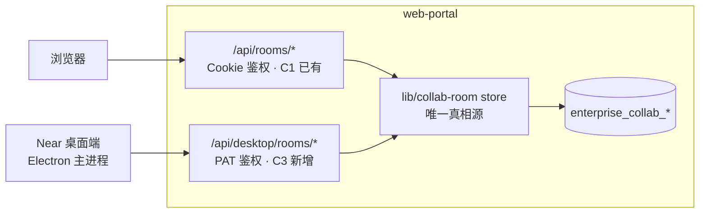

# C3 · Near 桌面端接入云协作房间（总规划）

Planned-with: claude-opus-5

**Goal:** 让 Near 桌面端打开的「协作房间」就是 web-portal 里那一间 —— 同一个 `enterprise_collab_rooms.id`、同一条 `seq` 序列、同一份成员表。桌面端是**客户端**，不是房间宿主。

**上位关系：** 本文件是 `.cursor/plans/pending/2026-08-13-cloud-project-room.plan.md` 的 **Phase C3** 可执行细化。C1（web-portal 客户端 + 表 + API + SSE + Meta 单轮回复）已实施并合入，commit `68a044e1`，plan 见 `.cursor/plans/2026-08-28-collab-room-master.plan.md` 与 01–06 子 plan。

**C3 不等于 C2。** C2 是「云端 Agent Runtime（真工具循环 / 多分身）」，与本波次无关；房间里的智能体在 C3 仍然只有 Meta 单轮无工具回复，且该回复仍由 **portal 侧** 触发（C1 已实现），桌面端不重复实现一份。

---

## 一、四条机制继续沿用（C1 已定型，禁止在桌面端另发明一套）

| | 机制 | 桌面端必须遵守的形态 |
|---|---|---|
| M1 | 房间可见性 = 活跃成员行（`left_at IS NULL`） | 桌面端**不做**本地权限判断，一律以 portal 返回的 200/403 为准 |
| M2 | 引用只授只读 | 本波次仍不做房间内附件 / @ 文档 |
| M3 | 消息顺序用房间内单调 `seq` | 桌面端增量拉取与断线重连一律用 `seq` 游标，禁止用时间戳排序 |
| M4 | 只做聊天扇出 | 不做 CRDT / 文档共编 |

新增第五条，只对 C3 生效：

### M5 · 云房间与本机会话是两套存储，桌面端不得互相冒充

- 云房间消息**只**留在 `enterprise_collab_room_messages`（云库）。**禁止**把云房间消息写进 `~/.agenticx/sessions/<id>/messages.json`，也禁止写进 `WorkspaceMemoryStore` / FTS 索引。
- 本机群聊（`~/.agenticx/groups/*.yaml` + `agenticx/avatar/group_chat.py`）继续只服务个人 / 离线模式，**禁止**把本机 group id 映射成云 `room_id` 凑合。
- 云房间不出现在「历史会话」面板（`desktop/src/components/SessionHistoryPanel.tsx`）里。它有自己的入口，理由与 C1 里「房间不塞进我的会话」一致。
- `remote_server`（`~/.agenticx/config.yaml`）继续只表示「连远程 `agx serve`」。云房间走 `enterprise.base_url` + `enterprise.token`，**不复用** `remote_server`。

---

## 二、为什么走 PAT，而不是让桌面端登录 portal 的 Cookie

C1 的房间 API 全部经 `getSessionFromCookies()`（`enterprise/apps/web-portal/src/lib/session.ts:124`）鉴权，读的是 httpOnly Cookie `agenticx_access_token`。Electron 主进程用 `proxyAwareFetch` 打过去时没有这套 Cookie，也不该去模拟浏览器会话。

仓库里已经有**现成且在用**的桌面鉴权通道，直接复用：

| 已有件 | 位置 | 现状 |
|---|---|---|
| 桌面设备授权 → 签发 PAT | `enterprise/apps/web-portal/src/app/api/desktop/auth/device/*`、`.../auth/token/route.ts` | 已实现，PAT 形如 `agx-pat-*`，落 `api_tokens` 表 |
| PAT → portal 身份 | `enterprise/apps/web-portal/src/lib/desktop-auth.ts:26` `resolveDesktopIdentity(request)` | 已实现，返回 `{ userId, tenantId, deptId, email, displayName, tokenId, scopes }` |
| PAT 消费方范例 | `enterprise/apps/web-portal/src/app/api/desktop/bootstrap/route.ts:14`、`.../desktop/capabilities/route.ts:17` | 已实现，401 用 `{ code: "40101", message: "企业登录已失效，请重新登录" }` |
| 桌面端已持有 PAT 与门户地址 | `desktop/electron/main.ts` `AgxConfig.enterprise`（约 L323–330：`enabled` / `base_url` / `token`） | 已实现 |
| 桌面端已在用 PAT 打门户 | `desktop/electron/main.ts:2022` `proxyAwareFetch(\`${portal}/api/desktop/bootstrap\`, { headers: { Authorization: \`Bearer ${token}\` } })` | 已实现 |

**结论：C3 的服务端工作 = 在 `/api/desktop/rooms/*` 下开一套 PAT 鉴权的房间接口，复用 C1 的同一个 store（`enterprise/apps/web-portal/src/lib/collab-room/index.ts`）。**

**禁止**改动 C1 的 Cookie 路由（`enterprise/apps/web-portal/src/app/api/rooms/**`）去「顺带支持 Bearer」。两套入口、一套 store、一份数据，是本波次的核心形状。

---

## 三、子规划拆分

| 子 plan | 范围 | 推荐实施模型 |
|---|---|---|
| `2026-08-29-collab-room-c3-01-portal-desktop-api.plan.md` | portal 新增 `/api/desktop/rooms/*`（PAT 鉴权，含 SSE），复用 C1 store | 代码专精中档（如 Codex 系列）——后端接线 + 鉴权，逻辑清晰但安全敏感 |
| `2026-08-29-collab-room-c3-02-desktop-bridge.plan.md` | Electron 主进程 IPC + preload + 类型声明，把房间读写代理到门户 | 强推理档（如 GPT-5.x）——主进程/IPC 易与既有连接模式串台 |
| `2026-08-29-collab-room-c3-03-desktop-ui.plan.md` | 渲染进程「云房间」入口与房间视图 | Composer 2.5 / Fast 档——列表 + 气泡 + 输入的样板 UI |

**实施顺序必须是 01 → 02 → 03。** 01 不完成时 02 无接口可打；02 不完成时 03 无 IPC 可用。每个子 plan 各自可独立提交（自带测试与 AC）。

---

## 四、In scope（C3 整体）

- portal：`/api/desktop/rooms` 列表、`/api/desktop/rooms/:roomId`、`.../messages`（GET + POST）、`.../events`（SSE）、`.../members`（GET）
- Electron 主进程：`collab-room-*` 系列 IPC，统一带 `Authorization: Bearer <enterprise.token>`，统一走 `proxyAwareFetch`
- 渲染进程：侧栏「云房间」入口 + 房间列表 + 房间聊天视图（读历史、发消息、增量更新、成员只读展示）
- 桌面端未配置企业 PAT 时的明确空态文案

## 五、Out of scope（C3 明确不做，实施者不要顺手加）

- **不改** `enterprise/apps/web-portal/src/app/api/rooms/**`（C1 的 Cookie 路由）
- **不改** `enterprise/apps/web-portal/src/lib/collab-room/**` 的 store 逻辑（只调用，不改写）；若发现 store 缺能力，先在子 plan 里补 FR，不要临时改
- **不改** `enterprise/apps/admin-console`、`enterprise/apps/gateway`
- **不改** `agenticx/studio/server.py`（本机后端与云房间无关；该文件另有强制冷启动验收门槛，本波次不该碰它）
- **不改** 本机群聊：`agenticx/avatar/group_chat.py`、`agenticx/runtime/group_router.py`、`~/.agenticx/groups/*.yaml` 相关代码
- **不改** `desktop/src/components/SessionHistoryPanel.tsx` 的过滤逻辑（云房间不进历史面板，靠「不接入」实现，而不是靠加过滤条件）
- 桌面端**不实现** Meta 触发逻辑（portal 的 POST messages 已负责，见 `enterprise/apps/web-portal/src/app/api/rooms/[roomId]/messages/route.ts:81`；C3 的 POST 路由要复用同一处触发）
- 建房 / 加成员 / 移出成员 / 离开房间的**写操作**不进桌面端（C3 只做「进同一间房聊」；成员管理仍在 portal）。桌面端成员区只读。
- 多分身工具循环（C2）、Edge 派发（C4）、手机 PWA

---

## 六、C3 终态验收（AC-C3，跨三个子 plan）

- **AC-C3-1**：portal 里 A 建房并把 B 加进来；B 在 Near 桌面端（已完成企业登录）看到该房间，打开后看到与浏览器**逐条一致**的历史（同 `seq` 顺序、同条数）。
- **AC-C3-2**：A 在浏览器发一条，B 的桌面端 **≤2s** 内出现该条，无需手动刷新。
- **AC-C3-3**：B 在桌面端发一条，A 的浏览器 ≤2s 内出现；数据库中该条 `sender_id` = B 的 `users.id`，`sender_type = 'human'`。
- **AC-C3-4**：B 在桌面端发 `@Meta ...`，房间里出现一条 `sender_type = 'meta'` 的回复，且浏览器侧同样可见（证明 Meta 触发只有一份，没有双份回复）。
- **AC-C3-5**：A 在 portal 把 B 移出；B 的桌面端房间在 ≤2s 内提示「你已被移出该房间」，且房间从桌面端列表消失。
- **AC-C3-6**：整轮操作结束后，`~/.agenticx/sessions/` 下**没有**新增承载该房间消息的目录；`chat_messages` 表条数不变（云房间不污染个人历史，两侧都验）。
- **AC-C3-7**：桌面端未配置 `enterprise.token` 时，「云房间」入口展示明确空态（如「未登录企业账号，无法加载云房间」），不报错、不白屏、不打崩主进程。
- **AC-C3-8**：`pnpm -C enterprise/apps/web-portal test`、`npm -C desktop test`（或仓库既有等价命令）全绿。

**真库前置：** `bash enterprise/scripts/start-dev-with-infra.sh`（或先 `docker compose` 起 PG/MySQL/Redis 再 `bash enterprise/scripts/start-dev.sh --ui=stream --webpack`）。注意 Turbopack 在本仓当前状态会 FATAL `Next.js package not found`，**必须带 `--webpack`**。本机 curl 打 `127.0.0.1` 必须加 `--noproxy '*'`。

---

## 七、C1 遗留问题（C3 实施者可见，但**不要**在 C3 里顺手改）

审查 C1 时记录了两条，均**不属于 C3 范围**，需要单独确认后另开 plan：

1. **任何房间成员都能移出房主。** `enterprise/apps/web-portal/src/lib/collab-room/sql-store.ts:328 removeMember` 没有角色校验，`RoomMembersPanel` 也给每个非自己的 human 显示「移出」。C1 的 FR 没要求 owner-only，属于产品决策待定。C3 因为成员区只读，不受影响。
2. **房间消息超过 200 条时首屏取的是最旧 200 条。** `useRoomStream.start()` 首帧 `GET /messages?limit=200` 不带 `after_seq`，store 按 `seq asc` 取前 200。长房间会从最早开始显示、靠 SSE 逐批补齐。彻底修它需要「倒序分页 + 向上加载」设计，属另开 plan。

   **C3 用不着改 store 也能避开这个坑**：桌面端首屏先 `GET /api/desktop/rooms/:roomId` 拿 `last_seq`，再用 `after_seq = max(0, last_seq - N)` 拉最后 N 条（见子 plan 01 FR-01-4）。这只是调用姿势，不动 C1 的浏览器端行为，也不动 store。

---

## 八、FR / NFR（C3）

| ID | 陈述 |
|----|------|
| FR-C3-1 | 桌面端读写的房间与 portal 是同一 `room_id`、同一 `seq` 序列 |
| FR-C3-2 | 桌面端鉴权只用企业 PAT（`agx-pat-*`），不模拟 portal Cookie 会话 |
| FR-C3-3 | 桌面端不落任何云房间消息到本机会话存储 |
| FR-C3-4 | 成员被移出后，桌面端在 ≤2s 内失去该房间的读写能力并给出可读提示 |
| NFR-C3-1 | 房间 store 只有一份实现；PAT 路由与 Cookie 路由共用它 |
| NFR-C3-2 | 桌面端所有出网请求走 `proxyAwareFetch`（`desktop/electron/proxy-fetch.ts`），以便沿用 `HTTPS_PROXY` 行为 |
| NFR-C3-3 | 日志与 UI 文案不打印 PAT、不暴露仓库路径与内网地址 |
