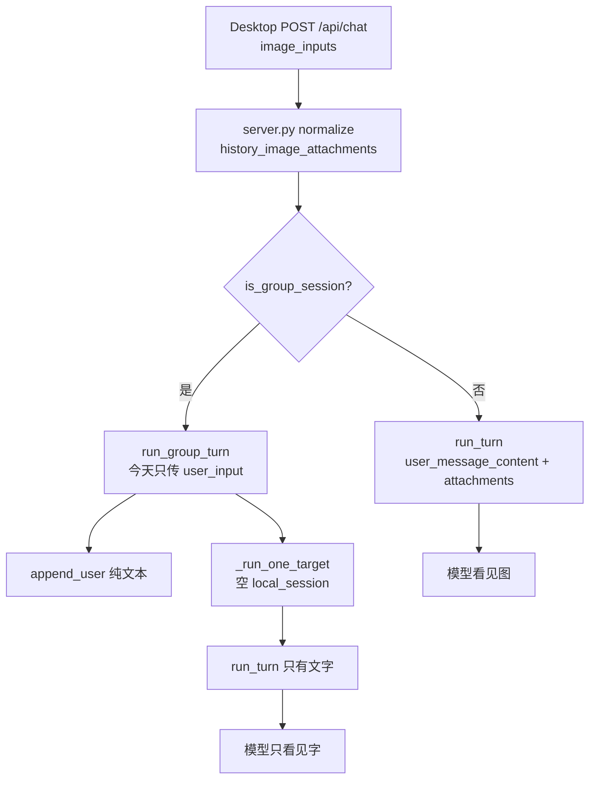

# 群聊当轮用户图片注入 LLM

Planned-with: Cursor Grok 4.6
Suggested-Impl-Model: Composer 2.5（后端接线：`append_user` + scratchpad stash + `_run_one_target` 透传已有 `run_turn` 参数；plan 已写清落点与 before/after，不必上顶配）
Status: ready
Plan-Id: 2026-08-29-group-chat-image-inputs

> **For implementer:** 只改本 plan 列出的路径。触碰 `agenticx/studio/server.py` 时**只能**在现有 `router.run_group_turn(...)` 调用上精确增加两个 kwargs，禁止整段替换 import 或相邻 handler。不要改 Desktop、不要改单聊 promote、不要改 `_call_llm_text`。不要 commit，除非用户明确要求。

**Goal:** 群聊当轮用户上传的图片写入 `messages.json`，并随成员 `AgentRuntime.run_turn` 进入多模态上下文，行为对齐单聊。

**Architecture:** Desktop 已发 `image_inputs`；Studio 已 normalize 出 `image_inputs` / `history_image_attachments`。缺口在群聊分叉：`run_group_turn` 只收纯文本。本轮把这两份列表传入 router，经 `append_user` 落盘，并用 session scratchpad 暂存，让所有 `_run_one_target` 路径（含 mention follow-up）无需改十多处签名即可读到图。视觉成员拼 `user_message_content`（text + `image_url`）；非视觉成员走已有 `history_user_attachments` + autodescribe / omit notice。

**Tech Stack:** Python、`GroupChatContext`、`GroupChatRouter`、`AgentRuntime.run_turn`、FastAPI `/api/chat`、pytest。

---

## 根因与证据链（实施者勿依赖对话记忆）

复现：群聊 session 选多模态模型，发带 `image.png` 的用户消息。UI 气泡有附件，助手回复「没收到图、只有文字」。

磁盘证据（本机群聊 session `~/.agenticx/sessions/<group-session-id>/messages.json`）：

- 用户那条消息**没有** `attachments` 字段，只有纯文本。
- 同目录 `agent_messages.json` 也搜不到 `attachments` / `data:image`。

单聊能看见的完整链路（**不要改这些文件的既有逻辑**，只对照）：

1. Desktop `desktop/src/components/ChatPane.tsx` 把带 `dataUrl` 的图放进 `body.image_inputs`（群聊同样会发，前端不用改）。
2. `agenticx/studio/server.py` `_normalize_image_inputs`（约 L1795）+ `_history_attachments_from_image_inputs`（约 L1830）生成两份列表。`history_image_attachments` 在「非视觉则清空 `image_inputs`」（约 L2923–2927）**之前**就算好（约 L2832）。
3. 单聊约 L3789–3822 拼 `user_message_content`，并传 `history_user_attachments` 给 `AgentRuntime.run_turn`。
4. `agenticx/runtime/agent_runtime.py` `_promote_user_image_attachments`（约 L1291）在视觉模型下把历史 `attachments.data_url` 提升成多模态 content。

群聊丢图的分叉：

1. `is_group_session` 后走 `_produce_group_events()`（`server.py` 约 L3126）。
2. `router.run_group_turn(...)`（约 L3211）**只传 `user_input` 文本**，不传 `image_inputs` / `history_image_attachments`。
3. `GroupChatContext.append_user()`（`agenticx/runtime/group_context.py` L50–69）只写纯文字，没有 `attachments` 参数。
4. `_run_one_target`（`group_router.py` L1452）新建空的 `local_session`，历史只靠 `context.render_recent_dialogue()` 压成系统提示里的文字。
5. `runtime.run_turn(...)`（约 L1606）**没有** `user_message_content` / `history_user_attachments`。
6. `_run_one_target_stream`（约 L1737）只是包一层 `_run_one_target`，同样没带图。

2026-06-12 的 plan（`.cursor/plans/2026-06-12-chat-image-attachments-persistence-vision-history-reconstruction.plan.md`，status Implemented）要求群聊也持久化 `data_url`，但实际只修了单聊。



---

## 推荐实施模型

| 子任务 | 推荐模型 | 理由 |
|---|---|---|
| `append_user` + 单测 | Composer 2.5 | 对齐已有 `append_agent`，样板 |
| scratchpad stash + `_run_one_target` 透传 | Composer 2.5 | 接线清晰，签名默认值避免改调用点 |
| `server.py` 两个 kwargs | Composer 2.5 | 精确插行，禁止整段替换 |
| Studio FakeRouter 单测 | Composer 2.5 | 仿 `test_group_chat_hydrates_document_before_router_turn` |

最终 `Impl-Model` trailer 以实际使用为准，由用户确认。未提供时询问，禁止编造。

---

## In scope

- `GroupChatContext.append_user` 可选 `attachments`，有则写入（对齐 `append_agent`）
- `run_group_turn` 接收 `image_inputs` / `history_image_attachments`，`append_user` 带附件，scratchpad 暂存本轮图
- `_run_one_target` 读 scratchpad，按成员 `is_vision_capable` 拼 `user_message_content`，并传 `history_user_attachments`
- `server.py` 现有 `run_group_turn(...)` 增加两个 kwargs
- 上表所列测试

## Out of scope

- Desktop `ChatPane` / 前端发送（已经发 `image_inputs`）
- 单聊 `user_message_content` / `_promote_user_image_attachments` 既有逻辑
- `_call_llm_text` / `_run_meta_project_manager_reply`（纯文本 PM 路径；本次 Near 主答走 `_run_one_target(META)`）
- Workforce 规划层 LLM、intent `_analyze_intent` 文本 prompt
- 跨轮「上一张图」重建：`local_session` 每轮是空的，`render_recent_dialogue()` 只有字。当轮注入 + 落盘即可修本次 bug
- 非视觉时清空 `image_inputs` 的 session 级逻辑（约 L2923）；用 `history_image_attachments` 给视觉成员重建
- `server.py` 顶部 import 区
- 改 `persist_user_message` 默认值
- 给十多处 `_run_one_target` / `_run_one_target_stream` 调用逐个加参数（用 scratchpad，禁止签名扩散）

## no-scope-creep

每个改动必须能追溯到下面某条 FR。禁止顺手重构 `group_router.py` 其它路由、禁止改 Desktop、禁止改单聊。新参数必须有默认值 `None` / 空列表，现有 `tests/test_smoke_group_*.py` 调用点不用改。

---

## FR-1：`append_user` 可写图片附件

**Files:**

- Modify: `agenticx/runtime/group_context.py` — `GroupChatContext.append_user`（L50–69）
- Test: `tests/test_group_shared_artifact_delivery.py` — 紧挨现有 `test_append_agent_attachments_match_session_schema`（约 L342）

**Before:** `append_user` 只写 `role/content/sender_*`，无 `attachments`。

**After:** 增加可选 `attachments: Sequence[Mapping[str, Any]] | None = None`。非空时写入 `row["attachments"] = [dict(item) for item in attachments]`，与 `append_agent`（L89–90）相同。空或 `None` 不写该键。

完整签名与实现意图：

```python
def append_user(
    self,
    text: str,
    *,
    sender_name: str = "我",
    quoted_message_id: str = "",
    quoted_content: str = "",
    attachments: Sequence[Mapping[str, Any]] | None = None,
) -> None:
    label = str(sender_name or "").strip() or "我"
    row: dict[str, Any] = {
        "role": "user",
        "content": str(text or ""),
        "sender_id": "user",
        "sender_name": label,
        "agent_id": "user",
        "quoted_message_id": str(quoted_message_id or ""),
        "quoted_content": str(quoted_content or ""),
    }
    if attachments:
        row["attachments"] = [dict(item) for item in attachments]
    self._history().append(row)
```

`from typing import Any, List, Mapping, Sequence` 文件顶部已有，不必新增 import。

**AC-1:**

- 测试名：`test_append_user_persists_image_attachments`
- 用 `SimpleNamespace(chat_history=[], scratchpad={})` + `GroupChatContext`
- `append_user("看这张图", attachments=[{"name": "image.png", "mime_type": "image/png", "size": 12, "data_url": TINY_PNG}])`
- 断言 `session.chat_history[-1]["attachments"][0]["data_url"]` 以 `data:image/` 开头，且 `name == "image.png"`
- 再 `append_user("纯文字")`，断言最后一条**没有** `attachments` 键

测试用 1×1 PNG（全文写进测试，禁止「按需推断」）：

```python
TINY_PNG = (
    "data:image/png;base64,"
    "iVBORw0KGgoAAAANSUhEUgAAAAEAAAABCAYAAAAfFcSJAAAADUlEQVR42mP8z8BQDwAEhQGAhKmMIQAAAABJRU5ErkJggg=="
)
```

可把 `TINY_PNG` 放在该测试文件模块级常量，供后续 FR 测试复用。

---

## FR-2：`run_group_turn` 接收图、落盘、scratchpad 暂存

**Files:**

- Modify: `agenticx/runtime/group_router.py` — `run_group_turn`（L2656–2683）
- Test: `tests/test_group_shared_artifact_delivery.py`

**Scratchpad 键（写死，禁止改名）：**

- `__group_turn_image_inputs__`
- `__group_turn_history_attachments__`

**Before:** `run_group_turn` 无图参数；`append_user` 只传文本。

**After:**

1. 签名增加（必须有默认，现有调用全不用改）：

```python
image_inputs: Sequence[Mapping[str, Any]] | None = None,
history_image_attachments: Sequence[Mapping[str, Any]] | None = None,
```

插在 `user_display_name` 之后、`) -> AsyncGenerator` 之前。`Mapping` 已在 `group_router.py` L17 导入。

2. 在 `scratchpad` 规范化之后、`append_user` **之前**，写入并保证是 list 拷贝（避免调用方后续清空污染本轮）：

```python
turn_images = [dict(item) for item in (image_inputs or []) if isinstance(item, Mapping)]
turn_history = [
    dict(item) for item in (history_image_attachments or []) if isinstance(item, Mapping)
]
if not turn_history and turn_images:
    turn_history = _attachments_from_image_inputs(turn_images)
scratchpad["__group_turn_image_inputs__"] = turn_images
scratchpad["__group_turn_history_attachments__"] = turn_history
```

3. `append_user` 增加 `attachments=turn_history or None`。

4. **整个 `run_group_turn` 体用 try/finally**：`finally` 里 `scratchpad.pop("__group_turn_image_inputs__", None)` 与 `scratchpad.pop("__group_turn_history_attachments__", None)`。当前函数在 `routing == "team"` / `"intelligent"` 处有提前 `return`，必须包进 try，否则下一轮会漏图。

模块级小助手（放在 `group_router.py` 文件前部、`META_LEADER_AGENT_ID` 常量附近即可，不要新建文件）：

```python
def _attachments_from_image_inputs(
    items: Sequence[Mapping[str, Any]] | None,
) -> list[dict[str, Any]]:
    out: list[dict[str, Any]] = []
    for im in items or []:
        if not isinstance(im, Mapping):
            continue
        data_url = str(im.get("data_url") or "").strip()
        if not data_url.startswith("data:image/"):
            continue
        out.append(
            {
                "name": str(im.get("name") or "image").strip() or "image",
                "mime_type": str(im.get("mime_type") or "image/png").strip() or "image/png",
                "size": int(im.get("size") or 0) if str(im.get("size") or "").strip() != "" else 0,
                "data_url": data_url,
            }
        )
    return out
```

`size` 解析要对齐 server：`int(im.get("size") or 0)`，`TypeError`/`ValueError` 时用 `0`。上面伪代码若 `int(...)` 可能炸，实施时用 try/except，与 `server.py` L1845–1848 一致。

**AC-2:**

- 测试名：`test_run_group_turn_persists_user_image_attachments`
- 复用同文件 `_make_router()` / `_session_with_workspace`
- `monkeypatch` `AgentRuntime` 为立即 `yield FINAL` 的 stub（抄 `test_member_prompt_mentions_shared_workspace` 的 `_CapturingRuntime`）
- session 设 `provider_name="openai"`、`model_name="gpt-4o"`（视觉宽松，未知 slug 也默认视觉）
- `session.__group_avatar_ids = ["a1"]`
- `await` 消费完 `router.run_group_turn(..., routing="broadcast" 或能打到 `_run_one_target` 的 routing，`mentioned_avatar_ids=["a1"]`, `user_input="看图", image_inputs=[{"name":"image.png","data_url":TINY_PNG,"mime_type":"image/png","size":70}], history_image_attachments=[{"name":"image.png","mime_type":"image/png","size":70,"data_url":TINY_PNG}])`
- 断言 `session.chat_history` 里**第一条 user 行**含 `attachments[0].data_url == TINY_PNG`
- 断言函数返回后 scratchpad **没有** `__group_turn_image_inputs__` / `__group_turn_history_attachments__`

`routing` 取值：看 `pick_targets`。最稳是 `mentioned_avatar_ids=["a1"]` 且 routing 不是 `team`/`intelligent`（例如 `"user-directed"` 或现有 smoke 测试用的值）。打开任意 `tests/test_smoke_group_legacy_routing.py` 里 `run_group_turn` 的 `routing=` 抄同一个字符串。若不确定，用 `routing="intelligent"` 并 mock `_run_intelligent_turn` **不要**——那会跳过 `_run_one_target`。本测只验 persist + finally 清理，可 `monkeypatch` `pick_targets` 返回 `["a1"]`，`routing="sequential"`（或该文件其它测试用过的非 team/intelligent 值）。

查 `pick_targets` 对未知 routing 的行为：若会落到 `targets = self.pick_targets(...)`（L2725），则设 `mentioned_avatar_ids=["a1"]` 即可。

---

## FR-3：`_run_one_target` 把本轮图交给 `run_turn`

**Files:**

- Modify: `agenticx/runtime/group_router.py` — `_run_one_target` 的 `runtime.run_turn(...)`（约 L1606–1615）
- 同文件增加 `_group_turn_image_blocks` 助手
- Test: `tests/test_group_shared_artifact_delivery.py`

**不要**给 `_run_one_target` 加新必填参数。从 `base_session.scratchpad` 读 FR-2 的两个键。

**Before:**

```python
async for event in runtime.run_turn(
    local_user_input,
    local_session,
    should_stop=lambda: self._should_stop(should_stop),
    agent_id=avatar_id,
    tools=_group_chat_tools(),
    system_prompt=system_prompt,
    usage_session_id=str(getattr(base_session, "_usage_owner_session_id", "") or ""),
    usage_avatar_id=str(avatar_id or ""),
):
```

**After:** 在该调用前（`final_text = ""` 附近，`run_turn` 正上方）插入：

```python
from agenticx.llms.vision import is_vision_capable

_sp = getattr(base_session, "scratchpad", None)
if not isinstance(_sp, dict):
    _sp = {}
_turn_images = list(_sp.get("__group_turn_image_inputs__") or [])
_turn_hist = list(_sp.get("__group_turn_history_attachments__") or [])
_user_message_content = None
if is_vision_capable(str(provider or ""), str(model or "")):
    _user_message_content = _group_turn_image_blocks(
        local_user_input, _turn_images, _turn_hist
    )
```

`run_turn` **只增加**这两个可选 kwargs（其它行一字不改）：

```python
    user_message_content=_user_message_content,
    history_user_attachments=_turn_hist or None,
```

`provider`/`model` 在 `_run_one_target` L1478–1497 已解析（Meta 用 session 模型，成员用 avatar default 再回落 session）。**按成员模型判断视觉**，不要用窗格 session 模型。

`_group_turn_image_blocks`（模块级，与 `_attachments_from_image_inputs` 放一起）：

```python
def _group_turn_image_blocks(
    user_input: str,
    image_inputs: Sequence[Any],
    history_attachments: Sequence[Any],
) -> list[dict[str, Any]] | None:
    sources: list[Mapping[str, Any]] = [
        item for item in image_inputs if isinstance(item, Mapping)
    ]
    if not sources:
        for item in history_attachments:
            if not isinstance(item, Mapping):
                continue
            data_url = str(item.get("data_url") or "").strip()
            if data_url.startswith("data:image/"):
                sources.append(item)
    blocks: list[dict[str, Any]] = [{"type": "text", "text": str(user_input or "")}]
    for im in sources:
        data_url = str(im.get("data_url") or "").strip()
        if data_url.startswith("data:image/"):
            blocks.append({"type": "image_url", "image_url": {"url": data_url}})
    if len(blocks) <= 1:
        return None
    return blocks
```

意图：

- session 非视觉时 `image_inputs` 已被 server 清空，但 `history_image_attachments` 仍在 → 视觉成员仍能从 history 重建 `image_url`。
- 非视觉成员：`is_vision_capable` 为 False → 不传 `user_message_content`，只传 `history_user_attachments`，走 `agent_runtime.py` L3427 起已有 autodescribe / omit notice。
- mention follow-up 的 `user_input` 可能是系统改写后的文本：`user_message_content` 的 text 块必须用 **`local_user_input`**（已含引用/系统提示），不要用原始 `user_input` 参数之外的另一份。
- `persist_user_message` 保持默认；写入的是一次性 `local_session`，不影响群 `chat_history`。

**AC-3:**

- 测试名：`test_run_one_target_forwards_vision_blocks_and_attachments`
- `_CapturingRuntime.run_turn` 把 `kwargs` 存进 `captured: dict`
- `_make_router()` + `_session_with_workspace`
- 调用 `_run_one_target` **之前**设：

```python
session.scratchpad = {
    "__group_turn_image_inputs__": [
        {"name": "image.png", "data_url": TINY_PNG, "mime_type": "image/png", "size": 70}
    ],
    "__group_turn_history_attachments__": [
        {"name": "image.png", "mime_type": "image/png", "size": 70, "data_url": TINY_PNG}
    ],
}
session.provider_name = "openai"
session.model_name = "gpt-4o"
```

- `_make_router` 里 avatar 的 `default_provider`/`default_model` 保持空字符串，从而回落到 session 的 gpt-4o。
- 断言 `captured["user_message_content"]` 是 list：第一块 `type=="text"`，其后有一块 `type=="image_url"` 且 `image_url["url"]==TINY_PNG`。
- 断言 `captured["history_user_attachments"][0]["data_url"]==TINY_PNG`。

**AC-4:**

- 测试名：`test_run_one_target_non_vision_member_skips_image_blocks`
- 同一套 capturing runtime
- 把 `_make_router` 的 avatar `default_model` 设为已知纯文本：`glm-5`（`is_vision_capable` 对智谱文本族返回 False）
- scratchpad 仍放 TINY_PNG
- 断言 `captured.get("user_message_content") is None`
- 断言 `captured["history_user_attachments"]` 仍带 `data_url`（供 autodescribe）

`_make_router` 目前写死空 default_model。AC-4 不要改全局 helper 行为：在该测试里单独 `router.avatar_registry.get_avatar.return_value.default_model = "glm-5"`（MagicMock avatar 已存在）。

---

## FR-4：Studio 群聊把已 normalize 的图传进 router

**Files:**

- Modify: `agenticx/studio/server.py` — **仅** `router.run_group_turn(` 调用（约 L3211–3223）
- Test: `tests/test_studio_server.py` — 仿 `test_group_chat_hydrates_document_before_router_turn`（约 L999）

**Before:** 调用只有 `user_input=payload.user_input` 等，无图。

**After:** 在 `user_display_name=u_display,` 之后、`)` 之前精确增加两行：

```python
                        image_inputs=image_inputs,
                        history_image_attachments=history_image_attachments,
```

- `image_inputs` / `history_image_attachments` 已是 `_produce_group_events` 外层 `/api/chat` 里算好的局部变量（L2795、L2832）。不要在群聊分支重新 normalize。
- **禁止**改 L1–100 的 import。
- **禁止**改 L2923–2927 的非视觉清空。
- 全文件只应出现这一处 `run_group_turn(`（可用 ripgrep 确认）。不要新增第二个调用。

**AC-5:**

- 测试名：`test_group_chat_forwards_image_inputs_to_router`
- 抄 L999–1062 的 FakeGroupRouter / create_avatar / create_group 骨架
- FakeRouter 的 `run_group_turn` 把 `kwargs.get("image_inputs")` 与 `kwargs.get("history_image_attachments")` 写入外层 `seen: dict`
- POST `/api/chat` json 增加：

```python
"image_inputs": [
    {
        "name": "image.png",
        "data_url": TINY_PNG,
        "mime_type": "image/png",
        "size": 70,
    }
],
```

`TINY_PNG` 与 FR-1 相同字符串。`ChatImageInput` 要求 `data_url` min_length=1，且 server normalize 要求 `data:image/` 前缀。

- 断言 `seen["image_inputs"]` 非空，且 `[0]["data_url"]` 以 `data:image/` 开头
- 断言 `seen["history_image_attachments"]` 非空，且 `[0]` 含 `name` / `data_url`
- 不要断言 hydrate 顺序（本测不测文档 hydrate）

新建 session 的默认模型多为未知 slug → `is_vision_capable` 为 True → `image_inputs` 不会被清空。不要依赖「必须是视觉模型」才能转发 `history_image_attachments`：即使将来默认模型变纯文本，`history_image_attachments` 仍应非空。断言以 **history** 为主，`image_inputs` 允许为空列表但不能缺 key。

更稳的断言：

```python
assert "image_inputs" in seen
assert "history_image_attachments" in seen
assert seen["history_image_attachments"]
assert str(seen["history_image_attachments"][0]["data_url"]).startswith("data:image/")
```

---

## 实施顺序（TDD，禁止先写生产代码）

> **For Claude:** REQUIRED SUB-SKILL: Use `test-driven-development`（仓库 `.cursor/skills/test-driven-development/SKILL.md`）。每条 FR：先写失败测试 → 跑红 → 最小实现 → 跑绿。

### Task 1: FR-1 append_user

1. 写 `test_append_user_persists_image_attachments`
2. `pytest tests/test_group_shared_artifact_delivery.py::test_append_user_persists_image_attachments -v` → 期望 FAIL（`append_user` unexpected keyword `attachments`）
3. 改 `append_user`
4. 再跑 → PASS

### Task 2: FR-3 `_run_one_target`（可先于 FR-2，因读 scratchpad，不依赖 `run_group_turn` 签名）

1. 写 AC-3、AC-4 两个测试
2. `pytest tests/test_group_shared_artifact_delivery.py::test_run_one_target_forwards_vision_blocks_and_attachments tests/test_group_shared_artifact_delivery.py::test_run_one_target_non_vision_member_skips_image_blocks -v` → 期望 FAIL（kwargs 缺失或 `user_message_content` 为 None）
3. 加 `_group_turn_image_blocks` + `_run_one_target` 两行 kwargs
4. 再跑 → PASS
5. 回归：`pytest tests/test_group_shared_artifact_delivery.py::test_member_prompt_mentions_shared_workspace -v` → PASS

### Task 3: FR-2 `run_group_turn`

1. 写 `test_run_group_turn_persists_user_image_attachments`
2. 跑红
3. 改签名 + stash + append_user + finally
4. 跑绿

### Task 4: FR-4 server.py

1. 写 `test_group_chat_forwards_image_inputs_to_router`
2. 跑红（kwargs 里没有这两个键，或值为 None）
3. 只加两行 kwargs
4. 跑绿
5. 回归：`pytest tests/test_studio_server.py::test_group_chat_hydrates_document_before_router_turn -v`

### Task 5: 回归与 server.py smoke

```bash
pytest tests/test_group_shared_artifact_delivery.py tests/test_studio_server.py::test_group_chat_hydrates_document_before_router_turn tests/test_studio_server.py::test_group_chat_forwards_image_inputs_to_router tests/test_smoke_group_mention_followup.py tests/test_smoke_group_legacy_routing.py -q
```

改了 `server.py` 后必须冷启动（仓库硬规则）：

```bash
agx serve --host 127.0.0.1 --port 18765
# 另开终端，对 localhost 绕代理：
curl --noproxy '*' -s -o /dev/null -w "%{http_code}" http://127.0.0.1:18765/api/session
curl --noproxy '*' -s -o /dev/null -w "%{http_code}" http://127.0.0.1:18765/api/avatars
curl --noproxy '*' -s -o /dev/null -w "%{http_code}" http://127.0.0.1:18765/api/sessions
```

三个都应 200。测完停掉该进程。不要占用用户正在用的 `serve.port`。

---

## 分支与提交

- 从当前仓库开分支 `fix/group-chat-image-inputs`（不要直接在 `main` 上改）。
- 工作区若有无关 dirty（打包脚本、examples 等），**只 add 本 plan 与本 plan 列出的代码/测试文件**。
- 用户未要求 commit 时不要 commit。若之后要求 commit，trailer 仅允许：

```
Plan-Id: 2026-08-29-group-chat-image-inputs
Plan-File: .cursor/plans/2026-08-29-group-chat-image-inputs.plan.md
Plan-Model: <用户提供>
Impl-Model: <用户提供>
Made-with: Damon Li
```

未提供模型名则先问，禁止编造。commit subject/body 禁止第三方品牌对标，用「群聊当轮用户图片写入历史并注入成员回合」。

---

## 实施者自检清单

- [ ] `append_user` 无 attachments 时行为与改前完全一致
- [ ] `_run_one_target` 无 scratchpad 图时 `user_message_content` 为 None、`history_user_attachments` 为 None，与改前一致
- [ ] mention follow-up 本轮仍能从 scratchpad 看到原图（finally 在整轮结束后才清）
- [ ] `server.py` import 区 diff 为空
- [ ] 未改 Desktop
- [ ] 未改 `_call_llm_text`
- [ ] `agx serve` 冷启动核心 API 200
