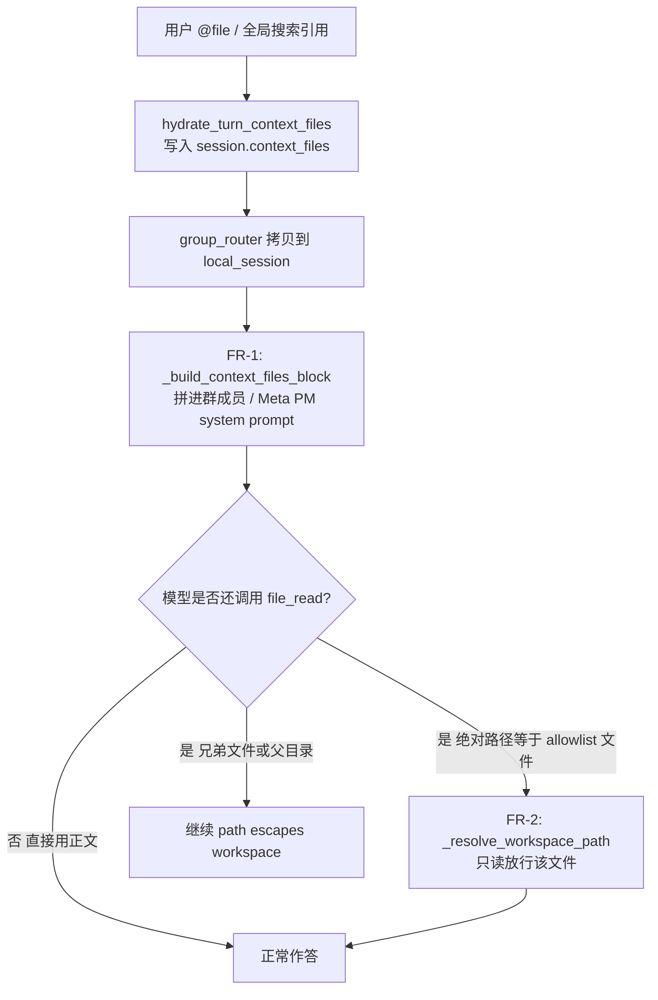

# 群聊 @ 引用文件：提示词注入 + 文件级只读授权

Planned-with: grok-4.6
Suggested-Impl-Model: grok-4.6（后端接线 + 沙箱边界，安全敏感；不要用纯样板档硬扛路径授权）
Plan-Id: 2026-08-31-group-context-files-and-at-file-read-grant

> **实施者必读：** 本 plan 按「Composer 2.5 不看对话也能落地」写。只改下面点名的路径。禁止扩 `read_roots` 到父目录。禁止改 `agenticx/studio/server.py` 的 import 区。禁止碰 Desktop / enterprise。
>
> 实施前把本文件**移回** `.cursor/plans/` 根目录，再从最新主干开分支。

---

## 0. 背景、复现与根因（不依赖对话记忆）

### 用户可见现象

群聊里用全局搜索 / `@file` 引用了**另一个 taskspace** 里的文件（例：`MHS安全设计思路.md`，绝对路径落在 `~/.agenticx/taskspaces/<other-session>/...`）。成员分身回复时调用 `file_read`，工具返回：

```text
ERROR: path escapes workspace: <abs-path> (allowed roots: <本群默认工作区>, ...)
```

模型随后声称「读不了 / 文件不在工作区」。用户感知是：全局搜索能引用，沙箱却把引用卡死。

复现会话（本机 `~/.agenticx/sessions/`，只作证据，不要写进 commit / 测试数据）：

- 引用发生在群聊会话，`context_files_refs.json` 已有该绝对路径
- 成员执行会话曾出现 `path escapes workspace`

### 证据链（仓库现状，2026-08-31）

1. **正文已经水合进 session。** 群聊入口 `agenticx/studio/server.py` 约 L3135 对 `turn_context_files` 调用 `hydrate_turn_context_files(..., session.context_files)`。`group_router._run_one_target` 约 L1687 把 `base_session.context_files` **整表拷贝**到 `local_session`。数据在，不是「没传过去」。

2. **单聊 / 1:1 分身已经把正文注入 system prompt。**  
   - Meta：`build_meta_agent_system_prompt` → `_build_context_files_block(session)`（`meta_agent.py` 约 L921）  
   - 1:1 分身：`server.py` `_produce_meta_events` 约 L3754–3766，skills 之后追加 `_build_context_files_block`  
   - 序列化格式：`--- {path} ---\n{body}`，见 `serialize_context_files`（`context_file_budget.py` L28–46），单文件 8k / 合计 16k。

3. **群成员 system prompt 没有这块。** `_run_one_target` 约 L1703–1738 手写一长段 `system_prompt`（身份、控制面、群共享工作区、长期指令、最近群聊上下文），**从未**调用 `_build_context_files_block`。`_run_one_target_stream`（约 L1941）只是包装 `_run_one_target`，不用另改。

4. **更糟：user 消息已经在撒谎。** `AgentRuntime.run_turn` 约 L3421 会把 `_build_attached_files_hint` 拼进发给模型的 user 消息：

   > 「上述文件内容已在 system prompt 的 context_files 节中给出，请直接阅读并基于其回答。」

   群成员走的也是 `runtime.run_turn(..., system_prompt=system_prompt)`（约 L1804–1810）。hint 说「system 里有正文」，system 里实际没有。模型按 hint 去找 → 找不到 → `file_read(绝对路径)` → 沙箱按 **目录 root** 拦。

5. **沙箱 `read_roots` 不含 context_files。** `_session_workspace_root_sets`（`agent_tools.py` L307–497）只收：taskspace / reference mount / `workspace_dir` / `~/.agenticx/desktop-use`。`@` 出来的**单个文件**不会变成 root。`file_read` → `_resolve_workspace_path`（L3625）绝对路径分支在 root 上失败就抛 `path escapes workspace`（L3648–3651, L3690）。

### 产品结论（不要做成「放宽整个沙箱」）

全局搜索 / `@file` 的语义是：**用户点名了这一份文件**，不是把父目录变成新工作区。

正确合同：

- 模型应先读 system prompt 里已注入的正文（与 Meta / 1:1 分身对齐）。
- 若模型仍对**同一绝对路径**调用 `file_read` / `liteparse`，只放行**该文件**，只读。
- 同目录兄弟文件、父目录 `list_files`、对该路径的 `file_write` / `file_edit`、`bash_exec cat` 父目录——一律仍拒绝。



---

## In scope / Out of scope

### In scope

- **FR-1**：群聊两条会回答用户的 LLM 路径注入 `_build_context_files_block`（有正文才注入，与 1:1 分身同一判定）。
- **FR-2**：从 `session.context_files` 的 key 解析出磁盘绝对路径，在 `_resolve_workspace_path(..., for_write=False)` 对**精确文件**放行只读。
- 对应单测 + 既有沙箱回归保持绿。

### Out of scope（严禁顺手做）

- **禁止**把 `@` 文件的父目录、taskspace 根、`$HOME`、`AGX_WORKSPACE_ROOT` 加进 `read_roots` / `write_roots`。
- **禁止**改 `bash_exec` / `command_sandbox` 的 `readable_roots`（本轮只修工具路径解析；模型应按 prompt 用正文，不必为 `cat` 开洞）。
- **禁止**改 `list_files` 让它能列 `@` 文件所在目录。
- **禁止**写授权：`for_write=True` 即使命中 allowlist 也必须继续走现有拒绝。
- **禁止**改 `agenticx/studio/server.py`（1:1 分身已注入；且该文件 import 区极敏感）。
- **禁止**改 Desktop、全局搜索 UI、`enterprise/`、群路由策略、确认卡。
- **禁止**重构 `_run_one_target` 整段 prompt 拼装；只在现有字符串拼完后追加一块。
- **禁止**新建「引用目录自动变 reference mount」之类的工作区模型。

---

## 子规划 → 推荐模型

| 子任务 | Suggested-Impl-Model | 理由 |
|---|---|---|
| Task 1–2：群 prompt 注入 + 单测 | grok-4.6（Composer 2.5 也够） | 机械拼接，对齐已有 `_build_context_files_block` |
| Task 3–4：key→路径解析 + 文件级只读 | grok-4.6 | 沙箱边界，错一次就是目录级泄读 |
| Task 5：回归 + 自测命令 | grok-4.6 | 只跑本 plan 点名的测试，不要扩扫全仓 |

最终 `Impl-Model` trailer 以实际实施模型为准。

---

## 需求

### FR-1 群聊成员（含组长走 `_run_one_target`）和 Meta PM 能在 prompt 里看到 `@` 文件正文

**落点 A** — `agenticx/runtime/group_router.py`

现有 import（约 L44）：

```python
from agenticx.runtime.prompts.meta_agent import _build_web_search_capability_block
```

改成（只加一个名字，不要改其它 import）：

```python
from agenticx.runtime.prompts.meta_agent import (
    _build_context_files_block,
    _build_web_search_capability_block,
)
```

在模块级（`_GROUP_CONTROL_PLANE_CONTRACT` 之后、第一个 `class` / `async def` 之前，约 L64 后）新增辅助函数，供两条路径复用：

```python
def _append_context_files_block(prompt: str, session: Any) -> str:
    """Append hydrated context_files to a group prompt. Skip empty/(none)."""
    try:
        block = _build_context_files_block(session)
    except Exception:
        return prompt
    if not block or "context_files: (none)" in block:
        return prompt
    return f"{prompt.rstrip()}\n\n{block}"
```

**`_run_one_target`（约 L1703–1739）before：**

```python
        system_prompt = (
            f"你是群聊数字分身：{avatar_name}\n"
            # ... 中间不变 ...
            f"## 最近群聊上下文\n{dialogue_context}\n"
        )
        # Graph Runtime interventions queued on the owner session scratchpad.
```

**after：** 在 `system_prompt = (` 整段赋值**结束之后**、Graph intervention `try` **之前**插入一行：

```python
        system_prompt = _append_context_files_block(system_prompt, local_session)
```

必须用 `local_session`（已在 L1687 拷贝 `context_files`），不要用 `base_session` 的别名幻想——两者此时内容相同，但后续若有人只改 local，注入应对齐 runtime 真正看到的 session。

**落点 B** — 同文件 `_run_meta_project_manager_reply`（约 L1584–1606）

`prompt = (` 赋值结束后、`text = await self._call_llm_text(` **之前**插入：

```python
        prompt = _append_context_files_block(prompt, base_session)
```

Meta PM 不走 `AgentRuntime`，没有 user-hint，不注入的话组长短答路径仍然「看不见」`@` 文件。

**不要改** `_build_context_files_block` / `CONTEXT_FILES_USAGE_HINT` / `serialize_context_files` 的文案或预算。直接复用。

**AC-1**

新文件 `tests/test_group_context_files_prompt.py`（完整内容见 Task 1）。必须断言：

1. `_run_one_target` 传给 `AgentRuntime.run_turn` 的 `system_prompt` 含 `--- {abs_path} ---`、文件正文、`CONTEXT_FILES_USAGE_HINT` 里已有的「请直接使用正文回答」。
2. `context_files` 为空时，prompt **不含** `### 用户引用的文件（context_files）`（与 1:1「(none) 不追加」一致）。
3. `_run_meta_project_manager_reply` 传给 `_call_llm_text` 的 `prompt` 同样含路径 + 正文。
4. 既有 `tests/test_group_shared_artifact_delivery.py`、`tests/test_smoke_group_meta_direct_honesty.py` 仍绿。

---

### FR-2 `@` 引用文件可被只读工具按精确路径读取，且不扩大目录 root

**落点 C** — `agenticx/studio/context_file_keys.py`

在文件末尾追加（不要改现有三个函数）。需要的 import：`from pathlib import Path`（加到现有 `from __future__` 之后）；`split_el_snippet_context_key` 从 `agenticx.studio.html_element_context` 导入。

```python
_LINE_RANGE_SUFFIX = re.compile(r":(\d+)-(\d+)$")


def disk_path_from_context_file_key(key: str) -> str | None:
    """Best-effort absolute disk path for a context_files key.

    Returns None for virtual keys (skill:, @dir:), composer upload dedupe
    keys (name:size:lastModified), and anything that is not an absolute path
    after stripping el-snippet / line-range suffixes.
    Does not check that the file exists.
    """
```

解析顺序（必须按此顺序，写进测试）：

1. `text = str(key or "").strip()`；空 → `None`。
2. `text.startswith("skill:")` 或 `text.startswith("@dir:")` → `None`。
3. `is_composer_upload_dedupe_key(text)` → `None`（例 `notes.txt:32506:1783310868057`）。
4. `split_el_snippet_context_key(text)` 非空 → `text = 其 path`（例 `/tmp/charts/index.html:el-snippet-204e5c8a` → `/tmp/charts/index.html`）。
5. 若仍匹配 `^(.+):(\d+)-(\d+)$`（工作区行号后缀，见现有 `test_workspace_line_range_not_upload_dedupe`），剥掉后缀只留 path。
6. `Path(text).expanduser()`；`is_absolute()` 为假 → `None`。
7. `resolve(strict=False)`，失败 → `None`；成功返回 `str(resolved)`。

本函数**不**把目录当授权对象；是否是文件由调用方再判。

**落点 D** — `agenticx/cli/agent_tools.py`

在 `_session_workspace_root_sets` **之后**（约 L498 `_session_workspace_roots` 之前）新增：

```python
def _context_files_read_allowlist(session: Optional[StudioSession]) -> List[Path]:
    """Exact files the user attached / @-referenced this session (read-only)."""
    if session is None:
        return []
    raw = getattr(session, "context_files", None)
    if not isinstance(raw, dict) or not raw:
        return []
    from agenticx.studio.context_file_keys import disk_path_from_context_file_key

    out: List[Path] = []
    seen: set[str] = set()
    for key in raw.keys():
        disk = disk_path_from_context_file_key(str(key))
        if not disk:
            continue
        path = Path(disk)
        try:
            if path.exists() and not path.is_file():
                continue
        except OSError:
            continue
        if disk in seen:
            continue
        seen.add(disk)
        out.append(path)
    return out


def _is_context_file_read_allowed(resolved: Path, session: Optional[StudioSession]) -> bool:
    want = str(_safe_resolve_path(resolved))
    for allowed in _context_files_read_allowlist(session):
        if str(_safe_resolve_path(allowed)) == want:
            return True
    return False
```

目录 skip：`exists() and not is_file()`。文件尚未落盘（key 是绝对路径但文件暂时不在）**仍可进 allowlist**——否则「路径合法但 file not found」会继续被误报成 `escapes workspace`。存在且是目录的 key 必须跳过，避免把目录当文件授权。

**落点 E** — 同文件 `_resolve_workspace_path`，**只改绝对路径分支**（约 L3666–3690）。

before（绝对路径、过完 virtual mount 与 `_raise_if_path_denied` 之后）：

```python
        _raise_if_path_denied(resolved, session)
        for root in roots:
            if _is_path_under_root(resolved, root):
                return resolved
        # Readable via reference/copy metadata, but not in write roots.
        if for_write and _under_any_root(resolved, read_roots):
            raise ValueError(_format_readonly_reference(resolved))
        raise ValueError(_format_escape(resolved))
```

after：

```python
        _raise_if_path_denied(resolved, session)
        for root in roots:
            if _is_path_under_root(resolved, root):
                return resolved
        if (not for_write) and _is_context_file_read_allowed(resolved, session):
            return resolved
        if for_write and _under_any_root(resolved, read_roots):
            raise ValueError(_format_readonly_reference(resolved))
        if for_write and _is_context_file_read_allowed(resolved, session):
            raise ValueError(
                f"path is read-only (context_files attachment): {resolved}. "
                "Do not retry file_edit/file_write/bash_exec on this path."
            )
        raise ValueError(_format_escape(resolved))
```

相对路径 / mount alias / `pick_existing` 分支**一字不改**。模型必须用 prompt 里给出的绝对路径；不要做「按 basename 在 allowlist 里猜」。

**不要**改 `_session_workspace_root_sets` 的返回值。授权只发生在 `_resolve_workspace_path` 的精确相等，这样 `list_files(父目录)` 仍逃逸。

**AC-2**（`tests/test_workspace_root_enforcement.py` 追加；`tests/test_smoke_context_file_keys.py` 追加 key 解析）

| 用例 | 期望 |
|---|---|
| session.context_files 含 `/tmp-like/outside/note.md`，该文件存在，workspace 是另一目录 | `_resolve_workspace_path(note, for_write=False)` 返回该文件 |
| 同上，`for_write=True` | `ValueError`，消息含 `read-only (context_files attachment)` 或 `escapes workspace`（二选一即可，优先专用 read-only 文案） |
| 同目录兄弟文件 `sibling.md` 不在 context_files | 读/写都 `escapes workspace` |
| 父目录路径 | `escapes workspace` |
| `skill:foo` / 上传去重 key 作唯一 key | 不授权任何磁盘路径 |
| `html:el-snippet-*` key | 授权的是 html **源文件**本身，不是父目录 |
| `~/.ssh/id_rsa` 即使出现在 context_files | 仍 `protected`（现有 `test_ssh_protected_even_when_mounted` 语义优先于 allowlist；绝对路径分支先 `_is_protected_path` 再 allowlist，**不要把 allowlist 挪到 protected 之前**） |
| `_session_workspace_root_sets` 的 read_roots | **不含** outside 文件的父目录 |

**AC-3 回归**

```bash
python -m pytest \
  tests/test_group_context_files_prompt.py \
  tests/test_context_file_prompt.py \
  tests/test_smoke_context_file_keys.py \
  tests/test_workspace_root_enforcement.py \
  tests/test_group_shared_artifact_delivery.py \
  tests/test_smoke_group_meta_direct_honesty.py \
  -q
```

期望：全部 PASS。不要为了本任务去修无关红测。

---

## Task 1: 先写失败的群 prompt 测试

**Files:**
- Create: `tests/test_group_context_files_prompt.py`
- Modify: 无（本步不改产品代码）

**Step 1: 写入下面完整测试文件**

```python
#!/usr/bin/env python3
"""Group prompts must include hydrated context_files bodies.

Author: Damon Li
"""

from __future__ import annotations

from types import SimpleNamespace
from unittest.mock import MagicMock

import pytest

from agenticx.runtime.context_file_budget import CONTEXT_FILES_USAGE_HINT
from agenticx.runtime.events import EventType
from agenticx.runtime.group_context import GroupChatContext
from agenticx.runtime.group_router import GroupChatRouter, GroupReply


def _make_avatar(name: str = "程基岩") -> MagicMock:
    avatar = MagicMock()
    avatar.name = name
    avatar.role = "专家"
    avatar.system_prompt = ""
    avatar.avatar_url = ""
    avatar.default_provider = ""
    avatar.default_model = ""
    return avatar


def _make_router(avatar: MagicMock | None = None) -> GroupChatRouter:
    av = avatar or _make_avatar()
    registry = MagicMock()
    registry.get_avatar = MagicMock(return_value=av)
    return GroupChatRouter(
        avatar_registry=registry,
        llm_factory=MagicMock(return_value=MagicMock()),
        max_tool_rounds=3,
    )


def _make_session(*, context_files: dict | None = None, workspace: str = "/tmp/ws") -> MagicMock:
    sess = MagicMock()
    sess.session_id = "cf-group-session"
    sess._session_id = "cf-group-session"
    sess.provider_name = "openai"
    sess.model_name = "gpt-4"
    sess.workspace_dir = workspace
    sess.context_files = dict(context_files or {})
    sess.taskspaces = [{"id": "default", "path": workspace}]
    sess.scratchpad = {}
    sess.chat_history = []
    sess.__group_avatar_ids = ["cheng"]
    return sess


@pytest.mark.asyncio
async def test_run_one_target_system_prompt_includes_context_file_body(
    monkeypatch: pytest.MonkeyPatch,
) -> None:
    abs_path = "/tmp/other-taskspace/MHS-notes.md"
    body = "这是跨 taskspace 引用的正文 UNIQUE_TOKEN_A1B2"
    captured: dict[str, str] = {}

    class _CaptureRuntime:
        def __init__(self, *args, **kwargs) -> None:
            pass

        async def run_turn(self, *args, **kwargs):
            captured["system_prompt"] = str(kwargs.get("system_prompt") or "")
            yield SimpleNamespace(type=EventType.FINAL.value, data={"text": "已阅读。"})

    monkeypatch.setattr("agenticx.runtime.group_router.AgentRuntime", _CaptureRuntime)
    router = _make_router()
    session = _make_session(context_files={abs_path: body})
    reply = await router._run_one_target(
        base_session=session,
        context=GroupChatContext(session),
        group_id="g1",
        group_name="Room",
        avatar_id="cheng",
        user_input="根据 @MHS-notes.md 总结要点",
        quoted_content="",
        should_stop=lambda: False,
        force_reply=True,
    )
    assert reply.skipped is False
    prompt = captured["system_prompt"]
    assert f"--- {abs_path} ---" in prompt
    assert "UNIQUE_TOKEN_A1B2" in prompt
    assert "请直接使用正文回答" in prompt or CONTEXT_FILES_USAGE_HINT.split("。")[0] in prompt
    assert "### 用户引用的文件（context_files）" in prompt


@pytest.mark.asyncio
async def test_run_one_target_skips_empty_context_files_block(
    monkeypatch: pytest.MonkeyPatch,
) -> None:
    captured: dict[str, str] = {}

    class _CaptureRuntime:
        def __init__(self, *args, **kwargs) -> None:
            pass

        async def run_turn(self, *args, **kwargs):
            captured["system_prompt"] = str(kwargs.get("system_prompt") or "")
            yield SimpleNamespace(type=EventType.FINAL.value, data={"text": "ok"})

    monkeypatch.setattr("agenticx.runtime.group_router.AgentRuntime", _CaptureRuntime)
    router = _make_router()
    session = _make_session(context_files={})
    await router._run_one_target(
        base_session=session,
        context=GroupChatContext(session),
        group_id="g1",
        group_name="Room",
        avatar_id="cheng",
        user_input="你好",
        quoted_content="",
        should_stop=lambda: False,
        force_reply=True,
    )
    assert "### 用户引用的文件（context_files）" not in captured["system_prompt"]


@pytest.mark.asyncio
async def test_meta_pm_prompt_includes_context_file_body() -> None:
    abs_path = "/tmp/other-taskspace/MHS-notes.md"
    body = "PM_VISIBLE_TOKEN_99"
    captured: dict[str, str] = {}
    router = _make_router()

    async def stub_llm(**kwargs):
        captured["prompt"] = str(kwargs.get("prompt") or "")
        return "短结论。"

    router._call_llm_text = stub_llm  # type: ignore[assignment]
    session = _make_session(context_files={abs_path: body})
    session.__group_avatar_ids = []
    await router._run_meta_project_manager_reply(
        base_session=session,
        context=GroupChatContext(session),
        group_name="Room",
        user_input="这份笔记的结论是什么",
    )
    prompt = captured["prompt"]
    assert f"--- {abs_path} ---" in prompt
    assert "PM_VISIBLE_TOKEN_99" in prompt
```

`CONTEXT_FILES_USAGE_HINT` 定义在 `agenticx/runtime/context_file_budget.py`，**不要**为了测试去改 `meta_agent` 的导出。

**Step 2: 跑测试，确认失败**

```bash
python -m pytest tests/test_group_context_files_prompt.py -v
```

期望：FAIL。失败点应是 `assert f"--- {abs_path} ---" in prompt`（prompt 里没有 context_files 块）。若 FAIL 原因是 import / EventType / 夹具，先修测试夹具，不要先改产品代码。

**Step 3: 本步不 commit。** 等 Task 2 产品代码落地后再与测试一起提交（若用户要求按 task commit，再拆）。

---

## Task 2: 实现 FR-1 注入

**Files:**
- Modify: `agenticx/runtime/group_router.py` 约 L44 import、约 L64 后新函数、约 L1738 后、约 L1606 后

**Step 1: 按 FR-1 改 `group_router.py`。** 改完后目视确认：

- 没有误删 `_GROUP_CONTROL_PLANE_CONTRACT`
- `_run_one_target` 里 `system_prompt=system_prompt` 仍传给 `run_turn`
- 没有改 `server.py`

**Step 2:**

```bash
python -m pytest tests/test_group_context_files_prompt.py tests/test_smoke_group_meta_direct_honesty.py tests/test_group_shared_artifact_delivery.py -q
```

期望：PASS。

**Step 3:** 若 `CONTEXT_FILES_USAGE_HINT` 断言因标点切分不稳，只断言 `"请直接使用正文回答" in prompt`（该句在 `context_file_budget.py` L16 原文里）。

---

## Task 3: 先写失败的 key 解析 + 沙箱测试

**Files:**
- Modify: `tests/test_smoke_context_file_keys.py`
- Modify: `tests/test_workspace_root_enforcement.py`（只追加，不改旧测）

**Step 1: 在 `test_smoke_context_file_keys.py` 追加**

```python
from agenticx.studio.context_file_keys import disk_path_from_context_file_key


def test_disk_path_from_absolute_key() -> None:
    assert disk_path_from_context_file_key("/tmp/readme.md") is not None
    assert disk_path_from_context_file_key("/tmp/readme.md").endswith("readme.md")


def test_disk_path_skips_virtual_and_dedupe_keys() -> None:
    assert disk_path_from_context_file_key("skill:tech-daily-news") is None
    assert disk_path_from_context_file_key("@dir:/tmp/ws") is None
    assert disk_path_from_context_file_key("notes.txt:32506:1783310868057") is None
    assert disk_path_from_context_file_key("relative/notes.md") is None


def test_disk_path_strips_el_snippet_and_line_range() -> None:
    snippet = disk_path_from_context_file_key("/tmp/charts/index.html:el-snippet-204e5c8a")
    assert snippet is not None
    assert snippet.endswith("index.html")
    lined = disk_path_from_context_file_key("/tmp/README.md:224-224")
    assert lined is not None
    assert lined.endswith("README.md")
```

**Step 2: 在 `test_workspace_root_enforcement.py` 文件末尾追加**

```python
def test_context_file_exact_path_readable_not_writable(
    tmp_path: Path, monkeypatch: pytest.MonkeyPatch
) -> None:
    monkeypatch.delenv("AGX_DESKTOP_UNRESTRICTED_FS", raising=False)
    ws = tmp_path / "ws"
    ws.mkdir()
    other = tmp_path / "other-taskspace"
    other.mkdir()
    note = other / "note.md"
    note.write_text("hello-from-other-space", encoding="utf-8")
    sibling = other / "secret.md"
    sibling.write_text("nope", encoding="utf-8")
    monkeypatch.setenv("AGX_WORKSPACE_ROOT", str(ws))
    session = StudioSession()
    session.workspace_dir = str(ws)
    session.taskspaces = [
        {"id": "default", "label": "默认工作区", "path": str(ws), "mount_mode": "link"},
    ]
    session.context_files = {str(note.resolve()): "hello-from-other-space"}

    assert at._resolve_workspace_path(str(note), session, for_write=False) == note.resolve()
    read = at._tool_file_read({"path": str(note)}, session)
    assert "hello-from-other-space" in read

    with pytest.raises(ValueError, match="escapes workspace|read-only"):
        at._resolve_workspace_path(str(note), session, for_write=True)
    with pytest.raises(ValueError, match="escapes workspace"):
        at._resolve_workspace_path(str(sibling), session, for_write=False)
    with pytest.raises(ValueError, match="escapes workspace"):
        at._resolve_workspace_path(str(other), session, for_write=False)

    read_roots, write_roots = at._session_workspace_root_sets(session)
    assert other.resolve() not in read_roots
    assert other.resolve() not in write_roots
    assert note.resolve() not in read_roots


def test_context_file_allowlist_does_not_override_protected(
    tmp_path: Path, monkeypatch: pytest.MonkeyPatch
) -> None:
    monkeypatch.delenv("AGX_DESKTOP_UNRESTRICTED_FS", raising=False)
    ws = tmp_path / "ws"
    ws.mkdir()
    monkeypatch.setenv("AGX_WORKSPACE_ROOT", str(ws))
    session = StudioSession()
    session.workspace_dir = str(ws)
    session.taskspaces = [
        {"id": "default", "label": "默认工作区", "path": str(ws), "mount_mode": "link"},
    ]
    ssh_key = Path.home() / ".ssh" / "id_rsa"
    session.context_files = {str(ssh_key): "should-not-matter"}
    with pytest.raises(ValueError, match="protected"):
        at._resolve_workspace_path(str(ssh_key), session, for_write=False)
```

**Step 3:**

```bash
python -m pytest tests/test_smoke_context_file_keys.py tests/test_workspace_root_enforcement.py::test_context_file_exact_path_readable_not_writable -v
```

期望：FAIL（`disk_path_from_context_file_key` 未定义 / 绝对路径仍 escapes）。

---

## Task 4: 实现 FR-2

**Files:**
- Modify: `agenticx/studio/context_file_keys.py`
- Modify: `agenticx/cli/agent_tools.py`（只加两个 helper + 绝对路径分支 4～8 行）

**Step 1: 实现 `disk_path_from_context_file_key`。** `context_file_keys.py` 顶部补：

```python
import re
from pathlib import Path

from agenticx.studio.html_element_context import split_el_snippet_context_key
```

行号后缀用：

```python
_LINE_RANGE_KEY_RE = re.compile(r"^(?P<path>.+):(?P<start>\d+)-(?P<end>\d+)$")
```

注意：必须**先**判断 upload dedupe（末两段是 size + 毫秒时间戳），**再**剥行号。否则 `notes.txt:32506:1783310868057` 被行号正则误伤的风险较低（它是两段冒号数字），但顺序仍按 FR-2 第 2→3→4→5 步，避免和 `is_composer_upload_dedupe_key` 冲突。

**Step 2: 实现 allowlist + `_resolve_workspace_path` 插入点。** 插入必须在 `_is_protected_path` / `_raise_if_path_denied` **之后**。

**Step 3:**

```bash
python -m pytest \
  tests/test_smoke_context_file_keys.py \
  tests/test_workspace_root_enforcement.py \
  tests/test_group_context_files_prompt.py \
  -q
```

期望：PASS。若 `test_context_file_allowlist_does_not_override_protected` 在本机没有 `~/.ssh/id_rsa`，现有 `test_ssh_protected_even_when_mounted` 仍会对不存在的路径抛 `protected`（`_is_protected_path` 看的是路径前缀，不依赖文件存在）。照抄该假设即可。

---

## Task 5: 收口自测（实施者必须跑，不要只看 diff）

```bash
python -m pytest \
  tests/test_group_context_files_prompt.py \
  tests/test_context_file_prompt.py \
  tests/test_smoke_context_file_keys.py \
  tests/test_workspace_root_enforcement.py \
  tests/test_group_shared_artifact_delivery.py \
  tests/test_smoke_group_meta_direct_honesty.py \
  tests/test_agent_tools.py \
  -q
```

`tests/test_agent_tools.py` 里已有多条 `path escapes workspace` 断言（约 L360–548）。它们**没有**把 outside 文件放进 `context_files`，必须仍然 FAIL 成 escapes。若其中某条开始绿不该绿，说明你误扩了 root——回退 `_session_workspace_root_sets`。

本任务**不改** `server.py`，不必冷启动 `agx serve`。若实施者误碰了 `server.py`：立刻还原，并按 AGENTS.md 对该文件做启动冒烟。

---

## 实施时禁止的「聪明」改法

| 错误做法 | 为什么不行 |
|---|---|
| `_add(str(Path(cf_key).parent), writable=False)` | 同目录其它文件可读，全局搜索变成目录挂载 |
| 把 allowlist 并进 `read_roots` 返回值 | `list_files` / bash sandbox 会吃到这些 root |
| 按 basename 模糊匹配 context_files | 工作区里同名文件会被串读 |
| 改 `CONTEXT_FILES_USAGE_HINT` 鼓励 file_read | 正文已在 prompt 里；FR-2 只是兜底 |
| 在 `group_router` 里重写一套序列化 | 必须复用 `_build_context_files_block`，否则预算与失败语义分叉 |
| 给 `bash_exec` 加同一 allowlist | 超出本 plan；命令沙箱是另一条根 |

---

## Commit 约定（等用户明确要求再提交）

- 只 `git add` 本 plan 点名的文件。
- trailer：`Plan-Id` / `Plan-File` / `Plan-Model` / `Impl-Model` / `Made-with: Damon Li`。
- subject/body **不要**写第三方产品对标，只写「群聊 @ 引用文件进入成员提示词，并允许按精确路径只读」。
- 未提供模型名时**询问**，禁止编造。

建议拆两个 commit（若用户同意）：

1. `fix(group): inject context_files into member and PM prompts`
2. `fix(sandbox): allow read of exact context_files paths`

也可以一个 commit，但 diff 必须能对上 FR-1 / FR-2。
