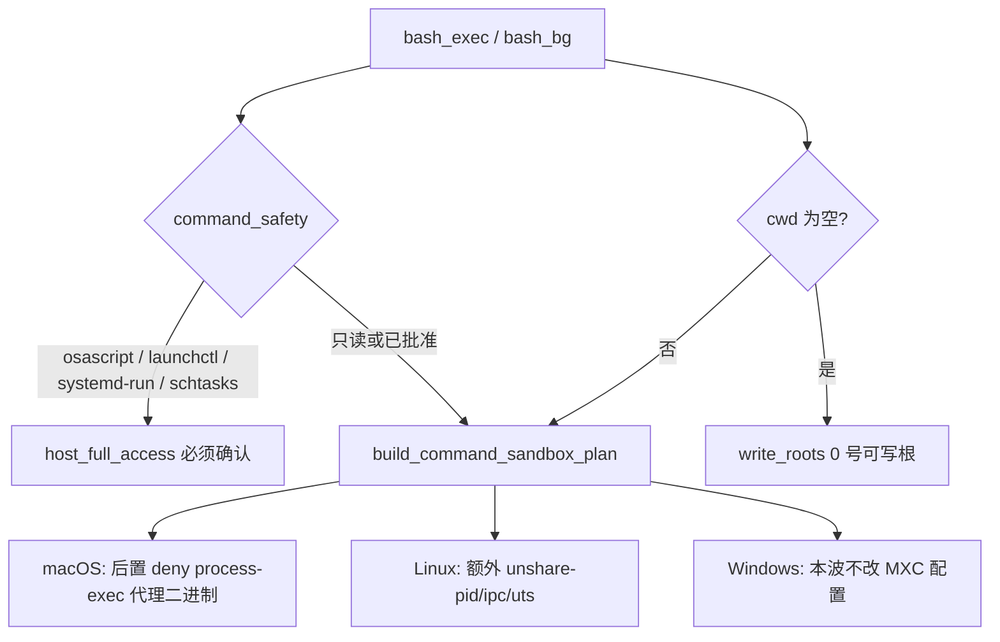

# 命令沙箱：堵住代理执行、补 Linux 命名空间、默认 cwd 落到会话工作区

Planned-with: Cursor Grok 4.6

Suggested-Impl-Model: `cursor-grok-4.6-xhigh-fast`

> **For implementer:** 只按本文件落地。不要读本次对话。不要改 Desktop / `enterprise/` / `confirm.py` / `server.py` 顶部 import。不要把网络隔离、`file_write` 文案、或 `(deny default)` 整档重写带进来。

**Goal:** 堵住「请笼子外的进程代劳」这条现成口子，并让空 `cwd` 不再把人推向脱离隔离。

**Architecture:** 确认框仍然不是安全边界。本波在两层同时收口：`command_safety` 把代理执行命令标成 `host_full_access`（永不自动放行）；macOS seatbelt 用后置 `deny process-exec*` 拦住已知代理二进制；Linux bwrap 补上 PID/IPC/UTS 命名空间。空 `cwd` 回落到会话可写根，与 `list_files(".")` 的目录优先级一致。

**Tech Stack:** 现有 `agenticx/runtime/command_safety.py`、`command_sandbox.py`、`agenticx/cli/agent_tools.py`、pytest。无新依赖。

---

## 0. 为什么只做这三件（收益最大）

上一波命令沙箱已经把「直接读写越界」关住了。剩下能被模型用**现成命令**碰到、且改动量小的，只有三条：

| 缺口 | 现状 | 不修的后果 |
|---|---|---|
| 代理执行 | `osascript` / `launchctl` / `systemd-run` 等不在 `COMMAND_RISK_CATEGORIES`；macOS 档案是 `(allow default)` 再否文件 | 自动模式或 `allowed_tools: ["bash_exec"]` 下可不弹框；`python` 批准后仍能拉起不继承档案的宿主进程 |
| Linux 命名空间 | `_bubblewrap_argv` 只有 `--die-with-parent --new-session --proc /proc --dev /dev` | `/proc` 看到宿主机进程表；一次批准 `kill` 的作用域是整机 |
| 空 `cwd` | `_bash_exec_prepare` 在没传 `cwd`、也剥不出 `cd` 前缀时保持 `None`，继承 `agx serve` 启动目录 | `ls` 报 `getcwd: Operation not permitted`，用户以为沙箱坏了，去点脱离隔离 |

**明确不做（本 plan Out of scope）：**

- 网络隔离（`--unshare-net`、macOS `deny network*`、Windows `network.defaultPolicy`）。这是第三个维度，要独立产品开关，不能塞进本波。
- 把 macOS 档案从 `(allow default)` 改成 `(deny default)` 再白名单。回归面是「所有命令起不来」，收益不值。
- Desktop 设置文案、`file_write` 是否进 OS 笼子、`unrecognized_command` 在自动模式下的新策略。
- `confirm.py`、`confirm-scope.ts`、`enterprise/`、`server.py` 顶部 import。
- 任何逃逸 PoC、利用步骤、或「演示如何绕过」的测试命令。测试只断言分类码和 argv/档案字符串。



---

## 规划依据（实施者须自行核对，不要依赖对话）

打开并读这些锚点，行号若漂移按符号搜：

1. `COMMAND_RISK_CATEGORIES`：`agenticx/runtime/command_safety.py` **L83–L121**。现有 `host_full_access` 只有 `sudo` / `su`。`classify_simple_command` **L348–L383** 对表外名字发 `unrecognized_command`，该码**不在** `NEVER_AUTO_APPROVED_CATEGORIES`（**L652–L657**）。
2. `tool_allowed_without_confirm`：`agenticx/cli/agent_tools.py` **L107–L137**。`NEVER_AUTO_APPROVED_CATEGORIES` 与 `allowed_tools` 的交集才会继续要确认。代理命令若不进 `host_full_access`，`allowed_tools: ["bash_exec"]` 会免确认。
3. macOS 档案：`_macos_profile` **L759–L819**。第 785 行 `(allow default)`，第 786 行否文件。后写的规则覆盖先写的（文件里已有注释，**L809**）。
4. Linux argv：`_bubblewrap_argv` **L849–L857**。没有 `--unshare-pid` / `--unshare-ipc` / `--unshare-uts`。不要加 `--unshare-net`。
5. 空 cwd：`_bash_exec_prepare` **L4395–L4419**。有 `cwd` 参数则 `_resolve_workspace_path(..., for_write=True)`；否则只尝试剥 `cd` 前缀，剥不到就保持 `None`。
6. 可写根顺序：`_session_workspace_root_sets` **L307+**。用户绑定目录优先于 default；`active_taskspace_id` 会置顶。默认 cwd 必须用 **write_roots[0]**，不能用 `read_roots[0]`（reference 挂载只读，不能当 bash cwd）。
7. 已有测试：`tests/test_command_safety.py` 的 `test_known_dangerous_commands_emit_precise_categories`、`test_command_risk_categories_cover_never_auto_approved`；`tests/test_command_sandbox.py` 只覆盖 darwin 包装与 temp 隔离；`tests/test_agent_tools.py` 的 `test_session_workspace_roots_*` 给出 session fixture 写法。

---

## 子规划 → 推荐模型

| 子任务 | 推荐模型 | 理由 |
|---|---|---|
| Task 1 代理命令分类 | Composer 2.5 | 改一张字典 + 断言，样板 |
| Task 2 Linux unshare | Composer 2.5 | 几个 flag + 字符串断言 |
| Task 3 macOS process-exec deny | `cursor-grok-4.6-xhigh-fast` | 档案字符串顺序错了会让日常命令起不来，或 deny 被 allow 盖住 |
| Task 4 默认 cwd | Composer 2.5 | 纯函数 + 已有 session fixture |

整波建议仍用 **`cursor-grok-4.6-xhigh-fast`** 一次做完，避免 Task 3 被弱模型改成 `(deny default)`。

---

## In scope / Out of scope

### In scope

- `agenticx/runtime/command_safety.py`：代理执行命令写入 `COMMAND_RISK_CATEGORIES` → `host_full_access`
- `agenticx/runtime/command_sandbox.py`：`_macos_profile` 后置 deny 代理二进制；`_bubblewrap_argv` 增加三个 unshare
- `agenticx/cli/agent_tools.py`：抽出 `_default_bash_cwd`，`_bash_exec_prepare` 在剥完 `cd` 仍为 `None` 时使用它
- 对应 pytest：`tests/test_command_safety.py`、`tests/test_command_sandbox.py`、`tests/test_agent_tools.py`

### Out of scope

- `--unshare-net` / 任何网络策略字段 / Desktop「工作区隔离」文案
- `(deny default)` + mach-lookup 白名单重写
- OS 层 deny `/usr/bin/open`（合法打开工作区文件会硬失败；`open` 只在策略层收）
- Windows MXC JSON（`network` / `ui` / `injection` 保持原样）
- `file_read` / `file_write` / `file_edit` 接 `sandbox-exec`
- `server.py` import 区、`confirm.py`、`enterprise/`、任何 Desktop 文件

---

## FR / NFR / AC

- **FR-1:** `osascript`、`osacompile`、`launchctl`、`crontab`、`at`、`systemd-run`、`schtasks`、`defaults`、`open` 经 `assess_command` 必须产生 `host_full_access`。`timeout 5 osascript -e '...'` 必须透过 `DELEGATING_COMMANDS` 同样命中。
- **AC-1:** `tests/test_command_safety.py` 新增 `test_proxy_execution_is_host_full_access`。`sudo` 旧断言仍绿。`test_command_risk_categories_cover_never_auto_approved` 仍绿。
- **FR-2:** Linux 计划 argv 在 `--new-session` 之后、绑定路径之前，包含 `--unshare-pid`、`--unshare-ipc`、`--unshare-uts`。不含 `--unshare-net`。
- **AC-2:** `tests/test_command_sandbox.py` 新增 `test_linux_bubblewrap_unshares_pid_ipc_uts`，直接测 `_bubblewrap_argv`（不要求本机有 `bwrap`）。
- **FR-3:** macOS 档案在全部 allow 规则**之后**包含对代理二进制的 `deny process-exec*`。不得删除 `(allow default)`，不得改成 `(deny default)`。
- **AC-3:** `tests/test_command_sandbox.py` 新增 `test_macos_profile_denies_proxy_binaries_after_allows`：档案文本里 `(allow default)` 仍在；`osascript`/`launchctl` 的 deny 出现在最后一个 `(allow file-` 之后。
- **FR-4:** `bash_exec` / `bash_bg_*` 未传 `cwd`、且剥不到 `cd` 前缀时，cwd 为 `_session_workspace_root_sets` 的第一号**可写**根（存在的目录）。用户显式 `cwd` 与成功剥 `cd` 的路径优先，不得被覆盖。
- **AC-4:** `tests/test_agent_tools.py` 新增 `test_default_bash_cwd_follows_writable_root_order`：多 taskspace 时等于用户绑定目录；有 `active_taskspace_id` 时等于该目录；reference 挂载不得成为默认 cwd。
- **NFR-1:** 不改 `NEVER_AUTO_APPROVED_CATEGORIES` 的成员集合（只往已有 `host_full_access` 上挂新命令名）。
- **NFR-2:** 本机 `pytest tests/test_command_safety.py tests/test_command_sandbox.py tests/test_agent_tools.py -q` 全绿。

---

### Task 1: 代理执行进入 host_full_access

Suggested-Impl-Model: Composer 2.5

**Files:**
- Modify: `agenticx/runtime/command_safety.py`（`COMMAND_RISK_CATEGORIES`，约 L83–L121）
- Test: `tests/test_command_safety.py`

**Before（意图）:** `assess_command("osascript -e 'display dialog 1'")` 的 findings 只有 `unrecognized_command`，`allowed_tools` 可以免确认。

**After（意图）:** 同上命令 findings 含 `host_full_access`。`tool_allowed_without_confirm("bash_exec", ["host_full_access"])` 仍为 False（已有逻辑，不必改 `agent_tools.py`）。

**命令名必须全部写入 `COMMAND_RISK_CATEGORIES`，值为 `"host_full_access"`：**

```python
"osascript": "host_full_access",
"osacompile": "host_full_access",
"launchctl": "host_full_access",
"crontab": "host_full_access",
"at": "host_full_access",
"defaults": "host_full_access",
"open": "host_full_access",
"systemd-run": "host_full_access",
"schtasks": "host_full_access",
```

不要把 `systemctl` 整词加进去（`systemctl status` 是日常只读查询，整词会确认爆炸）。不要把 `open` 做成「仅 `-a` 才算」——`allowed_tools` 免确认时，无 `-a` 的 `open` 仍会经 LaunchServices 把活交给沙箱外进程；本波接受 `open README.md` 多一次确认。

**Step 1: 先写失败测试**（加在 `test_known_dangerous_commands_emit_precise_categories` 之后）

```python
def test_proxy_execution_is_host_full_access() -> None:
    for command in (
        "osascript -e 'return 1'",
        "osacompile -o /tmp/x.scpt /tmp/x.applescript",
        "launchctl list",
        "crontab -l",
        "at now",
        "defaults read com.apple.finder",
        "open -a Finder",
        "open README.md",
        "systemd-run --user echo hi",
        "schtasks /query",
        "timeout 5 osascript -e 'return 1'",
    ):
        verdict = assess_command(command)
        assert not verdict.is_contained, command
        assert any(item.code == "host_full_access" for item in verdict.findings), command
```

**Step 2:** `pytest tests/test_command_safety.py::test_proxy_execution_is_host_full_access -v` → 失败。

**Step 3:** 只改 `COMMAND_RISK_CATEGORIES` 字典。不要改 `classify_simple_command`。`timeout` 已在 `DELEGATING_COMMANDS`。

**Step 4:** 同文件全部测试绿。

**Step 5:** 单独 commit。subject 用中性描述（禁止第三方产品名、禁止「对齐 / 对标」）。

---

### Task 2: Linux bwrap 补 PID / IPC / UTS

Suggested-Impl-Model: Composer 2.5

**Files:**
- Modify: `agenticx/runtime/command_sandbox.py` 的 `_bubblewrap_argv`（约 L849–L857）
- Test: `tests/test_command_sandbox.py`

**Before:**

```python
wrapped: list[str] = [
    executable,
    "--die-with-parent",
    "--new-session",
    "--proc",
    "/proc",
    "--dev",
    "/dev",
]
```

**After:**

```python
wrapped: list[str] = [
    executable,
    "--die-with-parent",
    "--unshare-pid",
    "--unshare-ipc",
    "--unshare-uts",
    "--new-session",
    "--proc",
    "/proc",
    "--dev",
    "/dev",
]
```

保留已有 `--proc /proc`：unshare PID 后必须重挂 proc，否则新命名空间里没有进程表。不要加 `--unshare-user`（部分发行版未开 unprivileged user ns，会让所有命令起不来）。不要加 `--unshare-net`。

在 `_bubblewrap_argv` 的 docstring 补两句英文：PID 命名空间让 `/proc` 只见笼子内进程；本函数仍然不是网络沙箱。

**测试（不调用 `bwrap` 二进制，可在任何开发机跑）：**

```python
from agenticx.runtime.command_sandbox import _bubblewrap_argv

def test_linux_bubblewrap_unshares_pid_ipc_uts(tmp_path: Path) -> None:
    workspace = tmp_path / "ws"
    workspace.mkdir()
    argv = _bubblewrap_argv(
        "/usr/bin/bwrap",
        ("/bin/echo", "ok"),
        [workspace],
        cwd=workspace,
    )
    text = list(argv)
    for flag in ("--unshare-pid", "--unshare-ipc", "--unshare-uts"):
        assert flag in text
    assert "--unshare-net" not in text
    assert text.index("--unshare-pid") < text.index("--proc")
    assert "--" in text
```

`pytest tests/test_command_sandbox.py::test_linux_bubblewrap_unshares_pid_ipc_uts -v` 先红后绿。

---

### Task 3: macOS 档案后置 deny 代理二进制

Suggested-Impl-Model: `cursor-grok-4.6-xhigh-fast`

**Files:**
- Modify: `agenticx/runtime/command_sandbox.py` 的 `_macos_profile`（约 L783–L819）
- Test: `tests/test_command_sandbox.py`

**根因:** seatbelt 后写覆盖先写。现在最后生效的是工作区 `allow file-write*` 和 deny glob。`(allow default)` 仍然放行 `process-exec`，所以文件笼子关住了，`osascript` 仍能拉起不继承档案的宿主进程。

**改法（唯一允许的改法）:** 保持 `(allow default)` 不动。在函数 **return 之前**（也就是全部 allow / 路径 deny 之后）追加 process-exec 拒绝。这样它覆盖 default allow，又不会碰到「deny-first 被 workspace allow 盖住」的旧坑（那条坑只适用于 `file-write*`）。

在 `_macos_profile` 末尾、`return "\n".join(lines)` 之前插入：

```python
    # Later rules win. These binaries hand work to an unsandboxed host
    # process (AppleEvents / launchd). File allows above must not reopen
    # process-exec. Do not switch the profile to (deny default).
    lines.append(
        "(deny process-exec process-exec-interpreter "
        '(regex #"/(osascript|osacompile|launchctl|crontab)$"))'
    )
```

**不要**把 `open` 写进这条 regex：OS 层硬拒会让「打开工作区里的 html」直接失败，没有确认框可走。`open` 只由 Task 1 的确认闸拦。

**不要** deny `com.apple.coreservices.launchservicesd` 的 mach-lookup：容易把无关启动打挂。

**测试：**

```python
from agenticx.runtime.command_sandbox import _macos_profile

def test_macos_profile_denies_proxy_binaries_after_allows(tmp_path: Path) -> None:
    workspace = tmp_path / "ws"
    workspace.mkdir()
    profile = _macos_profile([workspace], deny_patterns=("**/.env",))
    assert "(allow default)" in profile
    assert "(deny default)" not in profile
    deny_exec = '(regex #"/(osascript|osacompile|launchctl|crontab)$")'
    assert deny_exec in profile
    assert profile.rfind(deny_exec) > profile.rfind("(allow file-")
    assert "osascript" in profile
    assert "/open$" not in profile
```

先红后绿。若本机是 macOS，可额外用现有 `test_build_plan_wraps_argv` 确认 `sandbox-exec -p` 的 profile 字符串里仍含 workspace 路径（该测试已存在，不要改它的断言语义）。

---

### Task 4: 空 cwd 落到会话可写根

Suggested-Impl-Model: Composer 2.5

**Files:**
- Modify: `agenticx/cli/agent_tools.py`
  - 在 `_session_workspace_root_sets` 附近（约 L307 之后）**新增** `_default_bash_cwd`
  - `_bash_exec_prepare` 约 L4411–L4419：剥完 `cd` 仍为 `None` 时调用它
- Test: `tests/test_agent_tools.py`

**新增函数（完整，不要发挥）：**

```python
def _default_bash_cwd(session: Optional[StudioSession]) -> Optional[Path]:
    """Writable root used when bash_exec/bash_bg omit cwd.

    Must use write_roots, not read_roots: a reference mount is readable
    but cannot be the launch directory. Order already prefers the
    user-bound folder and active_taskspace_id.
    """
    _read_roots, write_roots = _session_workspace_root_sets(session)
    for root in write_roots:
        try:
            if root.is_dir():
                return root
        except OSError:
            continue
    return None
```

**`_bash_exec_prepare` 改动（After，插在剥 cd 成功的 `if peeled:` 块之后，`command_name = Path(parts[0]).name` 之前）：**

```python
    if cwd is None:
        cwd = _default_bash_cwd(session)
```

用户传入的 `cwd` 已经在上面解析过，不会走进这个分支。剥 `cd` 成功时 `cwd` 已有值，也不会被覆盖。

**测试（复用 `tests/test_agent_tools.py` 里现有的 StudioSession + taskspaces 写法）：**

```python
def test_default_bash_cwd_follows_writable_root_order(tmp_path: Path) -> None:
    default_dir = tmp_path / "avatar_workspace"
    user_dir = tmp_path / "user_bound"
    ref_dir = tmp_path / "reference"
    default_dir.mkdir()
    user_dir.mkdir()
    ref_dir.mkdir()

    session = StudioSession()
    session.workspace_dir = str(default_dir)
    session.taskspaces = [
        {"id": "default", "label": "默认工作区", "path": str(default_dir)},
        {"id": "ts-abc12345", "label": "绑定", "path": str(user_dir)},
        {
            "id": "ts-ref",
            "label": "只读引用",
            "path": str(ref_dir),
            "mount_mode": "reference",
            "source_path": str(ref_dir),
        },
    ]

    assert agent_tools._default_bash_cwd(session) == user_dir.resolve()

    session.active_taskspace_id = "ts-abc12345"
    assert agent_tools._default_bash_cwd(session) == user_dir.resolve()
```

再加一条：`session = None` 或没有任何可写根时返回 `None`（保持现在「继承 serve cwd」的最后兜底，不要在这里发明家目录）。

先红后绿。不要为了测 `_bash_exec_prepare` 去 mock 整个 confirm 栈。

---

### Task 5: 验证与提交边界

1. `pytest tests/test_command_safety.py tests/test_command_sandbox.py tests/test_agent_tools.py -q` 全绿。
2. 本波**没有**改 `server.py`，不必跑 `agx serve` 冷启动。若实施时误碰了该文件：停下来把无关改动撤掉，并按仓库对 `server.py` 的强制门槛补一次临时端口冒烟。
3. 每个 Task 单独 commit。只 `git add` 本 task 的测试 + 对应实现文件。
4. trailer 在实施时由用户确认 `Plan-Model` / `Impl-Model` 后再写。本文件落盘名即 Plan-Id：`2026-09-01-command-sandbox-proxy-and-namespaces`。实施前把本文件移到 `.cursor/plans/` 根目录。

---

## 实施者自检（做完对照）

- [ ] `osascript` / `launchctl` / `systemd-run` / `open` 的 `assess_command` 带 `host_full_access`
- [ ] `timeout 5 osascript` 同样带 `host_full_access`
- [ ] Linux argv 有三个 unshare，没有 `--unshare-net`
- [ ] macOS 档案仍是 `(allow default)`，deny process-exec 在文件 allow 之后
- [ ] 档案 regex **不含** `open`
- [ ] 默认 cwd = 第一号可写根，不是 reference，不是 `Path.cwd()`
- [ ] 没有改 Desktop、`enterprise/`、`confirm.py`、`server.py` import
