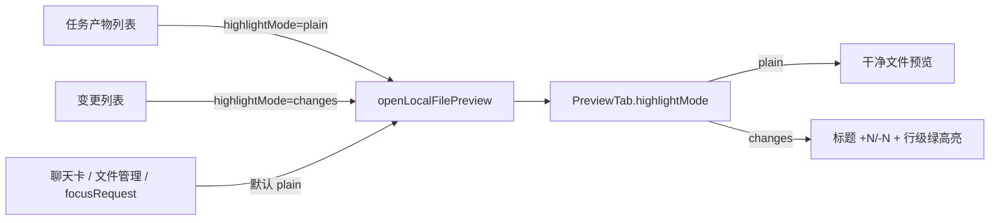

# 产物预览与变更预览分开展示

Planned-with: Cursor Grok 4.6
Suggested-Impl-Model: Composer 2.5

> **For implementer:** 只按本文件落地。不要读本次对话。不要对照外部产品改顶栏图标或加 +/- 折叠。不要改 `agenticx/studio/server.py`。

**Goal:** 工作台「任务产物」打开文件看当前内容；「变更」打开同一文件才显示行级增删装饰（标题 `+N`/`-N`、行左绿条、行底绿高亮）。

**Architecture:** 预览 tab 增加 `highlightMode`。装饰计算逻辑 `collectFileChangeHighlight` 不动。只有 mode=`changes` 时才把结果传给 `WorkspaceFilePreview`。同一路径只保留一个 tab，后一次打开覆盖 mode。

**Tech Stack:** Desktop React + TypeScript + Vitest

---

## 背景与根因（实施者请先读完）

### 事实 1：产物和变更点开走同一函数，且不带来源

`desktop/src/components/work-panel/WorkPanel.tsx`：

- `SessionArtifactList.onOpenPath`（约 L2075–L2090）与 `SessionChangeList.onOpenPath`（约 L2111–L2125）在可预览文件上都调用同一个 `openLocalFilePreview(path)`。
- `openLocalFilePreview`（约 L1014–L1068）只按 `absolutePath` 复用/新建 `PreviewTab`，类型定义（约 L529–L538）没有来源字段：

```ts
type PreviewTab = {
  id: string;
  title: string;
  absolutePath: string;
  preview: WorkspacePreview | null;
  loading: boolean;
  error: string | null;
  copied: boolean;
  lineRange?: WorkspacePreviewLineRange;
};
```

### 事实 2：预览渲染无条件套变更装饰

同文件约 L954–L962：

```ts
const activeChangeHighlight = useMemo(() => {
  if (!activePreview) return null;
  const preview = activePreview.preview;
  const content =
    preview && (preview.kind === "text" || preview.kind === "markdown" || preview.kind === "code")
      ? preview.content
      : undefined;
  return collectFileChangeHighlight(paneMessages, activePreview.absolutePath, content);
}, [activePreview, paneMessages]);
```

约 L2238：`<WorkspaceFilePreview changeHighlight={activeChangeHighlight} />`。

`collectFileChangeHighlight`（`desktop/src/utils/session-change-highlights.ts` L59–L113）只要本会话对该路径做过 `file_write` / `file_edit` 就会返回 `added`/`addedLines`。任务产物几乎都是本会话写出来的，所以从「任务产物」点开也会整文件绿底 + 标题 `+N`。

`WorkspaceFilePreview.tsx` 注释（L109）已写明装饰语义是「WorkPanel『变更』」，但接线没有按入口过滤：

- L1337–L1342：标题旁 `+added` / `-removed`
- L795 / L893：`addedLines` 传给 `LineFocusedSourceView` / `CodeSourceView`（行左绿条 + 行底高亮）

### 事实 3：其它打开预览的入口也是「看文件」不是「看变更」

这些入口经 `WorkPanelFocus.kind === "preview"`（`WorkPanel.tsx` L1258–L1259）落到同一个 `openLocalFilePreview`，默认必须是干净预览：

- 聊天气泡产物卡 / Markdown 本地链接：`ChatPane.tsx` `revealFileInTaskspace`（约 L5692–L5696）
- 左侧文件管理 / 工作区点文件：`ChatPane.tsx` `openWorkspaceFilePreview`（约 L5605–L5610）

只有摘要里「变更」列表这一处要带装饰。

### 为什么不是「再写一套 diff 组件」

变更装饰已经存在且只应出现在变更入口。本次只补 **mode 门闩**，不改 `collectFileChangeHighlight`、不改 `CodeSourceView` 画线、不重做预览顶栏。



---

## 子规划 → 推荐模型

| 子规划 | 推荐模型 | 理由 |
|---|---|---|
| 纯函数门闩 + 单测 | Composer 2.5 | 输入输出固定，无审美、无跨栈 |
| WorkPanel / Focus 接线 | Composer 2.5 | 改现有函数签名与两处 onClick，落点明确 |

Suggested-Impl-Model: Composer 2.5

---

## In scope

- FR-1: 预览 tab 记住本次打开意图 `plain | changes`
- FR-2: 仅 `changes` 把 `collectFileChangeHighlight` 结果传给预览
- FR-3: 「任务产物」点开 → 干净内容；「变更」点开 → 现有增删装饰
- FR-4: 同一路径已有 tab 时复用，并用**后一次点击**覆盖 `highlightMode`
- FR-5: `WorkPanelFocus.kind === "preview"` 可带 `highlightMode`，缺省 `plain`

## Out of scope

- 对照外部产品加上传 / 分享 / 文件夹顶栏按钮
- 变更预览加 +/- 折叠开关
- 重写 `collectFileChangeHighlight` 或 `CodeSourceView` 高亮算法
- HTML 产物（已走 `openLocalHtmlPreview` 浏览器 tab，无行级绿高亮）
- 拆成两个 tab（同一路径只保留一个）
- 改 `agenticx/studio/server.py`、聊天发送链路、企业门户

## no-scope-creep

只改本 plan 列出的 Desktop 路径。不重构 `WorkspaceFilePreview` 布局，不改 Session 列表卡片样式，不「顺便」改 tab 标题文案。

---

## FR / AC

### FR-1 / FR-2 门闩

- AC-1: 新建 `desktop/src/utils/preview-highlight-mode.test.ts`，覆盖 `resolveActiveChangeHighlight`：
  - `mode` 为 `undefined` / `"plain"`，即使 `collected` 有 `added: 6, addedLines: [1,2,3]`，返回 `null`
  - `mode === "changes"`，原样返回 `collected`（含 `null`）
- AC-2: 同文件覆盖 `nextPreviewHighlightMode(incoming)`：合法值原样返回；缺省 / 非法值返回 `"plain"`

### FR-3 / FR-4 入口

- AC-3: 「任务产物」点可预览文本/代码文件 → 预览标题**没有**绿色 `+N`，代码行**没有**绿条/绿底（即使该文件出现在变更列表且 `added > 0`）
- AC-4: 「变更」点同一文件 → 标题出现 `+N`（及如有则 `-N`），对应 `addedLines` 有绿条/绿底
- AC-5: 先从产物打开、再从变更打开同一路径 → 仍是同一个 preview tab，视图变成变更装饰；反过来再点产物 → 装饰消失，回到干净预览
- AC-6: 聊天气泡产物卡 / 左侧文件点开（`focusRequest.kind === "preview"` 且未传 mode）→ 干净预览，不带 `+N`

### FR-5 Focus 类型

- AC-7: `WorkPanelFocus` 的 preview 分支允许可选 `highlightMode`；`WorkPanel.tsx` L1258–L1259 把它传给 `openLocalFilePreview`。本次调用方都不传，默认 plain。

---

## 改动落点

### 1. 新建纯函数（先写测试）

**Create:** `desktop/src/utils/preview-highlight-mode.ts`

```ts
import type { FileChangeHighlight } from "./session-change-highlights";

export type PreviewHighlightMode = "plain" | "changes";

export function nextPreviewHighlightMode(
  incoming?: string | null,
): PreviewHighlightMode {
  return incoming === "changes" ? "changes" : "plain";
}

export function resolveActiveChangeHighlight(
  mode: PreviewHighlightMode | undefined,
  collected: FileChangeHighlight | null,
): FileChangeHighlight | null {
  if (mode !== "changes") return null;
  return collected;
}
```

**Create:** `desktop/src/utils/preview-highlight-mode.test.ts`

按 AC-1 / AC-2 写完再接线。跑：

```bash
cd desktop && npx vitest run src/utils/preview-highlight-mode.test.ts
```

期望：先红（文件不存在）→ 实现后绿。

### 2. PreviewTab + openLocalFilePreview

**Modify:** `desktop/src/components/work-panel/WorkPanel.tsx`

在文件顶部 import 区（现有 `collectFileChangeHighlight` 那一行附近，约 L68）增加：

```ts
import {
  nextPreviewHighlightMode,
  resolveActiveChangeHighlight,
  type PreviewHighlightMode,
} from "../../utils/preview-highlight-mode";
```

`PreviewTab`（约 L529–L538）增加字段，缺省语义是 plain：

```ts
type PreviewTab = {
  id: string;
  title: string;
  absolutePath: string;
  preview: WorkspacePreview | null;
  loading: boolean;
  error: string | null;
  copied: boolean;
  lineRange?: WorkspacePreviewLineRange;
  highlightMode: PreviewHighlightMode;
};
```

`openLocalFilePreview`（约 L1014）改签名，**不要**把第三个 `lineRange` 改成 options 对象（现有 L1259 / L2086 / L2121 调用点保持可编译）：

```ts
const openLocalFilePreview = (
  absPathRaw: string,
  titleHint?: string,
  lineRange?: WorkspacePreviewLineRange,
  highlightMode?: PreviewHighlightMode,
) => {
  const path = String(absPathRaw || "").trim();
  if (!path) return;
  const mode = nextPreviewHighlightMode(highlightMode);
  const title = String(titleHint || "").trim() || artifactBaseName(path) || "预览";
  const existing = previewTabs.find((t) => t.absolutePath === path);
  if (existing) {
    setPreviewTabs((prev) =>
      prev.map((t) =>
        t.id === existing.id
          ? { ...t, highlightMode: mode, ...(lineRange ? { lineRange } : {}) }
          : t,
      ),
    );
    setActivePreviewId(existing.id);
    setActiveKind("preview");
    void silentReloadPreviewTab(existing.id, path);
    return;
  }
  // 新建 tab 时必须写入 highlightMode: mode
  // ...其余 loading / loadAbsoluteFilePreview 逻辑保持原样
};
```

**Before（复用分支，约 L1023–L1032）：** 只更新 `lineRange`，不碰装饰来源。  
**After：** 复用时同时写入 `highlightMode: mode`。

`activeChangeHighlight`（约 L954–L962）改为：

```ts
const activeChangeHighlight = useMemo(() => {
  if (!activePreview) return null;
  const preview = activePreview.preview;
  const content =
    preview && (preview.kind === "text" || preview.kind === "markdown" || preview.kind === "code")
      ? preview.content
      : undefined;
  const collected = collectFileChangeHighlight(
    paneMessages,
    activePreview.absolutePath,
    content,
  );
  return resolveActiveChangeHighlight(activePreview.highlightMode, collected);
}, [activePreview, paneMessages]);
```

**Before：** 有会话写入就装饰。  
**After：** 还要 `highlightMode === "changes"`。

### 3. 两处列表入口

**Modify:** 同文件产物 `onOpenPath`（约 L2084–L2087）保持 `openLocalFilePreview(path)`（默认 plain）。

**Modify:** 同文件变更 `onOpenPath`（约 L2120–L2122）改为：

```ts
openLocalFilePreview(path, undefined, undefined, "changes");
```

不要为了好看去改 `openLocalFilePreview` 成 options 对象；四参即可。

### 4. Focus 类型（可选字段，默认 plain）

**Modify:** `WorkPanelFocus` preview 分支（约 L427–L432）：

```ts
| {
    kind: "preview";
    absolutePath: string;
    title?: string;
    lineRange?: WorkspacePreviewLineRange;
    highlightMode?: PreviewHighlightMode;
  }
```

**Modify:** L1258–L1259：

```ts
} else if (focusRequest.kind === "preview") {
  openLocalFilePreview(
    focusRequest.absolutePath,
    focusRequest.title,
    focusRequest.lineRange,
    focusRequest.highlightMode,
  );
}
```

`ChatPane.tsx` **不要改**。未传 `highlightMode` 时 `nextPreviewHighlightMode` 得到 `"plain"`，满足 AC-6。

`WorkPanelFocus` 与 `PreviewHighlightMode` 不要循环 import：`WorkPanel.tsx` 已从 `preview-highlight-mode.ts` 引入类型，直接用即可。

---

## 自测命令

```bash
cd desktop && npx vitest run src/utils/preview-highlight-mode.test.ts src/utils/session-change-highlights.test.ts src/components/workspace/CodeSourceView.test.tsx
```

期望：全绿。`session-change-highlights` / `CodeSourceView` 单测行为不变（本次不改这两处实现）。

手动（Near Desktop，`npm run dev`，对本会话写过的 `.py` / `.txt`）：

1. 工作台摘要 → 任务产物 → 点文件：干净内容，标题无 `+N`，行无绿底。
2. 同一摘要 → 变更 → 点同一文件：标题有 `+N`，新增行绿底。
3. 再点产物：装饰消失。
4. 聊天气泡产物卡「预览」：干净内容。

---

## 实施顺序

1. 写 `preview-highlight-mode.test.ts`（先红）
2. 写 `preview-highlight-mode.ts`（再绿）
3. 改 `PreviewTab` / `openLocalFilePreview` / `activeChangeHighlight` / 变更 onClick / `WorkPanelFocus`
4. 跑上面 vitest；按手动 1–4 过一遍
5. 不要改 `WorkspaceFilePreview` / `CodeSourceView` / `SessionArtifactList` / `SessionChangeList` 的展示结构
