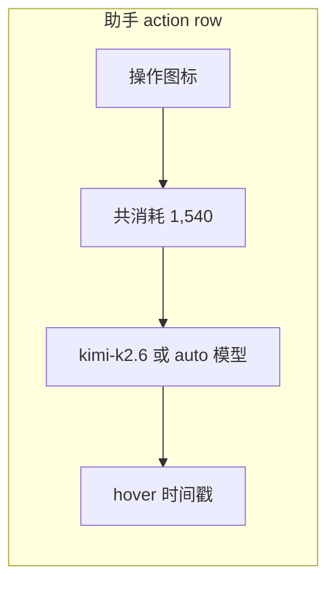

# 助手气泡底栏：本轮消耗 + 本轮模型

Planned-with: Cursor Grok 4.6

Suggested-Impl-Model: Cursor Grok 4.6（跨栈：运行时累加 + messages.json 落盘 + Desktop 底栏；UI 密度需对齐现有 action row）

> **For implementer:** 只按本文件落地。不要读本次对话。不要实现 auto 选模路由。不要改 `agenticx/studio/server.py` 的 import 区。不要改 Context chip / 会话累计 token UI。不要改用户气泡底栏。

**Goal:** 每一轮助手回复的 action row 右侧展示**本轮** token 消耗与**本轮实际使用的模型**；切会话 / 重启后仍在；未来 auto 选模时显示 `auto(模型名)`。

**Architecture:** 运行时把一轮内所有 LLM 调用的 usage **求和**，写入该轮 `chat_history` 助手行的 `provider` / `model` / `usage` / `model_selection`。Desktop 从 `messages.json` 映射到 `Message`，在现有助手 action row（图标右侧、时间戳左侧）渲染。不新造会话级账本。

**Tech Stack:** Python 3.11+（runtime + session normalize）+ Desktop React/TS + Vitest + pytest。无新依赖。

---

## 推荐实施模型

| 子规划 | 推荐模型 | 理由 |
|---|---|---|
| 后端：轮次累加 + 助手行落盘 | Composer 2.5 | 纯函数 + 已有 `_finish_terminal_reply` 落点，无审美 |
| 前端：映射 / merge / 格式化纯函数 | Composer 2.5 | 样板接线，有现成 `session-message-map` 模式 |
| 前端：底栏 UI 接线 | Cursor Grok 4.6 | 要贴齐现有 `text-faint` / 11px / hover 时间戳密度，避免再长一截徽章 |

---

## 背景与根因（实施者请先读完）

### 用户要的（图 1 → 图 2 只抄两点）

当前 Near 助手气泡底栏：复制 / 引用 / 收藏 / 转发 / 多选 + **hover 才出现的时间**。

参考产品底栏右边还有：

1. **本轮消耗**（不是整个 session 累计）
2. **本轮模型**（同一 session 第 1 轮用 A、第 2 轮用 B，两条回复各记各的）
3. 以后若有 auto 选模，文案为 `auto(A模型)` / `auto(B模型)`，不要做成「快速 (xxx)」那种速度档

时间戳交互保持现状：hover 才显。用户气泡不改。

### 事实 1：前端 `Message` 已有 `provider` / `model`，但磁盘助手行通常是空的

`desktop/src/store.ts` L254–L255 已有 `provider?: string; model?: string`。

`ChatPane` 提交时会把当前窗格模型塞进内存行（`addPaneMessage(..., chatProvider, chatModel)`，约 L11655）。

但后端 `_finish_terminal_reply`（`agenticx/runtime/agent_runtime.py` L3005–L3032）写入 `chat_history` 的助手行**只有** `role/content/metadata/suggested_questions/reasoning/references/...`，**不写** `provider` / `model`。

`SessionManager._normalize_messages`（`agenticx/studio/session_manager.py` L2597–L2605）会读 `item.provider` / `item.model`，空字符串就空着。

因此：当场切换模型再发下一条，内存里两条回复模型可能对；**一旦 `mergeTailFromDisk` / 重载 session，历史行模型丢光**。这就是「必须落盘」的根因，不是纯 CSS。

### 事实 2：本轮消耗今天只进了会话累计，且 SSE 往往只有「最后一次 LLM 调用」

`ChatPane.tsx` L11483–L11489：`token_usage` SSE 只调用 `accumulatePaneTokens`（窗格 / `localStorage` 会话累计）。**不挂到那条助手 Message 上**。

`server.py` L359–L361：只在 `FINAL` 后吐 `token_usage`。

`agent_runtime.py` L5410–L5423：`FINAL.usage_metadata` 来自**最后一次** `usage_metadata_from_llm_response(response)`。多工具轮次时，这不是本轮总和。

同文件 L4380–L4407：每一轮 LLM 已经 `token_budget.record(_round_usage)` 并写入 `usage.sqlite`，但**没有**把总和写回助手行 / FINAL。

所以「共消耗」必须在 runtime **累加本轮所有 round**，再写入助手行 + FINAL。顺带让现有 Context chip 的 `token_usage` 不再少计（同一 payload，不算新 UI）。

### 事实 3：底栏挂点已经固定，不要另起一行

助手图标行 class：`ASSISTANT_ACTION_ICON_ROW_CLASS`（`desktop/src/components/messages/im-layout.ts` L115–L116）。

`MessageTimestamp`（`desktop/src/components/messages/MessageTimestamp.tsx`）已经在该行末尾，`align="left"` 时 hover 显 `YYYY-MM-DD HH:mm`。

挂点（都必须改，漏一个就会出现「有的回复有、ReAct 块没有」）：

| 位置 | 文件 | 现有时间戳 |
|---|---|---|
| ImBubble 产物行 | `ImBubble.tsx` ~L1005 | `<MessageTimestamp ts={message.timestamp} align="left" />` |
| ImBubble followup 行 | `ImBubble.tsx` ~L1019 | 同上 |
| ImBubble 默认图标行 | `ImBubble.tsx` ~L1034 | 同上 |
| ReAct 块图标行 | `ChatPane.tsx` ~L8335 | `<MessageTimestamp ts={lastAssistantInBlock?.timestamp} align="left" />` |

`showInlineAssistantModelBadge`（`ChatPane.tsx` L2885–L2895）对 Meta / 单聊分身 / 群聊 / 定时任务**全部为 false**。不要复活气泡内 `ModelBadge`。新信息只进 action row。

### 事实 4：auto 选模还不存在

仓库没有「按轮自动选模型」的产品开关。本需求只预留：

- 落盘字段 `model_selection`: `"manual"` | `"auto"`（本期恒为 `"manual"`）
- 展示函数：`auto` → `auto(kimi-k2.6)`，否则 → `kimi-k2.6`

禁止做模型路由、禁止抄「快速 / 闪电」档位。

---

## 数据契约（写全，禁止按需推断）

### messages.json 助手行新增 / 补齐字段

```json
{
  "role": "assistant",
  "content": "...",
  "provider": "moonshot",
  "model": "kimi-k2.6",
  "model_selection": "manual",
  "usage": {
    "input_tokens": 1200,
    "output_tokens": 340,
    "cached_tokens": 80,
    "reasoning_tokens": 0,
    "total_tokens": 1540
  }
}
```

规则：

- `provider` / `model`：本轮 `session.provider_name` / `session.model_name`（与 `/api/chat` body 写入 session 的值一致）
- `model_selection`：本期写死 `"manual"`；缺省按 `"manual"`
- `usage.*`：本轮所有 LLM round 的非负整数和；`total_tokens` 若各 round 都是 0，则用 `input+output` 回填
- 旧历史没有这些字段：UI **不显示**消耗、没有 model 就不显示模型；不要用当前窗格模型去「猜」旧行
- 中断 / 无 FINAL 的 partial 行：可以没有 `usage`；有 `provider/model` 更好，没有也不补假数据

### Desktop `Message` 增补（`store.ts`）

```ts
export type MessageUsage = {
  inputTokens: number;
  outputTokens: number;
  cachedTokens: number;
  reasoningTokens: number;
  totalTokens: number;
};

export type ModelSelection = "manual" | "auto";

// 挂在 Message 上：
usage?: MessageUsage;
modelSelection?: ModelSelection;
```

`provider` / `model` 已存在，不要改名。

### SSE `token_usage`（已有通道，改语义）

`FINAL.usage_metadata` 的 `input_tokens` / `output_tokens` / `cached_tokens` / `reasoning_tokens` / `total_tokens` 改为**本轮合计**（仍带现有 `model` / `provider` / cache telemetry）。`server.py` 现有「FINAL 后追加 token_usage」逻辑不动，**禁止改 server.py import**。

---

## In scope / Out of scope

### In scope

- runtime 本轮 usage 累加
- `_finish_terminal_reply` 给助手行写 `provider/model/usage/model_selection`
- `_normalize_messages` 透传 `usage` / `model_selection`
- Desktop 映射、merge 保字段、底栏展示
- ChatPane 流式收尾把 `token_usage` 挂到当轮助手行
- 单测（pytest + vitest）

### Out of scope

- auto 选模 / 路由 / 「快速」档
- 以 USD / 积分 / `compute_cost_usd` 作为主展示（本期只展示 token 数）
- 用户气泡底栏
- Lite `ChatView`
- Context chip / `agx-session-token-cache-v1` UI
- 复活 `ModelBadge`
- Enterprise / 群聊另做一套（群聊只要走同一 `_finish_terminal_reply` 即可）
- 改 `server.py` import 区或无关 chat 路径
- 给旧历史反填 usage

---

## 视觉规格（对照图 1 / 图 2）

同一行，从左到右：

`[复制][引用][收藏][转发][多选]  共消耗 1,540   kimi-k2.6   [hover 时间]`

- 字号 `text-[11px]`、颜色 `text-text-faint`，与 `MessageTimestamp` 一致
- 「共消耗」与数字同一 `span`，数字用 `toLocaleString("en-US")`（`1,540`）
- 模型用 `normalizeBareModelId`（去掉 `openai/` 前缀），**不要** `厂商/模型`
- auto：`auto(kimi-k2.6)`，括号紧贴，无空格
- 消耗 hover（原生 `title` 即可）：`输入 1,200 · 输出 340 · 缓存 80`
- 缺 usage：整段「共消耗」不渲染；缺 model：模型不渲染；两者都缺：只剩图标 + 时间
- 流式中的占位气泡：不显示消耗（还没有本轮合计）
- 不要钻石积分图标、不要闪电「快速」——那些是参考产品的积分/档位，不是本需求



---

## FR / AC

### FR-1 本轮 usage 在 runtime 求和并写入 FINAL

- 一轮内 3 次 LLM（例如 800+200、400+100、200+50）→ 助手行 `usage.total_tokens == 1750`（或各 round `total` 之和），`input_tokens == 1400`，`output_tokens == 350`
- FINAL / `token_usage` 的这三个字段与助手行一致，不是最后一次 250

**AC-1**

- 测试：`tests/test_turn_usage_accumulate.py`
- 覆盖 `add_usage_dicts`（见任务 1）空 / 单次 / 三次累加
- 覆盖「last response only」不得被当成轮合计的回归（用假 session 调累加后再组装 payload）

### FR-2 助手行落盘 provider/model/usage/model_selection

- `_finish_terminal_reply` 写出的 `chat_history[-1]` 含上述字段
- `_normalize_messages` 再读出来字段仍在（不会被白名单丢掉）

**AC-2**

- 测试：`tests/test_finish_terminal_reply_usage.py`（或扩现有 runtime persist 测试）
- 断言 hist 含 `provider`、`model`、`model_selection=="manual"`、`usage.input_tokens` 等
- 断言 normalize 往返不丢 `usage`

### FR-3 Desktop 重载后仍显示该行自己的模型与消耗

- `mapLoadedSessionMessage` 读出 `usage` / `modelSelection`
- `overlayMemoryEnrichment`：磁盘有值用磁盘；磁盘空则保留内存（避免 persist 前 merge 把刚挂上的 usage 抹掉）

**AC-3**

- 测试：`desktop/src/utils/session-message-map.test.ts`（可新建）
- 测试：`desktop/src/utils/session-message-merge.test.ts` 增一条 overlay 用例
- 夹具：磁盘行有 `model: "kimi-k2.6"` + `usage.total_tokens: 1540` → Message 对应字段非空

### FR-4 底栏展示与 auto 文案

- 助手行：`共消耗 1,540` + `kimi-k2.6`
- `modelSelection==="auto"`：`auto(kimi-k2.6)`
- 用户行：无这两项
- 旧行无 usage/model：不出现「共消耗 0」、不出现当前窗格模型

**AC-4**

- 测试：`desktop/src/utils/message-turn-meta.test.ts`
- `formatTurnUsageLabel` / `formatTurnModelLabel` 的表格用例（见任务 3 完整输入）
- 组件测试：`desktop/src/components/messages/MessageTurnMeta.test.tsx` 断言渲染文本、旧行空渲染

### FR-5 流式当轮也能立刻看到（不必等重载）

- `token_usage` 到达后，当前窗格最后一条助手消息带上 `usage`（若助手行已 commit）或随随后 `addPaneMessage` extras 写入

**AC-5**

- 不强制 e2e。ChatPane 里用局部变量 `pendingTurnUsage` 在 commit extras 写入即可。
- 用现有 `mergeLastPaneMessageByRole`；`addPaneMessage` extras 的 `Pick` **必须**加上 `usage` | `modelSelection`，否则 extras 会被丢掉（当前 L698–L718 没有这两项）。

---

## 实现落点

### Task 1: usage 累加纯函数

**Files:**

- Modify: `agenticx/runtime/usage_metadata.py`（文件末尾新增，不要改现有 `usage_metadata_from_llm_response` 语义）
- Create: `tests/test_turn_usage_accumulate.py`

**函数（必须叫这个名字）：**

```python
_USAGE_KEYS = (
    "input_tokens",
    "output_tokens",
    "cached_tokens",
    "reasoning_tokens",
    "total_tokens",
)


def empty_usage_dict() -> dict[str, int]:
    return {k: 0 for k in _USAGE_KEYS}


def add_usage_dicts(
    acc: dict[str, int] | None,
    delta: dict[str, int] | None,
) -> dict[str, int]:
    out = empty_usage_dict()
    for src in (acc, delta):
        if not src:
            continue
        for key in _USAGE_KEYS:
            out[key] += max(0, int(src.get(key, 0) or 0))
    if out["total_tokens"] == 0 and (out["input_tokens"] or out["output_tokens"]):
        out["total_tokens"] = out["input_tokens"] + out["output_tokens"]
    return out


def usage_dict_has_counts(usage: dict[str, int] | None) -> bool:
    if not usage:
        return False
    return any(int(usage.get(k, 0) or 0) > 0 for k in _USAGE_KEYS)
```

**Step:** 先写测试再实现。三次累加断言见 AC-1。

### Task 2: runtime 本轮累加 + 助手行落盘

**Files:**

- Modify: `agenticx/runtime/agent_runtime.py`
  - `run_turn` 进入主循环前：`turn_usage = empty_usage_dict()`（局部变量，不要挂在 self 上跨 turn 污染）
  - L4380 附近，已有 `_round_usage = usage_metadata_from_llm_response(response)` 之后：`turn_usage = add_usage_dicts(turn_usage, _round_usage)`
  - L5410–L5423：**不要再用最后一次 response 当主数字**。改为：

```python
from agenticx.runtime.usage_metadata import (
    add_usage_dicts,
    empty_usage_dict,
    usage_dict_has_counts,
    usage_metadata_from_llm_response,
)

# L5410 替换意图：
_um = dict(turn_usage) if usage_dict_has_counts(turn_usage) else usage_metadata_from_llm_response(response)
_usage_payload: dict[str, Any] | None = None
if _um and usage_dict_has_counts(_um):
    _usage_payload = {
        **{k: int(_um.get(k, 0) or 0) for k in (
            "input_tokens", "output_tokens", "cached_tokens",
            "reasoning_tokens", "total_tokens",
        )},
        "model": model_name,
        "provider": provider_name,
        # cache telemetry 仍取 last round（观测用，不是消耗主数字）
        "cache_mode": latest_cache_telemetry.get("cache_mode", "disabled"),
        ...
    }
```

注意：`turn_usage` 必须在 `run_turn` 的闭包里对 L5410 可见。若 L5410 与 L4380 不在同一函数作用域，把累加器做成 `run_turn` 内层的 `nonlocal` / 同一函数局部变量。**禁止**用 `self._turn_usage` 而不在 `run_turn` 开头重置。

- Modify: `agenticx/runtime/agent_runtime.py` `_finish_terminal_reply` L3005–L3032，在 `_chat_history_append_deduped` **之前**补：

```python
prov = str(getattr(session, "provider_name", "") or "").strip()
mdl = str(getattr(session, "model_name", "") or "").strip()
if prov:
    hist["provider"] = prov
if mdl:
    hist["model"] = mdl
hist["model_selection"] = "manual"
if usage_metadata:
    hist["usage"] = {
        "input_tokens": int(usage_metadata.get("input_tokens", 0) or 0),
        "output_tokens": int(usage_metadata.get("output_tokens", 0) or 0),
        "cached_tokens": int(usage_metadata.get("cached_tokens", 0) or 0),
        "reasoning_tokens": int(usage_metadata.get("reasoning_tokens", 0) or 0),
        "total_tokens": int(usage_metadata.get("total_tokens", 0) or 0),
    }
    if hist["usage"]["total_tokens"] == 0:
        hist["usage"]["total_tokens"] = (
            hist["usage"]["input_tokens"] + hist["usage"]["output_tokens"]
        )
    if not usage_dict_has_counts(hist["usage"]):
        hist.pop("usage", None)
```

**不要**把 cache telemetry 写入 `hist["usage"]`。

- Modify: `agenticx/studio/session_manager.py` `_normalize_messages`，在 L2605 `model` 之后增加透传（assistant / 任意 role 都可，有则留）：

```python
raw_sel = str(item.get("model_selection", "") or "").strip().lower()
if raw_sel in {"manual", "auto"}:
    row["model_selection"] = raw_sel
raw_usage = item.get("usage")
if isinstance(raw_usage, dict):
    usage_out = {
        "input_tokens": max(0, int(raw_usage.get("input_tokens", 0) or 0)),
        "output_tokens": max(0, int(raw_usage.get("output_tokens", 0) or 0)),
        "cached_tokens": max(0, int(raw_usage.get("cached_tokens", 0) or 0)),
        "reasoning_tokens": max(0, int(raw_usage.get("reasoning_tokens", 0) or 0)),
        "total_tokens": max(0, int(raw_usage.get("total_tokens", 0) or 0)),
    }
    if usage_out["total_tokens"] == 0:
        usage_out["total_tokens"] = usage_out["input_tokens"] + usage_out["output_tokens"]
    if any(usage_out.values()):
        row["usage"] = usage_out
```

int 转换失败当 0（`try/except (TypeError, ValueError)`）。

**测试：** `tests/test_session_normalize_usage.py`：构造含 usage 的助手 dict → `_normalize_messages` → 字段仍在。若单测 `SessionManager` 构造太重，抽一段 normalize usage 到可测 helper；**优先**直接测 `_normalize_messages`（已有 session_manager 测试可仿）。

### Task 3: Desktop 类型 + 映射 + 格式化

**Files:**

- Modify: `desktop/src/store.ts`
  - 在 `Message` 旁新增 `MessageUsage` / `ModelSelection`
  - `Message` 增加 `usage?` / `modelSelection?`
  - `addPaneMessage` extras 的 `Pick` 增加 `"usage" | "modelSelection"`（L698–L718）
- Modify: `desktop/src/utils/session-message-map.ts`
  - `LoadedSessionMessage` 增加 `usage?`、`model_selection?`
  - `mapLoadedSessionMessage` 在 `provider/model` 赋值后解析 usage（字段名 snake → camel）
- Modify: `desktop/src/utils/session-message-merge.ts` `overlayMemoryEnrichment`（L62–L80）增加：

```ts
provider: diskRow.provider || memory.provider,
model: diskRow.model || memory.model,
usage: diskRow.usage ?? memory.usage,
modelSelection: diskRow.modelSelection ?? memory.modelSelection,
```

磁盘空字符串视为空：`(diskRow.provider || "").trim() || memory.provider`。

- Create: `desktop/src/utils/message-turn-meta.ts`

```ts
import { normalizeBareModelId } from "./model-display";
import type { MessageUsage, ModelSelection } from "../store";

export function parseMessageUsage(raw: unknown): MessageUsage | undefined {
  if (!raw || typeof raw !== "object") return undefined;
  const o = raw as Record<string, unknown>;
  const n = (v: unknown) => {
    const x = Number(v);
    return Number.isFinite(x) && x > 0 ? Math.trunc(x) : 0;
  };
  const inputTokens = n(o.input_tokens ?? o.inputTokens);
  const outputTokens = n(o.output_tokens ?? o.outputTokens);
  const cachedTokens = n(o.cached_tokens ?? o.cachedTokens);
  const reasoningTokens = n(o.reasoning_tokens ?? o.reasoningTokens);
  let totalTokens = n(o.total_tokens ?? o.totalTokens);
  if (totalTokens <= 0) totalTokens = inputTokens + outputTokens;
  if (inputTokens <= 0 && outputTokens <= 0 && totalTokens <= 0 && cachedTokens <= 0) {
    return undefined;
  }
  return { inputTokens, outputTokens, cachedTokens, reasoningTokens, totalTokens };
}

export function formatTurnUsageLabel(usage: MessageUsage): string {
  const n = usage.totalTokens > 0 ? usage.totalTokens : usage.inputTokens + usage.outputTokens;
  if (n <= 0) return "";
  return `共消耗 ${n.toLocaleString("en-US")}`;
}

export function formatTurnUsageTitle(usage: MessageUsage): string {
  const parts = [
    `输入 ${usage.inputTokens.toLocaleString("en-US")}`,
    `输出 ${usage.outputTokens.toLocaleString("en-US")}`,
  ];
  if (usage.cachedTokens > 0) parts.push(`缓存 ${usage.cachedTokens.toLocaleString("en-US")}`);
  return parts.join(" · ");
}

export function formatTurnModelLabel(
  model: string | undefined,
  selection?: ModelSelection,
): string {
  const bare = normalizeBareModelId(model ?? "");
  if (!bare) return "";
  return selection === "auto" ? `auto(${bare})` : bare;
}

export function parseModelSelection(raw: unknown): ModelSelection | undefined {
  const s = String(raw ?? "").trim().toLowerCase();
  if (s === "auto" || s === "manual") return s;
  return undefined;
}
```

**测试表格（必须原样写入测试）：**

| 输入 | 期望 |
|---|---|
| `formatTurnUsageLabel({ totalTokens: 1540, inputTokens: 1200, outputTokens: 340, cachedTokens: 80, reasoningTokens: 0 })` | `共消耗 1,540` |
| `formatTurnUsageLabel({ totalTokens: 0, inputTokens: 0, outputTokens: 0, cachedTokens: 0, reasoningTokens: 0 })` | `""` |
| `formatTurnModelLabel("kimi-k2.6")` | `kimi-k2.6` |
| `formatTurnModelLabel("openai/kimi-k2.6")` | `kimi-k2.6` |
| `formatTurnModelLabel("kimi-k2.6", "auto")` | `auto(kimi-k2.6)` |
| `formatTurnModelLabel("", "auto")` | `""` |
| `parseMessageUsage({ input_tokens: 1, output_tokens: 2, total_tokens: 0 })` | `totalTokens === 3` |

### Task 4: 底栏组件 + 四个挂点

**Files:**

- Create: `desktop/src/components/messages/MessageTurnMeta.tsx`
- Create: `desktop/src/components/messages/MessageTurnMeta.test.tsx`
- Modify: `ImBubble.tsx` 三处时间戳旁
- Modify: `ChatPane.tsx` ReAct 块 L8335 旁

组件（不要再包一层大卡片）：

```tsx
export function MessageTurnMeta({
  usage,
  model,
  modelSelection,
}: {
  usage?: MessageUsage;
  model?: string;
  modelSelection?: ModelSelection;
}) {
  const usageLabel = usage ? formatTurnUsageLabel(usage) : "";
  const modelLabel = formatTurnModelLabel(model, modelSelection);
  if (!usageLabel && !modelLabel) return null;
  return (
    <span className="ml-1.5 inline-flex min-w-0 items-center gap-2 text-[11px] leading-none text-text-faint">
      {usageLabel ? (
        <span className="shrink-0" title={usage ? formatTurnUsageTitle(usage) : undefined}>
          {usageLabel}
        </span>
      ) : null}
      {modelLabel ? (
        <span className="min-w-0 truncate" title={modelLabel}>
          {modelLabel}
        </span>
      ) : null}
    </span>
  );
}
```

ImBubble 建议抽局部，避免三处复制：

```tsx
const assistantTurnMeta = (
  <>
    <MessageTurnMeta
      usage={message.usage}
      model={message.model}
      modelSelection={message.modelSelection}
    />
    <MessageTimestamp ts={message.timestamp} align="left" />
  </>
);
```

三处 `<MessageTimestamp ... />` 换成 `{assistantTurnMeta}`。

ReAct：对 `lastAssistantInBlock` 同样挂 `MessageTurnMeta` + 原时间戳。

用户行 L751 的 `MessageTimestamp` **不要动**。

### Task 5: ChatPane 流式挂 usage

**Files:**

- Modify: `desktop/src/components/ChatPane.tsx` 仅 SSE `token_usage` 分支 + 助手 commit extras

在该轮 stream 循环的局部作用域加：

```ts
let pendingTurnUsage: MessageUsage | undefined;
let pendingTurnModel = { provider: chatProvider, model: chatModel };
```

`token_usage` 分支（现 L11483）改为：

```ts
if (payload.type === "token_usage") {
  const parsed = parseMessageUsage(payload.data);
  const inp = parsed?.inputTokens ?? 0;
  const out = parsed?.outputTokens ?? 0;
  const cached = parsed?.cachedTokens ?? 0;
  if (inp > 0 || out > 0 || cached > 0) {
    useAppStore.getState().accumulatePaneTokens(pane.id, inp, out, cached);
  }
  if (parsed) {
    pendingTurnUsage = parsed;
    const p = String(payload.data?.provider ?? "").trim() || chatProvider;
    const m = String(payload.data?.model ?? "").trim() || chatModel;
    pendingTurnModel = { provider: p, model: m };
    useAppStore.getState().mergeLastPaneMessageByRole(pane.id, "assistant", {
      usage: parsed,
      provider: p || undefined,
      model: m || undefined,
      modelSelection: "manual",
    });
  }
}
```

循环结束后 `addPaneMessageIfSessionActive` / `mergeLastPaneMessageByRole` 的 extras 并上：

```ts
...(pendingTurnUsage ? { usage: pendingTurnUsage } : {}),
...(pendingTurnModel.provider ? { /* provider 走 addPaneMessage 的 positional 即可 */ } : {}),
modelSelection: "manual",
```

`addPaneMessage` 的 positional `provider/model` 已有，继续传 `pendingTurnModel.provider/model`（不要只传 chatProvider，以免 SSE 带回的实际模型被丢掉）。

**禁止**在这个任务里改 Context chip 组件。

---

## 验证

```bash
pytest tests/test_turn_usage_accumulate.py tests/test_finish_terminal_reply_usage.py tests/test_session_normalize_usage.py tests/test_smoke_deerflow_token_usage.py -q
cd desktop && npx vitest run src/utils/message-turn-meta.test.ts src/utils/session-message-map.test.ts src/utils/session-message-merge.test.ts src/components/messages/MessageTurnMeta.test.tsx
```

手动（Near Desktop Pro）：

1. 同一 session 第 1 轮模型 A，第 2 轮改模型 B，两条助手底栏模型不同
2. 含工具多轮的一轮，「共消耗」明显大于最后一次补全（可对照设置里的用量或 `~/.agenticx/usage.sqlite` 该 session 近几行之和）
3. 切到别的 session 再切回：数字与模型还在
4. 重启 Desktop：历史行仍在（旧行没字段的保持空白）
5. hover 底栏：时间仍在；消耗 title 有输入/输出

---

## no-scope-creep 边界

每个 diff 必须能对上 FR-1…FR-5。下列全部禁止：

- 重构 ImBubble 布局 / 改 action row 高度体系
- 给用户行加消耗
- 实现 auto picker
- 主数字改成美元或「4.39」积分
- 改 `server.py` 顶部 import
- 「顺便」改 Context chip 文案或定价表
