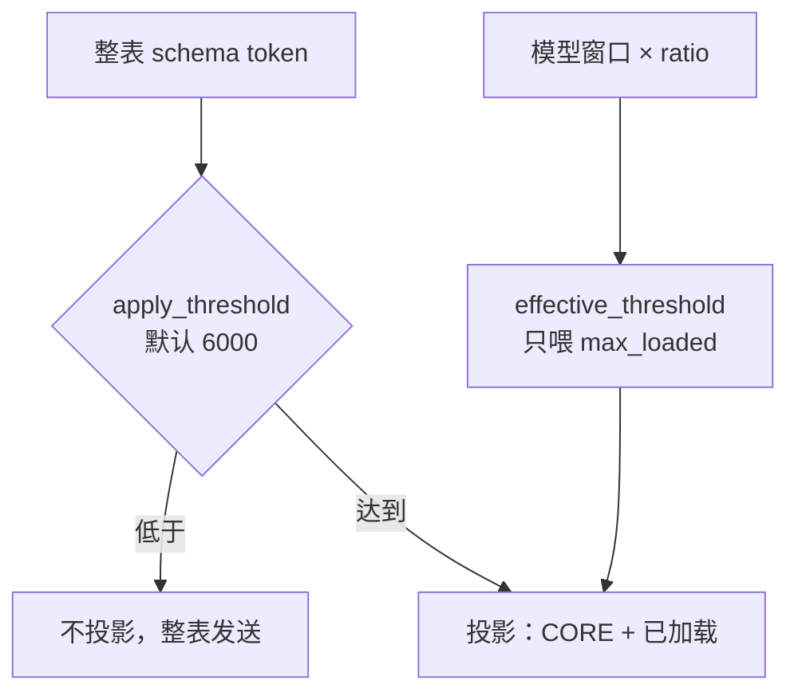

# ToolSearch 启用门槛与窗口预算解耦

Planned-with: grok 4.6
Suggested-Impl-Model: composer-2.5

> 会话磁盘 `~/.agenticx/sessions/2bbaa24b-36ce-4b5e-b683-9ecebd291d6c/context_stats.jsonl` 为根因证据；plan / commit 不得写入客户名。

## 根因与证据

`glm-5.3-flash` 被解析为 1M 窗口后，自适应阈值变成 `min(50000, 1_000_000 × ratio)` = **50000**。Studio 整表 schema 约 15955–19315 token，低于 50000，于是 `should_apply_tool_search` 为 false，投影退回整表。

同一会话历史：

- 前 68 轮（窗口按 128K 算，阈值 10240）：`applied=true`，`schema_tokens_sent≈5500–6283`，`saved≈13000`
- 后 12 轮（阈值 50000）：`applied=false`，`sent=19315`，`saved=0`，`cache_prefix` **94 工具 / 70602 字符**，智谱实报 input **72421**

投影本身是好的：`mode=always` 时本机 75 个池子只送约 20 个 CORE、约 3906 估算 token。MCP schema 本来就不在默认 `tools[]` 里（目录 165 候选 vs 请求 94 个内置）。



## 方案

**启用门槛**永远读 `auto_schema_token_threshold`（默认 6000），与窗口无关。  
**窗口 × ratio** 只决定延迟工具热缓存上限 `resolve_max_loaded`。  
`manual` 策略保持现状：同一数字既是启用门槛也是热缓存预算。

不改 `CORE_ALWAYS_LOAD_TOOLS`，不改 MCP 展平，不改 `is_deferred_builtin`。

## Suggested-Impl-Model 表

| 子任务 | 推荐模型 | 理由 |
|---|---|---|
| 阈值拆分 + 单测 | composer-2.5 | 纯函数改接线，已有测试锚点 |
| Settings 文案 | composer-2.5 | 两段中文说明，无视觉重塑 |

## In scope

- `resolve_apply_threshold` + runtime / telemetry 接线
- 自适应设置区同时展示「启用门槛」与「热缓存占比」，并改说明，避免用户以为比例仍控制是否启用
- 对应单测 / smoke

## Out of scope

- 改 CORE / `BUILTIN_DEFER_ALLOWLIST` / `is_deferred_builtin`
- 把 MCP schema 加进或移出默认 `tools[]`
- 压缩 `<session-context>` / 系统提示
- 改 `THRESHOLD_CEIL`、默认 ratio、Desktop 非 ToolSearch 控件
- 重构 `server.py` 顶部 import

---

### FR-1: 自适应模式下 1M 窗口仍按 6000 闸门启用投影

**落点：** `agenticx/runtime/tool_search.py`

在 `resolve_effective_threshold`（约 L339）**之后**新增：

```python
def resolve_apply_threshold(config: ToolSearchConfig) -> int:
    """Gate for turning projection on. Never scale with context window."""
    return int(config.normalized().auto_schema_token_threshold)
```

`ToolSearchRuntimeContext`（约 L191）增加：

```python
apply_threshold: Optional[int] = None
```

`_resolve_applied`（约 L410）**禁止**再把 `ctx.effective_threshold`（窗口预算）传给 `should_apply_tool_search`。改为：

```python
thr = ctx.apply_threshold
if thr is None:
    thr = resolve_apply_threshold(ctx.config)
return should_apply_tool_search(..., effective_threshold=thr, prev_applied=ctx.prev_applied)
```

`should_apply_tool_search` 签名保持不变（调用方传入的 `effective_threshold` 语义变为「启用门槛」）。

**Before：** 1M 窗 + 19315 整表 → 与 50000 比 → 不投影。  
**After：** 同一池子与 6000 比 → 投影；`resolve_effective_threshold(..., 1_000_000)` 仍为 50000，只影响 `max_loaded`。

**AC-1：** `tests/test_tool_search_adaptive_threshold.py` 新增：

- `resolve_apply_threshold(ToolSearchConfig(mode="auto")) == 6000`
- `resolve_apply_threshold(ToolSearchConfig(mode="auto", auto_schema_token_threshold=8000)) == 8000`
- `resolve_effective_threshold(cfg, context_window=1_000_000) == 50_000`（窗口预算不变）
- `should_apply_tool_search(cfg, full_pool_schema_tokens=19_315, tool_search_allowed=True, effective_threshold=6000) is True`
- 对比：传入 `effective_threshold=50_000` 时对 19315 为 False（锁定旧 bug，防止再把预算当闸门）

既有 `test_resolve_effective_threshold_adaptive_windows` / `test_mode_auto_threshold` / hysteresis 单测不得改断言语义。

---

### FR-2: `build_runtime_context` 拆开两个数字

**落点：** `agenticx/runtime/tool_search_runtime.py` `build_runtime_context`（约 L136–169）

```python
apply_threshold = resolve_apply_threshold(cfg)
effective_threshold = resolve_effective_threshold(cfg, context_window=window)
applied = should_apply_tool_search(
    cfg,
    full_pool_schema_tokens=pool_tokens,
    tool_search_allowed=tool_search_allowed,
    effective_threshold=apply_threshold,  # 不是 effective_threshold
    prev_applied=prev_applied,
)
scratchpad[TOOL_SEARCH_DECISION_KEY] = {
    ...
    "effective_threshold": int(effective_threshold),  # 窗口热缓存预算，键名保持兼容
    "apply_threshold": int(apply_threshold),
    ...
}
return ToolSearchRuntimeContext(..., effective_threshold=effective_threshold, apply_threshold=apply_threshold, ...)
```

`apply_search` / `auto_load_deferred_tool` 继续用 `ctx.effective_threshold` 调 `resolve_max_loaded`（1M 窗仍可热缓存到 24）。

**AC-2：** `tests/test_smoke_tool_search_adaptive_runtime.py` 新增 `test_build_runtime_context_1m_model_applies_studio_sized_pool`：

- session `model_name="glm-5.3-flash"`，`scratchpad={}`，显式 `config=ToolSearchConfig(mode="auto")`（勿读用户盘上的 yaml）
- 构造 `estimate_schema_tokens(pool) >= 6000` 且 `< 50000` 的工具池（可复用该文件里 fat_props 手法）
- 断言 `ctx.apply_threshold == 6000`
- 断言 `ctx.effective_threshold == 50_000`
- 断言 `ctx.resolved_applied is True`
- 断言 scratchpad `apply_threshold == 6000` 且 `effective_threshold == 50_000`

既有 `test_build_runtime_context_adaptive_threshold_by_model`（claude-sonnet-5 → 10000，qwen-plus → 6400）保持。该测未传 config，若本机 `context_budget_ratio≠0.05` 可能本就对用户配置敏感——**不要改它来迁就本机 yaml**。

---

### FR-3: context_stats 同时记下启用门槛

**落点：** `agenticx/runtime/agent_runtime.py` 约 L3882–3935（只增字段，勿改相邻 persist / yield）

在现有 `_ts_threshold = int(ts_ctx.effective_threshold or 0)` 旁增加：

```python
_ts_apply_threshold = int(getattr(ts_ctx, "apply_threshold", None) or 0)
```

`context_payload` 增加：

```python
"tool_search_apply_threshold": int(_ts_apply_threshold),
```

保留 `tool_search_effective_threshold` = 窗口预算。except 分支补 `0`。

**AC-3：** 若已有 context_stats 形状断言则跟上；否则以 `tests/test_agent_runtime_tool_search.py` 或 adaptive smoke 能跑绿为准。禁止为加字段去改 `server.py` 顶部 import。

---

### FR-4: 设置区文案与自适应门槛可见

**落点：** `desktop/src/components/automation/ToolSearchConfigSection.tsx`

自适应分支（约 L102–122）**同时**展示：

1. 与手动模式相同的「自动启用阈值」滑杆（绑定现有 `threshold` / `onThresholdChange`，SettingsPanel 已会 persist `tool_search_auto_schema_token_threshold`）
2. 现有「工具最多占上下文（%）」滑杆

文案必须改准，禁止再写「比例 = 是否启用」：

- 启用阈值旁：`整表 schema 超过该值才启用按需加载。与模型上下文窗口无关。`
- 比例旁：把「上下文窗口 × N%（…1M 封顶 50000）」改成说明这是**延迟工具热缓存预算**，例如：`仅限制已加载的延迟工具可占窗口的比例（128k ≈ {example128k}，200k ≈ {example200k}，1M 封顶 {TOOL_SEARCH_THRESHOLD_MAX}），不决定是否启用按需加载。`

策略下拉「自适应（按上下文比例）」可改为「自适应（窗口只扩热缓存）」；不要加长说明段。

**AC-4：** 自适应模式下两个滑杆都在；比例说明含「不决定是否启用」。无独立前端测试文件则不新建，靠阅读组件即可。

---

## 验证

```bash
/Users/damon/.local/bin/python3.12 -m pytest \
  tests/test_tool_search.py \
  tests/test_tool_search_adaptive_threshold.py \
  tests/test_smoke_tool_search_adaptive_runtime.py \
  tests/test_agent_runtime_tool_search.py \
  tests/test_prompt_token_diet.py \
  -q
```

期望：全绿。再用本机 python 对 `glm-5.3-flash` + `studio_tools_for_session` 断言 `resolved_applied is True` 且 `len(projected) < len(pool)`。

## 实施顺序（TDD）

1. 先写 FR-1 / FR-2 失败测试并确认失败（旧实现会让 1M 窗 `resolved_applied is False`）
2. 改 `tool_search.py` + `tool_search_runtime.py` 至绿
3. 补 telemetry 字段
4. 改 Settings 文案
5. 跑完整验证命令
