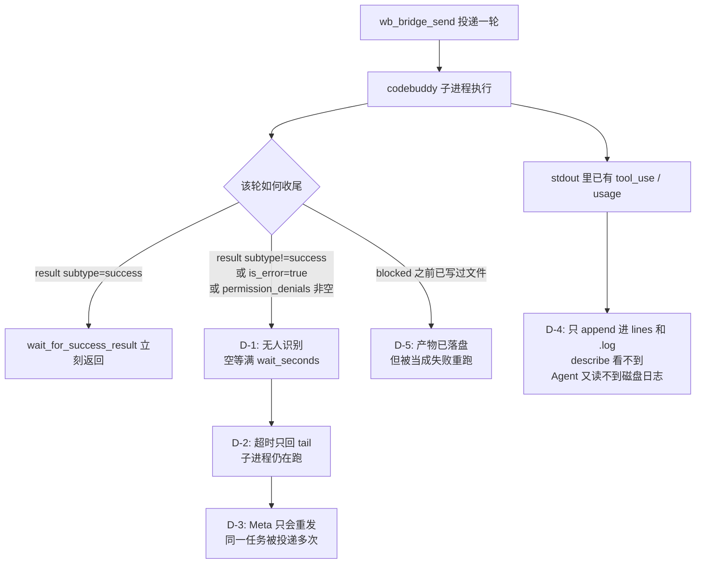
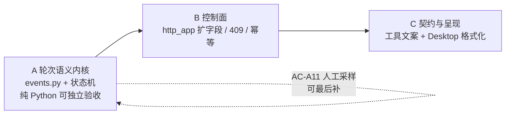

# wb-bridge P0.5：会话监理（主规划 / 索引）

Planned-with: claude-opus-5-thinking
Suggested-Impl-Model: 见 §6「子规划 → 推荐模型」表（本文件本身不含实施动作）

本文件是**主规划**，只承载：根因与证据链、误诊纠正、共享设计约束、In/Out of scope、子规划切分与顺序。**具体 FR/AC 落在三份子规划里**，实施者按顺序取用：

| 子规划 | 文件 | 交付物 |
|---|---|---|
| **A** 轮次语义内核 | `2026-09-04-wb-bridge-supervision-a-turn-semantics.plan.md` | `wb_bridge/events.py` + `session_manager` 状态机 / 用量累计 / `wait_for_turn` |
| **B** 控制面 | `2026-09-04-wb-bridge-supervision-b-control-plane.plan.md` | `http_app` 扩字段、非阻塞投递、409 在飞护栏、幂等键、create hint |
| **C** 契约与呈现 | `2026-09-04-wb-bridge-supervision-c-contract-and-ui.plan.md` | 工具 description 无人值守契约、`wait_seconds=0` 放行、工具层自动幂等键、Desktop 格式化 + 单测、**Meta 系统提示 wb 纪律、automation 屏蔽 start/send/stop（保留 list/describe）、stop 在 running 时需 force**。实时 last_activity 心跳不进 TOOL_PROGRESS（用 describe / `wait_seconds=0` 轮询）。文档与 idle 回收见 §7.5 |

前置 plan：`.cursor/plans/2026-09-03-wb-bridge-local-session.plan.md`（P0，已实施）。本组子规划是其 P0.5 增量，**不重做 P0**。

---

## 1. 背景：P0 能起进程，但还不能当工人用

P0 交付了 `agenticx/wb_bridge/`（settings / session_manager / http_app / process）、`agx wb-bridge serve`、5 个 Studio 工具。链路能跑通，但一次「在 /tmp 写并运行 hello.py」的无人值守委派出现 8 分钟空转：会话被重开三次（`default` → `acceptEdits` → `bypassPermissions`），同一任务重复投递多次，最终靠 `bypassPermissions` 蒙对。



| 缺陷 | 现状（已核对代码） | 后果 | 归属 |
|---|---|---|---|
| **D-1 终止语义只认成功** | `agenticx/cc_bridge/ndjson.py:90 line_looks_like_result_success()` 要求 `type=="result"` **且** `subtype=="success"`；`wb_bridge/session_manager.py:272,279` 仅用它判定 | 被权限拦下/报错的那一轮**不被识别为「本轮已结束」**，`wait_for_success_result` 空等满 180s。这是「超时」的机械成因，不是模型慢 | A |
| **D-2 超时无状态、无恢复** | `wait_for_success_result`（L254-283）超时只回 `f"timeout after {timeout_sec}s\n{tail}"`；`http_app.py:88-91 MessageResponse` 只有 `ok / tail / result_text` | 调用方无法区分「还在跑」「被权限挡住」「进程已死」 | A + B |
| **D-3 重复投递无护栏** | `http_app.py:126 post_message` 无论上一轮是否在飞，都直接 `send_user_message` 再写一行 stdin | 同一任务并发投递，CodeBuddy 侧上下文错乱、token 白烧 | B |
| **D-4 用量与进度不上浮** | `_reader_thread`（L73-85）只 `append_line` + `append_log`；`_session_to_dict`（L121-131）只有 6 个键。`result` 行里的 `usage` / `num_turns` / `duration_ms` 与 `assistant` 行里的 `tool_use` 全被丢在原始行里 | describe 看不到用量与当前动作；Agent 侧 `bash_exec` 受 workspace 沙箱限制读不到 `~/.agenticx/logs/wb-bridge/*.log`，「有数据但拿不到」 | A + B |
| **D-5 失败被误当「什么都没发生」** | 无任何字段告知本轮已执行过哪些工具 | 实测那晚 `hello.py` 在 Bash 被拦**之前**已落盘，Meta 却按失败重跑三次 | A + B + C |

### 1.1 必须纠正的两个误诊（勿照此实施）

复盘对话里有两条结论是错的，任何子规划都不要照做：

1. **「`~/.agenticx/logs/wb-bridge/` 被 macOS 沙箱锁死」**——不成立。bridge 进程写得进去（日志确实在增长）。Agent 侧 `ls/cat` 报 `Operation not permitted` 是 **AGX 自己的 bash workspace 沙箱**（`agent_tools.py` 里 wb 工具描述已写明 *sandbox cannot import agenticx*）。**正确解法是把数据经 HTTP/工具字段上浮，不是把日志目录挂进工作区让 Agent 去 `cat` 18MB 文件。**
2. **「`agx wb-bridge --help` 崩了，说明 CLI 管理面没打通」**——不成立。`tests/test_smoke_wb_bridge.py:233 test_ac9_cli_help_registers_wb_bridge` 已守住注册。它是在 bash 沙箱里 import `agenticx` 失败。**本组子规划不新增任何 CLI 子命令。**

### 1.2 关于「权限确认」的证据边界（重要）

P0 的 E-3 已实测：codebuddy **不支持** `--permission-prompt-tool`，headless 下**不会**吐 `control_request` / `can_use_tool`，逐工具批准在 WB 上**不成立**，`cc_bridge_permission` 对 WB 会话无效。这条不要试图"修"。

但**「default 模式下被权限挡住时，stdout 到底吐什么」目前没有实测样本**。因此设计原则是：

- **不猜格式**：终止判定改为「任何 `type=="result"` 行都算本轮结束」，与具体 subtype 无关，无需新证据即可实现。
- **分类尽力而为**：`permission_denials` 非空 → `blocked`；`is_error` 为真或 `subtype != "success"` → `error`。字段名来自已实测的 `result` 行（`tests/test_smoke_wb_bridge.py:41-57` 的 `_E2_RESULT`，其中 `"permission_denials":[]` 确实存在）。
- **要求补一次证据**：子规划 A 的 AC-A11 是人工采样。若采样发现被权限挡住时**根本不吐 `result` 行**（就地静默挂起），则按 A 的 stall/timeline 兜底处理，并把结论追写回本文件本节，**不要临场改设计**。

---

## 2. 借鉴来源：loopx 控制面（研究产物已在仓库内）

研究物料：`research/codedeepresearch/loopx/`（`loopx_source_notes.md` / `loopx_code_index.md` / `loopx_deepwiki.md`，上游固定 SHA `00837cf34f80bc06b9dd15fefa337247067be20d`，Apache-2.0）。

LoopX 是本地优先的长期目标控制面，其 turn 事务层解决的正是「委派出去之后怎么被监理」。下表是**被采纳**的机制及其在本组子规划中的落点。凡引用 `E-0xx` 均指 `loopx_source_notes.md` §9 Evidence Ledger。

| loopx 机制 | 证据 | 采纳为 | 落点 |
|---|---|---|---|
| settlement 失败**不回滚**已提交 writeback，loop 进 `REPAIR`；失败 ≠ 什么都没发生 | E-034 E-021 | 记录本轮 `observed_tools`，`blocked`/`error` 的 `next_action` 必须提示先核验产物再重试（修 **D-5**） | A（状态字段）· B（响应字段）· C（文案） |
| task lease 带 `version` CAS + idempotency，冲突返回 `DecisionOutcome.CONFLICT` | E-011 | `send` 支持 `idempotency_key`：同键重投**不写 stdin**，直接回当前轮快照 | B |
| 执行前 `LoopXTurnRoute` 与执行后 `LoopXTurnResultKind` 是**两套 typed 词汇**，别混成一个布尔 | E-018 E-019 | 佐证 `status` 分 success/blocked/error/exited/running；`next_action` 对应 loopx 的 `effective_action` | A · B |
| `event_ledger_summary`（读 run index）与 `events.jsonl`（typed 流）是**两本账**，不可混为同一真理 | E-023 E-024 E-030 | 硬性约束：`describe` 的唯一数据源是**内存观测态**，`.log` 文件**不是输入**，禁止解析日志 | A（含边界 AC） |
| turn 契约 7 phase + receipt 要求 `completed_phases` 为**有序前缀**，能答「卡在哪一相」 | E-020 | 轮次时间线三点 `dispatched_at / first_activity_at / terminal_at`，用于区分「冷启动慢」与「执行中/等确认」 | A · B |
| 架构测试用 AST 锁死 control_plane 的 import 预算 | E-025 | 模块边界 AC：`events.py` 不得 import `cc_bridge`；`wb_bridge/**` 不得 import `agenticx.studio` | A |
| Node 缺失 → `EffectRuntimeStartupError`，依赖路径 **fail-closed** | E-031 | 佐证既有行为：`resolve_codebuddy_executable()` 失败抛 `RuntimeError` → HTTP 400，保持不变 | 无需改动 |

**明确不采纳**（避免过度移植）：goal registry / quota plan / lease TTL 文件、Node TS effect runtime 桥、capability hook 三阶段、public/private 脱敏扫描。这些服务于 loopx 的多目标预算与跨 harness 交付，WB bridge 当前是单机单会话桥，引入即过设计。

---

## 3. 共享设计约束（三份子规划都必须遵守）

1. **单一数据源**：`describe` / `list` / `message` 响应的所有状态字段，只能来自 `WbBridgeSession` 的**内存观测态**（由 reader 线程解析 stdout 时写入）。**禁止**为了拿状态去读 `log_path` 指向的文件。理由见 §2 的 E-023/E-024。
2. **加锁顺序固定为 `_global_lock` → `session.lock`**，不得反向；`observe_line` 只持 `session.lock`。任何新增读写都遵守此序，防止死锁。
3. **reader 线程绝不能被异常打死**：解析路径上的任何异常都必须就地兜底（回落为 `error` 分类），否则会话彻底失聪。
4. **向后兼容**：`wait_for_success_result` 保签名保语义；HTTP `MessageResponse` 保留 `ok / tail / result_text`；`_session_to_dict` 保留既有 6 个键（`session_id / cwd / pid / poll / log_path / state`）。既有 16 条 P0 冒烟用例必须继续绿。
5. **代码风格**：新建 Python 文件模块 docstring 须含 `Author: Damon Li`；注释与 docstring 全英文、无 emoji；禁止函数内联 import（见 `.cursor/rules/google-python-style.mdc` 与 `no-inline-imports`）。
6. **不猜未实测的 NDJSON 形状**：只依赖已实测字段（`type` / `subtype` / `is_error` / `permission_denials` / `usage` / `duration_ms` / `num_turns` / `result`）。

---

## 4. In scope / Out of scope（no-scope-creep 硬边界）

### In scope（按子规划归属）

- **A**：新建 `agenticx/wb_bridge/events.py`；改 `agenticx/wb_bridge/session_manager.py`；追写 `tests/test_smoke_wb_bridge.py`。
- **B**：改 `agenticx/wb_bridge/http_app.py`；追写 `tests/test_smoke_wb_bridge.py`。
- **C**：改 `agenticx/cli/agent_tools.py`（**仅 wb_bridge 相关块**）；改 `desktop/src/utils/wb-bridge-ui.ts`；新建 `desktop/src/utils/wb-bridge-ui.test.ts`；**追加 `agenticx/runtime/prompts/meta_agent.py` 的 wb 纪律段**；**改 `agenticx/studio/server.py` 的 automation 屏蔽集合：只加 `wb_bridge_start` / `wb_bridge_send` / `wb_bridge_stop`，保留 list/describe**。

> **边界调整（2026-09-05 复审）**：初版把 `meta_agent.py` 与 `server.py` 列为禁区。复审发现两处必须开口，理由如下，开口范围被严格收窄：
> 1. `meta_agent.py`：cc_bridge 在该文件已有三条行为纪律（L1037-1039），wb_bridge 一条没有。工具 description 是弱约束，拦不住「反复重发 / 误调 cc_bridge_permission / 绕去读日志」这类行为层错误。故允许 C 段**仅在执行纪律区追加** wb 段落，**禁止触碰** import 区与既有段落。
> 2. `server.py`：automation 会话的工具屏蔽集合（L3613）只挡了 4 个 meta 工具，未挡 `wb_bridge_*`。定时任务是天然无人值守入口，`default` 模式必挂且无人读 `blocked`。故允许 C 段**仅把 wb_bridge 五个工具名加入该屏蔽集合**，**禁止**改动该文件任何其它行（尤其 import 区，见 AGENTS.md 强约束）。

### Out of scope（任一子规划里做了都算违规）

- **不改** `agenticx/cc_bridge/` 下任何文件（含 `ndjson.py`）。它是 Claude Code 生产链路，`tests/test_smoke_wb_bridge.py:218 test_ac8_no_cc_bridge_diff` 会守住。
- **不新增** Studio 工具。已有 5 个够用，新增只会加重每轮 prompt。
- **不新增** CLI 子命令。
- **不做** 跨进程 / 跨重启的用量持久化与按天报表（bridge 进程重启时子进程本就全死，会话不可续）。
- **不做** 逐工具权限批准、ACP、`wb_bridge_permission`（P0 E-3/E-4 已论证阻塞）。
- **不改** `agenticx/runtime/tool_search.py`。wb_bridge 工具当前不在 `BUILTIN_DEFER_ALLOWLIST`（L71 起只有 `cc_bridge_*`），即始终加载；本组不新增工具，无需调整。
- **不改** `desktop/src/components/ChatPane.tsx`。它已在 L2493 调 `formatWbBridgeSendToolResult`、L10676 调 `wbBridgeSendToolProgressLabel`、L10748-10755 拉起 wb-bridge 终端；子规划 C 保持这两个函数签名不变即无需改。
- **不移植** §2 末尾列出的 loopx 未采纳机制。
- **`server.py` 除 automation 屏蔽集合外一律不动**；**`meta_agent.py` 除追加 wb 纪律段外一律不动**。

---

## 5. 子规划依赖与交付顺序



- **A 必须先完成并全绿**，它是全部价值所在：终止语义修好之后，空等 180s 与因此产生的重复投递就消失了。
- **B 依赖 A** 的 `wait_for_turn` 与 `_session_to_dict` 字段。
- **C 依赖 B** 的响应字段形状，但内容以文案与格式化为主，风险最低。
- **A + B 可独立交付**：此时 Agent 已能拿到状态、用量、`observed_tools`，D-1~D-5 的实质已修复；C 是可用性打磨。

---

## 6. 子规划 → 推荐模型

以「够用且最省」为判据，不给样板活上顶配，也不让弱模型碰并发一致性。

| 子规划 | 推荐模型 | 理由 |
|---|---|---|
| **A** 轮次语义内核 | `cursor-grok-4.6-xhigh-fast` | 涉及线程观测、加锁顺序、终止判定这类**序列/一致性敏感**改动，是本组唯一高风险段。子规划已把锁序、不可抛异常、字段清单、夹具数值写死，高性价比强档足够；若实施中对并发部分不放心，可换 `gpt-5.6-sol-medium` 收口该段 |
| **B** 控制面 | `cursor-grok-4.6-xhigh-fast` | FastAPI 扩字段 + 409 + 幂等短路，属常规后端接线，但要与 A 的状态机字段严格对齐，仍需中上档 |
| **C** 契约与呈现 | `composer-2.5-fast` | 工具 description 文案、一处数值下界、一个前端格式化函数 + vitest；无架构判断，最省档即可 |

推荐仅为建议，最终 `Impl-Model` trailer 以实际使用为准、由用户确认。

---

## 7. 风险（跨子规划）

| 风险 | 缓解 | 归属 |
|---|---|---|
| `observe_line` 抛异常打死 reader 线程 → 会话彻底失聪 | §3 约束 3 硬要求全兜底；A 的畸形行用例覆盖 | A |
| `_global_lock` 与 `session.lock` 嵌套死锁 | §3 约束 2 固定加锁顺序 | A |
| 拓宽终止判定后，把中间态 `result` 行误当本轮结束 | 已实测 codebuddy 每轮只在收尾吐一条 `type=result`（P0 E-2）；A 的正反用例双向守卫 | A |
| 被权限挡住时真实 subtype 与占位夹具不符 | 判定只依赖 `permission_denials` / `is_error`，不依赖 subtype 字面值；AC-A11 负责回填 | A |
| 前端旧字段被破坏 | §3 约束 4；C 覆盖解析失败返回 null 的兜底 | B · C |
| 幂等键实现成"静默丢弃指令" | B 要求返回 `deduplicated: true` 且带当前轮快照，绝不静默成功 | B |
| 误改 `cc_bridge` / `server.py` / `ChatPane.tsx` | §4 Out of scope + 各子规划末尾的 git diff 守卫 | 全部 |
| automation 会话无人值守调用 wb_bridge 必挂且无人读 blocked | C 段把 `wb_bridge_start` / `wb_bridge_send` / `wb_bridge_stop` 加入 automation 屏蔽集合（server.py L3613）；list/describe 保留 | C |
| Meta 行为层错误（重发/误调 cc_bridge_permission/读日志）字段层拦不住 | C 段在 meta_agent.py 执行纪律区追加 wb 段落 | C |

---

## 7.5 后续（不在本组子规划，另开）

- **idle 会话自动回收**：`wb_bridge_list` 可见长挂会话但无 TTL。对齐 cc_bridge 的 `_cc_bridge_idle_stop_seconds`（`agent_tools.py:5543`），给 wb_bridge 加 idle 自动 stop，避免僵尸 CodeBuddy 进程累积。
- **用户文档** `docs/guides/wb-bridge.md`：serve / token / `permission_mode` / `wait_seconds=0` / `idempotency_key`。本组不阻塞交付。
- **跨会话/按天用量聚合报表**。
- **P1-a 逐工具权限确认**（先查明 P0 E-4 的 ACP 挂起原因）。

---

## 8. 提交约定

三份子规划可分三个 commit（A / B / C 各一），也可合并；无论如何**每个 commit 都要带同一组 trailer**，`Plan-Id` / `Plan-File` 指向**实际实施的那份子规划**，并额外带上本主规划一对：

```
Plan-Id: 2026-09-04-wb-bridge-supervision-a-turn-semantics
Plan-File: .cursor/plans/2026-09-04-wb-bridge-supervision-a-turn-semantics.plan.md
Plan-Id: 2026-09-04-wb-bridge-session-supervision
Plan-File: .cursor/plans/2026-09-04-wb-bridge-session-supervision.plan.md
Plan-Model: claude-opus-5-thinking
Impl-Model: <实际使用的模型>
Made-with: Damon Li
```

commit 只描述本产品能力变化（如 `feat(wb-bridge): classify turn terminal kinds and track usage`），不写任何对标/对齐第三方产品的措辞；**不得**在 commit 里出现 loopx 等第三方项目名（研究引用只留在 plan 与 `research/` 内）。

实施前把本文件与三份子规划一并从 `.cursor/plans/pending/` 移回 `.cursor/plans/` 根目录。
