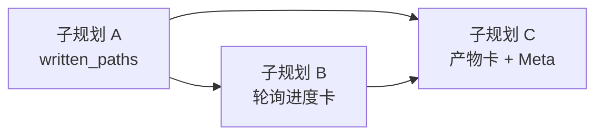

# wb-bridge 桌面可见性（进度卡 + 产物）

Planned-with: cursor-grok-4.6
Suggested-Impl-Model: 见下表（性价比优先；B 段动 ChatPane 用中档，A/C 用便宜档）

**Goal:** 用户在 Near 里能看见委派会话的实时进度（当前工具、已执行链、是否 stalled）和本轮写出的文件，不再只看到「已等待 Ns」，也不再靠 Meta 去 `ls /tmp`。

**Architecture:** 桥在 stream 里抽出 `Write`/`Edit` 的绝对路径，随 `describe`/`send` 返回 `written_paths`。Desktop 在 `wb_bridge_send` 进行中经 Studio 代理轮询 `describe` 更新同一张工具卡；成功后 `session-artifacts` 把 `written_paths` 收进既有 `TurnArtifactCard`。Meta 纪律禁止用本机 shell 验盘。

前置：`.cursor/plans/2026-09-04-wb-bridge-session-supervision.plan.md`（A/B/C 已落地）。本组**不改** turn 终止语义、409、幂等。

---

## 0. 为何现在看不见（证据，实施者勿依赖对话记忆）

本机两条桌面 E2E（2026-09-05）：

| session | 磁盘产物 | Near 里用户看到的 |
|---|---|---|
| `dfadb74b-632d-4a04-a4f2-0f42d6c11d7e` | `/tmp/agx-near-desktop-e2e.txt` 已写 | 工具卡折叠；主气泡「无法确认落盘」 |
| `a9ba788c-3636-47ed-8b6b-f89a8698256e` | `/tmp/agx-near-e2e-app/{main.py,README.md,requirements.txt}` | 7 次 `bash_exec` 报 `path escapes workspace`；体检 58 分 |

根因（不是任务没跑）：

1. `TOOL_PROGRESS` 只有 `{name, tool_call_id, elapsed_seconds}`（`agenticx/runtime/agent_runtime.py` 约 L6138）。C 段刻意不改 runtime，故进行中只有「已等待 Ns」。
2. `desktop/src/utils/wb-bridge-ui.ts` 的 `observedToolsLine` **只在 blocked/error 追加工具链**；success 不展示。
3. `collectSessionArtifactPaths`（`desktop/src/utils/session-artifacts.ts` L565）只认 `file_write`/`file_edit`/`bash_exec`，不认 `wb_bridge_*`。
4. Meta 用 `bash_exec` 读 `/tmp` 被沙箱拒绝，把「验盘失败」写成任务失败。



---

## 1. 子规划与推荐模型

| 子规划 | 文件 | Suggested-Impl-Model | 理由 |
|---|---|---|---|
| A 写出路径 | `2026-09-05-wb-bridge-visibility-a-written-paths.plan.md` | composer-2.5-fast 或 kimi-k3-max | 纯 events + snapshot 字段，有夹具 `_E2_TOOL_USE` |
| B 桌面进度 | `2026-09-05-wb-bridge-visibility-b-desktop-progress.plan.md` | composer-2.5 或中档代码模型 | 动 `ChatPane.tsx` SSE 分支 + **精确新增** `server.py` 一条代理路由，回归面大于 A |
| C 产物与纪律 | `2026-09-05-wb-bridge-visibility-c-meta-and-artifacts.plan.md` | composer-2.5-fast | `session-artifacts` 增一支 + Meta 三行纪律；复用 `TurnArtifactCard`，不重做视觉 |

顺序：**A 必须先全绿**，B/C 都读 `written_paths`。B 与 C 可并行，但 C 的产物卡单测不依赖 B 的轮询。

---

## 2. In scope / Out of scope

### In scope

- 桥：从 `tool_use` 抽出本轮写出路径，随 HTTP/describe 返回。
- Desktop：`wb_bridge_send` 进行中轮询进度；success 也展示 `observed_tools`；`written_paths` 进入既有产物卡。
- Meta：禁止用本机 shell/读文件工具验 WB 产物。

### Out of scope（做了算违规）

- **不改** `agenticx/cc_bridge/**`、`agenticx/runtime/agent_runtime.py` 的 `TOOL_PROGRESS` 形状。
- **不改** turn 分类 / 409 / 幂等 / `wait_seconds` 语义。
- **不做** Visible TUI、不把子进程 stdout 当终端贴进聊天。
- **不做** idle 回收、`docs/guides/wb-bridge.md`（仍留在 supervision §7.5）。
- **不改** 会话体检五维公式（低分是尺子问题，本组不修）。
- **不重构** `ChatPane.tsx` / `session-artifacts.ts` 里与 wb 无关的收集逻辑。
- `server.py` **只允许**在现有 `/api/wb-bridge/*` 区块末尾精确插入一条 `GET /api/wb-bridge/sessions/{session_id}`；禁止整段替换 import 区。

---

## 3. 硬约束

1. 记忆观察 only：状态与路径只来自 HTTP/`describe`，禁止读 `~/.agenticx/logs/wb-bridge/*.log`。
2. 锁顺序不变：`_global_lock` → `session.lock`；`observe_line` 只取 `session.lock`。
3. 不猜未实测 NDJSON subtype；路径只从已实测形状 `_E2_TOOL_USE` 的 `input.file_path`（兼收 `input.path`）。
4. 新 Python 文件头：`Author: Damon Li`，顶层 import，英文注释。
5. commit 文案禁止第三方品牌与对标措辞；trailer 白名单见 AGENTS.md。
6. 改了 `server.py` 必须冷启动 smoke：`create_studio_app()` 后 `GET /api/session` `/api/avatars` `/api/sessions` 为 200。

---

## 4. 风险

| 风险 | 缓解 |
|---|---|
| `server.py` 误删相邻 import / 路由 | B 段只在 `# --- Hooks API ---` 之前插入一个函数；diff 守卫 |
| 轮询把折叠工具卡刷成刷屏 | 只更新**同一条** `wb_bridge_send` 工具消息的 progress 文案，2s 间隔，`tool_result` 必停 |
| 把未成功的 Write 当成产物 | 路径在 `tool_use` 出现即记录（与 `observed_tools` 一致）；卡片文案写「本轮尝试写入」，blocked 时沿用「产物可能已落盘」 |
| CORS：渲染进程直打 `:9743` | **禁止**渲染进程直连桥；只走 Studio 代理 |
| ChatPane 顺手改附件/群聊 | Out of scope；只改点名的行块 |

---

## 5. 提交约定

每个实施 commit 带实际子规划一对 + 本主规划一对：

```
Plan-Id: 2026-09-05-wb-bridge-visibility-a-written-paths
Plan-File: .cursor/plans/2026-09-05-wb-bridge-visibility-a-written-paths.plan.md
Plan-Id: 2026-09-05-wb-bridge-desktop-visibility
Plan-File: .cursor/plans/2026-09-05-wb-bridge-desktop-visibility.plan.md
Plan-Model: cursor-grok-4.6
Impl-Model: <实际使用的模型>
Made-with: Damon Li
```

实施前把本文件与三份子规划从 `.cursor/plans/pending/` **移回** `.cursor/plans/` 根目录。
