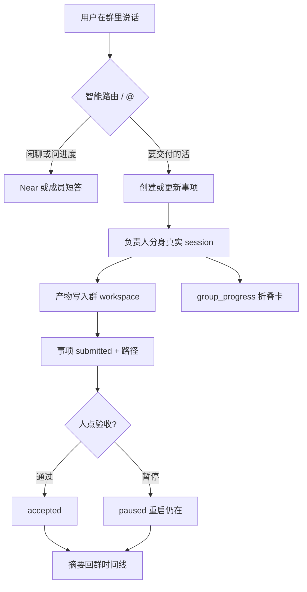
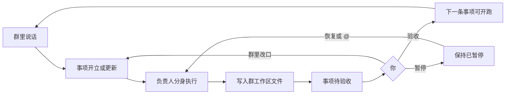

# Near AI Native 团队：事项、时间线纪律与角色工具盒

Planned-with: Cursor Grok 4.6
Suggested-Impl-Model: 见文末子规划表；本文件是 Master Plan，禁止直接当实施清单改代码。

**文档类型：** Master Plan（北极星、不变量、与既有能力的叠法、三份子计划切分）。  
**不是：** 可执行 implementation plan。实施时只执行已移到 `.cursor/plans/` 根目录的子计划。

**Goal:** 在不拆掉 Near 微信式群聊、不把 Near（元智能体）赶出群的前提下，把「说了什么」和「组织承诺交付什么」分开，让任意职能团队（销售 / 售前 / 产品 / 开发 / 测试）都能用同一套事项原语把协同管住。

**Architecture:** 群时间线继续当组织前台（人 + Near + 分身、@ 点名、折叠进度卡）。新增群级 **事项（Work Item）** 作为组织后台：负责人、状态、产物路径、人验收、可恢复暂停。成员工具表按角色硬过滤。不引入房间拓扑、MessageHub、OKR、K8s。

**Tech Stack:** 现有 `agx serve` + `GroupChatRegistry` / `GroupChatRouter` + 群共享工作区 + Desktop `WorkPanel`；新增 `agenticx/runtime/work_items.py` 与 `/api/groups/{id}/work-items*`。

---

## 0. 本文件怎么用

| 角色 | 用法 |
|---|---|
| 产品 / 架构 | 用第 1–4 节对齐「学什么、保什么、不做什么」 |
| 规划模型 | 用第 7 节衍生/修订子计划；子计划必须达到「Grok 4.6 / Composer 2.5 不看对话也能落地」 |
| 实施模型 | **不要**拿本文件改代码；按顺序执行 01 → 02 → 03 |

**衍生规则（强制）：**

1. 本波次只允许 **3** 个子计划，禁止再拆第 4 份「顺手优化」。
2. 子计划标题/正文/文件名不得出现客户名、客户路径；不得把竞品名写进未来的 commit/PR 文案。
3. 触碰 `agenticx/studio/server.py` 只能精确插入目标行，禁止整段替换 import 或相邻 handler。
4. 任何「把 Near 从群里拿掉 / 改成 Manager 专房 / 上 MessageHub / 做 OKR」都视为越界，须先回到本 Master。

---

## 1. 北极星与非目标

### 北极星（本波次结束后用户能感到的变化）

在一个已有成员的 Near 群里：

1. 用户或 Near 可以开一条 **事项**（标题、负责人、做到哪算完）。
2. 群时间线仍是微信感：Near 在场统筹；被点名的分身真执行；过程进折叠卡。
3. 事项状态、产物路径、是否验收，离开那条聊天记录后还在；合盖重启后暂停的事项仍是暂停。
4. 只有人能点「验收通过」；模型不能自己给自己过。
5. 群成员代码层看不到 `spawn_subagent` / `delegate_to_avatar` 等调度工具。

这套原语不按部门定制：销售的「方案包」、开发的「实现任务」、测试的「用例报告」都是同一事项壳，差异只在分身人设、工具盒和产物文件。

### 明确非目标（本波次不做）

| 不做 | 原因 |
|---|---|
| 拆「下达房 / 执行房」、把 Near 踢出群 | 会抹掉微信式 PM 在场的产品亮点 |
| MessageHub / Mailbox / 私有记忆 Redis | 开源对照仓没有；也不是 Near 缺口 |
| OKR / Mission / 三级复盘仪式 | 管理软件，不是第一公里组织效能 |
| 销售/研发各做一套编排引擎 | 部门差异落在角色，不落在 runtime |
| 多真人账号 / 云房间 / Enterprise IAM | 已有独立 Collab Room 规划，本波次不搅 |
| 替换现有 Workforce / Graph / TaskLock | 事项与它们并存；暂停写在事项上，不删进程内 TaskLock |
| 自动把每条群消息变成事项 | 闲聊必须仍是闲聊 |
| 改 `desktop/electron/main.ts` 热路径除非子计划写明 | 避免 IPC 回归 |

### 必须保住的 Near 亮点

- 微信式群、隐式包含 Near、未 @ 由 Near 智能统筹
- `@` 谁谁走真实分身 session（`delegate_to_avatar` / `_run_one_target`）
- `group_progress` 折叠卡，禁止每个工具一条气泡
- 群共享工作区 `~/.agenticx/groups/<gid>/workspace` 与产物芯片（已落地）
- 工作区面板成员区、多窗格点头像进分身现场
- 用户不选择 Sequential / 编排模式

---

## 2. 机制定型（照抄，不要自己发明）

### M1 · 群是前台，事项是后台

群消息可以**启动或评论**事项，但事项的状态不存在气泡里。权威文件：

`~/.agenticx/groups/<gid>/work_items.json`

与 `group.yaml` 分开，避免改群名/成员时碰到事项。

### M2 · Near 留在群里，但不替负责人把活干完

时间线分层，不是房间流放：

- 群时间线：目标、决策、摘要、验收、@
- 分身窗格：真执行
- 工作区：交付物本体

用户明确 @ 某成员时，即使该成员名下事项是 paused，仍允许本轮短答（人走进现场加一句）。智能路由自动派活时，paused 负责人不再接新执行。

### M3 · 过与不过是人的动作

`accepted` **只能**由 Desktop/REST 的人操作写入。Meta 工具可以 create / update / submit / attach / cancel，**不能** accept / pause / resume。

### M4 · 暂停停新派活，不杀 in-flight

`paused` 只让「自动派给该负责人的新执行」停止。本轮已经在跑的 `_run_one_target` 不在本波次强杀（现有停止按钮 / TaskLock 继续管进程内）。重启后读盘仍是 paused。

### M5 · 角色工具硬拦，不靠 prompt

群成员 turn 的工具表必须在代码里去掉调度类工具。禁止只改系统提示。

### M6 · 不做部门模板

不出现 `team_type: sales|eng`。事项类型用自由文本 `title` + `definition_of_done` + 产物路径表达。

---

## 3. 与既有能力的关系（实施前必读）

| 已有 | 关系 |
|---|---|
| `.cursor/plans/2026-08-20-group-chat-control-room-experience.plan.md`（已实施） | 进度卡 / 发言权 / 短结论 — **保留**。事项绑在卡上，不重做控制室 |
| `.cursor/plans/2026-08-20-group-chat-shared-artifact-delivery.plan.md`（已实施） | 产物芯片 / 群 workspace — **复用**。事项只存路径，不改扫描算法 |
| `WorkPanel`「待办」`SessionTodoList` | **会话内步骤清单，保持不动**。群窗格另加「事项」区块，不替换待办 |
| `POST /api/groups/{id}/action` + TaskLock | **进程内**暂停当前 team turn。事项 pause 是另一条持久化状态 |
| `.cursor/plans/2026-08-28-collab-room-master.plan.md` | 多真人云房间 — **本波次一行不改** `enterprise/` / portal rooms |
| AgentTeams 调研 `research/codedeepresearch/AgentTeams/` | 只吸收「问责与卷宗」；不吸收房间/控制面 |

对照结论若实施者看不到 `research/`（已被 gitignore），以上表格已足够，不必回读调研全文。

---

## 4. 目标链路



---

## 5. 事项数据契约（三份子计划共用，禁止各写一套）

单个事项对象（JSON）：

```json
{
  "id": "wi_a1b2c3d4e5f6",
  "group_id": "abc123def456",
  "title": "写完客户方案第一节",
  "status": "open",
  "owner_kind": "avatar",
  "owner_id": "avatar_xxx",
  "reviewer_kind": "human",
  "definition_of_done": "workspace 下有 proposal.md 且覆盖范围与风险",
  "artifact_paths": [],
  "blocked_by": [],
  "source_session_id": "",
  "source_preview": "",
  "version": 1,
  "created_at": "2026-09-06T06:00:00+00:00",
  "updated_at": "2026-09-06T06:00:00+00:00"
}
```

磁盘文件：

```json
{
  "doc_version": 1,
  "items": []
}
```

| 字段 | 规则 |
|---|---|
| `id` | `wi_` + 12 位小写 hex，创建时生成 |
| `status` | 仅 `open` / `in_progress` / `submitted` / `accepted` / `paused` / `cancelled` |
| `owner_kind` | 仅 `human` / `avatar` / `meta` |
| `owner_id` | human 用 `""`；avatar 用分身 id（必须属于该群 `avatar_ids`）；meta 用 `__meta__` |
| `reviewer_kind` | 本波次恒为 `human` |
| `blocked_by` | 其他事项 id 列表；任一未 `accepted` 则负责人自动派活时不可开跑 |
| `version` | 每次成功写入 +1；PATCH 必须带 `expected_version`，不匹配返回 409 |
| `artifact_paths` | 绝对路径或群 workspace 相对路径字符串，不做文件锁 |

**合法状态迁移（只允许表内箭头）：**

```text
open → in_progress | paused | cancelled
in_progress → submitted | paused | cancelled
submitted → accepted | in_progress | paused | cancelled
paused → open | in_progress | cancelled
accepted → （终态，不可再改状态；只允许改 artifact_paths 补档）
cancelled → （终态）
```

`accept` / `pause` / `resume` 是 REST 专用动作，内部仍走上面这张表（resume：`paused→open`，若已有 in_progress 语义则 `paused→in_progress`——实现规定：resume 回到 pause 之前记下的 `resume_status`，缺省 `open`）。

---

## 6. 子计划切分（恰好 3 个，按序实施）

| 顺序 | 文件 | 交付 | 依赖 |
|---|---|---|---|
| 01 | `.cursor/plans/pending/2026-09-06-near-team-work-objects-01-store-api.plan.md` | 落盘 + Studio REST + 409 + 人专用 accept/pause | 无 |
| 02 | `.cursor/plans/pending/2026-09-06-near-team-work-objects-02-runtime-discipline.plan.md` | 提示注入、Meta 工具、自动派活遵守 pause/blocked、成员工具硬拦 | 必须先合 01 |
| 03 | `.cursor/plans/pending/2026-09-06-near-team-work-objects-03-desktop-board.plan.md` | 群工作区「事项」列表、验收/暂停按钮、点负责人开分身窗格 | 必须先合 01；02 可并行测试但 UI 应能展示 02 写入的状态 |

**禁止**把 01 的 schema 在 02/03 里改字段名。要改回 Master 再改三份一起改。

---

## 6.5 做完之后的最大收益，以及项目实践群怎么验收

### 最大收益（一句话）

群从「大家在聊天」变成「组织有一本活着的待办账本」：谁负责、做到哪算完、过没过，不依赖翻聊天记录，也不依赖模型自觉。

对项目实践群，这比再聪明一点的路由更值钱：少返工、少代答、少「以为做完了」、合盖重开后还知道卡在哪。

### 项目实践群验收剧本（不要用销售/研发各走一遍）

用**一个真实项目群**（已有 2–4 个分身，例如调研 / 实现 / 评审）跑下面 6 步。通过标准是现象，不是看日志。

1. **闲聊仍是闲聊**  
   发一句进度闲聊或问候。群里不该自动冒出新事项。Near 仍在场短答。失败：每句话都变成事项。

2. **开口即立账**  
   说清楚一件要交付的事（例如「把本周方案第一节写到群工作区」）。工作区摘要「事项」里应出现一条：标题可读、负责人是某个分身（或你指定的人）、状态待开始/进行中。群时间线应是短结论，不是把整节方案贴进气泡。失败：只有聊、工作区没有事项。

3. **点名真干活，Near 不代答**  
   `@` 该负责人追问细节。应看到该分身的进度卡/回复；Near 可以统筹一句，但不应替他把活写完。失败：Near 长篇代写，负责人没动。

4. **人说了才算过**  
   等产物进工作区、事项变成待验收后，**先不要点验收**，再让 Near「继续下一节」。下一节不应自动当成已过。你点「验收」后，状态变为已验收。失败：模型自己把事项标成已验收，或未点验收就开下一依赖活。

5. **暂停能活过重启**  
   对进行中的事项点「暂停」，完全退出 Near 再开，回到同一群。该事项仍是已暂停；未 @ 时不应自动再派该负责人开跑。你 `@` 他加一句，他仍能短答。失败：重启后事项消失或又自动开跑。

6. **成员不能自己拉壮丁**  
   群执行过程中，成员不应靠 `spawn_subagent` 再开影子助手。进度应进折叠卡。失败：群里冒出一堆临时子智能体气泡。

以上 6 步过了，本波次对「项目实践群」就验收合格。不要用 OKR 页、不要用第二个真人账号、不要用拆房来验收。

### 呈现方式：三层，不是新 App

四件事**同时**「看得见」和「落了盘」。没有第四个独立产品页。

| 层 | 你看见什么 | 磁盘上是什么 | 下一轮谁读 |
|---|---|---|---|
| 群时间线 | 短结论、@、折叠进度卡、验收后的一句「过了」 | `messages.json`（还是聊天） | 人翻历史；**不当组织真相** |
| 工作区摘要「事项」 | 标题、负责人、状态（待开始/进行中/待验收/已验收/已暂停）、验收/暂停按钮 | `~/.agenticx/groups/<gid>/work_items.json` | Near、分身提示词、Desktop 列表、自动派活守门 |
| 工作区文件 | 方案/代码/纪要正文，点事项产物可打开预览 | `~/.agenticx/groups/<gid>/workspace/...` | 下一截任务当输入；验收看的是这个 |

映射：

- 谁负责 → 事项行上的负责人（可点开该分身窗格）
- 做到哪算完 → `definition_of_done` + `artifact_paths`（文件在工作区）
- 人说了才算过 → 行上的「验收」；状态变成已验收才写盘
- 暂停活过重启 → 状态已暂停写在 `work_items.json`，不是当前 SSE

### 循环怎么接上下一轮（这就是「流程」）

没有另做一条销售流程或研发流程。**同一条环**在一个项目群里转：



下一轮具体怎么「用」已经存下来的东西：

1. **你继续在同一群说话**（新 session 也行，只要还是这个 `group_id`）。事项板还在，不用把上周结论再贴一遍。
2. **Near 每轮被注入事项板**。你说「做下一节」时，它应看见上一节已验收/未验收，而不是只靠聊天记忆。
3. **未验收的前置会挡住自动派活**（`blocked_by`）。所以循环是：交卷 → 你过 → 下一棒才动。
4. **已验收事项的文件留在工作区**。下一棒分身读同一目录，当输入，不当「再生成一遍」。
5. **你点负责人**进分身窗格，是同一条事项的执行现场，不是另开一条无账本的单聊。

本波次**不**做：跨群交接、OKR 周期、自动周会。循环的入口永远是「回到这个项目群，对着事项板说话」。

---

## 7. 成功标准（Master 级，不是子计划 AC）

- 单测覆盖 store 迁移、409、非法迁移、群隔离。
- 群成员 turn 的工具列表断言不含 `spawn_subagent` 与 `delegate_to_avatar`。
- Desktop 群窗格能看到事项并完成「创建 → 提交 → 人验收」闭环（可用 curl + UI，不要求真 LLM）。
- 重启 `agx serve` 后 paused 事项仍在。
- 非群单聊、automation 会话、Collab Room、`server.py` import 区零无关 diff。

---

## 8. 子规划 → 推荐实施模型

| 子规划 | Suggested-Impl-Model | 理由 |
|---|---|---|
| 01 store + API | Cursor Grok 4.6 | 纯 CRUD / 文件存储 / FastAPI 插入，样板为主 |
| 02 runtime | Cursor Grok 4.6 | 落点已写死到函数名；高回归面靠「只改列出的函数」约束，不必上顶配 |
| 03 desktop | Cursor Grok 4.6 | 复用 `WorkPanel` Section 与现有 token，不做视觉重塑 |

最终 `Impl-Model` trailer 以实际使用为准。

---

## 9. 本波次之后（写在这里避免实施者提前做）

- 跨群交接（事项带着卷宗换群）
- 评审人换成第二个真人账号
- 事项绑定 `group_progress` 的 `work_item_id` 字段（02 若来得及可加可选字段，03 不依赖）
- Workforce 任务自动转事项
- 群级 SOUL / 团队约定文件

这些都不是 01–03 的范围。
