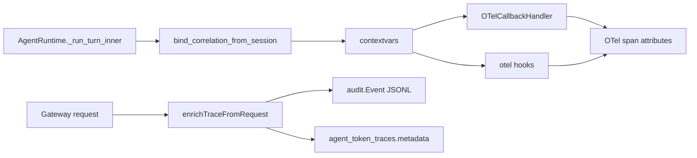

# S1：冻结并注入关联键（Runtime + Gateway）

Planned-with: Cursor Grok 4.6
Suggested-Impl-Model: Composer 2.5
Parent-Plan: `.cursor/plans/pending/2026-09-06-agenticops-platform-master.plan.md`
Plan-Id: 2026-09-06-otel-correlation-keys
Wave: 1（数据质量）
Adopt / Wrap / Build: **Build**（字段表 + contextvars + 注入；不能 Adopt，因为现仓常量已定义未接线）

> **For implementer:** 不看对话也能落地。只改本文件列出的符号。禁止把本 plan 当 S2（TelemetryQuery / SigNoz）。不要 commit，除非用户明确要求。实施前把本文件移到 `.cursor/plans/` 根目录。

**Goal:** 任意一次 Runtime 回合或 Gateway 请求，span / 审计 / token 轨迹都能按同一套关联键互相找到：`session_id`、`tenant_id`、`deployment_id`，并与现有 Gateway ULID `trace_id` 共存；Prometheus 指标禁止把高基数 ID 当 label。

**Architecture:** 在 Python 侧用 contextvars 装本回合关联键，OTel handler / hooks 创建 span 后统一 `apply_correlation_attributes`。Gateway 只在已有 `enrichTraceFromRequest` 上补 `deployment_id` 与 session 回退头，写入审计 JSONL 与 `agent_token_traces.metadata`。不新建观测盒，不改策略语义。

**Tech Stack:** 现有 `opentelemetry` 可选依赖、Gateway Go `requestIdentity` / `audit.Event`、pytest + `go test`。

---

## 质量门（Master §9）

| 问 | 答 |
|----|----|
| 对应哪道坎？ | Wave 1 数据质量 |
| 为什么 Build？ | 常量 `agenticx.session.id` 已在 `ai_attributes.py`，handler/hooks **从未 set**；Gateway 已有 tenant/session/ULID，缺 deployment 与高基数禁令 |
| 精确落点 | 见下方「现状锚点」与各 FR |
| 关联键如何传播？ | 见「冻结字段表」Producer / Consumer |
| 失败时人怎么接管？ | Wave 1 不要求 RCA；键缺失时 span 仍创建，只是少属性，测试红 |

---

## 根因与证据链

实施者据此判断改动是否对症，不依赖对话记忆。

1. **常量已冻结、接线为零。** `agenticx/observability/ai_attributes.py` L101 已有 `AGENTICX_SESSION_ID = "agenticx.session.id"`。`tests/test_smoke_spring_ai_otel_attributes.py` 的 `test_agenticx_extension_attributes`（约 L53–57）只断言 agent/task/tool，**不断言 session**。`rg AGENTICX_SESSION_ID agenticx/observability/otel` 无 `set_attribute`。
2. **Handler 只写 agent/task。** `OTelCallbackHandler.on_task_start`（`handler.py` L207–212）set `agenticx.agent.id` / `task.id`，没有 session/tenant/deployment。`on_llm_call`（L289–300）、`on_tool_start`（L412–414）同样。
3. **Hooks 同样缺席。** `hooks.py` `_otel_before_llm_call` L187–200、`_otel_before_tool_call` L269–278 只写 operation/model/agent/task/tool。
4. **Studio 从不 `enable_otel()`。** `rg enable_otel agenticx/studio` 为空。本 plan **不**在 `server.py` 启用 OTel（那是 S2）。本 plan 只保证：只要 handler/hooks 跑起来，关联键一定在 span 上。
5. **Gateway 已有一半。** `requestIdentity`（`server.go` L1450–1466）已有 `TenantID` / `SessionID` / `TraceID`。`enrichTraceFromRequest`（`trace_context.go` L17–24）只读 `X-AgenticX-Trace-Id` / `Step` / `Stage`。审计 `Event`（`writer.go` L23–32）已有 `tenant_id` / `session_id` / `trace_id`，**无 `deployment_id`**。`reportUsageDetailed`（`cache_integration.go` L179–190）写 `agent_token_traces` 时 metadata 只有 stage/route/io。
6. **指标高基数陷阱。** `metrics.go` `register()`（L54–107）的 histogram/counter label 是 `model` / `channel` / `plugin` / `route` 等。**禁止**把 `session_id` / `trace_id` / `deployment_id` 加进这些 label。Enterprise 聊天 ULID 与 OTel W3C hex **不是同一种** `trace_id`，混进 Prom label 会炸基数。

---

## 冻结字段表（写进代码，禁止实施者自造第四套名字）

| 逻辑键 | OTel / JSON 属性名 | 格式 | Producer | Consumer（本 plan） |
|--------|-------------------|------|----------|---------------------|
| session_id | `agenticx.session.id` | 非空字符串；Studio 即 `session.session_id` | Runtime `bind_correlation_from_session`；Gateway JWT `sessionId` 或头 `X-AgenticX-Session-Id`（仅 JWT 为空时回退） | handler/hooks span；审计已有；`agent_token_traces.metadata.session_id` |
| tenant_id | `agenticx.tenant.id` | 可空；Desktop 单租户常空 | `TenantContext.get_tenant_id()`（`agenticx/server/tenant.py`）；Gateway JWT `tenantId` | span；审计已有 `tenant_id` |
| deployment_id | `agenticx.deployment.id` | 可空；S4 前靠手动/环境 | `AGENTICX_DEPLOYMENT_ID` 或 `session.deployment_id`；Gateway 头 `X-AgenticX-Deployment-Id` | span；审计 JSONL `deployment_id`；trace metadata |
| otel_trace_id | **不另写属性**（用 span context） | W3C 32 hex | OTel SDK | 后续 S2 `get_trace` 可查 |
| gateway_trace_id | `agenticx.gateway.trace_id` | 现有 26 字符 ULID（见 `.cursor/plans/2026-08-10-enterprise-trace-id-propagation.plan.md`） | 已有 `X-AgenticX-Trace-Id` → `requestIdentity.TraceID` | 若 Python 上下文带了该值则写入 span；Gateway 审计已有 `trace_id` 列，**不要改 ULID 算法** |

补充常量（只加这两个 + 一个 Gateway 别名）：

```python
# agenticx/observability/ai_attributes.py  — AgenticX 扩展区块，紧挨 AGENTICX_SESSION_ID（L101）之后
AGENTICX_TENANT_ID = "agenticx.tenant.id"
AGENTICX_DEPLOYMENT_ID = "agenticx.deployment.id"
AGENTICX_GATEWAY_TRACE_ID = "agenticx.gateway.trace_id"
```

**禁止：**

- 再发明 `agx.session_id` / `sessionId` / `deploy_id` 等别名当主字段
- 把 `session_id` / `trace_id` / `deployment_id` / `gateway_trace_id` 加进 `metrics.go` 任一 `[]string{...}` label
- 覆盖 JWT 里已有的 `SessionID`（头只在空时回退，防伪造串台）
- 为 `deployment_id` 做 PG 迁移（JSONL + metadata 足够；PG 列留给以后，避免本 plan 碰 `db-schema`）



---

## In scope

- 冻结上表常量
- 新建 `agenticx/observability/correlation.py`（contextvars + apply）
- handler / hooks 调用 apply
- `AgentRuntime._run_turn_inner` 回合开始 bind
- Gateway：`DeploymentID` + 两个头 + 审计 JSON 字段 + trace metadata
- 高基数禁令测试
- 扩展现有 otel 冒烟测试

## Out of scope（违反即 scope creep）

- `agenticx/studio/server.py` **任何行**（含 import 区与 lifespan）。本 plan 不 `enable_otel()`
- Desktop / admin-console / web-portal UX
- TelemetryQuery、SigNoz compose、`agenticx/ops/`、Openship
- UModel / PG 新列 / `enterprise/packages/db-schema`
- 改 Gateway 策略、配额、计费公式
- 改 `blocked` 语义
- 给 Prom 指标加 tenant label（即便「看起来低基数」也留到 S6）
- 改 Enterprise ULID 生成或 `X-AgenticX-Trace-Id` 校验规则
- Fork 或引入新 APM SDK

---

## 现状锚点

| 符号 | 路径 | 约行 |
|------|------|------|
| `AiObservationAttributes.AGENTICX_SESSION_ID` | `agenticx/observability/ai_attributes.py` | 101 |
| `get_agenticx_attributes` | 同文件 | 117–124 |
| `on_task_start` set_attribute | `agenticx/observability/otel/handler.py` | 207–212 |
| `on_llm_call` set_attribute | 同文件 | 289–300 |
| `on_tool_start` set_attribute | 同文件 | 412–414 |
| `_otel_before_llm_call` | `agenticx/observability/otel/hooks.py` | 187–200 |
| `_otel_before_tool_call` | 同文件 | 269–278 |
| `_run_turn_inner` 开头重置 | `agenticx/runtime/agent_runtime.py` | 3221–3240 |
| `TenantContext` | `agenticx/server/tenant.py` | 21–44 |
| `enrichTraceFromRequest` | `enterprise/apps/gateway/internal/server/trace_context.go` | 10–24 |
| `requestIdentity` | `enterprise/apps/gateway/internal/server/server.go` | 1450–1466 |
| `identityFromRequest` JWT / PAT | 同文件 | 1497–1524、1577–1588 |
| `audit.Event` | `enterprise/apps/gateway/internal/audit/writer.go` | 23–32 |
| `reportUsageDetailed` metadata | `enterprise/apps/gateway/internal/server/cache_integration.go` | 179–190 |
| Prom `register()` | `enterprise/apps/gateway/internal/observability/metrics.go` | 54–123 |
| 现有测试 | `tests/test_smoke_otel_handler.py`、`test_smoke_otel_hooks.py`、`test_smoke_spring_ai_otel_attributes.py`、`enterprise/apps/gateway/internal/server/trace_context_test.go` | — |

---

## FR-1：常量 + correlation 模块

**Files:**

- Modify: `agenticx/observability/ai_attributes.py`（只在 L101 后追加 3 个常量，不改 `get_all_otel_attributes` 逻辑——新常量带 `AGENTICX_` 前缀会自动进 `get_agenticx_attributes`）
- Create: `agenticx/observability/correlation.py`
- Modify: `agenticx/observability/__init__.py` — 仅在现有 import / `__all__` **追加** `Correlation` 导出，禁止重排无关符号
- Test: `tests/test_smoke_otel_correlation.py`（新建）+ 扩展 `tests/test_smoke_spring_ai_otel_attributes.py`

**Python 规范（新文件强制）：** 模块头英文 docstring、`Author: Damon Li`、绝对 import、注释英文。改旧 otel 文件时保持该文件原风格，不要整文件改成绝对 import。

**Step 1: 先写失败测试**

`tests/test_smoke_spring_ai_otel_attributes.py` 的 `test_agenticx_extension_attributes` 追加：

```python
        assert AiObservationAttributes.AGENTICX_SESSION_ID == "agenticx.session.id"
        assert AiObservationAttributes.AGENTICX_TENANT_ID == "agenticx.tenant.id"
        assert AiObservationAttributes.AGENTICX_DEPLOYMENT_ID == "agenticx.deployment.id"
        assert AiObservationAttributes.AGENTICX_GATEWAY_TRACE_ID == "agenticx.gateway.trace_id"
```

`tests/test_smoke_otel_correlation.py`：

```python
def test_apply_skips_empty_and_sets_bound_keys():
    from agenticx.observability.correlation import (
        apply_correlation_attributes,
        bind_correlation,
        reset_correlation,
    )

    class _Span:
        def __init__(self):
            self.attrs = {}

        def set_attribute(self, key, value):
            self.attrs[key] = value

    reset_correlation()
    span = _Span()
    apply_correlation_attributes(span)
    assert span.attrs == {}

    tok = bind_correlation(
        session_id="sess-1",
        tenant_id="t-1",
        deployment_id="dep-1",
        gateway_trace_id="01ARZ3NDEKTSV4RRFFQ69G5FAV",
    )
    try:
        span2 = _Span()
        apply_correlation_attributes(span2)
        assert span2.attrs["agenticx.session.id"] == "sess-1"
        assert span2.attrs["agenticx.tenant.id"] == "t-1"
        assert span2.attrs["agenticx.deployment.id"] == "dep-1"
        assert span2.attrs["agenticx.gateway.trace_id"] == "01ARZ3NDEKTSV4RRFFQ69G5FAV"
    finally:
        reset_correlation(tok)
```

`test_bind_correlation_from_session_reads_session_id`：用简单 namespace 对象 `session_id="abc"`，无 tenant 时只写 session。

**Step 2: 跑测试确认失败**

```bash
python -m pytest tests/test_smoke_spring_ai_otel_attributes.py::TestAiObservationAttributes::test_agenticx_extension_attributes tests/test_smoke_otel_correlation.py -q
```

Expected: FAIL（缺常量 / 缺模块）

**Step 3: 最小实现**

`correlation.py` 必须长这样（可多写 docstring，不可改字段名）：

```python
#!/usr/bin/env python3
"""Request-scoped correlation keys for OTel spans.

Author: Damon Li
"""

from __future__ import annotations

import os
from contextvars import ContextVar, Token
from typing import Any, Optional

from agenticx.observability.ai_attributes import AiObservationAttributes

_session_id: ContextVar[str] = ContextVar("agenticx_corr_session_id", default="")
_tenant_id: ContextVar[str] = ContextVar("agenticx_corr_tenant_id", default="")
_deployment_id: ContextVar[str] = ContextVar("agenticx_corr_deployment_id", default="")
_gateway_trace_id: ContextVar[str] = ContextVar("agenticx_corr_gateway_trace_id", default="")


def bind_correlation(
    *,
    session_id: str = "",
    tenant_id: str = "",
    deployment_id: str = "",
    gateway_trace_id: str = "",
) -> list[Token]:
    tokens = [
        _session_id.set(str(session_id or "").strip()),
        _tenant_id.set(str(tenant_id or "").strip()),
        _deployment_id.set(str(deployment_id or "").strip()),
        _gateway_trace_id.set(str(gateway_trace_id or "").strip()),
    ]
    return tokens


def reset_correlation(tokens: Optional[list[Token]] = None) -> None:
    if tokens:
        for token in reversed(tokens):
            token.var.reset(token)
        return
    _session_id.set("")
    _tenant_id.set("")
    _deployment_id.set("")
    _gateway_trace_id.set("")


def current_correlation() -> dict[str, str]:
    out = {
        "session_id": _session_id.get(),
        "tenant_id": _tenant_id.get(),
        "deployment_id": _deployment_id.get(),
        "gateway_trace_id": _gateway_trace_id.get(),
    }
    return {k: v for k, v in out.items() if v}


def apply_correlation_attributes(span: Any) -> None:
    if span is None or not hasattr(span, "set_attribute"):
        return
    corr = current_correlation()
    mapping = (
        ("session_id", AiObservationAttributes.AGENTICX_SESSION_ID),
        ("tenant_id", AiObservationAttributes.AGENTICX_TENANT_ID),
        ("deployment_id", AiObservationAttributes.AGENTICX_DEPLOYMENT_ID),
        ("gateway_trace_id", AiObservationAttributes.AGENTICX_GATEWAY_TRACE_ID),
    )
    for key, attr in mapping:
        value = corr.get(key)
        if value:
            span.set_attribute(attr, value)


def bind_correlation_from_session(session: Any) -> list[Token]:
    sid = ""
    if session is not None:
        sid = str(
            getattr(session, "session_id", None)
            or getattr(session, "_session_id", None)
            or ""
        ).strip()
    tenant = ""
    try:
        from agenticx.server.tenant import TenantContext

        tenant = str(TenantContext.get_tenant_id() or "").strip()
    except Exception:
        tenant = ""
    deployment = ""
    if session is not None:
        deployment = str(getattr(session, "deployment_id", "") or "").strip()
    if not deployment:
        deployment = str(os.environ.get("AGENTICX_DEPLOYMENT_ID") or "").strip()
    gateway_trace = ""
    if session is not None:
        gateway_trace = str(getattr(session, "gateway_trace_id", "") or "").strip()
        meta = getattr(session, "metadata", None)
        if not gateway_trace and isinstance(meta, dict):
            gateway_trace = str(meta.get("gateway_trace_id") or "").strip()
    return bind_correlation(
        session_id=sid,
        tenant_id=tenant,
        deployment_id=deployment,
        gateway_trace_id=gateway_trace,
    )
```

**Step 4:** 同命令，Expected: PASS

---

## FR-2：Handler / Hooks 注入

**Files:**

- Modify: `agenticx/observability/otel/handler.py` — 新增 `_apply_correlation(self, span)`，在 `on_task_start` / `on_llm_call` / `on_tool_start` 现有 `set_attribute` 块**之后**各调一次。不要改 span 生命周期、不要改 token 属性。
- Modify: `agenticx/observability/otel/hooks.py` — `_otel_before_llm_call` 在 L200 后、`_otel_before_tool_call` 在 L278 后各调 `apply_correlation_attributes(span)`
- Test: 扩展 `tests/test_smoke_otel_handler.py` 与 `tests/test_smoke_otel_hooks.py`

**Before（handler `on_task_start` 属性段）：**

```python
        span.set_attribute("agent.name", agent_name)
        self._active_task_spans[span_key] = span
```

**After：**

```python
        span.set_attribute("agent.name", agent_name)
        self._apply_correlation(span)
        self._active_task_spans[span_key] = span
```

`_apply_correlation`：

```python
    def _apply_correlation(self, span: Any) -> None:
        try:
            from agenticx.observability.correlation import apply_correlation_attributes

            apply_correlation_attributes(span)
        except Exception:
            return
```

LLM / Tool 两处同样：在各自最后一条业务 `set_attribute` 之后、写入 `_active_*` 之前调用。

Hooks：顶部保持现有相对 import；函数内：

```python
        from agenticx.observability.correlation import apply_correlation_attributes
        apply_correlation_attributes(span)
```

包在现有 `try` 里即可。

**测试意图（handler）：** 在 `test_on_task_start_creates_span` 同类测试里 `bind_correlation(session_id="sess-h")`，然后断言 `mock_span.set_attribute` 的 call args 含 `("agenticx.session.id", "sess-h")`。未 bind 时不出现该 key。

**测试意图（hooks）：** 给 `_otel_before_llm_call` 一个 mock tracer/span（文件里已有 mock 模式），bind 后断言 session 属性。

```bash
python -m pytest tests/test_smoke_otel_handler.py tests/test_smoke_otel_hooks.py tests/test_smoke_otel_correlation.py -q
```

Expected: PASS。现有 noop / 无 OTel 用例不得变红。

---

## FR-3：Runtime 回合 bind

**Files:**

- Modify: `agenticx/runtime/agent_runtime.py` · `_run_turn_inner` 在 `reset_turn_references` 的 `except` 之后（约 L3236）、exploratory reset 之前，**精确插入**下面一块。禁止改 `run_turn` 的 checkpoint 分支，禁止动文件顶部 import 区以外的无关逻辑。可在文件顶部 import 区**追加一行** `from agenticx.observability.correlation import bind_correlation_from_session`——若担心循环 import，则保持函数内 import（与同函数 L3232 风格一致，本 FR **优先函数内 try/import**）。

**插入块：**

```python
        try:
            from agenticx.observability.correlation import bind_correlation_from_session

            bind_correlation_from_session(session)
        except Exception:
            pass
```

**为什么在 `_run_turn_inner` 而不是 `/api/chat`：** checkpoint 有无两条路径都进入 inner；群聊 / 委派 / 自动化只要走 `AgentRuntime` 就能带上键；**彻底避开 `server.py`**。

**Test:** `tests/test_smoke_otel_correlation.py` 增加 `test_bind_correlation_from_session_prefers_session_id_attr`（不启动 FastAPI）。若仓库已有 runtime 单测文件且能最小 mock `session`，不要新开第三条 runner。

可选（有则做、没有就靠 correlation 单测）：在现有 runtime 测试里断言 bind 后 `current_correlation()["session_id"]` 等于 fixture session id。

```bash
python -m pytest tests/test_smoke_otel_correlation.py -q
```

---

## FR-4：Gateway 传播（头 / identity / 审计 / metadata）

**Files:**

- Modify: `enterprise/apps/gateway/internal/server/trace_context.go`
- Modify: `enterprise/apps/gateway/internal/server/server.go` — **只改** `requestIdentity` 结构体加字段、`enrich` 调用处无需改（仍 `enrichTraceFromRequest(identity, r)`）
- Modify: `enterprise/apps/gateway/internal/audit/writer.go` — `Event` 加 `DeploymentID string \`json:"deployment_id,omitempty"\``
- Modify: `enterprise/apps/gateway/internal/server/cache_integration.go` — `reportUsageDetailed` 组 `meta` 时写入 `session_id` / `deployment_id`（非空才写）
- 所有已有 `audit.Event{...}` 构造点：**不要**为了本 FR 改 17 处手工填 DeploymentID。在 `writeAuditEvent`（`server.go` L1648）里若 `ev.DeploymentID == ""` 则从……等一下，`writeAuditEvent` 没有 identity。

**正确做法（少改、防漏）：** 不要扫 17 处 Event 字面量。在 `writeAuditEvent` **不要**猜。改为：

1. `enrichTraceFromRequest` 填 `identity.DeploymentID` 与 session 回退
2. 新增 `func attachAuditCorrelation(ev *audit.Event, identity requestIdentity)`：若 `ev.SessionID == ""` 则用 `identity.SessionID`；`ev.DeploymentID = identity.DeploymentID`（identity 非空才覆盖空字段）；`ev.TraceID` 已有则不动
3. **只改 `writeAuditEvent`**：调用 `attach` 需要 identity——当前签名没有。

为避免改所有 `writeAuditEvent` 调用方，采用更小切口：

**在 `enrichTraceFromRequest` 填 identity；在 `reportUsageDetailed` 写 metadata。审计 JSONL：** 改 `writeAuditEvent` 为仍写传入 event，另在 `cache_integration.go` 已有的 `audit.Event{ SessionID: ctx.identity.SessionID, TraceID: ctx.identity.TraceID }` 那种**已经抄 identity** 的构造处，给 `Event` 增加一行 `DeploymentID: identity.DeploymentID`——但这又是多处。

**本 plan 选定的最小切口（实施者必须遵守）：**

1. `writeAuditEvent` 保持签名。
2. 给 `audit.Event` 加字段后，JSONL 编码器会自动写出**已被填的** `deployment_id`。
3. 新增 `func fillAuditCorrelation(ev audit.Event, id requestIdentity) audit.Event` 放在 `trace_context.go`。
4. 只在 `writeAuditEvent` 里无法拿到 identity 时——**改为**在 `cache_integration.go` 的两处已构造 `ev := audit.Event{...}`（约 L83、以及文件后半对称处）补 `DeploymentID`。其它 17 处：用 `rg "audit.Event{" enterprise/apps/gateway/internal/server` 找到后，**每一处补一行** `DeploymentID: identity.DeploymentID`（或该处 identity 变量名）。这是机械重复，禁止顺手改 checksum / policy 字段。

`fillAuditCorrelation` 仍要写，供测试与漏填兜底：若某构造忘了填，可在 `writeAuditEvent` 不兜底（没有 identity）。测试覆盖 `enrich` + `fillAuditCorrelation` + 一处 Event 字面量。

**`trace_context.go` After：**

```go
const (
	headerTraceID       = "X-AgenticX-Trace-Id"
	headerTraceStep     = "X-AgenticX-Trace-Step"
	headerTraceStage    = "X-AgenticX-Trace-Stage"
	headerSessionID     = "X-AgenticX-Session-Id"
	headerDeploymentID  = "X-AgenticX-Deployment-Id"
	maxTraceStageLen    = 64
	maxCorrelationIDLen = 128
)

func sanitizeCorrelationID(raw string) string {
	raw = strings.TrimSpace(raw)
	if raw == "" {
		return ""
	}
	if len(raw) > maxCorrelationIDLen {
		raw = raw[:maxCorrelationIDLen]
	}
	return raw
}

func enrichTraceFromRequest(identity requestIdentity, r *http.Request) requestIdentity {
	if r == nil {
		return identity
	}
	identity.TraceID = strings.TrimSpace(r.Header.Get(headerTraceID))
	identity.TraceStep = parseTraceStep(r.Header.Get(headerTraceStep))
	identity.TraceStage = sanitizeStage(r.Header.Get(headerTraceStage))
	identity.DeploymentID = sanitizeCorrelationID(r.Header.Get(headerDeploymentID))
	if strings.TrimSpace(identity.SessionID) == "" {
		identity.SessionID = sanitizeCorrelationID(r.Header.Get(headerSessionID))
	}
	return identity
}

func fillAuditCorrelation(ev audit.Event, id requestIdentity) audit.Event {
	if strings.TrimSpace(ev.SessionID) == "" {
		ev.SessionID = strings.TrimSpace(id.SessionID)
	}
	if strings.TrimSpace(ev.TraceID) == "" {
		ev.TraceID = strings.TrimSpace(id.TraceID)
	}
	if strings.TrimSpace(ev.DeploymentID) == "" {
		ev.DeploymentID = strings.TrimSpace(id.DeploymentID)
	}
	if strings.TrimSpace(ev.TenantID) == "" {
		ev.TenantID = strings.TrimSpace(id.TenantID)
	}
	return ev
}
```

`trace_context.go` 若因此需要 import `audit`，可以；不要把 fill 放到会循环 import 的包。若 `server` 包已 import `audit`，把 `fillAuditCorrelation` 放 `trace_context.go` 同包即可。

**`requestIdentity` 追加（L1463 旁）：**

```go
	DeploymentID  string
```

**`reportUsageDetailed` metadata 在 `CapTraceMetadata` 之前：**

```go
		if sid := strings.TrimSpace(identity.SessionID); sid != "" {
			meta["session_id"] = sid
		}
		if did := strings.TrimSpace(identity.DeploymentID); did != "" {
			meta["deployment_id"] = did
		}
```

**PG writer：** **不要改** `pg_writer.go` 的 INSERT 列清单。`deployment_id` 只保证进 JSONL。注释一行英文：`DeploymentID is JSONL-only in S1; PG column is out of scope.`

**Tests（扩 `trace_context_test.go`）：**

```go
func TestEnrichTraceFromRequestCorrelation(t *testing.T) {
	req := httptest.NewRequest("POST", "/v1/chat/completions", nil)
	req.Header.Set(headerTraceID, "trace_demo")
	req.Header.Set(headerSessionID, "sess-from-header")
	req.Header.Set(headerDeploymentID, "dep-9")
	id := enrichTraceFromRequest(requestIdentity{TenantID: "t1"}, req)
	if id.SessionID != "sess-from-header" || id.DeploymentID != "dep-9" {
		t.Fatalf("unexpected identity: %+v", id)
	}
	id2 := enrichTraceFromRequest(requestIdentity{TenantID: "t1", SessionID: "jwt-sess"}, req)
	if id2.SessionID != "jwt-sess" {
		t.Fatalf("header must not override JWT session, got %q", id2.SessionID)
	}
}
```

保留现有 `TestEnrichTraceFromRequest` 行为不变。

```bash
cd enterprise/apps/gateway && go test ./internal/server/ -count=1 -run 'TestEnrich|TestParseTrace|TestSanitize'
```

Expected: PASS

---

## FR-5：Prometheus 高基数禁令

**Files:**

- Create: `enterprise/apps/gateway/internal/observability/metrics_cardinality_test.go`
- Modify: `metrics.go` **零行**（若测试红，说明有人误加了 label——修的是撤回 label，不是放宽测试）

**测试全文意图：**

```go
func TestRegistryLabelsForbidHighCardinalityIDs(t *testing.T) {
	forbidden := []string{"session_id", "sessionId", "trace_id", "traceId", "deployment_id", "deploymentId", "gateway_trace_id"}
	// 读 register() 里所有 []string{...}：用反射遍历 Registry 上已 register 的 Desc，
	// 或维护一份与 register() 同步的 expected label 表做 subset 断言。
}
```

**推荐实现（不依赖 Prometheus 内部 Desc 也行）：** 把各 vec 的 label 抽成包级常量，`register()` 引用常量；测试断言这些常量切片与 forbidden 不相交。

若抽常量会动太多行：测试里硬编码当前允许集合：

```go
allowed := map[string][]string{
	"agx_gateway_ttft_seconds":                 {"model", "channel", "inbound_protocol"},
	"agx_gateway_tokens_per_second":            {"model", "channel"},
	"agx_gateway_cache_hits_total":             {"layer"},
	"agx_gateway_cache_lookups_total":          {"layer", "result"},
	"agx_gateway_channel_health":               {"channel", "status"},
	"agx_gateway_active_streams":               {"model"},
	"agx_gateway_upstream_error_total":         {"channel", "reason"},
	"agx_plugin_invocations_total":             {"plugin"},
	"agx_plugin_errors_total":                  {"plugin"},
	"agx_plugin_latency_seconds":               {"plugin"},
	"agx_gateway_http_requests_total":          {"method", "route", "status"},
	"agx_gateway_http_request_duration_seconds": {"method", "route"},
}
```

对每个 forbidden 名字：`if slices.Contains(labels, f) { t.Fatal }`。

再断言 `allowed` 的 key 覆盖 `register()` 里创建的 Name（防止以后加 vec 却忘了更新测试——新 vec 必须先登记 allowed）。实施时用 `prometheus.DefaultGatherer` 不合适（自定义 Registry）。更简单：**测试只扫 forbidden ∩ 上述切片**，并在测试注释写：新增 HistogramVec 必须改本表。

```bash
cd enterprise/apps/gateway && go test ./internal/observability/ -count=1
```

---

## AC 总表

| ID | 断言 | 命令 |
|----|------|------|
| AC-1 | 四常量名字与上表完全一致 | `pytest tests/test_smoke_spring_ai_otel_attributes.py -q` |
| AC-2 | bind 后 apply 写入四属性；空 bind 不写 | `pytest tests/test_smoke_otel_correlation.py -q` |
| AC-3 | handler task/llm/tool span 带 `agenticx.session.id` | `pytest tests/test_smoke_otel_handler.py -q` |
| AC-4 | hooks LLM/tool span 同上 | `pytest tests/test_smoke_otel_hooks.py -q` |
| AC-5 | JWT session 不被头覆盖；空 JWT 时头可填；deployment 头写入 identity | `go test ./internal/server/ -run TestEnrich` |
| AC-6 | Prom label 不含 session/trace/deployment | `go test ./internal/observability/` |
| AC-7 | `git diff agenticx/studio/server.py` 为空 | 实施者自检 |
| AC-8 | 现有 `test_smoke_otel_config.py` 仍绿 | `pytest tests/test_smoke_otel_config.py -q` |

---

## 实施顺序（TDD，2–5 分钟一步）

1. 扩展属性测试 → 加常量 → 绿
2. 写 `test_smoke_otel_correlation.py` → 红 → 写 `correlation.py` + `__init__` 导出 → 绿
3. 扩 handler/hooks 测试 → 红 → 注入 `_apply_correlation` → 绿
4. `_run_turn_inner` 插入 bind
5. Gateway enrich + 测试 → Event 字段 + metadata + 机械补 DeploymentID
6. 高基数测试
7. 跑 AC 总表全部命令

不要把 S2 文件预创建进来。

---

## 建议 commit 切片（仅当用户要求 commit）

1. `feat(observability): freeze correlation attribute keys`
2. `feat(observability): bind session tenant deployment on otel spans`
3. `feat(gateway): propagate deployment id without high-cardinality metrics`

Trailers 必须由用户提供 `Plan-Model` / `Impl-Model`，禁止编造。`Made-with: Damon Li`。Subject/body **不要**写 SigNoz / Grafana / 竞品名。
