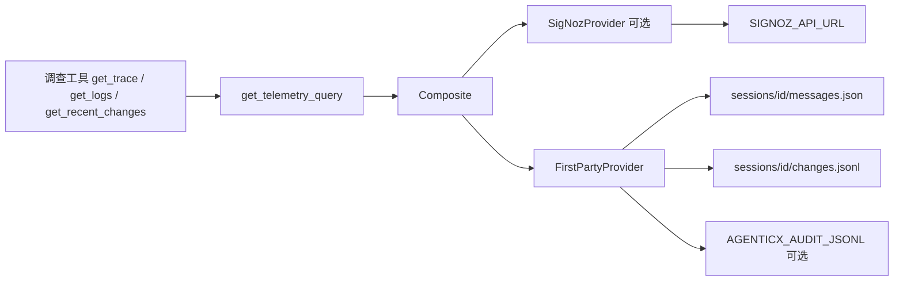

# S2：TelemetryQuery 契约 + FirstParty + 默认观测盒

Planned-with: Cursor Grok 4.6
Suggested-Impl-Model: Composer 2.5
Parent-Plan: `.cursor/plans/pending/2026-09-06-agenticops-platform-master.plan.md`
Plan-Id: 2026-09-06-telemetry-query-and-default-box
Wave: 1（数据质量）
Depends-on: S1 `2026-09-06-otel-correlation-keys` 必须先合入（`agenticx/observability/correlation.py` 与四常量存在）
Adopt / Wrap / Build: **Build** 查询契约；**Adopt** SigNoz 默认盒（Foundry）；**Wrap** 可选 `SigNozProvider` HTTP

> **For implementer:** 不看对话也能落地。S1 未落地则先停。不要 commit，除非用户明确要求。实施前把本文件移到 `.cursor/plans/` 根目录。

**Goal:** 调查侧只学一种只读接口：按关联键取 trace / logs / 最近变更。没装观测盒时 FirstParty 仍能对失败会话给出带引用的证据；装了默认盒时 OTLP 能打进去。人看的 Grafana / LGTM 不做。

**Architecture:** Python `TelemetryQuery` Protocol 是产品面。`FirstPartyProvider` 读本机 `messages.json` + 可选审计 JSONL + 会话 `changes.jsonl`。`SigNozProvider` 仅在配置了 API 时查 HTTP，失败回落 FirstParty。Studio 工具默认关闭，避免主聊天变成运维台。默认盒用官方 Foundry casting，禁止手搓第三套 ClickHouse schema。

**Tech Stack:** 标准库 + 现有 pytest；Studio 工具表沿用 `STUDIO_TOOLS` 的 env 门闩模式；观测盒 Foundry `casting.yaml`（[SigNoz Docker 安装](https://signoz.io/docs/install/docker/)）。

---

## 质量门（Master §9）

| 问 | 答 |
|----|----|
| 对应哪道坎？ | Wave 1。准出是「Agent 能取证」，不是「看板绿了」 |
| 为什么不 Adopt 现成 MCP 当产品？ | SigNoz MCP 可作加速，但 Agent 必须只面对我们的三方法；MCP 字段漂移不能泄漏进工具表 |
| 精确落点 | 见锚点与各 FR |
| 关联键 | 查询入参只认 S1 冻结名：`session_id` / `tenant_id` / `deployment_id` / `trace_id`（W3C hex **或** Gateway ULID） |
| 无证据不得给根因 | `get_trace`/`get_logs` 空结果必须是 typed empty + `reason`，禁止虚构 span |
| 人怎么接管？ | 工具默认不进 Desktop 聊天；人仍看 `messages.json` / SigNoz UI `:8080` |

---

## 根因与证据链

1. Master 已拍板：人看的看板不是产品；`TelemetryQuery` 才是。默认盒 SigNoz+ClickHouse；LGTM 仅适配客户已有 Grafana（本 plan 不做 LGTM）。
2. 现仓没有 `agenticx/ops/`，也没有 `TelemetryQuery`。轨迹在 `agenticx/observability/trajectory.py`，但是库级对象，Studio 并不保证每回合落盘一份。
3. 会话证据的稳定落点是 `SessionManager` 的 `~/.agenticx/sessions/<id>/messages.json`（`session_manager.py` 约 L2473）。FirstParty **必须**能只靠这份文件跑通 `get_trace` / `get_logs`。
4. Gateway 审计 JSONL 有 `session_id` / `trace_id` / `tenant_id`（S1 后还有 JSONL `deployment_id`）。FirstParty `get_logs` **可选**读 `AGENTICX_AUDIT_JSONL`；路径不存在则当无日志，不报错。
5. `get_recent_changes` 在 S4 之前没有 Openship。本 plan 提供 `record_change_event` + 会话 `changes.jsonl`；无文件时返回空列表，**不得**去 git log 或 SSH。
6. Studio **从未** `enable_otel()`。本 plan 在 `create_studio_app` 的 lifespan 里用**独立 try/except 精确插入**，默认仍关（`OTelConfig.from_env()` 的 `AGENTICX_OTEL_ENABLED` 默认 false）。
7. 官方 SigNoz 从 v0.130.0 起，仓库 `deploy/` 旧 compose **已弃用**，改为 Foundry（`foundryctl` + `casting.yaml`）。禁止把过期的 `install.sh` 抄进仓库当默认盒。

---

## 包落点（拍板，禁止两处各写一份）

| 用途 | 路径 |
|------|------|
| 查询契约 + Provider | `agenticx/ops/`（Python，调查 Agent 消费者） |
| 默认盒安装描述 | `deploy/observability/` |
| **不建** | `enterprise/packages/ops-model`（本 plan） |

---

## In scope

- `TelemetryQuery` Protocol 与三类返回 dataclass
- `FirstPartyProvider` + `record_change_event`
- `SigNozProvider`（HTTP，可空配置；失败回落）
- `CompositeTelemetryQuery` + `get_telemetry_query()` 工厂
- 三件只读工具 schema + dispatch；**默认不注入** `STUDIO_TOOLS`
- Studio lifespan 按 env 启用 OTel + hooks（精确插入）
- Foundry `casting.yaml` + README + 可选 Gateway scrape sidecar
- 失败会话 fixture 冒烟

## Out of scope

- LGTM / Loki / Tempo / Grafana 适配器（S6 以后）
- Openship / `ChangePlaneProvider`（S4）
- UModel PG（S3）、RCA 图（S7）、Holmes/k8sgpt（S10）
- Desktop 主聊天 UX、群聊、分身、Focus Mode、admin-console Ops 区
- 把 `get_trace` 默认加入 Meta 工具表（会改变日常对话行为）
- Fork SigNoz、自建 ClickHouse 表、第四个 APM SDK
- 改 Gateway 策略 / 配额 / Prom label（S1 禁令继续有效）
- `server.py` **顶部 import 区块**（历史误删 `GroupChatRegistry`）。只许在 `create_studio_app` 的 `_studio_lifespan` 内精确插入一个 try 块
- 客户名、对标竞品 commit 文案

---

## 现状锚点

| 符号 | 路径 | 约行 |
|------|------|------|
| S1 关联键 | `agenticx/observability/correlation.py`、`ai_attributes.py` | S1 落地后 |
| `messages.json` | `agenticx/studio/session_manager.py` `_messages_path` | ~2473 |
| 会话根 | `~/.agenticx/sessions/<session_id>/` | AGENTS.md |
| `create_studio_app` / `_studio_lifespan` | `agenticx/studio/server.py` | 890–940（longrun 块之后插入） |
| `OTelConfig.from_env` / `enable_otel` | `agenticx/observability/otel/config.py` | 69–99、129 |
| `register_otel_hooks` | `agenticx/observability/otel/hooks.py` | 58 |
| `STUDIO_TOOLS` / `dispatch_tool_async` | `agenticx/cli/agent_tools.py` | 682、9154 |
| `merge_computer_use_tools_into`（门闩范本） | 同文件 | 2723 |
| `knowledge_search` dispatch | 同文件 | 9323 |
| Gateway 审计 JSONL 字段 | `enterprise/apps/gateway/internal/audit/writer.go` | 23–32 |
| 现有 compose（勿改 prod） | `enterprise/deploy/docker-compose/dev.yml` | — |

`server.py` 插入点锚点（lifespan 内 longrun 之后，约 L933–940）：

```python
        except Exception as exc:
            logger.debug("LongRun orchestrator not started: %s", exc)

        def _preload_code_index_model() -> None:
```

在这两段**之间**插入 OTel try 块。禁止替换 `_preload_code_index_model` 或 longrun 块。

---

## 冻结查询契约

```python
# 入参：至少提供一种关联键或时间窗。全空 → 校验错误，不是「全库扫描」。
class QueryScope:
    session_id: str = ""
    tenant_id: str = ""
    deployment_id: str = ""
    trace_id: str = ""          # W3C 32-hex 或 Gateway ULID
    start_ts: datetime | None
    end_ts: datetime | None
    limit: int = 50             # clamp 1..200

class TraceSpan:
    trace_id: str
    span_id: str
    name: str
    start_ts: datetime | None
    duration_ms: float | None
    status: str                 # ok | error | unknown
    attributes: dict[str, str]
    source: str                 # first_party | signoz

class LogRecord:
    ts: datetime | None
    level: str
    message: str
    trace_id: str
    session_id: str
    source: str

class ChangeEvent:
    ts: datetime | None
    deployment_id: str
    action: str                 # 自由短字符串，S4 再枚举
    summary: str
    source: str                 # first_party | openship（S2 只写 first_party）

class QueryResult:
    items: list
    source: str
    reason: str                 # 空结果时必填，例如 "no_messages" / "no_audit_file"
```

Protocol 三方法：`get_trace` / `get_logs` / `get_recent_changes`，均 `(scope: QueryScope) -> QueryResult`。

**空结果规则：** `items == []` 且 `reason` 非空。禁止 raise「没找到」。配置错误（例如 SigNoz 401）可以写进 `reason`，同时 Composite 回落 FirstParty。

**`trace_id` 识别：**

```python
def classify_trace_id(value: str) -> str:
    v = value.strip()
    if re.fullmatch(r"[0-9a-fA-F]{32}", v):
        return "otel_w3c"
    if re.fullmatch(r"[0-9A-HJKMNP-TV-Z]{26}", v):
        return "gateway_ulid"
    return "unknown"
```

unknown 且同时没有 session_id → `QueryResult(items=[], reason="invalid_scope")`。

---

## FR-1：契约 + FirstParty（先测试后实现）

**Files:**

- Create: `agenticx/ops/__init__.py`
- Create: `agenticx/ops/query.py`（dataclass + Protocol + `classify_trace_id` + `clamp_limit`）
- Create: `agenticx/ops/first_party.py`
- Create: `agenticx/ops/change_log.py`
- Test: `tests/test_smoke_telemetry_query.py`

**新文件头：** 英文 docstring、`Author: Damon Li`、绝对 import。

**Step 1: 失败测试 — fixture 会话**

测试用 `tmp_path` 写：

```
<tmp>/sessions/sess-fail/messages.json
```

内容必须是合法 Studio 历史（实施者按此原样落盘）：

```json
[
  {"role": "user", "content": "deploy please", "timestamp": "2026-09-06T12:00:00+00:00"},
  {
    "role": "assistant",
    "content": "",
    "tool_calls": [
      {
        "id": "c1",
        "type": "function",
        "function": {"name": "bash_exec", "arguments": "{\"command\":\"false\"}"}
      }
    ],
    "timestamp": "2026-09-06T12:00:01+00:00"
  },
  {
    "role": "tool",
    "tool_call_id": "c1",
    "name": "bash_exec",
    "content": "ERROR: exit 1",
    "timestamp": "2026-09-06T12:00:02+00:00"
  },
  {"role": "assistant", "content": "command failed", "timestamp": "2026-09-06T12:00:03+00:00"}
]
```

断言：

```python
def test_first_party_trace_and_logs_from_failed_session(tmp_path, monkeypatch):
    # FirstPartyProvider(sessions_root=tmp_path / "sessions")
    scope = QueryScope(session_id="sess-fail")
    traces = provider.get_trace(scope)
    assert traces.reason == ""
    assert any(s.name == "bash_exec" or "bash_exec" in s.name for s in traces.items)
    assert any(s.status == "error" for s in traces.items)
    logs = provider.get_logs(scope)
    assert any("ERROR: exit 1" in r.message for r in logs.items)
    changes = provider.get_recent_changes(scope)
    assert changes.items == []
    assert changes.reason == "no_change_events"

def test_empty_scope_is_invalid():
    r = provider.get_trace(QueryScope())
    assert r.items == []
    assert r.reason == "invalid_scope"

def test_missing_session_is_empty_not_raise(tmp_path):
    r = FirstPartyProvider(sessions_root=tmp_path / "sessions").get_trace(
        QueryScope(session_id="nope")
    )
    assert r.items == []
    assert r.reason == "no_messages"
```

**Step 2:** `pytest tests/test_smoke_telemetry_query.py -q` → FAIL

**Step 3: FirstParty 映射规则（写进实现，禁止「自由发挥」）**

`messages.json` → spans：

| 消息 | span name | status | span_id |
|------|-----------|--------|---------|
| assistant 带 `tool_calls[]` | `function.name` | 先 `unknown`，若后续 tool 内容以 `ERROR` / `Error` 开头则改 `error`，否则 `ok` | `tool_calls[].id` 或稳定 hash |
| tool | 不单独再开 span（回填上一条） | 见上 | — |
| 纯 assistant 文本 | `assistant.reply` | ok | 消息 index |

每个 span `attributes` 至少：`agenticx.session.id=scope.session_id`。`trace_id`：若 scope 带了就用；否则用 `session:<session_id>` 占位（FirstParty 合成，`source=first_party`）。**禁止**编造 W3C 32-hex 假装来自 OTel。

`get_logs`：

1. 所有 `role=tool` 的 `content`（截断单条 4KiB）
2. assistant `content` 里含 `error`/`失败`/`ERROR` 的行
3. 若 `AGENTICX_AUDIT_JSONL` 指向存在的文件：按 JSON 行过滤 `session_id` 或 `trace_id` 匹配，映射 `event_type` + `model` + `route` 为 message。文件不存在 → 忽略

`change_log.py`：

```python
def change_log_path(session_dir: Path) -> Path:
    return session_dir / "changes.jsonl"

def record_change_event(session_dir: Path, event: ChangeEvent) -> None:
    # append one JSON object per line; create dir; no secrets

def read_change_events(session_dir: Path, limit: int) -> list[ChangeEvent]:
```

`get_recent_changes` 只读该文件。S4 再让 Openship 调 `record_change_event`。

**Step 4:** 同测试 PASS

另写 `test_record_then_get_recent_changes`：record 一条 `action="restart"`，再 get 能命中。

---

## FR-2：SigNozProvider + Composite 工厂

**Files:**

- Create: `agenticx/ops/signoz.py`
- Create: `agenticx/ops/factory.py`
- Test: 同 `tests/test_smoke_telemetry_query.py` 加 class

**环境变量（只这些，写进 `factory.py` docstring）：**

| 变量 | 默认 | 含义 |
|------|------|------|
| `AGENTICX_TELEMETRY_BACKEND` | `auto` | `first_party` / `signoz` / `auto` |
| `SIGNOZ_API_URL` | 空 | 例如 `http://127.0.0.1:8080` |
| `SIGNOZ_API_KEY` | 空 | 可选 |
| `AGENTICX_SESSIONS_ROOT` | `~/.agenticx/sessions` | FirstParty 根 |
| `AGENTICX_AUDIT_JSONL` | 空 | 可选审计 |

`auto`：`SIGNOZ_API_URL` 非空 → Composite(signoz, first_party)；否则纯 FirstParty。

**SigNoz HTTP（最小，禁止实现完整 Query Builder）：**

- Base：`{SIGNOZ_API_URL}`
- `get_trace`：`GET /api/v1/traces/{trace_id}`；若 404 再试文档里的 v5 等价路径。**实施时以本机 Foundry 起来后的实际路径为准**，用 `httpx`/`urllib` 均可，超时 3s。
- 非 200：返回 `QueryResult(items=[], reason=f"signoz_http_{status}")`，不抛给 Agent
- `get_logs`：若官方 logs search 路径本机探测失败，直接 `reason=signoz_logs_unsupported`，Composite 用 FirstParty 填
- `get_recent_changes`：**永远**委托 FirstParty（SigNoz 不是变更面）

没有真实 SigNoz 时：用 `unittest.mock` mock `urlopen`/`httpx` 返回一个含 `spans:[{name,spanId,traceId}]` 的 JSON，断言映射进 `TraceSpan.source=="signoz"`。

**Composite：**

```python
def get_trace(self, scope):
    if self.signoz is None:
        return self.first_party.get_trace(scope)
    primary = self.signoz.get_trace(scope)
    if primary.items:
        return primary
    fallback = self.first_party.get_trace(scope)
    if fallback.items:
        fallback.reason = fallback.reason or "signoz_empty_used_first_party"
        return fallback
    return primary if primary.reason else fallback
```

`get_logs` 同理。`get_recent_changes` 只调 FirstParty。

```bash
python -m pytest tests/test_smoke_telemetry_query.py -q
```

---

## FR-3：只读工具（默认关闭）

**Files:**

- Create: `agenticx/ops/tools.py`（schema 列表 `OPS_TOOLS` + `dispatch_ops_tool`）
- Modify: `agenticx/cli/agent_tools.py`
  - 在 `merge_computer_use_tools_into` **之后**（约 L2812 现有 `tools = merge_computer_use_tools_into(list(STUDIO_TOOLS))`）再包一层 `merge_ops_tools_into`，或在该函数旁新增同结构函数并在**同一调用点**套上
  - `dispatch_tool_async` 在 `knowledge_search` 分支附近加 `get_trace` / `get_logs` / `get_recent_changes` 三分支，内部 `asyncio.to_thread` 调 `dispatch_ops_tool`
- 禁止把三工具字面量塞进 `STUDIO_TOOLS` 列表本体（默认可见集会变）
- Test: `tests/test_smoke_ops_tools.py`

**门闩：** `AGENTICX_OPS_TOOLS` 默认 `0`。仅 `1` / `true` / `on` 时 merge。

**工具 JSON schema（必须按此名字，Agent 与 AC 都认它们）：**

```python
OPS_TOOLS = [
  {"type":"function","function":{"name":"get_trace","description":"Read-only. Fetch spans for a session_id or trace_id. Never invent spans.","parameters":{"type":"object","properties":{
      "session_id":{"type":"string"},
      "trace_id":{"type":"string"},
      "tenant_id":{"type":"string"},
      "deployment_id":{"type":"string"},
      "limit":{"type":"integer"}
  },"additionalProperties":False}}},
  # get_logs — 同上 properties
  # get_recent_changes — 同上 properties
]
```

`dispatch_ops_tool` 返回 JSON 字符串：`{"source","reason","items":[...]}`。空 items 也要带 reason。

**AC-工具：**

```python
def test_ops_tools_not_in_studio_by_default(monkeypatch):
    monkeypatch.delenv("AGENTICX_OPS_TOOLS", raising=False)
    from agenticx.ops.tools import merge_ops_tools_into, OPS_TOOLS
    merged = merge_ops_tools_into([{"type":"function","function":{"name":"knowledge_search"}}])
    names = {t["function"]["name"] for t in merged}
    assert "get_trace" not in names

def test_ops_tools_merge_when_enabled(monkeypatch):
    monkeypatch.setenv("AGENTICX_OPS_TOOLS", "1")
    merged = merge_ops_tools_into([])
    assert {t["function"]["name"] for t in merged} >= {"get_trace","get_logs","get_recent_changes"}

def test_dispatch_get_trace_failed_session(tmp_path, monkeypatch):
    # 复用 FR-1 fixture；monkeypatch AGENTICX_SESSIONS_ROOT
    raw = dispatch_ops_tool("get_trace", {"session_id":"sess-fail"}, session=None)
    body = json.loads(raw)
    assert body["items"]
    assert any("bash_exec" in json.dumps(it) for it in body["items"])
```

`dispatch_tool_async` 在 flag 关闭时：若模型仍喊 `get_trace`，返回 `ERROR: ops tools disabled. Set AGENTICX_OPS_TOOLS=1`（与 `skill_manage` 禁用句式类似，约 L8104）。

**不要**改 `meta_agent.py` 提示、不要改 Desktop。

---

## FR-4：Studio 按 env 启用 OTel（精确插入）

**Files:**

- Modify: `agenticx/studio/server.py` **仅** `_studio_lifespan` 内插入
- Test: 不强制起 `agx serve` 测 OTel；用单元测试测抽出的 helper，避免 lifespan 难测

为降低误删 import 的风险：**不要**在 `server.py` 文件顶增加 `from agenticx.observability.otel import ...`。插入块内部 import。

**抽出 helper（推荐，便于测）：** `agenticx/ops/otel_bootstrap.py`

```python
def maybe_enable_studio_otel() -> bool:
    """Enable OTel from env. Return True if enabled. Never raise."""
    try:
        from agenticx.observability.otel import OTelConfig, enable_otel, register_otel_hooks
        cfg = OTelConfig.from_env()
        if not cfg.enabled:
            return False
        enable_otel(
            service_name=cfg.service_name or "agenticx-studio",
            otlp_endpoint=cfg.otlp_endpoint,
            export_to_console=cfg.export_to_console,
            export_to_span_tree=True,
            trace_sample_rate=cfg.trace_sample_rate,
        )
        register_otel_hooks(service_name=cfg.service_name or "agenticx-studio")
        return True
    except Exception:
        return False
```

**`server.py` 插入（longrun except 与 `_preload_code_index_model` 之间）：**

```python
        try:
            from agenticx.ops.otel_bootstrap import maybe_enable_studio_otel

            maybe_enable_studio_otel()
        except Exception as exc:
            logger.debug("otel bootstrap skipped: %s", exc)
```

插入后必须目视 diff：import 区（文件头到 `def create_studio_app` 之前）**零变化**；`GroupChatRegistry` 等既有符号仍在。

**AC-serve（改了 `server.py` 则强制）：**

```bash
# 选空闲端口，例如 18765
agx serve --host 127.0.0.1 --port 18765
# 另开 shell
curl -sS --noproxy '*' http://127.0.0.1:18765/api/session
curl -sS --noproxy '*' http://127.0.0.1:18765/api/avatars
curl -sS --noproxy '*' http://127.0.0.1:18765/api/sessions
```

Expected: 进程不崩溃，三个接口 HTTP 200。测完停掉进程。默认不设 `AGENTICX_OTEL_ENABLED`，行为与改前一致。

`tests/test_smoke_otel_bootstrap.py`：`monkeypatch.delenv("AGENTICX_OTEL_ENABLED")` → `maybe_enable_studio_otel() is False`。

---

## FR-5：默认观测盒（Foundry，不手搓存储）

**Files:**

- Create: `deploy/observability/README.md`
- Create: `deploy/observability/casting.yaml`
- Create: `deploy/observability/gateway-scrape/docker-compose.yml`（可选 sidecar）
- Create: `deploy/observability/gateway-scrape/otel-collector-config.yaml`
- Test: `tests/test_smoke_observability_box.py`（只做 YAML/文件断言，**不**在 CI 拉 ClickHouse）

**`casting.yaml`（Adopt 官方形状，字段以 Foundry 文档为准；实施日若文档微调，保持 flavor/mode，禁止改成 LGTM）：**

```yaml
apiVersion: foundry.signoz.io/v1
kind: Casting
metadata:
  name: agenticx-default-box
spec:
  deployment:
    flavor: compose
    mode: docker
  metastore:
    kind: sqlite
```

若实施时 Foundry 要求不同 `apiVersion`，以 `foundryctl gauge -f deploy/observability/casting.yaml` 能过为准，并在 README 写明 `foundryctl` 版本。

**README 必须写清（中文，面向实施/交付，不写客户名）：**

1. 默认盒是 SigNoz：UI `:8080`，OTLP `:4317` / `:4318`
2. Docker 至少 **4GB** 内存；ClickHouse 吃 RAM，笔记本不够就只跑 FirstParty
3. 安装：`foundryctl` → `foundryctl gauge/forge/cast -f casting.yaml`（或文档等价命令）
4. Runtime 导出：`AGENTICX_OTEL_ENABLED=true`、`AGENTICX_OTEL_ENDPOINT=http://127.0.0.1:4317`、`AGENTICX_OTEL_CONSOLE=false`
5. **不要**再起一份 Loki/Tempo/Grafana 当默认
6. 本目录不提交 `pours/` 生成物（`.gitignore` 加 `deploy/observability/pours/`）
7. Gateway 已有 `/metrics`：用 sidecar scrape 再 OTLP 给 4317，**不要**改 `metrics.go` label

**Gateway scrape sidecar**（Wrap Collector，Adopt 官方 contrib 镜像）：

`gateway-scrape/otel-collector-config.yaml`：

```yaml
receivers:
  prometheus:
    config:
      scrape_configs:
        - job_name: agx-gateway
          scrape_interval: 15s
          static_configs:
            - targets: ["${GATEWAY_METRICS_HOST:host.docker.internal}:9090"]
processors:
  batch: {}
exporters:
  otlp:
    endpoint: host.docker.internal:4317
    tls:
      insecure: true
service:
  pipelines:
    metrics:
      receivers: [prometheus]
      processors: [batch]
      exporters: [otlp]
```

compose 只跑 `otel/opentelemetry-collector-contrib` 一个服务。Gateway 指标端口以现场 `GATEWAY_METRICS` 实际 listen 为准，README 写如何改 `targets`。

**AC-盒：**

```python
def test_casting_yaml_is_signoz_compose_not_lgtm():
    text = Path("deploy/observability/casting.yaml").read_text()
    assert "flavor: compose" in text
    assert "loki" not in text.lower()
    assert "grafana" not in text.lower()
    assert "tempo" not in text.lower()

def test_readme_mentions_memory_and_otlp_ports():
    text = Path("deploy/observability/README.md").read_text()
    assert "4" in text and "4317" in text and "4318" in text
    assert "AGENTICX_OTEL_ENABLED" in text
```

`docker compose -f deploy/observability/gateway-scrape/docker-compose.yml config` 应 exit 0（不要求 docker 里真有镜像）。若本机无 compose plugin，测试 skip。

**不要**改 `enterprise/deploy/docker-compose/prod.yml`。

---

## Wave 1 准出（本 plan 用户故事）

对 fixture 会话 `sess-fail`：

1. `get_telemetry_query().get_trace(QueryScope(session_id="sess-fail"))` 返回至少 1 个 span，且能指到失败工具
2. `get_logs` 引用 `ERROR: exit 1`
3. `get_recent_changes` 返回空 + `no_change_events`（或 record 后能读到）
4. 不启动 SigNoz 也能完成 1–3
5. 工具默认不出现在 Desktop 聊天工具表

这就是 Master 写的：「调查 Agent 能对失败会话执行 `get_trace` / `get_logs` / `get_recent_changes` 并引用证据」。



---

## AC 总表

| ID | 断言 | 命令 |
|----|------|------|
| AC-1 | FirstParty 失败会话有 error span + 日志 | `pytest tests/test_smoke_telemetry_query.py -q` |
| AC-2 | 空 scope / 缺会话不抛异常 | 同上 |
| AC-3 | Composite mock SigNoz + 回落 | 同上 |
| AC-4 | 默认不 merge ops tools；flag=1 才有三工具 | `pytest tests/test_smoke_ops_tools.py -q` |
| AC-5 | `maybe_enable_studio_otel` 默认 False | `pytest tests/test_smoke_otel_bootstrap.py -q` |
| AC-6 | casting 非 LGTM；README 含端口与 4GB | `pytest tests/test_smoke_observability_box.py -q` |
| AC-7 | 若改了 `server.py`：冷启动 + 三 API 200 | 见 FR-4 |
| AC-8 | `git diff` 不含 Desktop、不含 `prod.yml`、不含 LGTM 适配器 | 自检 |
| AC-9 | S1 测试仍绿 | `pytest tests/test_smoke_otel_correlation.py tests/test_smoke_otel_handler.py tests/test_smoke_otel_hooks.py -q` |

---

## 实施顺序

1. 确认 S1 文件存在，否则停
2. FR-1 TDD → FirstParty + change_log
3. FR-2 mock SigNoz + factory
4. FR-3 工具门闩 + dispatch
5. FR-4 helper 测试 → **目视** `server.py` 只多一个 try 块 → `agx serve` smoke
6. FR-5 casting/README/sidecar + YAML 测试
7. 跑 AC 总表

---

## 建议 commit 切片（仅当用户要求）

1. `feat(ops): add read-only telemetry query contract`
2. `feat(ops): gate investigation query tools behind env`
3. `feat(studio): enable otel from env during serve lifespan`
4. `chore(deploy): add default observability box instructions`

`Plan-Id: 2026-09-06-telemetry-query-and-default-box`  
`Plan-File: .cursor/plans/2026-09-06-telemetry-query-and-default-box.plan.md`（实施时已在根目录）  
`Plan-Model` / `Impl-Model` 由用户提供。`Made-with: Damon Li`。commit 不写第三方品牌名。
