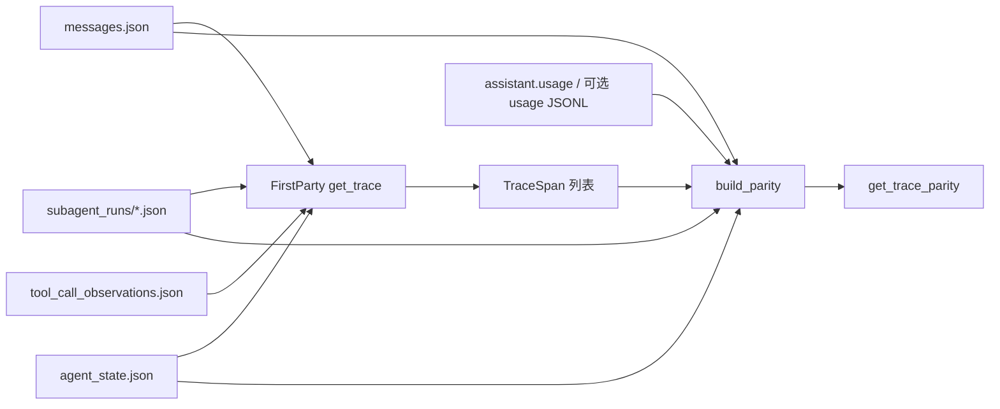

# S5：轨迹三方对账（工具 / 委派 / 确认 / usage）

Planned-with: Cursor Grok 4.6
Suggested-Impl-Model: gpt-5.6-sol-medium
Parent-Plan: `.cursor/plans/pending/2026-09-06-agenticops-platform-master.plan.md`
Depends-on: S1 关联键、S2.1 观察合并、S3 UModel 已合入
Plan-Id: 2026-09-07-agent-trace-parity
Wave: 1（数据质量）
Adopt / Wrap / Build: **Build** 本仓只读对账。禁止改 `TelemetryQuery` Protocol，禁止查 TTFT/TPS（那是 S6），禁止编造「present」侧。

> **For implementer:** 不看对话也能落地。不要 commit，除非用户明确要求。实施前把本文件移到 `.cursor/plans/` 根目录。

**Goal:** 调查侧对一条 `session_id` 能回答「工具 / 委派 / 确认等待 / 模型 usage 各自缺了哪一边」。缺边标 `missing`，禁止把缺失说成根因，禁止编造 span 或 usage。

**Architecture:** 新模块 `agenticx/ops/parity.py` 只读会话目录。三方定义为磁盘证据，不连真网、不连 Collector：**(1) runtime** = `messages.json` / `tool_call_observations.json` / `subagent_runs/` / `agent_state.json`；**(2) span** = FirstParty `get_trace` 已有或本 plan 补上的 `TraceSpan`；**(3) usage** = assistant 行 `usage` 对象，可选再读 `AGENTICX_GATEWAY_USAGE_JSONL`。`get_trace` **只改 FirstParty**（在 S2.1 观察合并之后补委派/确认 span）。新工具 `get_trace_parity` **永远走 FirstParty**，不走 SigNoz Composite。

**Tech Stack:** 现有 pytest + 标准库 JSON。不新增依赖。不改 Go 网关。

---

## 质量门（Master §9）

| 问 | 答 |
|----|----|
| 对应哪道坎？ | Wave 1。准出是「失败会话能引用证据且知道缺哪边」，不是 RCA、不是通道 SLO |
| 为什么不 Adopt 实时 OTel 查询？ | CI 与本机默认盒经常没 Collector。对账必须以会话目录为准；hooks 已发 `tool.{name}`，本 plan 不要求导出成功 |
| 精确落点 | 见「包落点」与各 FR |
| 关联键如何传播？ | 已有 `agenticx.session.id`。本 plan 只加 `agenticx.run.*` / `agenticx.confirm.request_id` / `agenticx.parity.*`。禁止发明 W3C `trace_id` |
| 无证据不得给根因 | 任一侧文件不存在 → 该侧 `missing`。`status=missing` 不是故障结论 |
| 人怎么接管？ | 打开 `~/.agenticx/sessions/<id>/` 下的 `messages.json`、`subagent_runs/`、`agent_state.json` |

---

## 根因与证据链（实施者勿依赖对话）

1. Master §8 S5：工具调用 / 委派 / 确认等待 与 OTel span、轨迹步、Gateway usage 三方对账。依赖 S1、S3。
2. S2.1 已让 `get_trace` 合并 `tool_call_observations.json`（`first_party.py` `get_trace`，约 L116–135）。**仍不读** `subagent_runs/` 与 `agent_state.json`。
3. `delegate_to_avatar` / `spawn_subagent` 的权威元数据在 `{session}/subagent_runs/{run_id}.json`（`RunRecord.kind` ∈ `delegate` \| `spawn`，`source_tool_call_id`）。`SubAgentRunStore`（`agenticx/runtime/subagent_runs/store.py` L40–48）**写死** `~/.agenticx/sessions/<id>/subagent_runs`，**不读** `AGENTICX_SESSIONS_ROOT`。本 plan **禁止改 store 根路径**；parity 必须用 `FirstPartyProvider._session_dir` 直接读文件。
4. 确认等待写入 `agent_state.json` → `checkpoint.status == "awaiting_confirm"` + `checkpoint.confirm_state.pending[]`（`agenticx/runtime/checkpoint.py` L45–55；落盘 `agenticx/studio/storage/local_file.py` L11–12、L56–57）。`confirm_required` 是 SSE，不进 `messages.json` tool 行，所以 FirstParty 今天看不到。
5. Desktop / Studio 的 token 在 assistant 行 `usage`（`input_tokens` / `output_tokens` / `total_tokens`）。Enterprise 网关另有 usage JSONL（键含 `session_id` / `trace_id`）。本 plan **只读**这两处；TTFT / TPS / 冷却是 S6。
6. `TelemetryQuery`（`query.py` L66–71）冻结三方法。S2 / S4 已禁止改签名。对账用新工具，不新加 Protocol 方法。
7. Composite（`factory.py`）SigNoz 有结果时不回落 FirstParty。因此 `get_trace_parity` 必须绕过 Composite。

---

## 包落点（拍板，禁止两处各写一份）

| 用途 | 路径 |
|------|------|
| 读盘 + 对账 | **新建** `agenticx/ops/parity.py` |
| FirstParty 补 span | `agenticx/ops/first_party.py` 的 `get_trace` **只在观察合并之后、截断 limit 之前**插调用 |
| UModel 抄 run attrs | `agenticx/ops/umodel/ingest.py` 写 `tool_call` 的 attrs 循环（约 L75–81） |
| 工具 | `agenticx/ops/tools.py` + `agenticx/cli/agent_tools.py` L9326 集合 |
| 设置文案 | `desktop/src/components/automation/RuntimeConfigSection.tsx` L50 |
| 冒烟 | `tests/test_smoke_trace_parity.py` + `tests/test_smoke_ops_tools.py` 名称集合 |
| **不建 / 不改** | `TelemetryQuery` 方法、`signoz.py`、`factory.py` 回落、`subagent_runs/store.py` 根路径、`agent_runtime.py`、`server.py` 顶部 import、Go 网关、`loop_review.py`、Desktop 聊天气泡 |

---

## In scope

- `load_run_records` / `load_confirm_pendings` / `build_parity` / FirstParty span 补齐
- 只读工具 `get_trace_parity`
- ingest 把 `agenticx.run.kind` / `agenticx.run.id` 抄进 `tool_call.attrs`（已有 key 才抄）
- fixture 冒烟；回归 `test_smoke_telemetry_query.py` / `test_smoke_umodel.py` / `test_smoke_ops_tools.py`
- hooks 里对 `delegate_to_avatar` / `spawn_subagent` **只加** `agenticx.run.kind` attribute（不读 tool args）

## Out of scope

- 改 `TelemetryQuery` / SigNoz / Composite
- S6：TTFT、TPS、冷却、plugin 错误、Grafana
- 把 `TrajectoryCollector` 落盘
- 改 `SubAgentRunStore` 的 `Path.home()` 根
- 改 `agent_runtime.py`、群聊、分身 UI、Focus Mode、体检公式
- 改 `server.py` 顶部 import（`GroupChatRegistry` 一行都不能删）
- 发明 W3C trace id；把 `task` / `question` / 聊天正文写入 attrs 或 summary
- 客户名、对标竞品 commit 文案

---

## 现状锚点

| 符号 | 路径 | 约行 / 锚点 |
|------|------|-------------|
| `FirstPartyProvider.get_trace` | `agenticx/ops/first_party.py` | L116–135；观察合并后 `return QueryResult(items=spans[:limit]...)` |
| `_spans_from_messages` | 同文件 | L187；tool span `span_id` ← `tool_calls[].id` |
| `_spans_from_observations` | 同文件 | L269；`agenticx.evidence.source=observations` |
| `RunRecord` | `agenticx/runtime/subagent_runs/contracts.py` | L78–108 |
| `index.json` runs | `store.py` `list_runs` | L287–298；`index_data["runs"]` 的 key 即 `run_id` |
| `agent_state.json` | `local_file.py` | L56–57；内容 `{"checkpoint": AgentCheckpoint.model_dump()}` |
| `confirm_state.pending` | `agenticx/runtime/confirm.py` | `export_state` 约 L253：`request_id` / `question` / `context` |
| `TraceSpan` | `agenticx/ops/query.py` | L29–37；`attributes: dict[str,str]` |
| `ingest_session` tool_call attrs | `agenticx/ops/umodel/ingest.py` | L75–81 |
| `FORBIDDEN_ATTR_KEYS` | `agenticx/ops/umodel/schema.py` | 含 `content` / `messages` / `prompt` |
| Studio 白名单 | `agenticx/cli/agent_tools.py` | L9326 |
| `OPS_TOOLS` | `agenticx/ops/tools.py` | L29 起 |
| OTel tool hook | `agenticx/observability/otel/hooks.py` | `_otel_before_tool_call` L252 |
| 旧失败会话 fixture | `tests/test_smoke_telemetry_query.py` | `_write_failed_session` |

---

## 冻结类型与常量（写进 `parity.py`）

```python
from dataclasses import dataclass, field
from datetime import datetime

PRESENT = "present"
MISSING = "missing"
N_A = "n_a"

PARITY_KINDS = ("tool_call", "delegate", "spawn", "confirm", "model")
RUN_KINDS = ("delegate", "spawn")

ATTR_RUN_KIND = "agenticx.run.kind"
ATTR_RUN_ID = "agenticx.run.id"
ATTR_RUN_AVATAR_SESSION = "agenticx.run.avatar_session_id"
ATTR_CONFIRM_ID = "agenticx.confirm.request_id"
ATTR_EVIDENCE = "agenticx.evidence.source"
ATTR_PARITY_RUNTIME = "agenticx.parity.runtime"
ATTR_PARITY_SPAN = "agenticx.parity.span"
ATTR_PARITY_USAGE = "agenticx.parity.usage"

DELEGATE_TOOL_NAMES = frozenset({"delegate_to_avatar", "spawn_subagent"})


@dataclass
class ParityRow:
    kind: str
    key: str
    name: str
    runtime: str = MISSING
    span: str = MISSING
    usage: str = N_A
    status: str = "missing"  # ok | missing | mismatch
    summary: str = ""
    ts: datetime | None = None
    attrs: dict[str, str] = field(default_factory=dict)
```

`status` 规则（写死）：

1. `usage == n_a`：`ok` 当且仅当 `runtime==present` **且** `span==present`；否则 `missing`。
2. `usage != n_a`（`kind=model`）：`ok` 当且仅当三边都是 `present`；缺任一边 → `missing`。
3. `mismatch` **只**在 runtime 与 span 都 `present`，但 run/tool 状态一个是 `error`、另一个是 `ok` 时使用。
4. 禁止第三种「编造 present」。

`summary` 只允许这些短词拼接、截断 128：**kind、status、error/ok/unknown**。禁止 `RunRecord.task`、`question`、任何聊天正文。

---

## 读盘函数（写死，不要 new SubAgentRunStore）

```python
def load_run_records(session_dir: Path) -> list[RunRecord]:
    root = Path(session_dir) / "subagent_runs"
    index_path = root / "index.json"
    if not index_path.is_file():
        return []
    # 解析 index["runs"] 的 key；每个 key 读 root / f"{run_id}.json"
    # 用 RunRecord.from_dict；坏 JSON 跳过
    # 按 (created_at, run_id) 排序

def load_confirm_pendings(session_dir: Path) -> list[dict]:
    # 1) session_dir / "agent_state.json"
    #    obj["checkpoint"]["confirm_state"]["pending"] 必须是 list
    #    每项取 request_id（或 id），去空白；空 id 丢掉
    # 2) 再扫 subagent_runs/*.activity.jsonl
    #    type == "confirm" 且能读到 request_id / id 则补缺（已有 id 不重复）
    # 返回 [{"request_id": "..."}]  — 不要带回 question
```

`RunRecord.from_dict` 从 `agenticx.runtime.subagent_runs.contracts` 导入。parity **可以** import contracts，**不可以** 为了读盘实例化 `SubAgentRunStore`。

可选 usage JSONL：

```python
def load_gateway_usage_hits(session_id: str) -> bool:
    raw = os.environ.get("AGENTICX_GATEWAY_USAGE_JSONL", "").strip()
    if not raw:
        return False
    path = Path(raw)
    if not path.is_file():
        return False
    want = session_id.strip()
    # 逐行 JSON；session_id 或 sessionId 等于 want → True
    # 解析失败跳过
```

---

## FirstParty `get_trace` after 意图

**before**（`first_party.py` 约 L125–135）：messages span + 观察去重，然后 `spans[:limit]`。

**after：** 在 `return` 前调用：

```python
        self._merge_run_and_confirm_spans(spans, scope)
        limit = clamp_limit(scope.limit)
        return QueryResult(items=spans[:limit], source="first_party", reason="")
```

`_merge_run_and_confirm_spans` 规则：

1. `runs = load_run_records(self._session_dir(session_id))`。
2. 对每条 run：
   - 先按 `source_tool_call_id` 命中已有 `span.span_id`；
   - 否则找 **尚未**带 `agenticx.run.id`、且 `name in DELEGATE_TOOL_NAMES` 的 span（先到先得）；
   - **命中：** 只 `attributes` 写入 `ATTR_RUN_KIND` / `ATTR_RUN_ID` / 可选 `ATTR_RUN_AVATAR_SESSION`（值一律 `str`，avatar session 空则不写）。不要改 `span_id`。
   - **未命中：** **追加**一条 span：`name` = `delegate` 或 `spawn`（`run.kind` 落在 `RUN_KINDS` 才用，否则 `delegate`）；`span_id` = `run.run_id`；`trace_id` = 现有 `_synthetic_trace_id(scope)`；`status` = `_run_status(run.status)`；`source="first_party"`；`attributes` 含 `agenticx.session.id`、`ATTR_EVIDENCE="subagent_runs"`、run 三键。`start_ts` 用 `datetime.fromtimestamp(run.started_at or run.created_at, tz=timezone.utc)`，失败则 `None`。
3. `pendings = load_confirm_pendings(...)`。对每个 `request_id`：若已有 span 的 `ATTR_CONFIRM_ID` 相同则跳过；否则追加 `name="confirm.wait"`，`span_id=request_id`，`status="unknown"`，`ATTR_EVIDENCE="agent_state"`，`ATTR_CONFIRM_ID=request_id`。**summary 空字符串。**
4. `_run_status`：`completed` → `ok`；`failed` / `cancelled` → `error`；其余（`running` / `paused` / `awaiting_confirm` / 空）→ `unknown`。
5. **不要**把 `run.task`、`error_text` 全文、`question` 写入 attributes。

`get_logs` **本 plan 不改**。

---

## `build_parity`（写死）

输入：`session_dir` + 已经 enrich 过的 `list[TraceSpan]` + `messages` list。

输出：`list[ParityRow]`，顺序：tool_call → delegate/spawn → confirm → model。同 kind 按 key 排序。无行且目录存在 → 返回 `[]`（工具层 `reason=""` 或 `no_parity_rows` 皆可，AC 只断言 `items` 类型与「未编造 run」）。

**tool_call 行：** 每个 `name not in {"assistant.reply", "confirm.wait", "delegate", "spawn"}` 且没有 `ATTR_RUN_ID` 的 span（普通工具）。

- `key` = `span_id`
- `runtime` = `present` 若 messages 里存在 `tool_calls[].id == span_id` 或 `role=tool` 且 `tool_call_id == span_id`，或 observations 里同名（允许）；否则 `missing`
- `span` = `present`（来自 get_trace）
- `usage` = `n_a`

**delegate / spawn 行：** 每个 `load_run_records` 的 run 一条（即使 get_trace 已 enrich）。

- `kind` = `run.kind` 若在 `RUN_KINDS` 否则 `delegate`
- `key` = `run.run_id`
- `runtime` = `present`（有 RunRecord）
- `span` = `present` 若任一 span 的 `ATTR_RUN_ID==run_id` 或 `span_id==source_tool_call_id` 或 `span_id==run_id`；否则 `missing`
- `usage` = `n_a`
- 若 runtime+span 都 present：run.status 映射为 error 而 span.status 为 ok（或相反）→ 行 `status=mismatch`

**confirm 行：** 每个 pending `request_id`。

- `runtime` = `present`
- `span` = `present` 若存在 `name=="confirm.wait"` 且 `ATTR_CONFIRM_ID` 或 `span_id` 相等
- `usage` = `n_a`

**model 行：** 至多一条，key 固定 `model`。

- 若 **任何** assistant 行有 `usage` dict 且 `int(input_tokens or total_tokens or 0) > 0` → `usage=present`，`runtime=present`
- 否则若 `load_gateway_usage_hits(session_id)` → `usage=present`，`runtime=present`
- 否则若存在 `assistant.reply` span 或 assistant 消息 → `runtime=present`，`usage=missing`（有对话无账）
- 若会话只有用户消息、无 assistant → **不要**造 model 行
- `span` = `present` 若存在任意 `assistant.reply`，否则 `missing`

---

## 工具 `get_trace_parity`

description **必须含**这些子串：

`Read-only.` `Never invent` `Missing is not a root cause` `Not the health score`

parameters：与 `get_session_review` 相同 — `session_id` / `limit`，`additionalProperties: false`。

dispatch：

```python
def _dispatch_trace_parity(arguments):
    session_id = strip
    if not session_id:
        return {"source":"parity","reason":"invalid_scope","items":[]}
    provider = FirstPartyProvider()  # 尊重 AGENTICX_SESSIONS_ROOT
    session_dir = provider._session_dir(session_id)
    if not session_dir.is_dir():
        return {"source":"parity","reason":"no_session","items":[]}
    traces = provider.get_trace(QueryScope(session_id=session_id, limit=200))
    messages = provider._load_messages(session_id) or []
    rows = build_parity(session_dir, traces.items, messages, session_id=session_id)
    return {"source":"parity","reason":"","items":[_json_ready(r) for r in rows[:limit]]}
```

空 `items` 且目录在：`reason=""`（有会话但对账行数为 0 合法）。  
返回 JSON **不得**出现 `question`、`task` 字段名（attrs 里也不要）。测试用 `json.dumps(body)` 断言不含 fixture 里的禁忌句。

`OPS_TOOL_NAMES` 与 `agent_tools.py` L9326 **只加** `"get_trace_parity"`。  
`RuntimeConfigSection.tsx` L50 文案补上该名。  
`test_smoke_ops_tools.py` 默认开/关名称集合同步（与 S4 加 `sync_changeplane` 相同改法）。

---

## ingest 抄 attrs

在 `ingest.py` 约 L75–81，`raw_attrs` 已是 dict 时， besides `agenticx.evidence.source`，若存在非空：

- `agenticx.run.kind`
- `agenticx.run.id`
- `agenticx.confirm.request_id`

则抄进 `tool_call.attrs`。不要抄 `parity.*`（避免对象图膨胀）。不要新 kind。

---

## OTel hook（最小）

`hooks.py` `_otel_before_tool_call` 在 `set_attribute(AGENTICX_TOOL_NAME)` 之后：

```python
kind = run_kind_for_tool_name(tool_name)  # 放 parity.py
if kind:
    span.set_attribute(ATTR_RUN_KIND, kind)
```

```python
def run_kind_for_tool_name(name: str) -> str:
    n = (name or "").strip()
    if n == "delegate_to_avatar":
        return "delegate"
    if n == "spawn_subagent":
        return "spawn"
    return ""
```

**禁止** `str(ctx.tool_args)`。无 Collector 时 hook 仍 no-op（现有 `if not _tracer: return`）。

---



---

## FR / AC

测试文件：`tests/test_smoke_trace_parity.py`。  
复用 `_write_failed_session`。所有写盘用 `tmp_path` + `AGENTICX_SESSIONS_ROOT` / `AGENTICX_UMODEL_PATH`。

### FR-1：读盘不经过 SubAgentRunStore

**AC-1：** `test_load_run_records_from_session_dir`  
`_write_delegate_session(tmp_path)`（见下方 fixture）。`load_run_records` 得到 1 条，`run_id=="dlg-1"`，`kind=="delegate"`，`source_tool_call_id=="call-dlg"`。

**AC-2：** `test_load_run_records_missing_dir`  
无 `subagent_runs` 的 `sess-fail` → `[]`。不抛。

**AC-3：** `test_load_confirm_pendings_from_agent_state`  
fixture 的 `cnf-1` 出现；返回 dict **没有** `question` key。

### FR-2：get_trace 看见委派与确认

**AC-4：** `test_get_trace_enriches_matching_tool_span`  
messages 里已有 `tool_calls[].id=call-dlg` 且 name=`delegate_to_avatar`。enrich 后该 span 仍是 `span_id=="call-dlg"`，且 `attributes[agenticx.run.id]=="dlg-1"`，`attributes[agenticx.run.kind]=="delegate"`。

**AC-5：** `test_get_trace_appends_run_when_tool_row_missing`  
只有 `subagent_runs`、messages 无 tool 行（可复用 obs-only 骨架 + runs）。`get_trace` items 含 `span_id=="dlg-1"`，`name=="delegate"`，`evidence.source==subagent_runs`。

**AC-6：** `test_get_trace_appends_confirm_wait`  
`sess-confirm` 的 items 含 `name=="confirm.wait"` 且 `span_id=="cnf-1"`。`json.dumps(items)` **不含** `delete the workspace`（fixture question 原文）。

**AC-7：** `test_get_trace_failed_session_unchanged_names`  
`sess-fail` 仍能看到 `bash_exec`；**没有** `delegate` / `confirm.wait` span（回归 S2）。

### FR-3：build_parity 缺边不编造

**AC-8：** `test_parity_delegate_ok_when_tool_and_run`  
AC-4 会话：存在 `kind=="delegate"` 且 `runtime==present` 且 `span==present` 且 `status=="ok"`。

**AC-9：** `test_parity_run_without_span_is_missing`  
只写 `subagent_runs`、**不要**走 enrich（直接 `build_parity(session_dir, spans=[], messages=[], ...)`）：delegate 行 `span==missing`，`status=="missing"`。

**AC-10：** `test_parity_failed_session_has_tool_no_invented_run`  
`sess-fail`：有 `tool_call` 行（bash_exec）；**没有** `kind in {delegate,spawn,confirm}` 的行。

**AC-11：** `test_parity_model_usage_from_assistant`  
assistant 带 `usage.total_tokens=14`：model 行 `usage==present`。无 usage 的失败会话：若有 assistant.reply 则 model 行 `usage==missing`，不得 `present`。

**AC-12：** `test_parity_gateway_jsonl_optional`  
`monkeypatch.setenv("AGENTICX_GATEWAY_USAGE_JSONL", tmp/usage.jsonl)` 写一行 `{"session_id":"sess-fail","input_tokens":3}`。无 message usage 时 model 行 `usage==present`。`delenv` 后不得再靠网关文件。

### FR-4：工具 + ingest + hook 纯函数

**AC-13：** `test_dispatch_get_trace_parity_not_configured_scope`  
无 `session_id` → `reason=="invalid_scope"`，`items==[]`。

**AC-14：** `test_dispatch_get_trace_parity_omits_task_text`  
delegate fixture 的 `task` 为 `SECRET_TASK_TEXT`。dispatch 返回字符串 **不含** `SECRET_TASK_TEXT`。

**AC-15：** `test_ingest_copies_run_attrs`  
AC-4 会话 ingest 后 `store.get("tool_call","call-dlg").attrs["agenticx.run.id"]=="dlg-1"`。

**AC-16：** `test_run_kind_for_tool_name`  
`delegate_to_avatar` → `delegate`；`spawn_subagent` → `spawn`；`bash_exec` → `""`。

**AC-17：** env off 时 `get_trace_parity` 不出现在 `merge_ops_tools_into`（写在 `test_smoke_ops_tools.py`）。

---

## Fixture（实施者按此写 helper，不要改字段名）

在 `tests/test_smoke_trace_parity.py` 内写 `_write_delegate_session(root: Path) -> Path`：

`sessions/sess-dlg/messages.json`：

```json
[
  {"role": "user", "content": "handoff", "timestamp": "2026-09-07T03:00:00+00:00"},
  {
    "role": "assistant",
    "content": "",
    "tool_calls": [
      {
        "id": "call-dlg",
        "type": "function",
        "function": {"name": "delegate_to_avatar", "arguments": "{}"}
      }
    ],
    "timestamp": "2026-09-07T03:00:01+00:00",
    "usage": {"input_tokens": 10, "output_tokens": 4, "total_tokens": 14}
  },
  {
    "role": "tool",
    "tool_call_id": "call-dlg",
    "name": "delegate_to_avatar",
    "content": "started",
    "timestamp": "2026-09-07T03:00:02+00:00"
  }
]
```

`sessions/sess-dlg/subagent_runs/index.json`：

```json
{"runs": {"dlg-1": {}}, "clusters": {}}
```

`sessions/sess-dlg/subagent_runs/dlg-1.json`（字段齐即可，`from_dict` 能读）：

```json
{
  "run_id": "dlg-1",
  "kind": "delegate",
  "owner_session_id": "sess-dlg",
  "cluster_id": "c1",
  "badge_seq": "A",
  "name": "researcher",
  "role": "worker",
  "task": "SECRET_TASK_TEXT",
  "status": "completed",
  "created_at": 1757214000,
  "updated_at": 1757214002,
  "started_at": 1757214000,
  "completed_at": 1757214002,
  "source_tool_call_id": "call-dlg",
  "avatar_session_id": "ava-sess-1",
  "status_history": [],
  "output_files": [],
  "artifacts": [],
  "detail_refs": {},
  "activity_count": 0,
  "schema_version": 1
}
```

`_write_confirm_session(root)`：`sess-confirm/messages.json` 可只含一条 user；`agent_state.json`：

```json
{
  "checkpoint": {
    "session_id": "sess-confirm",
    "turn_id": "t1",
    "round_idx": 1,
    "status": "awaiting_confirm",
    "pending_tool_calls": [],
    "confirm_state": {
      "pending": [
        {
          "request_id": "cnf-1",
          "question": "delete the workspace",
          "context": {}
        }
      ],
      "last_request": "cnf-1"
    },
    "created_at": 1,
    "updated_at": 1
  }
}
```

---

## 实施任务（按序，TDD）

### Task 1：parity 读盘

Create: `agenticx/ops/parity.py`（类型 + load_* + `run_kind_for_tool_name`）  
Test: AC-1/2/3/16

### Task 2：FirstParty merge

Modify: `first_party.py` 仅 `get_trace` + 新方法 `_merge_run_and_confirm_spans`  
Test: AC-4/5/6/7  
跑：`pytest tests/test_smoke_telemetry_query.py -q --no-cov`

### Task 3：build_parity

同一 `parity.py`  
Test: AC-8..12

### Task 4：工具 + ingest + 文案

Modify: `tools.py`、`agent_tools.py` L9326、`RuntimeConfigSection.tsx` L50、`ingest.py` attrs、`hooks.py` 两行 set_attribute  
Test: AC-13/14/15/17

### Task 5：回归

```bash
/opt/miniconda3/bin/python -m pytest \
  tests/test_smoke_trace_parity.py \
  tests/test_smoke_telemetry_query.py \
  tests/test_smoke_umodel.py \
  tests/test_smoke_ops_tools.py \
  tests/test_smoke_otel_hooks.py \
  -q --no-cov
```

**不要** `create_studio_app()`。不要改 `server.py`。

---

## no-scope-creep 边界

| 想顺手做的 | 为什么不准 |
|------------|------------|
| `TelemetryQuery.get_usage` | 破冻结 Protocol；usage 已挂在 parity 的 model 行 |
| 查 TTFT / 冷却 | S6 |
| 修正 `SubAgentRunStore` 根路径 | 会改委派运行时行为，超出调查只读 |
| 把 task/question 放进 summary 方便调试 | 泄漏用户意图，违背「无聊天正文」 |
| 整段替换 `server.py` import | 历史事故 |
| 改体检公式 | 无关 |

---

## 验收总表

| AC | 测试 |
|----|------|
| AC-1..3 | `test_load_*` |
| AC-4..7 | `test_get_trace_*` |
| AC-8..12 | `test_parity_*` |
| AC-13..16 | dispatch / ingest / `run_kind_for_tool_name` |
| AC-17 | `test_smoke_ops_tools.py` env off |

---

## 建议的下一步（不是本 plan）

- S6：经 TelemetryQuery 查通道 TTFT / TPS / 冷却
- S7：调查拓扑
