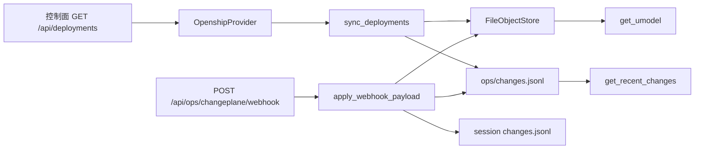

# S4：ChangePlane 只读适配 + 部署快照入对象图

Planned-with: Cursor Grok 4.6
Suggested-Impl-Model: Composer 2.5
Parent-Plan: `.cursor/plans/pending/2026-09-06-agenticops-platform-master.plan.md`
Depends-on: S3 `2026-09-07-umodel-v0` 已合入（`register_deployment` / `FileObjectStore` / `ChangeEvent`）
Plan-Id: 2026-09-07-openship-changeplane-adapter
Wave: 1（数据质量）
Adopt / Wrap / Build: **Wrap** 外部变更面 HTTP（首个实现按 Openship REST 只读路径）；**Build** 本仓 `ChangePlaneProvider` 与归一化 webhook。禁止 fork 控制面，禁止本 plan 打 `/redeploy` `/rollback` `/restart`。

> **For implementer:** 不看对话也能落地。不要 commit，除非用户明确要求。实施前把本文件移到 `.cursor/plans/` 根目录。

**Goal:** 调查侧能按 `deployment_id` 看到一次真实发布快照（Service + Deployment + ChangeEvent）。没有配置或远端失败时 typed empty，禁止编造发布。

**Architecture:** 单一落点 `agenticx/ops/changeplane/`。`ChangePlaneProvider` Protocol + `OpenshipProvider`（`urllib` GET `/api/deployments`，Bearer token）。`sync_deployments` 把快照 upsert 进 S3 对象图。归一化 webhook JSON 经 `apply_webhook_payload` 写入 `~/.agenticx/ops/changes.jsonl`（以及可选会话 `changes.jsonl`）。动作方法只返回 `action_disabled`，留给 S16。CI **禁止**连真实控制面，只用 fixture。

**Tech Stack:** 标准库 `urllib`（与 `agenticx/ops/signoz.py` 同风格）+ 现有 pytest / UModel。不新增第三方依赖。不引入 MCP SDK。

---

## 质量门（Master §9）

| 问 | 答 |
|----|----|
| 对应哪道坎？ | Wave 1。准出是「一次部署事件能挂到 `deployment_id`」，不是自治回滚 |
| 为什么 Wrap、为什么不 Adopt 控制面 UI？ | Master 已选变更面 Adapter。本仓调查 Agent 只消费归一化快照。MCP 与 REST 是同一权限栈，本 plan **只走 REST GET**，避免再引一套 JSON-RPC |
| 精确落点 | 见「包落点」与各 FR |
| 关联键如何传播？ | Producer：远端 `id` → 我们的 `deployment_id`；`projectId` → `service.id`。Consumer：`register_deployment` / `get_umodel` / `get_recent_changes`。Bearer **永不**写入对象 attrs 或工具 JSON |
| 无证据不得给根因 | 未配置 / HTTP 失败 / 无 `deployment_id` → `items=[]` + `reason`。禁止用 git log 或本机 Docker 冒充发布 |
| 人怎么接管？ | 未配 URL 时继续用 S3 `register_deployment`；本机打开 `~/.agenticx/ops/umodel.json` 与 `changes.jsonl` |

---

## 根因与证据链（实施者勿依赖对话）

1. Master §8 S4：`ChangePlaneProvider` + 只读同步部署快照；webhook → 变更事件。依赖 S3。
2. Master §3.3 动作侧提到 restart / rollback / redeploy，但 **S16** 才是有界自治。本 plan 若实现写路径就跨 Wave 门。Protocol 可以留三个方法，实现必须 `reason=action_disabled`，测试断言 **零次** POST 到 `/redeploy` `/rollback` `/restart`。
3. S3 已有 `register_deployment`（`agenticx/ops/umodel/ingest.py` L117）和会话 `changes.jsonl`。S2 `FirstPartyProvider.get_recent_changes`（`first_party.py` L170–179）**只**读会话目录：没有 `session_id` 时直接 `no_change_events`。控制面发布通常没有会话 id，所以本 plan 必须加 **ops 级** `~/.agenticx/ops/changes.jsonl`，并让 `get_recent_changes` 在 `deployment_id` 非空且 `session_id` 为空时读这份文件。
4. Openship REST（[Deployments API](https://openship.io/docs/api/deployments)）：`GET /api/deployments`（`?projectId=`）、`GET /api/deployments/:id`，鉴权 `Authorization: Bearer <token>`。`DeploymentConfigSnapshot` 在其仓 `apps/api/src/modules/deployments/build.service.ts`，运行时多挂在 `deployment.meta`。列表 JSON 外包一层不稳定，解析必须容忍 list / `{data:[]}` / `{deployments:[]}`。
5. Openship **入站** webhook 是 GitHub → 控制面触发构建（`POST /api/webhooks/:provider`），不是给我们用的。出站通知有 `deployment.succeeded`，payload **未冻成稳定合同**。本 plan 冻结 **我们自己的** 入站 JSON（见 FR-4），另做一层宽松字段别名。禁止把对方未文档化的整包 `environment` 密钥写入 attrs。
6. 安全红线（Master §3.3）：Agent 不得拿到 Docker socket。本 plan 的 HTTP 只允许 GET 列表/详情 + 本机 webhook 接收。

---

## 包落点（拍板，禁止两处各写一份）

| 用途 | 路径 |
|------|------|
| Protocol / Openship GET / sync / webhook apply | `agenticx/ops/changeplane/` |
| ops 级变更 JSONL | 扩 `agenticx/ops/change_log.py` |
| `get_recent_changes` 按 `deployment_id` 读 ops 日志 | `agenticx/ops/first_party.py` `get_recent_changes` **只改这一段** |
| 工具 | 扩 `agenticx/ops/tools.py` + `agent_tools.py` L9326 集合 |
| HTTP 入站（可选挂 Studio） | `agenticx/studio/changeplane_routes.py`；`create_studio_app` 里 **FastAPI() 之后**精确插入两行。**禁止**改 `server.py` 顶部 import 区 |
| **不建** | `enterprise/packages/ops-model`、Coolify/Kamal Provider、MCP client、drizzle |

---

## In scope

- `ChangePlaneProvider` + `DeploymentSnapshot` + `ChangePlaneResult`
- `OpenshipProvider` 只读 GET；未配置 / 失败 typed empty
- `sync_deployments` → UModel `service` + `deployment`
- ops 级 `changes.jsonl` + FirstParty 按 `deployment_id` 读取
- `apply_webhook_payload` + `POST /api/ops/changeplane/webhook`
- 只读工具 `sync_changeplane`
- 动作三方法永久 stub
- fixture 冒烟，无真网

## Out of scope

- `POST` 任何 Openship 写接口（含 redeploy / rollback / restart / cancel / pin）
- Coolify / Dokploy / Kamal Provider（接口留下即可）
- `openship up`、fork 控制面、把对方 Dashboard 嵌进 Near
- PG / Drizzle / 调查拓扑（S7）/ RCA 动作（S16）
- Desktop 新设置页（本 plan 只用环境变量）
- 改 `TelemetryQuery` 方法签名
- 改 `server.py` 顶部 import；改群聊 / 分身 / Focus Mode
- 把 snapshot 里的环境变量、volume、token 写入对象或日志
- 客户名、对标竞品 commit 文案

---

## 现状锚点

| 符号 | 路径 | 约行 / 锚点 |
|------|------|-------------|
| `register_deployment` | `agenticx/ops/umodel/ingest.py` | L117–147 |
| `UModelObject` / 禁聊天 key | `agenticx/ops/umodel/schema.py` | `FORBIDDEN_ATTR_KEYS` |
| `record_change_event` | `agenticx/ops/change_log.py` | L19 |
| `FirstPartyProvider.get_recent_changes` | `agenticx/ops/first_party.py` | L170–179 |
| `QueryScope` | `agenticx/ops/query.py` | L18；`deployment_id` 非空则 scope 合法 |
| `SigNozProvider` HTTP 风格 | `agenticx/ops/signoz.py` | `urlopen` + typed empty |
| `dispatch_ops_tool` | `agenticx/ops/tools.py` | L259 起 |
| Studio 白名单 | `agenticx/cli/agent_tools.py` | L9326 |
| `create_studio_app` | `agenticx/studio/server.py` | L1188 `app = FastAPI(...)` |
| 顶部 import 红线 | 同文件 | 文件头 `from agenticx.avatar.group_chat import GroupChatRegistry` **一行都不能删** |

---

## 冻结类型（写进 `types.py`）

```python
from dataclasses import dataclass, field
from datetime import datetime

ACTION_DISABLED = "action_disabled"

@dataclass
class DeploymentSnapshot:
    deployment_id: str
    project_id: str = ""
    status: str = ""
    environment: str = ""
    summary: str = ""
    ts: datetime | None = None
    attrs: dict[str, str] = field(default_factory=dict)

@dataclass
class ChangePlaneResult:
    ok: bool
    reason: str = ""
    snapshot: DeploymentSnapshot | None = None

class ChangePlaneProvider:
    def list_deployments(self, *, project_id: str = "", limit: int = 50) -> list[DeploymentSnapshot]: ...
    def get_deployment(self, deployment_id: str) -> DeploymentSnapshot | None: ...
    def restart(self, deployment_id: str) -> ChangePlaneResult: ...
    def rollback(self, deployment_id: str) -> ChangePlaneResult: ...
    def redeploy(self, deployment_id: str) -> ChangePlaneResult: ...
```

`attrs` **只允许**这些 key（其它丢掉，不要 `str(整个 meta)`）：

```text
source, status, environment, project_id, branch, repo_url,
runtime_mode, deploy_target, previous_deployment_id
```

`source` 固定 `"openship"`（手动登记仍是 S3 的 `"manual"`）。

---

## 环境变量（写死，禁止再发明一套）

| 变量 | 含义 | 默认 |
|------|------|------|
| `AGENTICX_CHANGEPLANE_BASE_URL` | 控制面根，如 `http://127.0.0.1:3000`，**不要**带 `/api` | 空 = 未配置 |
| `AGENTICX_CHANGEPLANE_TOKEN` | Bearer。也接受已有名 `OPENSHIP_TOKEN`（仅当前者为空） | 空 |
| `AGENTICX_CHANGEPLANE_PROJECT_ID` | 可选，限制 `GET /api/deployments?projectId=` | 空 = 全列表再本地截断 |
| `AGENTICX_OPS_CHANGES_PATH` | ops 级 JSONL | `~/.agenticx/ops/changes.jsonl` |
| `AGENTICX_CHANGEPLANE_WEBHOOK_SECRET` | 入站共享密钥。**空则拒绝 webhook** | 空 |

工厂 `get_changeplane()`：URL 去空白为空 → 返回 `NullChangePlaneProvider`（list 空、get None、动作 `action_disabled`）。

---

## Openship 列表解析（写死）

`GET {base}/api/deployments` 可选 `?projectId=`。  
`GET {base}/api/deployments/{id}` 用于 `get_deployment`。

超时 10s。`urlopen` 失败或非 2xx → 当空，reason 仅在工具层使用 `openship_http_<code>` / `openship_network`。Provider 方法本身返回 `[]` / `None`，不抛给模型。

从 JSON 抽出数组：

1. 根是 `list` → 用之
2. 根是 `dict` 且 `deployments` 是 list → 用之
3. 根是 `dict` 且 `data` 是 list → 用之
4. 否则 `[]`

单条对象 → `DeploymentSnapshot`：

| 我们的字段 | 尝试的 key（先到先得） |
|------------|------------------------|
| `deployment_id` | `id` / `deployment_id` / `deploymentId` |
| `project_id` | `projectId` / `project_id` |
| `status` | `status` |
| `environment` | `environment` |
| `ts` | `createdAt` / `created_at` / `ts`（`fromisoformat`，`Z`→`+00:00`） |
| snapshot 袋 | `meta` / `config` / `snapshot`（必须是 dict，否则当 `{}`） |

从 snapshot 袋再取（写入 attrs，值一律 `str` 且 ≤512）：

- `branch` ← `branch`
- `repo_url` ← `repoUrl` / `repo_url`
- `runtime_mode` ← `runtimeMode`
- `deploy_target` ← `deployTarget`
- `previous_deployment_id` ← `previousActiveDeploymentId`

`summary` = 截断 512 的 `"{status} {environment} {branch}"` 去多余空格。  
`deployment_id` 去空白后为空 → **整条丢掉**，不要用 project 名冒充。

禁止把 `environment` 变量表、`volumes`、`services[*].environment` 写入 attrs。

---

## 归一化 webhook JSON（我们的合同）

`apply_webhook_payload(payload: dict) -> ChangeEvent | None`

先把 payload 摊平：

- 若有 `data` 且为 dict，与顶层合并（顶层优先）
- 若有 `deployment` 且为 dict，缺的字段从它补

必填：`deployment_id`（或别名 `id` / `deploymentId`）。没有 → 返回 `None`，不写盘。

| 字段 | 来源 |
|------|------|
| `deployment_id` | `deployment_id` / `id` / `deploymentId` |
| `action` | `event` / `type`，默认 `deployment.updated`；去掉前缀空格 |
| `summary` | `summary`，否则 `"{status} {environment}"` |
| `ts` | `ts` / `createdAt`，解析失败则 `datetime.now(timezone.utc)` |
| `session_id` | `session_id`（可空） |
| `project_id` | `project_id` / `projectId` |

然后：

1. `register_deployment(deployment_id, store=get_object_store(), service_id=project_id, summary=summary)`  
   再 `store.get("deployment", deployment_id)` 补 attrs：`source=openship`（若尚未是 openship）、`status`（若 payload 有）。不要覆盖 S3 禁 key。
2. `record_ops_change_event(event)` 写入 ops JSONL，`source="changeplane"`。
3. 若 `session_id` 非空：对 `FirstPartyProvider()._session_dir(session_id)` 再 `record_change_event`（目录不存在则 `mkdir`）。

HTTP：`POST /api/ops/changeplane/webhook`  
Header 必须等于 secret：`X-AgenticX-Webhook-Secret` **或** `Authorization: Bearer <secret>`（`hmac.compare_digest`）。  
secret 空 → **403** `{ok:false, reason:webhook_disabled}`，不写盘。  
body 非 object → 400。  
`apply` 得 `None` → 200 `{ok:true, reason:ignored, items:[]}`（有密钥但无 id，不当成功发布）。  
成功 → 200 `{ok:true, reason:"", deployment_id}`。

---



---

## FR / AC

### FR-1：Protocol + Null + 动作 stub

**AC-1：** `tests/test_smoke_changeplane.py`::`test_null_provider_lists_empty`  
`NullChangePlaneProvider().list_deployments()` == `[]`；`get_deployment("x")` is `None`。

**AC-2：** `test_actions_are_disabled_and_do_not_http`  
对 `OpenshipProvider(base_url="http://127.0.0.1:9", token="t")` mock `urlopen`。`restart`/`rollback`/`redeploy` 的 `ok is False` 且 `reason=="action_disabled"`。`urlopen` call_count == 0。

### FR-2：解析 fixture + 只发 GET

把下面 JSON **原样**写进 `tests/fixtures/changeplane_deployments.json`（实施者不要改字段名）：

```json
{
  "deployments": [
    {
      "id": "dep_ready",
      "projectId": "proj_web",
      "status": "ready",
      "environment": "production",
      "createdAt": "2026-09-07T01:00:00.000Z",
      "meta": {
        "repoUrl": "https://example.local/app.git",
        "branch": "main",
        "runtimeMode": "docker",
        "deployTarget": "local",
        "previousActiveDeploymentId": "dep_old",
        "environment": { "SECRET": "do-not-copy" }
      }
    },
    {
      "deploymentId": "   ",
      "projectId": "proj_skip"
    }
  ]
}
```

**AC-3：** `test_parse_deployments_fixture_drops_blank_id`  
解析后只 1 条：`deployment_id=="dep_ready"`，`project_id=="proj_web"`，`attrs["branch"]=="main"`，`attrs["previous_deployment_id"]=="dep_old"`，attrs 与 summary **都不含** `do-not-copy`。

**AC-4：** `test_openship_list_uses_get_only`  
mock `urlopen` 返回 AC-3 的 fixture（status 200）。`list_deployments(project_id="proj_web")` 发出的 Request：method GET（或默认 GET）、url 含 `/api/deployments` 且含 `projectId=proj_web`、header 有 `Authorization: Bearer t`。

**AC-5：** `test_openship_http_error_is_empty`  
`urlopen` 抛 `URLError` → `list_deployments()` == `[]`。

### FR-3：sync → UModel

**AC-6：** `test_sync_upserts_service_and_deployment`  
`tmp` 的 `AGENTICX_UMODEL_PATH`。用内存假 provider 返回 AC-3 那一条 snapshot。`sync_deployments(provider, store)` 后：`store.get("service","proj_web")` 非空；`store.get("deployment","dep_ready")` 的 `deployment_id` 匹配；`attrs["source"]=="openship"`。

**AC-7：** `test_sync_empty_provider_writes_nothing`  
Null provider + 空 store → objects 文件不存在或 `objects==[]`。

### FR-4：webhook apply + ops JSONL

在 `change_log.py` 增加（不要改旧 `record_change_event` 签名）：

```python
def default_ops_changes_path() -> Path:
    raw = os.environ.get("AGENTICX_OPS_CHANGES_PATH", "").strip()
    if raw:
        return Path(raw)
    return Path.home() / ".agenticx" / "ops" / "changes.jsonl"

def record_ops_change_event(event: ChangeEvent) -> None: ...  # 追加一行，source 默认 changeplane
def read_ops_change_events(*, deployment_id: str = "", limit: int = 50) -> list[ChangeEvent]: ...
```

JSONL 行字段与会话文件相同：`ts, deployment_id, action, summary, source`。

**AC-8：** `test_apply_webhook_requires_deployment_id`  
`{}` → `None`；ops JSONL 不存在或 0 行。

**AC-9：** `test_apply_webhook_writes_ops_log_and_umodel`  
payload `{"event":"deployment.succeeded","deployment_id":"dep_wh","projectId":"proj_a","status":"ready","summary":"ok"}`。apply 后 umodel 有 deployment；`read_ops_change_events(deployment_id="dep_wh")` 有 1 条，`action` 含 `deployment.succeeded`，`source=="changeplane"`。

**AC-10：** `test_apply_webhook_with_session_id_appends_session_log`  
`session_id=sess-fail` 且 `_write_failed_session` 已建目录。apply 后该目录 `changes.jsonl` 有 `dep_wh`。

### FR-5：FirstParty 按 deployment_id 读 ops 日志

`get_recent_changes` **before**（`first_party.py` L170–179）在 `session_id` 为空时直接 `no_change_events`。

**after 意图：**

```python
def get_recent_changes(self, scope: QueryScope) -> QueryResult:
    if scope_is_invalid(scope):
        return QueryResult(items=[], source="first_party", reason="invalid_scope")
    session_id = (scope.session_id or "").strip()
    deployment_id = (scope.deployment_id or "").strip()
    if session_id:
        events = read_change_events(self._session_dir(session_id), scope.limit)
        if not events:
            return QueryResult(items=[], source="first_party", reason="no_change_events")
        return QueryResult(items=events, source="first_party", reason="")
    if deployment_id:
        events = read_ops_change_events(deployment_id=deployment_id, limit=scope.limit)
        if not events:
            return QueryResult(items=[], source="first_party", reason="no_change_events")
        return QueryResult(items=events, source="first_party", reason="")
    return QueryResult(items=[], source="first_party", reason="no_change_events")
```

**AC-11：** `test_get_recent_changes_by_deployment_id`  
写入 ops JSONL 一条 `dep_q`。`QueryScope(deployment_id="dep_q")` 的 `get_recent_changes` items 非空。`QueryScope(deployment_id="other")` 仍 `no_change_events`。

**AC-12：** `test_get_recent_changes_session_path_unchanged`  
无 `changes.jsonl` 的 `sess-fail` 仍 `reason=="no_change_events"`（回归 S2）。

### FR-6：HTTP webhook + 工具 `sync_changeplane`

新建 `agenticx/studio/changeplane_routes.py`：

```python
router = APIRouter()

@router.post("/api/ops/changeplane/webhook")
async def changeplane_webhook(request: Request): ...
```

`mount_changeplane_routes(app)` = `app.include_router(router)`。

在 `create_studio_app`、`app = FastAPI(...)` **下一行**精确插入（不要动文件头 import）：

```python
    from agenticx.studio.changeplane_routes import mount_changeplane_routes
    mount_changeplane_routes(app)
```

插完后目视确认 `from agenticx.avatar.group_chat import GroupChatRegistry` 仍在。

单测 **不要** `create_studio_app()`（太重）。用：

```python
from fastapi import FastAPI
from fastapi.testclient import TestClient
app = FastAPI()
mount_changeplane_routes(app)
```

**AC-13：** secret 空 → POST 403，`reason` 含 `webhook_disabled`。  
**AC-14：** `AGENTICX_CHANGEPLANE_WEBHOOK_SECRET=s`，Header `X-AgenticX-Webhook-Secret: s`，body 同 AC-9 → 200 且 `deployment_id=="dep_wh"`。错误 secret → 403。

工具 `sync_changeplane`：

- description 必须含：`Read-only remote`、`Never invent`、`Never restart`、`upsert local umodel`。
- parameters：`project_id` / `session_id` / `limit`，`additionalProperties: false`。
- 未配置 URL → `{"source":"changeplane","reason":"not_configured","items":[]}`。
- 已配置：`sync_deployments` 后 `items` 为 snapshot 的 `_json_ready` 列表；token 不得出现在返回字符串里。

`OPS_TOOL_NAMES` 与 `agent_tools.py` L9326 集合只加 `"sync_changeplane"`。  
`RuntimeConfigSection.tsx` L50 文案补上 `sync_changeplane`。  
`test_smoke_ops_tools.py` 名称集合同步（与 S3 加 `get_umodel` 相同改法）。

**AC-15：** `test_sync_changeplane_not_configured`  
清掉 `AGENTICX_CHANGEPLANE_BASE_URL` → `reason=="not_configured"`。

**AC-16：** env off 时 `sync_changeplane` 不出现在 merge 结果里。

---

## 实施任务（按序，TDD）

### Task 1：types + Null + stub

Create: `agenticx/ops/changeplane/{__init__,types,provider,openship,sync,webhook}.py`  
Test: `tests/test_smoke_changeplane.py` AC-1/2

### Task 2：parse + GET

Create: `tests/fixtures/changeplane_deployments.json`  
实现 `parse_deployment_list` / `OpenshipProvider._get_json`（抄 `signoz.py` 的 urlopen 模式，timeout=10）。  
AC-3/4/5。

### Task 3：sync + change_log + FirstParty

Modify: `change_log.py`、`first_party.py` 仅 `get_recent_changes`。  
AC-6/7/11/12。跑 `tests/test_smoke_telemetry_query.py` 确认旧用例仍绿。

### Task 4：apply_webhook + FastAPI 路由

AC-8/9/10/13/14。

`server.py` 只插两行。改完后：

```bash
python -c "from agenticx.studio.server import create_studio_app; create_studio_app(); print('ok')"
```

若本机依赖不齐，至少 `rg "GroupChatRegistry" agenticx/studio/server.py` 仍有 import 行。

### Task 5：工具 + 回归

```bash
/opt/miniconda3/bin/python -m pytest \
  tests/test_smoke_changeplane.py \
  tests/test_smoke_umodel.py \
  tests/test_smoke_ops_tools.py \
  tests/test_smoke_telemetry_query.py \
  -q
```

---

## no-scope-creep 边界

| 想顺手做的 | 为什么不准 |
|------------|------------|
| 实现 restart 真 POST | 跨 Wave 4 / S16 |
| 加 CoolifyProvider | Master 明确 Fallback 另开 |
| Settings 面板填 Token | 本 plan 环境变量即可；Desktop IPC 会扩 scope |
| 把 snapshot.environment 当 attrs | 密钥泄漏 |
| 整段替换 server.py import | 历史事故 |
| 改 get_trace / 体检公式 | 无关 |

---

## 验收总表

| AC | 测试 |
|----|------|
| AC-1..5 | `tests/test_smoke_changeplane.py` provider/parse |
| AC-6..7 | 同文件 sync_* |
| AC-8..10 | 同文件 apply_webhook_* |
| AC-11..12 | 同文件 + `test_smoke_telemetry_query.py` 回归 |
| AC-13..14 | 同文件 TestClient |
| AC-15..16 | 同文件 + `test_smoke_ops_tools.py` |

---

## 建议的下一步（不是本 plan）

- S5：回合级 ToolCall 与 span 对账
- S6：经查询的通道 SLO
- S16：允许清单动作才准 POST restart/rollback
