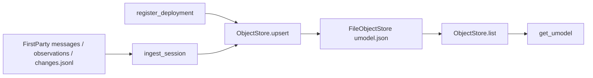

# S3：UModel v0 对象图 schema + 写入 API

Planned-with: Cursor Grok 4.6
Suggested-Impl-Model: Composer 2.5
Parent-Plan: `.cursor/plans/pending/2026-09-06-agenticops-platform-master.plan.md`
Depends-on: S1 `2026-09-06-otel-correlation-keys` 已合入；S2 FirstParty / `QueryScope` 已合入
Plan-Id: 2026-09-07-umodel-v0
Wave: 1（数据质量）
Adopt / Wrap / Build: **Build** schema + `ObjectStore` Protocol + 本机 JSON 文件库。不能 Adopt CMDB：现仓没有对象图。**不**在本 plan 建 PG / Drizzle。

> **For implementer:** 不看对话也能落地。不要 commit，除非用户明确要求。实施前把本文件移到 `.cursor/plans/` 根目录。

**Goal:** 调查侧有一份冻结的六类对象图，能按关联键写入/读取；给了 `session_id` 时能从本机会话证据物化 Session + ToolCall，禁止编造对象或写入聊天正文。

**Architecture:** 单一落点 `agenticx/ops/umodel/`。`UModelObject` + `ObjectStore` Protocol。默认 `FileObjectStore` 写 `~/.agenticx/ops/umodel.json`（可用 `AGENTICX_UMODEL_PATH` 覆盖）。`ingest_session` 只读 FirstParty 已有证据（messages / observations / changes.jsonl）再 upsert。只读工具 `get_umodel`：空库时先 ingest 再 list，仍空则 typed empty。PG / Openship / 调查拓扑留给后续 plan。

**Tech Stack:** 标准库 dataclass + JSON + 现有 pytest / `QueryScope`。不新增第三方依赖。

---

## 质量门（Master §9）

| 问 | 答 |
|----|----|
| 对应哪道坎？ | Wave 1。准出是「对象能按关联键互相找到」，不是 RCA、不是看板 |
| 为什么 Build、为什么不上 PG？ | Master 目标存储是 PG，但 Wave 1 本机形态（`agx serve` / Near）没有 PG。本 plan 冻结 schema 与 Protocol，文件库实现同一接口，S7/企业盒再加 `PgObjectStore` 而不改调用方。禁止本 plan 碰 `enterprise/packages/db-schema` |
| 精确落点 | 见「包落点」与各 FR |
| 关联键如何传播？ | 对象字段只用 S1 冻结名：`session_id` / `tenant_id` / `deployment_id` / `trace_id` / `tool_call_id`。Producer：`upsert` / `ingest_session` / `register_deployment`。Consumer：`get` / `list` / `get_umodel` |
| 无证据不得给根因 | `get_umodel` 无对象必须 `reason` 为 `invalid_scope` / `no_objects` / `unknown_kind`，`items=[]`。禁止虚构 Deployment / Alert |
| 人怎么接管？ | 本机打开 `~/.agenticx/ops/umodel.json`；会话证据仍在 `~/.agenticx/sessions/<id>/` |

---

## 根因与证据链（实施者勿依赖对话）

1. Master §8 S3：对象图 schema + 写入 API；**只**建模 Service / Session / ToolCall / ModelChannel / Alert / Deployment。完整树里的 Tenant / Environment / Route / AgentRuntime / PolicyHit / GPUNode **本 plan 不做**。
2. Master §3.2 落点二选一。S2 已拍板调查契约在 `agenticx/ops/`，并写明**不建** `enterprise/packages/ops-model`。本 plan 继续该决定：`agenticx/ops/umodel/`，禁止再写一份 TS 包。
3. S2 `TelemetryQuery` 返回的是 span / log / change **事件**，不是对象。同一 `session_id` 的 Session 与若干 ToolCall 没有稳定主键，S4 无法把 Openship snapshot 挂到 Deployment 上，S7 也无法把调查节点画成 UModel 对象。
4. 本机失败会话（S2.1 fixture `sess-obs`）有 observations、无 `role=tool`。对象图必须能从 FirstParty `get_trace` 已合并的 tool span 物化 ToolCall，不能再只认 messages 的 tool 行。
5. Master §11 仍待拍：变更面先手动登记 `deployment_id`。本 plan 提供 `register_deployment`，**不**接 Openship（那是 S4）。
6. Master：「对象图不是把 Loki 搬进 PG」。禁止把 log 正文、聊天 `content`、prompt 写入对象。

---

## 包落点（拍板，禁止两处各写一份）

| 用途 | 路径 |
|------|------|
| schema + store + ingest | `agenticx/ops/umodel/` |
| 只读工具 | 扩 `agenticx/ops/tools.py`（已有门闩） |
| **不建** | `enterprise/packages/ops-model`、任何 drizzle 迁移、`enterprise/apps/ops-*` |

---

## In scope

- 冻结六种 `kind` 与 `UModelObject` 字段
- `ObjectStore` Protocol + `FileObjectStore` + `get_object_store()` 工厂
- `upsert` / `get` / `list`；`ingest_session`；`register_deployment`
- 只读工具 `get_umodel`（与现有调查工具同一门闩）
- 冒烟测试 `tests/test_smoke_umodel.py`；现有 ops 工具测试补第四个名字以外的 `get_umodel`

## Out of scope

- PG / MySQL / Drizzle / `enterprise/packages/db-schema`
- Openship / `ChangePlaneProvider`（S4）
- 调查拓扑 / 证据指针图（S7）
- 改 `TelemetryQuery` / FirstParty / SigNoz / `loop_review` 评分
- 按 session 拉聊天正文
- Desktop 主聊天 UX、群聊、分身、Focus Mode、admin-console Ops 区
- `server.py` 顶部 import 区；本 plan **不要**改 `server.py`
- 自动在每次对话回合写入对象图（S5 对账后再说）
- Tenant / Environment / Route / AgentRuntime / PolicyHit / GPUNode
- 客户名、对标竞品 commit 文案

---

## 现状锚点

| 符号 | 路径 | 约行 / 锚点 |
|------|------|-------------|
| `QueryScope` | `agenticx/ops/query.py` | L18–25；`session_id` / `tenant_id` / `deployment_id` / `trace_id` / `limit` |
| `FirstPartyProvider.get_trace` | `agenticx/ops/first_party.py` | L116–135；已合并 observations |
| `TraceSpan` | `agenticx/ops/query.py` | L29–37；`span_id` / `name` / `status` / `attributes` |
| `read_change_events` | `agenticx/ops/change_log.py` | L34；`deployment_id` |
| S1 关联键 | `agenticx/observability/correlation.py` | `session_id` / `tenant_id` / `deployment_id` |
| S1 属性名 | `agenticx/observability/ai_attributes.py` | `agenticx.session.id` 等；对象字段用**逻辑键**（下划线），attrs 里可镜像 OTel 名 |
| `OPS_TOOLS` / `dispatch_ops_tool` | `agenticx/ops/tools.py` | L29–88、L191 |
| Studio 白名单 | `agenticx/cli/agent_tools.py` | L9326 `if name in {...}` |
| 设置文案 | `desktop/src/components/automation/RuntimeConfigSection.tsx` | L50 |
| 失败会话 fixture | `tests/test_smoke_telemetry_query.py` | `_write_failed_session` / `_write_obs_only_session` |
| 工具门闩测试 | `tests/test_smoke_ops_tools.py` | 默认四工具名断言 |

---

## 冻结对象类型（后续只加不改语义）

`kind` 只允许下面六个小写字符串（常量 `OBJECT_KINDS`）。其它值 `upsert` 抛 `ValueError`，`get_umodel` 返回 `reason=unknown_kind`。

```text
service
session
tool_call
model_channel
alert
deployment
```

### `UModelObject` 字段（写进 `schema.py`，禁止实施者自造第四套名字）

```python
from dataclasses import dataclass, field
from datetime import datetime

OBJECT_KINDS = (
    "service",
    "session",
    "tool_call",
    "model_channel",
    "alert",
    "deployment",
)

FORBIDDEN_ATTR_KEYS = frozenset(
    {"content", "messages", "prompt", "body", "chat", "input", "output"}
)

@dataclass
class UModelObject:
    kind: str
    id: str
    tenant_id: str = ""
    session_id: str = ""
    deployment_id: str = ""
    trace_id: str = ""
    tool_call_id: str = ""
    name: str = ""
    status: str = ""
    summary: str = ""
    attrs: dict[str, str] = field(default_factory=dict)
    updated_ts: datetime | None = None
```

**主键：** `(kind, id)`。同一 kind+id upsert 覆盖，不复制一行。

**按 kind 的必填 / 约定：**

| kind | `id` 必须等于 | 还必填 | 允许空 |
|------|----------------|--------|--------|
| `session` | `session_id`（且 `id == session_id`） | `session_id` | tenant / deployment / trace |
| `tool_call` | `tool_call_id`（且 `id == tool_call_id`） | `session_id`、`tool_call_id` | tenant / deployment / trace |
| `deployment` | `deployment_id`（且 `id == deployment_id`） | `deployment_id` | session / trace |
| `service` | 调用方给的稳定服务 id | `id` | 其余关联键 |
| `model_channel` | 通道 id（与 Gateway `channel_id` 同语义，本 plan 不读 Go） | `id` | 其余 |
| `alert` | 告警 id | `id` | 其余；**禁止**从体检分数自动造 Alert |

`validate_object(obj)` 规则（写进 `schema.py`）：

1. `kind` ∈ `OBJECT_KINDS`，`id` 去空白后非空。
2. `session`：`obj.id == obj.session_id`。
3. `tool_call`：`obj.id == obj.tool_call_id` 且 `session_id` 非空。
4. `deployment`：`obj.id == obj.deployment_id`。
5. `attrs` 的 key 不得 ∈ `FORBIDDEN_ATTR_KEYS`；value 必须是 `str`（非 str 则 `str(value)` 且截断 512 字符）。
6. `summary` 最长 512 字符，禁止等于整段用户/助手消息（实施时只截断，不做 NLP）。
7. 关联键一律 `.strip()`，禁止再发明 `sessionId` / `deploy_id` 作为主字段。



---

## FR / AC

### FR-1：schema + 校验

**AC-1：** `tests/test_smoke_umodel.py`::`test_validate_rejects_unknown_kind`  
构造 `UModelObject(kind="gpu_node", id="x")`，`validate_object` 抛 `ValueError`，消息含 `unknown kind`。

**AC-2：** `test_validate_session_id_must_match`  
`kind="session", id="a", session_id="b"` 抛 `ValueError`。  
`kind="tool_call", id="c1", tool_call_id="c1", session_id=""` 抛 `ValueError`。  
合法 session / tool_call / deployment 不抛。

**AC-3：** `test_validate_forbids_chat_attr_keys`  
`attrs={"content": "hello"}` 抛 `ValueError`。

### FR-2：FileObjectStore 写入 / 读取 / 租户隔离

默认路径：`Path.home() / ".agenticx" / "ops" / "umodel.json"`。  
工厂读 `AGENTICX_UMODEL_PATH`（非空则用之）。  
实现：读整个 JSON 列表，upsert 后**整文件重写**（目录 `mkdir parents`）。损坏 JSON 当空库，不抛给调用方。

`list(scope, kind="")`：

- `scope_is_invalid(scope)` → 返回 `[]`（工具层再包 `invalid_scope`）。
- 若 `kind` 非空且不在 `OBJECT_KINDS` → 返回 `[]`（工具层 `unknown_kind`）。
- 过滤：`session_id` / `tenant_id` / `deployment_id` / `trace_id` 只要 scope 里非空，对象对应字段必须相等。
- `tenant_id` 非空时**不得**返回其它 tenant 的对象（AC-5）。
- `limit` 用 `clamp_limit`。

**AC-4：** `test_file_store_upsert_get_roundtrip`  
`tmp_path / "umodel.json"`，upsert 一个 `service`，`get` 回来 `id`/`name` 相同；再 upsert 同 id 改 `name`，`get` 为新 name（覆盖不是双行）。

**AC-5：** `test_list_does_not_leak_other_tenant`  
写入 `tenant_id=t1` 与 `tenant_id=t2` 各一个 session。`list(QueryScope(session_id=..., tenant_id="t1"))` 只含 t1。

**AC-6：** `test_get_missing_returns_none`  
不存在的 id → `None`，不抛。

### FR-3：`ingest_session` 从 FirstParty 物化（不编造）

落点：`agenticx/ops/umodel/ingest.py` 的 `ingest_session(session_id, *, store, sessions_root) -> list[UModelObject]`。

行为（按顺序）：

1. `session_id` 空白 → 返回 `[]`，不写库。
2. `sessions_root / session_id` 不是目录 **或** 没有 `messages.json` → 返回 `[]`，不写库。
3. Upsert `kind=session`：`id=session_id`，`session_id=session_id`，`tenant_id` 来自环境 `AGENTICX_TENANT_ID`（可空），`deployment_id` 来自 `AGENTICX_DEPLOYMENT_ID` 或该会话 `changes.jsonl` 里**最后一条**非空 `deployment_id`，`name=""`，`status=""`，`summary=""`，`attrs` 只允许 `{"source": "first_party"}`。
4. 调用 `FirstPartyProvider(sessions_root=...).get_trace(QueryScope(session_id=session_id, limit=200))`。对每个 `name != "assistant.reply"` 的 span upsert `tool_call`：
   - `id` / `tool_call_id` = `span.span_id`
   - `name` = `span.name`
   - `status` = `span.status`
   - `trace_id` = `span.trace_id`（允许 `session:<id>` 合成值，**禁止**新造 W3C 32-hex）
   - `summary` = `""`（不要把 log message / 聊天正文拷进来）
   - `attrs` 只允许 `source` / `agenticx.evidence.source`（若 span.attributes 有）
5. 若步骤 3 解析到非空 `deployment_id`，再 upsert `kind=deployment`：`id=deployment_id`，`summary` 取对应 change 的 `summary`（可空），`attrs={"source":"first_party"}`。没有 change / 没有 deployment_id → **不**写 Deployment。
6. **不**写 Service / ModelChannel / Alert。

**AC-7：** `test_ingest_failed_session_writes_session_and_tool_call`  
用 `_write_failed_session(tmp_path)`。ingest `sess-fail`。`list(session_id=sess-fail)` 含 1 个 `session`、至少 1 个 `name=bash_exec` 的 `tool_call`。所有对象 `summary==""` 或 deployment 的 summary 来自 change（本 fixture 无 change 则无 deployment）。`items` 里不得出现用户原文 `deploy please`。

**AC-8：** `test_ingest_obs_only_writes_tool_calls_from_observations`  
`_write_obs_only_session(tmp_path)`。ingest `sess-obs`。存在 `tool_call` 且 `name` 含 `file_read` 或 `bash_exec`。不要求有 `role=tool`。

**AC-9：** `test_ingest_missing_session_writes_nothing`  
对不存在的 id 调用 ingest，store `list` 为空。

**AC-10：** `test_ingest_change_event_upserts_deployment`  
在 `sess-fail` 的 `changes.jsonl` 写一行 `deployment_id=dep-1, action=register, summary=manual`。ingest 后存在 `kind=deployment, id=dep-1`，且 session 的 `deployment_id=dep-1`。

### FR-4：`register_deployment` 手动登记

`register_deployment(deployment_id, *, store, service_id="", summary="") -> UModelObject`。

- `deployment_id` 空白 → 抛 `ValueError`。
- upsert `deployment`。
- 若 `service_id` 非空，再 upsert `service`（`id=service_id`，`name=service_id`），deployment.attrs 加 `service_id=<id>`。
- **不** invent Alert。

**AC-11：** `test_register_deployment_and_optional_service`  
只给 `dep-9` → 仅 deployment。再给 `service_id=svc-web` → 多一个 service，deployment.attrs[`service_id`]==`svc-web`。

### FR-5：只读工具 `get_umodel`

扩 `agenticx/ops/tools.py`：

1. `OPS_TOOLS` 增加 `get_umodel`。description 必须含：`Read-only`、`Never invent`、`ingest from first_party when empty`、`No chat text`。
2. parameters：`session_id` / `tenant_id` / `deployment_id` / `trace_id` / `kind` / `limit`。`additionalProperties: false`。
3. `OPS_TOOL_NAMES` 加入 `get_umodel`。
4. `dispatch_ops_tool`：`name == "get_umodel"` 走 `_dispatch_umodel`。
5. `_dispatch_umodel` 伪代码：

```python
scope = _scope_from_args(arguments)
kind = str((arguments or {}).get("kind") or "").strip()
if scope_is_invalid(scope):
    return {"source": "umodel", "reason": "invalid_scope", "items": []}
if kind and kind not in OBJECT_KINDS:
    return {"source": "umodel", "reason": "unknown_kind", "items": []}
store = get_object_store()
sid = scope.session_id
if sid:
    existing = store.list(scope, kind=kind)
    if not existing:
        ingest_session(sid, store=store)  # sessions_root 跟 FirstParty 同一 env
items = store.list(scope, kind=kind)
if not items:
    return {"source": "umodel", "reason": "no_objects", "items": []}
return {"source": "umodel", "reason": "", "items": [_json_ready(x) for x in items]}
```

6. `agenticx/cli/agent_tools.py` L9326 集合**只加** `"get_umodel"`，禁止整段替换 import。
7. `RuntimeConfigSection.tsx` L50 文案补上 `get_umodel`。

**AC-12：** `test_dispatch_get_umodel_failed_session`  
`AGENTICX_SESSIONS_ROOT` + `AGENTICX_UMODEL_PATH` 都指向 tmp。`dispatch_ops_tool("get_umodel", {"session_id":"sess-fail"})` 的 items 含 session 与 bash_exec tool_call。JSON 字符串不得含 `deploy please`。

**AC-13：** `test_dispatch_get_umodel_empty_scope`  
`{}` → `reason=invalid_scope`, `items=[]`。

**AC-14：** `test_dispatch_get_umodel_unknown_kind`  
`session_id=sess-fail, kind=gpu_node` → `reason=unknown_kind`, `items=[]`。

**AC-15：** `tests/test_smoke_ops_tools.py` 所有「默认四工具」断言改为包含 `get_umodel`；env off 时 `get_umodel` 也不在 names。`test_studio_tools_body_does_not_list_ops_tools` 继续不得把 ops 工具写进 `STUDIO_TOOLS` 字面量（只查文件即可，已有测试保持绿）。

---

## 实施任务（按序，TDD）

### Task 1：失败测试 — schema

**Files:**
- Create: `tests/test_smoke_umodel.py`
- Create: `agenticx/ops/umodel/__init__.py`（可先空，测失败）
- Create: `agenticx/ops/umodel/schema.py`

**Step 1:** 写 AC-1/2/3 测试。  
**Step 2:** ` /opt/miniconda3/bin/python -m pytest tests/test_smoke_umodel.py::test_validate_rejects_unknown_kind -q` 预期 FAIL（模块不存在或函数不存在）。  
**Step 3:** 实现 `OBJECT_KINDS` / `UModelObject` / `validate_object`。  
**Step 4:** 上述三条测试 PASS。

### Task 2：失败测试 — FileObjectStore

**Files:**
- Modify: `tests/test_smoke_umodel.py`
- Create: `agenticx/ops/umodel/store.py`

`get_object_store()`：读 `AGENTICX_UMODEL_PATH`，否则 `Path.home()/".agenticx"/"ops"/"umodel.json"`。返回 `FileObjectStore(path)`。

`FileObjectStore.__init__(self, path: Path)`。  
`_load() -> list[dict]` / `_save(rows)`。  
`upsert` 先 `validate_object`，填 `updated_ts=datetime.now(timezone.utc)`（若为空），按 `(kind,id)` 替换。  
`get` / `list` 用 `UModelObject` 从 dict 还原；时间用 `datetime.fromisoformat`。

跑 AC-4/5/6。

### Task 3：失败测试 — ingest + register

**Files:**
- Create: `agenticx/ops/umodel/ingest.py`
- Modify: `tests/test_smoke_umodel.py`

`ingest_session` / `register_deployment` 按 FR-3/FR-4。  
复用 `tests.test_smoke_telemetry_query` 的 `_write_failed_session` / `_write_obs_only_session`。  
AC-7 至 AC-11。

`record_change_event` 已在 `agenticx/ops/change_log.py`，AC-10 用它写 `changes.jsonl`。

### Task 4：工具 + 门闩

**Files:**
- Modify: `agenticx/ops/tools.py`（只追加 spec / 分支 / helper，不改 get_trace 语义）
- Modify: `agenticx/cli/agent_tools.py` L9326 **只改集合字面量**
- Modify: `desktop/src/components/automation/RuntimeConfigSection.tsx` L50
- Modify: `tests/test_smoke_ops_tools.py`
- Modify: `tests/test_smoke_umodel.py`（AC-12/13/14）

`__init__.py` 导出：`OBJECT_KINDS`, `UModelObject`, `validate_object`, `get_object_store`, `ingest_session`, `register_deployment`。

**不要**改 `agenticx/ops/__init__.py` 的 TelemetryQuery 导出，除非只追加 umodel 符号且测试需要。优先让调用方 `from agenticx.ops.umodel import ...`。

### Task 5：回归

```bash
/opt/miniconda3/bin/python -m pytest \
  tests/test_smoke_umodel.py \
  tests/test_smoke_ops_tools.py \
  tests/test_smoke_telemetry_query.py \
  -q
```

预期全绿。本 plan **不**改 `server.py`，不必冷启动 `agx serve`。

---

## 工厂与路径（写死，禁止「按需推断」）

```python
# agenticx/ops/umodel/store.py
def default_umodel_path() -> Path:
    raw = os.environ.get("AGENTICX_UMODEL_PATH", "").strip()
    if raw:
        return Path(raw)
    return Path.home() / ".agenticx" / "ops" / "umodel.json"
```

JSON 文件形状：

```json
{
  "objects": [
    {
      "kind": "session",
      "id": "sess-fail",
      "tenant_id": "",
      "session_id": "sess-fail",
      "deployment_id": "",
      "trace_id": "",
      "tool_call_id": "",
      "name": "",
      "status": "",
      "summary": "",
      "attrs": {"source": "first_party"},
      "updated_ts": "2026-09-07T00:00:00+00:00"
    }
  ]
}
```

顶层不是 list。缺 `objects` 或非 list → 当空。未知字段忽略。

---

## no-scope-creep 边界

| 想顺手做的 | 为什么不准 |
|------------|------------|
| 给 enterprise 加 drizzle 表 | 跨盒、双引擎迁移，超出 Wave 1 本机准出 |
| 在 `_run_turn_inner` 自动 upsert | S5 对账范围；会改 runtime 热路径 |
| 把 `get_umodel` 写进 `STUDIO_TOOLS` 字面量 | 与现有「merge 注入」不一致 |
| 从 `review_session` 造 Alert | 体检不是告警；S15 才做告警归一 |
| 改 FirstParty / TelemetryQuery | 本 plan 只消费它们 |
| 整段替换 `server.py` import | 历史事故 |

---

## 验收总表

| AC | 测试 |
|----|------|
| AC-1..3 | `tests/test_smoke_umodel.py` validate_* |
| AC-4..6 | 同文件 file_store_* |
| AC-7..11 | 同文件 ingest_* / register_* |
| AC-12..14 | 同文件 dispatch_get_umodel_* |
| AC-15 | `tests/test_smoke_ops_tools.py` 名称集合 |

---

## 建议的下一步（本 plan 做完之后，不是本 plan）

- S4：`ChangePlaneProvider` + Openship 只读同步 → `register_deployment` / `upsert` deployment
- S5：回合级自动对账 ToolCall（runtime 热路径）
- 企业盒：同一 Protocol 的 `PgObjectStore`（独立 plan，勿并进本文件）
