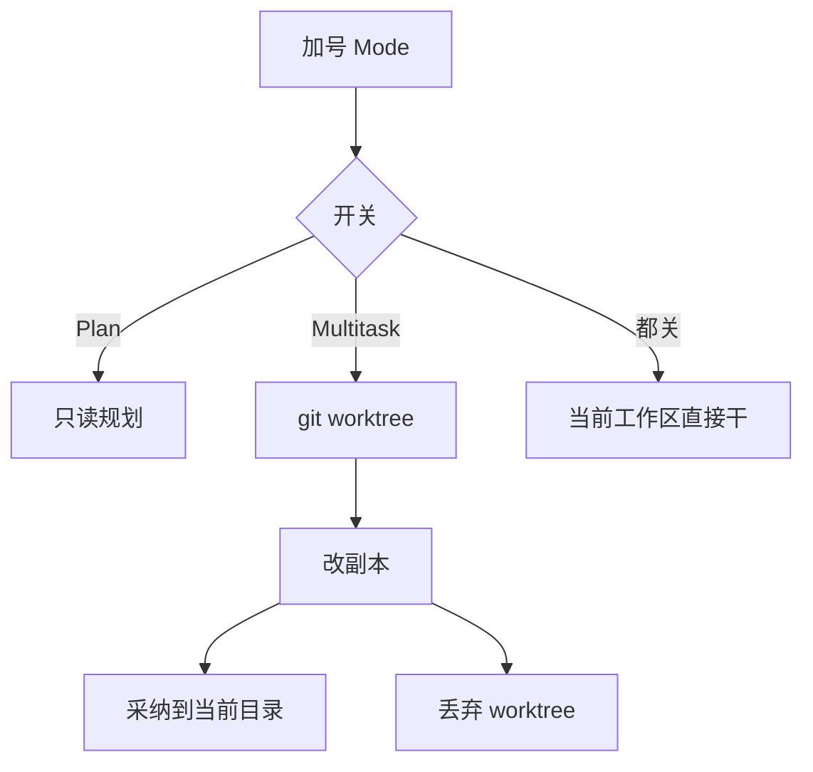

# Near Mode：Multitask（单路隔离副本）

Planned-with: cursor-grok-4.6

Suggested-Impl-Model: UI / 开关接线用 Composer 2.5；worktree + 可写根改写 + 采纳/丢弃用 gpt-5.5-codex 或同等跨栈档

> **For implementer:** 只按本文件落地。不要读本次对话。不要做多路竞赛、Ask、五档模式菜单。不要改 `agenticx/studio/server.py` 顶部 import（只能在函数体内精确增删）。不要复用 `turnIntent === "plan"` 当隔离。不要把隔离塞进 taskspace 或 `RunLocationPicker`。不要调用 `agenticx/delivery/worktree.py` 的 `create_worktree`（脏工作区会直接抛错，和本需求相反）。

**Goal:** 在已有 `+` → Mode 面板里加 **Multitask** 开关。打开后本轮在 git worktree 里改文件；用户可以 **采纳到当前目录** 或 **丢弃**。本波只做单路隔离，不做 2～N 路比稿。

**Architecture:** 权限（`runMode`）、本轮意图（`plan`）、执行位置（`isolate_run`）仍是三条正交轴。UI 上 Plan 与 Multitask **互斥**（和 Mode 双开关一致）；协议上用独立字段 `isolate_run`，禁止复用 `plan_mode`。可写根改写集中在 `_session_workspace_root_sets` / `_resolve_workspace_path`，不要在每个 file_* 工具里复制一份。

**Tech Stack:** 现有 Desktop React/Zustand、Studio FastAPI、本机 `git worktree`。无新依赖。

---

## 0. 为什么必须单独开 plan（不要直接开干）

点一个开关很容易。下面这些不是：

| 风险 | 为什么不能「先做个开关」 |
|---|---|
| 假开关 | 开了仍写主工作区，比没有更糟 |
| 脏树 | 主目录常有未提交改动；`delivery/worktree.py` 遇到 dirty 会拒绝。隔离必须允许源仓库脏 |
| 路径串台 | 模型常写主仓绝对路径；不 remap 就会写穿 isolate |
| 可写根 | `file_write` / `bash_exec` cwd 都走 `_session_workspace_root_sets`；漏一层就弄脏主树 |
| 采纳/丢弃 | 没有这条，隔离没有产品语义 |
| `server.py` | 高回归入口，只能函数体内加行 |

**本波不做多路竞赛。** 没有「单路可丢弃」，同时开 3 路就是烧钱。



---

## 1. 交互（必须长这样）

主语言英文。落在现有 Mode 二级菜单，不要再占输入区一颗选择器。

### 1.1 Mode 子菜单

改 `desktop/src/components/composer/ComposerModeMenu.tsx`：

- 说明文案随意图变：
  - default：`composer.modeDefaultHint`（已有）
  - plan：`composer.modePlanHint`（已有）
  - isolate：新 key `composer.modeMultitaskHint`  
    英：`Multitask. Work in an isolated copy; adopt or discard when done.`  
    中：`当前为隔离副本。改动在副本里进行，完成后可采纳到当前目录或丢弃。`
- 两条互斥开关：**Plan** / **Multitask**（复用 `SettingsSwitch` size=`sm`）
- 开一个关另一个；都关 = 默认
- 群聊 / `automation:*` 仍不渲染 Mode

### 1.2 输入区芯片

扩展 `TurnIntentChip`：`intent: "plan" | "isolate"`。

- Plan：剪贴板 + `Plan`
- Multitask：复制/分支图标（`Copy` 或 `GitBranch`）+ `Multitask`
- 悬停：图标变 X，下方 `HoverTip`（`placement="below"`）；点击清回 default

`ChatPane` 在 `+` 与 `RunModePicker` 之间渲染芯片（现有 Plan 芯片位置）。

### 1.3 采纳 / 丢弃条

隔离成功创建后，在消息列表与输入区之间居中一条低噪声条（不要 toast 当主入口）：

- 文案：`Working in an isolated copy`
- 同一排按钮：**Discard** 在左，**Adopt** 在右（取消紧靠主按钮左侧）
- Adopt：把副本相对起始 commit 的变更拷回源仓库，再拆 worktree，意图回 default
- Discard：拆 worktree、删隔离分支，不改源仓库，意图回 default
- 非 git：开关可点，发送失败后芯片收回，主视区黄条：`Multitask needs a git workspace`

不要改权限三档，不要改本机/远端。

---

## 2. In scope / Out of scope

### In scope

- `turnIntent`: `"default" | "plan" | "isolate"`（旧 persist 里的 `ask` 继续当 default）
- Mode 双开关 + Multitask 芯片 + 采纳/丢弃条
- `POST /api/chat` 增加 `isolate_run: bool`
- `POST /api/sessions/{id}/isolate/adopt` 与 `.../discard`
- git worktree 落在 `~/.agenticx/isolates/<session_id>/<run_id>`
- 可写根与绝对路径 remap 到 worktree
- 源仓库允许脏；worktree 从 **HEAD** 检出（源仓未提交改动留在主树，不拷进副本）
- 单测 + `server.py` 冷启动冒烟
- i18n `en/zh` `chat.json`

### Out of scope

- 2～N 路并行比稿、自动选优
- Ask / Debug / 五档模式
- 把未提交的主树脏文件同步进 worktree
- 复用 `agenticx/delivery/worktree.py::create_worktree`
- 复用 taskspace / `add_taskspace` 当副本
- 改 `RunMode` 词表、`RunLocationPicker`
- `submit_plan` / PlanCard
- 改 `enterprise/`
- 非 git 仓库假装成功（rsync 副本）

---

## 3. 需求与验收

| ID | 类型 | 描述 |
|---|---|---|
| FR-1 | Functional | Mode 里 Plan / Multitask 互斥；芯片与快捷键只切当前窗格 |
| FR-2 | Functional | `isolate_run=true` 时 `file_write` / `bash_exec` 默认 cwd 落在 worktree，不写源仓 |
| FR-3 | Functional | 模型传入源仓绝对路径时 remap 到 worktree 对应相对路径 |
| FR-4 | Functional | 源仓 dirty 也能开 worktree（从 HEAD） |
| FR-5 | Functional | Adopt 只把「worktree 相对起始 SHA 的变更」拷回源仓；其它主树脏文件不动 |
| FR-6 | Functional | Discard 删除 worktree 与隔离分支，源仓内容不变 |
| FR-7 | Functional | 非 git：不创建目录当成功；前端收回开关并提示 |
| FR-8 | Functional | 群聊 / 自动化忽略 `isolate_run` |
| NFR-1 | Non-Functional | 不新增依赖；不改 `server.py` 顶部 import |
| NFR-2 | Non-Functional | 改了 `server.py` 必须冷启动 `/api/session` `/api/avatars` `/api/sessions` = 200 |
| AC-1 | Acceptance | `tests/test_isolate_run.py`：假 git 仓 dirty 时仍能 `ensure_isolate`；写入走 worktree |
| AC-2 | Acceptance | 同文件：绝对路径落在源仓根下时 remap 到 worktree |
| AC-3 | Acceptance | 同文件：adopt 只拷 worktree 改过的文件；discard 后 worktree 目录不在 |
| AC-4 | Acceptance | `tests/test_plan_mode_runtime.py` 与 `PlanModeLayer` 旧测仍绿 |
| AC-5 | Acceptance | `turn-intent.test.ts` + `ComposerModeMenu.test.tsx`：互斥 + Multitask 文案 |
| AC-6 | Acceptance | 手工：git 仓开 Multitask 改 README，主仓 README 不变；Adopt 后主仓有改动；Discard 路径主仓不变 |

---

## 4. 规划依据（行号会漂，按符号搜）

1. Mode / 芯片：`ComposerModeMenu.tsx`、`TurnIntentChip.tsx`、`desktop/src/utils/turn-intent.ts`、`ChatPane.tsx` `sendChat` 的 `plan_mode` 附近。
2. 可写根：`agenticx/cli/agent_tools.py` `_session_workspace_root_sets`（约 L310）返回后立刻套 isolate；`_default_bash_cwd`（约 L503）会自动跟 write_roots[0]。
3. 绝对路径：同文件 `_resolve_workspace_path`（约 L3871）。在 `raw_path.is_absolute()` 解析后、根检查前调用 `remap_path_into_isolate`。
4. 协议：`agenticx/studio/protocols.py` `ChatRequest` 现有 `plan_mode`。
5. 会话：`agenticx/cli/studio.py` `StudioSession.scratchpad` 是 `Dict[str, str]`。隔离状态写入 `scratchpad["isolate_json"]`（JSON 字符串），不要改 dataclass 字段以免牵持久化。
6. 现成 git 辅助：`agenticx/delivery/worktree.py` 的 `_git_toplevel` 可抄逻辑，**禁止**调用它的 `create_worktree`（L70–73 dirty 即失败）。
7. `server.py`：`chat()` 里 `apply_turn_intent_to_session` 附近（约 L2742）函数体内再 import isolate；`/api/loop` 同样要带着 session 上的 isolate 状态。
8. Plan 与 isolate 互斥：前端互斥；后端若两旗都真，**isolate 优先**（先能丢，再谈规划）。自动化强制两旗都关。

---

## 5. 子规划 → 推荐模型

| 子任务 | 推荐模型 | 理由 |
|---|---|---|
| Task 1 isolate 纯函数 + pytest | Composer 2.5 | 假 git 仓 + 文件断言 |
| Task 2 可写根 / remap 接线 | gpt-5.5-codex | 路径逃逸回归高 |
| Task 3 `server.py` + adopt/discard API | Composer 2.5，逐行对照 | 只能函数体内加 |
| Task 4 Mode / 芯片 / 条 | Composer 2.5 | 克隆现有 Plan 开关 |

---

## 6. 关键 before / after

### 6.1 意图类型

`desktop/src/utils/turn-intent.ts`：

```typescript
export type TurnIntent = "default" | "plan" | "isolate";

export function normalizeTurnIntent(raw: unknown): TurnIntent {
  const value = String(raw ?? "").trim().toLowerCase();
  if (value === "plan" || value === "isolate" || value === "multitask") return value === "multitask" ? "isolate" : value;
  return "default";
}

export function applyTurnIntentToggle(
  current: TurnIntent,
  next: "plan" | "isolate",
  enabled: boolean,
): TurnIntent {
  if (!enabled) return current === next ? "default" : current;
  return next;
}
```

`App.tsx` `PersistedPaneState.turnIntent` 改成同一联合类型。

### 6.2 请求协议

`ChatRequest` 追加：

```python
    isolate_run: Optional[bool] = False
```

`sendChat`：

```typescript
if ((pane.turnIntent ?? "default") === "plan") body.plan_mode = true;
if ((pane.turnIntent ?? "default") === "isolate") body.isolate_run = true;
```

Adopt / Discard **不要**走 `/api/chat`。新建：

```
POST /api/sessions/{session_id}/isolate/adopt
POST /api/sessions/{session_id}/isolate/discard
```

返回 `{ ok, isolate: null }` 或 `{ ok: false, error }`。Desktop 用现有 apiToken header。

### 6.3 隔离状态

`scratchpad["isolate_json"]` 示例：

```json
{
  "run_id": "uuid",
  "repo_root": "/abs/repo",
  "worktree": "/Users/…/.agenticx/isolates/<session_id>/<run_id>",
  "branch": "agx-isolate/<session8>-<run8>",
  "start_sha": "abc123"
}
```

路径：`~/.agenticx/isolates/<session_id>/<run_id>`。`.gitignore` 不必改（在用户 home，不在仓库里）。

### 6.4 新建 `agenticx/runtime/isolate_run.py`

不要 import delivery worktree。

```python
def find_git_root(start: Path) -> Path | None:
    # git -C start rev-parse --show-toplevel；失败则 None

def ensure_isolate(session, *, isolate_run: bool, is_automation: bool) -> dict:
    # automation 或 isolate_run=False：清 scratchpad isolate_json，返回 {"active": False}
    # 已有 isolate_json 且 worktree 仍在：复用
    # 否则：write_roots[0] 找 git root；没有 → {"active": False, "error": "not_git"}
    # git worktree add -b <branch> <dest>  （允许源仓 dirty）
    # 记录 start_sha = git rev-parse HEAD

def remap_path_into_isolate(path: Path, session) -> Path:
    # 无 isolate：原样
    # path 落在 repo_root 下：worktree / relative
    # 已在 worktree 下：原样

def apply_isolate_roots(read_roots: list[Path], write_roots: list[Path], session) -> tuple[list[Path], list[Path]]:
    # 把等于或位于 repo_root 的 write/read 根替换成 worktree
    # 不要把源仓留在 write_roots

def adopt_isolate(session) -> dict: ...
def discard_isolate(session) -> dict: ...
```

**Adopt 算法（写进测试，禁止「整树 rsync」）：**

1. `git -C worktree diff --name-only <start_sha>`
2. `git -C worktree ls-files --others --exclude-standard`
3. 对每个相对路径：`shutil.copy2(worktree/rel, repo_root/rel)`（先 mkdir parent）
4. worktree 里已删、源仓还在的文件：`repo_root/rel.unlink()`
5. 然后走 discard 拆 worktree（保留已拷回的文件）

**Discard：**

```
git -C repo_root worktree remove --force <worktree>
git -C repo_root branch -D <branch>   # 失败忽略
rmtree 残留目录
清 scratchpad isolate_json
```

### 6.5 接到可写根（唯一主防守）

`_session_workspace_root_sets` **return 之前**：

```python
from agenticx.runtime.isolate_run import apply_isolate_roots
return apply_isolate_roots(read_roots, write_roots, session)
```

`_resolve_workspace_path` 在绝对路径 `resolved = _safe_resolve_path(raw_path)` 之后：

```python
from agenticx.runtime.isolate_run import remap_path_into_isolate
resolved = remap_path_into_isolate(resolved, session)
```

相对路径已经相对 write_roots[0]，套完 `apply_isolate_roots` 即可，不必再改一遍。

`_desktop_unrestricted_fs_enabled()` 为真时仍要 remap，否则 isolate 形同虚设。

### 6.6 系统提示

`meta_agent.py` 在 turn-intent block 旁加 `build_isolate_block(session)`：有 isolate_json 时追加英文：

```
## Isolated copy
You are editing an isolated git worktree, not the user's main checkout.
Prefer relative paths. If you use absolute paths, they will be remapped.
Do not try to write the original repository root.
```

### 6.7 `server.py`（函数体内）

`chat()` 在 `apply_turn_intent_to_session(...)` 之后：

```python
from agenticx.runtime.isolate_run import ensure_isolate
_iso = ensure_isolate(
    session,
    isolate_run=bool(getattr(payload, "isolate_run", False)),
    is_automation=is_automation_session,
)
if _iso.get("error") == "not_git":
    # 立刻 SSE 一条 type=error 的可读文案后结束，不要开跑模型
```

Adopt/discard 两个 POST 放在现有 `/api/sessions/{session_id}` 路由附近，走同一 `_check_token`。

### 6.8 前端失败收回

`sendChat` 若首条 SSE / HTTP 表示 `not_git`：`setPaneTurnIntent(id, "default")`，在输入区上方主视区用现有黄色警示条（对齐「模型不支持该文件类型」），文案 `composer.modeMultitaskNeedGit`。

---

## 7. 任务

### Task 1: isolate 纯函数 + 红测

**Files:**
- Create: `agenticx/runtime/isolate_run.py`
- Create: `tests/test_isolate_run.py`

用 `tmp_path` 建 git 仓，写未提交文件（dirty），再 `ensure_isolate`。断言：

- worktree 存在且不含那份未提交文件
- 往「源仓绝对路径」remap 后落在 worktree
- 在 worktree 改文件后 adopt，源仓出现该改动、未提交的旧脏文件仍在
- discard 后 worktree 消失、源仓无 isolate 改动

```bash
pytest tests/test_isolate_run.py -q
```

### Task 2: 接到 agent_tools 根解析

**Files:**
- Modify: `agenticx/cli/agent_tools.py` `_session_workspace_root_sets` 返回前、`_resolve_workspace_path` 绝对路径分支

加测：构造假 session + isolate_json，调 `_resolve_workspace_path("README.md", session, for_write=True)` 落在 worktree。可放 `tests/test_isolate_run.py`。

### Task 3: 协议 + server 接线

**Files:**
- Modify: `protocols.py` `ChatRequest.isolate_run`
- Modify: `meta_agent.py` 拼 isolate block
- Modify: `server.py` **仅函数体**：ensure_isolate + 两个 POST
- Modify: `plan_mode.apply_turn_intent_to_session`：若 isolate 已激活且本轮不是 plan，保持 plan=False（不必删 plan_mode 模块）

冒烟：

```bash
agx serve --host 127.0.0.1 --port 18765
# GET /api/session /api/avatars /api/sessions 带 token → 200
```

### Task 4: Mode + 芯片 + 条

**Files:**
- Modify: `turn-intent.ts` + 测试
- Modify: `ComposerModeMenu.tsx` 加 Multitask 行
- Modify: `TurnIntentChip.tsx` 按 intent 分支
- Modify: `ChatPane.tsx` body / placeholder / 芯片 / 采纳条
- Modify: `store.ts` / `App.tsx` persist
- Modify: `desktop/locales/en/chat.json`、`zh/chat.json`

```bash
cd desktop && npx vitest run src/utils/turn-intent.test.ts src/components/composer/ComposerModeMenu.test.tsx
```

---

## 8. 后续（本文件不要做）

多路竞赛：同一条用户消息开 N 个 isolate run，UI 选一路 Adopt。文件名预留 `YYYY-MM-DD-near-isolate-race.plan.md`。没有本 plan 的 Adopt/Discard，不准开那份。

---

## 9. 手工验收

1. Mode 里只有 Plan 与 Multitask，没有 Ask。
2. git 仓：开 Multitask，让模型改一个文件。主仓该文件不变；`~/.agenticx/isolates/...` 里有改动。
3. Adopt：主仓出现改动，芯片消失，isolates 目录清掉。
4. 另开一轮 Discard：主仓无该改动。
5. 主仓有未提交文件时仍能开 Multitask；Adopt 不丢那些未提交文件。
6. 非 git 文件夹：开开关发一条，芯片收回，黄条提示需要 git。
7. 群聊无入口。两窗格互不影响。
8. Plan 与 Multitask 不能同时亮。

---

## 10. no-scope-creep

每个 diff 必须能追溯到 FR-1…FR-8。觉得「顺便做两路比稿 / 把脏文件也拷进副本 / 复用 delivery worktree」更好，先停下来问，不准做。
