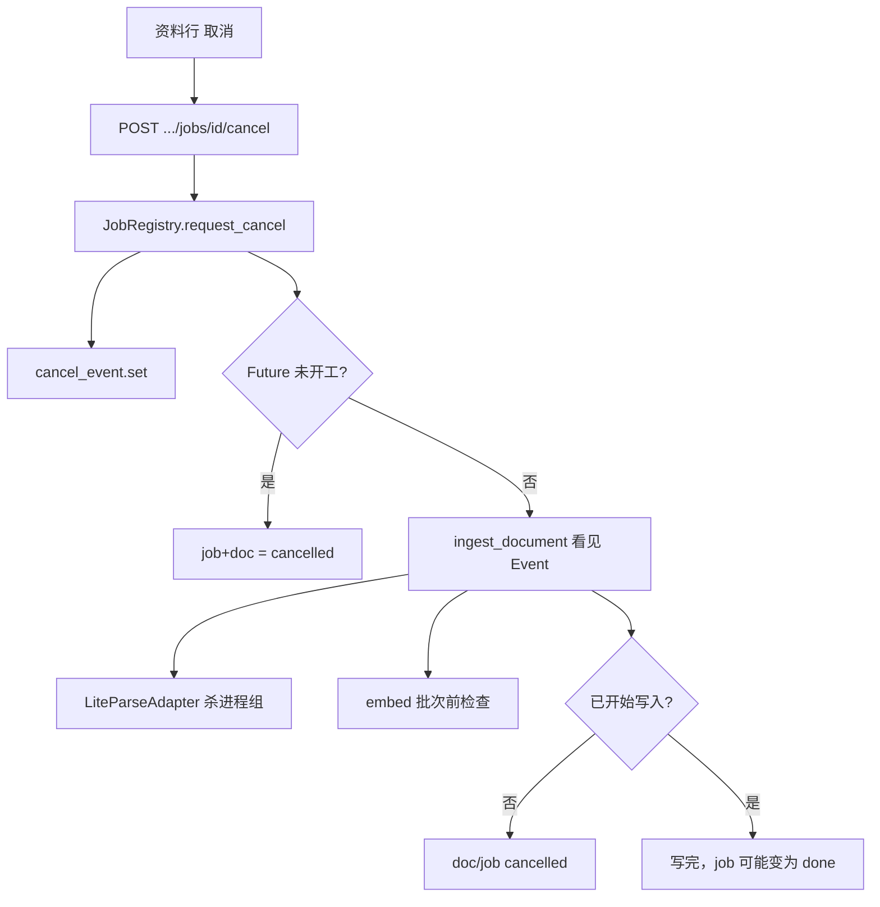

# LiteParse 超时杀进程 + 知识库入库可取消

Planned-with: Cursor Grok 4.6
Suggested-Impl-Model: Composer 2.5
Plan-Id: 2026-09-11-liteparse-timeout-kill-kb-ingest-cancel

> **For implementer:** 只改本文件列出的符号与测试。禁止改 `agenticx/studio/server.py`（含顶部 import 区与 `register_*` 调用行）。禁止改 `PipelineAdapter` / MinerU / 对话 `messages.json` / 消息瘦身。禁止引入 Celery、Redis、新进程编排框架。不要 commit，除非用户明确要求。

**Goal:** 解析子进程在超时或取消时被真正杀掉；知识库入库任务可从 API 与资料列表取消，且取消能打断正在跑的 LiteParse。

**Architecture:** 在 `LiteParseAdapter._run_liteparse_parse` 里对子进程做 terminate/kill（POSIX 尽量杀进程组，避免转换器子进程残留）。`JobRegistry` 为每个 job 持有 `threading.Event` + `Future`；取消时先 `event.set()`，未开工的 `Future.cancel()`，已开工的把 Event 传到 `ingest_document` → `read_document_text*` → adapter。Desktop 资料行在运行中露出「取消」按钮。

**Tech Stack:** 现有 asyncio subprocess、`ThreadPoolExecutor`、FastAPI `register_kb_routes` / `register_brain_routes`、Desktop `KnowledgeMaterialsPanel`、pytest。

---

## 推荐实施模型

| 子任务 | 推荐模型 | 理由 |
|---|---|---|
| FR-1 LiteParse 杀进程 + adapter 单测 | Composer 2.5 | 局部 asyncio / mock 子进程，样板级 |
| FR-2 JobRegistry + ingest 取消令牌 | Composer 2.5 | 线程 Event 跨 sync/async，路径已写死 |
| FR-3 两条 cancel 路由 + Desktop 按钮 | Composer 2.5 | CRUD / i18n / 轮询终态，无视觉重塑 |

最终 `Impl-Model` 以实际使用为准。本 plan 按 Composer 2.5 可独立落地书写。

---

## In scope

- LiteParse CLI 子进程：超时、`asyncio.CancelledError`、可选 `threading.Event` 三种路径都必须杀进程（POSIX 尽量杀进程组）
- KB 入库 job：`cancelled` 状态、`request_cancel`、解析/切片/向量化批次边界可中断
- `POST /api/kb/jobs/{job_id}/cancel`
- `POST /api/brains/{brain_id}/jobs/{job_id}/cancel`（资料面板实际走 Brain API）
- Desktop 资料列表运行中「取消」按钮 + 中英文案

## Out of scope

- 改 `agenticx/studio/server.py` 任何一行
- `agenticx/tools/adapters/pipeline.py`、进程内 MinerU、新的解析隔离 worker
- Celery / Redis / 全局 timeout 偏序配置
- 对话历史 slim-result、聊天侧「取消当前 liteparse 工具」专用 UI（聊天只享受超时杀进程）
- 改 `unified_document.py`、`_tool_liteparse` 函数体（签名兼容即可）
- 写入阶段已经开始 `delete_by_document` / `upsert` 之后的回滚
- Enterprise portal / admin-console
- 新增 `cancelled_doc_count` 统计卡片

---

## 根因与证据

超时只等、不杀：

```99:99:agenticx/tools/adapters/liteparse.py
        stdout, stderr = await asyncio.wait_for(process.communicate(), timeout=self.timeout)
```

`asyncio.wait_for` 到期后子进程继续活着。聊天工具 `_tool_liteparse`（`agenticx/cli/agent_tools.py` 约 L8807）与 KB 共享这条路径。

KB 入库不可取消：

- `JobRegistry`（`agenticx/studio/kb/jobs.py` L69–177）只有 `submit_ingest` / `_run`，无线程 Event、无 `Future` 句柄、无 cancel API
- `IngestJobStatus` / `KBDocumentStatus`（`contracts.py` L259–295）只有 queued → … → done/failed
- 路由只有 `GET /api/kb/jobs` 与 `GET /api/kb/jobs/{job_id}`（`kb/routes.py` L279–300）
- Brain 镜像只有 list/get（`agenticx/brain/routes.py` L224–236）
- Desktop `KnowledgeMaterialsPanel.tsx` L61–67 注释已写明：关上面板 job 仍在跑；行操作只有重建 / 删除，删除在 `Boolean(job)` 时禁用（L390–394）

KB 解析实际走共享抽取，不是 `runtime._read_with_liteparse` 主路径：

```1256:1261:agenticx/studio/kb/runtime.py
def _read_document_text(source_path: str) -> str:
    from agenticx.tools.document_text import DocumentTextError, read_document_text_sync
    try:
        return read_document_text_sync(Path(source_path).expanduser())
```

`read_document_text_sync`（`document_text.py` L206–219）在 worker 线程里 `asyncio.run(...)`。取消令牌必须是 **`threading.Event`**，不能假设外层有可取消的 asyncio Task。

资料面板生产入口是 Brain，不是 `/api/kb/documents`：

- `BrainsSettings.tsx` L109–116：`createKbApi(..., "brain")`，base = `{studio}/api/brains/{id}`
- `api.ts` L78：brain 模式路径为 `/jobs/...`，即 `POST /api/brains/{id}/jobs/{job_id}/cancel`
- 全局 `/api/kb/jobs/{id}/cancel` 仍要做：现有 `tests/test_kb_routes.py` 与 `KbGlobalChatRetrievalPanel` 的 legacy 前缀都挂在 `/api/kb`

调研动机（机制，不抄代码）见本地笔记 `research/codedeepresearch/ThinkParse/ThinkParse_source_notes.md` §11：可杀隔离进程、协作取消。本仓只落地「杀 LiteParse 子进程 + 入库 Event」。



---

## 现状锚点

| 符号 | 路径 | 约行 | 改法 |
|---|---|---|---|
| `_run_liteparse_parse` | `agenticx/tools/adapters/liteparse.py` | L86–108 | 杀进程 + Event 竞态 |
| `parse` / `parse_to_text` | 同文件 | L110 / L180 | 只加可选 `cancel_event=` |
| `_read_with_liteparse` | `agenticx/tools/document_text.py` | L118 | 把 Event 传给 adapter |
| `read_document_text` / `_sync` | 同文件 | L168 / L206 | 可选 `cancel_event` |
| `KBError` | `agenticx/studio/kb/contracts.py` | L19 | 其下新增 `KBCancelled` |
| `KBDocumentStatus` / `IngestJobStatus` | 同文件 | L259 / L288 | 各加 `CANCELLED = "cancelled"` |
| `IngestReport` | 同文件 | L298 | 加 `cancelled: int = 0` |
| `ingest_document` | `agenticx/studio/kb/runtime.py` | L808 | 收 Event；阶段边界检查 |
| `_read_document_text` | 同文件 | L1256 | 把 Event 传下去；`cancelled` → `KBCancelled` |
| `_embed_texts_with_progress` | 同文件 | L1397 | 每批 embedding **之前**检查 Event |
| `JobRegistry` | `agenticx/studio/kb/jobs.py` | L69 | Event + Future + `request_cancel` |
| KB cancel 路由 | `agenticx/studio/kb/routes.py` | L294 后 | 只插入新函数 |
| Brain cancel 路由 | `agenticx/brain/routes.py` | L230 后 | 只插入新函数 |
| Desktop types / api / panel / i18n | 见 FR-3 | — | 终态含 cancelled |

`runtime._read_with_liteparse`（L1224）是测试兼容包装。若实现时也给它加 `cancel_event=None` 并原样下传，可以；**不要**改它现有错误文案。主路径仍是 `_read_document_text`。

---

## FR / AC

### FR-1 LiteParse 超时与取消必须杀掉子进程

**改动意图（before）**

`create_subprocess_exec` 之后只 `wait_for(communicate)`。超时抛错时进程仍在；任务被取消时同样不杀。

**改动意图（after）**

1. POSIX：`create_subprocess_exec(..., start_new_session=True)`，使 `process.pid` 成为进程组 leader。Windows：不要传 `start_new_session`，`kill()` 尽力而为。
2. 新增 `async def _kill_liteparse_process(process) -> None`（同文件，紧挨 `_run_liteparse_parse`）：
   - `returncode is not None` 则返回
   - POSIX：`os.killpg(process.pid, signal.SIGKILL)`；`ProcessLookupError` / `OSError` 时回退 `process.kill()`
   - Windows：`process.kill()`
   - 再 `await asyncio.wait_for(process.wait(), timeout=2.0)`，超时忽略
3. 新增 `class LiteParseCancelled(RuntimeError)`（同文件，class `LiteParseAdapter` 之前）
4. `_run_liteparse_parse(self, file_path, *, cancel_event: Optional[threading.Event] = None)`：
   - `communicate` 与「Event 被 set」竞态：`asyncio.wait({comm_task, cancel_wait}, timeout=self.timeout, return_when=FIRST_COMPLETED)`，其中 `cancel_wait = asyncio.create_task(asyncio.to_thread(cancel_event.wait, self.timeout))`（无 Event 则只等 `comm_task`）
   - Event 已 set → `_kill_liteparse_process` → `raise LiteParseCancelled("liteparse cancelled")`
   - 总超时或 `comm_task` 未完成 → `_kill_liteparse_process` → `raise TimeoutError(f"liteparse timed out after {self.timeout:.0f}s")`（不要只抛 `asyncio.TimeoutError` 却留进程）
   - 外层 `except asyncio.CancelledError:`：先杀进程再 `raise`
   - `finally` 里取消未完成的 watcher task，避免悬挂 `to_thread`
5. `parse` / `parse_to_text` 增加关键字参数 `cancel_event: Optional[threading.Event] = None`，原样传给 `_run_liteparse_parse`。禁止改其它 parse 行为。

聊天 `_tool_liteparse` **不改**。超时会走新的 `TimeoutError` + 杀进程；`except Exception` 已能返回 `ERROR: liteparse parsing failed: ...`。

**AC-1** 文件：`tests/tools/test_liteparse_adapter.py`（追加，不改既有三条语义）

1. `test_run_liteparse_timeout_kills_process`：monkeypatch `_find_cli` 为 `[sys.executable, str(hang.py)]`，`hang.py` 内容 `import time; time.sleep(120)`。`LiteParseAdapter(timeout=0.4)` 调 `_run_liteparse_parse`。断言抛 `TimeoutError`，消息含 `timed out`。用 `FakeProcess` 或包装 `kill`/`killpg` **断言杀进程被调用**（不要用 `pgrep`，会飘）。
2. `test_run_liteparse_cancel_event_kills_process`：同上 hang 脚本，`timeout=30`，另起 task 在 0.2s 后 `event.set()`。断言抛 `LiteParseCancelled`，且杀进程被调用。
3. `test_run_liteparse_cancelled_error_kills_process`：`communicate()` 挂起的 FakeProcess；对 `_run_liteparse_parse` 建 task，`await asyncio.sleep(0.05)` 后 `task.cancel()`。断言 `CancelledError` 冒出，且 `FakeProcess.kill`（或 helper）被调用。
4. 成功路径不被误杀：可复用现有 `test_parse_maps_to_parsed_artifacts`（仍 mock `_run_liteparse_parse`）。另写一条：FakeProcess 立刻 `communicate` 返回合法 JSON `{"text":"ok"}`，断言 `kill` **未**调用。

跑：`pytest tests/tools/test_liteparse_adapter.py -v`  
期望：全绿。

---

### FR-2 入库 job 可取消，且能打断 LiteParse

**合约（`contracts.py`）**

在 `KBError` 后：

```python
class KBCancelled(KBError):
    """Ingest aborted by user cancel. Not a parse/embed failure."""
```

两个 Enum 都加：

```python
CANCELLED = "cancelled"
```

`IngestReport` 加字段（默认 0，`asdict` 自动进 `job.to_dict()`）：

```python
cancelled: int = 0
```

**`jobs.py`**

- `_STATUS_MAP` 加 `KBDocumentStatus.CANCELLED: IngestJobStatus.CANCELLED`
- `_PROGRESS_WEIGHTS` 加 `IngestJobStatus.CANCELLED: 1.0`
- `_weighted_progress` 把 `CANCELLED` 与 `DONE`/`FAILED` 一样视为终态（不再用 stage_progress 插值）
- `JobRegistry.__init__` 增加：
  - `self._cancel_events: Dict[str, threading.Event] = {}`
  - `self._futures: Dict[str, Future] = {}`（`from concurrent.futures import Future, ThreadPoolExecutor`）
- `submit_ingest`：创建 `event = threading.Event()`，锁内写入 `_cancel_events[job.id]`；`fut = self._executor.submit(self._run, runtime, job, on_done, event)`；`self._futures[job.id] = fut`。禁止再写丢弃返回值的 `submit(...)`。
- `_run(self, runtime, job, on_done, cancel_event)`：`ingest_document(..., cancel_event=cancel_event)`。终态判定改成：

```python
if report.cancelled:
    terminal = IngestJobStatus.CANCELLED
elif report.failed == 0:
    terminal = IngestJobStatus.DONE
else:
    terminal = IngestJobStatus.FAILED
message = (
    "cancelled" if terminal == IngestJobStatus.CANCELLED
    else ("ok" if terminal == IngestJobStatus.DONE else "; ".join(report.reasons) or "failed")
)
```

- 新增 `request_cancel(self, job_id: str, runtime: KBRuntime) -> tuple[IngestJob, bool]`：
  1. job 不存在 → `KeyError`
  2. 状态已是 `DONE` / `FAILED` / `CANCELLED` → `(job, True)`，不改写
  3. `event.set()`（没有则先建再 set）
  4. `fut = self._futures.get(job_id)`；`started = not (fut is not None and fut.cancel())`
  5. 若 `fut.cancel()` 成功（从未执行 `_run`）：把 job 标 `CANCELLED`、`progress=1.0`、`finished_at=utc iso`、`message="已取消"`、`report.cancelled=1`；若 `job.document_id` 有值，调用下面的 `runtime.mark_document_cancelled`
  6. 返回 `(最新 job, False)`

**`runtime.py`**

1. 新增 `mark_document_cancelled(self, doc_id: str, message: str = "已取消") -> None`：读 registry，`replace(doc, status=CANCELLED, error=message)` 后 `upsert`。doc 不存在则 no-op。
2. `ingest_document(self, doc_id, *, progress_cb=None, cancel_event=None)`：
   - 文件顶部辅助：

```python
def _raise_if_cancelled(cancel_event) -> None:
    if cancel_event is not None and cancel_event.is_set():
        raise KBCancelled("已取消")
```

   - **第一行有效逻辑**（cache hit 之前）调用 `_raise_if_cancelled`
   - `_report(PARSING)` 之后、`_read_document_text` 之前再检查一次
   - `_read_document_text(doc.source_path, cancel_event=cancel_event)`
   - CHUNKING / EMBEDDING / WRITING 每个 `_report` **之前**再检查
   - WRITING：检查通过后才允许 `delete_by_document`。一旦过了这道门，本轮写完，不要中途 abort（避免半写索引）
   - `except KBCancelled as exc:` 必须写在现有 `except Exception` **前面**：
     - `logger.info("ingest cancelled for %s", doc_id)`（不要 `logger.exception`）
     - upsert `CANCELLED` + `error=str(exc) or "已取消"`
     - `report.cancelled = 1`；`report.failed` 保持 0
     - `_report(CANCELLED, "已取消")`
     - `return report`
3. `_read_document_text(source_path, cancel_event=None)`：传给 `read_document_text_sync(..., cancel_event=cancel_event)`。`DocumentTextError.code == "cancelled"` → `raise KBCancelled("已取消") from exc`。其它错误文案一字不改。
4. `_embed_texts_with_progress(..., cancel_event=None)`：`for` 每一批、调用 `_embed_texts` **之前** `_raise_if_cancelled(cancel_event)`。`ingest_document` 调用处补上 `cancel_event=cancel_event`。

**`document_text.py`**

- `_read_with_liteparse(..., cancel_event=None)`：`await adapter.parse_to_text(path, cancel_event=cancel_event)`
- 捕获 `LiteParseCancelled` → `DocumentTextError("cancelled", "解析已取消")`
- `read_document_text` / `read_document_text_sync` 增加可选 `cancel_event`，只往下传
- 两处 `_read_with_liteparse(...)` 调用带上 `cancel_event=cancel_event`

既有 stub 必须能接新关键字，否则会 TypeError：

- `tests/test_kb_runtime.py` L722 `_fake_liteparse`：改成 `async def _fake_liteparse(path, *, require_libreoffice: bool = False, cancel_event=None)`
- `tests/tools/test_document_text.py`、`tests/tools/test_unified_document_liteparse_fallback.py` 里的 `parse_to_text(self, file_path)` **可以不改**（实现用默认值）；若测试里 patch 的是 `_read_with_liteparse` 且生产会传 `cancel_event`，同样补 `cancel_event=None`

**AC-2** 文件：`tests/test_kb_runtime.py`

1. `test_job_registry_cancel_before_start`：`JobRegistry(max_workers=1)`。先提交一个会 `time.sleep(2)` 的假 ingest（monkeypatch `KBRuntime.ingest_document` 为 sleep+返回空成功 report），再立刻再 `submit_ingest` 第二条。在第二条仍为 `QUEUED` 时 `request_cancel`。断言：返回 `already_terminal is False`；第二条 job 状态 `cancelled`；被 patch 的 `ingest_document` **没有**以该 `document_id` 被调用（或调用次数 = 1，只来自第一条）。用 `max_workers=1` 保证第二条卡在队列。
2. `test_ingest_document_honors_cancel_during_parse`：monkeypatch `runtime._read_document_text`（或 `document_text.read_document_text_sync`）为：等 `cancel_event.wait(timeout=5)` 后 `raise KBCancelled("已取消")` 的慢函数；另一线程 0.1s 后 `event.set()`。`ingest_document(..., cancel_event=event)`。断言 `report.cancelled == 1`、`report.failed == 0`、文档状态 `cancelled`、error 含「已取消」。
3. `test_ingest_document_honors_cancel_between_embed_batches`：构造足够多 chunk 的 md；monkeypatch `_embed_texts`（`runtime` 模块内）为每批 `time.sleep(0.3)`。开始 ingest 后立刻 `event.set()`。断言在写向量库之前退出，`report.cancelled == 1`，文档不是 `done`。
4. `test_request_cancel_on_finished_job_is_noop`：现有 `test_job_registry_runs_ingest` 跑完后对同一 job `request_cancel`，断言 `already_terminal is True` 且状态仍为 `done`。

跑：`pytest tests/test_kb_runtime.py -k "job_registry or ingest_document_honors or request_cancel" -v`

---

### FR-3 路由 + Desktop 取消按钮

**KB 路由** — 在 `get_kb_job`（`kb/routes.py` 约 L294）**之后**精确插入，禁止整段替换相邻 handler：

```python
@app.post("/api/kb/jobs/{job_id}/cancel")
async def cancel_kb_job(job_id: str) -> Dict[str, Any]:
    manager = KBManager.instance()
    if manager.jobs.get(job_id) is None:
        raise HTTPException(status_code=404, detail=f"job {job_id} not found")
    try:
        job, already_terminal = manager.jobs.request_cancel(job_id, manager.runtime)
    except KeyError:
        raise HTTPException(status_code=404, detail=f"job {job_id} not found") from None
    if already_terminal:
        raise HTTPException(status_code=409, detail="job already finished")
    return {"ok": True, "job": job.to_dict()}
```

**Brain 路由** — 在 `get_brain_job`（`brain/routes.py` 约 L230）之后同样插入：

```python
@app.post("/api/brains/{brain_id}/jobs/{job_id}/cancel")
async def cancel_brain_job(brain_id: str, job_id: str) -> Dict[str, Any]:
    rt = _require_docs_brain(brain_id)
    if rt.jobs.get(job_id) is None:
        raise HTTPException(status_code=404, detail=f"job {job_id} not found")
    try:
        job, already_terminal = rt.jobs.request_cancel(job_id, rt.runtime)
    except KeyError:
        raise HTTPException(status_code=404, detail=f"job {job_id} not found") from None
    if already_terminal:
        raise HTTPException(status_code=409, detail="job already finished")
    return {"ok": True, "job": job.to_dict()}
```

禁止改 Brain 的 wiki `on_done`、materials CRUD、search。

**Desktop**

1. `desktop/src/components/settings/knowledge/types.ts` L5–12：`KBDocumentStatus` 联合类型加 `"cancelled"`。`IngestJob.report` 可加可选 `cancelled?: number`（不强制）。
2. `api.ts`：`KBApi` 加 `cancelJob: (id: string) => Promise<IngestJob>`；实现 `POST p(`/jobs/${id}/cancel`)`，解析 `{ job }`。409 时把 `Error.message` 留成 `409 ...`，面板捕获后 `reload()`。
3. `KnowledgeMaterialsPanel.tsx`：
   - 所有「终态」判断从 `done || failed` 改为 `done || failed || cancelled`（至少 L79、L137、`isRunning` L331）
   - 运行中行操作区、重建按钮左侧加取消按钮：`disabled={!enabled || cancellingId === doc.id}`；`title={st("knowledge.cancelTitle")}`；图标用 `lucide-react` 的 `X`（已有 `RefreshCw`/`Trash2` 同级，不要新依赖）
   - `async function cancelIngest(docId: string)`：读 `activeJobs[docId].jobId`，`await api.cancelJob(jobId)`；乐观把该行 status 设为 `cancelled` 并从 `activeJobs` 删掉；失败则 `setError(...)` 并 `reload()`
   - 取消进行中不要用 `window.confirm`
4. i18n（`desktop/locales/zh/settings.json` 与 `en/settings.json` 的 `knowledge` 对象，紧挨 `stFailed`）：

| key | zh | en |
|---|---|---|
| `cancelTitle` | 取消入库 | Cancel ingest |
| `stCancelled` | 已取消 | Cancelled |

5. `statusLabel` 的 `Record` 加 `cancelled: st("knowledge.stCancelled")`。`statusTagClass`：`cancelled` 用与 `failed` 不同的中性色（`bg-zinc-500/15 text-zinc-700 dark:text-zinc-300`），不要红。

**AC-3** 文件：`tests/test_kb_routes.py`

追加（沿用现有 `client` fixture 与 `_wait_for_job`）：

1. `test_cancel_unknown_job_404`：`POST /api/kb/jobs/job_does_not_exist/cancel` → 404
2. `test_cancel_finished_job_409`：上传一个很小的 `.md`，等到 job `done`，再 POST cancel → 409，body detail 含 `already finished`
3. `test_cancel_queued_or_running_job_200`：monkeypatch `KBRuntime.ingest_document` 为「`cancel_event.wait(timeout=5)` 后 `raise KBCancelled` 并返回 `IngestReport(cancelled=1)`」或直接让 registry 的第二条排队（同 AC-2-1）。POST cancel → 200，`job.status == "cancelled"`。随后 `GET /api/kb/jobs/{id}` 仍是 `cancelled`。

Brain 路由无现成 TestClient 夹具。**不要**新搭 Brain 测试栈。用阅读核对：handler 与 KB 版只差 `_require_docs_brain` + `rt.jobs` / `rt.runtime`。

Desktop 无现成 panel 单测则不做 vitest；用类型收口：`statusLabel` 的 `Record<KBDocumentStatus, string>` 在漏 `cancelled` 时会 typecheck 失败。

跑：`pytest tests/test_kb_routes.py -k cancel -v`

---

## 阶段检查点（写入中取消）

| 阶段 | 取消行为 |
|---|---|
| QUEUED，worker 未接单 | `Future.cancel()`，job+doc → `cancelled`，不跑 parse |
| PARSING（LiteParse 进行中） | Event set → adapter 杀进程组 → `LiteParseCancelled` → `KBCancelled` |
| CHUNKING 前 | Event → `KBCancelled`，不 embed |
| EMBEDDING 批次之间 | 下一批开始前 `KBCancelled`；当前已发出的 embed HTTP 等返回（不强制掐 HTTP） |
| WRITING 已过门禁 | 写完；job 可能是 `done`。UI 已点取消则 200 之后轮询到 `done` 也算终态，不要报错 |

---

## 禁止事项（no-scope-creep）

- 禁止「顺手」给 `PipelineAdapter` 做进程隔离
- 禁止改 `server.py` 去「帮忙注册」新路由（`register_kb_routes` / `register_brain_routes` 已在启动时调用）
- 禁止把 job 结果塞进 Redis / 改 `messages.json`
- 禁止把取消做成删除文档；取消后资料行仍在，可再点重建
- 禁止改删除按钮文案语义（删除仍是真删）
- 禁止在 plan 实施时把第三方解析产品名写进 commit / PR

---

## 自测命令（实施者必须跑）

```bash
pytest tests/tools/test_liteparse_adapter.py tests/test_kb_runtime.py tests/test_kb_routes.py tests/tools/test_document_text.py -q
```

期望：全绿。  
若改了 `document_text.py` 签名，再补跑：`pytest tests/tools/test_unified_document_liteparse_fallback.py -q`

不要为了本 plan 启动 `agx serve` 去改 `server.py`。未改 `server.py` 则不做该文件的冷启动强制验收。

---

## 实施顺序（TDD）

1. 先写 FR-1 失败测试 → 改 `liteparse.py` → 测试绿
2. 先写 FR-2 失败测试 → 改 contracts / jobs / runtime / document_text → 测试绿
3. 先写 FR-3 路由测试 → 改两条 routes → 测试绿 → 再改 Desktop types/api/panel/i18n
4. 跑上面整组 pytest

每步只改该步列出的文件。
