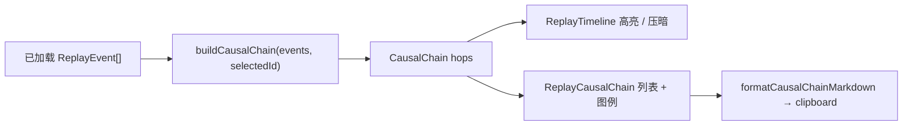

# 执行回放因果链：只读投影 UX

Planned-with: cursor-grok-4.6

Suggested-Impl-Model: composer-2.5

Status: pending

Plan-Id: 2026-09-11-replay-causal-chain-ux

Parent-Plan: `.cursor/plans/pending/2026-09-10-long-run-replay-branching-master.plan.md`

Depends-On: 已落地的 Desktop 回放工作台（`desktop/src/components/replay/`，对应 `2026-09-10-long-run-replay-02-desktop-replay`）

## Goal

在现有只读执行回放里，选中某一步时回答「这一步是怎么来的」：用账本已有字段走出 **已记录** 前因，用本地规则补 **推断** 前因；时间线高亮这条链、压暗其余步骤；详情区展示可复制的因果链。打开、高亮、复制都不得调用模型或工具，也不得改写运行账本。

用户能感知的收益：选中失败、本地写入、外部写入或产物后，立刻看到「模型输出 → 工具调用 → 工具结果 → 后果」这一条链，并分清哪些边是账本字段、哪些只是本次打开时的推算。

## Product contract

- 因果链是 **前端只读投影**。推断边只存在于内存与复制出的 Markdown，禁止 POST/PUT、禁止写 `events.jsonl`、禁止改 `run.json`。
- **已记录** 边只允许来自账本字段：`parent_event_id`，或双方都带同一 `tool_call_id` 且一方是 `tool_call`、另一方是 `tool_result` / `tool_progress` / `subagent_*`。
- **推断** 边必须在 UI 和复制文本里用「推断」标明，并附固定说明：「虚线是本次打开时推算的，不会写回运行记录」。
- 每一步只取 **一条** 最强前驱（单链，不做 DAG 展开）。优先级见 Frozen algorithm。
- 计算链只用列表事件已有的 `title` / `summary` / `payload` 摘要字段，**禁止**为算链去拉 `includePayload` 或完整 blob。
- 回放仍是只读投影；因果链不改变分叉、播放、筛选、live overlay 的现有语义。

## Why current UI is insufficient

`ReplayTimeline` 按 `seq` 列出步骤，`ReplayEventDetail` 只展示当前事件的副作用与 payload。`parentEventId` 与 `toolCallId` 已在 `ReplayEvent` 上，但没有任何前向/后向投影，用户无法从「#12 失败」一眼看到是哪一次工具调用导致的。

`projectReplay`（`desktop/src/components/replay/replay-projection.ts`）只做 lane/span/filter，没有因果 hop。不要把因果链塞进 `projectReplay` 的返回值，以免污染现有测试与播放投影。

## In scope

- 纯函数 `buildCausalChain` / `formatCausalChainMarkdown` / 路径抽取。
- 选中事件后的时间线高亮 / 压暗。
- 详情区因果链列表、图例、复制这条链。
- 中英文案。
- 单测 + 现有 DOM 测试补一条。

## Out of scope

- 任何 `agenticx/runtime/replay_ledger/**`、`agenticx/studio/run_replay_routes.py`、新 HTTP 字段。
- 把推断边写回账本或新增 event type。
- SVG / PNG / GIF 导出、独立 HTML 分享页。
- 「只看这条链」过滤（压暗即可）。
- 钉住目标事件的独立 chain 状态机（链 = `f(selectedEvent)`）。
- 自动挑选失败主语、多模型对比、评测重跑。
- 修改 `ChatPane`、分叉弹层、`replay-store`、Graph live overlay。
- Enterprise UI。

## no-scope-creep

每个改动必须能追溯到下面某一条 FR。不要顺手重排 `ReplayControls`、不要改播放速度、不要「顺便」给时间线换甘特布局、不要改 ledger 合同「补 parent」。确认配对没有 `parentEventId` 时必须标推断，禁止把派生配对升格为已记录。

## Chosen architecture



拒绝：

- 后端新增 `/api/runs/{id}/graph`：本期用已有字段足够，且推断边不该变成 API 合同。
- 把 hop 写入 `projectReplay`：播放投影与因果投影职责不同。
- 为补路径去拉完整 payload：会在点选时触发隐藏网络请求，违背「打开回放不执行」。

## Frozen types

新增 `desktop/src/components/replay/replay-causal-chain.ts`（不要放进 `replay-types.ts`，避免 normalize 合同膨胀）：

```typescript
export type CausalEdgeKind = "recorded" | "inferred";

export type CausalHopReason =
  | "parent_event"
  | "tool_call_id"
  | "wait_pair"
  | "path_in_tool_input"
  | "failed_result_to_error";

export type CausalHop = {
  fromEventId: string;
  toEventId: string;
  kind: CausalEdgeKind;
  reason: CausalHopReason;
};

export type CausalChain = {
  targetEventId: string;
  eventIds: string[]; // 时间正序：最早前因 → 目标
  hops: CausalHop[];  // 与 eventIds 相邻对一一对应，length === eventIds.length - 1
  inferredCount: number;
};
```

`eventIds` 至少包含 target（找不到前因时 `hops=[]`、`inferredCount=0`）。找不到 target 时返回：

```typescript
{
  targetEventId,
  eventIds: [],
  hops: [],
  inferredCount: 0,
}
```

## Frozen algorithm

`buildCausalChain(events, targetEventId)`：

1. 用 `seq` 升序、`eventId` 平局的副本工作，**不得 mutate 入参**。
2. 建 `byId: Map<eventId, ReplayEvent>`。target 不存在则返回空链。
3. 从 target 向前走，`visited` 防环，最多 `MAX_HOPS = 24`。
4. 每一步只选一条前驱，按以下顺序，命中即停：

| 优先级 | 条件 | kind | reason |
|---|---|---|---|
| 1 | `current.parentEventId` 能在 `byId` 里解析到，且该事件 `seq < current.seq` | recorded | `parent_event` |
| 2 | `current.type` ∈ `{tool_result, tool_progress}` ∪ 以 `subagent_` 开头，且 `current.toolCallId` 非空；存在更早的 `type === "tool_call"` 且 `toolCallId` 相同。若多条，取 `seq` 最大的那条仍 `< current.seq` 的 | recorded | `tool_call_id` |
| 3 | `current.type` ∈ `{error, stall, subagent_error}`；存在更早的失败 `tool_result`（`payload.status` 为 `failed`/`error`，或 title/summary 匹配 `/\b(error\|failed\|失败)\b/i`，与 `replay-projection.ts` 的 `failedToolResult` **同一规则**）。取最近一条 | inferred | `failed_result_to_error` |
| 4 | 从 current 抽出路径集合 `P`；在 `seq < current.seq` 的 `tool_call` / `tool_result` / `artifact` 中，从近到远找第一条与 `P` 有交集的事件 | inferred | `path_in_tool_input` |
| 5 | `current.type` ∈ `{confirm_response, clarification_response}`；同 `agentId` 下最近的对应 `confirm_required` / `clarification_required` 且 `seq < current.seq` | inferred | `wait_pair` |

5. 将 `(predecessor → current)` unshift 到 hops，predecessor 设为下一轮 current。
6. 结束后 `eventIds` 按时间正序：`[...ancestors, target]`。
7. `inferredCount = hops.filter(h => h.kind === "inferred").length`。

### 路径抽取（写死，禁止「按需推断」）

`extractReplayPaths(event: ReplayEvent): string[]`：

先收集候选字符串：

- `event.title`、`event.summary`
- `event.payload` 若存在，读取这些 key 的字符串值：`path`、`file`、`filename`、`artifact_path`、`output_path`、`target`、`arguments_summary`、`preview`
- 不要递归整个 payload，不要读 `result` 大字段

再用两个全局正则（`g`）扫描每个候选：

```typescript
const QUOTED_PATH = /['"`]((?:[A-Za-z]:)?(?:\/|\\)?[\w./\\-]+\.[A-Za-z0-9]{1,8})['"`]/g;
const BARE_PATH = /(?:^|[\s=:{[,])((?:[A-Za-z]:)?(?:\/|\\)?(?:[\w.-]+\/)+[\w.-]+\.[A-Za-z0-9]{1,8})/g;
```

规范化：`\` → `/`，去掉前缀 `./`，trim。去重后返回。两个事件「路径相交」：规范化后全等，或一方以 `/` + 另一方为后缀（允许 `src/auth.ts` 命中 `/abs/src/auth.ts`）。

单段文件名（如裸 `auth.ts`）**不**作为 BARE_PATH，避免误伤普通英文。

## UX

### 时间线

锚点：`desktop/src/components/replay/ReplayTimeline.tsx` 行按钮，约 L176–188。

新增可选 props，缺省时视觉与现在完全一致：

```typescript
chainEventIds?: ReadonlySet<string>;
inferredToEventIds?: ReadonlySet<string>;
```

`RunReplayPanel` 在选出 `selectedChain` 且 `eventIds.length > 0` 时传入；未选中事件时不传（不要传空 Set，空 Set 也会被当成「有链」而把全部行压暗）。

行容器已有 `grid ... px-3 py-2`。给 button 加 `relative`。左侧用绝对定位竖条，避免未高亮行因为 `border-l-2` 发生位移：

```tsx
{inChain ? (
  <span
    aria-hidden
    className={`absolute inset-y-0 left-0 w-0.5 ${
      inferredTo
        ? "border-l-2 border-dashed border-status-warning"
        : "bg-text-strong"
    }`}
  />
) : null}
```

- `inChain = chainEventIds?.has(event.eventId) === true`
- `inferredTo = inferredToEventIds?.has(event.eventId) === true`（该事件是某条推断 hop 的 `to`）
- 链的根节点没有入边，用实心条
- `dimmed = Boolean(chainEventIds && chainEventIds.size > 0 && !inChain)` → 额外 `opacity-40`
- 选中态仍用现有 `bg-surface-card-strong`，不要加粗白边框

`inferredToEventIds` 计算：

```typescript
new Set(
  chain.hops
    .filter((hop) => hop.kind === "inferred")
    .map((hop) => hop.toEventId),
)
```

### 详情区

锚点：`ReplayEventDetail.tsx` 副作用块之后、payload `<details>` 之前（约 L102 与 L103 之间）。

新建 `desktop/src/components/replay/ReplayCausalChain.tsx`，由 `ReplayEventDetail` 渲染，避免把列表 JSX 堆进详情文件。

`ReplayEventDetail` 新增可选 prop：

```typescript
chain?: CausalChain | null;
chainEvents?: ReplayEvent[];
onCopyChain?: (markdown: string) => Promise<void>;
onSelectChainEvent?: (eventId: string) => void;
copyChainFeedback?: string | null;
```

未传 `chain` 或 `chain.eventIds.length === 0`：不渲染整块（保持现有空态「选择一个步骤」）。

选中但 `hops.length === 0`：仍渲染标题 + 一句 `replay.chainEmpty`（「没有可追溯的前因」），不显示复制按钮。

有 hops 时布局（字号/间距对齐现有详情，不要新开卡片重阴影）：

```text
因果链
4 步 · 1 处推断

#3  助手输出完成
    │  已记录 · 工具调用配对
#4  bash_exec
    ┆  推断 · 路径出现在工具参数
#6  产物

[复制这条链]

实线来自账本字段；虚线是本次打开时推算的，不会写回运行记录。
```

- 步骤按 `eventIds` 正序（原因在上，目标在下）。目标行 `font-medium text-text-strong`，其余 `text-text-muted`。
- 已记录连接用 `│` 的观感即可用左边 `border-l` 实线；推断用 `border-dashed border-status-warning`。不要用 ASCII 树画整张时间线。
- 每条 hop 文案：`t("replay.chainKind." + kind)` + `t("replay.chainReason." + reason)`。
- 「复制这条链」是次按钮：`bg-surface-hover`，不要用 `--ui-btn-primary-*`（主按钮仍是「从此前分叉」）。
- 点击链上某步：`onSelectChainEvent(eventId)` → `useReplayStore.getState().selectEvent(paneId, eventId)`，并 `seek(paneId, that.seq)` 保证该步在 cursor 内可见。链会随新选中事件重算（接受前缀链变短）。
- 图例 **仅当** `inferredCount > 0` 时出现。

### 复制文本

`formatCausalChainMarkdown(chain, events, labels)` 纯函数，不调 API、不调模型。

```markdown
## 因果链

目标：#12 `error` 工具失败
步数：4 · 推断：1

1. #3 `assistant_output_completed` — 助手输出完成
2. #4 `tool_call` bash_exec — 已记录 · 工具调用配对
3. #8 `tool_result` bash_exec — 已记录 · 父事件
4. #12 `error` — 推断 · 失败结果之后的错误

说明：标注为「推断」的边来自本次打开时的规则推算，不是运行账本里的字段，不会写回记录。
```

`labels` 由调用方传入已翻译字符串，函数本身不碰 i18n，便于单测。

复制失败时用详情区内联反馈，不要只打到顶栏。可复用 `RunReplayPanel` 的 `copyFeedback` 状态，或在 `ReplayCausalChain` 内用 1.6s 本地 state；不要新增 toast 系统。

### 控制条

**不改** `ReplayControls.tsx`。完整回顾复制保持原按钮。

## Exact files

Create:

- `desktop/src/components/replay/replay-causal-chain.ts`
- `desktop/src/components/replay/replay-causal-chain.test.ts`
- `desktop/src/components/replay/ReplayCausalChain.tsx`

Modify:

- `desktop/src/components/replay/ReplayTimeline.tsx`
  - Props 类型约 L57–72
  - 行 button className 约 L176–188
- `desktop/src/components/replay/ReplayEventDetail.tsx`
  - Props 约 L8–19
  - 副作用块与 payload 之间约 L102–103
- `desktop/src/components/replay/RunReplayPanel.tsx`
  - `useMemo` 计算 `selectedChain`（在已有 `selectedEvent` / `effectiveReplay.events` 附近，约详情渲染 L633–672）
  - 传给 `ReplayTimeline` 与 `ReplayEventDetail`
  - 复制链：本地 `formatCausalChainMarkdown` + `navigator.clipboard.writeText`，不要走 `getReplayExport`
- `desktop/src/components/replay/RunReplayPanel.test.tsx`
  - 现有 `ReplayEventDetail` 用例旁补：有 `parentEventId` 时出现「因果链 / Causal chain」；无 hops 时出现 empty 文案
- `desktop/src/components/replay/replay-dom.test.tsx`
  - 补一条：选中带 `parentEventId` 的 `tool_result` 后，前因行可见、无关行带 `opacity-40`、详情出现「已记录」
- `desktop/locales/zh/workspace.json` 的 `replay` 对象（约 L521 后）
- `desktop/locales/en/workspace.json` 的 `replay` 对象（约 L521 后）

不要修改：

- `agenticx/**`
- `desktop/src/components/replay/replay-store.ts`
- `desktop/src/components/replay/replay-api.ts`
- `desktop/src/components/replay/replay-projection.ts`（`failedToolResult` 规则复制到 causal-chain 文件，或抽一个 **仅** `failedToolResult` 的 5 行共享函数到 `replay-projection.ts` 并 re-export；若抽取，只动这一个函数，禁止顺手改 span 逻辑）

推荐：把 `failedToolResult` 抽到 `replay-projection.ts` 并在 `replay-causal-chain.ts` import，避免两套失败判定。这是本 plan 允许的唯一一处 projection 改动。

## i18n keys

写入 `replay` 对象，不要新建 namespace：

```json
"chain": "因果链",
"chainSteps": "{{count}} 步",
"chainInferred": "{{count}} 处推断",
"chainEmpty": "没有可追溯的前因",
"chainCopy": "复制这条链",
"chainCopied": "已复制因果链",
"chainCopyFailed": "复制因果链失败",
"chainLegend": "实线来自账本字段；虚线是本次打开时推算的，不会写回运行记录。",
"chainKind": {
  "recorded": "已记录",
  "inferred": "推断"
},
"chainReason": {
  "parent_event": "父事件",
  "tool_call_id": "工具调用配对",
  "wait_pair": "确认 / 澄清配对",
  "path_in_tool_input": "路径出现在工具参数",
  "failed_result_to_error": "失败结果之后的错误"
}
```

英文：

```json
"chain": "Causal chain",
"chainSteps": "{{count}} steps",
"chainInferred": "{{count}} inferred",
"chainEmpty": "No prior cause could be traced",
"chainCopy": "Copy this chain",
"chainCopied": "Causal chain copied",
"chainCopyFailed": "Failed to copy the causal chain",
"chainLegend": "Solid links come from ledger fields. Dashed links are inferred for this view and are not written back to the run record.",
"chainKind": {
  "recorded": "Recorded",
  "inferred": "Inferred"
},
"chainReason": {
  "parent_event": "Parent event",
  "tool_call_id": "Tool-call pairing",
  "wait_pair": "Confirmation / clarification pairing",
  "path_in_tool_input": "Path appeared in tool input",
  "failed_result_to_error": "Error after a failed result"
}
```

## Tests

文件：`desktop/src/components/replay/replay-causal-chain.test.ts`

复用 `replay-projection.test.ts` 的 `event(seq, type, overrides)` 夹具风格。

| 用例 | 断言 |
|---|---|
| `parentEventId` 指向更早 `tool_call` | 一条 recorded / `parent_event` hop；`eventIds` 正序 |
| `tool_result` 无 parent、但 `toolCallId` 相同 | recorded / `tool_call_id` |
| `parentEventId` 与 `toolCallId` 同时存在 | 只走 parent（优先级 1） |
| `error` 紧跟失败 `tool_result` | inferred / `failed_result_to_error` |
| `artifact` summary 含 `src/auth.ts`，更早 `tool_call` 的 `arguments_summary` 含同路径 | inferred / `path_in_tool_input` |
| 只有裸词 `auth.ts` 无目录 | **不**抽出路径，不产生 path hop |
| `confirm_response` 对上同 agent 的 `confirm_required` | inferred / `wait_pair` |
| 环：A.parent=B 且 B.parent=A | 不抛；`visited` 截断；长度 ≤ 24 |
| 超过 24 跳的线性 parent 链 | hops.length === 24 |
| target 不存在 | `eventIds=[]` |
| 入参数组在调用后 `===` 原引用且元素未被改字段 | 不 mutate |
| `formatCausalChainMarkdown` | 含目标 seq、`已记录`/`推断`、固定「不会写回」说明；无模型口吻总结 |

DOM：

- `RunReplayPanel.test.tsx`：给 `ReplayEventDetail` 传入 2 步 recorded chain，断言出现 `因果链`（当前测文件默认中文 i18n）与 `已记录`。
- `replay-dom.test.tsx`：构造 `tool_call` #1 + `tool_result` #2（`parentEventId=event-1`）+ 无关 `round_started` #3；seek 到 3、点 #2；断言 #3 行 class 含 `opacity-40`，详情含因果链。

## RunReplayPanel 接线（before / after）

`RunReplayPanel.tsx` 在 `selectedEvent` 已算出之后（现约 L633 前，`selectedEvent` 来自 store）：

```typescript
const selectedChain = useMemo(() => {
  if (!selectedEvent) return null;
  return buildCausalChain(effectiveReplay.events, selectedEvent.eventId);
}, [effectiveReplay.events, selectedEvent]);

const chainEventIds = selectedChain && selectedChain.eventIds.length > 0
  ? new Set(selectedChain.eventIds)
  : undefined;
const inferredToEventIds = selectedChain
  ? new Set(
      selectedChain.hops
        .filter((hop) => hop.kind === "inferred")
        .map((hop) => hop.toEventId),
    )
  : undefined;
```

注意：必须用 `effectiveReplay.events`（已加载全集），**不要**用 `cursorVisibleEvents`。否则 cursor 尚未扫到的前因会丢。高亮仍只作用于时间线里已渲染的行。

`ReplayTimeline` 增加 `chainEventIds` / `inferredToEventIds`。  
`ReplayEventDetail` 增加 `chain={selectedChain}`、`chainEvents={effectiveReplay.events}`。

复制链不要调用现有 `copyReplayReview` / `getReplayExport`。

## Visual / a11y

- 只用已有 token：`bg-surface-*`、`text-text-*`、`border-border`、`text-status-warning`、`opacity-40`。禁止硬编码 cyan / 白粗边。
- 因果链区块不要再套一层半透明毛玻璃。
- 时间线行保持 `aria-label={t("replay.stepAria", { seq })}`；竖条 `aria-hidden`。
- 复制按钮要有可见文案，不能只靠图标。

## AC

- AC-1：`parentEventId` 链在详情中显示「已记录 · 父事件」，时间线前因实心条，无关行 `opacity-40`。
- AC-2：无 `parentEventId`、仅 `toolCallId` 配对的 `tool_result` 显示「已记录 · 工具调用配对」。
- AC-3：失败 `tool_result` 后的 `error` 显示「推断 · 失败结果之后的错误」，图例出现；复制 Markdown 含「不会写回」。
- AC-4：路径相交的 `artifact` 显示虚线警告色入边；单段 `auth.ts` 不误匹配。
- AC-5：点选步骤 **不会** 触发 `listReplayEvents(..., includePayload: true)` 或任何新 API（现有「查看完整输入/结果」按钮行为不变）。
- AC-6：`git grep` 本 feature 的实现文件，不含对外部产品名或「对齐 / 对标」措辞。
- AC-7：未选中事件时时间线与详情和改前一致（无压暗、无因果链块）。
- AC-8：相关 vitest 绿：`desktop/src/components/replay/replay-causal-chain.test.ts`、`RunReplayPanel.test.tsx`、`replay-dom.test.tsx`。

## Verification

```bash
cd desktop
npx vitest run src/components/replay/replay-causal-chain.test.ts src/components/replay/RunReplayPanel.test.tsx src/components/replay/replay-dom.test.tsx src/components/replay/replay-projection.test.ts
```

期望：全部 PASS。`replay-projection.test.ts` 必须仍绿，证明没破坏 span/filter。

浏览器（若 Desktop 已开）：打开带 ledger 的已完成会话 → 工作区「执行回放」→ 点失败或 `tool_result` → 确认前因高亮、无关步变淡、详情有链、复制出的文本含推断说明。无浏览器工具时以 vitest 为准，并在回复里写明未做窗口内点击验证。

## Suggested-Impl-Model 理由

子任务是纯前端投影 + 单测 + 现有 token 上的高亮，没有跨栈一致性风险，也不需要重做视觉体系。Composer 2.5 足够；不要上顶配。
