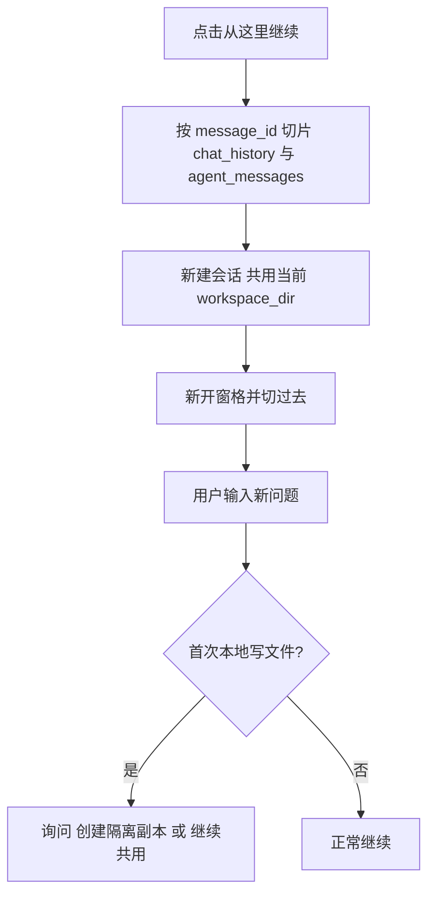

# 从这里继续（对话分叉）

Planned-with: cursor-grok-4.6

Suggested-Impl-Model: gpt-5.6-sol-medium（跨栈：会话切片 + Desktop 多窗格 + 写入确认，序列敏感）

产品拆成两套能力，禁止再用「分叉」同时指代它们：

- **从这里继续**：复制截止该消息的对话上下文，开新会话/新窗格。不要求 Git / Multitask。只承诺对话分支，不恢复历史文件。
- **恢复到此步骤**：现有回放检查点恢复。仅当存在隔离工作区快照时可用。



## In scope

- Pro 主界面 [`desktop/src/components/ChatPane.tsx`](desktop/src/components/ChatPane.tsx) + [`ImBubble.tsx`](desktop/src/components/messages/ImBubble.tsx) 的用户/助手消息操作。
- 新 API：按消息切片的对话继续（不复用整段 `fork_session`）。
- 回放按钮/弹层中文案由「从此前分叉」改为「恢复到此步骤」。
- 对话分支会话首次本地写文件时的隔离/共用确认。

## Out of scope

- 画布 / 节点图可视化。
- 群聊、自动化会话（`automation:*`）、正在流式输出的消息。
- 改现有侧栏「整段会话 fork」([`SidebarSessionHistory.tsx`](desktop/src/components/sidebar/SidebarSessionHistory.tsx) 的 `fork`)。
- 改 [`fork_session_from_checkpoint`](agenticx/studio/session_manager.py) / [`branch_service.py`](agenticx/runtime/replay_ledger/branch_service.py) 的恢复语义。
- 非 Git 目录的字节级快照。
- 动 [`agenticx/studio/server.py`](agenticx/studio/server.py) 顶部 import 区。

## 根因与证据

现有 [`POST /api/sessions/{id}/fork`](agenticx/studio/server.py)（约 6064 行）调用 [`SessionManager.fork_session`](agenticx/studio/session_manager.py)（1621–1640 行），**整段复制** `chat_history`、`agent_messages`、`scratchpad`（含 `isolate_json`）。侧栏 fork 也不开新窗格。

回放「从此前分叉」在 [`capture_git_workspace_snapshot`](agenticx/runtime/replay_ledger/workspace_snapshot.py) 148–149 行：`load_isolate_state` 为空即 `not_git_isolate`，[`recorder.py`](agenticx/runtime/replay_ledger/recorder.py) 360–363 行把事件 `branchable=false`。上下文检查点其实已写入（[`tests/test_run_context_checkpoint.py`](tests/test_run_context_checkpoint.py) 207–210 行），但产品把「不能恢复文件」做成「整颗按钮不可用」。

消息操作已有复制/引用/重试/「引用到新窗格」（[`ChatPane.tsx`](desktop/src/components/ChatPane.tsx) 8350–8364 行：`addPane` + `markPaneAwaitingFreshSession`）。「从这里继续」应复用开窗格路径，但新窗格必须绑定**已切片的新 session**，不能只挂 pending quote。

---

## 子规划与推荐模型

- 切片纯函数 + API：gpt-5.6-sol-medium（上下文/tool 链一致性）
- Desktop 按钮与开窗格：Composer 2.5（样板接线）
- 回放文案：Composer 2.5
- 首次写文件确认：gpt-5.6-sol-medium（权限/隔离状态）

---

## FR-1 按消息切片对话（后端）

**落点**

- 新建 [`agenticx/studio/conversation_continue.py`](agenticx/studio/conversation_continue.py)
- 修改 [`agenticx/studio/session_manager.py`](agenticx/studio/session_manager.py) `fork_session` 之后（约 1641 行）新增 `continue_session_from_message`
- 修改 [`agenticx/studio/server.py`](agenticx/studio/server.py) 在现有 `fork_session` 路由**下方精确插入**新路由，禁止整段替换 import
- 测试：新建 [`tests/test_conversation_continue.py`](tests/test_conversation_continue.py)、[`tests/test_conversation_continue_api.py`](tests/test_conversation_continue_api.py)

**切片规则（写死，禁止「按需推断」）**

`slice_transcript_for_continue(chat_history, agent_messages, message_id) -> (chat_prefix, agent_prefix)`

1. 在 `chat_history` 找第一条 `str(item.get("id") or "") == message_id`。找不到 → 错误码 `message_not_found`。
2. `chat_prefix = chat_history[:idx+1]`（含该消息）。
3. 若切点 role 是 `tool`：错误码 `message_not_continueable`（工具卡不做入口）。
4. 切点 role 必须是 `user` 或 `assistant`。
5. `agent_messages` 按**用户轮次**对齐：
   - `N =` chat_prefix 中 `role == "user"` 的条数
   - 在 agent_messages 找到第 N 条 user 的下标 `u`
   - 若 chat_prefix 最后一条是 `user`：`agent_prefix = agent_messages[:u+1]`（丢掉该问之后的 assistant/tool）
   - 若最后一条是 `assistant`：从 `u+1` 往后收到下一条 user 之前的 assistant/tool 全部纳入（含切点那一轮的完整 tool 链）
6. 切完后对 `agent_prefix` 跑现有 `_sanitize_context_messages`（或会话里已用的清洗），断言无未配对 `tool_calls`。若清洗后仍不合法 → `unstable_transcript`。

**`continue_session_from_message` 行为**

相对 `fork_session`：

- 复制：`avatar_id/name`、`provider/model`、`workspace_dir`、`context_files`、`taskspaces`、`artifacts`
- 使用切片后的 `chat_history` / `agent_messages`
- `scratchpad` 深拷贝后**删除** `isolate_json`、`run_branch_lineage`（禁止两条会话共用同一 isolate worktree）
- 追加 system notice（`system_notice: True`）：

```python
metadata = {
  "conversation_lineage": {
    "kind": "conversation",
    "parent_session_id": source.session_id,
    "source_message_id": message_id,
    "workspace_mode": "shared_current",
    "shared_write_prompted": False,
  }
}
```

- 标题：`_build_fork_name(source.session_name)`（沿用现有 fork 命名）

**API**

`POST /api/sessions/{session_id}/continue-from`

```json
{ "message_id": "msg-..." }
```

成功 200：`ok, session_id, avatar_id, session_name, parent_session_id, source_message_id, workspace_mode`。

失败：

- 404 `session not found` / `message_not_found`
- 400 `message_not_continueable` / `unstable_transcript`
- 409 源会话正在生成（若 `session` 有 in-flight run，与回放 `source_session_running` 同口径：有则拒，避免切到半截流）

**不要**改 `server.py` 文件头 import。路由函数内按需 import `continue_session_from_message`。

改完 `server.py` 必须冷启动 smoke：`agx serve --host 127.0.0.1 --port <临时端口>`，确认 `/api/session`、`/api/avatars`、`/api/sessions` 返回 200，且新接口对假 session 返回 404。

**AC-1**

- 三段对话（U1 A1 U2 A2 U3 A3），从 A1 继续：新会话只有 U1+A1；agent_messages 不含 U2 之后。
- 从 U2 继续：含 U1 A1 U2，不含 A2。
- 带并行 tool_calls 的 assistant 切点：agent_prefix 工具成对。
- 无 isolate_json。
- `fork_session` 旧行为回归：仍整段复制。

---

## FR-2 Desktop「从这里继续」

**落点**

- [`desktop/src/components/messages/ImBubble.tsx`](desktop/src/components/messages/ImBubble.tsx) 助手按钮行约 512–565、用户按钮行约 793–817：在「重试」后加 GitBranch/Split 按钮
- [`MessageRenderer.tsx`](desktop/src/components/messages/MessageRenderer.tsx) 下传 `onContinueFromMessage`
- [`ChatPane.tsx`](desktop/src/components/ChatPane.tsx) 实现 handler（对齐 8350–8364 开窗格，但先拿 session_id）
- IPC：[`desktop/electron/main.ts`](desktop/electron/main.ts) `fork-session` 旁加 `continue-from-message`；[`preload.ts`](desktop/electron/preload.ts)、[`global.d.ts`](desktop/src/global.d.ts)
- i18n：[`desktop/locales/zh/chat.json`](desktop/locales/zh/chat.json) / [`en/chat.json`](desktop/locales/en/chat.json) `actions.continueFrom` = 「从这里继续」/ `Continue from here`
- 血缘：[`session-message-map.ts`](desktop/src/utils/session-message-map.ts) 新增 `parseConversationLineage`（不要塞进现有 `parseBranchLineage`，后者强制要 `parent_run_id` + seq）
- 新建轻量 [`desktop/src/components/messages/ContinueLineageCard.tsx`](desktop/src/components/messages/ContinueLineageCard.tsx)，文案：「从「{{source}}」继续 · 共用当前工作区」
- 测试：ImBubble/ChatPane 现有测试旁加；[`session-message-map.test.ts`](desktop/src/utils/session-message-map.test.ts)

**开窗格顺序（防串台）**

1. Toast/按钮 loading，失败保留可见错误（参考 issue #20：`HTTP 400 ...`）
2. `POST /continue-from` 成功拿到 `session_id`
3. `addPane(pane.avatarId, pane.avatarName, newSessionId)` — **不要**先 `addPane(..., "")` 再异步换 session（会闪旧消息）
4. `setActivePaneId`；新窗格按该 session 拉 `GET /api/session/messages`
5. 源窗格消息与 session 不变

**按钮可见性**

- user / assistant，非 streaming、非 `typing-*`、非 systemNotice
- 非群聊、非 automation pane
- 常驻显示（与复制/重试一致，不要只 hover）

**AC-2**

- 点助手消息「从这里继续」：新窗格出现，历史止于该条，输入区空、可发送。
- 源窗格仍停在原 session。
- 失败时原窗格不动，错误贴近按钮或 toast 可见。
- 血缘卡可点回源 session（`setPaneSessionId` 到 `parent_session_id`，**不要**误开回放 focus）。

改 `main.ts` / 新 IPC 后须完全重启 Desktop（⌘Q / 重跑 `npm run dev`），仅刷新渲染进程无效。

---

## FR-3 回放入口改名（不做能力放宽）

**落点**

- [`desktop/locales/zh/workspace.json`](desktop/locales/zh/workspace.json) `replay.branchFromBefore`：`从此前分叉` → `恢复到此步骤`
- [`desktop/locales/en/workspace.json`](desktop/locales/en/workspace.json)：`Restore to this step`
- 弹层标题走同一 key（[`BranchFromStepDialog.tsx`](desktop/src/components/replay/BranchFromStepDialog.tsx) 74 行）
- 测试里中文断言同步（[`RunReplayPanel.test.tsx`](desktop/src/components/replay/RunReplayPanel.test.tsx) 365 行）

**不改**：`canBranch` 仍要求稳定检查点 + isolate 快照。无隔离时按钮禁用，原因仍是「该节点不可分叉 · 当前会话不在 Git 隔离工作区」（或把 `cannotBranch` 改成「该步骤无法恢复」——仅文案，语义不变）。

**AC-3**

- 无隔离会话：按钮文案为「恢复到此步骤」，仍 disabled，原因仍含 Git 隔离。
- 有隔离 + 稳定检查点：可点，行为与现网一致。

---

## FR-4 共用工作区首次写入必须确认

对话分支默认 `workspace_mode=shared_current`。两条会话若都 `file_write` / `file_edit` / 写盘 `bash_exec`，会互踩同一目录。

**落点**

- 会话 scratchpad `conversation_lineage.shared_write_prompted`
- 运行时：在现有 action confirmation / tool before 路径拦截本地写。优先复用 [`agenticx/runtime/replay_ledger/effects.py`](agenticx/runtime/replay_ledger/effects.py) 的 `local_write` 分类 + Desktop 已有 `actionConfirmation` 卡（[`ChatPane.tsx`](desktop/src/components/ChatPane.tsx) `onResolveActionConfirmation`）
- 新建纯函数 [`agenticx/studio/conversation_continue.py`](agenticx/studio/conversation_continue.py) `should_prompt_shared_write(session, tool_name, effect_class) -> bool`：`conversation_lineage.kind==conversation` 且 `workspace_mode==shared_current` 且 `shared_write_prompted is False` 且 effect 为 `local_write` / `unknown` 的写路径
- 用户选项（中文）：
  - **创建隔离副本**：对该会话 `ensure_isolate(..., isolate_run=True)`，把 lineage 改为 `workspace_mode=isolated`，然后执行工具
  - **继续共用当前工作区**：`shared_write_prompted=True`，之后本会话不再问
  - **取消**：不执行该工具
- 非 git 工作区：隔离选项 disabled，文案「当前不是 git 工作区，无法创建隔离副本」，只保留共用/取消
- 测试：[`tests/test_conversation_continue.py`](tests/test_conversation_continue.py) 覆盖三态；Desktop 卡可用现有 action-confirmation 测试风格

**不要**在未确认时静默 `isolate_run`。

**AC-4**

- 新分支只读（file_read）不弹。
- 第一次 file_write 弹出三选一。
- 选「继续共用」后第二次 write 不再弹。
- 选「创建隔离副本」后 `load_isolate_state` 非空，后续写落在 isolate，不改源会话目录。

---

## 实施顺序

1. 纯函数 + pytest（FR-1 切片 / scratchpad 清洗 / shared write predicate）
2. `continue_session_from_message` + API + serve smoke
3. Desktop 按钮 + IPC + 开窗格 + 血缘卡（FR-2）
4. 回放文案（FR-3，可与 3 并行）
5. 首次写入确认（FR-4）
6. `desktop` vitest：`session-message-map`、`RunReplayPanel`、相关 ImBubble/ChatPane 测试

## 验证

- `pytest tests/test_conversation_continue.py tests/test_conversation_continue_api.py tests/test_session_manager_persistence.py tests/test_run_branch_service.py -q`
- `cd desktop && npx vitest run src/utils/session-message-map.test.ts src/components/replay/RunReplayPanel.test.tsx`
- 手测：普通（非 Multitask）会话从中间助手消息继续 → 新窗格历史截断 → 发新问题 → 第一次写文件出现确认
- 手测：Multitask 完成任务的回放仍显示「恢复到此步骤」

## 过程元数据（实施 commit 时）

Plan-Id: `2026-09-12-conversation-continue-from`  
Plan-File: `.cursor/plans/2026-09-12-conversation-continue-from.plan.md`（开工前从 pending 移回根目录）  
Plan-Model / Impl-Model：实施前提问用户，禁止编造。
