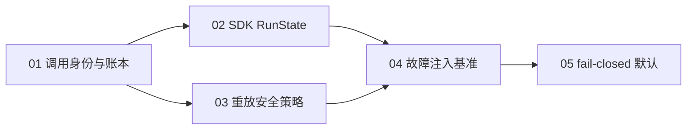

# 第一阶段：AgenticX SDK 可靠性内核

**Plan-Id**: `2026-09-12-sdk-reliability-kernel-master`
**Plan-File**: `.cursor/plans/2026-09-12-sdk-reliability-kernel-master.plan.md`
**Owner**: Damon Li
**Planned-with**: Claude Opus 5
**Made-with**: Damon Li

---

## 0. 一句话目标

让「AgenticX SDK 比 openai-agents-python 更可靠」变成**可复现的四个数字**：重复副作用率、崩溃恢复成功率、历史一致率、错误可诊断率。

不是「我们也有 checkpoint」，而是「同一套故障注入矩阵下，我们的重复副作用率是 0、他们不是」。

---

## 1. 为什么是这件事（证据链，执行者必读）

本节的事实全部来自对本仓库与上游 `openai/openai-agents-python@fbd2dbc` 的源码核对，执行时不需要回看任何对话记录。

### 1.1 上游的可靠性机制在 SDK 一等公民层

| 上游机制 | 位置 | 语义 |
|---|---|---|
| `RunState` | `src/agents/run_state.py` | 可序列化的 run 快照，HITL / 崩溃后从中间态恢复，**是 SDK 公开 API** |
| 工具调用身份 | `call_id` + payload fingerprint | 完全相同的调用可跳过重放；**同 id 但参数变了直接抛 `ModelBehaviorError`** |
| 分层重放否决 | `replay_safety` / `response_started` / `stateful_request` / `_hard_veto` | 普通 `retry=True` 永远不能绕过重放保护；`approve_unsafe_replay` 对流式请求无效 |
| 持久化边界 | `_pending_session_write` / `_terminal_unrecoverable` | 明确标注「已接受终态输出但尚未落盘」的危险窗口 |

### 1.2 AgenticX 的实际状况（已逐一核对）

**（a）硬化能力全在 Studio，SDK 原语裸奔。**

`agenticx/runtime/agent_runtime.py` 有一整套长运行硬化：`_persist_or_abort()`（:2887）、崩溃恢复的 `interrupted_closers`、`compaction_journal` 孤儿锁、`provider_fallback` 兜底否决、上下文溢出重试。

但可嵌入的 SDK 原语 `agenticx/agents/react_agent_async.py::ReActAgent` **一行持久化都没有**。用 `rg 'checkpoint|persist|resume'` 扫这个文件，零命中。它的 `astream()`（:220-341）是纯内存循环：`messages` 是局部变量，进程一死全部消失；`except asyncio.CancelledError` 分支（:339-341）只 yield 一个 `ErrorEvent` 就 `raise`，**已经跑完的工具结果连带 messages 一起丢弃**，调用方拿不到任何可续跑的东西。

`agenticx/runtime/checkpoint.py::CheckpointStore` 无法复用：它 `from agenticx.studio.storage.factory import get_sync_storage`（:32-33），是 Studio 专属的，把它塞进 SDK 会让 `agenticx.agents` 反向依赖 `agenticx.studio`，破坏 `ReActAgent`「零 Studio 耦合」的既有契约（见 `conclusions/agents_module_conclusion.md`）。

**（b）没有任何工具调用身份概念。**

全仓 `rg 'fingerprint'` 的命中全是别的东西：`prompt_cache_policy` 的前缀缓存指纹、`kb/ingest_cache` 的入库指纹、`LoopDetector.fingerprint_from_result` 的循环检测结果指纹。**没有一个是「这次工具调用是不是上次那一次」**。

后果直接体现在 `agenticx/runtime/interrupted_closers.py:18-22`：崩溃恢复时对已派发但结果未知的调用，只能塞一句自然语言：

```
"[中断] 该工具调用已经发出，但运行时在拿到结果前中断，执行结果未知。
禁止直接重试写入类操作；先用只读方式核验外部状态…"
```

这是把幂等判断**外包给 LLM 的自觉性**。上游是查账本得到确定答案。这就是第一阶段要补的核心差距。

**（c）默认姿态是 fail-open。**

- `agenticx/runtime/harden_flags.py:93-95`：`persist_fail_closed_enabled()` 默认 **False**，即持久化失败默认「带病继续」。
- `agenticx/runtime/checkpoint.py:73-88`：`CheckpointStore.save()` 把写失败 `logger.warning` 后吞掉，类 docstring 自己写明 "Write failures are logged and swallowed"。

也就是说：checkpoint 写不进去，运行照常往下跑，崩溃后无从恢复，且**没人知道**。上游在这个位置是 fail-closed。

**（d）评测框架有，但不测可靠性。**

`agenticx/evaluation/` 已经很完整：`EvalSet` / `EvalCase`、`TrajectoryMatcher`（EXACT/PARTIAL/UNORDERED）、`EvalRunner`（`runner.py:24`）、`LLMJudge`、`SpanEvaluator`、`TraceToEvalSetConverter`。

但它们全部衡量**正确性**（工具调用序列对不对、输出好不好），没有任何**故障下的行为**：没有故障注入、没有重复副作用计数、没有恢复成功率。所以本阶段的基准必须**扩展** `agenticx/evaluation/`，绝不另起一套评测框架。

**（e）已有的幂等是 HTTP 层，不是工具层。**

`.cursor/plans/2026-06-06-session-identity-single-chokepoint-and-idempotency.plan.md` 已落地 `/api/chat` 的 `client_turn_id` 幂等键，解决「同一个 POST 重复落盘」。那是请求级，与本阶段的工具调用级正交，**不要复用、不要改动它**。

**（f）副作用分级已经存在，但被 Studio 依赖锁在门内。**

`agenticx/runtime/replay_ledger/`（2723 行，来自 `2026-09-10-long-run-replay-branching-master`）里已有 `contracts.py:17` 的 `EFFECT_CLASSES = {none, read, local_write, external_write, unknown}` 与 `effects.py:65` 的 `classify_tool_effect()`——内置工具白名单齐全、`bash_exec` 走 `assess_command()` 深度判定、未知一律 `"unknown"`（已经是 fail-closed 姿态）。**S3 必须复用它，不许另造分类法。**

但实测 `from agenticx.runtime.replay_ledger.effects import classify_tool_effect` 会拉进 5 个 `agenticx.studio.*` 模块：包 `__init__.py:17` eager import `store.py`，而 `store.py:42` `from agenticx.studio.storage.factory import _default_sessions_root`。所以 S3 的第一步是把那一处导出惰性化（对照：`agenticx.runtime.interrupted_closers` 实测 0 个 Studio 模块，可以放心引用）。

另外要区分清楚：`replay_ledger` 的 `branchable` / `unbranchable_reason` 解决的是「能不能从这个历史事件**主动分叉**」，与本阶段的「崩溃后这个已派发的工具**能不能重跑**」是两个不同判断，**不要强行统一**。

### 1.3 路线选择：可靠性内核 + 双适配层

三条候选路线：

1. 只在 Studio `AgentRuntime` 上继续打补丁 —— 否决：第一阶段的目标是 **SDK** 领先，补 Studio 不改变 SDK 裸奔的事实。
2. 把 `ReActAgent` 和 `AgentRuntime` 合并成统一 Runner —— 否决：`AgentRuntime` 是产品主路径，重写它属于高回归风险，且违反 no-scope-creep。
3. **新建 `agenticx/reliability/` 内核，定义调用身份、事务性检查点、续跑协议、失败语义；再以两个薄适配层分别接入 `ReActAgent`（SDK 侧，本阶段的基准对象）与 `AgentRuntime`（产品侧，S3/S5 阶段接入）** —— **采用**。

第 3 条的好处：SDK 侧先拿到可对外发布的基准数字，产品侧后续复用同一内核而不必重写既有循环。

---

## 2. 交付项（5 个 Subplan）

| # | Subplan | 交付物 | 依赖 |
|---|---|---|---|
| 01 | Tool-call 规范身份与幂等账本 | `agenticx/reliability/call_identity.py`、`call_ledger.py` | 无 |
| 02 | SDK 侧 RunState 持久化与续跑 | `agenticx/reliability/run_state.py` + `ReActAgent` 接入 | 01 |
| 03 | Replay 安全策略（分层否决） | `agenticx/reliability/replay_policy.py` + `BaseTool.effect_class`（复用已有 5 值 `EFFECT_CLASSES`，不另造 `replay_safety` 三值） | 01 |
| 04 | 故障注入可靠性基准 | `agenticx/evaluation/fault_injection.py`、`reliability_runner.py` | 01、02、03 |
| 05 | fail-closed 默认姿态切换 | `reliability.posture` 设置 + 默认翻转 | 04（要用它的数字证明翻转有收益） |

### 2.1 推荐实施模型

| Subplan | Suggested-Impl-Model | 理由 |
|---|---|---|
| 01 | Grok 4.6 | 纯算法 + 文件存储，边界条件多但无跨栈风险，中档代码模型足够 |
| 02 | Grok 4.6 | 单文件接入（`react_agent_async.py` 402 行），改动面清晰 |
| 03 | Grok 4.6 | 策略表 + 工具基类属性，样板性质 |
| 04 | Grok 4.6 | 扩展既有 evaluation，测试代码量大但模式重复 |
| 05 | GPT-5.x 级强推理档 | **默认行为翻转**，影响 Studio/Near 全部存量会话，属跨栈高回归收口 |

推荐仅为建议，最终 `Impl-Model` trailer 以实际使用为准。

### 2.2 执行顺序



01 必须先完成（02/03 都依赖 `CallLedger`）。02 与 03 可并行。04 需要 02、03 都在。05 最后，且必须先有 04 的基线数字。

---

## 3. 全局 In scope / Out of scope

### In scope

- 新建 `agenticx/reliability/` 包（本阶段唯一的新增顶层子模块）。
- 修改 `agenticx/agents/react_agent_async.py`（SDK 原语接入内核）。
- 修改 `agenticx/tools/base.py`（新增 `effect_class` 类属性与 `resolve_effect_class()`，仅加不改）。
- S3 中把 `agenticx/runtime/replay_ledger/__init__.py` 的 `ReplayLedgerStore` 改为惰性导出（约 8 行，沿用 `agenticx/runtime/__init__.py` 已有的 `__getattr__` 模式），使 SDK 层能复用既有的 `classify_tool_effect` 而不被 Studio 依赖污染。
- 扩展 `agenticx/evaluation/`（新增 2 个文件，不改既有文件的行为）。
- S5 中修改 `agenticx/runtime/harden_flags.py` 与 `agenticx/runtime/checkpoint.py` 的默认值/失败语义。
- 新增 `tests/test_reliability_*.py` 系列。

### Out of scope（严禁触碰）

- **不得重写 `agenticx/runtime/agent_runtime.py` 的主循环。** S3/S5 只允许在既有钩子点做最小接线，`_run_turn_inner` 的 `for round_idx in range(...)` 结构不动。
- **不得改动 `agenticx/studio/server.py`。** 该文件的 import 区块极度敏感（历史事故：一次无关修复误删 `from agenticx.avatar.group_chat import GroupChatRegistry` 导致 `agx serve` 冷启动即崩）。本阶段没有任何理由改它。
- **不做分布式 CAS / 跨主机一致性。** 账本是单机 per-session 的。上游也没有分布式 CAS。
- **不重复 `.cursor/plans/pending/2026-09-10-long-run-replay-branching-master.plan.md`** 的 Run Ledger / 内容寻址检查点 / 分支血缘。那个 plan 解决「回放与分支」（用户能回看和从中间分叉），本 plan 解决「崩溃后不重复副作用」。两者的账本用途不同：那边是 append-only 事件投影，这边是调用身份查重表。**如果两个 plan 都实施，S1 的 `CallLedger` 可被那个 plan 的 `RunEvent` 流消费，但不合并、不互相依赖。**
- **不重复 `.cursor/plans/pending/2026-09-09-near-personal-agent-control-plane-master.plan.md`** 的 personal-eval / observation-ledger。
- **不动 `/api/chat` 的 `client_turn_id` 幂等**（请求级，正交）。
- **不改 `interrupted_closers.py` 的现有文案与纯函数签名**，只在 S2 中让调用方在有账本时优先走账本结论（S2 会写明具体接线方式）。
- 不做前端 / Desktop 改动。本阶段是纯 Python 底层能力。

---

## 4. 阶段验收标准（AC）

第一阶段整体完成的判据（每条都可执行）：

- **AC-M1**：`pytest tests/test_reliability_call_identity.py tests/test_reliability_ledger.py tests/test_reliability_run_state.py tests/test_reliability_replay_policy.py tests/test_reliability_bench.py -q` 全绿。
- **AC-M2**：`python -m agenticx.evaluation.reliability_runner --suite builtin --report /tmp/agx-reliability.json` 产出含四项指标的 JSON；在 `posture=strict` 下 **duplicate_side_effect_rate == 0.0**。
- **AC-M3**：`ReActAgent` 在 `kill_after_tool_result_before_persist` 故障下续跑，副作用计数器工具的最终计数等于故障前已完成的调用数（不多不少）。
- **AC-M4**：同一 `call_id` 携带不同参数二次出现时抛 `ToolCallIdentityError`，且异常消息包含 `call_id`、两次的 canonical key 前 16 位、以及冲突的字段名。
- **AC-M5**：`python -c "import agenticx.agents"` 不引入 `agenticx.studio`（保持 SDK 零产品耦合）。验证命令：
  ```bash
  python -c "import sys, agenticx.agents; assert not [m for m in sys.modules if m.startswith('agenticx.studio')], [m for m in sys.modules if m.startswith('agenticx.studio')]"
  ```
- **AC-M6**：`agx serve --host 127.0.0.1 --port 18799` 冷启动成功且 `/api/session`、`/api/avatars`、`/api/sessions` 返回 200（因为 S3/S5 会碰 runtime 层，这条是硬门槛）。

---

## 5. 对外叙事（S4 完成后才能说）

在拿到 AC-M2 的数字之前，**不要**在 README / 官网 / issue 里声称「比 openai-agents-python 更可靠」。
拿到之后，可发布的表述是：「在公开的故障注入矩阵下，AgenticX SDK 的重复副作用率为 0，恢复成功率 X%」，并附上基准脚本让人复现。

上游合作轨（给 openai-agents-python 提 PR）不在第一阶段，本 plan 不涉及。

---

## 6. 各 Subplan 文件

- `.cursor/plans/pending/2026-09-12-sdk-reliability-01-call-identity.plan.md`
- `.cursor/plans/pending/2026-09-12-sdk-reliability-02-sdk-durability.plan.md`
- `.cursor/plans/pending/2026-09-12-sdk-reliability-03-replay-safety.plan.md`
- `.cursor/plans/pending/2026-09-12-sdk-reliability-04-fault-injection-bench.plan.md`
- `.cursor/plans/pending/2026-09-12-sdk-reliability-05-fail-closed-defaults.plan.md`
