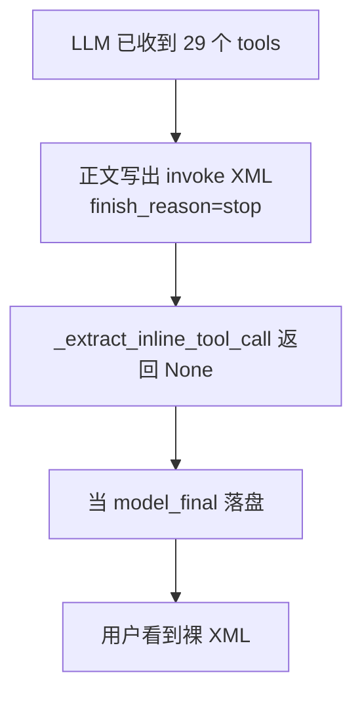

# 正文 invoke XML 回收为真实 tool_calls

Planned-with: Cursor Grok 4.6
Suggested-Impl-Model: Composer 2.5
Plan-Id: 2026-09-13-inline-invoke-tool-call

> **For implementer:** Composer 2.5 应能在不看对话上下文的前提下仅凭本文落地。只改本文件列出的符号与测试。禁止改 `agenticx/studio/server.py`（含顶部 import）。禁止改 Desktop UI 结构、禁止改任何 LLM provider 的 `stream_with_tools`。不要 commit，除非用户明确要求。

**Goal:** 模型把工具写成 `<invoke name> / <parameter>` 正文时，runtime 回收成真实 `tool_calls` 并执行；用户气泡不再把这段 XML 当成最终答案。

**Architecture:** 沿用已有「正文方言 → 合成 tool_calls」路径（`_extract_inline_tool_call`）。补一种与 GLM `<tool_call>` 同类的 invoke 方言；转换成功后从可见正文剥掉标记；解析失败则单次重试，仍失败则按「说了要调工具但没动手」收口，禁止 `model_final`。

**Tech Stack:** Python 3.12、`AgentRuntime`、`pytest`（`tests/test_agent_runtime_inline_tool_call.py`、`tests/test_completeness_truth.py`）。

---

## 推荐实施模型

| 子任务 | 推荐模型 | 理由 |
|---|---|---|
| FR-1 invoke 解析 + 单测 | Composer 2.5 | 纯函数正则，落点与断言已写死 |
| FR-2 转换后剥标记 + 失败重试 | Composer 2.5 | 只改已有收口分支，模式与 empty_tool_calls retry 相同 |
| FR-3 未执行 markup 不当终局 | Composer 2.5 | session_manager 增加一条 Path E + 现成测试文件 |

最终 `Impl-Model` 以实际使用为准。本 plan 按 Composer 2.5 可独立落地书写。

---

## 背景与根因（证据链，实施者无需回看对话）

### 症状

会话 `bd943a7e-6d28-4d3f-91da-12f69f98c744`（只读证据，测试勿依赖本机该目录存在）气泡露出：

```text
团长，我先查一下再回答，避免凭印象误导。

<invoke name="web_search">
<parameter name="query">CowAgent 是什么 哪个厂商 开源项目</parameter>
</invoke>
```

落盘：`~/.agenticx/sessions/bd943a7e-6d28-4d3f-91da-12f69f98c744/messages.json`。

### 已核实事实

| 项 | 值 |
|---|---|
| 模型 / provider | `glm-5.3-flash` / 自定义 OpenAI 兼容网关（`interface: openai` → `LiteLLMProvider`） |
| 本轮是否带了工具 | 是。`cache_prefix.jsonl`：`tools_count=29`。`web_search` 在 `CORE_ALWAYS_LOAD_TOOLS`（`agenticx/runtime/tool_search.py` L36–68） |
| 原生 tool_calls | 无。`had_tool_calls: false`，`model_finish_reason: stop`，`terminal_reason: model_final` |
| 现有正文回收 | `_extract_inline_tool_call`（`agenticx/runtime/agent_runtime.py` L1898）对上述原文返回 `None`（2026-09-13 用该原文实测） |
| 口头承诺检测 | `_messages_last_turn_promised_action_without_followthrough` 未命中：reasoning 为 `Need to search web`（对不上 `ACTION_INTENT_RE` 的 `search the web`）；正文「我先查一下」对不上 `_HANDOFF_BODY_RE` |

### 根因分层

1. **模型层（不可根除，只能兼容）：** 部分模型 / 网关在已收到 OpenAI `tools` 时，仍把调用写成正文 XML，并 `finish_reason=stop`。产品已接受这一类行为：2026-07-28 已为 GLM `<tool_call><arg_key>` 做回收。
2. **产品层（本 plan 要根治）：** 回收器只认 `<tool_code>` / JSON / GLM `<tool_call>` / `name(...)`，不认 `<invoke name="…"><parameter>`。回收失败后按最终回答落盘，XML 进气泡。
3. **安全网缺失：** 「说了要查但没调工具」检测也不认这段 XML，所以不会标 `deferred_action`、不会续跑。



**不是**工具没注入、也不是知识库取消那批 Desktop 改动。不要去改网关或强迫换模型。

---

## In scope

- `_extract_inline_tool_call` 识别 `<invoke name>` + `<parameter name>`（可带可选 `*:tool_call` 外包一层，解析仍找 invoke）
- 转换成功后从本轮可见正文剥掉 invoke / tool_call 标记，只留开场白话
- 正文有 invoke/GLM tool_call 标记但回收失败：每 session 最多自动再跑一轮 LLM（hint：用原生 function calling）
- 仍失败：`promised_action` Path E，禁止当最终回答

## Out of scope（禁止顺手改）

- `agenticx/studio/server.py` 任何一行
- 任何 `agenticx/llms/*` provider / `stream_with_tools`
- Desktop `ChatPane` / `ChatView` 结构或新 UI 组件
- `assistant_output.py` 的 think/followups 状态机（不要把 invoke 做成协议保留标签）
- 企业门户 `tool-call-leak.ts`（那是另一条产品线、且只剥不执行）
- 改 `tool_search` 阈值、默认模型、提示词里点名具体厂商
- 一次回收多条 invoke（保持现有「只返回第一条」契约）

---

## FR / AC

### FR-1: 回收 invoke 方言为合成 tool_calls

**落点：** `agenticx/runtime/agent_runtime.py` 函数 `_extract_inline_tool_call`（约 L1898–1993）。在 GLM `_GLM_TOOL_CALL_RE` 循环之后、`name(...)` 扫描之前插入。

**Before（意图）：** 本会话原文 → `None`。

**After（意图）：**

```python
_INVOKE_BLOCK_RE = re.compile(
    r"<\s*invoke\s+name\s*=\s*[\"']([A-Za-z0-9_./-]+)[\"']\s*>"
    r"(.*?)"
    r"</\s*invoke\s*>",
    re.IGNORECASE | re.DOTALL,
)
_INVOKE_PARAM_RE = re.compile(
    r"<\s*parameter\s+name\s*=\s*[\"']([^\"']+)[\"']\s*>"
    r"(.*?)"
    r"</\s*parameter\s*>",
    re.IGNORECASE | re.DOTALL,
)
```

伪代码（放进 `_extract_inline_tool_call`，名字必须在 `allowed_tool_names` 才返回）：

```python
for inv in _INVOKE_BLOCK_RE.finditer(text):
    name = inv.group(1).strip()
    if name not in allowed_tool_names:
        continue
    args: dict[str, Any] = {}
    for p in _INVOKE_PARAM_RE.finditer(inv.group(2) or ""):
        key = p.group(1).strip()
        raw = (p.group(2) or "").strip()
        if not key:
            continue
        try:
            parsed = json.loads(raw)
        except Exception:
            parsed = raw
        args[key] = parsed
    args = _normalize_file_tool_arg_aliases(name, args)
    return {"name": name, "arguments": args}
```

调用点已有（约 L5158–5170），**不要改合成 `tool_calls` 的结构**（`id=inline-…` / `type=function` / `arguments=json.dumps`）。

**AC-1** `tests/test_agent_runtime_inline_tool_call.py` 新增：

- `test_extract_invoke_web_search_session_payload`：用本会话原文（可改专名，保留标签形状），`allowed={"web_search"}` → `{"name":"web_search","arguments":{"query":"…"}}`
- `test_extract_invoke_wrapped_in_tool_call_tag`：外包 `<tool_call>…</tool_call>` 或 `<x:tool_call>…</x:tool_call>` 仍能解析 invoke
- `test_extract_invoke_ignores_unknown_tool_name`：`name="not_a_real_tool"` → `None`
- 既有 GLM / JSON / `respond` 用例全绿

### FR-2: 转换成功剥标记；回收失败单次重试

**落点 A — 剥标记：** `agenticx/runtime/agent_runtime.py`，在 L5158–5170 合成 `tool_calls` 成功后立刻：

```python
ac_clean = _strip_inline_tool_markup(ac_clean)
response_text = ac_clean
```

新增纯函数（放在 `_extract_inline_tool_call` 附近）：

```python
_INLINE_TOOL_MARKUP_RE = re.compile(
    r"<\s*(?:[\w.-]+:)?tool_call\b[^>]*>[\s\S]*?</\s*(?:[\w.-]+:)?tool_call\s*>"
    r"|<\s*invoke\b[^>]*>[\s\S]*?</\s*invoke\s*>",
    re.IGNORECASE,
)

def _strip_inline_tool_markup(text: str) -> str:
    cleaned = _INLINE_TOOL_MARKUP_RE.sub("", str(text or ""))
    return re.sub(r"\n{3,}", "\n\n", cleaned).strip()
```

**不要**在 `_sanitize_structured_assistant_text` / `parse_assistant_output` 里先剥 invoke：回收必须读**带标记的 raw**（本路径里是 `response_text`，在 L5159 调用时仍是未剥版本）。顺序必须是：先 extract(`response_text`) → 再剥 `ac_clean`。

**落点 B — 失败重试：** 紧挨 L5158–5170 之后、`model_finish_reason = _response_finish_reason` 之前（或 empty_tool_calls 分支旁，约 L5171–5203）。模式抄 empty_tool_calls：

```python
if (
    not tool_calls
    and _has_unexecuted_inline_tool_markup(response_text)
    and not getattr(session, "_inline_markup_retry_used", False)
):
    setattr(session, "_inline_markup_retry_used", True)
    hint = (
        "[系统通知] 上一轮把工具写成了正文 XML（invoke / tool_call），运行时无法执行。"
        "请立即用原生 function calling 重新发出同一个工具调用，补全 required 参数；"
        "不要再把 XML 写进用户可见正文。"
    )
    # 写入 messages / session.agent_messages 的 assistant content 必须先剥标记，避免历史被 XML 污染
    messages.append({"role": "assistant", "content": _strip_inline_tool_markup(ac_clean) or " "})
    messages.append({"role": "system", "content": hint})
    session.agent_messages.append({"role": "assistant", "content": _strip_inline_tool_markup(ac_clean) or " "})
    session.agent_messages.append({"role": "system", "content": hint})
    yield ROUND_END auto_retry reason=unparsed_inline_tool_markup
    continue
```

`_has_unexecuted_inline_tool_markup(text)`：`_INVOKE_BLOCK_RE.search(text)` 或 `_GLM_TOOL_CALL_RE.search(text)` 为真。每 session 一次（属性名固定 `_inline_markup_retry_used`）。

**AC-2**

- `test_strip_inline_tool_markup_keeps_preamble`：会话形状正文剥完后等于开场白话，不含 `<invoke` / `<parameter`
- `test_has_unexecuted_inline_tool_markup_true_for_invoke` / `_false_for_plain_prose`
- 不要为了测 retry 去改 provider；纯函数测标记检测即可。若已有 runtime loop 测试方便挂 `getattr(session, "_inline_markup_retry_used")` 分支，可加一条；没有现成 harness 就不要新造完整 AgentRuntime mock。

### FR-3: 仍失败时不当最终回答

**落点：** `agenticx/studio/session_manager.py` 函数 `_messages_last_turn_promised_action_without_followthrough`（约 L200–268），在 `return False` 前增加 Path E。

**Before：** 本会话 assistant 无 `tool_calls`、正文含 invoke → 函数返回 `False` → `_finalize_chat_runtime` 当 `saw_final` 终局。

**After：**

```python
# Path E: leftover invoke/tool_call XML in a short assistant body, no tool rows.
if (
    not _turn_has_any_tool_row(tail)
    and _has_inline_tool_markup(body)
    and len(_strip_inline_tool_markup(body)) < 220
):
    return True
```

为避免 `session_manager` 从 `agent_runtime` 反向重依赖，把 `_INVOKE_BLOCK_RE` / `_strip_inline_tool_markup` / `_has_inline_tool_markup` **只实现一份**，放在 `agenticx/runtime/agent_runtime.py`，由 `session_manager` import 这三个名字（`session_manager` 已从 runtime 侧 import `ACTION_INTENT_RE` 等，见文件顶部约 L36）。若现有 import 会循环，则把这三个纯函数抽到新文件 `agenticx/runtime/inline_tool_markup.py`（仅当确认循环时才抽；默认不抽）。

**AC-3** `tests/test_completeness_truth.py` 新增：

- `test_invoke_xml_without_tool_calls_is_deferred`：user + assistant（本会话正文形状）→ `_messages_last_turn_promised_action_without_followthrough` is True
- `test_invoke_xml_negative_long_tutorial`：长文（>300 且剥标记后仍 >220）里举例 `<invoke name="web_search">` → False
- `test_invoke_xml_negative_when_tool_calls_present`：同一正文但带 `tool_calls` → False

既有 Path A/B/D 用例全绿。

---

## 实施顺序

1. 先写 FR-1 失败测试并跑红（`pytest tests/test_agent_runtime_inline_tool_call.py::test_extract_invoke_web_search_session_payload -v` 期望 FAIL：`None`）
2. 实现解析，跑绿
3. 写 FR-2 剥标记测试 → 实现 helper → 改 L5158 后两行
4. 接失败重试分支（属性名、hint、剥标记写入历史）
5. 写 FR-3 测试 → Path E
6. 回归：`pytest tests/test_agent_runtime_inline_tool_call.py tests/test_completeness_truth.py tests/test_deferred_action_reasoning_field.py -q`

---

## 验收（人工）

用任意会写 invoke 的模型（或把本会话原文喂回收器）确认：

- 回收成功：下一轮出现真实 `web_search` 工具卡，气泡最终正文没有 `<invoke`
- 回收失败（故意未知工具名）：不出现「这就是答案」的裸 XML 终局；应续跑或 deferred_action 中断提示
- 消息行「重试」语义不变（本 plan 不碰 `ChatPane.sendChat`）

流式过程中 XML 可能短暂出现在 TOKEN 里（`FollowupStreamEmitter` 不藏 invoke）。本 plan 不修闪现；终局与落盘必须干净。

---

## no-scope-creep

每个 diff 必须能对上 FR-1 / FR-2 / FR-3 之一。不要「顺便」改提示词、换默认模型、或给 Desktop 做泄漏剥皮组件。
