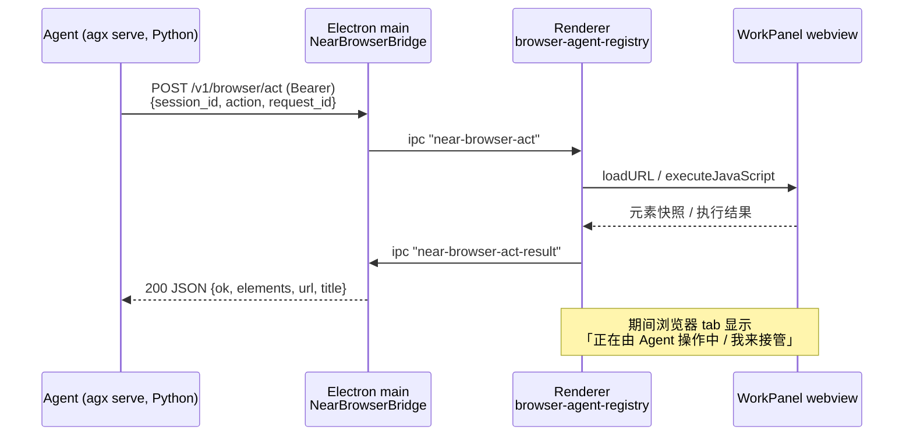

# Agent 驱动 WorkPanel 内嵌浏览器（可见操作 + 人工接管）

Planned-with: claude-opus-5-thinking

Suggested-Impl-Model: 见下方「阶段 → 推荐模型」表

## 背景与目标

Near 桌面端 WorkPanel 已有「浏览器」tab（Electron `<webview>`，见 `desktop/src/components/work-panel/WorkPanel.tsx` 的 `RemoteBrowserPane`，L183-420），用户可手动开网页、选文引用。但**智能体无法驱动这个 webview**：它要操作浏览器只能走 `browser-use` MCP（另一套 Playwright/Chromium 进程，画面在应用外）或 `computer_use`（全屏键鼠）。

结果就是用户看到的对比：某竞品把「链接 → 右侧可见浏览器 → Agent 自动导航/填表/提交 → 底栏『正在由 Agent 操作中 / 我来接管』」做成一条闭环；Near 只有零散零件。

**本 plan 目标**：让智能体能操作 WorkPanel 里那个 webview，全过程用户可见，并可一键接管。

### 根因（为什么现在做不到）

证据链（不依赖对话上下文，可自行复核）：

1. 智能体运行在 Python 后端 `agx serve`（`agenticx/studio/server.py`），工具在 `agenticx/cli/agent_tools.py` 的 `STUDIO_TOOLS`（L740 起）。
2. 现有 `desktop_*` 工具（`agent_tools.py` L2806-3229）在 **Python 进程本地**用 `screencapture` / `pyautogui` 操作系统桌面，与 Electron 渲染进程无关。
3. Electron 主进程**没有任何 HTTP 服务**（`desktop/electron/main.ts` 只在 L2521 / L6314 用 `net.createServer` 探空闲端口；`http` 仅作为客户端 import，L37）。因此后端没有任何通道能把动作送进渲染进程。
4. 现存的 `in-app-browser-open`（`main.ts` L6538/L6540/L6710 → `preload.ts` L1062-1068 → `WorkPanel.tsx` L132-143）是**主进程→渲染进程**的单向 URL 派发，触发源是 Electron 自己拦截的链接点击，不是后端；且只能「打开 URL」，无点击/输入/回读。

所以缺口只有一条：**Python → Electron 渲染进程的双向控制通道**。其余（webview、多窗格派发注册表、guest JS 注入、选区回读）都已存在，可直接复用。

## 架构

新增一个 Electron 主进程内的 loopback HTTP 桥（沿用仓库既有 `wb_bridge` / `cc_bridge` / `serve.port` 的发现约定），Python 工具通过它下发动作，渲染进程执行后回报结果。



端口与令牌：主进程启动时 `findFreePort()`（`main.ts` L6312 已有）后写入
`~/.agenticx/browser_bridge.port` 与 `~/.agenticx/browser_bridge.token`，与 `serve.port` / `serve.token` 的写法一致（参见 `main.ts` L1013-1014、L2905-2906）。Python 侧读取逻辑镜像 `agenticx/wb_bridge/settings.py` L35-42（URL）与 L132-154（token）。

## In scope / Out of scope

**In scope**
- 主进程 loopback HTTP 桥 + IPC 往返 + 请求超时。
- 渲染进程按 `sessionId` 注册的浏览器控制器注册表。
- guest 页面内的元素索引/快照/点击/输入 JS。
- 7 个 Python 工具 `near_browser_*` + 系统提示能力块 + 上下文计费。
- 「正在由 Agent 操作中 / 我来接管」UI 与接管后的拒绝语义。
- 单元/冒烟测试、i18n（zh/en）、设置开关。

**Out of scope（no-scope-creep 边界）**
- 不动 `browser-use` MCP 任何代码与 auto-connect 策略。
- 不动 `computer_use` / `desktop_*` 工具。
- 不改 `RemoteBrowserPane` 现有选区引用（`browser-selection.ts`）、设备工具栏、HtmlPreviewShell（srcDoc）分支的既有行为。
- 不做飞书 Wiki 专用逻辑（密码页由通用「快照→输入→点击」覆盖，不写站点特例）。
- 不做录制回放、不做多 tab 并行编排（一次只操作某 session 的**活动**浏览器 tab）。
- **不碰 `agenticx/studio/server.py` 的 import 区**；本 plan 在该文件只做「新增调用行」，禁止整段替换（见 AGENTS.md 关于该文件的硬性约束）。

## 阶段 → 推荐模型

| 阶段 | 内容 | Suggested-Impl-Model | 理由 |
|---|---|---|---|
| P1 | Electron 主进程 HTTP 桥 + IPC + preload/global.d.ts | Codex 系列（代码专精中档） | 纯后端接线，协议清晰 |
| P2 | 渲染进程注册表 + guest JS + 纯函数与测试 | Codex 系列 | 逻辑密集但无审美需求 |
| P3 | Python `near_browser_*` 工具 + 提示注入 | Codex 系列 | 与 wb_bridge 高度同构，可照抄 |
| P4 | 「Agent 操作中 / 我来接管」UI 与主题化 | Opus 系列（需视觉品味） | 覆盖层视觉与三态主题 |
| P5 | 端到端联调 + 冒烟测试 + 设置开关 | GPT-5.x（跨栈收口） | 跨 Python/Electron/渲染三层，序列敏感 |

---

## P1 — Electron 主进程控制桥

### 新文件 `desktop/electron/browser-bridge.ts`

导出 `startNearBrowserBridge(getHost: () => Electron.WebContents | null)` 与 `stopNearBrowserBridge()`。

要求：
1. `http.createServer` 仅监听 `127.0.0.1`，端口用 `findFreePort()`（从 `main.ts` L6312 导出复用，或在本文件重实现同逻辑）。
2. 启动后写 `~/.agenticx/browser_bridge.port`（纯数字）与 `~/.agenticx/browser_bridge.token`（`crypto.randomUUID()`），文件权限 `0o600`；`stop` 时删除两个文件。
3. 唯一路由 `POST /v1/browser/act`，校验 `Authorization: Bearer <token>`，不匹配返回 401，非 loopback 来源返回 403。
4. 请求体：
   ```json
   { "session_id": "…", "action": "open|snapshot|click|type|press_key|extract_text|screenshot",
     "url": "…", "index": 3, "text": "…", "key": "Enter", "submit": true, "query": "…" }
   ```
5. 生成 `request_id`（uuid），`webContents.send("near-browser-act", payload)`，把 `resolve` 存入 `Map<string, {resolve, timer}>`；渲染进程通过 `ipcMain.handle("near-browser-act-result", …)` 回报后 resolve。
6. **超时 20s**（`screenshot`/`open` 用 30s）：resolve 成 `{ ok: false, error: "timeout", hint: "…" }`，并从 Map 删除，绝不悬挂。
7. 无窗口 / `getHost()` 返回 null 时立刻回 `{ ok:false, error:"desktop_window_unavailable" }`。

### `desktop/electron/main.ts`

- 在 `app.whenReady()` 里、`mainWindow` 创建完成之后调用 `startNearBrowserBridge(() => mainWindow?.webContents ?? null)`；`before-quit` 里调 `stopNearBrowserBridge()`。
- 只**新增** import 行与两处调用，不重排既有 import。

### `desktop/electron/preload.ts`

在 `onInAppBrowserOpen`（L1062-1068）旁新增同风格两项：

```ts
onNearBrowserAct: (cb: (payload: NearBrowserActPayload) => void): (() => void) => {
  const handler = (_e: unknown, payload: NearBrowserActPayload) => cb(payload);
  ipcRenderer.on("near-browser-act", handler);
  return () => ipcRenderer.removeListener("near-browser-act", handler);
},
replyNearBrowserAct: async (payload: NearBrowserActResult) =>
  ipcRenderer.invoke("near-browser-act-result", payload),
```

### `desktop/src/global.d.ts`

在 L1588 `onInAppBrowserOpen` 声明旁补上述两个方法与 `NearBrowserActPayload` / `NearBrowserActResult` 类型。

**AC-P1**
- `curl --noproxy '*' -H "Authorization: Bearer $(cat ~/.agenticx/browser_bridge.token)" -d '{"session_id":"x","action":"snapshot"}' http://127.0.0.1:$(cat ~/.agenticx/browser_bridge.port)/v1/browser/act` 在无浏览器 tab 时返回 JSON 且**不挂起**。
- 漏 token 返回 401。
- 改完 `main.ts` 后必须完全 Ctrl+C 重启 `npm run dev`（主进程不热重载，见 AGENTS.md）。

---

## P2 — 渲染进程注册表 + guest JS

### 新文件 `desktop/src/components/work-panel/browser-agent-actions.ts`（纯逻辑，可测）

- `BROWSER_AGENT_INDEX_JS`：在 guest 内给可交互元素打索引。选择器 `a[href], button, input:not([type=hidden]), textarea, select, [role=button], [contenteditable=true]`；过滤 `offsetParent === null`、`disabled`、零尺寸；给每个元素写 `el.dataset.nearAgentIdx = String(i)`；返回 `JSON.stringify({ url, title, elements: [{ index, tag, type, text, placeholder, href, value_len, is_password }] })`。`text` 取 `innerText || value || placeholder || aria-label`，截断 120 字符。**`is_password` 必须为 `type === "password"`**，供 P3 的确认门使用。
- `browserAgentClickJs(index)` / `browserAgentTypeJs(index, text, submit)` / `browserAgentPressKeyJs(key)` / `BROWSER_AGENT_EXTRACT_JS`。
  - type 的实现要点：`el.focus()`；对 `input`/`textarea` 用原生 setter（`Object.getOwnPropertyDescriptor(HTMLInputElement.prototype,"value").set.call(el, text)`）后依次 `dispatchEvent(new Event("input",{bubbles:true}))` 与 `new Event("change",{bubbles:true})`——**这是截图里那类「密码已填但确认按钮仍禁用」的直接原因**：React 受控组件不认 `el.value = x`。
  - `submit: true` 时追加 `keydown/keypress/keyup` 的 `Enter`（`bubbles:true`），再尝试 `el.form?.requestSubmit?.()`。
- `parseBrowserAgentResult(raw): { ok, url, title, elements }` — 容错解析，参照同目录 `browser-selection.ts` 的 `parseBrowserGuestSelection` 写法。

### 新文件 `desktop/src/components/work-panel/browser-agent-registry.ts`

- `type BrowserAgentController = { open(url): Promise<Result>; snapshot(): Promise<Result>; click(i): …; type(i, text, submit): …; pressKey(key): …; extractText(query?): …; screenshot(): … }`
- `registerBrowserAgentController(sessionId, ctrl): () => void`（Map，卸载时注销）
- `setBrowserHumanTakeover(sessionId, on: boolean)` / `isBrowserHumanTakeover(sessionId)`
- `ensureBrowserAgentIpc()`：单次接线（照抄 `WorkPanel.tsx` L132-143 `ensureInAppBrowserOpenIpc` 的 `inAppBrowserOpenIpcWired` 幂等写法），收到动作后：
  1. 若 `isBrowserHumanTakeover(sessionId)` → 回 `{ ok:false, error:"human_takeover" }`；
  2. 找不到该 session 的 controller → 回 `{ ok:false, error:"no_browser_pane", hint:"该会话未打开 WorkPanel 浏览器 tab；请先用 near_browser_open" }`（`open` 动作例外，见下）；
  3. 否则执行并 `replyNearBrowserAct`。
- **`open` 的兜底**：无 controller 时允许回退到「任意已注册 controller」；仍为空则回 `no_browser_pane`，由 P3 工具文案引导用户开 tab。

### `desktop/src/components/work-panel/WorkPanel.tsx`

- `RemoteBrowserPane`（L183）新增可选 prop `onWebviewReady?: (wv: NearElectronWebview | null) => void`，在 L384 的 `ref` 回调里（`webviewRef.current = …` 之后）调用它。**不要改动**已有的 `dom-ready` / 选区轮询逻辑。
- 在 `WorkPanel` 组件体内（`sessionId` 来自 props，L710）新增 effect：把「当前活动浏览器 tab 的 webview + tab 变更函数」包装成 controller 注册进 registry。
  - `open`：复用已有 `openWebReferenceInBrowser`（L1610-1631），它已处理 `normalizeBrowseUrl`、tab 复用与 `setActiveKind("browser")`；随后 `setActiveKind("browser")` 保证用户看得见。
  - `snapshot` / `click` / `type` / `pressKey` / `extractText`：`wv.executeJavaScript(...)` + `parseBrowserAgentResult`。执行前先跑一次 `BROWSER_AGENT_INDEX_JS` 保证索引与最近快照一致（页面可能已重渲染）。
  - `screenshot`：`await wv.capturePage()` → `toPNG()` → 经新增 IPC 写入 `~/.agenticx/desktop-use/`（与 `agent_tools.py` L3019 `_agenticx_desktop_use_dir()` 同一目录），返回绝对路径。
  - `srcDoc != null` 的 tab（本地 HTML 预览，L2622）**不注册** controller —— 那条分支走 `HtmlPreviewShell`，没有 webview。

### 测试 `desktop/src/components/work-panel/browser-agent-actions.test.ts`

参照同目录 `browser-selection.test.ts`：
- `parseBrowserAgentResult` 对畸形 JSON / 空串返回 `ok:false` 不抛。
- `browserAgentTypeJs` 生成的脚本包含原生 setter 调用与 `input`+`change` 派发（字符串断言即可）。
- registry：takeover 开启后动作被拒；注销后返回 `no_browser_pane`。

**AC-P2**
- `npx vitest run desktop/src/components/work-panel/browser-agent-actions.test.ts` 全绿。
- 手动：WorkPanel 开 `https://example.com`，DevTools 里对 webview 执行 `BROWSER_AGENT_INDEX_JS` 能拿到带 `index` 的元素数组。

---

## P3 — Python 侧工具

### 新文件 `agenticx/cli/browser_bridge_settings.py`

镜像 `agenticx/wb_bridge/settings.py`（L35-42 / L132-154）：
- `browser_bridge_base_url()`：`AGX_BROWSER_BRIDGE_URL` 环境变量优先，否则读 `~/.agenticx/browser_bridge.port` 拼 `http://127.0.0.1:<port>`。
- `browser_bridge_token()`：读 `~/.agenticx/browser_bridge.token`。
- 缺文件时返回明确错误串：`"Near 桌面端未运行或浏览器桥未启动（缺少 ~/.agenticx/browser_bridge.port）"`。

### `agenticx/cli/agent_tools.py`

1. 在 `COMPUTER_USE_TOOLS`（L2806 附近）**之后**新增 `NEAR_BROWSER_TOOLS: List[Dict[str, Any]]`，7 个 spec：`near_browser_open` / `near_browser_snapshot` / `near_browser_click` / `near_browser_type` / `near_browser_press_key` / `near_browser_extract_text` / `near_browser_screenshot`。description 里写清「操作 Near 应用内右侧 WorkPanel 浏览器，用户全程可见；每次点击/输入前必须先 `near_browser_snapshot` 拿 index」。
2. 新增 `merge_near_browser_tools_into(tool_list)`，与 `merge_computer_use_tools_into`（L2902）同构，按 `browser_control.enabled` 门闩（默认 **true**）。
3. 新增 `async def _tool_near_browser_http(session, action, payload, *, timeout_sec)`：照 `_tool_wb_bridge_http`（L6504-6600）的 httpx 用法，**对 localhost 必须绕代理**（`httpx.AsyncClient(transport=httpx.AsyncHTTPTransport(), trust_env=False)`，理由见 AGENTS.md 飞书 httpx 同类坑）。
4. 各工具薄封装；`near_browser_type` 在目标元素 `is_password` 为真时经 `_confirm(...)` 走确认门，`context={"tool": "near_browser_type", "risk": "computer_use"}`（复用既有受保护语义，见 `desktop/src/utils/confirm-scope.ts` L65-71，无需新增文案 key）。非密码字段不弹确认，避免刷屏。
5. `dispatch_tool_async`（L9608）在 `desktop_keyboard_type` 分支之后（L9747 后）**追加 7 个 `if name == …` 分支**，只加行。

### 提示与计费

- `agenticx/runtime/prompts/meta_agent.py`：在 `_build_computer_use_capabilities_block`（L224）旁新增 `_build_near_browser_capabilities_block()`，在 L898 附近并列取值、L938 附近拼接。内容要写明**推荐顺序**：应用内浏览器（可见、复用登录态）优先于 `browser-use` MCP。
- `agenticx/studio/server.py`：在 L3712 与 L4607 两处 `merge_computer_use_tools_into(...)` **外面再包一层** `merge_near_browser_tools_into(...)`；L3851-3854 的动态注入旁并列调用新块。**逐行改，不整段替换。**
- `agenticx/studio/context_usage.py`：L26 的 import 与 L405 的 `_text_tokens(...)` 各加一行，否则新提示块不计入 Context 统计。
- `agenticx/cli/config_manager.py`：`ComputerUseSettings`（L110）后新增 `BrowserControlSettings(enabled: bool = True)`，`AgxConfig` L197 后加字段，L370/L401 的解析处同步。

**AC-P3**
- 新增 `tests/test_smoke_near_browser_tools.py`：桥不可用时 7 个工具都返回含「browser_bridge.port」的可读错误而非 traceback；`near_browser_click` 缺 `index` 返回参数错误；`merge_near_browser_tools_into` 在 `browser_control.enabled: false` 时不注入。
- **改过 `server.py` 必须冷启动验证**：`agx serve --host 127.0.0.1 --port <临时端口>`，确认进程不崩且 `/api/session`、`/api/avatars`、`/api/sessions` 返回 200。

---

## P4 — 「正在由 Agent 操作中 / 我来接管」

在 `RemoteBrowserPane` 底部加一条居中浮层（`absolute bottom-3`），仅当该 session 有 agent 动作在飞或最近 3s 内有过动作时显示：

- 左侧绿点 + 文案 `work.browserAgentOperating`（zh：`正在由 Agent 操作中`）。
- 右侧按钮 `work.browserTakeover`（zh：`我来接管`）→ `setBrowserHumanTakeover(sessionId, true)`，浮层切换为 `work.browserTakenOver`（zh：`已由你接管`）+ `work.browserReturnToAgent`（zh：`交回 Agent`）。
- 视觉用主题 token（`bg-surface-card-strong` / `border-border` / `--ui-btn-primary-*`），**禁止硬编码颜色**；light/dim/dark 三态都要可读。
- i18n 键加到 `desktop/locales/zh/workspace.json` 与 `desktop/locales/en/workspace.json` 的 `work` 节。

接管语义：接管期间 registry 直接拒绝后端动作，Python 工具收到 `human_takeover` 后返回
`"用户已接管浏览器，请停止自动操作并询问用户下一步。"`（模型据此停手，而不是重试刷屏）。

**AC-P4**
- 三态主题下浮层文字对比度可读，按钮不漂移。
- 点「我来接管」后再触发 `near_browser_click`，工具返回上述中文提示。
- 点「交回 Agent」后动作恢复正常。

---

## P5 — 端到端联调

复现截图那条路径（自建等价场景，不依赖任何特定外部文档）：

1. 用户在聊天里给一个需要密码的分享链接 + 密码。
2. 期望链路：`near_browser_open` → 右侧 tab 可见打开 → `near_browser_snapshot` 看到 password input 与 Confirm 按钮 → `near_browser_type(index, 密码, submit=true)`（弹一次确认）→ `near_browser_snapshot` 确认按钮已可用/页面已跳转 → `near_browser_extract_text` 读正文。
3. 全程浮层显示「正在由 Agent 操作中」；中途点「我来接管」智能体应停手。

**AC-P5**
- 上述 6 步在本机跑通，右侧 webview 可见每一步变化。
- `pytest tests/test_smoke_near_browser_tools.py` 与 `npx vitest run desktop/src/components/work-panel/` 全绿。
- `npm run typecheck`（desktop）通过。
- 关闭 `browser_control.enabled` 后工具从列表消失，其余功能无回归。

## 风险与对策

| 风险 | 对策 |
|---|---|
| `executeJavaScript` 在 guest 未 dom-ready 时同步抛错 | 复用 `RemoteBrowserPane` 现有 try/catch 风格（L219-229），失败回 `{ok:false,error:"guest_not_ready"}` 让模型重试 |
| 页面重渲染导致 index 失效 | 每个动作前重跑索引脚本；`click`/`type` 找不到 `data-near-agent-idx` 时回 `stale_index` 并提示重新 snapshot |
| 模型不停重复 snapshot | 提示块显式写「导航→快照→动作→快照」循环，并复用既有 `loop_detector` 的饱和检测 |
| 桥端口被占 / 桌面未运行（纯 CLI 用户） | 工具返回明确中文错误并建议改用 `browser-use` MCP，不静默失败 |
| 与 `browser-use` 工具名混淆 | 全部加 `near_` 前缀；提示块写清两者取舍 |
