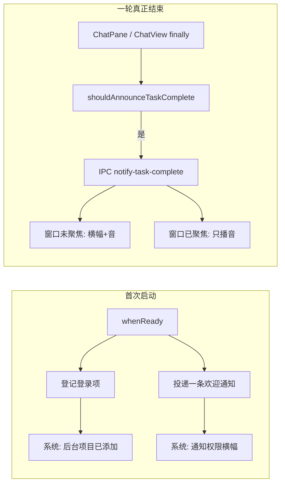

# Near Desktop 任务完成系统通知与后台登录项

Planned-with: Cursor Grok 4.6
Suggested-Impl-Model: Composer 2.5
Plan-Id: 2026-09-18-near-desktop-task-complete-notify

> **For implementer:** 使用 executing-plans，按 Task 顺序 TDD 落地。不要 commit，除非用户明确要求。改 `desktop/electron/main.ts` 时**只能精确增删目标行**，禁止整段覆盖相邻无关代码（该文件与 `agenticx/studio/server.py` 同类：误删一行就会让桌面端空态）。

**Goal:** 安装/首次启动后向系统登记通知权限与登录项（从而弹出系统「通知授权」和「后台项目已添加」横幅）；之后每次智能体一轮真正结束时，在右上角弹出系统通知并播放提示音。

**Architecture:** 渲染进程只在「这一轮真的结束」时调用一个纯函数做判定，再经 IPC 交给主进程发 `Notification` / 播系统音。登录项与首次授权全部放在主进程，配置写入 `~/.agenticx/config.yaml` 的 `automation:` 节。设置入口放在现有 Automation Tab「系统」区，不新开 Tab。

**Tech Stack:** Electron 34 `Notification` + `app.setLoginItemSettings`、现有 `automation` 配置 IPC、Vitest、i18n zh/en。不新增 npm 依赖，不打自定义音频二进制。

---

## 1. 根因与证据

当前仓库**没有**系统通知，也**没有**登录项：

| 能力 | 证据 |
|---|---|
| 系统通知 | `desktop/` 下无 `new Notification`、无 `Notification.requestPermission`、无 `NSUserNotificationAlertStyle` |
| 登录项 / 后台项目 | 无 `setLoginItemSettings` / `SMAppService` / LaunchAgent；`electron-builder.yml` 的 `mac` 节无 helper |
| 任务完成反馈 | `ChatPane.tsx` 在 SSE `final` / 群聊 `done` 后只更新气泡与 `idle`，无横幅、无提示音 |
| 已有「通知」 | `notifications.email` 是 SMTP；`native-say` 是 macOS `say` TTS，不能当完成叮一声 |

关窗口只是 `mainWindow.hide()`（`desktop/electron/main.ts` 约 6816–6820）+ 托盘。进程还在时通知可以发；**用户没先打开 Near / 重启后没登录项**时，不会有后台提醒，系统设置里也不会出现「登录项与扩展」条目。

同类桌面端的完成提示是 **OS Notification 横幅 + 系统提示音**，不是应用内 toast。



---

## 2. 产品行为（写死，禁止实施时再猜）

### 2.1 首次启动（安装后或本功能首次升级）

1. 把 Near 登记为登录项（macOS 13+ `type: "mainAppService"`，Windows `openAtLogin`）。系统因此弹出「后台项目已添加」。
2. 主进程 `show()` 一条欢迎系统通知（标题「Near 已就绪」，正文「任务完成后会在这里提醒你。」）。系统因此弹出通知权限横幅；用户允许后可能再看到这条欢迎内容，可接受。
3. 用户**手动**第一次打开时窗口正常显示（不要隐藏）。只有之后「登录时自动启动」才隐藏到托盘。
4. 用 `automation.notify_bootstrapped: true` 保证欢迎通知只发一次。登录项每次启动按当前开关重放，幂等。

### 2.2 任务完成

| 条件 | 横幅 | 提示音 |
|---|---|---|
| 开关关 | 不 | 不 |
| 窗口不可见或未聚焦，且通知开 | 是 | 随「提示音」开关 |
| 窗口可见且聚焦，且提示音开 | 不（默认） | 是 |
| 用户点停止 / abort / 队列里还有下一条续跑 | 不 | 不 |
| 可见正文为空或只剩思考占位 | 不 | 不 |

- 标题：`任务完成 · {会话标题或分身名或 Near}`，英文 `Task complete · {label}`。
- 正文：去掉 `<think>` / `<redacted_thinking>` 后压空白，截断 80 字，末尾加 `…`（仅截断时）。
- 点击横幅：显示并聚焦主窗口，切到对应 `paneId`；若该窗格 `sessionId` 不同再切会话。
- 1:1 / Meta：只在 `receivedFinalEvent === true` 时宣布。
- 群聊：只在 `receivedGroupDone === true`（SSE `done`）时宣布**一次**，不要每个成员气泡各弹一次。
- 定时任务：`onAutomationTaskProgress` 收到 `success` / `error` 时宣布（失败标题用「任务失败」）。
- 子智能体 `subagent` 完成、自动汇报 SSE、Focus Mode 语音轮次：**不**宣布。

### 2.3 设置（Automation Tab → 系统）

在现有「抑制系统睡眠」卡片**下方**再放三张同款卡片（开关样式跟 `PreventSleepToggle` 或 `SettingsSwitch` 一致，不要第三种控件）：

1. 任务完成时系统通知（默认开）
2. 任务完成时播放提示音（默认开）
3. 开机时自动启动并保持后台（默认开；关闭必须立刻 `setLoginItemSettings({ openAtLogin: false })`）

文案短，不要长备注。中英 key 必须成对，否则 `desktop/src/i18n/message-parity.test.ts` 会红。

---

## 3. 范围

### In scope

- `~/.agenticx/config.yaml` 的 `automation` 增字段 + 部分更新保存（不能让现有「只传 prevent_sleep」把新字段抹掉）。
- 主进程：登录项、欢迎通知、任务完成 Notification、无横幅时的系统提示音。
- 渲染：判定纯函数 + ChatPane / ChatView / App 定时任务三处挂钩。
- Automation「系统」区三枚新开关 + zh/en。
- macOS / Windows。Linux：Notification 照做；登录项可 no-op。

### Out of scope

- 自定义 wav/caf、新 npm 音频库、`native-say` TTS。
- 独立 helper / LaunchAgent / `LSUIElement` 无 Dock 助手。
- 应用内自绘右上角 toast 替代系统通知。
- 改 `notifications.email`、Enterprise、移动端。
- 重构 `ChatPane.tsx` / `ChatView.tsx` 的 send 循环。
- 窗口聚焦时也弹横幅（除非以后加 `notify_when_focused`，本次不做 UI）。
- Linux XDG autostart。
- FAQ 营销句「native notifications」的文档修订（可顺手一行，非必须）。

### no-scope-creep

每个 diff 必须能追溯到下面某条 FR。禁止顺手改托盘菜单、防休眠逻辑、SSE 解析、群聊路由。

---

## 4. 配置契约

`desktop/electron/main.ts` 现有：

```402:404:desktop/electron/main.ts
type AutomationConfig = {
  prevent_sleep: boolean;
};
```

```631:633:desktop/electron/main.ts
const DEFAULT_AUTOMATION_CONFIG: AutomationConfig = {
  prevent_sleep: false,
};
```

`desktop/src/global.d.ts` 约 124–126 有一份同名 type，必须同步。

**After（两处 type + DEFAULT 保持一致）：**

```ts
type AutomationConfig = {
  prevent_sleep: boolean;
  open_at_login: boolean;
  desktop_notify: boolean;
  desktop_sound: boolean;
  notify_bootstrapped: boolean;
};

const DEFAULT_AUTOMATION_CONFIG: AutomationConfig = {
  prevent_sleep: false,
  open_at_login: true,
  desktop_notify: true,
  desktop_sound: true,
  notify_bootstrapped: false,
};
```

`loadAutomationConfigFromAgx`（`main.ts` 约 657–666）对每个新字段用已有 `parseBooleanLoose(row.key, DEFAULT_AUTOMATION_CONFIG.key)`。旧配置缺 key 时：`open_at_login/desktop_notify/desktop_sound` 为 true，`notify_bootstrapped` 为 false。这样升级后第一次启动就会登记登录项并发欢迎通知。

`save-automation-config`（`main.ts` 约 9380–9404）**必须改成部分更新**。现在它假定 payload 一定带 `prevent_sleep`，`PreventSleepToggle` 只传这一项。After 伪代码：

```ts
const p = payload as Record<string, unknown>;
const merged = { ...loadAutomationConfigFromAgx(cfg) };
for (const key of [
  "prevent_sleep",
  "open_at_login",
  "desktop_notify",
  "desktop_sound",
  "notify_bootstrapped",
] as const) {
  if (p[key] !== undefined) {
    merged[key] = parseBooleanStrict(p[key], key);
  }
}
root.automation = { ...(prev object), ...merged };
saveAgxConfig(cfg);
applyPreventSleepFromConfig(cfg);
applyLoginItemFromConfig(merged); // 仅当本次写了 open_at_login，或每次都按 merged 重放均可
```

`preload.ts` 约 480 的 `saveAutomationConfig` 参数从 `{ prevent_sleep: boolean }` 改为 `Partial<AutomationConfig>`。`global.d.ts` 约 1033 同步。

---

## 5. 需求与验收

### FR-1 任务完成判定纯函数

- **AC-1:** `desktop/src/utils/desktop-task-notify.test.ts` 覆盖：abort / 队列续跑 / 空正文 / 思考占位 → 不宣布；1:1 有 `final`+可见正文 → 宣布；群聊只有 `final` 无 `done` → 不宣布；群聊 `done`+可见正文 → 宣布。
- **AC-2:** `decideNotifyPresentation`：未聚焦+通知开 → `{ showBanner: true, playSound: soundOn }`；聚焦+提示音开 → `{ showBanner: false, playSound: true }`；两开关都关 → 全 false。

### FR-2 主进程投递与提示音

- **AC-3:** IPC `notify-task-complete` 在 `showBanner` 时 `new Notification({ title, body, silent: !playSound })`；点击后 `showMainWindowSafely()` 并向渲染发 `desktop-notify:activate`。
- **AC-4:** 仅 `playSound` 时不弹横幅：macOS `afplay /System/Library/Sounds/Glass.aiff`；Windows `powershell -NoProfile -Command "[System.Media.SystemSounds]::Asterisk.Play()"`；Linux 找不到播放器则静默。禁止走 `native-say`。
- **AC-5:** title/body 长度上限：title ≤ 80，body ≤ 80；非法 payload 返回 `{ ok: false }` 且不抛。

### FR-3 首次启动两则系统提示

- **AC-6:** `notify_bootstrapped !== true` 时发欢迎通知一次，然后写成 true。
- **AC-7:** `open_at_login === true` 时 `setLoginItemSettings({ openAtLogin: true, openAsHidden: true, type: "mainAppService" })`（`type` 仅 `darwin`）；false 时 `openAtLogin: false`。Windows 另加 `args: ["--hidden"]`。
- **AC-8:** `wasOpenedAtLogin || argv 含 --hidden` 时不 `createSplashWindow()`、不 `revealMainWindowAfterSplash`；Dock / 托盘点击仍走现有 `activate` → `show()`。

### FR-4 对话与定时任务挂钩

- **AC-9:** Pro `ChatPane` 在 `finally` 里，仅当 `stillOwnsStream && !nextQueued && !abort` 且 `shouldAnnounceTaskComplete` 为真时 invoke 一次。
- **AC-10:** Lite `ChatView` 的 `finally`（约 2165 之后、`setStreaming(false)` 附近）同样挂钩；有 `nextQueued` 不宣布。
- **AC-11:** `App.tsx` `onAutomationTaskProgress` 在 `phase === "success" | "error"` 时宣布（失败用失败标题）。

### FR-5 设置与 i18n

- **AC-12:** Automation「系统」区能独立开关三项，保存失败保留原值并显示错误（对齐 `PreventSleepToggle`）。
- **AC-13:** `cd desktop && npx vitest run src/utils/desktop-task-notify.test.ts src/i18n/message-parity.test.ts` 全绿。
- **AC-14:** `cd desktop && npx tsc -p electron/tsconfig.json --noEmit` 通过。

### NFR

- 不新增依赖；不改 `server.py`；`ChatPane.tsx` 新增不超过约 25 行。
- 主进程不在日志里打印会话正文全文（最多 debug 截断 40 字）。

---

## 6. 推荐实施模型

| 子任务 | Suggested-Impl-Model | 理由 |
|---|---|---|
| Task 1 纯函数 + 测试 | Composer 2.5 | 无 UI、无跨栈 |
| Task 2–3 主进程模块 + IPC + 部分保存 | Composer 2.5 | 样板清晰；`main.ts` 只加调用点 |
| Task 4 设置三开关 | Composer 2.5 | 复制 `PreventSleepToggle` |
| Task 5 对话/定时挂钩 | Composer 2.5 | 只加调用，禁止重构 sendChat |
| Task 6 登录隐藏启动 | Composer 2.5；若和 splash 时序打架再换代码专精中档 | 唯一高回归点 |

整体 Suggested-Impl-Model：**Composer 2.5**。

---

## 7. 实施任务

### Task 1: 判定与文案纯函数（先写红测试）

**Files:**
- Create: `desktop/src/utils/desktop-task-notify.ts`
- Create: `desktop/src/utils/desktop-task-notify.test.ts`
- Reuse: `desktop/src/utils/stream-overlay-policy.ts` 的 `stripThinkingTags` / `isThinkingPlaceholderText`

**Step 1: 写失败测试**

```ts
import { describe, expect, it } from "vitest";
import {
  shouldAnnounceTaskComplete,
  decideNotifyPresentation,
  formatTaskNotifyTitle,
  formatTaskNotifyBody,
} from "./desktop-task-notify";

describe("shouldAnnounceTaskComplete", () => {
  const base = {
    aborted: false,
    hasQueuedFollowup: false,
    isGroupPane: false,
    receivedFinalEvent: true,
    receivedGroupDone: false,
    text: "你好，任务已完成。",
  };

  it("announces a 1:1 final with visible text", () => {
    expect(shouldAnnounceTaskComplete(base)).toBe(true);
  });

  it("skips abort, queued follow-up, empty, and think-only", () => {
    expect(shouldAnnounceTaskComplete({ ...base, aborted: true })).toBe(false);
    expect(shouldAnnounceTaskComplete({ ...base, hasQueuedFollowup: true })).toBe(false);
    expect(shouldAnnounceTaskComplete({ ...base, text: "   " })).toBe(false);
    expect(shouldAnnounceTaskComplete({ ...base, text: "<think>secret</think>" })).toBe(false);
  });

  it("announces group only on done", () => {
    expect(shouldAnnounceTaskComplete({
      ...base, isGroupPane: true, receivedFinalEvent: true, receivedGroupDone: false,
    })).toBe(false);
    expect(shouldAnnounceTaskComplete({
      ...base, isGroupPane: true, receivedFinalEvent: false, receivedGroupDone: true,
    })).toBe(true);
  });
});

describe("decideNotifyPresentation", () => {
  it("banners when unfocused; sound-only when focused", () => {
    expect(decideNotifyPresentation({
      desktopNotify: true, desktopSound: true, windowFocusedAndVisible: false,
    })).toEqual({ showBanner: true, playSound: true });
    expect(decideNotifyPresentation({
      desktopNotify: true, desktopSound: true, windowFocusedAndVisible: true,
    })).toEqual({ showBanner: false, playSound: true });
  });
});
```

再补 `formatTaskNotifyTitle` / `formatTaskNotifyBody`：截断 80、去 think、空白压缩。

**Step 2:** `cd desktop && npx vitest run src/utils/desktop-task-notify.test.ts` → FAIL（模块不存在）。

**Step 3: 最小实现**

```ts
import { isThinkingPlaceholderText, stripThinkingTags } from "./stream-overlay-policy";

export const TASK_NOTIFY_TEXT_LIMIT = 80;

export function visibleNotifyText(text: string): string {
  const stripped = stripThinkingTags(text).replace(/\s+/g, " ").trim();
  if (!stripped || isThinkingPlaceholderText(stripped)) return "";
  return stripped;
}

export function shouldAnnounceTaskComplete(input: {
  aborted: boolean;
  hasQueuedFollowup: boolean;
  isGroupPane: boolean;
  receivedFinalEvent: boolean;
  receivedGroupDone: boolean;
  text: string;
}): boolean {
  if (input.aborted || input.hasQueuedFollowup) return false;
  if (!visibleNotifyText(input.text)) return false;
  return input.isGroupPane ? input.receivedGroupDone : input.receivedFinalEvent;
}

export function decideNotifyPresentation(input: {
  desktopNotify: boolean;
  desktopSound: boolean;
  windowFocusedAndVisible: boolean;
}): { showBanner: boolean; playSound: boolean } {
  const playSound = input.desktopSound;
  const showBanner = input.desktopNotify && !input.windowFocusedAndVisible;
  return { showBanner, playSound };
}

export function clipNotifyText(text: string, limit = TASK_NOTIFY_TEXT_LIMIT): string {
  if (text.length <= limit) return text;
  return `${text.slice(0, Math.max(0, limit - 1))}…`;
}

export function formatTaskNotifyTitle(kind: "success" | "error", label: string, locale: "zh" | "en"): string {
  const prefix = kind === "error"
    ? (locale === "en" ? "Task failed" : "任务失败")
    : (locale === "en" ? "Task complete" : "任务完成");
  const name = (label || "Near").trim() || "Near";
  return clipNotifyText(`${prefix} · ${name}`);
}

export function formatTaskNotifyBody(text: string): string {
  return clipNotifyText(visibleNotifyText(text));
}
```

**Step 4:** 同 vitest 命令 → PASS。

---

### Task 2: 主进程模块（新文件，main.ts 只接线）

**Files:**
- Create: `desktop/electron/desktop-notify.ts`
- Create: `desktop/tests/desktop-notify-main.test.ts`（只测纯函数：payload 校验、登录项 options 构造、是否 hidden start；**不要**在单测里真 `new Notification`）
- Modify: `desktop/electron/main.ts` 顶部 import **只加一行** `Notification` 到现有 electron import 列表（约 1–17 行），并 `import { ... } from "./desktop-notify"`。

把下面逻辑全部放进 `desktop-notify.ts`，禁止把 Notification 实现写进 `main.ts`。

导出：

```ts
export type TaskCompleteNotifyPayload = {
  title?: unknown;
  body?: unknown;
  paneId?: unknown;
  sessionId?: unknown;
  showBanner?: unknown;
  playSound?: unknown;
};

export function parseTaskCompleteNotifyPayload(raw: unknown): {
  ok: true;
  title: string;
  body: string;
  paneId: string;
  sessionId: string;
  showBanner: boolean;
  playSound: boolean;
} | { ok: false; error: string };

export function buildLoginItemSettings(input: {
  openAtLogin: boolean;
  platform: NodeJS.Platform;
}): Electron.Settings;

export function shouldStartHidden(input: {
  argv: string[];
  wasOpenedAtLogin: boolean;
  wasOpenedAsHidden?: boolean;
}): boolean;

export function playCompletionSound(execFileFn: typeof import("node:child_process").execFile, platform: NodeJS.Platform): void;

export function deliverTaskCompleteNotification(opts: {
  NotificationCtor: typeof Electron.Notification;
  payload: ReturnType<typeof parseTaskCompleteNotifyPayload> & { ok: true };
  onClick: () => void;
}): void;
```

登录项 options 必须是：

```ts
// darwin + openAtLogin true
{ openAtLogin: true, openAsHidden: true, type: "mainAppService" }

// win32 + openAtLogin true
{ openAtLogin: true, args: ["--hidden"] }

// 任一平台 + openAtLogin false
{ openAtLogin: false }
```

`shouldStartHidden`：`argv.includes("--hidden") || wasOpenedAtLogin || wasOpenedAsHidden === true`。

`playCompletionSound`：见 AC-4。`execFile` 出错只 `console.warn`，不 throw。

欢迎通知文案用 `resolveMenuLocale` 的调用方传入 `{ title, body }`，本模块不读 i18n JSON。

**main.ts 接线（精确行）：**

1. import 区加 `Notification` 与 `./desktop-notify`。
2. 在 `applyPreventSleepFromConfig` 旁新增 `applyLoginItemFromConfig(cfg)`，内部 `app.setLoginItemSettings(buildLoginItemSettings({ openAtLogin, platform: process.platform }))`。包在 try/catch，失败 `console.warn`。
3. `save-automation-config` 成功后调用 `applyLoginItemFromConfig`。
4. `app.whenReady()` 里、`createSplashWindow()`（约 12576）**之前**：

```ts
const presence = loadAutomationConfigFromAgx(loadAgxConfig());
const loginInfo = app.getLoginItemSettings();
const startHidden = shouldStartHidden({
  argv: process.argv,
  wasOpenedAtLogin: Boolean(loginInfo.wasOpenedAtLogin),
  wasOpenedAsHidden: Boolean((loginInfo as { wasOpenedAsHidden?: boolean }).wasOpenedAsHidden),
});
applyLoginItemFromConfig(loadAgxConfig());
if (!presence.notify_bootstrapped) {
  // 见 Task 3 的 bootstrapWelcomeNotification
}
if (!startHidden) {
  createSplashWindow();
}
```

5. `revealMainWindowAfterSplash` 的调用方：若 `startHidden`，跳过 reveal，只 `createTray()`（托盘本就在后面创建）。窗口保持 `show: false`。
6. 用模块级 `let startHidden = false` 供后续 reveal 判断；不要复制多份 argv 解析。

`whenReady` 里现有「必须先 registerIpc 再等 serve」注释不要动。

---

### Task 3: IPC + 欢迎通知 + 点击回跳

**Files:**
- Modify: `desktop/electron/main.ts` `registerIpc`（或 `registerEarlyIpc`，推荐 **early**，渲染启动就能发）
- Modify: `desktop/electron/preload.ts`（`loadAutomationConfig` 旁）
- Modify: `desktop/src/global.d.ts`
- Modify: `desktop/src/App.tsx`（已有 `onStudioReady` / `onAutomationTaskProgress` 的同一类 `useEffect` 区，约 980 / 2264）

**IPC 名（写死）：**

- `notify-task-complete`：渲染 → 主进程。
- `desktop-notify:activate`：主进程 → 渲染（`webContents.send`）。

preload：

```ts
notifyTaskComplete: async (payload: {
  title: string;
  body: string;
  paneId?: string;
  sessionId?: string;
  showBanner: boolean;
  playSound: boolean;
}) => ipcRenderer.invoke("notify-task-complete", payload),

onDesktopNotifyActivate: (cb: (payload: { paneId?: string; sessionId?: string }) => void) => {
  const listener = (_e: unknown, payload: { paneId?: string; sessionId?: string }) => cb(payload);
  ipcRenderer.on("desktop-notify:activate", listener);
  return () => ipcRenderer.removeListener("desktop-notify:activate", listener);
},
```

handler：

```ts
ipcMain.handle("notify-task-complete", async (_event, raw: unknown) => {
  const parsed = parseTaskCompleteNotifyPayload(raw);
  if (!parsed.ok) return parsed;
  if (!parsed.showBanner && !parsed.playSound) return { ok: true, skipped: true };
  if (parsed.showBanner) {
    deliverTaskCompleteNotification({
      NotificationCtor: Notification,
      payload: parsed,
      onClick: () => {
        showMainWindowSafely();
        if (mainWindow && !mainWindow.isDestroyed()) {
          mainWindow.webContents.send("desktop-notify:activate", {
            paneId: parsed.paneId,
            sessionId: parsed.sessionId,
          });
        }
      },
    });
  } else if (parsed.playSound) {
    playCompletionSound(execFile, process.platform);
  }
  return { ok: true };
});
```

`App.tsx` 激活监听：

```ts
const off = window.agenticxDesktop.onDesktopNotifyActivate?.((payload) => {
  const paneId = String(payload.paneId ?? "").trim();
  const sessionId = String(payload.sessionId ?? "").trim();
  if (paneId) useAppStore.getState().setActivePaneId(paneId);
  if (paneId && sessionId) {
    const pane = useAppStore.getState().panes.find((p) => p.id === paneId);
    if (pane && (pane.sessionId || "").trim() !== sessionId) {
      useAppStore.getState().setPaneSessionId(paneId, sessionId);
    }
  }
  void window.agenticxDesktop /* 无需再 show，主进程已 show */;
});
```

`setPaneSessionId` 若实际名字不同，以 `store.ts` 现有 API 为准（约 715 行附近），不要新造 store action。

欢迎通知（仅 bootstrap 一次）：

```ts
const n = new Notification({
  title: locale === "en" ? "Near is ready" : "Near 已就绪",
  body: locale === "en"
    ? "You'll get a banner here when a task finishes."
    : "任务完成后会在这里提醒你。",
  silent: true,
});
n.show();
```

然后写回 `notify_bootstrapped: true`（走与 `saveAgxConfig` 相同路径，保留其它 automation 字段）。`silent: true` 避免首次启动再叮一声；权限横幅仍会出现。

可选：`desktop/electron-builder.yml` 与 `desktop/electron-builder.signing.yml` 的 `mac:` 下增加（没有也不阻塞功能）：

```yml
extendInfo:
  NSUserNotificationAlertStyle: banner
```

两份 yml 都要加，避免 CI 签名配置丢字段。

---

### Task 4: Automation「系统」区三开关

**Files:**
- Modify: `desktop/src/components/automation/AutomationTab.tsx`
- Modify: `desktop/locales/zh/workspace.json` 的 `automation`（约 349 行后）
- Modify: `desktop/locales/en/workspace.json` 的 `automation`

不要把三开关塞进 `PreventSleepToggle`。抽一个本地 `AutomationFlagToggle`（同文件即可）或复制三份小组件，字段：

| i18n key | 配置字段 | 默认 |
|---|---|---|
| `automation.desktopNotify` / `Hint` / `On` / `Off` | `desktop_notify` | true |
| `automation.desktopSound` / `Hint` / `On` / `Off` | `desktop_sound` | true |
| `automation.openAtLogin` / `Hint` / `On` / `Off` | `open_at_login` | true |

中文建议：

- 系统通知：`任务完成时系统通知` / `窗口在后台时，在屏幕右上角弹出完成提醒。`
- 提示音：`任务完成时播放提示音` / `一轮结束后播放系统提示音；窗口在前台时只出声、不弹横幅。`
- 开机启动：`开机时自动启动并保持后台` / `登录后在托盘保持运行，以便任务完成时仍能提醒。可在系统「登录项与扩展」里关闭。`

`PreventSleepToggle` 的 `saveAutomationConfig({ prevent_sleep: next })` **不要改成传全量**，用来验证部分更新。

`Panel title={t("automation.system")}` 内顺序：睡眠 → 通知 → 提示音 → 开机启动。

跑：`cd desktop && npx vitest run src/i18n/message-parity.test.ts`。

---

### Task 5: ChatPane / ChatView / 定时任务挂钩

**Files:**
- Modify: `desktop/src/components/ChatPane.tsx`（`finally` 约 12335 `if (nextQueued)` **之前**，且仅在 `stillOwnsStream` 已算出 `nextQueued` 之后）
- Modify: `desktop/src/components/ChatView.tsx`（`finally` 约 2165–2217，`nextQueued` 判定之后）
- Modify: `desktop/src/App.tsx`（`onAutomationTaskProgress` 约 2264，`phase` 为 success/error 的分支）

**ChatPane 插入（意图，不要把 sendChat  extraced）：**

```ts
if (
  stillOwnsStream &&
  shouldAnnounceTaskComplete({
    aborted: abortController.signal.aborted,
    hasQueuedFollowup: Boolean(nextQueued),
    isGroupPane,
    receivedFinalEvent,
    receivedGroupDone: receivedDoneEvent,
    text: full,
  })
) {
  const locale = i18n.language?.startsWith("en") ? "en" : "zh";
  const label = (pane.title || pane.avatarName || "Near").trim();
  const windowFocusedAndVisible = typeof document !== "undefined"
    && document.visibilityState === "visible"
    && document.hasFocus();
  // 配置：启动时读一次 + 发通知前再读 loadAutomationConfig，失败则用默认全开
  void announceDesktopTaskComplete({
    kind: "success",
    label,
    text: full,
    paneId: pane.id,
    sessionId: requestSessionId,
    windowFocusedAndVisible,
    locale,
  });
}
```

把 `announceDesktopTaskComplete` 放在 `desktop/src/utils/desktop-task-notify.ts`，内部：

1. `window.agenticxDesktop?.loadAutomationConfig?.()`
2. `decideNotifyPresentation`
3. `notifyTaskComplete`（无 desktop API 则 no-op，避免纯网页故事书崩）

禁止在 `ChatPane` 里内联 IPC 细节。

**ChatView：** Lite 用当前 `sessionId`；`paneId` 若组件拿得到当前 pane 就传，否则传空字符串（点击只聚焦窗口）。

**定时任务：**

```ts
if (payload.phase === "success" || payload.phase === "error") {
  void announceDesktopTaskComplete({
    kind: payload.phase === "error" ? "error" : "success",
    label: String(payload.taskName ?? payload.taskId ?? "Near"),
    text: payload.phase === "error" ? "定时任务执行失败" : "定时任务已完成",
    paneId: paneId ?? "",
    sessionId: sid,
    windowFocusedAndVisible: document.visibilityState === "visible" && document.hasFocus(),
    locale: i18n.language?.startsWith("en") ? "en" : "zh",
  });
}
```

`taskName` 若 progress payload 没有，用 `taskId`。不要为了标题去改主进程 scheduler。

---

### Task 6: 隐藏启动与自测清单

**Files:**
- Modify: `desktop/electron/main.ts` `whenReady` / `revealMainWindowAfterSplash` 调用点（约 12576、1900、6761）
- 不改 splash 实现本身，只是 hidden 时不创建。

核对：

1. 普通 `npm run dev`：仍有 splash，主窗口出现，**不会**因为 `open_at_login` 默认 true 就藏窗（`wasOpenedAtLogin` 在 dev 下一般是 false）。
2. 若 dev 误藏窗口：`shouldStartHidden` 在 `!app.isPackaged && !argv.includes("--hidden")` 时强制 false。**必须写进 `shouldStartHidden`：**

```ts
export function shouldStartHidden(input: {
  argv: string[];
  wasOpenedAtLogin: boolean;
  wasOpenedAsHidden?: boolean;
  isPackaged: boolean;
}): boolean {
  if (!input.isPackaged && !input.argv.includes("--hidden")) return false;
  return input.argv.includes("--hidden") || input.wasOpenedAtLogin || input.wasOpenedAsHidden === true;
}
```

3. 改完 `main.ts` 后按仓库惯例：本地可起 `agx serve` 不是本任务强制项（没改 server.py），但 `cd desktop && npm run build`（或至少 `tsc -p electron/tsconfig.json`）必须过。

---

## 8. 实施者自测

1. `cd desktop && npx vitest run src/utils/desktop-task-notify.test.ts tests/desktop-notify-main.test.ts src/i18n/message-parity.test.ts`
2. `cd desktop && npx tsc -p electron/tsconfig.json --noEmit`
3. 打包或至少 Electron 真机：
   - 把 `~/.agenticx/config.yaml` 里 `automation.notify_bootstrapped` 删掉（或整节 automation 删掉）后启动 → 应出现系统通知权限提示；macOS 还应出现「后台项目已添加」。
   - 系统设置 → 通知 里能看到 Near；登录项与扩展里能看到 Near。
   - 开一个对话，把窗口切到别的应用，等一轮结束 → 右上角横幅 + 声音；标题含「任务完成」。
   - 窗口留在 Near 前台再跑一轮 → **不应**再弹横幅，但应有提示音。
   - 点停止 → 无横幅无声。
   - 关通知开关 → 无横幅；关提示音 → 无声。
   - 关开机启动 → 登录项消失或变为关闭；再开回来能重新登记。
4. 点横幅能回到对应窗格。
5. 群聊一轮只弹一次。

浏览器工具验不了系统通知，以真机 / `npm run dev` 为准。

---

## 9. 关键落点速查

| 动作 | 路径 |
|---|---|
| 判定 / 文案 / announce 封装 | `desktop/src/utils/desktop-task-notify.ts` |
| 主进程投递 / 登录项 / 音 | `desktop/electron/desktop-notify.ts` |
| 配置 type 与部分保存 | `desktop/electron/main.ts` 402、631、657、9380；`desktop/src/global.d.ts` 124、1032 |
| IPC 暴露 | `desktop/electron/preload.ts` 479 附近 |
| 挂钩 | `ChatPane.tsx` finally ~12335；`ChatView.tsx` finally ~2165；`App.tsx` ~2264 |
| 设置 | `AutomationTab.tsx` 的 System `Panel`（约 191） |
| 文案 | `desktop/locales/{zh,en}/workspace.json` `automation.*` |
| 打包可选 | `desktop/electron-builder.yml` / `electron-builder.signing.yml` `mac.extendInfo` |

---

## 10. Commit 提示（仅当用户要求提交时）

Subject 用产品内中性描述，例如 `feat(desktop): announce finished turns with system banner and sound`。

Trailer：

```
Plan-Id: 2026-09-18-near-desktop-task-complete-notify
Plan-File: .cursor/plans/2026-09-18-near-desktop-task-complete-notify.plan.md
Plan-Model: Cursor Grok 4.6
Impl-Model: <实施时由用户确认，禁止编造>
Made-with: Damon Li
```

实施开始前先把本文件从 `.cursor/plans/pending/` **移回** `.cursor/plans/` 根目录，再开分支。
