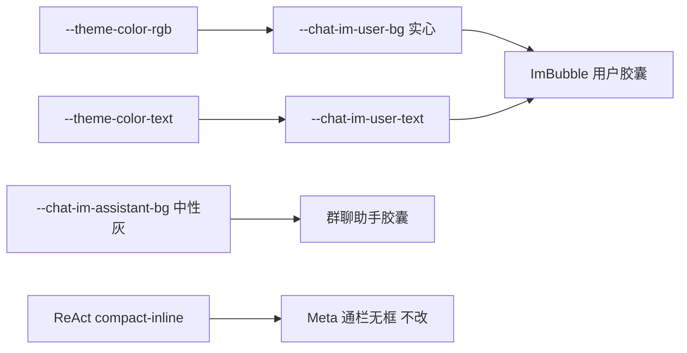

# Near IM 实心 theme-color 气泡

Planned-with: cursor-grok-4.6

Suggested-Impl-Model: Composer 2.5（token + 既有 ImBubble 类名，视觉数值已写死，不必顶配审美模型）

> **For implementer:** 只改本 plan 列出的路径。禁止 `npx shadcn add`、禁止引入 `@base-ui/react`、禁止重写 `MessageRenderer` / ReAct 轨道。

**Goal:** 用户气泡变成当前强调色的实心胶囊（字色用已有 `--theme-color-text`）；群聊助手气泡变成中性实心灰胶囊。Meta 单聊 ReAct 通栏正文保持无框。

**Architecture:** 视觉语法从 Kobra `Conversation` 抄半径与连发收角，颜色继续走 Near `--theme-color-rgb`，不拷贝 `#0a7cff`。改 token 与 `ImBubble` 表面 class，不换消息协议。

**Tech Stack:** Desktop React + 现有 CSS 变量（`desktop/src/index.css` + `styles/themes/{dark,dim,light}.css`）+ Vitest `renderToStaticMarkup`。



## 子规划 → 推荐模型

| 子任务 | 推荐模型 | 理由 |
|---|---|---|
| FR-1 token | Composer 2.5 | 改 CSS 变量，无协议风险 |
| FR-2 几何 / 连发 | Composer 2.5 | 类名 + 一行 `data-im-align` |
| FR-3 chip 对比 | Composer 2.5 | 已有选择器，只改混色源 |
| FR-4 测试 | Composer 2.5 | 静态 HTML / 读 CSS 断言 |

## In scope

- [`desktop/src/index.css`](desktop/src/index.css) 里 `--chat-im-user-bg` 的 `data-theme-color` 覆盖（约 796–801、1010–1017 行）以及用户气泡表面 / chip 选择器。
- [`desktop/src/styles/themes/dark.css`](desktop/src/styles/themes/dark.css)、[`dim.css`](desktop/src/styles/themes/dim.css)、[`light.css`](desktop/src/styles/themes/light.css) 的 `--chat-im-user-*` / `--chat-im-assistant-bg`。
- [`desktop/src/components/messages/ImBubble.tsx`](desktop/src/components/messages/ImBubble.tsx) 用户气泡 class（约 803 行）与群聊助手气泡 class（约 924 行）。
- [`desktop/src/components/ChatPane.tsx`](desktop/src/components/ChatPane.tsx) `renderGroupedRow` 消息行根节点（约 8423 行）加 `data-im-align`。
- [`desktop/src/components/CollabRoomPanel.tsx`](desktop/src/components/CollabRoomPanel.tsx) 自己气泡字色（约 470 行）改跟 `--chat-im-user-text`，避免实心底上用 `text-text-strong` 翻车。
- [`desktop/src/components/messages/ImBubble.test.tsx`](desktop/src/components/messages/ImBubble.test.tsx) + 新建 token 回归测试。

## Out of scope

- 安装 `@kobra/conversation` / shadcn / Base UI。
- 把用户气泡锁成 iMessage `#0a7cff`。
- Meta 单聊 ReAct（`assistantVisual` 为 `compact-inline*` 或 `noBubbleBorder`）给助手加灰胶囊。通栏无框是既有产品选择，本 plan 不推翻。
- `SystemStatusLine` / `ToolCallCard` 改成图里那种工具小胶囊（下一刀再做）。
- 改 `.agx-im-user-stack` / `.agx-im-user-actions` 几何（[`desktop/DESIGN.md`](desktop/DESIGN.md)「User message action bar」已锁定）。
- 改 composer、输入区 chip、`MessageRenderer` 路由、`server.py`。
- `chatStyle === "terminal" | "clean"`。
- 未引用的 [`UserBubble.tsx`](desktop/src/components/messages/UserBubble.tsx) / [`AssistantBubble.tsx`](desktop/src/components/messages/AssistantBubble.tsx)（token 变了会自动吃到颜色，不要顺手重写）。

## 根因与证据

用户气泡现在是 **tint**，不是实心：

```796:801:desktop/src/index.css
:root[data-theme-color] {
  --chat-im-user-bg: rgba(var(--theme-color-rgb), 0.15);
  --chat-im-user-border: rgba(var(--theme-color-rgb), 0.16);
```

light / dim 再次压低透明度（`index.css` 1010–1017：`0.22` / `0.4`）。三态主题文件还写死了绿 tint / 深色近白底：

```26:28:desktop/src/styles/themes/dark.css
  --chat-im-user-bg: rgba(255, 255, 255, 0.07);
  --chat-im-user-border: rgba(255, 255, 255, 0.06);
  --chat-im-user-text: var(--text-strong);
```

```26:28:desktop/src/styles/themes/light.css
  --chat-im-user-bg: rgba(34, 197, 94, 0.22);
  --chat-im-user-text: #0b3b21;
```

`ImBubble` 用户表面用这些 token，圆角是 `rounded-xl` + `rounded-tr-[4px]`（约 803 行），不是胶囊。助手 Meta 默认 `background: transparent`（约 337–341 行）；群聊才有 `agx-im-group-bubble` + `--chat-im-group-bg`。

已有对比色：`--theme-color-text`（`index.css` 771–794）。`white` 强调色在 dark 是白底深字，light 翻成深底白字。实心填充必须跟它走，不能继续用 light 的 `#0b3b21`。

Kobra 几何（内部对照，commit 文案不要写品牌名）：内容 `rounded-[18px]`；sent 右下 `8px`；received 左下 `8px`；同侧下一条再收近上角 `8px`。收到色是中性灰 `#3b3b3d`（暗）/ `#e9e9eb`（亮），**不是** theme-color。

---

## FR-1 用户气泡实心 theme-color

**落点**

1. [`desktop/src/index.css`](desktop/src/index.css) `:root[data-theme-color]`（796 行）以及 light/dim 覆盖（1010–1017 行）。
2. [`dark.css`](desktop/src/styles/themes/dark.css) / [`dim.css`](desktop/src/styles/themes/dim.css) / [`light.css`](desktop/src/styles/themes/light.css) 的 `--chat-im-user-bg` / `--chat-im-user-text` / `--chat-im-user-border`。

**Before**

```css
--chat-im-user-bg: rgba(var(--theme-color-rgb), 0.15);
--chat-im-user-text: /* 主题文件写死绿字或 text-strong */
```

**After（意图）**

```css
:root[data-theme-color] {
  --chat-im-user-bg: rgb(var(--theme-color-rgb));
  --chat-im-user-text: var(--theme-color-text);
  --chat-im-user-border: transparent;
}

:root[data-theme="light"][data-theme-color],
:root[data-theme="dim"][data-theme-color] {
  /* 删除 0.22 / 0.4 的 tint 覆盖，继承实心 */
}
```

三态主题文件里把 `--chat-im-user-bg` / `--chat-im-user-text` 改成同样两行（或删掉，让 `data-theme-color` 块成为唯一来源）。**不要**在没有 `data-theme-color` 时留下旧的绿 tint 当默认；无强调色时回落到现有 blue 默认 `59, 130, 246`（`index.css` 已有）。

`--chat-im-assistant-bg` 同时改成 Kobra 中性实心，供群聊气泡使用：

| 主题 | `--chat-im-assistant-bg` | `--chat-im-assistant-text` |
|---|---|---|
| dark / dim | `#3b3b3d` | `#ffffff` |
| light | `#e9e9eb` | `#000000` |

群聊 [`ImBubble.tsx` 约 933–938 行](desktop/src/components/messages/ImBubble.tsx) 把 `background: var(--chat-im-group-bg)` 改成 `var(--chat-im-assistant-bg)`，`color` 继续 `var(--chat-im-assistant-text)`。不要改 `--chat-im-group-bg` 本身（别处可能当卡片底）。

**CollabRoomPanel** 约 470 行：`text-text-strong` → `text-[var(--chat-im-user-text)]`。只改自己气泡这一支。

**AC-1**

- 文件 [`desktop/src/components/messages/im-bubble-tokens.test.ts`](desktop/src/components/messages/im-bubble-tokens.test.ts)（新建）：`fs.readFileSync` 读上述 CSS，断言：
  - `index.css` 的 `:root[data-theme-color]` 块含 `--chat-im-user-bg: rgb(var(--theme-color-rgb))` 与 `--chat-im-user-text: var(--theme-color-text)`。
  - 同一文件 **没有** `--chat-im-user-bg: rgba(var(--theme-color-rgb), 0.15)` / `0.22` / `0.4`。
  - `dark.css` / `dim.css` 含 `--chat-im-assistant-bg: #3b3b3d`；`light.css` 含 `#e9e9eb`。
- `npx vitest run src/components/messages/im-bubble-tokens.test.ts`（在 `desktop/`）绿。

---

## FR-2 胶囊几何 + 同侧连发

**落点**

1. [`desktop/src/index.css`](desktop/src/index.css) `.agx-im-user-bubble`（1001–1004 行）与 `.agx-im-group-bubble`（16–20 行）。
2. [`ImBubble.tsx`](desktop/src/components/messages/ImBubble.tsx) 约 803、924 行 className。
3. [`ChatPane.tsx`](desktop/src/components/ChatPane.tsx) `renderGroupedRow` 约 8423 行消息行 `<div>`。

**Before（用户气泡 class，约 803 行）**

```tsx
className="agx-im-user-bubble relative min-w-0 max-w-full rounded-xl border-0 px-3.5 py-2.5 text-[var(--agx-chat-im-body-font-size)] leading-relaxed rounded-tr-[4px]"
```

**After**

```tsx
className="agx-im-user-bubble relative min-w-0 max-w-full border-0 px-3.5 py-2.5 text-[var(--agx-chat-im-body-font-size)] leading-relaxed"
```

圆角只放 CSS，避免 Tailwind 与 CSS 抢 `border-radius`：

```css
.agx-im-user-bubble {
  border: none;
  box-shadow: none;
  border-radius: 18px;
  border-bottom-right-radius: 8px;
}

.agx-im-group-bubble {
  border: none;
  box-shadow: none;
  box-sizing: border-box;
  border-radius: 18px;
  border-bottom-left-radius: 8px;
}

[data-im-align="end"] + [data-im-align="end"] .agx-im-user-bubble {
  border-top-right-radius: 8px;
}

[data-im-align="start"] + [data-im-align="start"] .agx-im-group-bubble {
  border-top-left-radius: 8px;
}
```

`renderGroupedRow` 在 `row.kind === "message"` 的根 `<div>`（现有 `data-message-id` 那个）加上：

```tsx
data-im-align={message.role === "user" ? "end" : message.role === "assistant" ? "start" : undefined}
```

中间插入 `tool_group` 会打断相邻选择器，这是预期：工具卡两侧不算连发。

**不要动** `USER_BUBBLE_GUTTER_PX`、`.agx-im-user-stack`、`.agx-im-user-actions`。

Meta ReAct：`noBubbleBorder` / `compact-inline*` 路径保持 `background: transparent`（`ImBubble.tsx` 337–341、917–922 行）。不要给这条路径加 `agx-im-group-bubble`。

**AC-2**

- [`ImBubble.test.tsx`](desktop/src/components/messages/ImBubble.test.tsx)「keeps owner user rows labeled as me」：断言 HTML 含 `agx-im-user-bubble`，**不含** `rounded-tr-[4px]` 与 `rounded-xl`。
- 同文件群聊用例：继续有 `agx-im-group-bubble`；Meta 单聊用例继续 **没有** `agx-im-group-bubble`。
- `npx vitest run src/components/messages/ImBubble.test.tsx` 绿。

---

## FR-3 实心底上的 chip 对比

**落点：** [`desktop/src/index.css`](desktop/src/index.css) `.agx-im-user-bubble .agx-composer-inline-chip`（867–917 行）。

**Before：** chip 字色 `color-mix(..., var(--chat-im-user-text), var(--text-faint))`。`--text-faint` 是页面浅灰，实心绿/粉底上会脏。

**After：** 只跟 `--chat-im-user-text` 与透明混：

```css
.agx-im-user-bubble .agx-composer-inline-chip {
  background: color-mix(in srgb, var(--chat-im-user-text) 16%, transparent);
  border-color: color-mix(in srgb, var(--chat-im-user-text) 22%, transparent);
  color: color-mix(in srgb, var(--chat-im-user-text) 88%, transparent);
}
```

name / meta / lines 同样只 mix `var(--chat-im-user-text)`，不要再引入 `--text-faint` / `--text-muted`。

**AC-3**

- `im-bubble-tokens.test.ts` 断言 `.agx-im-user-bubble .agx-composer-inline-chip` 规则里 **没有** `var(--text-faint)` / `var(--text-muted)`。

---

## FR-4 手工验收（实施者自测，不写 e2e）

在 `desktop/` 跑：

```bash
npx vitest run src/components/messages/ImBubble.test.tsx src/components/messages/im-bubble-tokens.test.ts
```

然后 `npm run dev`（Vite 5713）：

1. dark + blue / green / pink：用户气泡是实心强调色，字是 `--theme-color-text`（通常白）。
2. dark + white 强调色：用户气泡近白，字深（`#0f172a`）。
3. light + 任一强调色：实心底 + 对应 `--theme-color-text`，不是旧的淡绿 tint。
4. 群聊助手：中性灰胶囊，不是 theme-color。
5. Meta 单聊带工具的 ReAct 回复：助手正文仍无框，用户气泡已是实心胶囊。
6. 用户气泡下方复制/引用栏仍与气泡同宽右对齐（DESIGN.md 锁定项）。

## 实施顺序

1. 先写 `im-bubble-tokens.test.ts`（红）→ 改 CSS token（绿）。
2. 改 `ImBubble` class + `ChatPane` `data-im-align` + 几何 CSS。
3. 改 chip 混色。
4. 跑 Vitest；按 FR-4 看一眼三态。

不要顺手格式化无关 CSS，不要改 `server.py`。
