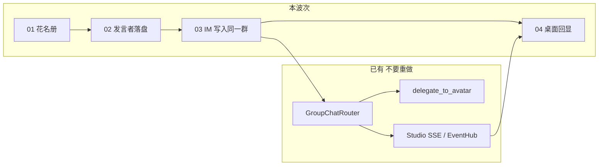
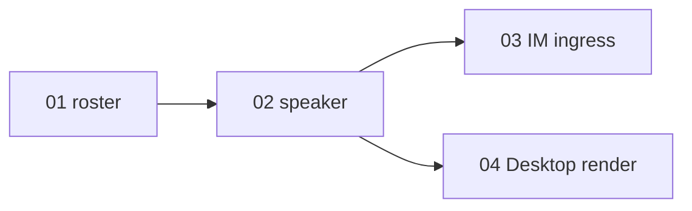

# Near 多人房间接入（第二个真人）主计划

Planned-with: Cursor Grok 4.6
Suggested-Impl-Model: 见第 3 节表。默认 Composer 2.5。
Plan-Id: 2026-09-18-near-multi-human-room-master

> **For implementer:** 本文件只定边界与顺序，**禁止据此一次性改代码**。每次只把一个子计划从 `.cursor/plans/pending/` 移到 `.cursor/plans/` 根目录，按该子计划 TDD 做完并通过 Go/No-Go，再开下一项。不要 commit，除非用户明确要求。

**Goal:** 在**不重做**已有「1 人 + N 分身」群聊的前提下，让第二个真人能进入同一条群会话，并被历史/气泡区分出来。

**Architecture:** 房间成员表与发言者字段先加在现有 `GroupChatConfig` / `messages.json` 上；外部 IM 把多个真人绑到同一 `group:<id>` session；Desktop 只负责回显。执行与路由继续走 `GroupChatRouter` + 分身 session。

**Tech Stack:** `agenticx/avatar`、`agenticx/runtime/group_context.py`、Studio FastAPI、`agenticx/gateway`、Desktop React/Zustand、pytest/Vitest。

---

## 0. 相对前一轮建议的调整（必须遵守）

读完 `conclusions/`、`desktop/conclusions/`、`enterprise/conclusions/` 之后，**撤销**这些建议：

| 已撤销 | 原因 |
|---|---|
| 把 A（单人桌面 + 多分身群、@、Meta、真委派）当 P0 重做 | `GroupChatRouter` / `delegate_to_avatar` / Desktop SSE 已落地 |
| 引入独立 IM 引擎或云 IM SDK | 缺的是第二个 `user` 身份，不是长连接引擎 |
| 第一波做 Desktop 双账号同房间（原 C） | 本机没有第二套登录；入口已有外部 IM |
| 第一波做交接卡 / 重写 `core/handoff.py` | 运行时交接已存在；IM 卡是另一产品，不阻塞「第二个人说话」 |
| 第一波改 Enterprise portal / `feature-agents` | 企业侧 agents 仍是 stub；本波次禁止碰 `enterprise/` |

**保留并收窄成这一波：**

- 房间花名册：人与分身分开存（人用 `human:<platform>:<external_id>`）。
- 用户气泡不再把所有人都写成 `sender_id="user"`。
- 飞书/微信等**已有** gateway 把多个真人绑进**同一条**群 session（原 B）。
- Desktop 只渲染，不发明新路由。



---

## 1. 用户要看到的现象（整波验收）

前置：已有群「小团」，session 的 `avatar_id` 为 `group:<gid>`，群内 ≥1 个分身。Desktop 主人已在该群说过话。

1. 同事甲在外部 IM 对该设备执行已有 `/bind`，绑到**同一条**群 session（不是新建 `im-…` 私聊 session）。
2. 甲发「进度如何」。Desktop 群窗格出现一条**用户气泡**，名字是甲，不是「我」。
3. 主人在 Desktop 再发一句。两条用户气泡并存：一条「我」、一条甲。
4. 分身/Near 仍按现有 intelligent / @ 规则回复；不要求甲能被 @ 去执行工具。
5. 重启 Desktop 后，甲的气泡名字仍在（`messages.json` 的 `sender_id` / `sender_name`）。

失败判据：甲的话并进主人气泡、或新开一条与群无关的 Meta 会话、或为做这件事改了路由策略枚举。

---

## 2. 全局范围

### In scope

- `group.yaml` 增加 `human_members`（可空）。
- 群用户行写入真实 `sender_id`（缺省仍为 `"user"`，兼容旧历史）。
- `/api/chat` 可选 `speaker_user_id`。
- 外部 IM 在群 session 上带 `speaker_user_id` + `group_id`。
- Desktop 加载历史与 `ImBubble` 对非 `"user"` 的用户行显示对方名字。

### Out of scope

- 重写 `GroupChatRouter` 意图分析、Workforce、Graph、open_floor、全员广播。
- 新建 Centrifugo / 独立消息服务 / 好友系统 / 已读回执 / 音视频。
- Desktop 第二套账号、Enterprise、`feature-agents`。
- IM 交接卡、改 `agenticx/core/handoff.py`。
- 让外部真人变成可执行的 Agent（不能 `delegate_to_avatar` 到人）。
- 改 `agenticx/studio/server.py` 顶部 import 区；禁止整段替换。

---

## 3. 子计划清单

| 顺序 | 文件 | 交付 | 依赖 | 规模 | Suggested-Impl-Model |
|---|---|---|---|---|---|
| 01 | `2026-09-18-near-multi-human-room-01-roster.plan.md` | `human_members` + 注册 API | 无 | S | Composer 2.5 |
| 02 | `2026-09-18-near-multi-human-room-02-speaker.plan.md` | `append_user` / ChatRequest 落真实 sender | 01 | S | Composer 2.5 |
| 03 | `2026-09-18-near-multi-human-room-03-im-ingress.plan.md` | IM 写入同一群 session | 01, 02 | M | Composer 2.5；若同时改飞书+微信两条接线用代码专精中档 |
| 04 | `2026-09-18-near-multi-human-room-04-desktop-render.plan.md` | 历史映射 + 对方名字 | 02 | S | Composer 2.5 |

全部位于 `.cursor/plans/pending/`。开始某项前将该文件移到 `.cursor/plans/`，`Parent-Plan` 保持指向本 master。

**为什么拆成 4 份（给 200k 上下文模型）：** 每份打开文件 ≤8，禁止阅读 `group_router.py` 全文（约 3k 行）和 `ChatPane.tsx` 全文。01/02/04 可被 Composer 2.5 独立做完；03 把协议收进纯函数，避免在飞书长连接文件里现场发明格式。

---

## 4. 依赖与并行



- 01 是硬门禁。
- 02 完成后，03 与 04 **可并行**（不同工作树；禁止同时改同一工作区）。
- 整波 Go：第 1 节 5 条现象全过。

---

## 5. 机制定型（子计划必须照抄）

### M1 · 人不是分身

- 分身继续只活在 `avatar_ids`。
- 人活在 `human_members[]`。
- 人的稳定 id：`human:<platform>:<external_id>`。`platform` 仅 `desktop` / `feishu` / `wechat` / `wecom`。
- Desktop 主人历史行继续 `sender_id="user"`，**不要回填**旧 `messages.json`。
- 禁止把人写成 `avatar_id`，禁止给人走 `_run_one_target`。

### M2 · 同一条群 session

- 群会话的 `ManagedSession.avatar_id` 必须是 `group:<gid>`（已有 `_meta_group_chat_payload`）。
- 第二个真人必须 `/bind` 到这条 session，禁止为甲再 `im-<platform>-<hash>` 一条新会话还当「进群」。
- IM POST `/api/chat` 必须带 `group_id`（或依赖 session 已是 `group:`）以及 `speaker_user_id`。

### M3 · 路由零行为变化（本波次）

- `@` 仍只解析分身 / Meta。
- 未 `@` 的 intelligent / Meta / Workforce **一行不改语义**。
- 02 只给 `append_user` 多传一个 id；禁止改 `_analyze_intent`。

---

## 6. 子计划撰写约束（给规划/实施模型）

每份子计划必须自包含，达到「Composer 2.5 不看本对话也能做」：

1. 精确落点：路径 + 符号 + 锚点片段，禁止「相关逻辑」。
2. 新模块给出完整类型/函数签名与 before/after。
3. 每条 FR 带测试文件名和断言。
4. 列出「只需打开」和「禁止打开」文件。
5. 触碰 `server.py`：只精确增行；改完按 AGENTS.md 做 `agx serve` 冷启动冒烟。

---

## 7. 验证（整波）

```bash
pytest tests/test_group_human_members.py tests/test_group_speaker_persist.py tests/test_im_group_speaker.py -q
cd desktop && npx vitest run src/utils/session-message-map.test.ts src/utils/peer-human-speaker.test.ts src/components/messages/ImBubble.test.tsx
```

若 01 或 02 改了 `server.py`：另起端口冷启动 `agx serve`，确认 `/api/session`、`/api/avatars`、`/api/sessions`、`/api/groups` 返回 200。
