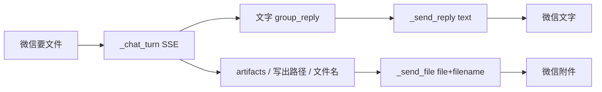

# 微信出站附件（PDF / Word 等）

Planned-with: Cursor Grok 4.6
Suggested-Impl-Model: Composer 2.5
Plan-Id: 2026-09-18-wechat-outbound-files

> **For implementer:** 使用 executing-plans，TDD。先写 `im_wechat_files.py` 纯函数测试，再改 `wechat_ilink.py`。不要 commit，除非用户明确要求。

**Goal:** 用户在已绑定的微信会话里要文件时，Near / 分身把工作区里的 PDF、Word 等真实文件经 sidecar 发成微信附件，而不只是把正文贴进文字气泡。

**Architecture:** Sidecar `POST /send` 已支持 `file`（base64）+ `filename` + `caption`（`packaging/wechat-sidecar/send.go` L13–L63 → `SendMediaFile`）。Python `WeChatILinkAdapter._send_reply` 目前只传 `text`。新增纯函数模块选出可发送路径，`_chat_turn` 从本轮 SSE 收集候选，`_handle_event` 在文字回复之后逐个 `_send_file`。

**Tech Stack:** Python 3 + httpx + pytest。不改 Go sidecar、不改 `server.py` import、不改 `group_router`、不改 Desktop / Enterprise / 飞书。

---

## 根因与证据

1. `agenticx/gateway/adapters/wechat_ilink.py` `_send_reply`（约 L777–L781）payload 只有 `text` / `context_token` / `recipient`。
2. `_chat_turn`（约 L633–L723）只拼文字：`token` / `final` / `group_reply`。群聊 SSE 的 `data.artifacts[].source_path`（`server.py` L3349–L3358）被丢弃。
3. 群产物只收录**本轮 taskspace 变更文件**（`group_router.py` L2014–L2016）。用户说「把已有 md/pdf 发我」时，模型 `file_read` 后只会贴全文，没有出站附件口。
4. 入站已能下媒体（`_download_media`），出站不对称。



---

## In scope

- 纯函数：发送意图、扩展名白名单、路径/文件名抽取、沙箱与体积校验、sidecar JSON。
- `_chat_turn` 收集本轮文件候选并返回 `WeChatChatResult`（兼容 mock 仍返回 `str`）。
- `_send_file` 复用现有 recipient / context_token 回退循环。
- 用户明确要文件时：解析回复里的绝对路径与《文件名.ext》/ `文件名.ext`，在 `~/.agenticx` 工作区/分身 workspace/taskspaces 里解析后发送。
- 本轮新写出的白名单文件（`group_reply.artifacts`、`OK: wrote …`、`file_write` path）即使话术没写「发给我」也发送（交付物）。

## Out of scope

- 飞书 / 企业微信 / Desktop 聊天气泡附件。
- 改 `group_router` 把 `file_read` 升成 artifact。
- 新增 agent 工具 `wechat_send_file`。
- 改 sidecar / iLink SDK。
- 自动压缩超限文件、发送整目录。

## 禁止改

- `agenticx/studio/server.py`（含 import 区）
- `agenticx/runtime/group_router.py`
- `desktop/`、`enterprise/`
- `packaging/wechat-sidecar/`
- `feishu_longconn.py` / `gateway/client.py`（本波只接微信）

---

## 约定

| 项 | 值 |
|---|---|
| 扩展名 | `.pdf .doc .docx .xls .xlsx .ppt .pptx .md .txt .csv .rtf .odt .ods .odp .png .jpg .jpeg .gif .webp .zip .7z .tar .gz .html` |
| 单文件上限 | 20 MiB（base64 JSON；微信官方更大但不在本波抬） |
| 单轮上限 | 5 个文件 |
| 拒绝目录 | `.ssh` `.gnupg` `.aws` `.kube` `/etc` `/proc` `/sys` `/dev` |
| 拒绝文件名 | `.env` `credentials` `id_rsa` `.pem` `.key` `.p12` |
| 搜索根 | `~/.agenticx/workspace`、`~/.agenticx/avatars/*/workspace`、`~/.agenticx/taskspaces`、`~/.agenticx/sessions/<sid>` |
| 搜索 | 深度 ≤ 6，跳过 `.git` `node_modules`，最多看 3000 个文件 |

发送意图（`user_wants_file_delivery`）命中其一即可：`发我` / `发给我` / `发文件` / `发附件` / `发到微信` / `发给微信` / `send me` / `send the file`。

---

## FR / AC

- **FR-1** 纯函数选出可发送文件。  
  **AC-1** `tests/test_im_wechat_files.py`：意图、白名单、拒绝密钥路径、超体积、`《a.pdf》` 在临时 workspace 命中、无意图时不发送仅 `file_read` 的已有文件、有意图时发送、`OK: wrote` 无意图也发送。
- **FR-2** sidecar 出站带 `file`/`filename`。  
  **AC-2** `_send_file` 的 httpx mock：成功请求 JSON 含 base64 `file` 与 `filename`，不含把整文件当 `text`。
- **FR-3** `_handle_event` 先文字后附件。  
  **AC-3** `_chat_turn` 返回带路径的 `WeChatChatResult` 时，先 `_send_reply` 再 `_send_file`；文字末尾含「已通过微信附件发送：<文件名>」。mock 仍返回 `str` 的旧测试保持绿。
- **NFR-1** 发送失败只打日志，不抛崩事件循环；文字仍已发出。

---

## Task 1: `im_wechat_files` 纯函数

**Files:**
- Create: `agenticx/gateway/im_wechat_files.py`
- Test: `tests/test_im_wechat_files.py`

**Step 1:** 写失败测试（见下方完整断言意图）。

**Step 2:** `pytest tests/test_im_wechat_files.py -q` 期望 FAIL（模块不存在）。

**Step 3:** 实现（落点如下，实施者按测试补全，不要发明新 HTTP）。

```python
#!/usr/bin/env python3
"""Select and encode WeChat outbound files.

Author: Damon Li
"""

from __future__ import annotations

import base64
import os
import re
from dataclasses import dataclass, field
from pathlib import Path
from typing import Iterable, Sequence

MAX_FILE_BYTES = 20 * 1024 * 1024
MAX_FILES_PER_TURN = 5
ALLOWED_EXTENSIONS = frozenset({...})  # 见约定表

@dataclass(frozen=True)
class WeChatChatResult:
    text: str
    file_paths: tuple[str, ...] = ()

def user_wants_file_delivery(text: str) -> bool: ...
def extract_absolute_paths(text: str) -> list[str]: ...
def extract_mentioned_filenames(text: str) -> list[str]: ...
def paths_from_sse_payload(event_type: str, data: dict) -> tuple[list[str], list[str]]:
    """Return (produced_paths, referenced_paths).
    produced: group_reply artifacts, file_write, OK: wrote
    referenced: file_read / file_edit path
    """
def is_sendable_file(path: str | Path) -> bool: ...
def resolve_filename(name: str, search_roots: Sequence[Path]) -> Path | None: ...
def default_search_roots(session_id: str = "") -> list[Path]: ...
def select_outbound_files(
    *,
    user_input: str,
    produced_paths: Iterable[str],
    referenced_paths: Iterable[str],
    reply_text: str,
    search_roots: Sequence[Path] | None = None,
    session_id: str = "",
) -> list[Path]: ...
def build_sidecar_file_payload(path: Path, *, recipient: str, context_token: str, caption: str = "") -> dict: ...
def append_sent_files_notice(text: str, paths: Sequence[Path]) -> str: ...
def coerce_chat_result(value: object) -> WeChatChatResult:
    if isinstance(value, WeChatChatResult):
        return value
    return WeChatChatResult(text=str(value or ""), file_paths=())
```

路径抽取正则要对齐 Desktop `session-artifacts.ts` 的绝对路径形态：`/Users|home|tmp|var|opt|private|Volumes`、`~/`、`X:\`。另抓 `OK:\s*(?:wrote|edited)\s+(\S.+?)(?:\s+\(\d+\s+chars?\))?`。

文件名：`《([^》]+\.[A-Za-z0-9]{1,8})》` 与 `` `([^`\n]+\.[A-Za-z0-9]{1,8})` ``。

`is_sendable_file`：必须是现存普通文件、扩展名在白名单、体积 ≤ 20MiB、resolve 后路径不穿过拒绝目录、文件名不含拒绝片段。

`select_outbound_files` 规则：
1. `produced_paths` 里 `is_sendable_file` 的一律入选。
2. 若 `user_wants_file_delivery(user_input)`：再并入 `referenced_paths`、`extract_absolute_paths(reply_text + user_input)`、以及 `extract_mentioned_filenames` 经 `resolve_filename` 命中的路径。
3. 去重（resolve 后的绝对路径）、保序、截断 `MAX_FILES_PER_TURN`。

`build_sidecar_file_payload`：`{"recipient", "context_token", "file": b64, "filename": path.name, "caption": caption or path.name}`，无 `text`。

**Step 4:** `pytest tests/test_im_wechat_files.py -q` PASS。

---

## Task 2: adapter 接线

**Files:**
- Modify: `agenticx/gateway/adapters/wechat_ilink.py`
  - import `WeChatChatResult`, `coerce_chat_result`, `paths_from_sse_payload`, `select_outbound_files`, `build_sidecar_file_payload`, `append_sent_files_notice`, `default_search_roots`
  - `_chat_turn` 返回 `WeChatChatResult`（约 L586–L723）
  - `_handle_event` 在约 L327–L402 消费 result
  - 新增 `_send_file`；把 `_send_reply` 的 recipient 循环抽到 `_post_sidecar_send(payload)`（约 L725–L841）
- Modify: `tests/test_gateway_wechat_ilink.py`
  - 旧 mock 的 `_resolve_bound_session` 必须改成返回 `("sid", None, None)`（当前返回裸字符串，会与 L300 解包不一致）
  - `_fake_chat_turn` 加 `**_kwargs`
  - 新增：result 带文件时调用 `_send_file`；`_send_file` httpx mock 检查 JSON

**`_chat_turn` before:** `return out.strip() or ""`  
**`_chat_turn` after:**

```python
produced: list[str] = []
referenced: list[str] = []
# 在每个 SSE data 分支：
p, r = paths_from_sse_payload(et, data)
produced.extend(p)
referenced.extend(r)

out = merge_im_sse_reply_text(...)
# progress_block 逻辑保持不变
text = out.strip()
files = select_outbound_files(
    user_input=text_arg,  # 用户原话，不是 out
    produced_paths=produced,
    referenced_paths=referenced,
    reply_text=text,
    session_id=session_id,
)
return WeChatChatResult(text=text, file_paths=tuple(str(p) for p in files))
```

`paths_from_sse_payload` 必须覆盖：
- `et in {group_reply, group_clarification}`：`data.artifacts[].source_path` → produced
- `et == tool_call`：`name in {file_write}` path → produced；`file_read`/`file_edit` → referenced
- `et == tool_result`：结果文本 `OK: wrote|edited` → produced；`name == file_write` 的 arguments.path → produced

**`_handle_event` after `_chat_turn`：**

```python
result = coerce_chat_result(reply)
notice_text = append_sent_files_notice(result.text, [Path(p) for p in result.file_paths])
if notice_text:
    await self._send_reply(..., text=notice_text, ...)
for path in result.file_paths:
    await self._send_file(..., path=Path(path), ...)
```

空文字但有文件：只发附件（`_send_file`），不要因为 `_send_reply` 空文本直接 return 就丢掉文件。

**`_post_sidecar_send`：** 从现有循环抽出；`_send_reply` 继续先 `_format_outbound_text`，空则 return。`_send_file` 不走 markdown 格式化；读文件失败 / `is_sendable_file` 为假则 log warning 并 skip。超时 120s。

**Step:** `pytest tests/test_im_wechat_files.py tests/test_gateway_wechat_ilink.py tests/test_im_group_speaker.py -q` 全绿。

---

## Go / No-Go

- 用户微信说「把报告.pdf 发我」，工作区确有该文件 → 先文字（含「已通过微信附件发送：报告.pdf」）再收到可点开的附件。
- 「总结这个 PDF」且本轮没有新写出文件 → 不发附件。
- 分身本轮 `file_write` 出 `xxx.docx` → 即使没说「发我」也发附件。
- 密钥 / `.env` / 超 20MiB → 不发。
- 不改 `server.py`、不改群路由。
