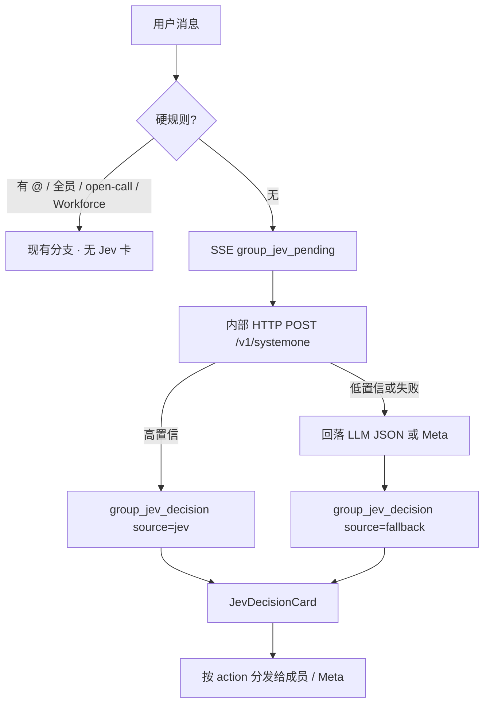

# Near 运行时 Jev 结构化决策（群聊路由 + 可见决策卡）

Planned-with: Cursor Grok 4.6
Suggested-Impl-Model: Cursor Grok 4.6

> **For implementer:** 只改本 plan 列出的路径。禁止把 Jev 做成聊天 Provider / MCP / `STUDIO_TOOLS` 主路径。禁止用整段替换改 `agenticx/studio/server.py` 的 import 区或相邻无关块。改了 `server.py` 必须做冷启动 smoke。不要 commit，除非用户明确要求。

**Goal:** 群聊未 @ 智能路由改为运行时内部调用 TypeSafe System One（Jev）；Near 桌面端每轮都用独立决策卡写清「Jev 判断了什么 / 哪个模型 / 置信度 / 是否回落」。

**Architecture:** 新增无第三方 SDK 的 `httpx` 客户端，只给 harness 用。`_analyze_intent` 在无硬规则时先问 Jev；高置信按标签分发，低置信/失败回落现有 LLM JSON（再不行回落 Meta，禁止再派给「第一个成员」）。决策经已有 SSE 字段（`event_type` + `confirm_context`）到达 Desktop，落盘 `metadata.kind=jev_decision`，渲染 `JevDecisionCard`。

**Tech Stack:** Python `httpx`、现有 Studio SSE、React + 主题 token、Vitest / pytest。不新增 `typesafe-sdk`、不装社区 `jev-mcp`。

---

## 规划模型建议

| 子任务 | 推荐模型 | 理由 |
|---|---|---|
| FR-1 客户端 / 配置 / 映射 | Composer 2.5 | 纯 HTTP + dataclass，样板 |
| FR-2 群聊 `_analyze_intent` 接线 | Composer 2.5 | 替换点明确，须守 fallback |
| FR-3 桌面决策卡 / 顶栏芯片 | Cursor Grok 4.6 | 要能一眼认出 Jev，审美不能糊成进度条 |
| FR-4 设置 + 探活 | Composer 2.5 | 单密钥框 + 测试按钮 |
| FR-5 KB auto 门闩（可第二 commit） | Composer 2.5 | 复用同一客户端与卡片 variant |

Suggested-Impl-Model: Cursor Grok 4.6

---

## In scope

- `~/.agenticx/config.yaml` 的 `typesafe:` 节 + 设置 Automation 卡片（密钥、开关、探活）
- 运行时内部 `POST https://api.typesafe.ai/v1/systemone`（不是 MCP，不是聊天模型）
- 群聊 `intelligent`、无显式 @ 时：用 Jev 替代「先打主模型吐 JSON」
- 桌面端：**评估中**与**已判定**两态决策卡；刷新后仍在；顶栏芯片显示 Jev 是否在工作
- 决策行不进下一轮 LLM 上下文
- KB `auto` 模式：Jev Noul 决定要不要 `knowledge_search`（FR-5，可同一 PR 第二段）

## Out of scope / no-scope-creep

- 不做 MCP、不做「自定义 OpenAI 供应商」、不把 Jev 放进模型选择器
- 不改已 @ / 全员正则 / open-call / Workforce 启发式；那些继续走现有硬规则，**不展示 Jev 卡**
- 不替换 `pre_tool_guard`、权限白名单、`Run Everything`
- 不做技能 Choice、历史重排、群成员过程广播改造
- 不把 Jev 的 `reason` 编成自然语言（卡上只展示标准 + 概率 + 门闩）
- 不改 Enterprise gateway / admin-console / web-portal
- `server.py` 只允许精确增行，禁止整段覆盖 import

---

## 根因与证据链

1. **Jev 不是聊天模型。** 官方接口是 `POST /v1/systemone`，返回 `choice` / `score` / `noul` + 概率，不生成解释。见 [System One](https://docs.typesafe.ai/concepts/system-one)、[API](https://docs.typesafe.ai/api)。

2. **群聊未 @ 路由现在在缴主模型税。** `agenticx/runtime/group_router.py` `_analyze_intent`（约 1516–1610 行）拼一段「只输出 JSON」prompt，走 `_call_llm_text`，解析失败则 `intent_fallback_first_member` 或 `meta_direct`。这是封闭四选一 + 是否执行，正是 Jev Choice / Noul。

3. **MCP / 聊天工具接不住主路径。** 路由必须在成员开跑前由 harness 调用。`mcp_connect` + `mcp_call` 或 `STUDIO_TOOLS` 都会变成「模型想不想起」，和产品规则冲突。

4. **现有进度 UI 会把 Jev 藏起来。** `group_progress` 被聚合成成员状态行（`ChatPane.tsx` 约 10583 行，`GroupProgressLine` 是弱提示）。用户要求「能清晰看到用了 Jev」——必须用独立事件 + 独立卡，不能复用 `group_progress`。

5. **落盘已有样板。** `_persist_clarification_prompt`（`server.py` 约 386–447 行）把 UI 行写成 `role=tool` + `metadata.kind`；`_sanitize_context_messages`（`agent_runtime.py` 约 1780–1786 行）按 `kind` 滤掉 UI 行。Jev 卡走同一通道。



---

## 配置契约（写全，禁止推断）

`~/.agenticx/config.yaml` 新增节（缺省如下；未配置等于关闭 Jev、走旧路径）：

```yaml
typesafe:
  enabled: false
  api_key: ""
  model: jev-latest
  timeout_sec: 8
  group_routing: true
  kb_auto: false
  show_decision_card: true
  act_above: 0.8
  review_above: 0.5
```

密钥解析顺序（实现必须按此，禁止把 key 当 tool 参数）：

1. `typesafe.api_key` 非空
2. 环境变量 `TYPESAFE_API_KEY`
3. 文件 `~/.config/typesafe/key`（去空白；权限建议 600，读失败当无 key）

`GET` 设置接口**永不回传明文 key**，只回 `has_key: true|false`。`PUT` 若 `api_key` 省略或空字符串：省略=不改；显式 `""`=清空并视为未配置（`enabled` 可仍为 true，但运行时当无 key → 回落 + 卡上写「未配置密钥」）。

---

## Jev 问题 schema（群聊路由，写全）

`state`（JSON 对象，不要纯长字符串）：

```json
{
  "group_name": "团队名",
  "members": [{"id": "avatar_id", "name": "展示名", "role": "职责摘要"}],
  "active_thread": "name(id), turn_count=N, last_topic=... | none",
  "recent_dialogue": "GroupChatContext.render_recent_dialogue() 原文",
  "user_message": "本轮用户文本"
}
```

`members` 必须包含 Meta（`__meta__`），`role` 用 registry 的 name/soul 截断至 80 字。Choice 选项 ≤ 255。

`questions`：

| id | type | instructions | criteria |
|---|---|---|---|
| `action` | choice | `Who should handle this group user message? Pick one.` | `route_to`: 某成员职责明确匹配。`meta_direct`: 全局/PM/Near/Machi/Meta，或没有单一成员。`continue_thread`: 在追问当前线程对方。`open_floor`: 闲聊无职责，成员可不接。 |
| `target` | choice | `If exactly one member should speak, which member id? Use none when Meta should answer or the floor is open.` | 每个 `avatar_id` → `"{name}: {role}"`，外加 `none` → `No single member; Meta or open floor.` |
| `requires_execution` | noul | `Does the user want create, modify, run, install, download, search-verify, write files, inspect a repo, or produce an artifact this turn? Progress-only questions are no.` | `true`: 可执行诉求。`false`: 解释/寒暄/进度询问。 |

`model`: `config.typesafe.model`，默认 `jev-latest`。

响应映射（禁止再让 Jev 生成 `reason` 文本）：

- `action.choice` ∈ `{route_to, meta_direct, continue_thread, open_floor}`，否则当失败。
- `target.choice`：若 `action==route_to` 且 choice 是合法成员 id → `target_ids=[id]`；`none` 或非法 → 改 `meta_direct` + 空 targets。
- `requires_execution`：`noul >= 0.7` → true；`noul <= 0.3` → false；中间带用现有 `_looks_like_execution_request(user_input)`。
- `confidence`：用 `action.confidence`（Noul 无 confidence）。
- `gate`：`confidence >= act_above` → `auto`；`>= review_above` → `review`；否则 `abstain`。
- `auto` / `review`：采用 Jev 的 action/targets。`abstain` 或 HTTP 失败：回落。
- `IntentDecision.reason` 只填短码：`jev` / `jev_review` / `jev_fallback_llm` / `jev_fallback_meta` / `jev_no_key` / `jev_timeout` / `jev_http`。卡上展示用结构化字段，不展示这段当「依据散文」。

回落顺序（写死）：

1. 仍调用现有 `_call_llm_text` JSON 路径（保持 `test_analyze_intent_*` 在 `source!=jev` 时行为）。
2. JSON 再失败 → `meta_direct`，**禁止** `intent_fallback_first_member`。改现有 fallback：`members[0]` 那条改为 Meta。这是本 plan 允许的唯一旧路径修正，须有测试。

硬规则命中（显式 @、broadcast-all、open-call、`_is_complex_multistep_task`）**不调用 Jev**，不发 Jev SSE。

---

## 可见性设计（FR-3，必须验收）

用户要的是「桌面端一眼看出用了 Jev」，不是日志里一行 debug。

### 事件（不扩 SSE data 键）

`GroupReply` 已有 `event_type`、`confirm_context`、`avatar_name`、`tool_name`。`server.py` 约 3350–3381 行已经原样转发这些字段，**不要改 data dict 形状**。

| `event_type` | 何时 | `agent_id` | `avatar_name` | `tool_name` | `content` | `confirm_context` |
|---|---|---|---|---|---|---|
| `group_jev_pending` | HTTP 发出前 | `__jev__` | `Jev` | `jev` | `Jev 正在判断谁来回复…` | `{ "phase": "pending", "purpose": "group_routing" }` |
| `group_jev_decision` | 有结论后（含回落） | `__jev__` | `Jev` | `jev` | 一行摘要，见下 | 完整 payload |

`content` 摘要（给历史/无卡降级，必须含字面量 `Jev`）：

- 成功：`Jev（{model}）→ {中文动作} {成员名或 Near} · {置信度%} · {自动|建议复核}`
- 回落：`Jev 未采用（{短因}），已回落{主模型|Near}`
- 无 key：`Jev 未配置密钥，已走原路由`

`confirm_context` payload（键名写死）：

```json
{
  "kind": "jev_decision",
  "phase": "done",
  "purpose": "group_routing",
  "source": "jev",
  "model": "jev-1.13.0",
  "requested_model": "jev-latest",
  "action": "route_to",
  "target_ids": ["fin"],
  "target_labels": ["财务"],
  "requires_execution": true,
  "confidence": 0.72,
  "gate": "auto",
  "probabilities": { "route_to": 0.81, "meta_direct": 0.12, "continue_thread": 0.05, "open_floor": 0.02 },
  "noul_execution": 0.91,
  "latency_ms": 180,
  "fallback_reason": ""
}
```

`source` 只能是 `jev` | `fallback`。`fallback_reason` 在回落时必填上述短码之一。`model` 优先用响应体的 versioned id；没有则用请求的 alias。

### 落盘

仿 `_persist_clarification_prompt`，在 `server.py` **同一文件内、该函数之后**新增 `_persist_jev_decision(session, reply)`：

- `role: "tool"`
- `tool_name: "jev"`
- `agent_id` / `sender_id`: `__jev__`
- `avatar_name` / `sender_name`: `Jev`
- `content`: 上面的摘要行
- `metadata`: `{ "kind": "jev_decision", ...confirm_context }`
- 幂等：若末行已是 `kind==jev_decision` 且 `purpose`+`action`+`target_ids` 相同则跳过

在 `async for reply` 循环里**只加这几行**（插在 clarification persist 旁，约 3384 行后）：

```python
if evt_type == "group_jev_decision":
    _persist_jev_decision(session, reply)
if evt_type in {"group_reply", "group_skipped", "group_clarification", "group_jev_decision"}:
    # 原 incremental_persist 集合加上 group_jev_decision
```

`pending` **不落盘**。

`agent_runtime.py` `_sanitize_context_messages` 约 1780 行的 `kind` 元组**精确追加** `"jev_decision"`、`"jev_kb_gate"`。

### 桌面卡（新组件，禁止复用 ToolCallCard / GroupProgressLine）

Create: `desktop/src/components/messages/JevDecisionCard.tsx`  
Create: `desktop/src/components/messages/JevDecisionCard.test.tsx`  
Create: `desktop/src/utils/jev-decision.ts`（parse payload）  
Modify: `MessageRenderer.tsx` —— `role===tool && (toolName==="jev" || metadata.kind==="jev_decision")` 时渲染该卡  
Modify: `session-message-map.ts` —— 从 `metadata.kind==="jev_decision"` 还原（对标 clarification 约 443 行）  
Modify: `group-sender-cluster.ts` —— `agentId==="__jev__"` 或 `kind===jev_decision` 返回 `null`（打断连发）  
Modify: `group-tool-messages.ts` —— Jev 卡**不是**噪音，`isNoisyToolStatusMessage` 对 `jev` 返回 false

卡的视觉（必须能从截图认出 Jev）：

1. 左侧 20px 圆标，主题 token（`bg-surface-card-strong text-text-strong`），**中间字母 `J`**，不要扳手、不要成员头像。
2. 第一行固定文案 **`Jev`**（字重 semibold，`text-text-strong`），右侧紧跟 `model` 等宽小号（如 `jev-1.13.0`）。没有「智能路由引擎」之类代称当主标题。
3. `pending`：`J` 标旁三点动画（对标现有 Thinking 三点，不要 ⏳），文案 `Jev 正在判断谁来回复`。
4. `done` + `source=jev`：第二行 `{中文动作} · {目标名}`；右侧门闩徽章 `自动`（绿点）/ `建议复核`（黄点）。动作中文：`派给成员` / `Near 作答` / `续聊` / `开放麦`。
5. 第三行：`置信度 72%` + 用 `bg-border` / `bg-text-strong` 的细进度条。折叠行「概率」默认收起，展开列出 `action.probabilities` 两位小数。
6. `source=fallback`：标题仍是 **`Jev`**，第二行红色/警示 `未采用 · {中文短因}`，短因映射：`未配置密钥` / `超时` / `请求失败` / `置信不足` / `已回落主模型` / `已回落 Near`。用户必须能看出「本想用 Jev 但没用上」。
7. 宽度与群聊 `ImBubble` 同一 `maxWidth` + 左侧头像占位（占位空着或放 `J` 标，不要画分身头像）。
8. 三态主题可读；不要独立白底/青底大框（对标 ReasoningBlock：融入对话列）。
9. `show_decision_card: false` 时：不渲染卡，但顶栏芯片仍更新（见下）。

中文动作与短因写在 `jev-decision.ts` 的纯函数里，组件不内嵌映射表。

### ChatPane 接线

Modify: `desktop/src/components/ChatPane.tsx` 群 SSE 循环（`group_progress` 分支旁，约 10583 行）：

- `group_jev_pending`：`addPaneMessage` 一条 `id=jev-pending:{paneId}`、`role=tool`、`toolName=jev`、`toolStatus=running`、`metadata=confirm_context`。已存在则只更新。
- `group_jev_decision`：删掉 pending id，追加稳定 id `jev-decision:{paneId}:{Date.now()}`（重载后以 messages.json 为准）。
- **不要** `setGroupActivityHint` / `applyGroupActivityEvent`（避免沉到成员进度里）。

### 顶栏芯片（群窗格必有）

在群聊顶栏状态区（KB 检索芯片旁，`renderKbRetrieval` 同级）加 `JevRouteChip`：

| 条件 | 芯片 |
|---|---|
| `typesafe.enabled && group_routing && has_key` 且本会话尚无决策 | 绿点 + `Jev`，tooltip `未 @ 时由 Jev 判断谁来回复` |
| 本会话最近一次 `source=jev` | 绿点 + `Jev`，tooltip 摘要行 |
| 最近一次 `source=fallback` | 红点 + `Jev`，tooltip 回落原因 |
| 未启用或无 key | 红点 + `Jev`，tooltip `未启用或未配置密钥`；点击滚到设置 Automation |

红/绿两态，不要第三色。芯片文案必须是 **`Jev`**，不要写成「智能路由」。

设置里 `enabled=false`：芯片不出现（避免没配还占顶栏）。

---

## FR / AC

### FR-1：内部 HTTP 客户端

**落点**

- Create: `agenticx/llms/typesafe_client.py`
- Create: `agenticx/llms/typesafe_config.py`（读 config / env / key 文件）
- Create: `tests/test_typesafe_client.py`

**客户端行为**

```python
async def system_one(*, state: Any, questions: dict[str, Any], model: str, api_key: str, timeout_sec: float) -> dict[str, Any]:
    # POST {base}/v1/systemone
    # base 默认 https://api.typesafe.ai
    # Header: Authorization: Bearer {api_key}, Content-Type: application/json
    # 返回原始 JSON dict；超时 raise TypesafeTimeout；HTTP 4xx/5xx raise TypesafeHttpError
```

用已有 `httpx.AsyncClient`，尊重 `HTTPS_PROXY` / `HTTP_PROXY`（与 LiteLLM 一致）。不要为这个远程 API 套 localhost bypass transport。

**AC-1**

- `pytest tests/test_typesafe_client.py -q` 绿。
- 用 `respx` 或 `httpx.MockTransport`：断言 URL、Bearer、body 含 `state`/`questions`/`model`。
- 401 → `TypesafeHttpError` 且 `retryable is False`；429 → `retryable is True`（客户端本身不做重试循环，由调用方决定回落）。
- `resolve_typesafe_api_key` 单测覆盖三角顺序。

### FR-2：群聊 intent 走 Jev

**落点**

- Modify: `agenticx/runtime/group_router.py`
  - `IntentDecision`（约 728–733 行）**只在末尾加字段**：`source: str = "llm"`、`model: str = ""`、`confidence: float | None = None`、`probabilities: dict | None = None`、`gate: str = ""`、`fallback_reason: str = ""`。现有位置参数测试不得坏。
  - `_analyze_intent`：无 `explicit_targets` 且 `typesafe.enabled and group_routing and key` 时先 `yield` pending 的调用点不在本函数（本函数保持返回 `IntentDecision`）。在 `_run_intelligent_turn` 约 2438 行调用前后 yield 两张卡。
- Create: `agenticx/runtime/jev_intent.py` —— `build_group_routing_questions` / `map_jev_to_intent` 纯函数
- Modify: `tests/test_smoke_group_control_plane.py` —— 保留旧 LLM stub 测试；新增 Jev 成功 / abstain 回落 / 无 key 走 LLM
- Create: `tests/test_jev_intent_map.py`

**`_run_intelligent_turn` before/after（约 2438 行）**

Before: 直接 `decision = await self._analyze_intent(...)`。

After 伪代码：

```python
explicit = [...]
if should_try_jev(explicit):
    yield _jev_pending_reply()
    decision = await self._analyze_intent(...)  # 内部先 Jev 再可能 LLM
    yield _jev_decision_reply(decision, member_labels)
else:
    decision = await self._analyze_intent(...)
```

`_analyze_intent` 内：有 explicit → 现有 `explicit_mention`，`source="llm"` 即可（硬规则，无卡）。无 explicit → `_try_jev_intent`；失败或 abstain 再走原 `_call_llm_text`。把「第一个成员」fallback 改为 Meta。

**AC-2**

- 旧测试 `test_analyze_intent_reads_requires_execution_true` 等在 mock `_call_llm_text` + 无 key 时仍绿。
- 新测试：mock `system_one` 返回 `action=route_to` + `target=a1` + `confidence=0.9` → 不调用 `_call_llm_text`，`source=="jev"`。
- `confidence=0.2` → 调用 `_call_llm_text`，决策卡 `source=fallback`、`fallback_reason=jev_fallback_llm`（由 router 在回落后写）。
- LLM 也挂 → `action=meta_direct`，不是 `members[0]`。
- `_is_open_call_question` 为 True 的路径零次 `system_one`。

### FR-3：桌面端清晰可见

见上文「可见性设计」。

**AC-3**

- Vitest：`jev-decision.ts` 映射中文；`JevDecisionCard` 在 pending / jev / fallback 三态文档里都出现字面量 `Jev`。
- `session-message-map`：历史 `metadata.kind=jev_decision` 能还原卡，不是普通 ToolCallCard。
- 群 SSE fixture：`group_jev_pending` 不进 `groupActivity`；`group_jev_decision` 后消息列表有 `toolName==="jev"`。
- 手工：群聊未 @ 发「帮财务看下这份对账单」→ 先出现「Jev 正在判断…」→ 卡上出现 **Jev** + 模型 id + 派给财务；顶栏绿点 `Jev`。断网或清 key 后再发 → 卡上仍写 **Jev** 且「未采用」。

### FR-4：设置 + 探活

**落点**

- Create: `agenticx/studio/typesafe_routes.py`（`register_typesafe_routes(app)`）
- Modify: `agenticx/studio/server.py` —— 在 `create_studio_app()` 里**只加一行**调用 `register_typesafe_routes(app)`（放在其它 `register_*_routes` 旁边，不要动 `agenticx.avatar` import 块）
- Create: `desktop/src/components/settings/typesafe/TypesafeConfigSection.tsx`
- Modify: `desktop/src/components/SettingsPanel.tsx` 约 8867 行：`tab === "automation"` 时 **在 `AutomationTab` 上方**挂该卡片
- i18n：`workspace` 命名空间补中文（标题「结构化决策（Jev）」，不要英文段落说明）

API：

- `GET /api/typesafe/settings` → `{ enabled, has_key, model, timeout_sec, group_routing, kb_auto, show_decision_card, act_above, review_above }`
- `PUT /api/typesafe/settings` → 同字段 + 可选 `api_key`；写 `ConfigManager.set_value("typesafe", ...)`
- `POST /api/typesafe/test` → 用当前 key 发一条最小 Noul：`state="ping"`，`questions.ok={type:noul,instructions:"Is this a connectivity probe?"}`；返回 `{ ok, model, latency_ms, error }`。失败保留面板并 toast 底层错误（对标设置保存失败要露 `HTTP …`）。

设置 UI（用户偏好）：

- **一个**密钥输入 +「测试连通性」，不要并列「环境变量名」框
- 开关：启用、用于群聊路由、用于知识库智能检索、显示决策卡
- 底部才有保存（若 Automation 页本身无底栏保存：本卡片内即时 PATCH 各开关，密钥用「保存密钥」单按钮，不要顶底两个保存）
- 探活成功：按钮旁显示 `已连通 · {model}`；失败：卡片内红字，不要只顶栏 toast

**AC-4**

- 无 key 时 `POST /test` 返回 400/401 且 `ok=false`。
- `GET` 有 key 时 `has_key=true` 且 JSON 不含 key 子串。
- 改了 `server.py`：`agx serve --host 127.0.0.1 --port 8765` 冷启动后 `GET /api/session`、`/api/avatars`、`/api/sessions`、`/api/typesafe/settings` 均为 200。

### FR-5：KB auto 门闩（可第二段 commit）

**落点**

- Modify: `agenticx/runtime/agent_runtime.py` —— `_kb_retrieval_always_mode` 旁新增 `_kb_retrieval_jev_should_search(session, user_input) -> bool | None`（None=不干预）
- `always` 仍强制 eager search，不问 Jev
- `auto` 且 `typesafe.kb_auto` 且有 key：Noul `Does this user question require searching the user's local document library?`；`noul>=0.7` 走现有 `_eager_knowledge_search_events`；否则不注入
- 无论搜或不搜，往 `chat_history` 追加 `metadata.kind=jev_kb_gate` 的 tool 行（摘要必须含 `Jev`），并在第一轮 SSE 用现有 tool 消息通道或 `noticeKind` 显示**同一** `JevDecisionCard`（`purpose=kb_auto`，第二行 `检索知识库` / `跳过检索`）
- Modify: `_sanitize_context_messages` 已含 `jev_kb_gate`
- Create: `tests/test_jev_kb_gate.py`

**AC-5**

- `auto` + Jev `noul=0.9` → 第一轮前发生 `knowledge_search`（mock dispatch）。
- `auto` + `noul=0.1` → 不 eager search。
- `always` → 不调用 Jev，行为与今天相同。
- 桌面消息里出现标题为 **Jev** 的门闩卡。

---

## NFR

- NFR-1：无 key / `enabled=false` 时零 HTTP，群聊延迟与今天一致。
- NFR-2：Jev 超时默认 8s，超时必须回落，不能卡住「正在判断」。
- NFR-3：决策卡不进 LLM 上下文（sanitize）。
- NFR-4：密钥不进 SSE 正文、不进 `messages.json`、不进 GET settings。
- NFR-5：`server.py` 改动后冷启动核心 API 200。

---

## Task 拆分（按序，可独立验收）

### Task 1: 客户端 + 配置

**Files:** `agenticx/llms/typesafe_config.py`、`agenticx/llms/typesafe_client.py`、`tests/test_typesafe_client.py`

TDD：先写 key 解析与 mock HTTP，再实现。

### Task 2: intent 映射纯函数

**Files:** `agenticx/runtime/jev_intent.py`、`tests/test_jev_intent_map.py`

覆盖：route_to+合法 id、route_to+none→meta_direct、非法 action、abstain 阈值、noul 中间带启发式。

### Task 3: 改 `_analyze_intent` + 禁止 first-member fallback

**Files:** `group_router.py`、`tests/test_smoke_group_control_plane.py`

### Task 4: yield pending/decision + persist + sanitize

**Files:** `group_router.py`（`_jev_pending_reply` / `_jev_decision_reply`）、`server.py`（只增 `_persist_jev_decision` + 两处 if）、`agent_runtime.py`（kind 元组）

然后强制：临时端口冷启动 smoke。

### Task 5: Desktop 卡 + 映射 + 顶栏芯片

**Files:** `jev-decision.ts`、`JevDecisionCard.tsx`、`MessageRenderer.tsx`、`session-message-map.ts`、`ChatPane.tsx`、`group-sender-cluster.ts`、对应 test

浏览器或组件测试确认三态都出现字面量 `Jev`。

### Task 6: 设置卡片 + `/api/typesafe/*`

**Files:** `typesafe_routes.py`、`server.py` 一行 register、`TypesafeConfigSection.tsx`、`SettingsPanel.tsx`、i18n

### Task 7: KB auto（可选同 PR）

**Files:** `agent_runtime.py`、`test_jev_kb_gate.py`、同一 `JevDecisionCard` 的 `purpose=kb_auto`

---

## 手工验收（Near 桌面）

1. 设置 → Automation → 结构化决策：填 token，点「测试连通性」，看到 `已连通 · jev-…`。打开「启用」「用于群聊路由」「显示决策卡」。
2. 打开群聊（≥2 成员，职责可区分）。**不要 @**，发送一条明显属于某成员的可执行请求。
3. 输入区上方对话列先出现 **Jev 正在判断谁来回复**，再变成 **Jev** + 模型 id + 派给该成员；顶栏绿点 `Jev`。
4. 再发闲聊。卡上动作应为开放麦或 Near，不得误派。
5. 清空密钥保存后再发：卡上仍有标题 **Jev**，并写未采用/未配置；成员仍能收到 Meta 或旧路由回复（不能卡死）。
6. 切走会话再切回：决策卡还在，不是普通工具扳手条。
7. 新开 Meta 单聊闲聊（若已做 FR-5）：auto 模式出现 Jev 跳过检索卡；问仓库里某文档则出现检索卡且随后有 `knowledge_search`。

---

## 风险

| 风险 | 缓解 |
|---|---|
| `server.py` 误删 import | 只精确增行；提交前冷启动 `/api/session` `/api/avatars` `/api/sessions` |
| Jev 选项与成员 id 对不齐 | criteria key 用 `avatar_id`；非法 key 当 `none` |
| 决策卡刷屏 | 每用户回合最多一张 pending + 一张 decision；硬规则无卡 |
| 把 Jev 当聊天模型 | Out of scope；设置文案写「结构化决策，不是对话模型」 |
| 社区 MCP 密钥进 npx | 本 plan 不引入 MCP |
