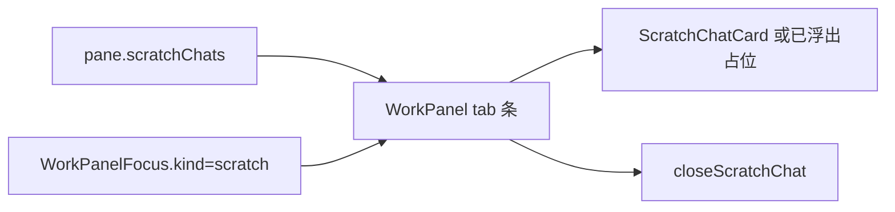

# 工作区临时对话 02：WorkPanel scratch tab 与空卡片壳

Planned-with: Cursor Grok 4.6
Suggested-Impl-Model: 前端品味档（Composer 2.5 可独立落地；视觉跟现有 WorkPanel token，不要另起一套）
Plan-Id: 2026-09-21-near-workspace-scratch-02-workpanel-tab
Parent-Plan: `.cursor/plans/pending/2026-09-21-near-workspace-scratch-chat-master.plan.md`
Design: `docs/plans/2026-09-21-workspace-scratch-chat-design.md`

> **For implementer:** 只做工作区 tab + 空卡片壳。不要接发送/SSE（04）、不要做浮窗 overlay（05）、不要加消息/划词菜单（03）、不要在 + 菜单里新建空 scratch。Composer 必须 disabled。

---

## Goal

`pane.scratchChats` 在右侧 WorkPanel 以独立 tab 出现。点 tab 看到一张空卡片：标题、来源、引用/文件快照、空态、禁用输入。浮出的卡在 tab 上标「已浮出」，内容区不双开会话。关 tab：空卡直接丢；有消息或已物化 session 用主题化确认，禁止 `window.confirm`。

## Architecture



纯函数放 `desktop/src/utils/scratch-chat-panel.ts`。卡片是展示组件。`WorkPanel.tsx` 只接线：读 store、画 tab、处理 focus、关卡。

## In scope

- `WorkPanelTabKind` 增加 `"scratch"`
- `WorkPanelFocus` 增加 `{ kind: "scratch"; chatId: string }`
- tab 条从 `pane.scratchChats` 渲染
- `ScratchChatCard` 空壳（composer disabled）
- `floating===true` 时 tab 标「已浮出」，body 只占位
- 关闭确认（主题化 Modal）
- zh/en `workspace` i18n 键对齐

## Out of scope

- `ImBubble` / 划词 / 产物行入口（03）
- `/api/chat`、`createSession`、SSE（04）
- 可拖浮窗 overlay、浮出按钮生效（05）
- + 菜单「新建临时对话」（会造无来源空卡）
- 「提到主窗格」
- 改 `scratch-chat.ts` 数据模型（01 已完成）
- 改 `agenticx/studio/server.py`

## FR / AC

- **FR-1** `scratchChats` 每项一张 pill，标题截断；点 pill 切到该卡。
  - **AC-1** `desktop/src/utils/scratch-chat-panel.test.ts`：`resolveActiveScratchId` 在 current 仍存在时保持，否则回落到第一张。
- **FR-2** `focusRequest.kind === "scratch"` 切到对应 `chatId`。
  - **AC-2** 同测试：`resolveScratchFocusId` 优先 requestedId，缺失则回落。
- **FR-3** `floating===true` 不渲染 docked 会话体。
  - **AC-3** `shouldRenderDockedScratchBody` 对 floating 为 false。
- **FR-4** 空卡关 tab 立刻 `closeScratchChat`；`shouldConfirmCloseScratch` 为 true 时先弹确认，取消不删。
  - **AC-4** `ScratchChatCard.test.tsx` 渲染标题/引用/空态/禁用发送；关闭确认文案走 i18n。
- **FR-5** + 菜单与 startHere 列表不加 scratch 入口。
  - **AC-5** `WorkPanel.tsx` 的 `plusMenu` / `startEntries` 不含 scratch。
- **FR-6** zh/en workspace 键对齐。
  - **AC-6** `npx vitest run src/i18n/message-parity.test.ts`。

---

### Task 1: 面板纯函数 + 测试

**Create:** `desktop/src/utils/scratch-chat-panel.ts`

```ts
export function resolveActiveScratchId(
  chats: ScratchChat[],
  currentId: string | null,
): string | null {
  if (currentId && chats.some((c) => c.id === currentId)) return currentId;
  return chats[0]?.id ?? null;
}

export function resolveScratchFocusId(
  chats: ScratchChat[],
  requestedId: string | null | undefined,
  currentId: string | null,
): string | null {
  const req = String(requestedId ?? "").trim();
  if (req && chats.some((c) => c.id === req)) return req;
  return resolveActiveScratchId(chats, currentId);
}

export function shouldRenderDockedScratchBody(
  chat: ScratchChat | null | undefined,
): boolean {
  return Boolean(chat && !chat.floating);
}
```

**Create:** `desktop/src/utils/scratch-chat-panel.test.ts` — 覆盖 FR-1/2/3。

---

### Task 2: ScratchChatCard 空壳

**Create:** `desktop/src/components/work-panel/ScratchChatCard.tsx`

落点结构（产品 token，不要渐变/玻璃）：

1. 顶栏：标题 + 来源 `t("work.scratchSource." + sourceKind)` + 关闭
2. 有 `quotedContent`：左侧细边引用块
3. 有 `contextFiles`：路径 pill（显示 basename）
4. `floating`：居中「已浮出」+ hint，无 composer
5. 非 floating：居中空态 + **disabled** 输入与发送（04 再接通）

**Create:** `desktop/src/components/work-panel/ScratchChatCard.test.tsx`

用 `renderToStaticMarkup`（对齐 `SessionChangeList.test.tsx`）：

- 标题、引用原文、`work.scratchEmpty`、disabled send 出现
- `floating` 时出现 `work.scratchFloated`，不出现 composer placeholder

---

### Task 3: WorkPanel 接线

**File:** `desktop/src/components/work-panel/WorkPanel.tsx`

精确改动（只增目标行，禁止整段覆盖无关逻辑）：

1. **类型** `WorkPanelTabKind`（约 L458）加 `"scratch"`。
2. **类型** `WorkPanelFocus`（约 L469）加 `| { kind: "scratch"; chatId: string }`。
3. 与 `EMPTY_MESSAGES`（L147）并列：`const EMPTY_SCRATCH_CHATS: ScratchChat[] = []`。
4. store：`scratchChats` 用 `?? EMPTY_SCRATCH_CHATS`；`closeScratchChat`。
5. state：`activeScratchId`、`pendingCloseScratch`。
6. `hasAnyTab`（约 L1169）加 `|| scratchChats.length > 0`。
7. `resolveFallbackKind` 增加 `excludeScratchId?: string`：
   - 先取 `scratchChats.filter(c => c.id !== excludeScratchId)`
   - 若还有 scratch，`setActiveScratchId(next.id)` 并 `return "scratch"`
   - 再走现有 summary/graph/… 顺序
   - 现有顺序末尾、`return null` 前也要能回落到剩余 scratch（关摘要时 scratch 仍在）
8. `focusRequest` effect（约 L1394）加 `kind === "scratch"` 分支：`setActiveScratchId(resolveScratchFocusId(...)); setActiveKind("scratch")`。
9. tab 条在 preview pills 之后、+ 按钮之前：map `scratchChats`。X 走 `requestCloseScratch`。`floating` 时 pill 显示 `work.scratchFloated`。
10. 内容区（`overflow-hidden` 主列，约 L2684 浏览器块附近）加 scratch 分支：
    - `shouldRenderDockedScratchBody` → `<ScratchChatCard onClose=... />`
    - 否则同一张卡的 floated 占位（可由 Card 自己处理）
11. 关闭：空卡直接 `closeScratchChat`；需确认则 `Modal`（`desktop/src/components/ds/Modal.tsx`）。底部 **取消在左、关闭在右**（`Button` ghost + danger）。禁止 `window.confirm`。
12. **不要**改 `plusMenu` / `startEntries`。

`requestCloseScratch` / `commitCloseScratch` 伪代码：

```ts
function commitCloseScratch(chatId: string) {
  closeScratchChat(paneId, chatId);
  if (activeKind === "scratch" && activeScratchId === chatId) {
    setActiveKind(resolveFallbackKind({ excludeScratchId: chatId }));
  }
  setPendingCloseScratch(null);
}

function requestCloseScratch(chat: ScratchChat) {
  if (shouldConfirmCloseScratch(chat)) {
    setPendingCloseScratch(chat);
    return;
  }
  commitCloseScratch(chat.id);
}
```

`useEffect` 仅校正 `activeScratchId` 是否仍存在，不要在 hydrate 时强切 `activeKind`。

---

### Task 4: i18n

**Files:** `desktop/locales/zh/workspace.json`、`desktop/locales/en/workspace.json` 的 `work` 对象（`tabWorkspace` 附近）。

新增键（两边必须同名）：

| key | zh | en |
|---|---|---|
| `tabScratch` | 临时对话 | Scratch chat |
| `closeScratchTab` | 关闭临时对话 | Close scratch chat |
| `scratchEmpty` | 还没有对话 | No messages yet |
| `scratchEmptyHint` | 输入问题后发送。选中内容已作为引用，不会自动发出。 | Type a question to send. The selection is quoted and will not be sent automatically. |
| `scratchComposerPlaceholder` | 接着问… | Follow up… |
| `scratchSend` | 发送 | Send |
| `scratchFloated` | 已浮出 | Floated |
| `scratchFloatedHint` | 关闭浮窗后会收回这里 | Closing the float docks it back here |
| `scratchCloseConfirmTitle` | 关闭临时对话？ | Close this scratch chat? |
| `scratchCloseConfirm` | 关闭后这张临时对话会从工作区消失，侧栏历史里也找不到。 | This scratch chat will leave the workspace and will not appear in sidebar history. |
| `scratchCloseConfirmOk` | 关闭 | Close |
| `scratchCloseConfirmCancel` | 取消 | Cancel |
| `scratchQuote` | 引用 | Quote |
| `scratchFiles` | 相关文件 | Related files |
| `scratchSource.message` … `browser` | 消息/划词/工具结果/产物/变更/参考/待办/文件/终端/浏览器 | Message/Selection/Tool result/Artifact/Change/Reference/To-do/File/Terminal/Browser |

---

## 视觉约束

- 跟 WorkPanel 现有 pill / `EmptyBlock` / `bg-surface-panel` / `border-border` / `text-text-*`
- 主体不透明，不用设置弹层那种半透叠色
- 发送按钮用 `Button variant="primary"`（`--ui-btn-primary-*`），disabled 即可
- 不要新开 Electron 窗、不要改 ChatPane 主消息列表

---

## 验证

在 `desktop/`：

```bash
npx vitest run \
  src/utils/scratch-chat-panel.test.ts \
  src/components/work-panel/ScratchChatCard.test.tsx \
  src/i18n/message-parity.test.ts \
  src/utils/scratch-chat.test.ts \
  src/store.scratch-chat.test.ts
```

全部绿。目视：`plusMenu` / `startEntries` 无 scratch。

## Commit

只 add 本计划文件 + 本刀代码。一次 commit。trailer：

```
Plan-Id: 2026-09-21-near-workspace-scratch-02-workpanel-tab
Plan-File: .cursor/plans/2026-09-21-near-workspace-scratch-02-workpanel-tab.plan.md
Plan-Model: Cursor Grok 4.6
Impl-Model: Cursor Grok 4.6
Made-with: Damon Li
```
