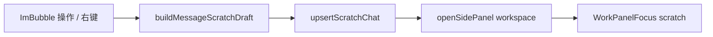

# 工作区临时对话 03：从消息 / 划词开卡

Planned-with: Cursor Grok 4.6
Suggested-Impl-Model: Composer 2.5
Plan-Id: 2026-09-21-near-workspace-scratch-03-open-from-message
Parent-Plan: `.cursor/plans/pending/2026-09-21-near-workspace-scratch-chat-master.plan.md`
Design: `docs/plans/2026-09-21-workspace-scratch-chat-design.md`

> **For implementer:** 只做气泡与划词入口。不要接发送（04）、不要做浮窗（05）、不要改文件/终端/产物入口（06）、不要替换「引用到新对话」。不要改 `ChatView.tsx`（无 WorkPanel）。不要改 `server.py`。

---

## Goal

在当前 session 的消息上点「开临时对话」：打开本窗格工作区，upsert 一张 scratch tab，输入区空着，引用可见。有划词用划词，没有用整条可见正文。同一 `sourceKey` 复用已有 tab。主窗格消息不变。

## Architecture



纯函数放 `desktop/src/utils/scratch-chat-open.ts`。`ChatPane` 只接线。`ImBubble` 加入口。`MessageRenderer` 透传。

## In scope

- 从消息 / 划词构造 draft
- ImBubble 常驻操作按钮 + 右键菜单
- ChatPane：开工作区 + upsert + focus
- zh/en `chat.actions` 文案

## Out of scope

- 发送 / SSE / createSession
- 浮窗 overlay
- 文件预览 / 终端 / 产物 / 待办入口
- 替换或删除 `onQuoteToNewPane`
- ChatView / Lite 无工作区路径
- 「提到主窗格」

## FR / AC

- **FR-1** 无划词：`sourceKind=message`，`sourceKey=message:<messageId>`，`quotedContent` 为 `resolveQuoteBody`（助手去掉 think）。
  - **AC-1** `desktop/src/utils/scratch-chat-open.test.ts`
- **FR-2** 有划词：`sourceKind=selection`，`sourceKey=selection:<messageId>:<hash>`，引用为划词。不同划词不同 tab。
  - **AC-2** 同测试文件
- **FR-3** 同一 key 再开复用 `chatId`。
  - **AC-3** 调用两次 `buildMessageScratchDraft` 得到相同 `sourceKey`（store 复用已由 01 覆盖）
- **FR-4** 入口不替换「引用到新对话」；右键两项并存。
  - **AC-4** `ImBubble.test.tsx`：同时传入两个 callback 时，html 含 `actions.openScratch` 与 `actions.quoteToNew`
- **FR-5** 点入口后：`upsertScratchChat` + `openWorkspaceSidebarForPane` + `setWorkPanelFocus({ kind: "scratch", chatId })`；不 `addPane`、不发请求。
  - **AC-5** ChatPane 处理器可读锚点（见 Task 3），无 `/api/chat`
- **FR-6** zh/en chat 键对齐。
  - **AC-6** `message-parity.test.ts`

---

### Task 1: draft 纯函数

**Create:** `desktop/src/utils/scratch-chat-open.ts`

```ts
export function clipScratchTitleSnippet(text: string, max = 24): string;
export function hashScratchSnippet(text: string): string; // FNV-1a 32-bit hex，稳定即可
export function buildMessageScratchDraft(input: {
  messageId: string;
  quotedContent: string;
  selectedText?: string;
  title: string;
}): ScratchChatDraft;
```

- `selectedText` trim 非空 → selection draft
- 否则 message draft，`quotedContent` 用传入的整段（调用方先 `resolveQuoteBody`）
- 空 `messageId` 仍要产出合法 key：`scratchSourceKey(kind, messageId || "unknown")`

**Create:** `desktop/src/utils/scratch-chat-open.test.ts`

---

### Task 2: ImBubble + MessageRenderer

**File:** `desktop/src/components/messages/ImBubble.tsx`

1. props 加 `onOpenScratchChat?: (message: Message, selectedText?: string) => void`（放在 `onQuoteToNewPane` 旁，约 L90）
2. `runOpenScratchChat` 与 `runQuoteToNewPane` 一样：`getContainedSelectionText(msgContentRef.current)`
3. 助手常驻操作行（约 L641 quote 后）与用户操作行（约 L952 quote 后）各加一颗 `MessageSquare` 按钮，`HoverTip` = `t("actions.openScratch")`。仅当 callback 存在时显示。
4. 右键菜单：`quoteToCurrent` 之后、`quoteToNew` **之前**加一项。`quoteToNew` 逻辑一行不改。

**File:** `desktop/src/components/messages/MessageRenderer.tsx`

- props 与透传到 `ImBubble`（约 L101、L563）

**File:** `desktop/src/components/messages/ImBubble.test.tsx`

- 同时传 `onOpenScratchChat` + `onQuoteToNewPane`，静态 html 含两个 i18n 文案（右键菜单只在 `menuOpen` 时存在——**常驻按钮**用 lucide-message-square + aria/title 不够稳，改测 HoverTip label 或按钮 `aria-label`）
- 实施时给 scratch 按钮加 `aria-label={t("actions.openScratch")}`，quoteToNew 菜单项保持原文案即可；常驻测试断言 `aria-label` 与 `lucide-message-square`
- 另开一项只测：有 `onQuoteToNewPane` 无 scratch 时，不出现 `actions.openScratch`

右键菜单默认关着，`renderToStaticMarkup` 测不到菜单。以常驻按钮为准。

---

### Task 3: ChatPane 接线

**File:** `desktop/src/components/ChatPane.tsx`（约 L8597 `onQuoteToNewPane` 旁）

新增 `useCallback` `openScratchFromMessage`：

```ts
const openScratchFromMessage = (msg: Message, selectedText?: string) => {
  const body = resolveQuoteBody(msg, selectedText);
  const snippet = clipScratchTitleSnippet(body);
  const title = snippet
    ? t("actions.scratchAbout", { snippet })
    : t("actions.openScratch");
  const { chatId } = upsertScratchChat(pane.id, buildMessageScratchDraft({
    messageId: msg.id,
    quotedContent: resolveQuoteBody(msg),
    selectedText,
    title,
  }));
  if (!chatId) return;
  if (!pane.taskspacePanelOpen) {
    openWorkspaceSidebarForPane(pane.id, paneRef.current?.clientWidth ?? paneWidth, openSidePanel);
  }
  setWorkPanelFocus({ kind: "scratch", chatId });
};
```

注意：无划词时 `quotedContent` 必须是整条 `resolveQuoteBody(msg)`，不要被 selected 空串干扰。有划词时 draft 函数自己用划词覆盖引用。

`onQuoteToNewPane` **原样保留**。

`useAppStore` 取 `upsertScratchChat`。

不要给 ChatView 接线。

---

### Task 4: i18n

`desktop/locales/zh/chat.json` / `en/chat.json` 的 `actions`：

| key | zh | en |
|---|---|---|
| `openScratch` | 开临时对话 | Open scratch chat |
| `scratchAbout` | 关于 {{snippet}} | About {{snippet}} |

---

## 验证

```bash
cd desktop
npx vitest run \
  src/utils/scratch-chat-open.test.ts \
  src/components/messages/ImBubble.test.tsx \
  src/i18n/message-parity.test.ts \
  src/utils/scratch-chat.test.ts
```

目视：`onQuoteToNewPane` 仍 `addPane`。

## Commit

只 add 本计划 + 本刀文件。trailer：

```
Plan-Id: 2026-09-21-near-workspace-scratch-03-open-from-message
Plan-File: .cursor/plans/2026-09-21-near-workspace-scratch-03-open-from-message.plan.md
Plan-Model: Cursor Grok 4.6
Impl-Model: Cursor Grok 4.6
Made-with: Damon Li
```
