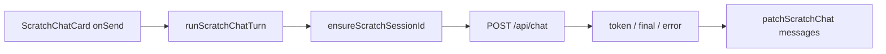

# 工作区临时对话 04：独立发送与 SSE

Planned-with: Cursor Grok 4.6
Suggested-Impl-Model: Composer 2.5 / Codex
Plan-Id: 2026-09-21-near-workspace-scratch-04-runtime
Parent-Plan: `.cursor/plans/pending/2026-09-21-near-workspace-scratch-chat-master.plan.md`
Design: `docs/plans/2026-09-21-workspace-scratch-chat-design.md`

> **For implementer:** 只做 scratch 自己的 session + `/api/chat` SSE。禁止写 `pane.messages`。禁止改 ChatPane 主发送函数。禁止做浮窗 overlay（05）。不要改 `server.py` import。工具卡 / 中断按钮本刀不做。

---

## Goal

docked scratch 卡片可以发送。第一次发送才 `createSession`（`avatar_id` 继承当前窗格）。SSE 只更新该 scratch 的 `messages`。主窗格生成中互不打断。失败时卡片内报错，输入保留。

## Architecture



运行时纯函数 + 可注入 transport 放 `desktop/src/utils/scratch-chat-runtime.ts`。`WorkPanel` 接线。`ScratchChatCard` 打开 composer。

## In scope

- lazy `createSession`
- 请求 body：`user_input` / `session_id` / provider / model / `quoted_content` / `context_files` keys / `client_turn_id`
- SSE：`token` 追加、`final` 覆盖、`error` 失败
- 卡片消息列表 + 可发送 composer
- 错误条

## Out of scope

- ChatPane `send()` / `pane.messages` / 侧栏历史
- 浮窗 overlay、浮出按钮生效（05）
- 工具卡 / stall / continue / 中断
- 文件/终端入口（06）
- 自动代问
- 「提到主窗格」

## FR / AC

- **FR-1** 空 `sessionId` 才 create；已有则复用。
  - **AC-1** `scratch-chat-runtime.test.ts`：`ensureScratchSessionId`
- **FR-2** body 带 `quoted_content`（scratch 快照），不含主窗格 messages。
  - **AC-2** `buildScratchChatRequestBody` 断言
- **FR-3** token 追加 assistant，final 覆盖；不碰到传入以外的数组。
  - **AC-3** `applyScratchSsePayload`
- **FR-4** `runScratchChatTurn` 只通过 `onMessages` / `onSessionId` 回写。
  - **AC-4** mock transport 跑一轮，回调里的 messages 含 user + 最终 assistant；无 pane 字段
- **FR-5** HTTP / createSession 失败：返回 error，composer 由卡片保留（未成功发送不清空）。
- **FR-6** 卡片：有消息渲染气泡；composer **不再 disabled**；floating 仍只占位不发送。
  - **AC-6** `ScratchChatCard.test.tsx` 更新：非 floating 无 `disabled` send（或仅 sending 时 disabled）
- **FR-7** zh/en workspace 键对齐。

---

### Task 1: runtime 纯函数

**Create:** `desktop/src/utils/scratch-chat-runtime.ts`

导出：

```ts
export function buildScratchChatRequestBody(input: {
  sessionId: string;
  userInput: string;
  provider?: string;
  model?: string;
  quotedContent?: string;
  contextFiles?: ScratchChatContextFile[];
  clientTurnId: string;
}): Record<string, unknown>;
// user_input, session_id, client_turn_id
// quoted_content 仅非空
// context_files: { [sourcePath||path]: "" } 仅当有文件（04 不读盘）
// provider/model 非空才写

export function appendScratchTurn(messages: Message[], input: {
  userId: string; assistantId: string; text: string; sessionId: string;
}): Message[];

export function applyScratchSsePayload(
  messages: Message[],
  assistantId: string,
  payload: unknown,
): { messages: Message[]; done?: boolean; error?: string };

export async function ensureScratchSessionId(input: {
  sessionId: string;
  avatarId: string | null | undefined;
  createSession: (payload: { avatar_id?: string }) => Promise<{ ok: boolean; session_id?: string; error?: string }>;
}): Promise<string>;

export async function consumeScratchSse(
  reader: { read(): Promise<{ done: boolean; value?: Uint8Array }> },
  onPayload: (payload: Record<string, unknown>) => void,
): Promise<void>;
// 复用 parseSseFrame；忽略非 JSON / [DONE]

export async function runScratchChatTurn(opts: {
  chat: ScratchChat;
  userText: string;
  paneAvatarId: string | null;
  provider?: string;
  model?: string;
  apiBase: string;
  apiToken: string;
  ids: { userId: string; assistantId: string; clientTurnId: string };
  transport: {
    createSession: ...;
    chat: (args: { apiBase: string; apiToken: string; body: Record<string, unknown>; signal?: AbortSignal }) => Promise<{
      ok: boolean; status: number; body: { getReader(): ... } | null;
    }>;
  };
  signal?: AbortSignal;
  onMessages: (messages: Message[]) => void;
  onSessionId: (sessionId: string) => void;
}): Promise<{ ok: true } | { ok: false; error: string }>;
```

`runScratchChatTurn` 顺序：trim 空 → ensure session → onSessionId → appendTurn → onMessages → chat → consume SSE → 每帧 apply + onMessages。create/HTTP 失败在 append **之前**返回，好让卡片保留输入。

默认 transport 可另放 `defaultScratchChatTransport`（`window.agenticxDesktop.createSession` + `fetch /api/chat`）。WorkPanel 用默认。

**Create:** `desktop/src/utils/scratch-chat-runtime.test.ts`

---

### Task 2: ScratchChatCard

**File:** `desktop/src/components/work-panel/ScratchChatCard.tsx`

props 增加：

```ts
onSend?: (text: string) => void;
sending?: boolean;
error?: string;
```

- 本地 `draft` state；发送时 `onSend(draft)`；**成功与否由父组件决定是否调用 `onDraftConsumed`**
  - 更简单：父组件发送成功才需要清空。卡片 `onSend` 后先不清空；父组件成功回调 `onConsumed()` 或卡片接收 `draftEpoch`。
  - 采用：`onSend` 返回 `Promise<boolean>`，true 才清空。
- 有 `chat.messages` 时渲染简单气泡（user 右、assistant 左），不再只显示空态。空态仅 `messages.length===0 && !sending`
- composer：`disabled={sending || !onSend}`；floating 仍无 composer
- `error` 展示在 composer 上方，`text-rose-400` / `work.scratchSendError` 作前缀可选

更新 `ScratchChatCard.test.tsx`：带一条 user 消息时 html 含正文；默认有 `onSend` 时 send 按钮不 disabled。

---

### Task 3: WorkPanel 接线

**File:** `desktop/src/components/work-panel/WorkPanel.tsx`

- `patchScratchChat` from store
- 读 pane `avatarId` / `modelProvider` / `modelName`
- `sendingIds` + `sendErrors` state
- `sendScratch(chat, text)`：
  - `runScratchChatTurn` + `defaultScratchChatTransport`
  - `onMessages` / `onSessionId` → `patchScratchChat(paneId, chat.id, …)`
  - 失败写 `sendErrors[chat.id]`
  - **禁止** `addPaneMessage` / `setPaneMessages`
- `commitCloseScratch` 时 abort 该 chat 的 AbortController
- 把 `onSend` / `sending` / `error` 传给 `ScratchChatCard`
- 主窗格 busy 不拦截

---

### Task 4: i18n

`work.scratchSendError`：zh「发送失败：{{error}}」/ en `Send failed: {{error}}`  
`work.scratchCreateFailed`：zh「无法创建临时会话」/ en `Could not create the scratch session`

---

## 验证

```bash
cd desktop
npx vitest run \
  src/utils/scratch-chat-runtime.test.ts \
  src/components/work-panel/ScratchChatCard.test.tsx \
  src/i18n/message-parity.test.ts
```

## Commit

```
Plan-Id: 2026-09-21-near-workspace-scratch-04-runtime
Plan-File: .cursor/plans/2026-09-21-near-workspace-scratch-04-runtime.plan.md
Plan-Model: Cursor Grok 4.6
Impl-Model: Cursor Grok 4.6
Made-with: Damon Li
```
