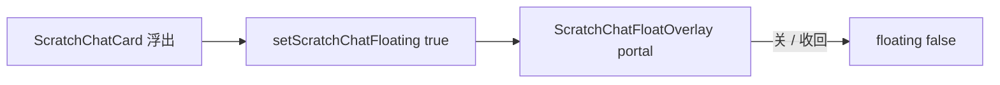

# 工作区临时对话 05：应用内浮窗

Planned-with: Cursor Grok 4.6
Suggested-Impl-Model: 前端品味档（Composer 2.5 可落地）
Plan-Id: 2026-09-21-near-workspace-scratch-05-float
Parent-Plan: `.cursor/plans/pending/2026-09-21-near-workspace-scratch-chat-master.plan.md`
Design: `docs/plans/2026-09-21-workspace-scratch-chat-design.md`

> **For implementer:** 浮窗是 `createPortal` 到 `document.body` 的 overlay，不是 Electron 子窗。关浮窗 = `setScratchChatFloating(false)` 收回 tab，不销毁。同时只浮一张（01 已保证）。不要接 06 来源。不要改 `server.py`。

---

## Goal

docked 卡片可浮出。浮窗可拖、不透明、有同一份消息与发送。关浮窗或点收回：tab 还在，内容还在。浮出时工作区 tab 标「已浮出」，不双开会话体。

## Architecture



位置纯函数：`desktop/src/utils/scratch-chat-float.ts`。浮层组件：`desktop/src/components/work-panel/ScratchChatFloatOverlay.tsx`。`WorkPanel` 找 `scratchChats.find(c => c.floating)` 渲染一层。

## In scope

- 浮出 / 收回
- 拖标题栏 + viewport clamp
- overlay 复用发送（04 的 `sendScratch`）
- i18n

## Out of scope

- Electron `BrowserWindow`
- 位置持久化
- 多张同时浮（禁止）
- 06 来源入口
- 「提到主窗格」

## FR / AC

- **FR-1** `defaultScratchFloatPosition` / `clampScratchFloatPosition` 保证卡片完整落在视口内（8px 边距）。
  - **AC-1** `scratch-chat-float.test.ts`
- **FR-2** 点浮出：该卡 `floating=true`，其它卡 false；WorkPanel 渲染恰好一层 overlay。
- **FR-3** overlay 的关闭/收回只 `setScratchChatFloating(paneId, id, false)`，不 `closeScratchChat`。
  - **AC-3** 读 WorkPanel 锚点；overlay 测试：`onDock` 被关按钮调用
- **FR-4** 浮出后 docked `ScratchChatCard` 仍走 02 的 floated 占位（无 composer）；发送只在 overlay。
- **FR-5** zh/en 对齐。

---

### Task 1: 位置纯函数

**Create:** `desktop/src/utils/scratch-chat-float.ts`

```ts
export const SCRATCH_FLOAT_WIDTH = 360;
export const SCRATCH_FLOAT_HEIGHT = 480;
export const SCRATCH_FLOAT_MARGIN = 8;

export function clampScratchFloatPosition(
  pos: { left: number; top: number },
  size: { width: number; height: number },
  viewport: { width: number; height: number },
): { left: number; top: number };

export function defaultScratchFloatPosition(
  viewport: { width: number; height: number },
  size?: { width: number; height: number },
): { left: number; top: number };
// 默认右上：width - cardW - 24, top 72
```

**Create:** `desktop/src/utils/scratch-chat-float.test.ts`

---

### Task 2: Overlay

**Create:** `desktop/src/components/work-panel/ScratchChatFloatOverlay.tsx`

- `createPortal(..., document.body)`
- 容器：`fixed z-[130] flex flex-col overflow-hidden rounded-xl border border-border bg-surface-panel shadow-2xl`（不透明）
- 宽高 360×480
- 顶栏可拖：`onPointerDown` + move/up，clamp
- 顶栏右：收回（`Minimize2`）+ 关闭同义收回。**不要**调用 `onClose` 销毁。
- 主体：`<ScratchChatCard chat={{...chat, floating:false}} onClose={onDock} onSend sending error />`  
  把 `floating` 强制 false 才能显示 composer。卡片自己的 X 也走 `onDock`。
- 或给 Card 加 `forceDockedBody`。优先强制 `{...chat, floating: false}`，避免改 Card API。

**Create:** `ScratchChatFloatOverlay.test.tsx`：静态 html 含 title、`aria-label` 收回。

---

### Task 3: Card 浮出按钮 + WorkPanel

**File:** `ScratchChatCard.tsx`

- props `onFloat?: () => void`
- 非 floating 顶栏、关闭左侧加浮出按钮，`aria-label={t("work.scratchFloat")}`，图标 `Maximize2`

**File:** `WorkPanel.tsx`

- `setScratchChatFloating` from store
- `floatingChat = scratchChats.find(c => c.floating) ?? null`（最多一张）
- Card：`onFloat={() => setScratchChatFloating(paneId, chat.id, true)}`
- 若 `floatingChat`：portal overlay，`onDock={() => setScratchChatFloating(paneId, id, false)}`，`onSend`/`sending`/`error` 与 docked 同一套
- 关 tab 仍走 `requestCloseScratch`（销毁），与关浮窗区分

---

### Task 4: i18n

| key | zh | en |
|---|---|---|
| `scratchFloat` | 浮出 | Float |
| `scratchDock` | 收回工作区 | Dock to workspace |

---

## 验证

```bash
cd desktop
npx vitest run \
  src/utils/scratch-chat-float.test.ts \
  src/components/work-panel/ScratchChatFloatOverlay.test.tsx \
  src/components/work-panel/ScratchChatCard.test.tsx \
  src/i18n/message-parity.test.ts \
  src/utils/scratch-chat.test.ts
```

## Commit

```
Plan-Id: 2026-09-21-near-workspace-scratch-05-float
Plan-File: .cursor/plans/2026-09-21-near-workspace-scratch-05-float.plan.md
Plan-Model: Cursor Grok 4.6
Impl-Model: Cursor Grok 4.6
Made-with: Damon Li
```
