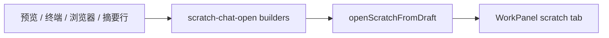

# 工作区临时对话 06：更多来源入口

Planned-with: Cursor Grok 4.6
Suggested-Impl-Model: Composer 2.5
Plan-Id: 2026-09-21-near-workspace-scratch-06-more-sources
Parent-Plan: `.cursor/plans/pending/2026-09-21-near-workspace-scratch-chat-master.plan.md`
Design: `docs/plans/2026-09-21-workspace-scratch-chat-design.md`

> **For implementer:** 只在现有「引用」旁 / 摘要行尾加「开临时对话」。draft 一律走 `upsertScratchChat` + 打开工作区 + `setWorkPanelFocus({ kind: "scratch", chatId })`。不要改发送（04）、浮窗（05）、消息气泡（03 已有）。不要替换引用。不要改 `ToolCallCard`（主计划 06 交付不含工具结果卡）。不要改 `server.py`。

---

## Goal

当前 session 里这些对象也能开 scratch tab：工作区预览划词、终端选区、浏览器页内选区、产物 / 变更 / 参考 / 待办。同一 `sourceKey` 复用。输入区空着，不自动发送。

## Architecture



## In scope

- `buildPathScratchDraft` / `buildQuotedScratchDraft` / `buildPreviewScratchDraft`
- 划词浮条第二按钮
- 摘要列表行尾按钮
- ChatPane 单一 `openScratchFromDraft`，两处 `WorkPanel` 都接线
- zh/en workspace 文案

## Out of scope

- 工具结果卡 `ToolCallCard`
- HTML 预览「评论到对话」条
- 「提到主窗格」
- 替换 `onQuote*`
- Electron 子窗

## FR / AC

- **FR-1** 路径类（产物 / 变更 / 本地参考文件）：`contextFiles=[{path, sourcePath}]`，`sourceKey=<kind>:<abs>`。
  - **AC-1** `scratch-chat-open.test.ts`
- **FR-2** 划词类（预览 snippet / 终端 / 浏览器 / 待办 / 网页参考）：`quotedContent` 为选中文本；预览划词同时带 `contextFiles`。
  - **AC-2** 同测试：`buildPreviewScratchDraft` 有 snippet 时 key 含 hash；无 snippet 仅路径
- **FR-3** 同一 key 再开复用（01 已覆盖 store）。
- **FR-4** 原「引用至当前对话」按钮仍在。
  - **AC-4** `SelectionQuotePopover` / `BrowserSelectionToolbar` 同时传入两个 callback 时 html 含 quote 与 openScratch
- **FR-5** 点入口：不 `addPane`、不发 `/api/chat`。
- **FR-6** zh/en workspace 键对齐。

---

### Task 1: draft 纯函数

**File:** `desktop/src/utils/scratch-chat-open.ts`

在现有 `buildMessageScratchDraft` 后追加（不要改消息 draft 行为）：

```ts
export function fileLabelFromPath(path: string): string;

export function buildPathScratchDraft(input: {
  kind: "file" | "artifact" | "change" | "reference";
  path: string;
  title: string;
  quotedContent?: string;
}): ScratchChatDraft;

export function buildQuotedScratchDraft(input: {
  kind: "terminal" | "browser" | "todo" | "reference";
  rawKey: string;
  quotedContent: string;
  title: string;
}): ScratchChatDraft;

export function buildPreviewScratchDraft(input: {
  absolutePath: string;
  snippet?: string;
  title: string;
}): ScratchChatDraft;
```

规则：

- `fileLabelFromPath`：`\\` → `/`，取最后一段；空则 `"file"`
- 路径 trim，空 path 用 `"unknown"`
- `buildPathScratchDraft`：`sourceKey = scratchSourceKey(kind, abs)`，`contextFiles: [{ path: abs, sourcePath: abs }]`
- `buildQuotedScratchDraft`：`sourceKey = scratchSourceKey(kind, rawKey || "unknown", 若 kind 为 terminal/browser 则再加 hashScratchSnippet(quoted))`。待办 / 参考只用 `rawKey`（调用方已含稳定 id）
- `buildPreviewScratchDraft`：
  - 有 snippet：`sourceKind=file`，`sourceKey=file:<abs>:<hash>`，`quotedContent=snippet`，并带 `contextFiles`
  - 无 snippet：等同 `buildPathScratchDraft({ kind: "file", path: abs, title })`

**File:** `desktop/src/utils/scratch-chat-open.test.ts` 增测，不改旧用例。

---

### Task 2: 划词浮条双按钮

**File:** `desktop/src/components/workspace/selection-quote-popover.tsx`

- props 加 `onOpenScratch?: () => void`
- 有 `onOpenScratch` 时外层改成 `div.agx-selection-quote-btn`（保留这个 class，终端 outside-click 依赖它），内含两个 `h-7` 按钮
- 无 `onOpenScratch` 时保持现在的单按钮（视觉不回退）
- 第二钮文案 `t("preview.openScratch")`，`aria-label` 同文案
- `onQuote` 仍必填

**Create or extend test：** 若无现成测试，新增 `desktop/src/components/workspace/selection-quote-popover.test.tsx`（`renderToStaticMarkup`）。

**File:** `desktop/src/components/work-panel/BrowserSelectionToolbar.tsx`

- props 加 `onOpenScratch?: () => void`
- 在「引用」按钮右侧加同样文案按钮（`t("work.openScratch")`），仅当 callback 存在
- 现有 quote / copy / search **一行不改语义**

**Create：** `desktop/src/components/work-panel/BrowserSelectionToolbar.test.tsx`：同时传 onQuote + onOpenScratch，html 含 `work.quoteToChat` 与 `work.openScratch`。

---

### Task 3: 预览 / 终端 / 浏览器接线

**File:** `desktop/src/components/workspace/WorkspaceFilePreview.tsx`

- `WorkspaceFilePreviewProps`、`OfficePreviewBody`、`TextualPreviewBody` 加 `onOpenScratchSnippet?: (payload: WorkspacePreviewQuotePayload) => void`
- 所有 `SelectionQuotePopover`（约 L847、L889）在构造 text-range payload 后：
  - `onQuote` 仍调 `onQuoteSnippet?.(payload)`
  - `onOpenScratch={onOpenScratchSnippet ? () => onOpenScratchSnippet(payload) : undefined}`
  - 浮条显示条件改为 `selectionRange && (onQuoteSnippet || onOpenScratchSnippet)`
- `OfficePreviewBody` 把 `onOpenScratchSnippet` 传给 `SpreadsheetPreview`

**File:** `desktop/src/components/workspace/SpreadsheetPreview.tsx`

- 加 `onOpenScratchSelection?: (payload: WorkspacePreviewQuotePayload) => void`
- 浮条：`onQuote={quoteSelection}` 保持；`onOpenScratch` 复用同一 payload 构造（抽一小函数，避免两套 A1/snippet）
- 显示条件：`selection && selectionAnchor && (onQuoteSelection || onOpenScratchSelection)`

**File:** `desktop/src/components/WorkspacePanel.tsx`

- props 加 `onOpenScratchSnippet?: ...`，传给内部 `WorkspaceFilePreview` 的 `onOpenScratchSnippet`（约 L2009 `onQuoteSnippet` 旁）

**File:** `desktop/src/components/TerminalEmbed.tsx`

- props 加 `onOpenScratchSelection?: (text: string) => void`
- 浮条显示：`quotePopup && (onQuoteSelection || onOpenScratchSelection)`
- `onOpenScratch`：`onOpenScratchSelection?.(quotePopup.text)` 后清 popup（与 `commitQuote` 一样清选区）
- `syncQuotePopup` 里 `if (!onQuoteSelectionRef.current)` 改为两个 callback 都空才 `setQuotePopup(null)`。加 `onOpenScratchSelectionRef`。

**File:** `desktop/src/components/work-panel/WorkPanel.tsx`

- Props 加 `onOpenScratchChat?: (draft: ScratchChatDraft) => void`
- `WorkspaceFilePreview`（约 L2776）与 `WorkspacePanel`（约 L2800）传：

```ts
onOpenScratchSnippet={(payload) => {
  const abs = String(payload.absolutePath || payload.path || "").trim();
  const snippet = "snippet" in payload ? String(payload.snippet || "").trim() : "";
  const label = fileLabelFromPath(abs);
  onOpenScratchChat?.(
    buildPreviewScratchDraft({
      absolutePath: abs,
      snippet: snippet || undefined,
      title: snippet
        ? /* workspace scratchAbout */ 
        : /* scratchAbout with file label */,
    }),
  );
}}
```

标题：`snippet ? t("work.scratchAbout", { snippet: clipScratchTitleSnippet(snippet) }) : t("work.scratchAbout", { snippet: fileLabelFromPath(abs) })`

- `TerminalEmbed`（约 L2854）：

```ts
onOpenScratchSelection={(text) => {
  const clean = String(text || "").trim();
  if (!clean) return;
  onOpenScratchChat?.(buildQuotedScratchDraft({
    kind: "terminal",
    rawKey: "selection",
    quotedContent: clean,
    title: t("work.scratchAbout", { snippet: clipScratchTitleSnippet(clean) }),
  }));
}}
```

- `BrowserSelectionToolbar` 调用点（约 L452）：加

```ts
onOpenScratch={() => {
  const text = selectionUi.text.trim();
  if (!text) return;
  onOpenScratchChat?.(buildQuotedScratchDraft({
    kind: "browser",
    rawKey: url || "page",
    quotedContent: text,
    title: t("work.scratchAbout", { snippet: clipScratchTitleSnippet(text) }),
  }));
  setSelectionUi(null);
}}
```

`onQuote` 原逻辑不动。

---

### Task 4: 摘要列表行尾

各列表加可选 `onOpenScratch?: (… ) => void`，行尾 `MessageSquare` 按钮，`aria-label={t("work.openScratch")}`，`stopPropagation`。无 callback 时不渲染（旧测试不破）。

**File:** `desktop/src/components/work-panel/SessionArtifactList.tsx`

- `onOpenScratch?: (path: string) => void`
- 放在「定位」按钮左侧或右侧，点击 `onOpenScratch(path)`

**File:** `desktop/src/components/work-panel/SessionChangeList.tsx`

- `onOpenScratch?: (path: string) => void`
- 行是整行 `button`：把 scratch 做成内嵌 `span role="button"` 并 `stopPropagation`，避免误开预览

**File:** `desktop/src/components/work-panel/SessionReferenceList.tsx`

- `onOpenScratch?: (draftKey: { kind: "skill" | "web" | "kb"; id: string; label: string; quoted: string; path?: string }) => void`
  - 为少改调用方，改为三个可选：`onOpenScratchSkill?(name)` / `onOpenScratchWeb?(url, title)` / `onOpenScratchKb?(title, path?)`
  - 更简单：一个 `onOpenScratchRef?: (input: { sourceKey: string; title: string; quotedContent: string; path?: string }) => void`
- skill：`sourceKey=skill:${name}`，quoted=name
- web：`sourceKey=url`，quoted=`${title}\n${url}`
- kb：有 `kbSourcePath` 走 path draft `reference`，否则 quoted=title

**File:** `desktop/src/components/work-panel/SessionTodoList.tsx`

- `onOpenScratch?: (item: { content: string; index: number }) => void`
- 每行右侧按钮

**File:** `WorkPanel.tsx` 摘要区（约 L2540 / L2581 / L2619 / L2658）把 draft 交给 `onOpenScratchChat`：

| 来源 | builder |
|---|---|
| artifact path | `buildPathScratchDraft({ kind: "artifact", path, title: scratchAbout(fileLabel) })` |
| change path | `kind: "change"` |
| ref + local path | `kind: "reference"` + contextFiles |
| ref web/skill | `buildQuotedScratchDraft({ kind: "reference", rawKey, quotedContent, title })` |
| todo item | `buildQuotedScratchDraft({ kind: "todo", rawKey: \`${index}:${content}\`, quotedContent: content, title })` |

**Tests：** `SessionChangeList.test.tsx` / 若有 artifact 测试：传入 callback 后 html 含 `work.openScratch`；不传则不含。`SessionTodoList` 若无测试可只测 WorkPanel 不测，优先给 ChangeList 加一条。

---

### Task 5: ChatPane 单一出口

**File:** `desktop/src/components/ChatPane.tsx`

在现有 `onOpenScratchChat` 消息处理器旁抽：

```ts
const openScratchFromDraft = useCallback((draft: ScratchChatDraft) => {
  const { chatId } = upsertScratchChat(pane.id, draft);
  if (!chatId) return;
  if (!pane.taskspacePanelOpen) {
    openWorkspaceSidebarForPane(
      pane.id,
      paneRef.current?.clientWidth ?? paneWidth,
      openSidePanel,
    );
  }
  setWorkPanelFocus({ kind: "scratch", chatId });
}, [/* 现有依赖 */]);
```

消息入口改为 `openScratchFromDraft(buildMessageScratchDraft(...))`，行为与 03 完全一致。

两处 `<WorkPanel`（约 L14674、L14820）都加：

```ts
onOpenScratchChat={openScratchFromDraft}
```

不要给 `ChatView` 接线。

---

### Task 6: i18n

`desktop/locales/zh/workspace.json` / `en/workspace.json`：

| key | zh | en |
|---|---|---|
| `work.openScratch` | 开临时对话 | Open scratch chat |
| `work.scratchAbout` | 关于 {{snippet}} | About {{snippet}} |
| `preview.openScratch` | 开临时对话 | Open scratch chat |

`work` 与 `preview` 各一份，因为浮条分别走两个 namespace 前缀。

---

## 验证

```bash
cd desktop
npx vitest run \
  src/utils/scratch-chat-open.test.ts \
  src/components/workspace/selection-quote-popover.test.tsx \
  src/components/work-panel/BrowserSelectionToolbar.test.tsx \
  src/components/work-panel/SessionChangeList.test.tsx \
  src/i18n/message-parity.test.ts \
  src/utils/scratch-chat.test.ts
```

目视：引用按钮仍只写 composer，不 `addPane`。

## Commit

只 add 本计划 + 本刀文件。

```
Plan-Id: 2026-09-21-near-workspace-scratch-06-more-sources
Plan-File: .cursor/plans/2026-09-21-near-workspace-scratch-06-more-sources.plan.md
Plan-Model: Cursor Grok 4.6
Impl-Model: Cursor Grok 4.6
Made-with: Damon Li
```
