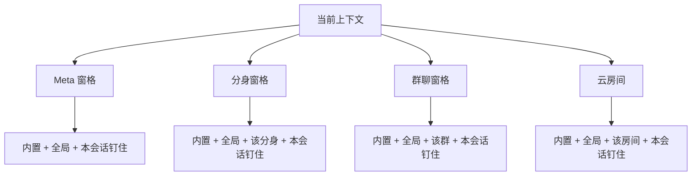

# 输入框指令（设置管理 + `/` 唤起 + 本机性能卡）

Planned-with: Grok 4.7
Suggested-Impl-Model: 见下方「子任务 → 推荐模型」表。推荐不是 trailer；实施时 `Impl-Model` 以用户确认的实际模型为准。

> **For Claude:** REQUIRED SUB-SKILL: Use superpowers:executing-plans to implement this plan task-by-task.

**Goal:** 用户在设置里维护「指令」，在对话输入框用 `/` 或「指令」按钮选中后，要么本机立刻展示这次会话的耗时，要么把已保存的说明发给当前对话，不用再手写长提示。

**Architecture:** 指令正文落在本机 JSON。可见性只在 Studio 解析一次，Desktop 只展示接口返回的列表。内置 `perf` 不进模型，读回放账本和工具观察后在输入框上方出卡。自定义指令是一段说明，选中后以芯片形式占用输入框，回车时把说明放进这一轮用户消息。

**Tech Stack:** FastAPI 路由模块、纯函数解析、React + Zustand、Vitest / pytest。

---

## 子任务 → 推荐模型

| 阶段 | 内容 | Suggested-Impl-Model | 理由 |
|---|---|---|---|
| A | 存储、可见性、HTTP、性能摘要 | Composer 2.5 | 契约和断言都写在本文，无 UI |
| B | 设置页「指令」 | Composer 2.5 | 表单 CRUD，沿用现有设置 tab |
| C | ChatPane `/`、按钮、芯片、发送 | 代码专精中档 | 改 `ChatPane` 发送路径，回归面大 |
| D | 云房间输入框接入同一菜单 | Composer 2.5 | 复用 C 的菜单组件，只接房间发送 |

开始实施前把本文件移到 `.cursor/plans/2026-09-23-composer-commands.plan.md`。不要和 `.cursor/plans/pending/2026-09-02-composer-slash-commands.plan.md` 同时改 `ChatPane` 的 `/` 触发；那份 plan 仍停在 pending，本 plan 独占 Pro 输入框的 `/`。

---

## 背景（实施者不要依赖对话）

用户要快速查看某次对话的墙钟、首 token、模型等待和工具耗时。现有只读工具 `get_trace` 把 `duration_ms` 写成空（`agenticx/ops/first_party.py` 的 `_spans_from_messages` 与 `_spans_from_observations`），观察文件里的 `elapsed_ms` 不会出现在工具结果里。把「查性能」写成一段提示词再交给 Meta，会多等一轮模型，仍然没有耗时数字。

因此：

- `perf` 是内置本地指令，不调用 `/api/chat`。
- 其余指令是用户保存的说明，才进入模型。
- 设置页增加「指令」。挂载主体只有四档：全局、分身、群聊、云房间。
- 会话级只是「钉在这次对话」，不出现在设置的范围选择里。

已有代码锚点：

| 事实 | 位置 |
|---|---|
| 设置 tab id 列表 | `desktop/src/settings-tab.ts` `SETTINGS_TAB_IDS`（约 L16–35） |
| 设置左侧导航定义 | `desktop/src/components/SettingsPanel.tsx` `TAB_DEFS`（约 L1042–1059），`tabs` 由 `t(\`tabs.${def.id}\`)` 生成（约 L4944–4946） |
| 导航点击 | 同文件约 L7084–7107 |
| 技能 tab 分支写法 | 同文件 `{tab === "skills" && (` 约 L8941 |
| 中文 tab 文案 | `desktop/locales/zh/settings.json` `tabs`（约 L4–19）；英文镜像 `desktop/locales/en/settings.json` |
| Pro 输入框 | `desktop/src/components/ChatPane.tsx` `contentEditable` 约 L14252；`@` 菜单约 L14608–14618；更多操作按钮 `ComposerMoreActionsButton` 约 L14501 |
| `@` 触发纯函数 | `desktop/src/utils/composer-input-sync.ts` `TRAILING_AT_RE`、`matchTrailingAtMention` |
| 意图芯片视觉 | `desktop/src/components/composer/TurnIntentChip.tsx` |
| 群聊窗格 id | `ChatPane.tsx` 约 L3004–3017：`avatarId.startsWith("group:")`，`groupChatId = avatarId.slice("group:".length)` |
| 分身窗格 | `pane.avatarId` 非空且不以 `group:`、`automation:` 开头 |
| Meta 窗格 | `pane.avatarId` 为空 |
| 云房间当前房间 | `desktop/src/components/CollabRoomPanel.tsx` 组件内 `activeRoomId`（约 L73），**不在** Zustand。房间输入框是约 L493 的 `<input>`，不是 `ChatPane` |
| 路由注册范例 | `agenticx/studio/server.py` `create_studio_app` 内约 L1469–1471 的局部 import + `register_data_sources_routes`。文件顶部 import 区禁止整段替换 |
| 回放事件 | `~/.agenticx/sessions/<session_id>/runs/<run_id>/events.jsonl`，类型含 `round_started`、`assistant_output_started`、`tool_call`、`tool_result`、`assistant_output_completed`。`run.json` 有 `created_at`、`completed_at`、`model`、`status` |
| 工具耗时 | `~/.agenticx/sessions/<session_id>/tool_call_observations.json` 每行有 `elapsed_ms`、`tool_name`、`timestamp` |

---

## 可见性



同名时只保留一条，优先级从高到低：本会话钉住、当前主体（分身或群或房间，三者互斥）、全局、内置。群聊不合并成员分身的指令。云房间不合并分身或群的指令。

内置名 `perf` 保留。创建、修改、钉住都不允许占用 `perf`。

云房间指令 v1 只存在这台机器的 `rooms/<room_id>.json`。同一房间的其他成员看不到。跨成员共享不在本 plan。

---

## In scope

- 本机 JSON 存储与校验
- `GET /api/commands/visible` 与 CRUD
- `GET /api/sessions/{session_id}/perf`
- 设置页「指令」列表、创建、删除
- `ChatPane` 的 `/` 菜单、「指令」按钮、芯片、自定义指令发送
- 本机性能卡（不进 `/api/chat`）
- 把已有自定义指令钉到当前会话
- `CollabRoomPanel` 输入框使用同一菜单；在房间里发送时把说明写入房间草稿并发出，不调用 `sendChat`

## Out of scope

- 改 `get_trace` / `duration_ms` / `get_channel_slo`
- 把性能卡写入 `messages.json` 或下一轮模型上下文
- 实现 `2026-09-02-composer-slash-commands.plan.md` 里的 `/model`、`/settings`、技能分栏
- 设置里增加「会话」这一档范围
- 云房间指令同步到企业库或其他成员
- 自动化窗格（`avatarId` 以 `automation:` 开头）单独一档；自动化窗格只看到内置、全局和本会话钉住
- 编辑已有指令的正文（v1 只创建和删除；改内容 = 删了重建）

---

## 数据

根目录：`~/.agenticx/commands/`。测试注入这个根，禁止写死只读 home。

| 范围 `scope` | 文件 |
|---|---|
| `global` | `global.json` |
| `avatar` | `avatars/<subject_id>.json` |
| `group` | `groups/<subject_id>.json` |
| `room` | `rooms/<subject_id>.json` |

会话钉住：`~/.agenticx/sessions/<session_id>/commands.json`。`subject_id` 在钉住文件里不使用。

文件形状：

```json
{
  "version": 1,
  "commands": [
    {
      "id": "01JABCDEFGHJKMNPQRSTVWXYZ0",
      "name": "summarize-pr",
      "description": "总结这次改动",
      "instructions": "查看当前工作区改动并列出要点。",
      "created_at": "2026-09-23T01:00:00+00:00"
    }
  ]
}
```

字段规则：

- `name`：全匹配 `^[a-z0-9]+(?:-[a-z0-9]+)*$`，长度 1–64。拒绝大写、空格、斜杠、下划线。
- `description`：可空，最长 200。
- `instructions`：必填，去首尾空白后 1–8000。
- `id`：26 位 Crockford ULID；已有 `ulid` 依赖则用它，否则用 `uuid.uuid4().hex`（32 hex）。全文件内唯一。
- `subject_id`：仅非 global 必填。拒绝空串、`/`、`\\`、`..`。不要求一定是已存在的分身或群。
- 同一文件内 `name` 唯一。冲突返回 409，正文 `{"detail":"command name already exists"}`。
- 保留名返回 400，正文 `{"detail":"command name is reserved"}`。

---

## API

新模块 `agenticx/studio/command_routes.py`，函数 `register_command_routes(app, check_token)`。在 `create_studio_app` 里 **紧接** `register_data_sources_routes(app, check_token=_check_token)`（约 L1471）之后追加局部 import 和调用。禁止改 `server.py` 顶部 import 区。

鉴权与其它 Desktop API 相同：Header `x-agx-desktop-token`，交给传入的 `check_token`。

### `GET /api/commands/visible`

Query：

- `context`：`meta` | `avatar` | `group` | `room`
- `subject_id`：`avatar` / `group` / `room` 必填；`meta` 忽略
- `session_id`：可选。有则合并该会话钉住

响应：

```json
{
  "items": [
    {
      "name": "perf",
      "description": "查看这次对话的耗时",
      "kind": "local",
      "scope": "builtin",
      "instructions": ""
    },
    {
      "name": "summarize-pr",
      "description": "总结这次改动",
      "kind": "prompt",
      "scope": "global",
      "instructions": "查看当前工作区改动并列出要点。"
    }
  ]
}
```

`kind` 只有 `local` | `prompt`。`scope` 为 `builtin` | `session` | `avatar` | `group` | `room` | `global`，表示这条名字胜出的那一档。排序：`local` 在前，其余按 `name` 升序。

### `GET /api/commands?scope=&subject_id=`

设置页列表。`scope=global` 时忽略 `subject_id`。返回该文件原始 `commands`，无内置、无合并。

### `POST /api/commands`

```json
{
  "scope": "avatar",
  "subject_id": "ava-1",
  "name": "summarize-pr",
  "description": "",
  "instructions": "..."
}
```

201 返回完整记录。校验失败 400，重名 409。

### `DELETE /api/commands/{command_id}?scope=&subject_id=`

204。id 不在该文件里则 404。

### `POST /api/sessions/{session_id}/commands/pin`

```json
{ "scope": "global", "subject_id": "", "name": "summarize-pr" }
```

把该条 `instructions` / `description` / `name` **复制**进会话文件（快照，之后改全局不影响钉住）。源不存在 404。名为 `perf` 则 400。会话 id 用 `validate_ledger_id`（`agenticx/runtime/replay_ledger/contracts.py`）。

### `DELETE /api/sessions/{session_id}/commands/{name}`

204。删的是钉住快照。

### `GET /api/sessions/{session_id}/perf`

无运行目录时 200，`runs: []`，`latest: null`。不要 404。

`latest` 取 `created_at` 最大的一份 `run.json`。数字全部用整数毫秒。算不出则为 `null`，调用方显示「缺失」，禁止用 0 填充。

计算：

- `wall_ms`：`completed_at - created_at`，两者都是秒。任一缺失则 `null`。
- `ttft_ms`：该 run 的 `events.jsonl` 里，第一条 `round_started` 且 `round_idx == 1` 的 `ts`，到它之后第一条 `assistant_output_started` 的 `ts`。缺一则 `null`。
- `model_waits`：按 `round_started` 分段。每一段从该条 `ts` 到本段内第一条 `tool_call` 或 `assistant_output_completed` 的 `ts`。差值写入 `wait_ms`，`until` 为 `tool_call` 的 `payload.name`，或 `assistant_output_completed`。只保留 `wait_ms` 最大的 3 段，降序。
- `tool_elapsed_ms`：`tool_call_observations.json` 里 `timestamp` 落在 `[created_at, completed_at]`（闭区间，秒）的 `elapsed_ms` 之和。`completed_at` 缺失则用该 run 最后一条事件的 `ts`。没有观察则 `0`。
- `slowest_tool`：上述窗口内 `elapsed_ms` 最大的一条，`{ "name", "elapsed_ms" }`。没有则 `null`。
- `runs`：每个 run 一项 `{ run_id, model, status, wall_ms, ttft_ms, created_at }`，按 `created_at` 降序，最多 20 条。`created_at` 用 ISO-8601 UTC。

---

## 性能卡与发送

### 本机 `perf`

菜单选中 `perf` 后，输入框进入芯片态，占位「留空看当前对话，或贴上 session id」。回车：

- 芯片后的文本为空：用当前 `pane.sessionId`。
- 非空：整段必须匹配 `^[A-Za-z0-9._:-]{1,128}$`，否则不发请求，在卡片上显示「session id 无效」。
- 请求 `GET /api/sessions/{id}/perf`。结果渲染在输入框容器上方（`ChatPane` 里 `AtMentionPicker` 同级的上方，约 L14607 之前），不调用 `sendChat`。
- 卡片标题用指令说明。内容：最近一次的模型、墙钟、首 token、最长的三段模型等待、工具耗时合计、最慢工具；下面是本会话运行列表（每次一行：状态、墙钟、首 token）。`null` 显示「缺失」。
- 关闭芯片回到普通输入。再次打开 `/` 可再查。

云房间里没有当前 agent session。选中 `perf` 时占位改为「贴上 session id」，空文本不发请求。

### 自定义指令（ChatPane）

选中后同样进入芯片态。占位「补充说明，可留空」。回车调用现有 `sendChat`（约 L9526），但用户气泡和请求正文按下面规则，不要把 8000 字说明直接铺在气泡里：

- 请求里的用户正文 = `instructions`，若补充说明非空再加 `\n\n` + 补充说明。
- 写入会话消息时增加字段 `command_name`（与现有消息对象并列，放在 `desktop/src/store.ts` 的 `Message` 类型上，可选字符串）。
- 气泡渲染：有 `command_name` 时先显示 `/name` 芯片；补充说明是正文里 `\n\n` 之后的部分。说明本身放进可展开区域，默认收起，标题「指令说明」。
- 历史回放从 `messages.json` 读出 `command_name` 时同样渲染。Studio 持久化必须保留这个字段，不要在 `session_manager` 洗掉未知键。实施前在 `agenticx/studio/session_manager.py` 搜消息序列化，确认是整份 dict 落盘；若有白名单，把 `command_name` 加进白名单。这是唯一允许改 `session_manager.py` 的点。

### 自定义指令（云房间）

`CollabRoomPanel` 的 `onSend` 在芯片态下发送的 `content` 与上面请求正文相同。房间消息没有 `command_name` 渲染要求，整段文本发出即可。不调用 `sendChat`。

### `/` 触发

在 `desktop/src/utils/composer-input-sync.ts` 新增：

```ts
const SLASH_COMMAND_RE = /^\/([a-z0-9]*(?:-[a-z0-9]*)*)$/;

export function matchSlashCommandQuery(value: string, caretOffset?: number): string | null {
  const caret = caretOffset ?? value.length;
  if (caret !== value.length) return null;
  const match = value.match(SLASH_COMMAND_RE);
  if (!match) return null;
  return match[1] ?? "";
}
```

仅当整段纯文本匹配且光标在末尾时打开菜单。`/Users`、`/users/a`、带空格、带大写都不打开。点「指令」按钮时无视上述正则，直接打开全量菜单。

菜单过滤：query 为空显示全部；否则 `name` 前缀或包含，前缀优先。

按钮放在 `ComposerMoreActionsButton` 左侧（约 L14501 之前）：斜杠图标 + 文案「指令」。样式对齐旁边的 `h-7` 文字按钮，用主题 token，不要硬编码青色。

芯片视觉抄 `TurnIntentChip`：圆角胶囊，悬停可清除。

---

## 设置页

1. `SETTINGS_TAB_IDS` 在 `"skills"` 后插入 `"commands"`。
2. `TAB_DEFS` 同样插在 skills 后。图标用 `lucide-react` 的 `Slash`。
3. `desktop/locales/zh/settings.json` 与 `en/settings.json` 的 `tabs.commands`：中文「指令」，英文 `Commands`。
4. 新组件 `desktop/src/components/settings/commands/CommandsSettings.tsx`。在 `SettingsPanel` 的 skills 分支附近增加 `{tab === "commands" && <CommandsSettings ... />}`。不要把表单内联进 `SettingsPanel.tsx` 超过这一处挂载。
5. 顶上范围切换：全局、分身、群聊、云房间。后三档出现主体下拉。分身列表用现有 `/api/avatars`。群列表用现有群聊接口（实施时在 `desktop/src` 搜 `fetch` 群列表的那一处，复用同一 URL，不要新造）。云房间列表用 `window.agenticxDesktop` 上 `CollabRoomPanel` 已在调用的列举方法；未登录或列举失败时，云房间档显示「登录企业账号后可管理房间指令」，不要编一条空房间。
6. 空状态文案：标题「暂无指令」，副文案「保存常用说明后，在输入框输入 / 即可调用。」按钮「创建」。
7. 创建弹窗字段：命令名称（必填）、描述、说明（必填）。校验与 API 一致，失败时弹窗不关，错误显示在弹窗内。
8. 列表每一行：`/name`、描述、删除。删除用应用内确认，不要 `window.confirm`。
9. 设置页不提供「钉到会话」。钉住只在输入框菜单里。

菜单行右侧用短标签表示胜出范围：内置、此会话、分身、群聊、房间、全局。文案进 `desktop/locales/zh/chat.json` 与 `en/chat.json` 的 `composer.commands.*`。

钉住：菜单里 `scope !== "builtin" && scope !== "session"` 的行提供「钉在此会话」。成功后不必再开设置。当前没有 `sessionId` 时隐藏这个动作。

`CollabRoomPanel` 选中房间时调用新的 store action `setActiveCollabRoomId(id: string | null)`，把 `CollabRoomsState` 扩成 `{ open: boolean; activeRoomId: string | null }`。默认 `activeRoomId: null`。旧的 localStorage 恢复若缺该字段，按 `null`。聊天窗格的可见性请求在 `mainView === "collab"` 时不用房间；房间菜单只在 `CollabRoomPanel` 里用它自己的 `activeRoomId`。

---

## 要求与验收

### FR-1 存储

同一 `scope + subject_id` 下 name 唯一；保留名拒绝；路径片段拒绝 `..` 与斜杠。

- AC-1：`tests/test_command_store.py::test_rejects_reserved_and_duplicate_name`
- AC-2：`tests/test_command_store.py::test_subject_id_cannot_escape_root`

### FR-2 可见性

群上下文不出现其他分身文件里的指令。同名时会话钉住盖住全局，全局盖住内置。

- AC-3：`tests/test_command_resolve.py::test_group_hides_avatar_commands`
- AC-4：`tests/test_command_resolve.py::test_session_pin_shadows_global_and_builtin_stays_if_not_shadowed`

### FR-3 性能摘要

用临时目录造一个 run：`round_started.ts = 1000.0`，`assistant_output_started.ts = 1002.5`，`created_at = 1000`，`completed_at = 1209`。期望 `ttft_ms == 2500`，`wall_ms == 209000`。缺 `assistant_output_started` 时 `ttft_ms is None`。

- AC-5：`tests/test_session_perf.py::test_ttft_and_wall_from_events`
- AC-6：`tests/test_session_perf.py::test_missing_first_token_is_null`

### FR-4 HTTP

TestClient 覆盖 201、409、可见列表含 `perf`、pin 后 visible 的 scope 为 `session`。

- AC-7：`tests/test_command_routes.py`

### FR-5 斜杠触发

- AC-8：`desktop/src/utils/composer-input-sync.test.ts` 增加：`"/perf"` → `"perf"`；`"/"` → `""`；`"/Users"`、`"/a/b"`、`"/Perf"`、`"/a b"`、光标不在末尾 → `null`。

### FR-6 设置与发送

- AC-9：设置切到「指令」能看见创建表单；非法名称不关闭弹窗。组件测试放在 `desktop/src/components/settings/commands/CommandsSettings.test.tsx`，至少覆盖空状态与保留名错误。
- AC-10：芯片态回车不把说明只留在本机状态里。`sendChat` 收到的文本以 `instructions` 开头。在 `ChatPane` 上抽纯函数 `buildCommandSendText(instructions, extra)` 放到 `desktop/src/utils/command-send.ts`，测试 `command-send.test.ts`：extra 为空时结果等于 instructions；extra 非空时中间是 `\n\n`。

### FR-7 房间

- AC-11：`CollabRoomPanel` 输入 `/` 时打开的是同一 `CommandMenu`。房间发送函数在芯片态使用 `buildCommandSendText`。用现有房间组件测试文件；若没有，加 `CollabRoomPanel.commands.test.tsx`，只测「草稿前缀是 instructions」，不要求真连企业接口。

### FR-8 服务能启动

改过 `server.py` 后，在临时端口执行一次 `agx serve --host 127.0.0.1 --port <port>`，`/api/session` 与 `GET /api/commands/visible?context=meta` 返回 200。这是该文件改动的验收，不能只看 diff。

---

## 实施顺序

### Task A1：存储

- Create: `agenticx/studio/command_store.py`
- Test: `tests/test_command_store.py`

先写 AC-1、AC-2 的失败测试，再实现 `CommandStore(root: Path)` 的 `list / add / delete`。`add` 返回记录 dict。

### Task A2：可见性与钉住

- Create: `agenticx/studio/command_resolve.py`
- Test: `tests/test_command_resolve.py`

`resolve_visible(store, *, context, subject_id, session_id, sessions_root) -> list[dict]`。内置列表常量：

```python
BUILTIN_COMMANDS = (
    {
        "name": "perf",
        "description": "查看这次对话的耗时",
        "kind": "local",
        "scope": "builtin",
        "instructions": "",
    },
)
```

### Task A3：性能摘要

- Create: `agenticx/runtime/session_perf.py`
- Test: `tests/test_session_perf.py`

只读 `ReplayLedgerStore` 所在的 sessions 根。不要在这个模块里发 HTTP。

### Task A4：路由

- Create: `agenticx/studio/command_routes.py`
- Modify: `agenticx/studio/server.py` 仅 `create_studio_app` 内 L1471 之后两到三行
- Test: `tests/test_command_routes.py`

然后做 FR-8 的冷启动。

### Task B：设置页

- Modify: `desktop/src/settings-tab.ts`
- Modify: `desktop/src/components/SettingsPanel.tsx` 的 `TAB_DEFS` 与 tab 分支
- Modify: `desktop/locales/zh/settings.json`、`desktop/locales/en/settings.json`
- Create: `desktop/src/components/settings/commands/CommandsSettings.tsx`
- Create: `desktop/src/components/settings/commands/CommandsSettings.test.tsx`
- Create: `desktop/src/services/commandsApi.ts` 封装上述 HTTP

### Task C：ChatPane

- Modify: `desktop/src/utils/composer-input-sync.ts` 与其测试
- Create: `desktop/src/utils/command-send.ts` 与测试
- Create: `desktop/src/components/composer/CommandMenu.tsx`
- Create: `desktop/src/components/composer/CommandPerfCard.tsx`
- Modify: `desktop/src/components/ChatPane.tsx` 按钮、菜单、芯片、`sendChat` 入口
- Modify: `desktop/src/store.ts` 的 `Message` 与 `CollabRoomsState`
- Modify: `desktop/locales/zh/chat.json`、`desktop/locales/en/chat.json`
- 若消息落盘有白名单：只把 `command_name` 加入 `agenticx/studio/session_manager.py` 的那份白名单

`ChatPane.tsx` 禁止顺手改 `@` 提及、模型选择、重试或滚动。

### Task D：云房间

- Modify: `desktop/src/components/CollabRoomPanel.tsx` 输入框与 `setActiveCollabRoomId`
- Test: `desktop/src/components/CollabRoomPanel.commands.test.tsx`（或并入已有测试）

---

## 不要做的事

- 不要改 `agenticx/studio/server.py` 顶部 import。
- 不要改 `agenticx/ops/first_party.py`。
- 不要把性能结果塞进 Meta 的工具描述或系统提示。
- 不要在设置范围里加「当前会话」。
- 不要用 `window.confirm`。
- 用户没要求提交时不要 commit。若提交，trailer 只允许 `Plan-Id`、`Plan-File`、`Plan-Model`、`Impl-Model`、`Made-with: Damon Li`。`Plan-Id` 为 `2026-09-23-composer-commands`。`Impl-Model` 未确认就先问，不要填。
