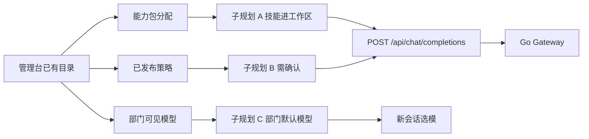

# 组织级生产：员工在工作区用上企业能力

Planned-with: grok-4.7
Suggested-Impl-Model: 本文件不单独实施。子规划见文末表。

> **For implementer:** 只凭本文和被点名的子规划落地。不要回看规划对话。三份子规划不要并行改 `enterprise/apps/web-portal/src/app/api/chat/completions/route.ts`。

**Goal:** 让企业员工在前台工作区用到已分配的企业技能，敏感请求能停下来等人确认，新会话能落到部门默认模型。

**Architecture:** 不新造智能体运行时，也不做云端设备池。三条增量都接在已经存在的链路上：能力包分配、内容策略引擎、部门可见模型级联。前台聊天仍走 `POST /api/chat/completions` → Go Gateway。

**Tech Stack:** Next.js web-portal / admin-console，Go gateway，Drizzle（PostgreSQL 与 MySQL 双份 schema），现有 `@agenticx/feature-chat` 与 `packages/sdk-ts`。

---

## 为什么是这三件事

仓库里控制面已经能演示：身份与部门、OIDC、内容策略（拦截 / 脱敏 / 警告）、审计、计量、模型接入、技能登记与扫描、能力包按 `all` / `dept:<id>` / 用户分配、部门可见模型级联收窄、部门 token 配额。

员工发一条消息时，这三样还没接上：

| 缺口 | 证据 | 价值 |
|---|---|---|
| 已分配技能不进入前台对话 | `capability-packs-reader.ts` 把技能下发给客户端；`completions/route.ts` 只注入当前时间，不读技能正文 | 最高。目录已经有了，缺的是工作区里的一次调用 |
| 策略只有拦截 / 脱敏 / 警告 | `enterprise/features/policy/src/types.ts` 的 `PolicyRuleAction`；`enterprise/packages/policy-engine/types.go` 同三态。跨境 `require_approval` 是直接 403，不是确认后续跑 | 次高。技能一旦进对话，敏感内容需要「停下等人」而不是只拦死 |
| 部门有可见集合，没有默认模型 | `effective-models.ts` 只做集合交集；`enterprise_runtime_user_visible_models` 无优先级列。配额容量已在 `/metering/quota` | 第三。改动小，新会话立刻体现「部门用哪一个模型」 |

明确不做（写进每个子规划的 Out of scope，实施时禁止顺手加）：

- 云电脑 / 云手机的采购、分配、回收
- 组织运行全景（「N 个 Agent 工作中」）。等技能调用和确认单有了稳定事件再做
- 业务对象级数据权限（客户档案、合同库）。现有策略 scope 继续管部门 / 用户 / 角色
- 重做 skill-registry、Desktop 同步、能力包分配模型
- 把 Machi 桌面运行时搬进 enterprise

## 实施顺序

A 与 B 都改 `completions/route.ts`，必须串行。C 不碰这条路由，可以与 A 并行。

| 顺序 | 子规划 | 原因 |
|---|---|---|
| 1 | C 部门默认模型 | 独立、面小，先把「部门供给」补完。不阻塞 A |
| 2 | A 技能进工作区 | 价值最高。沿用现有拦截 / 脱敏 / 警告 |
| 3 | B 需确认 | 在 A 已经把技能正文注入同一请求之后，给敏感请求加暂停。不要和 A 同时改路由 |

B 不要排在 A 前面：没有技能正文时，确认单缺少可感知的企业动作，演示价值低。

## 2026-09-24 范围确认

对照「多端账号与资产打通、一个订阅、一个底座、一个后台」这类办公套件叙事后，三份子规划的范围保持不变，只收紧两处预期。

已经有、不必为这篇叙事重做的：一个管理后台、部门与成员、内容策略、审计、按部门/用户的 token 配额与用量。统一 Credit 不新开计划。

这篇叙事里我们**不在本波做**的：

- 文档套件、网盘、设计画布。Enterprise 没有这些产品，禁止在 A/B/C 里顺手加「办公套件接入」。
- 各端共用一份办公记忆。前台聊天与桌面端仍是两条运行时。A 只让前台读到已分配技能，不把桌面会话和前台会话合成一份上下文。
- 确认后把产出回写知识库。企业知识库仍是 stub。这是 A/B 之后的单独计划，不塞进 B 的请求前确认单。

因此：先发仍是 C 与 A。B 继续是「请求命中规则后暂停」，不是「成果确认后入库」。交付时不要把 A 说成套件里的可调用能力。

## 2026-09-24 访问控制对照

「组织、角色、用量、工具访问、敏感操作停下来确认」这一类管理说明，大部分已经在现有控制面里：部门与成员、OIDC、RBAC、内容策略、按部门/用户的配额与用量、能力包按人/部门分配。不要为这篇说明重开 C，也不要把它写成新的 master。

它对 B 的含义要分开：

- 那边的默认模式是：任务在工作区里继续做；碰到敏感路径、重要删除、脚本、命令或网络风险时，**当前用户**确认。另有一种完全访问模式。
- 本规划的 B 是：已发布的内容规则命中后，**管理员**批一张单，模型才被调用。

这是两种确认。B 不要改成工具执行确认，那要等前台真有工具循环。桌面端已有询问 / 全部自动执行，不在 A/B/C 里重做。IP 白名单、连接器逐个授权如果还缺，另立小计划，不塞进这三份。

安全与数据保护那一层同样不进这三份：按任务划独立工作目录、命令沙箱、删除前备份、专享网络隔离。技能安装前扫描已经有 skill-registry；A 只允许 `safe` 进提示词，不要在 A 里再做一套扫描或沙箱。

「理解需求、规划步骤、调用工具、交付可检查文件」是桌面端已经在做的执行产品。本波 A 只把已授权技能说明注入前台会话，不在前台做规划器、文件交付、专家角色或连接器执行。专家、技能、连接器三者的协同不在 A/B/C。落地方式保持：先一个可核对的场景，不在这三份里铺全部门流程。

管理台「企业智能体」列表也不是 A。那边的 Agent 是一条可下发的配置：模型、角色（系统提示）、技能和工具；分享给成员后，每人打开得到自己的 Session，Session 带独立云端沙箱，对话和文件留在该 Session 里下次接着做。我们后台有能力包和模型分配，没有这张 Agent 表，也没有按人隔离的云端 Session。A/B/C 不要顺手做这张表或「下发策略」页。若要做，单独立项，且排在前台真能执行工具之后。

## 子规划与推荐模型

| 子规划 | 文件 | Suggested-Impl-Model | 理由 |
|---|---|---|---|
| C 部门默认模型 | `.cursor/plans/pending/2026-09-23-enterprise-dept-default-model.plan.md` | composer-2.5 | 表 + 纯函数 + 部门模型表单，契约已写死 |
| A 技能进工作区 | `.cursor/plans/pending/2026-09-23-enterprise-skill-workspace.plan.md` | composer-2.5 | BFF 注入与芯片。正文拉取的主机白名单、体积、判定值已写死，禁止另起运行时 |
| B 需确认 | `.cursor/plans/pending/2026-09-23-enterprise-policy-hold.plan.md` | 强推理档（跨栈状态机） | Gateway、策略类型、前台卡片、审批 scope 必须同一套 hold 状态。弱模型容易把 403、拦截、确认写成三套语义 |

开始实施前，把对应文件从 `.cursor/plans/pending/` **移到** `.cursor/plans/` 根目录，再开分支。一次只移正在做的那一份。

## 共享不变量

- 前台请求体里的 `agenticx_*` 字段必须在转发给 Gateway 之前剥掉。现有剥法在 `completions/route.ts` 约 L140–L148（`agenticx_web_search` / `agenticx_deep_research`）。
- 技能 id 用 `skill:<ulid>`，与 `enterprise/packages/db-schema/src/schema/capability-packs.ts` 头注释一致。禁止用 slug 做授权键。
- 可见模型与能力分配的 key 继续共用 iam-core 的解析：`all` / `dept:<id>` / 用户 ulid。不要在子规划里重写一套 key。
- PostgreSQL 与 MySQL 的 schema 成对改。只改一边视为未完成。
- 客户名、客户目录、竞品产品名不进入这些 plan，也不进入 commit subject。
