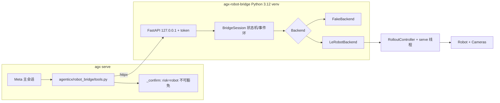

# 机器人策略桥接服务 + robot_* 工具（MVP）

Planned-with: Claude Opus 5.5

Suggested-Impl-Model: 见下方「子规划 → 推荐模型」表（最终 `Impl-Model` 以实际使用为准）

> **For implementer:** 只按本文件落地，不要依赖任何对话上下文。所有路径相对仓库根 `/Users/hongyizhao/AgenticX`。遇到本文件未覆盖的决策点，停下来问，不要自行扩展范围（`no-scope-creep`）。

**Goal：** 让 Meta-Agent 能以"任务导演"身份驱动一个本机机器人策略会话：启动（加载策略 + 连机器人）、改子任务、复位、停止、查状态、看相机快照。实时控制环（30Hz）完全留在独立进程的 LeRobot 内，Agent 永远不下发关节动作。

**Architecture：**

- `packaging/robot-bridge/`：独立 Python 3.12 包 `agx-robot-bridge`（FastAPI，仅监听 127.0.0.1 + bearer token）。后端可插拔：`LeRobotBackend`（真实，包装 `lerobot.rollout.RolloutController`，需 `lerobot==0.6.2` extra）与 `FakeBackend`（纯 Python + numpy，供单测和无 torch 的端到端联调）。
- `agenticx/robot_bridge/`：AgenticX 侧 httpx 客户端 + 6 个 Studio 工具实现。沿用 `agenticx/cc_bridge/`、`agenticx/wb_bridge/` 顶层包先例（`pyproject.toml` 用 `[tool.setuptools.packages.find]`，**没有 `__init__.py` 的命名空间目录不会被打包**，所以不要放进 `agenticx/integrations/`）。
- 工具只在 `robot.enabled: true` **且** Meta 主会话（`active_avatar_id` 为空）时注入；分身、群聊、定时任务、子智能体都不注入。

**Tech Stack：** bridge：Python 3.12、FastAPI、uvicorn、pydantic v2、numpy、Pillow，可选 `lerobot==0.6.2`。AgenticX：现有 `httpx`、`ConfirmGate`、`ConfigManager`，**不新增依赖**。

---

## 规划依据（证据链，实施者可自行核对）

调研与 PoC 物料在 `research/codedeepresearch/lerobot/`（gitignored，仅本机可见；关键结论已抄进本节，不依赖该目录）。上游锁定 `huggingface/lerobot` SHA `e595b7902714ba51f91e47523f66f89c5181b649`（v0.6.2，Apache-2.0）。

1. **上游控制面可嵌入**：`lerobot/rollout/controller.py` 的 `RolloutController(strategy, ctx, on_event)` 提供线程安全的 `start()->bool` / `reset()->bool` / `stop()->None` / `set_task(str)->bool`，属性 `task` / `initial_task` / `running` / `stopped` / `failed` / `failure_traceback`；`serve()` 阻塞调用线程，一次性（返回后不可再用）。要求 `ctx.runtime.shutdown_event` 是 `LinkedEvent`。事件 `RolloutEvent`：`SEGMENT_STARTED` / `SEGMENT_ENDED` / `RESET_STARTED` / `RESET_DONE` / `RESET_SKIPPED` / `RESET_FAILED` / `QUERY_ANSWERED` / `ENGINE_FAILED` / `STRATEGY_FAILED` / `STOPPED`，全部在 serve 线程触发，回调必须快且不得回调控制器的阻塞方法。
2. **CLI 组装顺序**（`lerobot/scripts/lerobot_rollout.py:222-272`）：`build_rollout_context(cfg, LinkedEvent(shutdown_event))` → `strategy = create_strategy(cfg.strategy)` → `strategy.setup(ctx)` → 运行 → `finally: strategy.teardown(ctx)`。`main()` 先调 `register_third_party_plugins()`。
3. **配置只能经 argv 构造**：`RolloutConfig.__post_init__`（`lerobot/rollout/configs.py:397-409`）通过全局 `parser.get_path_arg("policy")` 从 `sys.argv` 读 `--policy.path`；`parser.wrap()`（`lerobot/configs/parser.py:384-443`）负责剥离 `.path` 参数再交给 draccus。因此 bridge 必须"临时替换 `sys.argv` + 调用一个 `@parser.wrap()` 装饰的函数"来得到 `RolloutConfig`，且该操作全进程串行。
4. **PoC F-1（标定吞输入，高）**：`build_rollout_context` 在 `lerobot/rollout/context.py:394` 调 `robot.connect()`（默认 `calibrate=True`）；未标定的 SO 系列机器人会进入 `calibrate()` 并阻塞在 `input()`。PoC 实测：管道写入的第一条 `/start` 被吞掉，会话从未运行，连接阶段一直阻塞直到 stdin 来一行。
5. **PoC F-2（启动确认≠运动确认，高）**：agx 现有 `bash_bg_start` 只以 `risk=non_whitelisted` 确认一次拉起进程，之后运动类指令全部无确认。另外两条放行捷径：(a) `agenticx/cli/agent_tools.py` 的 `_confirm`（约 L3885-3976）在进入确认门前先调 `tool_allowed_without_confirm(tool, risk_codes)`（约 L113-143，按 `permissions.allowed_tools` 做 `fnmatch`，`*` 即全放行）与 `_unattended_workspace_script_allowed`（约 L3837）；(b) 前端 `desktop/src/utils/confirm-scope.ts` 的 `canReuseConfirmPolicy` 对 `non_whitelisted` 允许"全部允许"复用。自动模式下 `agenticx/studio/server.py:1360-1363` 使用 `RiskAwareAutoConfirmGate`，受保护风险仍会弹确认。
6. **PoC F-3（回位开环且时序紧，中）**：`RolloutStrategy.return_to_initial_position(hw, duration_s=3.0, fps=50)`（`lerobot/rollout/strategies/core.py:228`，静态方法）是开环插值，发完即返回 `True`，不回读是否到位。`BaseStrategy.teardown`（`lerobot/rollout/strategies/base.py:90-95`）按 `ctx.runtime.cfg.return_to_initial_position` 决定是否回位，然后断开。PoC 实测 SIGTERM 优雅退出（停推理 + 回位 + 断开）耗时 3.75–3.86s。
7. **PoC F-4（离线失败，中）**：ACT 等带 `pretrained_backbone_weights` 字段的策略在构造期会从 `download.pytorch.org` 下载 ImageNet 权重（随后被 checkpoint 覆盖）。网络受限时直接 `URLError`。把该字段置 `None` 即可离线（PoC 用 `--policy.pretrained_backbone_weights=null` 验证）。
8. **相机并发安全**：`OpenCVCamera.read_latest(max_age_ms)`（`lerobot/cameras/opencv/camera_opencv.py:585-615`）在 `frame_lock` 下非阻塞取帧；PoC 在同结构模拟相机上并发快照 44 次 0 错误。
9. **`view_image` 不接受工作区外路径**：`_load_image_target`（`agent_tools.py` 约 L7882-7943）对本地路径走 `_resolve_workspace_path(target, session, pick_existing=True)`。所以快照不能靠"返回路径让模型再调 `view_image`"，而由 `robot_snapshot` 直接写入 pending 视觉附件（复用 `_pending_visual_attachments` / `_data_url_from_bytes` / `_session_vision_capable` / `_VIEW_IMAGE_MAX_PENDING` / `_VIEW_IMAGE_MAX_BYTES`，均在 `agent_tools.py` 约 L7635-7985）。
10. **不能把新类别塞进 `NEVER_AUTO_APPROVED_CATEGORIES`**：`tests/test_command_safety.py:112` 断言命令分类器能产出该集合的每一项；非命令类别会让它失败。所以不可豁免性在 `_confirm` 里按 `risk` 实现。



---

## 子规划 → 推荐模型

| 子规划 | Suggested-Impl-Model | 理由 |
|---|---|---|
| RB-1 bridge 骨架 + FakeBackend + 单测 | GPT-5.6 Sol | 多线程状态机、事件顺序、幂等 stop，序列敏感 |
| RB-2 LeRobotBackend + 模拟机器人 + 集成测试 | GPT-5.6 Sol | 与上游生命周期强耦合，argv 解析、回位校验顺序不能错 |
| RB-3 配置 + client + 6 工具 + 单测 | Composer 2.5 | 规格写死的后端接线样板 |
| RB-4 risk=robot + dispatch + server.py | GPT-5.6 Sol | 改共享 `_confirm` 与高危 `server.py`，回归风险高 |
| RB-5 能力块 + context_usage + 文档 | Composer 2.5 | 小改、文案已给定 |

---

## In scope

- 新建 `packaging/robot-bridge/`（bridge 包、测试、模拟机器人插件、README）
- 新建 `agenticx/robot_bridge/`（`__init__.py` / `client.py` / `tools.py`）
- `agenticx/cli/config_manager.py`：新增 `RobotSettings` 与 `robot:` 解析
- `agenticx/runtime/confirm.py`：新增 `robot` 风险与理由、`NON_WAIVABLE_CONFIRM_RISKS`
- `agenticx/cli/agent_tools.py`：`_confirm` 两处精确改动 + `dispatch_tool_async` 一个转发分支
- `agenticx/studio/server.py`：一行 import + 一处条件追加（精确增行）
- `agenticx/runtime/prompts/meta_agent.py` + `agenticx/studio/context_usage.py`：能力块
- 测试：`packaging/robot-bridge/tests/*`、`tests/test_robot_bridge_*.py`
- 文档：`docs/guides/robot-bridge.md`

## Out of scope（严禁顺手做）

- 任何 `desktop/` 改动（确认理由由后端 `protected_reason` 下发；`robot` 在 `canReuseConfirmPolicy` 里天然不可复用）
- Electron 托管 bridge 进程、Desktop 设置页 GUI、常驻「停止机器人」按钮（稳定化阶段另立 plan）
- `/vqa`、`/autosteer`、`ask()` 暴露；DAgger/录制类策略；数据集录制；训练编排
- 分身 / 群聊 / 定时任务 / 子智能体（`team_manager.py`）注入机器人工具
- `studio_tools_for_session`（`agent_tools.py` 约 L3244）与 `team_manager.py` L449-459 **不改**
- 修改 `NEVER_AUTO_APPROVED_CATEGORIES`、`tool_allowed_without_confirm` 本体、`RiskAwareAutoConfirmGate`
- 修改 `agenticx/embodiment/**`、`ToolFallbackChain`、pending 的 hardware plan 涉及的任何文件
- 把 lerobot / torch 加进 AgenticX 主 `pyproject.toml` 或 PyInstaller spec
- 远程（非 127.0.0.1）bridge、gRPC、async_inference

---

## 配置契约（写全）

`~/.agenticx/config.yaml`，缺省等于关闭：

```yaml
robot:
  enabled: false
  bridge_url: "http://127.0.0.1:8766"
  token: ""                              # 非空则直接用；空则读 token_file
  token_file: "~/.agenticx/robot_bridge.token"
  default_max_relative_target: 10.0      # 可为 null；为 null 时 profile 必须自带
  confirm_each_task: true                # robot_set_task / robot_reset 是否逐次确认
  load_timeout_s: 300
  stop_timeout_s: 30
  home_tolerance: 5.0
  offline_backbone: true
  profiles:
    so101_desk:
      type: so101_follower               # 必填，LeRobot --robot.type
      port: /dev/tty.usbmodem5A460829821 # 可选
      id: my_follower                    # 可选
      policy_path: ""                    # 可选默认策略（本地目录或 HF repo id）
      max_relative_target: 10.0          # 可选，覆盖 default_max_relative_target
      cameras: {}                        # 可选，原样透传给 --robot.cameras
      extra: {}                          # 可选，逐项透传为 --robot.<key>=<value>
```

解析规则：`enabled` / `confirm_each_task` / `offline_backbone` 用 `bool(...)`；数值用 `float(...)`，解析失败回落默认值；`default_max_relative_target` 允许 `None`；`profiles` 非 dict 时视为 `{}`，每个 profile 非 dict 或缺 `type` 则跳过。

---

## RB-1 bridge 骨架（`packaging/robot-bridge/`）

### 文件清单

```
packaging/robot-bridge/
  pyproject.toml
  README.md
  NOTICE
  agx_robot_bridge/
    __init__.py            # __version__ = "0.1.0"
    errors.py
    models.py
    events.py
    backend.py             # RolloutBackend Protocol + PoseCheck
    fake_backend.py
    lerobot_backend.py     # RB-2
    imaging.py
    security.py
    session.py
    app.py
    cli.py
  sim/lerobot_robot_agx_sim/   # RB-2
  tests/
    conftest.py
    test_events.py
    test_session_fake.py
    test_app.py
    test_imaging.py
    test_security.py
    test_lerobot_backend_sim.py  # RB-2，条件跳过
```

本 plan 新建的**所有** Python 文件（`packaging/robot-bridge/**`、`agenticx/robot_bridge/**`、`tests/test_robot_bridge_*.py`，含测试与 `conftest.py`、模拟机器人插件）统一使用以下文件头，Author 固定写 `Hongyi Zhao`：

```python
#!/usr/bin/env python3
"""<一句英文描述>.

Author: Hongyi Zhao
"""
```

只改动、不新建的既有文件（`config_manager.py`、`confirm.py`、`agent_tools.py`、`server.py`、`meta_agent.py`、`context_usage.py`）**保留原文件头不动**。commit trailer 的 `Made-with: Damon Li` 按仓库规则照旧，与文件头 Author 无关。

### `pyproject.toml`

```toml
[build-system]
requires = ["setuptools>=64"]
build-backend = "setuptools.build_meta"

[project]
name = "agx-robot-bridge"
version = "0.1.0"
description = "Local HTTP bridge that lets AgenticX drive a robot policy rollout session"
requires-python = ">=3.12"
license = { text = "Apache-2.0" }
dependencies = ["fastapi>=0.110", "uvicorn>=0.29", "pydantic>=2.5", "numpy>=1.26", "pillow>=10"]

[project.optional-dependencies]
lerobot = ["lerobot[dataset]==0.6.2"]
test = ["pytest>=8", "httpx>=0.25"]

[project.scripts]
agx-robot-bridge = "agx_robot_bridge.cli:main"

[tool.setuptools]
packages = ["agx_robot_bridge"]

# Own pytest config so the repository-root one (asyncio_mode, testpaths) is never picked up here.
[tool.pytest.ini_options]
testpaths = ["tests"]
pythonpath = ["."]
```

（`[tool.pytest.ini_options]` 必须有：否则 pytest 会向上找到仓库根 `pyproject.toml` 的 `asyncio_mode = "auto"` / `testpaths`，在不装 pytest-asyncio 的 bridge 环境里出错。）

`NOTICE`：写明运行时可选依赖 LeRobot（`https://github.com/huggingface/lerobot`，Apache-2.0），本包不含其源码。

### `errors.py`

```python
class BridgeError(Exception):
    def __init__(self, code: str, message: str, *, hint: str = "", status: int = 400) -> None:
        super().__init__(message)
        self.code, self.message, self.hint, self.status = code, message, hint, status

class InteractiveInputBlocked(RuntimeError):
    """Raised when library code calls input() inside the bridge process."""
```

错误码常量（字符串，写全）：`unauthorized`（401）、`session_active`（409）、`not_found`（404）、`invalid_state`（409）、`max_relative_target_required`（400）、`calibration_required`、`robot_connect_failed`、`policy_load_failed`、`stdin_input_blocked`、`no_camera`（404）、`internal_error`（500）。后四个加载期错误不作为 HTTP 状态返回，而是写进 session 的 `error_code`（session `state=failed`）。

### `models.py`（pydantic v2）

```python
class RobotSpec(BaseModel):
    type: str
    port: str | None = None
    id: str | None = None
    cameras: dict[str, Any] = Field(default_factory=dict)
    max_relative_target: float | None = None
    extra: dict[str, Any] = Field(default_factory=dict)

class SessionCreate(BaseModel):
    robot: RobotSpec
    policy_path: str
    task: str
    fps: float = 30.0
    duration_s: float = 0.0          # 0 = 每段不限时
    device: str | None = None
    home_tolerance: float = 5.0
    offline_backbone: bool = True

class TaskUpdate(BaseModel):
    task: str
```

校验：`policy_path`、`task`、`robot.type` 去空白后非空，否则 422（pydantic `field_validator`）。

### `events.py`

`EventLog`：线程安全环形缓冲，`maxlen=500`，`seq` 从 1 单调递增（丢弃旧事件不回收 seq）。

```python
class EventLog:
    def append(self, type_: str, detail: dict[str, Any] | None = None) -> int: ...
    def since(self, seq: int) -> list[dict[str, Any]]:   # 返回 seq > 参数的事件，按 seq 升序
        ...
    @property
    def last_seq(self) -> int: ...
```

事件 dict：`{"seq": int, "ts": float(time.time()), "type": str, "detail": dict}`。`type` 取值为上游 `RolloutEvent.value`（如 `"segment_started"`）或 bridge 自有：`"session_loading"`、`"session_ready"`、`"session_failed"`、`"pose_check"`、`"session_stopped"`。

### `backend.py`

```python
EventCallback = Callable[[str, dict[str, Any]], None]   # (event_type, detail)

@dataclass
class PoseCheck:
    context: str                 # "reset" | "stop"
    verified: bool | None        # None = 无法校验（无初始位姿 / 读取失败）
    max_abs_err: float | None
    tolerance: float
    error: str | None = None

class RolloutBackend(Protocol):
    def load(self, spec: SessionCreate, on_event: EventCallback) -> None: ...  # 阻塞；失败抛 BridgeError
    def start(self) -> bool: ...
    def set_task(self, task: str) -> bool: ...
    def reset(self) -> bool: ...
    def stop_and_teardown(self, tolerance: float) -> PoseCheck: ...   # 幂等；第二次返回上次结果
    def verify_pose(self, context: str, tolerance: float) -> PoseCheck: ...
    def read_frame(self, camera: str | None) -> tuple[str, "np.ndarray"]: ...  # (相机名, HxWx3 uint8 RGB)
    @property
    def task(self) -> str: ...
    @property
    def initial_task(self) -> str: ...
    @property
    def failure_traceback(self) -> str | None: ...
    @property
    def camera_names(self) -> list[str]: ...
    @property
    def supports_text_queries(self) -> bool: ...
```

`load()` 成功返回前，后端必须已经启动了自己的 serve 线程，并处于"空闲、未运动"状态。

### `fake_backend.py`（行为写死）

构造参数：`FakeBackend(*, calibrated=True, fail_on_start=False, pose_error=0.0, load_delay_s=0.0, joints=6, cameras=("front",))`。

- `load`：`time.sleep(load_delay_s)`；`calibrated=False` 时抛 `BridgeError("calibration_required", "robot is not calibrated", hint="lerobot-calibrate --robot.type=<type> --robot.port=<port> --robot.id=<id>")`（用 spec 值替换占位）。成功后：`_initial = {f"j{i}.pos": 0.0}`，`_present` 为其拷贝，`_task = _initial_task = spec.task`，启动 daemon serve 线程。
- serve 线程：循环 `wait` 内部 `Event`，处理请求标志，行为与上游一致：
  - start：发 `segment_started`；若 `fail_on_start`：记 `failure_traceback = "Traceback ... FakeFailure"`，发 `strategy_failed`，然后发 `stopped` 并退出线程；否则把 `_present` 各关节设为 `10.0`（表示在动），直到 reset/stop；若 `spec.duration_s > 0`，到时发 `segment_ended`。
  - reset：发 `reset_started`，`_present = {k: v + pose_error for k, v in _initial.items()}`，发 `reset_done`。
  - stop：发 `stopped` 并退出线程。
- `start()`：已停止 / 已失败 / 正在运行时返回 False；否则置标志并返回 True。`set_task(t)`：已停止返回 False；返回值 = 是否真的改变。`reset()`：已停止返回 False；把 task 恢复为 `initial_task`，返回值 = 是否真的恢复。
- `stop_and_teardown(tol)`：置停止标志、`join(5)`；然后 `_present = {k: v + pose_error for k, v in _initial.items()}`，返回 `verify_pose("stop", tol)`；幂等（第二次直接返回缓存结果）。
- `verify_pose(ctx, tol)`：`err = max(abs(_present[k] - _initial[k]))`；返回 `PoseCheck(ctx, err <= tol, round(err, 4), tol)`。
- `read_frame(cam)`：`cam` 为 None 取第一个；不在 `cameras` 中抛 `BridgeError("no_camera", ..., status=404)`；返回 `np.full((480, 640, 3), 80, np.uint8)`。
- `supports_text_queries` 恒 False。

### `imaging.py`

```python
def encode_png(frame: np.ndarray, *, max_width: int = 640) -> tuple[bytes, int, int]:
    """RGB uint8 HxWx3 -> PNG bytes, downscaled (keep aspect) so width <= max_width."""
```

用 Pillow：`Image.fromarray(frame, "RGB")`，宽度超限时 `resize((max_width, round(h * max_width / w)), Image.BILINEAR)`，`save(buf, "PNG", optimize=True)`；返回 `(bytes, width, height)`。输入非 uint8 或形状不是 `(H, W, 3)` 抛 `ValueError`。

### `security.py`

```python
DEFAULT_TOKEN_FILE = Path("~/.agenticx/robot_bridge.token").expanduser()

def load_or_create_token(path: Path) -> str:
    """Read token; create 0600 file with secrets.token_urlsafe(32) when missing/empty."""

def install_input_guard() -> None:
    """Make any input() in this process fail fast instead of blocking or eating a line."""
```

`install_input_guard` 必须做两件事：(1) `builtins.input = _blocked_input`，后者抛 `InteractiveInputBlocked(f"interactive input requested: {prompt!r}")`；(2) `sys.stdin = open(os.devnull, "r")`。幂等（重复调用无副作用）。**只在 `cli.main()` 里调用**，库代码与测试 import 时不自动安装。

### `session.py`

状态常量：`LOADING="loading"`、`IDLE="idle"`、`RUNNING="running"`、`RESETTING="resetting"`、`FAILED="failed"`、`STOPPING="stopping"`、`STOPPED="stopped"`。

```python
class BridgeSession:
    def __init__(self, session_id: str, spec: SessionCreate, backend: RolloutBackend,
                 snapshot_dir: Path) -> None: ...
    def begin_load(self) -> None: ...          # 起后台线程执行 _load
    def start(self) -> dict: ...
    def set_task(self, task: str) -> dict: ...
    def reset(self) -> dict: ...
    def stop(self) -> dict: ...                # 幂等，任何状态可调
    def status(self, since: int = 0) -> dict: ...
    def snapshot(self, camera: str | None) -> dict: ...
    @property
    def torn_down(self) -> bool: ...
```

规则（写死）：

- 全部可变字段由 `self._lock = threading.RLock()` 保护。
- `_load`（后台线程）：记 `session_loading` 事件 → `backend.load(spec, self._on_backend_event)`。
  - 成功：若此时 `_stop_requested` 为真，立即执行 `_do_stop()`；否则 `state=IDLE`，记 `session_ready` 事件（detail 含 `cameras`、`supports_text_queries`）。
  - 抛 `BridgeError e`：`state=FAILED`，`error_code=e.code`、`error=e.message`、`hint=e.hint`，`torn_down=True`（加载失败时后端负责清理硬件），记 `session_failed` 事件。
  - 抛 `InteractiveInputBlocked e`：同上，`error_code="stdin_input_blocked"`，`hint` 为"LeRobot 请求了交互输入（通常是标定）。请在终端先完成 lerobot-calibrate 后重试。"
  - 其他异常：同上，`error_code="policy_load_failed"`，`failure_traceback=traceback.format_exc()[-4000:]`。
- `_on_backend_event(type_, detail)`：写 `EventLog`，并按下表迁移状态（`state` 为 STOPPING/STOPPED 时只记事件不迁移）：

| 事件 | 新状态 |
|---|---|
| `segment_started` | RUNNING |
| `segment_ended` | IDLE |
| `reset_started` | RESETTING |
| `reset_done` | IDLE；并起 `threading.Timer(0.5, self._verify_after_reset)` |
| `reset_skipped` / `reset_failed` | IDLE |
| `engine_failed` / `strategy_failed` | FAILED；`error_code="internal_error"`，`failure_traceback=backend.failure_traceback[-4000:]` |
| `stopped` | 不迁移（由 `stop()` 负责最终状态） |

- `_verify_after_reset`：`pc = backend.verify_pose("reset", spec.home_tolerance)`，存 `self._pose_check`，记 `pose_check` 事件（detail 为 `asdict(pc)`）。
- `start()`：`state != IDLE` → `BridgeError("invalid_state", f"cannot start in state {state}", status=409)`；否则返回 `{"accepted": backend.start()}`。
- `set_task(task)`：`state in {LOADING, FAILED, STOPPING, STOPPED}` → 409 `invalid_state`；否则 `{"changed": backend.set_task(task), "task": backend.task}`。
- `reset()`：`state not in {IDLE, RUNNING}` → 409；否则 `{"accepted": True, "restored": backend.reset()}`。
- `stop()`：
  - `state == STOPPED`：返回 `{"state": STOPPED, "pose_check": asdict(pose_check) or None}`。
  - `state == STOPPING`（加载中已请求停止，或另一个 stop 正在拆除）：直接返回 `{"state": STOPPING, "pose_check": None}`，HTTP 202，**不得**并发发起第二次拆除。
  - `state == LOADING`：`_stop_requested = True`、`state=STOPPING`，返回 `{"state": STOPPING, "pose_check": None}`，HTTP 202。加载成功后由加载线程执行 `_do_stop()`；加载失败则直接进入 STOPPED（保留 `error_code`）。
  - `torn_down` 为真（加载失败）：`state=STOPPED`，返回同上。
  - 其余：`state=STOPPING` → `_do_stop()` → 返回。
- `_do_stop()`：**调用 `backend.stop_and_teardown` 时不得持有 session 锁**（它会 join serve 线程，而 serve 线程的事件回调需要 session 锁，持锁即死锁）。先取消未触发的 reset 校验 Timer；`pc = backend.stop_and_teardown(spec.home_tolerance)`；存 `pose_check`；`state=STOPPED`；`torn_down=True`；记 `session_stopped` 事件（detail 含 `pose_check`）。异常时 `state=STOPPED`、`torn_down=True`、`error_code="internal_error"`、`pose_check` 为 `verified=None` 且 `error` 含异常信息，并记录 traceback（**无论如何都要进入 STOPPED，不能卡在 STOPPING**）。
- `_verify_after_reset` 的两条保护：触发时 `state` 为 FAILED / STOPPING / STOPPED 则什么都不记；`state` 为 RUNNING / RESETTING（用户已再次启动）则记一条 `verified=None`、`error="skipped: robot started moving again before the check"` 的 `pose_check`，不去读位姿。读完位姿后若 stop 已开始，则丢弃结果——**reset 的校验结果永远不能覆盖 stop 的结果**。
- 状态迁移与事件写入在 session 锁内完成（`session_ready` 在锁内与 `state=IDLE` 一起写），保证事件顺序与状态一致。
- `wait_torn_down(timeout) -> bool`：等待硬件释放（供 lifespan 关闭钩子使用）。
- `status(since)`：返回

```python
{"session_id", "state", "task", "initial_task", "supports_text_queries", "cameras",
 "events": log.since(since), "last_seq": log.last_seq,
 "pose_check": asdict(pc) | None, "error_code", "error", "hint", "failure_traceback"}
```

  `task` / `initial_task` 在 LOADING 或加载失败时取 `spec.task`。
- `snapshot(camera)`：`state not in {IDLE, RUNNING, RESETTING}` → 409；`name, frame = backend.read_frame(camera)`；`png, w, h = encode_png(frame)`；写 `snapshot_dir / f"{session_id}_{int(time.time()*1000)}.png"`（目录 `mkdir(parents=True, exist_ok=True)`）；返回 `{"path": str, "camera": name, "width": w, "height": h, "png_base64": base64.b64encode(png).decode()}`。

### `app.py`

```python
def create_app(*, token: str, backend_factory: Callable[[], RolloutBackend],
               snapshot_dir: Path, backend_name: str = "fake") -> FastAPI: ...
```

- `backend_name` 只用于 `/health` 的 `backend` 字段（cli 传 `args.backend`）。`FastAPI(docs_url=None, redoc_url=None, openapi_url=None)`：关闭免鉴权的文档接口。
- 全局依赖：检查 `Authorization: Bearer <token>`（`hmac.compare_digest`），不符 → 401 `{"ok": false, "error_code": "unauthorized", "error": "invalid or missing bearer token"}`。所有路由都需要 token，包括 `/health`。
- `BridgeError` 异常处理器：返回 `status=e.status`，body `{"ok": false, "error_code": e.code, "error": e.message, "hint": e.hint}`。
- 单会话管理器 `SessionManager`（`app.state.manager`），持有 `current: BridgeSession | None`，加 `threading.Lock`。
- 路由（写全）：

| Method | Path | 行为 |
|---|---|---|
| GET | `/health` | `{"ok": true, "version": __version__, "backend": <"lerobot"/"fake">, "python": platform.python_version(), "lerobot_version": <str or null>}` |
| POST | `/session` | `current` 存在且 `not current.torn_down` → 409 `session_active`（hint 含其 id）。`spec.robot.max_relative_target is None` → 400 `max_relative_target_required`。否则 `session_id = "rs-" + secrets.token_hex(6)`，新建 `BridgeSession`，`begin_load()`，返回 202 `{"ok": true, "session_id": ..., "state": "loading"}` |
| GET | `/session/{sid}` | `?since=` int，默认 0；`{"ok": true, **session.status(since)}` |
| POST | `/session/{sid}/start` | `{"ok": true, **session.start()}` |
| POST | `/session/{sid}/task` | body `TaskUpdate`；`{"ok": true, **session.set_task(body.task)}` |
| POST | `/session/{sid}/reset` | `{"ok": true, **session.reset()}` |
| POST | `/session/{sid}/stop` | `{"ok": true, **session.stop()}`；返回 `state == "stopping"` 时状态码 202，否则 200 |
| GET | `/session/{sid}/snapshot` | `?camera=` 可选；`{"ok": true, **session.snapshot(camera)}` |

  `sid` 不等于 `current.session_id` → 404 `not_found`。
- lifespan 关闭钩子：`current` 存在且未拆除时调用 `current.stop()`，再 `wait_torn_down(15)`（加载中收到 SIGTERM 时要等加载线程完成拆除），成功记 info 日志（含 `pose_check`），超时记 error（uvicorn 收到 SIGTERM 时走这里，F-3）。钩子里用 `asyncio.to_thread` 调用，避免阻塞事件循环。
- 路由处理函数一律用同步 `def`（在线程池执行），因为 `stop` 会阻塞到拆除完成。

### `cli.py`

```
agx-robot-bridge serve [--host 127.0.0.1] [--port 8766] [--backend lerobot|fake]
                       [--token-file ~/.agenticx/robot_bridge.token]
                       [--snapshot-dir ~/.agenticx/robot/snapshots]
```

- `--host` 只允许 `127.0.0.1` / `localhost` / `::1`，否则打印错误并 `sys.exit(2)`。
- `main()` 顺序：解析参数 → **host 校验**（必须在安装输入守卫之前，否则测试进程的 `input` 会被替换）→ `install_input_guard()` → `token = load_or_create_token(path)` → 选择 backend factory（`lerobot`：延迟 `from .lerobot_backend import LeRobotBackend`，ImportError 时打印"未安装 lerobot extra：pip install 'agx-robot-bridge[lerobot]'"并退出 2；`fake`：`FakeBackend`）→ 日志写 `~/.agenticx/logs/robot_bridge/bridge.log`（`logging.FileHandler` + stderr）→ `uvicorn.run(app, host, port, log_level="info", log_config=None, timeout_graceful_shutdown=20)`（`log_config=None` 让 uvicorn 的启动错误与访问日志也进 `bridge.log`，便于追溯谁在何时下了什么命令）。uvicorn 优雅关闭后会重新抛出 SIGTERM，所以父进程看到的退出码是 -15 / 143，属正常。
- 启动时 stderr 打印一行 `robot bridge listening on http://<host>:<port> (backend=<name>, token_file=<path>)`，**不打印 token**。

### RB-1 验收（FR / AC）

在 bridge venv 里运行：`cd packaging/robot-bridge && python -m pytest tests -q -k "not lerobot_backend_sim"`。

- **FR-1 控制流**：`tests/test_session_fake.py::test_full_command_chain`：FakeBackend → 等到 `idle` → start → 等到 `running` → set_task("B")（`changed=True`）→ reset → 等到 `idle` 且 `task == initial_task` → stop。断言事件类型序列**按顺序包含** `session_loading, session_ready, segment_started, reset_started, reset_done, session_stopped`；最终 `state == "stopped"`。
- **FR-2 失败传播**：`test_strategy_failure`：`fail_on_start=True` → start 后等到 `failed`，`failure_traceback` 非空；再 start → 409 `invalid_state`；stop → 200 且 `state == "stopped"`。
- **FR-3 stop 永远可达**：`test_stop_while_loading`：`load_delay_s=0.5`，立即 stop → 202 `stopping`；轮询直到 `stopped`（≤3s）。`test_stop_idempotent`：连续两次 stop 都返回 `stopped` 且 `pose_check` 相同。
- **FR-4 标定失败**：`test_calibration_required`：`calibrated=False` → 最终 `failed`，`error_code == "calibration_required"`，`hint` 以 `lerobot-calibrate` 开头；再 `POST /session` 应被接受（`torn_down=True` 不占位）。
- **FR-5 回位校验**：`test_pose_check_reset_and_stop`：`pose_error=0.0` 时 reset 后 ≤2s 内出现 `pose_check` 事件且 `verified is True`；`pose_error=9.0`、`home_tolerance=5.0` 时 stop 返回 `pose_check.verified is False` 且 `max_abs_err == 9.0`。
- **FR-6 限幅强制**：`tests/test_app.py::test_max_relative_target_required`：body 中 `robot.max_relative_target` 为 null → 400 `max_relative_target_required`。
- **FR-7 token**：`test_auth`：无 header / 错误 token → 401 `unauthorized`；正确 token → `/health` 200。
- **FR-8 单会话**：`test_single_active_session`：第一个会话未 stop 时再 POST → 409 `session_active`；stop 后再 POST → 202。
- **FR-9 快照**：`test_snapshot_png`：`/snapshot` 返回的 `png_base64` 可被 `PIL.Image.open` 解码，宽度 == 640；`path` 文件存在；`camera=nope` → 404 `no_camera`。`tests/test_imaging.py`：1280×720 帧 → 输出 640×360；非法形状 → `ValueError`。
- **FR-10 输入守卫**：`tests/test_security.py::test_input_guard`（用 `monkeypatch` 保存/恢复 `builtins.input` 和 `sys.stdin`）：安装后 `input("x")` 抛 `InteractiveInputBlocked` 且消息含 `'x'`；`test_token_file_created_0600`：`tmp_path` 下不存在 → 创建，`stat().st_mode & 0o777 == 0o600`，再次读取值不变。
- **FR-11 本机绑定**：`test_cli_rejects_public_host`：`main(["serve", "--host", "0.0.0.0", "--backend", "fake"])` 以退出码 2 结束（`pytest.raises(SystemExit)`）。

- **补充用例（实施时加入，锁住上面的保护规则）**：`test_late_reset_check_does_not_replace_stop_result`（reset 后立刻 stop，0.8s 后 `pose_check.context` 仍为 `stop` 且无 `pose_check` 事件）、`test_commands_rejected_while_loading`、`test_segment_duration_returns_to_idle`、`test_unknown_session_is_404`、`test_blank_fields_rejected`（422）、`test_api_docs_are_disabled`、`test_lifespan_shutdown_stops_active_session`、`test_empty_token_file_is_regenerated`、`test_cli_serve_wiring`（host / port / `timeout_graceful_shutdown=20` / `log_config=None`）、`tests/test_events.py`（seq 单调、淘汰不回收 seq、返回副本、并发唯一）。
- **进程级冒烟（手测）**：`agx-robot-bridge serve --backend fake` 下走完 health → session → start → task → snapshot → reset → stop；运行中发 SIGTERM，`bridge.log` 出现 `session ... stopped: pose_check=...`，且 stdout / 日志不含 token。

测试用 `fastapi.testclient.TestClient`；轮询辅助函数统一在 `conftest.py`（以 fixture 形式提供）：`wait_state(client, sid, states, timeout=3.0)`。

---

## RB-2 `LeRobotBackend` + 模拟机器人（`packaging/robot-bridge/`）

### `agx_robot_bridge/lerobot_backend.py`

模块顶层**只**导入标准库、numpy 和本包模块；lerobot 相关 import 全部放在函数或 `__init__` 内（保证 fake 测试环境可 import 本模块）。

```python
_ARGV_LOCK = threading.Lock()
_PLUGINS_REGISTERED = False

def _parse_rollout_config(argv: list[str]):
    from lerobot.configs import parser
    from lerobot.rollout import RolloutConfig

    @parser.wrap()
    def _inner(cfg: RolloutConfig):
        return cfg

    with _ARGV_LOCK:
        saved = sys.argv
        sys.argv = ["agx-robot-bridge", *argv]
        try:
            return _inner()
        finally:
            sys.argv = saved
```

`build_argv(spec) -> list[str]`（纯函数，单测覆盖）：

```python
argv = [
    "--strategy.type=base",
    f"--policy.path={spec.policy_path}",
    f"--robot.type={spec.robot.type}",
    f"--task={spec.task}",
    "--interactive=true",
    "--play_sounds=false",
    "--display_data=false",
    "--return_to_initial_position=false",   # bridge 自己回位 + 校验（F-3）
    f"--fps={spec.fps}",
    f"--duration={spec.duration_s}",
    f"--robot.max_relative_target={spec.robot.max_relative_target}",
]
if spec.device: argv.append(f"--device={spec.device}")
if spec.robot.port: argv.append(f"--robot.port={spec.robot.port}")
if spec.robot.id: argv.append(f"--robot.id={spec.robot.id}")
if spec.robot.cameras: argv.append(f"--robot.cameras={json.dumps(spec.robot.cameras)}")
for key, value in spec.robot.extra.items():
    rendered = json.dumps(value) if isinstance(value, (dict, list)) else str(value).lower() if isinstance(value, bool) else str(value)
    argv.append(f"--robot.{key}={rendered}")
```

`load(spec, on_event)` 严格按以下顺序：

1. 若 `_PLUGINS_REGISTERED` 为假：`from lerobot.utils.import_utils import register_third_party_plugins; register_third_party_plugins()`，置真。
2. `cfg = _parse_rollout_config(build_argv(spec))`；异常 → `BridgeError("policy_load_failed", f"invalid rollout config: {exc}")`。
3. **F-4**：`if spec.offline_backbone and hasattr(cfg.policy, "pretrained_backbone_weights"): cfg.policy.pretrained_backbone_weights = None`。
4. **F-1 标定预检**：
   ```python
   from lerobot.robots.utils import make_robot_from_config
   probe = make_robot_from_config(cfg.robot)
   try:
       probe.connect(calibrate=False)
   except InteractiveInputBlocked:
       raise
   except Exception as exc:
       raise BridgeError("robot_connect_failed", f"cannot connect robot: {exc}",
                         hint="检查 USB 线缆、串口 port 与供电") from exc
   try:
       calibrated = bool(probe.is_calibrated)
   finally:
       try: probe.disconnect()
       except Exception: logger.warning("probe disconnect failed", exc_info=True)
   if not calibrated:
       raise BridgeError("calibration_required", "robot is not calibrated",
                         hint=f"lerobot-calibrate --robot.type={spec.robot.type} --robot.port={spec.robot.port or '<port>'} --robot.id={spec.robot.id or '<id>'}")
   ```
5. 构建：
   ```python
   from lerobot.rollout import LinkedEvent, RolloutController, RolloutEvent, build_rollout_context, create_strategy
   self._shutdown = LinkedEvent(threading.Event())
   self._ctx = build_rollout_context(cfg, self._shutdown)
   self._strategy = create_strategy(cfg.strategy)
   self._strategy.setup(self._ctx)
   self._controller = RolloutController(self._strategy, self._ctx, on_event=self._forward_event)
   self._thread = threading.Thread(target=self._controller.serve, name="rollout-serve", daemon=True)
   self._thread.start()
   ```
   步骤 5 中任何异常：若 `self._ctx` 已建立则 `try: self._strategy.teardown(self._ctx)`（strategy 未建则用 `create_strategy(cfg.strategy).teardown(self._ctx)`），然后 `InteractiveInputBlocked` 原样抛出、`BridgeError` 原样抛出、其他包成 `BridgeError("policy_load_failed", str(exc))`。
6. `self._forward_event(event, payload)`：`on_event(event.value, {})`；`QUERY_ANSWERED` 事件的 detail 可为 `{}`（MVP 不暴露问答）。
- `start` / `set_task` / `reset` 直接转发 `self._controller`；`task` / `initial_task` / `failure_traceback` 转发同名属性；`supports_text_queries` 取 `self._ctx.policy.inference.supports_text_queries`。
- `camera_names`：`list((getattr(self._ctx.hardware.robot_wrapper.inner, "cameras", None) or {}).keys())`。
- `read_frame(camera)`：`cams = getattr(robot.inner, "cameras", None) or {}`；为空或 camera 不存在 → `BridgeError("no_camera", ..., status=404)`；`frame = cams[name].read_latest(max_age_ms=1000)`；`np.asarray(frame, dtype=np.uint8)`。
- `verify_pose(context, tol)`：
  ```python
  hw = self._ctx.hardware
  if not hw.initial_position: return PoseCheck(context, None, None, tol, "no initial position captured")
  try:
      obs = hw.robot_wrapper.get_observation()
      err = max(abs(float(obs[k]) - float(v)) for k, v in hw.initial_position.items() if k in obs)
  except Exception as exc:
      return PoseCheck(context, None, None, tol, f"pose read failed: {exc}")
  return PoseCheck(context, err <= tol, round(err, 4), tol)
  ```
- `stop_and_teardown(tol)`（幂等，缓存结果）：
  ```python
  self._controller.stop()
  self._thread.join(timeout=10)
  from lerobot.rollout import RolloutStrategy
  hw = self._ctx.hardware
  pose = PoseCheck("stop", None, None, tol, "robot not connected")
  if hw.robot_wrapper.inner.is_connected and hw.initial_position:
      try:
          RolloutStrategy.return_to_initial_position(hw)
          time.sleep(0.5)
          pose = self.verify_pose("stop", tol)
      except Exception as exc:
          pose = PoseCheck("stop", None, None, tol, f"return failed: {exc}")
  self._strategy.teardown(self._ctx)   # cfg.return_to_initial_position=False → 只停引擎 + 断开
  return pose
  ```
- `/health` 的 `lerobot_version`：`app.py` 里 `try: import lerobot; lerobot.__version__ except ImportError: None`。

### 模拟机器人插件 `packaging/robot-bridge/sim/lerobot_robot_agx_sim/`

用途：无硬件集成测试与演示。包名必须以 `lerobot_robot_` 开头（LeRobot 按分发名前缀自动发现第三方插件，`lerobot/utils/import_utils.py:273-278`）。

```
sim/lerobot_robot_agx_sim/
  pyproject.toml          # name = "lerobot_robot_agx_sim"，packages = ["lerobot_robot_agx_sim"]，requires-python >=3.12
  lerobot_robot_agx_sim/__init__.py      # 导出 AgxSimSO101, AgxSimSO101Config
  lerobot_robot_agx_sim/agx_sim_so101.py
```

`agx_sim_so101.py` 规格（写死）：

- `@RobotConfig.register_subclass("agx_sim_so101")` + `@dataclass(kw_only=True) class AgxSimSO101Config(RobotConfig)`，字段：`camera_names: list[str] = ["front", "handeye"]`、`height: int = 480`、`width: int = 640`、`camera_fps: int = 30`、`calibrated: bool = True`、`max_relative_target: float | None = None`。**不要**定义名为 `cameras` 的配置字段（`RobotConfig.__post_init__` 会按真实相机配置校验它）。
- `class AgxSimSO101(Robot)`，`config_class = AgxSimSO101Config`，`name = "agx_sim_so101"`。
- 关节 `JOINTS = ("shoulder_pan", "shoulder_lift", "elbow_flex", "wrist_flex", "wrist_roll", "gripper")`；限位：前 5 个 `[-110, 110]`，`gripper` `[0, 100]`；初始位姿全 0，`gripper = 20`。
- `observation_features`：`{f"{j}.pos": float}` + 每个相机 `name: (height, width, 3)`；`action_features`：`{f"{j}.pos": float}`。
- 独立 100Hz 伺服线程：每 10ms `present[j] += 0.2 * (goal[j] - present[j])`（模拟舵机自主运动；**不能**只在 `get_observation` 里推进，否则回位期间关节不动）。
- 相机：实例属性 **`self.cameras: dict[str, _SimCamera]`**（bridge 通过 `robot.cameras[name].read_latest()` 取快照）。`_SimCamera` 结构同 `OpenCVCamera`：后台线程按 `camera_fps` 渲染帧（`cv2` 画关节读数与简易臂示意），`frame_lock` 保护 `latest_frame` / `latest_timestamp`，`read_latest(max_age_ms=500)` 语义与 `camera_opencv.py:585-615` 一致。
- `connect(calibrate=True)`：`if not self.is_calibrated and calibrate: self.calibrate()`；启动伺服线程与相机线程。`calibrate()`：调用 `input("Press ENTER to use provided calibration file, or type 'c' and press ENTER to run calibration: ")`（复刻真实 SO follower 行为），之后置已标定。`is_calibrated` 返回内部标志（初值取配置 `calibrated`）。
- `send_action`：按限位裁剪，再按 `max_relative_target` 对 `|goal - present|` 单步限幅；更新 `goal`；返回实际下发值（`.pos` 键）。
- `disconnect()`：停相机线程，`time.sleep(0.2)` 让伺服收敛，停伺服线程。

可参照 PoC 原型 `research/codedeepresearch/lerobot/poc/plugins/lerobot_robot_agx_sim/`（本机存在时），但以本节规格为准：PoC 版本的快照线程与 `status.json` 写盘**不要**带进来，相机属性名要从 `_cameras` 改为 `cameras`。

### RB-2 验收（FR / AC）

- **FR-12 argv 构造**：`tests/test_lerobot_backend_sim.py::test_build_argv`（**不需要** lerobot）：断言含 `--return_to_initial_position=false`、`--interactive=true`、`--robot.max_relative_target=10.0`；`extra={"calibrated": False}` 渲染为 `--robot.calibrated=false`；`cameras={"front": {...}}` 渲染为 JSON。
- **集成测试**（同文件，`pytest.importorskip("lerobot")` 且环境变量 `AGX_ROBOT_BRIDGE_POLICY_PATH` 指向本地 SO-101 ACT checkpoint 目录，否则跳过；需预先 `pip install -e sim/lerobot_robot_agx_sim`）：
  - **FR-13 全链路**：`robot.type=agx_sim_so101`、`max_relative_target=10`、`device="cpu"`（或本机可用的 mps）→ 等到 `idle`（≤120s）→ start → 等到 `running` → 5s 后 snapshot 可解码 → reset → `pose_check.verified is True` → stop → `pose_check.verified is True`、`state == "stopped"`。
  - **FR-14 标定 fail-closed（F-1）**：`extra={"calibrated": False}` → `failed`，`error_code == "calibration_required"`；进程未阻塞（整个用例 ≤30s 内结束）。
  - **FR-15 离线（F-4）**：直接调 `build_argv` + `_parse_rollout_config` + F-4 步骤后断言 `cfg.policy.pretrained_backbone_weights is None`。
- 参考权重（仅本机手测）：Hugging Face `kai-yamada/act_so101_pick_cube`（ACT，Apache-2.0，约 207MB，输入 6 维状态 + `front`/`handeye` 480×640 两路图像，输出 6 维动作）。

---

## RB-3 AgenticX：配置、客户端、6 个工具

### RB-3a `agenticx/cli/config_manager.py`

在 `ComputerUseSettings`（约 L112-123，`@dataclass class ComputerUseSettings`）**之后**新增，不改它的字段：

```python
@dataclass
class RobotSettings:
    """Robot policy bridge integration. Default off."""

    enabled: bool = False
    bridge_url: str = "http://127.0.0.1:8766"
    token: str = ""
    token_file: str = "~/.agenticx/robot_bridge.token"
    default_max_relative_target: Optional[float] = 10.0
    confirm_each_task: bool = True
    load_timeout_s: float = 300.0
    stop_timeout_s: float = 30.0
    home_tolerance: float = 5.0
    offline_backbone: bool = True
    profiles: Dict[str, Dict[str, Any]] = field(default_factory=dict)
```

（`Optional` / `Dict` / `Any` 已在 L14 `from typing import Any, Dict, Optional, Tuple` 导入。）

`AgxConfig`（约 L206 `computer_use: ComputerUseSettings = ...` 行）之后加一行：

```python
    robot: RobotSettings = field(default_factory=RobotSettings)
```

解析：紧跟 `cu_raw` 三行（约 L380-382）之后加：

```python
        robot_raw = merged.get("robot", {}) or {}
        if not isinstance(robot_raw, dict):
            robot_raw = {}
```

在 `AgxConfig(...)` 构造中 `computer_use=ComputerUseSettings(...)`（约 L415-423）闭合括号之后加 `robot=_robot_settings_from_raw(robot_raw),`。并在模块内（`ComputerUseSettings` 附近）新增纯函数：

```python
def _robot_settings_from_raw(raw: Dict[str, Any]) -> RobotSettings:
    def _f(key: str, default: float) -> float:
        try:
            return float(raw.get(key, default))
        except (TypeError, ValueError):
            return default
    mrt_raw = raw.get("default_max_relative_target", 10.0)
    try:
        mrt = None if mrt_raw is None else float(mrt_raw)
    except (TypeError, ValueError):
        mrt = 10.0
    profiles: Dict[str, Dict[str, Any]] = {}
    raw_profiles = raw.get("profiles") or {}
    if isinstance(raw_profiles, dict):
        for name, prof in raw_profiles.items():
            if isinstance(prof, dict) and str(prof.get("type") or "").strip():
                profiles[str(name)] = dict(prof)
    return RobotSettings(
        enabled=bool(raw.get("enabled", False)),
        bridge_url=str(raw.get("bridge_url") or "http://127.0.0.1:8766"),
        token=str(raw.get("token") or ""),
        token_file=str(raw.get("token_file") or "~/.agenticx/robot_bridge.token"),
        default_max_relative_target=mrt,
        confirm_each_task=bool(raw.get("confirm_each_task", True)),
        load_timeout_s=_f("load_timeout_s", 300.0),
        stop_timeout_s=_f("stop_timeout_s", 30.0),
        home_tolerance=_f("home_tolerance", 5.0),
        offline_backbone=bool(raw.get("offline_backbone", True)),
        profiles=profiles,
    )
```

**禁止**整段替换 import 区或 `AgxConfig(...)` 构造块，只精确增行。

### RB-3b `agenticx/robot_bridge/__init__.py`

文件头 + `"""Client-side integration for the local robot policy bridge."""`，不导出任何会触发 `agent_tools` 导入的符号。

### RB-3c `agenticx/robot_bridge/client.py`

```python
class RobotBridgeError(Exception):
    def __init__(self, code: str, message: str, *, hint: str = "", status: int = 0) -> None: ...

class RobotBridgeClient:
    def __init__(self, base_url: str, token: str, *, transport: httpx.AsyncBaseTransport | None = None) -> None: ...
    async def health(self) -> dict: ...
    async def create_session(self, body: dict) -> dict: ...
    async def get_session(self, sid: str, since: int = 0) -> dict: ...
    async def start(self, sid: str) -> dict: ...
    async def set_task(self, sid: str, task: str) -> dict: ...
    async def reset(self, sid: str) -> dict: ...
    async def stop(self, sid: str, *, timeout_s: float) -> dict: ...
    async def snapshot(self, sid: str, camera: str | None) -> dict: ...
```

- 每次调用新建 `httpx.AsyncClient(base_url=..., headers={"Authorization": f"Bearer {token}"}, timeout=10.0, transport=transport)`；`stop` 用 `timeout_s`；**必须**传 `trust_env=False`（本机请求不得被 `ALL_PROXY` 等代理劫持，与仓库既有 localhost 绕代理约定一致）。
- `httpx.ConnectError` / `httpx.ConnectTimeout` → `RobotBridgeError("bridge_unreachable", f"未连接到机器人桥接服务（{base_url}）", hint="请先在 bridge 环境运行 `agx-robot-bridge serve`")`。其他 `httpx.TimeoutException` → `RobotBridgeError("bridge_timeout", ...)`。
- 响应 `status >= 400`：解析 JSON 的 `error_code` / `error` / `hint` 抛 `RobotBridgeError`（解析失败用 `http_<status>`）。

`resolve_client(settings) -> RobotBridgeClient`：token 取 `settings.token.strip()`，为空则读 `Path(settings.token_file).expanduser()`；文件不存在或为空 → `RobotBridgeError("token_missing", f"未找到 bridge token（{path}）", hint="首次运行 `agx-robot-bridge serve` 会自动生成 token 文件")`。测试可通过模块级 `_TRANSPORT_OVERRIDE: httpx.AsyncBaseTransport | None = None` 注入 `httpx.MockTransport`。

### RB-3d `agenticx/robot_bridge/tools.py`

模块顶层只允许导入：标准库、`httpx`、`agenticx.cli.config_manager.ConfigManager`、`.client`。**不得在模块顶层 import `agenticx.cli.agent_tools`**（循环依赖）；需要时在函数内 `from agenticx.cli.agent_tools import _confirm, _cancelled, _pending_visual_attachments, _data_url_from_bytes, _session_vision_capable, _VIEW_IMAGE_MAX_PENDING, _VIEW_IMAGE_MAX_BYTES`。

导出：`ROBOT_TOOLS: list[dict]`、`ROBOT_TOOL_NAMES: frozenset[str]`、`robot_config_enabled() -> bool`、`merge_robot_tools_into(tool_list) -> list`（与 `agent_tools.py` 的 `merge_computer_use_tools_into`（约 L2968-2993）同构：未启用原样返回；启用则按函数名去重追加）、`async dispatch_robot_tool(name, arguments, session, *, confirm_gate, emit_event) -> str`。

工具 schema（`"type": "function"`，`parameters` 均 `additionalProperties: False`，description 用中文、中性描述，不写第三方品牌）：

| 名称 | properties | required |
|---|---|---|
| `robot_rollout_start` | `profile: string`（配置里的机器人别名）、`task: string`（给策略的自然语言任务）、`policy_path: string`（可选，缺省用 profile 默认策略）、`duration_s: number`（可选，每段运行秒数，0=不限） | `profile`, `task` |
| `robot_set_task` | `session_id: string`、`task: string` | 两者 |
| `robot_reset` | `session_id: string` | `session_id` |
| `robot_stop` | `session_id: string` | `session_id` |
| `robot_status` | `session_id: string`、`since: integer`（可选，只看该序号之后的事件） | `session_id` |
| `robot_snapshot` | `session_id: string`、`camera: string`（可选） | `session_id` |

返回格式（写死）：所有分支返回 `json.dumps(..., ensure_ascii=False)`；成功 `{"ok": true, ...}`；失败 `{"ok": false, "error_code": str, "error": str, "hint": str}`；用户拒绝 / 无人值守拦截返回 `_cancelled(<what>, confirm_gate)` 的原文本。`RobotBridgeError` 一律转为失败 JSON。

`dispatch_robot_tool` 公共前置：`settings = ConfigManager.load().robot`；`not settings.enabled` → 失败 `robot_disabled`，error「机器人工具未启用（robot.enabled=false）」。

各工具流程：

1. **`robot_rollout_start`**
   ```
   profile = settings.profiles.get(args.profile) → 无 → robot_unknown_profile，hint 列出可用 profile 名
   task = args.task.strip() → 空 → robot_invalid_args
   policy_path = (args.policy_path or profile.get("policy_path") or "").strip() → 空 → robot_policy_required
   mrt = profile.get("max_relative_target", settings.default_max_relative_target) → None → max_relative_target_required
   question = (f"将在机器人「{args.profile}」（{profile['type']}）上启动策略 {policy_path}，任务：「{task}」。"
               f"启动后机器人会开始运动（单步限幅 {mrt}）。请确认急停可及、工作区内无人，是否继续？")
   approved = await _confirm(question, confirm_gate=confirm_gate, emit_event=emit_event, session=session,
       context={"tool": "robot_rollout_start", "risk": "robot", "profile": args.profile,
                "policy_path": policy_path, "task": task, "max_relative_target": mrt})
   not approved → return _cancelled("机器人未启动", confirm_gate)
   body = {"robot": {"type", "port", "id", "cameras", "extra"（profile 中存在才带）, "max_relative_target": mrt},
           "policy_path": policy_path, "task": task, "duration_s": float(args.duration_s or 0),
           "home_tolerance": settings.home_tolerance, "offline_backbone": settings.offline_backbone}
   sid = (await client.create_session(body))["session_id"]
   轮询 get_session 每 _POLL_INTERVAL_S（模块常量 1.0，测试可 monkeypatch）直到 state ∈ {idle, failed, stopped} 或超过 settings.load_timeout_s
     超时 → best-effort client.stop(sid)，返回 robot_load_timeout
     failed → 返回 {"ok": false, "error_code": st["error_code"], "error": st["error"], "hint": st["hint"],
                   "session_id": sid, "failure_traceback_tail": 最后 20 行}
   started = await client.start(sid) → accepted 为 false → robot_start_rejected
   轮询至多 15s 直到 state ∈ {running, failed}
   返回 {"ok": true, "session_id": sid, "state": st["state"], "task": st["task"], "cameras": st["cameras"],
         "supports_text_queries": ..., "next": "用 robot_status 查看进度，用 robot_snapshot 看现场（图片自动附到下一轮）；结束务必 robot_stop"}
   ```
2. **`robot_set_task`**：`task` 为空 → `robot_invalid_args`。若 `settings.confirm_each_task`：`_confirm("将把机器人当前任务改为「{task}」（下一次推理生效，机器人动作可能随之改变），是否继续？", context={"tool": "robot_set_task", "risk": "robot", "session_id": sid, "task": task})`，拒绝 → `_cancelled("机器人任务未修改", gate)`。然后 `client.set_task` → `{"ok": true, "changed", "task", "note": "若当前策略不读取语言指令（如 ACT），改任务不会改变动作"}`。
3. **`robot_reset`**：若 `confirm_each_task`：`_confirm("将让机器人停止当前动作并回到初始位姿（会运动约 3 秒），是否继续？", context={"tool": "robot_reset", "risk": "robot", "session_id": sid})`，拒绝 → `_cancelled("机器人未复位", gate)`。`client.reset` → 轮询至多 10s，直到 `get_session` 的 `pose_check` 非空且 `pose_check["context"] == "reset"` → `{"ok": true, "restored", "pose_check"}`；超时仍返回 ok，`pose_check: null`，附 `note: "回位校验结果尚未返回，可稍后 robot_status 查看"`。
4. **`robot_stop`**：**不调用 `_confirm`**。`client.stop(sid, timeout_s=settings.stop_timeout_s)`；若返回 `state == "stopping"`，每 1s 轮询直到 `stopped` 或超过 `stop_timeout_s`。返回 `{"ok": true, "state", "pose_check"}`；若 `pose_check.verified is False`，加 `warning: "机器人可能未回到初始位姿，请人工检查"`。
5. **`robot_status`**：不确认。`client.get_session(sid, since)`，原样透传（去掉 `failure_traceback`，改为 `failure_traceback_tail` 最后 20 行）。
6. **`robot_snapshot`**：不确认。
   ```
   if not _session_vision_capable(session): 返回 robot_vision_unavailable，
       error「当前模型不支持看图」，hint「请切换到支持视觉的模型后再调用 robot_snapshot」
   pending = _pending_visual_attachments(session)
   len(pending) >= _VIEW_IMAGE_MAX_PENDING → robot_too_many_images
   snap = await client.snapshot(sid, camera)
   data = base64.b64decode(snap["png_base64"]); len(data) > _VIEW_IMAGE_MAX_BYTES → robot_image_too_large
   pending.append({"name": Path(snap["path"]).name, "data_url": _data_url_from_bytes(data, "image/png"),
                   "mime_type": "image/png", "size": len(data), "source": snap["path"],
                   "note": f"robot camera {snap['camera']}"})
   返回 {"ok": true, "camera", "width", "height", "path",
         "attached": "图片已附加到下一轮，可直接据此判断现场"}（不返回 png_base64）
   ```
   pending 条目的键与 `_tool_view_image`（约 L7946-7983）写入的完全一致。

### RB-3 验收（FR / AC）

`pytest tests/test_robot_bridge_config.py tests/test_robot_bridge_tools.py -q`（AgenticX 主环境）。

- **FR-16 配置**：`tests/test_robot_bridge_config.py`：`_robot_settings_from_raw({})` 与默认值一致（`enabled is False`）；`{"enabled": True, "default_max_relative_target": None, "profiles": {"a": {"type": "so101_follower"}, "b": {"port": "x"}, "c": 3}}` → `default_max_relative_target is None`，`profiles` 只含 `a`。
- **FR-17 开关**：`tests/test_robot_bridge_tools.py::test_merge_disabled_enabled`：monkeypatch `robot_config_enabled` 为 False → `merge_robot_tools_into(list(STUDIO_TOOLS))` 不含任何 `robot_` 前缀；为 True → 六个名字各出现一次；重复调用不重复追加。
- **FR-18 启动流**：`test_rollout_start_happy_path`：`httpx.MockTransport` 模拟 bridge（`POST /session` → 202，`GET` 依次返回 loading → idle → running，`POST /start` → accepted），`_POLL_INTERVAL_S=0.01`，确认门用总是批准的 fake gate → 返回 `ok true`、`session_id`；断言发送的 body 中 `robot.max_relative_target == 10.0`、`offline_backbone is True`。
- **FR-19 前置校验不打 bridge**：`test_rollout_start_rejects`：未知 profile、`default_max_relative_target=None` 且 profile 无限幅、无 policy_path 三种情况各返回对应 `error_code`，且 MockTransport **零请求**、确认门**零调用**。
- **FR-20 拒绝确认**：`test_rollout_start_denied`：拒绝门 → 返回以 `CANCELLED:` 开头，MockTransport 零请求。
- **FR-21 stop 免确认**：`test_stop_no_confirm`：用"任何调用即 `pytest.fail`"的门，`robot_stop` 仍成功；`pose_check.verified=False` 时结果含 `warning`。
- **FR-22 confirm_each_task**：`test_set_task_confirm_toggle`：`confirm_each_task=True` 时门被调用一次且 `context["risk"] == "robot"`；`False` 时门零调用。
- **FR-23 快照附件**：`test_snapshot_attaches_image`：session 用 `StudioSession(provider_name="openai", model_name="gpt-4o")`；MockTransport 返回 1×1 PNG 的 base64 → pending 附件数 +1，`data_url` 以 `data:image/png;base64,` 开头，返回 JSON 不含 `png_base64`；非视觉模型（`model_name="glm-5"`）→ `robot_vision_unavailable`、MockTransport 零请求。
- **FR-24 bridge 不可达**：`test_bridge_unreachable`：MockTransport 抛 `httpx.ConnectError` → `error_code == "bridge_unreachable"`，hint 含 `agx-robot-bridge serve`。

---

## RB-4 不可豁免的 `risk=robot` + 接线

### RB-4a `agenticx/runtime/confirm.py`

- L20-22：`PROTECTED_CONFIRM_RISKS` 集合加入 `"robot"`。
- L47-53：`PROTECTED_CONFIRM_REASONS` 加一项 `"robot": "这条操作会让真实机器人运动"`。
- 在 `PROTECTED_CONFIRM_RISKS` 定义之后新增：

```python
#: 不能被 permissions.allowed_tools / 无人值守脚本放行等捷径跳过的风险。
#: 这些操作有物理后果，只接受确认门的逐次决定。
NON_WAIVABLE_CONFIRM_RISKS = frozenset({"robot"})


def is_non_waivable_confirm(context: Optional[Dict[str, Any]] = None) -> bool:
    raw = (context or {}).get("risk")
    return isinstance(raw, str) and raw.strip().lower() in NON_WAIVABLE_CONFIRM_RISKS
```

### RB-4b `agenticx/cli/agent_tools.py` 的 `_confirm`（约 L3885-3976）

只改两处条件，其余一行不动：

before（约 L3907）：

```python
    if tool_allowed_without_confirm(str(payload_context.get("tool") or ""), risk_codes) or path_allow:
```

after：

```python
    non_waivable = is_non_waivable_confirm(payload_context)
    if not non_waivable and (
        tool_allowed_without_confirm(str(payload_context.get("tool") or ""), risk_codes) or path_allow
    ):
```

before（约 L3913）：

```python
    if _unattended_workspace_script_allowed(payload_context, risk_codes, session):
```

after：

```python
    if not non_waivable and _unattended_workspace_script_allowed(payload_context, risk_codes, session):
```

`is_non_waivable_confirm` 的导入：在 `agent_tools.py` 现有 `from agenticx.runtime.confirm import ...` 行里追加该名字（先 `rg -n "from agenticx.runtime.confirm import" agenticx/cli/agent_tools.py` 找到它；若为多行元组就在元组内追加一行；**不要**重排或替换整段 import）。

### RB-4c `dispatch_tool_async` 转发分支

位置：`agent_tools.py` 中 `if name == "desktop_screenshot":`（约 L10219）**之前**插入，相邻分支一行不动：

```python
        if name.startswith("robot_"):
            from agenticx.robot_bridge.tools import ROBOT_TOOL_NAMES, dispatch_robot_tool

            if name in ROBOT_TOOL_NAMES:
                return await dispatch_robot_tool(
                    name, arguments, session, confirm_gate=gate, emit_event=event_callback
                )
```

（现有代码中没有以 `robot_` 开头的工具名；实施前再用 `rg -n '"robot_' agenticx --type py` 确认。）

### RB-4d `agenticx/studio/server.py`（高危文件，精确增行）

1. import：在 L74-79 的 `from agenticx.cli.agent_tools import (...)` 元组**之后**新增独立一行（不要改动该元组）：

```python
from agenticx.robot_bridge.tools import merge_robot_tools_into
```

2. 约 L3791，紧跟 `effective_tools_source = merge_computer_use_tools_into(effective_tools_source)` 之后插入：

```python
        if not str(active_avatar_id or "").strip():
            effective_tools_source = merge_robot_tools_into(effective_tools_source)
```

（`active_avatar_id` 为空 = 元智能体主会话；分身、`group:*` 群聊、`automation:*` 定时任务都有非空 id，因而不注入。）

3. **不改** L4707 的 `loop_tools_source`（循环 / 无人值守路径）与 L3933 附近的分身直连提示词。

改完必须执行 AC-NFR-1 冷启动冒烟。编辑时只动上述行，提交前 `git diff agenticx/studio/server.py` 逐行确认只有 3 行新增、0 行删除。

### RB-4 验收（FR / AC）

`pytest tests/test_robot_bridge_confirm.py tests/test_confirm_risk_policy.py tests/test_confirm_risk_recall.py tests/test_command_safety.py -q`

- **FR-25 受保护**：`tests/test_robot_bridge_confirm.py::test_robot_is_protected`：`is_protected_confirm({"risk": "robot"}) is True`；`protected_confirm_reason({"risk": "robot"}) == "这条操作会让真实机器人运动"`；`is_non_waivable_confirm({"risk": " ROBOT "}) is True`；`is_non_waivable_confirm({"risk": "non_whitelisted"}) is False`。
- **FR-26 allow 规则不能豁免**：`test_allowed_tools_cannot_waive_robot`：monkeypatch `agenticx.cli.agent_tools.tool_allowed_without_confirm` 恒返回 True；用记录调用次数的拒绝门调用 `_confirm("q", confirm_gate=gate, context={"risk": "robot", "tool": "robot_rollout_start"})` → 返回 False 且门被调用 1 次；同样设置下 `context={"risk": "non_whitelisted", "tool": "bash_exec"}` → 返回 True 且门零调用（证明只对 robot 生效）。
- **FR-27 无人值守拒绝**：`test_unattended_rejects_robot`：`RiskAwareAutoConfirmGate(unattended=True)` + robot 上下文 → `_confirm` 返回 False。
- **FR-28 自动模式仍弹确认**：`test_auto_mode_still_prompts_robot`：仿照 `tests/test_confirm_risk_policy.py::test_confirm_events_follow_gate_capability_and_risk`（L98-138），`RiskAwareAutoConfirmGate(delegate=AsyncConfirmGate(timeout_seconds=1))` + robot 上下文 → 事件序列为 `["confirm_required", "confirm_response"]`，且 `confirm_required` 的 `context["protected_reason"] == "这条操作会让真实机器人运动"`。
- **FR-29 注入范围**：`test_dispatch_routes_robot_tools`：monkeypatch `agenticx.robot_bridge.tools.dispatch_robot_tool` 为返回 `"routed"` 的 async 函数 → `dispatch_tool_async("robot_status", {"session_id": "x"}, StudioSession())` 返回 `"routed"`。
- **AC-NFR-1 server 冷启动**（改了 `server.py` 必做）：
  ```bash
  AGX_DESKTOP_TOKEN= agx serve --host 127.0.0.1 --port 18766 &   # 清空 token：server.py:1449-1452 在 token 为空时跳过 x-agx-desktop-token 校验
  sleep 12
  for p in /api/session /api/avatars /api/sessions; do
    curl --noproxy '*' -s -o /dev/null -w "$p %{http_code}\n" "http://127.0.0.1:18766$p"
  done
  ```
  三个接口都返回 200，进程无 `NameError` / `ImportError`；验证完 kill 该进程。

---

## RB-5 能力块、上下文统计、文档

### RB-5a `agenticx/runtime/prompts/meta_agent.py`

在 `_build_computer_use_capabilities_block`（约 L224-243）之后新增：

```python
def _build_robot_capabilities_block() -> str:
    """When ``robot.enabled``, describe the robot bridge tools and safety rules."""
    try:
        from agenticx.cli.config_manager import ConfigManager

        settings = ConfigManager.load().robot
        if not settings.enabled:
            return ""
        profiles = "、".join(sorted(settings.profiles)) or "（未配置，需在 ~/.agenticx/config.yaml 的 robot.profiles 下添加）"
    except Exception:
        return ""
    return (
        "## 机器人策略会话\n"
        f"已启用 `robot.enabled`，可用机器人别名：{profiles}。工具：`robot_rollout_start` / `robot_set_task` / "
        "`robot_reset` / `robot_stop` / `robot_status` / `robot_snapshot`。\n"
        "- 你是任务导演：只决定子任务、验收与复位，**绝不**尝试控制关节或速度；实时控制由策略完成。\n"
        "- 每个子任务后：先 `robot_status` 看事件，再 `robot_snapshot`（图片自动附到下一轮）验收；"
        "连续 2 次验收失败就 `robot_reset` 并向用户汇报，不要无限重试。\n"
        "- 启动、改任务、复位会弹确认，这是物理安全要求，不要劝用户关闭。`robot_stop` 免确认，结束或出现异常时立即调用；"
        "它不是物理急停，必要时提醒用户按急停。\n"
        "- `pose_check.verified` 为 false 时，必须提示用户人工检查机器人姿态。\n"
        "- 返回 `calibration_required` 时，把 hint 里的标定命令原样给用户，标定必须由用户在终端完成。\n"
        "- 策略启动后首段推理可能有数秒预热，判断是否在动以事件和快照为准。"
        "若策略不读取语言指令（如 ACT），改任务不会改变动作，应如实告知。\n\n"
    )
```

在 `build_meta_agent_system_prompt` 中：`near_browser_block = _build_near_browser_capabilities_block()`（约 L937）之后加：

```python
    robot_block = _build_robot_capabilities_block() if group_allowed is None else ""
```

在 f-string 里 `f"{near_browser_block}"`（约 L978）之后加一行 `f"{robot_block}"`。

### RB-5b `agenticx/studio/context_usage.py`

- 约 L26 的 `from agenticx.runtime.prompts.meta_agent import (...)` 元组内，在 `_build_computer_use_capabilities_block,` 下一行追加 `_build_robot_capabilities_block,`。
- 约 L406 `+ _text_tokens(_safe_block(_build_computer_use_capabilities_block))` 下一行追加 `+ _text_tokens(_safe_block(_build_robot_capabilities_block))`。

### RB-5c 文档 `docs/guides/robot-bridge.md`

内容（中文，用户视角）：用途与"导演 / 演员"分层；准备 bridge 环境（`uv venv --python 3.12 ~/.agenticx/robot-bridge-venv`、`pip install -e 'packaging/robot-bridge[lerobot]'`）；**必须先人工标定**（`lerobot-find-port` / `lerobot-calibrate` 示例）；启动 `agx-robot-bridge serve`；`~/.agenticx/config.yaml` 的 `robot:` 示例（即上文配置契约）；无硬件体验（`--backend fake`，或安装 `sim/lerobot_robot_agx_sim` + `robot.type: agx_sim_so101`）；安全须知（确认不可豁免、`robot_stop` 不是物理急停、回位校验、托管 bridge 时 kill 宽限 ≥15s）；离线（`offline_backbone`）；排障（`bridge_unreachable` / `token_missing` / `calibration_required`）。

`packaging/robot-bridge/README.md`：开发者视角（安装、运行测试、集成测试环境变量 `AGX_ROBOT_BRIDGE_POLICY_PATH`、HTTP 契约表）。

### RB-5 验收

- **FR-30**：`tests/test_robot_bridge_prompt.py`：monkeypatch `ConfigManager.load` 返回 `robot.enabled=False` → `_build_robot_capabilities_block() == ""`；`enabled=True, profiles={"so101_desk": {...}}` → 含 `robot_rollout_start`、`so101_desk`、`robot_stop`；`build_meta_agent_system_prompt` 在群聊（`group_allowed` 非 None）时不含 `## 机器人策略会话`。（若 `build_meta_agent_system_prompt` 参数过多难以直接调用，允许只测 `_build_robot_capabilities_block` 并在 PR 描述中说明。）

---

## NFR

- **AC-NFR-1**：见 RB-4 冷启动冒烟。
- **AC-NFR-2 默认零影响**：`robot.enabled` 缺省时，以下回归全绿且无需改期望：`pytest tests/test_confirm_risk_policy.py tests/test_confirm_risk_recall.py tests/test_command_safety.py tests/test_confirmation_result_shapes.py -q`。
- **AC-NFR-3 无新依赖**：`git diff pyproject.toml` 为空（AgenticX 主包不新增依赖）。
- **AC-NFR-4 文案**：AgenticX 侧新增的用户可见文案（工具 description、确认问句、能力块、错误 hint）不出现第三方产品 / 开源项目名；例外是标定命令 `lerobot-calibrate` 本身（用户必须照抄执行）。bridge 的 `NOTICE` 与 README 可以写明 LeRobot 依赖及许可证。

---

## 任务顺序（TDD）

1. RB-1：先写 `tests/test_session_fake.py` 等失败用例 → 实现 → `cd packaging/robot-bridge && python -m pytest tests -q -k "not lerobot_backend_sim"` 全绿。
2. RB-2：`test_build_argv` 先行 → `lerobot_backend.py` → 模拟插件 → 本机有 lerobot 与权重时跑集成测试（无则记录跳过原因）。
3. RB-3：配置 → client → tools → `tests/test_robot_bridge_config.py`、`tests/test_robot_bridge_tools.py` 全绿。
4. RB-4：confirm → `_confirm` → dispatch → `server.py` → `tests/test_robot_bridge_confirm.py` + 回归 → AC-NFR-1。
5. RB-5：能力块 → context_usage → 文档 → `tests/test_robot_bridge_prompt.py`。
6. 手动端到端（无硬件）：`agx-robot-bridge serve --backend fake`；`robot.enabled: true` + 一个 profile；在 Desktop 的 Machi 主会话说"用 <profile> 启动策略 <任意路径>，任务是抓方块" → 弹确认 → 批准 → `robot_status` / `robot_snapshot` / `robot_stop` 正常。

## 提交建议

按子规划分 5 个 commit（RB-1 … RB-5），每个 commit 只 `git add` 本子规划文件。commit subject / body 用中性表述（如「本机机器人策略桥接服务」「机器人任务级工具与不可豁免确认」），**不得**写第三方项目名或"对齐 / 对标 X"；trailer 按仓库白名单：`Plan-Id: robot-policy-bridge`、`Plan-File: .cursor/plans/2026-09-27-robot-policy-bridge.plan.md`、`Plan-Model`、`Impl-Model`（由用户提供）、`Made-with: Damon Li`。

## 实施禁止事项

- 不要在 bridge 里调用 `input()`、读 stdin、或写任何交互式提示
- 不要让 `robot_stop` 走确认；不要让 `robot_rollout_start` / `robot_set_task` / `robot_reset` 绕过 `_confirm`
- 不要把 `robot` 加进 `canReuseConfirmPolicy` 或任何"记住选择"机制
- 不要在 AgenticX 进程里 import `lerobot` / `torch`
- 不要把 bridge 监听地址做成可配置的非本机地址
- 不要改 `server.py` 除 RB-4d 列出的 3 行以外的任何内容
