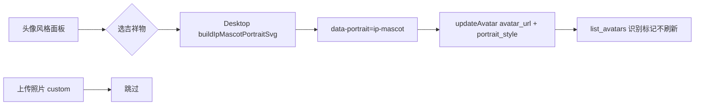

# 数字专家头像风格：本机矢量吉祥物（ip-mascot）

Planned-with: grok-4.7
Suggested-Impl-Model: composer-2.5（生成器骨架 + 接线 + 测试）；预览审美微调可用有审美的中档模型再收口

> **For implementer:** 只凭本文落地。不要回看规划对话。不要接远程文生图。不要改 `agenticx/studio/server.py` 顶部 import。不要复活 Identity Studio。不要改 Near 服装色板逻辑。commit / PR 文案用「吉祥物 / 圆润矢量头像」等中性描述，不要写第三方 skill / 仓库名。

**Goal:** 在数字专家页「头像风格」面板新增一组「吉祥物」，本机生成圆润、大形、一角探出的矢量 IP 脸；点一下全员瞬时换脸，上传照片不动，同一专家同一风格永远同一张脸。

**Architecture:** 沿用集合级画风轨（`collectionPortraitStyle` + `applyCollectionStyleToExperts`）。新增风格 id `ip-mascot`，由 Desktop 纯函数 SVG 生成（不依赖 Dicebear、不调云端）。根节点打 `data-portrait="ip-mascot"`；Python `COLLECTION_STYLE_IDS` 与 `is_collection_portrait_svg` 认这个标记，避免 `list_avatars` 刷回方块。

**Tech Stack:** Desktop React + 既有 `expert-portrait.ts` / `ExpertPortraitStyleControl`；纯 TypeScript SVG 字符串；Python 只扩白名单与检测前缀；Vitest + 现有 `tests/test_avatar_portrait.py`。

---

## 0. 根因与产品边界

当前风格轨全部是：

| 类型 | 生成方式 | 标记 |
|---|---|---|
| 方块 `near-cube-v3` | Python / Desktop cube SVG | `data-portrait="near-cube-v3"` |
| 极简 / 角色 / 场景 | `@dicebear/styles` 本机 SVG | `data-portrait="dicebear-<id>"` |

外部开源 skill「IP as Logo」是**文生图提示词规范**（圆润大形、两色角色 + 一色底、左下/右下探出、极度简化），仓库本身**没有**可嵌入的 SVG 包或 API。要进现有「一点即换」体验，必须用**本机矢量**复现该视觉语言，而不是挂模型出图。

产品中性命名：

| 用途 | 取值 |
|---|---|
| 风格 id / `portrait_style` | `ip-mascot` |
| SVG 标记 | `data-portrait="ip-mascot"` |
| UI 中文 | 吉祥物（分组）/ 圆润（单项，或「吉祥物」） |
| UI 英文 | Mascots / Rounded |

视觉意图（生成器必须遵守，不是可选）：

1. 正方形画布，纯色底填满整格
2. 角色由约 4–7 个大圆角形组成，可读黑影轮廓；禁止尖角/细线/装饰纹理
3. 恰好三语义色：2 个角色色 + 1 个底色；五官复用角色色，不引入第四色
4. 角色从左下或右下探出，占画面约 85–95%；禁止居中/底中
5. 大头、简单双眼（必要时极小嘴）；可爱幼态
6. 同一 `seed` → 同一物种、同一出角、同一配色、同一 SVG 字符串



---

## 1. 推荐实施模型

| 子任务 | 推荐模型 | 理由 |
|---|---|---|
| `ip-mascot-portrait.ts` 生成器 + 单测 | Composer 2.5 | 纯函数 + 确定性断言，样板清晰 |
| `expert-portrait` / UI / i18n / Python 白名单接线 | Composer 2.5 | 对照既有 dicebear 接线即可 |
| 预览审美微调（形是否够圆、色是否分离） | 有审美的中档，再收口 | 用户看得见的唯一新面 |

Suggested-Impl-Model: composer-2.5

---

## 2. In scope / Out of scope

### In scope

- 新风格 `ip-mascot`：本机 SVG 生成器 + 集合画风轨入口
- 风格面板新分组「吉祥物」：先放 **1** 个单项（圆润 / Rounded）；预留数组结构便于以后加变体
- `isGeneratedExpertPortraitUrl` / `theme-portrait` / Python `is_collection_portrait_svg` / `COLLECTION_STYLE_IDS` 全链路认标记
- 新建专家跟随当前集合风格（已有 `collectionPortraitCreateFields` 走 `buildCollectionPortraitDataUri`）
- 中英文案；署名行补一句「吉祥物为本机矢量风格」
- 测试：确定性、标记、刷新契约、`applyCollectionStyleToExperts` 写出正确 payload

### Out of scope（严禁）

- 文生图 / GPT Image / 远程出图 / 批量预生成 PNG 包
- 每张专家单独选物种或微调面板
- 改方块色板、`UserCubeColorwayPicker`、Near 服装
- 改 `server.py` 顶部 import
- 企业 portal / admin-console
- 把第三方 skill 装进仓库 skills 目录（本需求只复用视觉语言，不装 skill）

---

## 3. 精确落点

### 3.1 新建生成器

**Create:** `desktop/src/utils/ip-mascot-portrait.ts`

导出：

```ts
export const IP_MASCOT_PORTRAIT_STYLE = "ip-mascot" as const;

export function buildIpMascotPortraitSvg(seed: string): string;
export function buildIpMascotPortraitDataUri(seed: string): string;
```

实现要点（写死在代码里，实施时不要「发挥」）：

```ts
// Pseudocode — implement exactly this structure
const SPECIES = ["cat", "dog", "bear", "bunny", "fox", "bird"] as const;
const PALETTES: Array<{ primary: string; secondary: string; bg: string }> = [
  // 8–12 curated triples; bg slightly muted; primary/secondary clearly separated from bg
  { primary: "#F4A261", secondary: "#E76F51", bg: "#2A3A4A" },
  // ...
];

function hash(seed: string): number { /* same 33*hash >>>0 as cube-colorway */ }

export function buildIpMascotPortraitSvg(seed: string): string {
  const h = hash(seed.trim() || "avatar");
  const species = SPECIES[h % SPECIES.length];
  const corner: "left" | "right" = (h >>> 8) & 1 ? "right" : "left";
  const palette = PALETTES[(h >>> 16) % PALETTES.length];
  // Build SVG: viewBox="0 0 160 160" (avoid 128+role="img" legacy fallback collision)
  // NO role="img"
  // Root: <svg ... data-portrait="ip-mascot" data-species="..." data-corner="...">
  // 1) <rect width="160" height="160" fill="{bg}"/>
  // 2) group translated to lower-left or lower-right; scale ~0.9
  // 3) species paths: 4–7 large rounded shapes (ellipse/path with round joins)
  // 4) two eyes (small ellipses using secondary or dark contrast from primary)
  // Return raw SVG string
}

export function buildIpMascotPortraitDataUri(seed: string): string {
  const svg = buildIpMascotPortraitSvg(seed);
  return `data:image/svg+xml;utf8,${encodeURIComponent(svg)}`;
}
```

物种最低形状预算（每个都要「大头 + 从角探出」）：

| species | 形（示意） |
|---|---|
| cat | 头圆 + 两圆耳 + 身椭圆 + 双眼 |
| dog | 头圆 + 垂耳两片 + 身 + 小鼻点（复用 secondary）+ 双眼 |
| bear | 更大头圆 + 两小圆耳 + 身 + 双眼 |
| bunny | 头 + 两长圆耳 + 身 + 双眼 |
| fox | 头 + 尖改钝的三角耳（尖端必须圆钝）+ 身 + 双眼 |
| bird | 头 + 钝喙（小椭圆）+ 身 + 双眼 |

禁止：文字、水印、边框、风景、第三角色、渐变底、强 3D 阴影、尖刺、细触须。

**Test:** `desktop/src/utils/ip-mascot-portrait.test.ts`

```ts
it("is deterministic for one seed", () => {
  expect(buildIpMascotPortraitSvg("飞坦:abc")).toBe(buildIpMascotPortraitSvg("飞坦:abc"));
});
it("marks the svg", () => {
  expect(buildIpMascotPortraitSvg("x")).toContain('data-portrait="ip-mascot"');
});
it("fills a solid background and uses a lower corner", () => {
  const svg = buildIpMascotPortraitSvg("seed-1");
  expect(svg).toMatch(/data-corner="(left|right)"/);
  expect(svg).toContain("<rect");
});
it("varies species across seeds", () => {
  const set = new Set(
    ["a", "b", "c", "d", "e", "f", "g", "h"].map((s) => {
      const m = buildIpMascotPortraitSvg(s).match(/data-species="([^"]+)"/);
      return m?.[1];
    }),
  );
  expect(set.size).toBeGreaterThanOrEqual(3);
});
```

### 3.2 接入集合风格注册表

**Modify:** `desktop/src/utils/expert-portrait.ts`

1. 在文件顶部常量区新增：

```ts
import { IP_MASCOT_PORTRAIT_STYLE, buildIpMascotPortraitDataUri } from "./ip-mascot-portrait";

const MASCOT_STYLES = [IP_MASCOT_PORTRAIT_STYLE] as const;
```

2. `COLLECTION_STYLE_IDS` 追加 `...MASCOT_STYLES`（建议放在角色组之后、场景之前，或独立成组——**UI 用独立组**）。

3. `PORTRAIT_GROUPS` 增加：

```ts
{
  id: "mascots",
  labelKey: "gallery.styleGroupMascots",
  styles: MASCOT_STYLES,
}
```

同时把 `PORTRAIT_GROUPS` 的 `id` 联合类型扩成 `"minimalist" | "characters" | "scenes" | "mascots"`。

4. `CharacterStyleId` / `STYLE_LIBRARY`：`ip-mascot` **不是** Dicebear style。处理方式：

- `CollectionStyleId` 含 `ip-mascot`
- `buildCollectionPortraitDataUri` 在 `style === IP_MASCOT_PORTRAIT_STYLE` 时直接 `return buildIpMascotPortraitDataUri(seed)`，**不要**进 `STYLE_LIBRARY[style]`
- `describeStyleOptions` / `promptToStyleOptions` / `sanitizeStyleOptions`：对 `ip-mascot` 返回 `""` / `{}`（与 cube 同类）
- `STYLE_LIBRARY` 类型改为只覆盖 dicebear 那些 id；或用类型守卫 `isDicebearStyle(style)`

推荐最小改动伪代码：

```ts
export function buildCollectionPortraitDataUri(style, seed, options = {}) {
  if (style === CUBE_PORTRAIT_STYLE) return "";
  if (style === IP_MASCOT_PORTRAIT_STYLE) return buildIpMascotPortraitDataUri(seed);
  // existing dicebear path...
}
```

5. `isGeneratedExpertPortraitUrl`：额外认 `data-portrait="ip-mascot"`：

```ts
return (
  svg.includes('data-portrait="dicebear-') ||
  svg.includes('data-portrait="near-cube') ||
  svg.includes('data-portrait="ip-mascot"')
);
```

**Modify tests:** `desktop/src/utils/expert-portrait.test.ts`  
新增：`buildCollectionPortraitDataUri("ip-mascot", "飞坦:abc")` 含 `data-portrait="ip-mascot"`，且两次相等；`loadCollectionPortraitStyle` 在写入 `ip-mascot` 后能读回。

**Modify:** `desktop/src/utils/apply-expert-collection-style.test.ts`  
可选：对 `style: "ip-mascot"` 断言 payload 的 `portrait_style` 与 URL 标记。

### 3.3 风格面板 UI

**Modify:** `desktop/src/components/gallery/ExpertPortraitStyleControl.tsx`

- `LABEL_KEY` 增加 `"ip-mascot": "gallery.styleIpMascot"`
- `previewSrc`：`ip-mascot` 走 `buildCollectionPortraitDataUri("ip-mascot", "Felix")`（已有分支即可，因走统一 builder）
- 分组渲染已由 `PORTRAIT_GROUPS` 驱动，**不必**手写新 section；确认 `mascots` 会出现在场景组附近

面板分组顺序期望：

1. 方块  
2. 极简  
3. 角色  
4. **吉祥物**（新）  
5. 场景  

在 `PORTRAIT_GROUPS` 数组里把 mascots 插在 scenes 之前。

### 3.4 i18n

**Modify:** `desktop/locales/zh/sidebar.json` → `gallery`：

```json
"styleGroupMascots": "吉祥物",
"styleIpMascot": "圆润",
"portraitCredit": "……（保留原署名）。吉祥物为本机矢量风格。"
```

**Modify:** `desktop/locales/en/sidebar.json`：

```json
"styleGroupMascots": "Mascots",
"styleIpMascot": "Rounded",
"portraitCredit": ".... Mascot faces are generated locally as vector art."
```

不要在 UI 署名里写外部仓库名或 skill 名。

### 3.5 主题染色跳过

**Modify:** `desktop/src/utils/theme-portrait.ts`  
`looksLikeGeneratedLineArt` 里与 dicebear 并列跳过：

```ts
if (
  looksLikeNearCubePortrait(svg) ||
  svg.includes('data-portrait="dicebear-') ||
  svg.includes('data-portrait="ip-mascot"')
) {
  return false;
}
```

彩色吉祥物不能被主题 ink 重染。

**Test:** `desktop/src/utils/theme-portrait.test.ts` 加一条：含 `data-portrait="ip-mascot"` 的 data URL → `prepareThemedPortraitMarkup` 为 `null`。

### 3.6 Python 刷新契约

**Modify:** `agenticx/avatar/portrait.py`

1. `COLLECTION_STYLE_IDS` frozenset 增加 `"ip-mascot"`。
2. 扩展集合 SVG 检测（before/after）：

**Before:**

```python
COLLECTION_PORTRAIT_PREFIX = 'data-portrait="dicebear-'

def is_collection_portrait_svg(avatar_url: str) -> bool:
    return COLLECTION_PORTRAIT_PREFIX in _decode_svg_data_url(avatar_url)
```

**After:**

```python
COLLECTION_PORTRAIT_PREFIX = 'data-portrait="dicebear-'
IP_MASCOT_PORTRAIT_PREFIX = 'data-portrait="ip-mascot"'

def is_collection_portrait_svg(avatar_url: str) -> bool:
    decoded = _decode_svg_data_url(avatar_url)
    return (
        COLLECTION_PORTRAIT_PREFIX in decoded
        or IP_MASCOT_PORTRAIT_PREFIX in decoded
    )
```

这样 `needs_portrait_refresh` 无需改分支逻辑：集合脸仍 `False`。

**注意：** 生成器 viewBox 用 `0 0 160 160`，且**不要**写 `role="img"`，避免误撞 `is_local_fallback_svg`（该函数看 `0 0 128 128` + `role="img"`）。即便撞上，有 `is_collection_portrait_svg` 优先返回 False，仍安全；双保险。

**Test:** `tests/test_avatar_portrait.py`

```python
def test_needs_portrait_refresh_skips_ip_mascot_svg() -> None:
    import base64
    svg = '<svg xmlns="http://www.w3.org/2000/svg" data-portrait="ip-mascot"></svg>'
    url = "data:image/svg+xml;base64," + base64.b64encode(svg.encode()).decode()
    assert needs_portrait_refresh(url, portrait_style="ip-mascot") is False
    assert needs_portrait_refresh(url, portrait_style="") is False


def test_create_avatar_keeps_ip_mascot_portrait_style(tmp_path, monkeypatch) -> None:
    # mirror lorelei test with portrait_style="ip-mascot" and matching marker
    ...
```

---

## 4. 验收（AC）

| ID | 验收 |
|---|---|
| AC-1 | 打开数字专家 →「头像风格」→ 见「吉祥物」分组与「圆润」预览格 |
| AC-2 | 点「圆润」：所有非 custom 专家（含内置 Near 展示）换成吉祥物脸；上传照片不动 |
| AC-3 | 同一专家换走再换回「圆润」，面孔与物种一致（种子 `name:id`） |
| AC-4 | 刷新页面 / 重启后集合选择仍是 `ip-mascot`；`GET /api/avatars` 不把脸刷回方块 |
| AC-5 | 换回「方块」仍走空 `avatar_url` + `near-cube-v3` 旧路径 |
| AC-6 | `pnpm`/`npm` 在 `desktop` 下跑通相关 vitest；`pytest tests/test_avatar_portrait.py -q` 绿 |
| AC-7 | commit 文案无第三方 skill / 仓库名 |

手动回归命令：

```bash
cd desktop && npx vitest run src/utils/ip-mascot-portrait.test.ts src/utils/expert-portrait.test.ts src/utils/theme-portrait.test.ts src/utils/apply-expert-collection-style.test.ts
pytest tests/test_avatar_portrait.py -q
```

---

## 5. 实施顺序（Composer 可逐步勾）

1. 写 `ip-mascot-portrait.test.ts`（红）→ 实现 `ip-mascot-portrait.ts`（绿）
2. 改 `expert-portrait.ts` + 单测
3. 改 `theme-portrait.ts` + 单测
4. 改 `ExpertPortraitStyleControl` LABEL_KEY（若类型已覆盖预览则无需逻辑）
5. 改 zh/en `sidebar.json`
6. 改 `portrait.py` + `test_avatar_portrait.py`
7. 本地打开专家页点选「圆润」肉眼确认 6 种物种大致可辨、角出构图正确
8. 按 `/commit --spec=.cursor/plans/2026-09-28-ip-mascot-portrait-style.plan.md` 提交（实施前先把本文件从 `pending/` 移回 `.cursor/plans/` 根目录）

---

## 6. no-scope-creep 边界

每个 diff 必须能对应到上表某一行 AC 或第 3 节某一文件。禁止：

- 给吉祥物加设置项、Shuffle、颜色 picker
- 把 6 个物种拆成 6 个风格轨按钮（本版只要 1 个「圆润」；物种由种子分配）
- 引入新 npm 依赖
- 为「更像文生图」改成 PNG 栅格或远程拉取

若审美上需要第二套构图（例如全居中），开新 plan，不要塞进本次。
