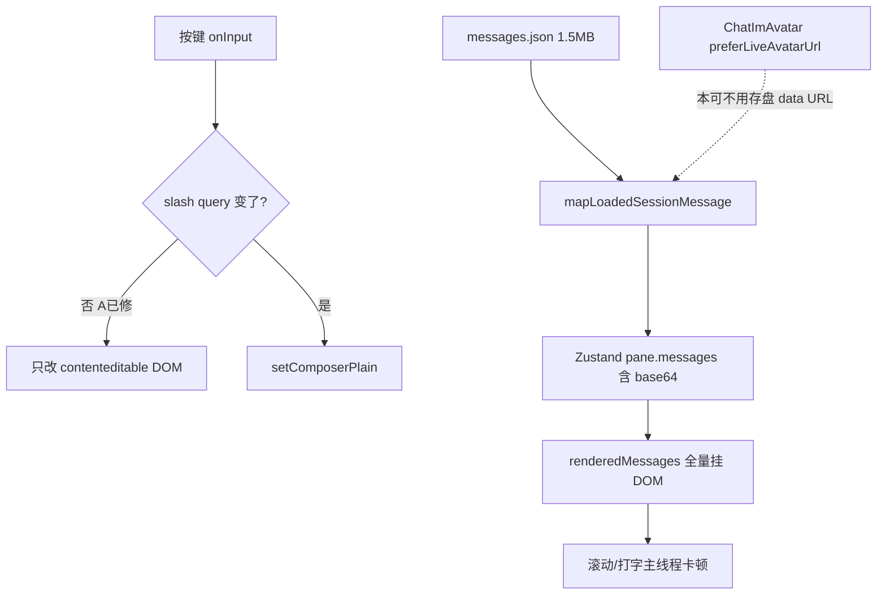

# Chat Pane 大 Session 滚动 / 打字卡顿

Planned-with: Composer
Suggested-Impl-Model: 见下方「子任务 → 推荐模型」表。推荐不是 trailer；实施时 `Impl-Model` 以用户确认的实际模型为准。

> **For Claude:** REQUIRED SUB-SKILL: Use superpowers:executing-plans to implement this plan task-by-task.

**Goal:** 大 session 下聊天记录滚动与输入框打字/删字恢复流畅；去掉消息里重复的巨型 base64 头像，并避免一次把整份历史挂进 DOM。

**Architecture:** 分四层收口——(0) 输入框按键不再整页 setState（已落地待提交）；(1) 持久化与加载剥离 `data:` 头像，展示时用 registry 现网 URL；(2) 保持 tail-first，禁止无关全量重载把分页打成「全历史进内存」；(3) 消息列表虚拟化，只挂可视区行。

**Tech Stack:** Desktop React 18 + Zustand + Vitest；可选 `@tanstack/react-virtual`；Studio `SessionManager._normalize_messages` + `GroupChatContext.append_agent`。

---

## 子任务 → 推荐模型

| 阶段 | 内容 | Suggested-Impl-Model | 理由 |
|---|---|---|---|
| A | 提交已落地的 composerPlain keystroke 修复 | Composer 2.5 | 三文件、测试已绿 |
| B | 剥离/压缩消息 `avatar_url`（Python + Desktop map） | Composer 2.5 | 纯函数 + 单点 normalize，契约写死 |
| C | 全量 load / poll 不再打爆 tail 分页 | 代码专精中档 | 改 `ChatPane` 加载与 poll，回归面中 |
| D | 消息列表虚拟化 | 强推理档 / 顶配前端 | 动态行高 + 滚底/加载更早/群聊布局，易回归 |

开始实施前把本文件移到 `.cursor/plans/2026-10-01-chat-pane-message-list-perf.plan.md`。

---

## 背景与证据（实施者勿依赖对话）

复现会话目录（本机）：`~/.agenticx/sessions/90c2e18d-fece-4612-abbb-2519142c402f/`。

| 指标 | 实测 |
|---|---|
| 消息条数 | 160 |
| `messages.json` | ~1.5 MB |
| 正文 `content` 合计 | ~54 KB |
| `avatar_url` 合计 | **~1.35 MB**（约 48 条 `data:image/...;base64,...`，单条可达 ~62 KB） |

用户体感：session 变大后，**下滑聊天记录卡、打字慢、删字也慢**。这与 Python 模型推理无关；主因是渲染进程主线程 + 磁盘读大 JSON。

已证实的回归 / 放大器：

1. **按键整页重渲染（已修，待提交）**  
   `5a8875e2`（composer commands）在 `syncComposerFromValue` 里对每个按键 `setComposerPlain(value)`，推翻了 `7a6f98b7`「打字不走 ChatPane 渲染路径」。工作区已改为仅在 slash query 变化时提交。

2. **消息里烘焙 base64 头像**  
   - 写入：`agenticx/runtime/group_context.py` `append_agent`（约 L88–108）把完整 `avatar_url` 写入 `chat_history`。  
   - 归一化照抄：`agenticx/studio/session_manager.py` `_normalize_messages`（约 L2858）`"avatar_url": str(item.get("avatar_url", "") or "")`，**不**像附件那样限制 data URL。  
   - 加载照抄：`desktop/src/utils/session-message-map.ts` `mapLoadedSessionMessage`（约 L374）`avatarUrl: item.avatar_url`。  
   - 展示其实已能用现网头像：`desktop/src/components/messages/ImBubble.tsx` `ChatImAvatar`（约 L321–330）`preferLiveAvatarUrl(liveExpert?.avatarUrl, imageUrl)`。

3. **无虚拟列表**  
   `ChatPane.tsx` 约 L8550–9266 `renderedMessages` useMemo 一次 map 出全部行；滚动容器约 L13903–13955。仓库无 `react-virtuoso` / `@tanstack/react-virtual`。

4. **全量读盘仍存在**  
   - 磁盘全量：`desktop/electron/session-messages-disk.ts` `readSessionMessagesFromDisk`（约 L87–96）整文件 `JSON.parse`。  
   - 尾部本意：同文件 `MESSAGES_JSON_TAIL = 40` + `readSessionMessagesTailFromDisk`；bootstrap 优先 `resolveSessionTailForSwitch`（`ChatPane.tsx` 约 L6710–6717）。  
   - 破坏点：IM/委派 poll（约 L3963–4001）`loadSessionMessages` 全量合并后把 `hasOlderMessages` 置 `false`、`oldestLoadedIndex: 0`，等于把 tail 策略打穿。



---

## In scope / Out of scope

**In scope**

- A：提交 composerPlain 按键政策（已改文件）。
- B：持久化与加载剥离 `data:` / 过长 `avatar_url`；SSE 即时展示仍可用 registry。
- C：poll / 合并路径不得无故全量展开分页。
- D：消息列表虚拟化（动态行高），保留滚底、加载更早、多选、群聊布局语义。

**Out of scope（禁止顺手做）**

- 改 `agx serve` 顶部 import 无关行；无关 Enterprise portal/admin。
- 重写 Markdown 管线、工具卡 UI、分身 registry 存盘格式（`AvatarConfig.avatar_url` 仍可在 registry 里是 data URL）。
- 一次性离线迁移脚本扫全盘 session（加载时剥离即可；下次 persist 自然变瘦）。
- 拆分整个 `ChatPane.tsx` 架构重构。

**no-scope-creep：** 每个 diff 必须能对上本 plan 的 FR；「我觉得再 memo 一下更好」不够。

---

## 需求与验收

### FR-A — 普通打字不写 composer 全文 state

- **已实现（工作区未提交）：**  
  - `desktop/src/utils/composer-input-sync.ts` `shouldCommitComposerPlain`  
  - `ChatPane.tsx` `syncComposerFromValue` 内 `setComposerPlain((prev) => shouldCommitComposerPlain(...) ? value : prev)`  
  - 测试：`desktop/src/utils/composer-input-sync.test.ts`
- **AC-A1：** `cd desktop && npx vitest run src/utils/composer-input-sync.test.ts` → 全绿。  
- **AC-A2：** 新空会话连打 50 字，React DevTools 或临时 `console.count('ChatPane')` 不应每键 +1（仅 empty↔non-empty / `/` 时允许）。

### FR-B — 消息不得持久化 / 加载巨型 data URL 头像

- **Before（normalize）：** 任意长度 `data:image/...;base64,...` 原样写入 `messages.json`。  
- **After：**  
  - `data:` 开头的 `avatar_url` → 存/加载为空字符串。  
  - 非 `data:` 但长度 `> 2048` → 同样丢弃（防御）。  
  - `http(s):` / 短路径保留。  
  - `agent_id` / `avatar_name` 不变；`ChatImAvatar` 用 registry 现网 URL。
- **落点：**  
  1. 新建纯函数（推荐）`agenticx/studio/avatar_url_compact.py`：`compact_stored_avatar_url(url: str) -> str`  
  2. `session_manager.py` `_normalize_messages` 约 L2858 改为 `compact_stored_avatar_url(...)`  
  3. `group_context.py` `append_agent` 约 L104 写入前 compact  
  4. Desktop：`desktop/src/utils/compact-stored-avatar-url.ts` + `mapLoadedSessionMessage` / forwarded items 的 `avatarUrl`  
  5. `message_forward.py` 约 L74–97 转发卡片同样 compact（避免转发再拷贝 base64）
- **AC-B1：** pytest：`compact_stored_avatar_url("data:image/png;base64,aaa") == ""`；短 `https://…` 原样；超长非 data 丢弃。  
- **AC-B2：** vitest：`mapLoadedSessionMessage` 对 `avatar_url: "data:image/svg+xml;base64," + "x"*60000` → `avatarUrl` 为空或 undefined。  
- **AC-B3：** 手工：打开上述大 session，Network/内存不必再为每条气泡解码 60KB data URL；头像仍显示（registry 有图时）。  
- **AC-B4：** 新群聊再聊几轮后，新写入的 `messages.json` 行的 `avatar_url` 不为 `data:`。

### FR-C — Tail-first 不被 poll 打穿

- **问题锚点：** `ChatPane.tsx` poll 约 L3963–4001：`loadSessionMessages`（全量）成功后 `setPaneMessagePaging(..., oldestLoadedIndex: 0, hasOlderMessages: false)`。  
- **After：**  
  - 非 IM / 非委派路径保持现状（已 early-return，约 L4022）。  
  - 需要 poll 的路径：优先 `loadSessionMessagesPage` / tail，或全量结果只 **merge 增量尾部**，**禁止**在「当前已是分页态且仅多了几条新消息」时把 `hasOlderMessages` 清掉并塞入全部历史。  
  - 伪代码意图：

```ts
// before: always full load + reset paging to "no older"
const result = await loadSessionMessages(sid);
setPaneMessages(mergedAll);
setPaneMessagePaging({ oldestLoadedIndex: 0, hasOlderMessages: false });

// after: append-only against current window; keep oldestLoadedIndex / hasOlderMessages
const page = await loadSessionMessagesPage(sid, { tailLimit: 40 }); // or mergeTailFromDisk
const merged = mergeSessionMessagesTail(current, page.messages, sid);
// only update paging.hasOlder from page.has_older when this was a fresh bootstrap
```

- **AC-C1：** 单元/集成：模拟 `hasOlderMessages: true`, `oldestLoadedIndex: 120`, poll 返回全量 160 条但尾部无新内容 → **不**调用会清空 paging 的 reset；`messages.length` 不膨胀到 160（仍为已加载窗口）。  
- **AC-C2：** IM 绑定会话仍能在外部新消息到达时追加可见气泡（增量）。

### FR-D — 消息列表虚拟化

- **依赖：** `desktop/package.json` 增加 `@tanstack/react-virtual`（与 React 18 兼容的现行 major）。  
- **落点：**  
  - 新建 `desktop/src/components/messages/VirtualizedMessageList.tsx`（或同级名），接收 `rows` 渲染函数 + `scrollParentRef`。  
  - `ChatPane.tsx` 约 L13903–13955：滚动容器仍是 `listRef`；内部由虚拟列表代替直接 `{renderedMessages}`。  
  - 动态行高：`measureElement`；预估高度可先用常量（如 96）再测量纠正。  
  - 必须保留现有行为：滚底跟随（`scrollListToBottom` / `listFollowRows`）、顶部加载更早（`tryLoadOlderIfNeeded`）、`data-message-id`、多选、群聊 `Conversation` 包装若冲突则虚拟列表放在 `MessageThread` 内部。  
- **AC-D1：** 160+ 条 session，DOM 中消息行节点数量大约在可视区 ± overscan（例如 < 40），而不是 ≈160。  
- **AC-D2：** 发送新消息仍自动滚到底；向上滚加载更早仍可用。  
- **AC-D3：** `cd desktop && npm test` 相关 vitest 不红；手测群聊 + 单聊各一次。

### NFR

- 不改 `server.py` 顶部 import 区无关行；若必须改 `server.py`，冷启动 smoke：`agx serve` + `/api/session` 200。  
- 不引入与虚拟列表无关的依赖。  
- Commit 信息禁止第三方对标品牌名；带 `Plan-Id` / `Plan-File` / `Plan-Model` / `Impl-Model` / `Made-with: Damon Li`。

---

## 任务拆解（按顺序）

### Task A: 提交 composer keystroke 修复

**Files:**  
- 已改：`desktop/src/utils/composer-input-sync.ts`  
- 已改：`desktop/src/utils/composer-input-sync.test.ts`  
- 已改：`desktop/src/components/ChatPane.tsx`（仅 `shouldCommitComposerPlain` 接线）

**Steps:**

1. Run: `cd desktop && npx vitest run src/utils/composer-input-sync.test.ts` → PASS。  
2. Commit（用户明确要求后再 commit）：subject 说明恢复「普通打字不提交 composerPlain」。  
3. 用户须 **硬刷 / 重启 Desktop** 验证空会话打字。

### Task B: compact avatar_url

**Files:**

- Create: `agenticx/studio/avatar_url_compact.py`  
- Create: `tests/test_avatar_url_compact.py`  
- Modify: `agenticx/studio/session_manager.py` `_normalize_messages` ~L2858  
- Modify: `agenticx/runtime/group_context.py` `append_agent` ~L104  
- Modify: `agenticx/studio/message_forward.py` ~L74–97  
- Create: `desktop/src/utils/compact-stored-avatar-url.ts`  
- Create: `desktop/src/utils/compact-stored-avatar-url.test.ts`  
- Modify: `desktop/src/utils/session-message-map.ts` `mapLoadedSessionMessage` ~L344、L374  
- Test map：扩展已有 `session-message-map` 测试若存在，否则在 compact 测试里直接测 map 调用

**Step 1 — 失败测试（Python）**

```python
from agenticx.studio.avatar_url_compact import compact_stored_avatar_url

def test_drops_data_url():
    assert compact_stored_avatar_url("data:image/png;base64,AAAA") == ""

def test_keeps_https():
    assert compact_stored_avatar_url("https://cdn.example/a.png") == "https://cdn.example/a.png"

def test_drops_overlong():
    assert compact_stored_avatar_url("x" * 3000) == ""
```

**Step 2 — 实现**

```python
def compact_stored_avatar_url(url: str) -> str:
    raw = str(url or "").strip()
    if not raw:
        return ""
    if raw.startswith("data:"):
        return ""
    if len(raw) > 2048:
        return ""
    return raw
```

**Step 3 — 接线 normalize / append_agent / forward / Desktop map**（见 FR-B 落点）。

**Step 4 —** `pytest tests/test_avatar_url_compact.py -v` + `cd desktop && npx vitest run src/utils/compact-stored-avatar-url.test.ts`。

**Step 5 — Commit** `fix(session): drop inline avatar data URLs from chat history`。

### Task C: poll / 全量 load 守住 tail 窗口

**Files:**

- Modify: `desktop/src/components/ChatPane.tsx` poll effect ~L3916–4026；必要时复用 `mergeTailFromDisk` / `resolveSessionTailForSwitch`（`desktop/src/utils/session-tail-cache.ts`）  
- Test: 新建 `desktop/src/utils/session-poll-paging.test.ts`（把「是否应 reset paging」抽成纯函数，例如 `shouldResetPagingAfterPollMerge({ hadOlder, oldestLoadedIndex, mergedLen, previousLen, grewTailOnly })`）

**意图：**

- `grewTailOnly === true` → 只 `setPaneMessages(merged)`，**不**改 `oldestLoadedIndex` / `hasOlderMessages`。  
- 仅 bootstrap 或明确「需要权威全量」时才允许 reset paging。

**AC：** 见 FR-C。Commit：`fix(desktop): keep message paging when polling session tail`。

### Task D: VirtualizedMessageList

**Files:**

- Modify: `desktop/package.json` 加依赖  
- Create: `desktop/src/components/messages/VirtualizedMessageList.tsx`  
- Modify: `ChatPane.tsx` 消息滚动区约 L13903–13955 接入  
- Test: `desktop/src/components/messages/VirtualizedMessageList.test.tsx`（渲染 N 行时查询 DOM 行数 ≤ overscan 策略；可用 `@testing-library/react`）

**最小接入伪代码：**

```tsx
const virtualizer = useVirtualizer({
  count: rows.length,
  getScrollElement: () => listRef.current,
  estimateSize: () => 96,
  overscan: 8,
});
// map virtualizer.getVirtualItems() → existing renderGroupedRow / rendered row nodes
```

**注意：** 现有 `renderedMessages` 是预计算 JSX 的 useMemo；虚拟化后应改为 **数据行 + 渲染函数**，避免一次性创建 160 个 React element。可把 `renderGroupedRow` 抽到稳定 callback，虚拟列表按 index 调用。

**AC：** 见 FR-D。Commit：`perf(desktop): virtualize chat message list`。

---

## 建议实施顺序与风险

1. **A → B** 立刻减轻内存与 IMG 解码；大 session 打字/滚也会好转一截。  
2. **C** 防止「滚一会儿又变全量」。  
3. **D** 彻底治滚动；工作量与回归最大，单独 PR/commit。

**风险：** 虚拟化与「滚底跟随 / 加载更早 / 群聊 Conversation」交互；应用 `measureElement` 并在加载更早后补偿 `scrollOffset`。头像剥离后，无 registry 命中的历史气泡可能短暂显示字头头像——可接受；有 `agent_id` 时应命中。

---

## 手工验收清单

- [ ] 硬重启 Desktop 后，空会话打字/删字顺滑（A）。  
- [ ] 打开 `90c2e18d-…`：滚动明显轻于改前；头像仍在（B）。  
- [ ] 向上加载更早若干次后，poll 不把列表突然变成「全量重挂」(C)。  
- [ ] DevTools Elements：可视区外消息行基本不存在（D）。  
- [ ] 群聊 + Meta 单聊各发一条、引用、多选复制仍可用。
