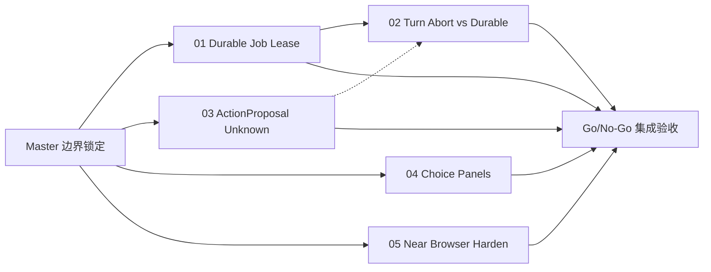
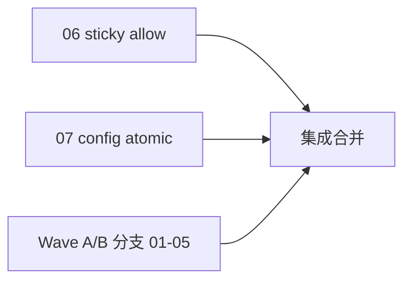

# OpenMuse 选择性内化 Master Plan

Planned-with: Auto (Composer)
Suggested-Impl-Model: 见各子计划；默认 Composer 2.5 / 后端接线用 Codex 中档 / Desktop 选择卡用审美较强模型
Plan-Id: 2026-10-01-openmuse-selective-adopt-master
Plan-File: `.cursor/plans/2026-10-01-openmuse-selective-adopt-master.plan.md`
Source: `research/codedeepresearch/openmuse/`（固定 SHA `d0b3a6b3ea461bc938a5dea6c46e65eefdb1b933`）
Parent: 无

> **For implementer:** 本文件只做编排与边界。禁止据此一次实现全部能力。每次只把**一个**子计划从 `pending/` 移到 `.cursor/plans/` 根目录后实施。并行 Wave 允许同时移多个无冲突文件集的子计划，但必须**独立 git worktree / 独立分支**，禁止多人/多 agent 同改一个工作区。不要 commit，除非用户明确要求。使用 executing-plans；遵守 `no-scope-creep.mdc`。

**Goal:** 从 OpenMuse 选择性内化「耐久任务租约、不确定外部写禁静默重试、对话打断与耐久句柄分离、结构化选择面板、Near 浏览器会话加固」五类机制到 AgenticX / Near；明确不搬 CopilotKit/AG-UI/整仓 computer/单 owner 身份。

**Architecture:** 框架层新增轻量 durable job lease（SQLite，标量 CAS，禁止盲抄 JSONB `@>` 数组语义）；审阅层在既有 `request_action_confirmation` + `agenticx/reliability/call_ledger.py` 上补持久 ActionProposal / `outcome_unknown`；运行时把 turn Abort 与 durable job id 拆开；Desktop 在既有 `ClarificationCard` 上扩展带版本的选择/对比卡；`near_browser_*` 补会话级 profile 与公网 URL 校验。

**Tech Stack:** Python 3.12 / SQLite / Studio FastAPI+SSE / Electron+React+Zustand / pytest+Vitest。

---

## 1. 战略判定（执行者必读）

裁决来自源码研究文档，不是产品愿景：

| 文档 | 路径 |
|---|---|
| Source Notes | `research/codedeepresearch/openmuse/openmuse_source_notes.md` §10 |
| DeepWiki 核验 | `research/codedeepresearch/openmuse/openmuse_deepwiki.md` Q-01…Q-08 |
| Code Index | `research/codedeepresearch/openmuse/openmuse_code_index.md` |

总裁决：**SELECTIVE_ADOPT**。本 master 只覆盖高价值机制，不覆盖 OpenMuse 产品垂直功能。

### 1.1 与仓库既有能力的硬边界（防重造）

| 既有能力 | 位置 | 本 master 必须 |
|---|---|---|
| SDK 可靠性内核（call identity / ledger / RunState / replay） | `agenticx/reliability/` + `.cursor/plans/2026-09-12-sdk-reliability-*` | **复用** `CallLedger` / `EFFECT_CLASSES`；禁止再造第二套工具身份账本 |
| 对话中断 closer 的 `outcome_unknown` 文案 | `agenticx/runtime/interrupted_closers.py` | 保留；03 补的是**持久审阅对象**，不是替换 closer 文案 |
| `request_clarification` / `ClarificationCard` | `agenticx/cli/agent_tools.py:745+`、`desktop/src/components/messages/ClarificationCard.tsx` | 04 **扩展**既有澄清卡，不平行发明第二套确认 UI |
| 群聊路由「Jev」 | `group_jev_decision` / `JevRouteChip` | **禁止**把选择面板命名为 Jev，避免与群聊路由撞名 |
| Automation JSON + Desktop `AutomationScheduler` | `agenticx/runtime/_automation_tasks_io.py`、`desktop/electron/main.ts:1257` | 01 在其上加**租约/领取**，不推翻 cron 调度面 |
| `near_browser_*` | `agenticx/cli/agent_tools.py:3003+` | 05 加固，不换成 Playwright worker 整仓 |
| Computer Use 宿主机操控 | `agenticx/embodiment/`、`tools/resolvers/` | **Out of scope**；不引入 OpenMuse Docker 沙箱替代 |

### 1.2 明确不内化

- CopilotKit Runtime / AG-UI / Intelligence Rich Threads
- Expo 移动端、Gmail/Calendar/Finance/Ideas 垂直产品
- OpenMuse Docker Linux computer 整包
- 单 owner + 共享 access key 身份模型
- JSONB `data @>` 对数组字段的 CAS（OpenMuse 自身 milestone 并发不安全，见 E-015）

---

## 2. 子计划清单

| # | Plan 文件 | 交付 | 依赖 | Wave | 推荐模型 |
|---|---|---|---|---|---|
| 01 | `2026-10-01-openmuse-01-durable-job-lease.plan.md` | SQLite durable job lease + claim/heartbeat/cancel-wins | 无 | A | Codex 中档 / Composer 2.5 |
| 02 | `2026-10-01-openmuse-02-turn-abort-vs-durable.plan.md` | turn Abort ≠ durable job cancel；stop 聊天不杀已委派耐久活 | **01** | B | Codex 中档 |
| 03 | `2026-10-01-openmuse-03-action-proposal-unknown.plan.md` | 持久 ActionProposal + hash/TTL + startup recovery + 禁静默重试 | 复用 reliability；与 01 无文件冲突 | A | Codex 中档 / GPT-5.x 高风险收口 |
| 04 | `2026-10-01-openmuse-04-choice-panels.plan.md` | 带 `candidateSetVersion` 的选择/对比面板（扩展 Clarification） | 无 | A | 前端审美档 / Composer 2.5 |
| 05 | `2026-10-01-openmuse-05-near-browser-harden.plan.md` | 会话级 browser profile 稳定 ID + 公网 URL 校验 | 无 | A | Composer 2.5 / Codex |

所有子计划初始位于 `.cursor/plans/pending/`。`Parent-Plan` 指向本 master。

---

## 3. 执行 DAG

### 并行规则

| Wave | 计划 | 可否并行 | 隔离要求 |
|---|---|---|---|
| **A** | 01、03、04、05 | **是，四路并行** | 各自独立 git worktree + 分支；禁止同改 `server.py` import 区 |
| **B** | 02 | 必须等 **01** 合并或至少 API 稳定 | 单分支；可读取 03 的 proposal id 字段若已合入，否则先用占位 |

### 文件冲突矩阵（Wave A）

| Plan | 主要触碰路径 | 勿碰 |
|---|---|---|
| 01 | `agenticx/runtime/durable_jobs/`（新建）、`_automation_tasks_io.py`、相关 tests | `desktop/src/components/messages/*`、`confirm.py` 大改 |
| 03 | `agenticx/runtime/action_proposals/`（新建）、`agent_tools.py` 中 `_request_action_confirmation`、`interrupted_closers` 仅引用 | `durable_jobs/`、`ClarificationCard.tsx` |
| 04 | `desktop/src/components/messages/ClarificationCard.tsx`（扩展或旁路 ChoicePanel）、studio clarify API 轻量字段 | `durable_jobs/`、automation lease SQL |
| 05 | `agenticx/cli/agent_tools.py` near_browser 段、可选 `agenticx/tools/near_browser/` | ActionProposal、Clarification 卡片视觉大改 |

`agenticx/studio/server.py`：**Wave A 禁止四人同时改**。若必须挂路由，由 **01 或 03 之一**独占一个 PR 加最小路由，其它计划通过现有 `/api/*` 或延迟到 Wave B。触碰 `server.py` 必须遵守 AGENTS.md 冷启动 smoke。

---

## 4. 全局 In / Out of Scope

### In scope

- Durable job 状态机：`queued|running|waiting_*|paused|succeeded|failed|cancelled` + lease
- 取消先 CAS 再 abort；丢租约收尾不得抢走新 worker（对齐 OpenMuse Q-01）
- ActionProposal：`awaiting_review|executing|succeeded|failed|outcome_unknown|denied|expired`
- 启动扫描 `executing` → `outcome_unknown`
- turn-scoped cancel 与 durable job cancel 两套 API/句柄
- 选择面板：clarification / comparison（≤3 + sources）、version supersession
- near_browser：thread/session 稳定 profile key、公网 URL 拒绝私网

### Out of scope

- 重写 AgentRuntime 主循环、多分身路由、Enterprise、移动端
- 引入 CopilotKit / TypeSafe / Playwright 独立 worker 服务
- 把 automation cron UI 视觉重做
- 监控页面 watch（OpenMuse monitor）——若后续需要另开 plan

---

## 5. Go / No-Go（整波次）

Wave A 全部 PR 可合并前：

1. 01：双 worker 争同一个 job 只执行一次；cancel 后旧 worker 不能 requeue（pytest）
2. 03：假想外部写超时 → `outcome_unknown`；`retry`/`重放` 路径拒绝静默再发（pytest）
3. 04：选择面板 version 过期后选择返回 409/错误；历史卡只读（Vitest 或组件测）
4. 05：`http://127.0.0.1` / 私网 URL 被 near_browser_open 拒绝（pytest）

Wave B：

5. 02：聊天 stop 取消进行中的 near_browser/tool；已 `create_durable_job` 的任务仍 `queued/running`（集成测）

任一项失败：该子计划回滚或修，不带病开下一依赖项。

---

## 6. 建议执行动作（本轮）

1. 落盘 master + 5 子计划到 `pending/`。
2. 将 Wave A（01/03/04/05）移到 `.cursor/plans/` 根目录。
3. 起 **4 个并行 subagents**，各自 worktree/分支实施对应子计划；02 等 01 完成后再启。

---

## 7. 过程元数据提醒

Commit 时需用户提供 `Plan-Model` / `Impl-Model`；未提供则询问，禁止编造。Trailer 顺序：`Plan-Id` → `Plan-File` → `Plan-Model` → `Impl-Model` → `Made-with: Damon Li`。

## 8. 2026-10-02 复盘与增补（Wave C）

### 8.1 对 Wave A/B 实施的复盘结论

| 子计划 | 结论 | 说明 |
|---|---|---|
| 04 选择面板 | 可用 | 后端 store + `/api/clarify` 409 + Desktop 卡片，有 UI 单测；真对用户可见 |
| 05 浏览器加固 | 可用 | URL guard 已接入 `near_browser_*`；39 测 |
| 03 ActionProposal | 可用，价值偏「可追溯」 | 已接入 `_request_action_confirmation` 与启动恢复；`outcome_unknown` 目前只在中断恢复路径触发 |
| 01 durable lease | **库已建，无消费者** | `DurableJobWorker` 未在任何进程启动；仅 `attach_durable_job_id` 悬空桥接。保留库，不接线，直至有真实 job kind |
| 02 turn abort | 去掉了无效暴露 | 原先给 LLM 暴露 `create_durable_job`/`cancel_durable_job`，但无 worker 执行，会生成永不运行的 job（陷阱）。已从 `agent_tools.py` / `meta_tools.py` / `server.py` 移除，仅保留 turn-abort 语义（`/api/chat/interrupt` 返回 `scope=turn`）与测试 |

### 8.2 Octop 研究产出的新增子计划

| 子计划 | 来源 | Suggested-Impl-Model | 与 Wave A/B 冲突面 |
|---|---|---|---|
| `2026-10-02-octop-06-session-sticky-tool-allow.plan.md` | Octop E-009 | Codex 中档 | `agent_tools.py::_confirm`、`server.py::post_confirm`、`protocols.py`、ChatPane/确认卡；与 03/04 在 `agent_tools.py`/`server.py` 不同函数，合并时手动 3-way |
| `2026-10-02-octop-07-config-atomic-write.plan.md` | Octop E-010 | Composer 2.5 | 仅 `config_manager.py::_dump_yaml`，无冲突 |

### 8.3 明确暂缓（需先有产品决策，避免 scope creep）

- Octop「Team host 调度-only 硬剥离工具面」：Meta 在单聊同样要用文件/shell，剥离会回退单聊能力；只对「群聊编排者」做需先定义产品语义。暂缓。
- 入站 ACP / IDE 驱动 Near、内容 backend 可插拔、history_v2：体量大，另立项。

### 8.4 Wave C DAG

06 与 07 无依赖，并行（各自独立 worktree）。集成合并需用户确认 commit 元数据（Plan-Model / Impl-Model）后再做。
