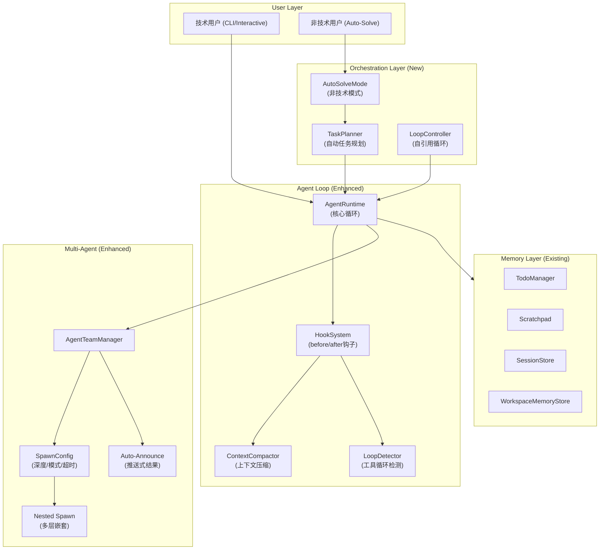
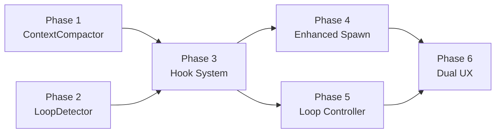

# AgenticX Agent Loop 系统性增强规划

## 问题诊断

从 deepwiki 笔记中提炼出的关键技术与 AgenticX 当前状态的差距：


| 能力               | OpenClaw/CC/LangChain                       | AgenticX 现状                | 影响          |
| ---------------- | ------------------------------------------- | -------------------------- | ----------- |
| 上下文压缩            | Auto-compaction + retry                     | 截断到最近 16 条消息               | 长程任务遗忘的根因   |
| 工具循环检测           | 3 种检测器 + 分级处理                               | 仅 query_subagent_status 限流 | 死循环浪费 token |
| Hook/中间件         | 8+ 钩子点，插件可扩展                                | 无                          | 无法灵活定制循环行为  |
| 子智能体深度           | 可配置 2-5 层嵌套                                 | 固定 1 层                     | 复杂编排受限      |
| Session 模式       | run / session 双模式                           | 仅 run 模式                   | 持久化子智能体不可用  |
| 自引用循环            | Ralph Loop (stop hook + completion promise) | 无                          | 无法做迭代式改进    |
| 非技术用户 auto-solve | 无 (各有不同策略)                                  | 无                          | UX 门槛高      |


## 架构设计




---

## Phase 1: 上下文压缩 (ContextCompactor) -- 解决长程遗忘

**为什么最优先：** 当前 `agent_runtime.py` L292 的 `session.agent_messages[-16:]` 是遗忘的根因。长程任务超过 16 轮后，前面的工具调用结果和关键决策全部丢失。

**核心思路：** 借鉴 OpenClaw 的 auto-compaction 机制 -- 当消息列表过长时，用 LLM 生成一段压缩摘要替换历史消息，而非简单丢弃。

**新文件：** `[agenticx/runtime/compactor.py](agenticx/runtime/compactor.py)`

```python
class ContextCompactor:
    """LLM-assisted context compaction for long-horizon sessions."""
    
    def __init__(self, llm, *, threshold_messages=20, threshold_chars=48_000):
        ...
    
    async def maybe_compact(self, messages: list[dict]) -> tuple[list[dict], bool]:
        """If messages exceed threshold, compact older messages into summary.
        Returns (new_messages, did_compact)."""
        ...
    
    def _build_compaction_prompt(self, messages_to_compact: list[dict]) -> str:
        """Generate prompt for summarizing old messages."""
        ...
```

**修改文件：** `[agenticx/runtime/agent_runtime.py](agenticx/runtime/agent_runtime.py)`

- 将 `session.agent_messages[-16:]` 替换为 `ContextCompactor.maybe_compact()`
- 压缩后的摘要作为特殊 `system` 消息注入（带 `[compacted]` 标记）
- 压缩事件 `COMPACTION` 通过 event stream 通知前端

**关键设计：**

- 压缩阈值可配：消息数 > 20 或总字符数 > 48K
- 压缩粒度：保留最近 8 条完整消息，其余压缩为摘要
- 压缩摘要包含：关键决策、工具执行结果、文件变更、待办事项
- 子智能体同样受益（`team_manager.py` 中 `max_tool_rounds=25`）

---

## Phase 2: 工具循环检测 (LoopDetector) -- 防止死循环

**核心思路：** 借鉴 OpenClaw 的三级检测器体系。

**新文件：** `[agenticx/runtime/loop_detector.py](agenticx/runtime/loop_detector.py)`

```python
class LoopDetector:
    """Detect and break tool call loops."""
    
    def __init__(self, *, history_size=30, warning_threshold=8, critical_threshold=15):
        ...
    
    def record_call(self, tool_name: str, args_hash: str) -> None: ...
    
    def check(self) -> LoopCheckResult:
        """Run all detectors. Returns (stuck, level, message, detector_name)."""
        ...
    
    def _detect_generic_repeat(self) -> ...: ...
    def _detect_ping_pong(self) -> ...: ...
    def _detect_no_progress(self) -> ...: ...
```

三种检测器：

- **generic_repeat**: 同一 tool+args 连续重复 N 次
- **ping_pong**: A->B->A->B 交替调用无进展
- **no_progress**: 连续 M 轮工具调用但 artifacts/scratchpad 无变化

**修改文件：** `[agenticx/runtime/agent_runtime.py](agenticx/runtime/agent_runtime.py)`

- 在每次工具调用后调用 `loop_detector.record_call()` + `loop_detector.check()`
- `warning` 级别：注入提醒消息
- `critical` 级别：直接中断循环并报告给用户/meta

---

## Phase 3: Hook/中间件系统 -- 可扩展的循环拦截

**核心思路：** 借鉴 OpenClaw 的 8 种钩子 + LangChain 的 `AgentMiddleware` 模式。

**新文件：** `[agenticx/runtime/hooks.py](agenticx/runtime/hooks.py)`

```python
class AgentHook:
    """Base hook class. Subclass and override desired methods."""
    
    async def before_model(self, messages, session) -> dict | None: ...
    async def after_model(self, response, session) -> dict | None: ...
    async def before_tool_call(self, tool_name, args, session) -> HookOutcome: ...
    async def after_tool_call(self, tool_name, result, session) -> str | None: ...
    async def on_compaction(self, old_messages, summary, session) -> None: ...
    async def on_agent_end(self, final_text, session) -> None: ...

class HookRegistry:
    """Manage and dispatch hooks in priority order."""
    
    def register(self, hook: AgentHook, priority: int = 0) -> None: ...
    async def run_before_model(self, messages, session) -> list[dict]: ...
    async def run_before_tool_call(self, ...) -> HookOutcome: ...
```

**修改文件：** `[agenticx/runtime/agent_runtime.py](agenticx/runtime/agent_runtime.py)`

- `AgentRuntime.__init__` 接受 `hooks: HookRegistry`
- 在模型调用前后、工具调用前后插入钩子调用
- `ContextCompactor` 和 `LoopDetector` 实现为内置 Hook

**这样 Phase 1/2 就成为 Hook 的具体实例，体系更统一。**

---

## Phase 4: 增强子智能体 -- 深度嵌套与 Session 模式

**核心思路：** 借鉴 OpenClaw 的嵌套子智能体 + run/session 双模式。

**修改文件：** `[agenticx/runtime/team_manager.py](agenticx/runtime/team_manager.py)`

关键增强：

### 4a. Spawn 配置化

```python
@dataclass
class SpawnConfig:
    max_spawn_depth: int = 2        # 允许嵌套层数
    max_children_per_agent: int = 5
    max_concurrent: int = 8
    run_timeout_seconds: int = 600
    cleanup: str = "keep"           # "keep" | "delete"
    mode: str = "run"               # "run" | "session"
```

- 当前 `spawn_subagent` 的 `max_concurrent_subagents=4` 改为从 `SpawnConfig` 读取
- 子智能体可以再 spawn 子智能体（depth < max_spawn_depth）
- `session` 模式下子智能体不会在完成后销毁，可接收后续消息

### 4b. Auto-Announce 模式

借鉴 OpenClaw 的推送式结果通告：

- 子智能体完成后，自动将摘要推送到父 agent 的 `agent_messages`
- 父 agent 不需要轮询 `query_subagent_status`
- 通过 `summary_sink` 机制实现（当前已有基础，需增强为自动注入）

### 4c. 子智能体 Attachment 传递

```python
spawn_subagent(
    ...,
    attachments=[{"name": "analysis.md", "content": "..."}],
)
```

---

## Phase 5: 自引用循环 (AgenticX Loop) -- 迭代式长程任务

**核心思路：** 借鉴 Claude Code 的 Ralph Wiggum 插件，实现 AgenticX 版本的自引用迭代开发循环。

**新文件：** `[agenticx/runtime/loop_controller.py](agenticx/runtime/loop_controller.py)`

```python
class LoopController:
    """Self-referential iteration loop for long-horizon tasks."""
    
    def __init__(self, *, max_iterations=0, completion_promise=None):
        ...
    
    async def run_loop(self, task: str, runtime: AgentRuntime, session: StudioSession):
        """Run task iteratively until completion or max iterations."""
        for iteration in range(1, self.max_iterations + 1):
            result = await runtime.run_turn(self._build_iteration_prompt(task, iteration), session)
            if self._check_completion(result):
                break
            # Persist progress to scratchpad/todo for next iteration
            ...
```

**技术用户 CLI 接口：**

```
agx loop "重构缓存层" --max-iterations 20 --completion-promise "所有测试通过"
```

**Studio Web/Desktop 接口：**

- 新增 `/api/loop` endpoint
- 前端显示迭代进度条 + 当前迭代号

---

## Phase 6: 双轨 UX -- 技术人员 vs 非技术人员

### 6a. 技术人员模式 (Interactive)

**修改文件：** `[agenticx/runtime/prompts/meta_agent.py](agenticx/runtime/prompts/meta_agent.py)`

- 调度策略增加"交互澄清"指令：遇到不确定时主动 `ask_user`
- 支持 CLI 快捷命令（类似 Claude Code 的 `/ralph-loop`）
- 保持当前的确认门 (ConfirmGate) 机制

### 6b. 非技术人员模式 (AutoSolve)

**新文件：** `[agenticx/runtime/auto_solve.py](agenticx/runtime/auto_solve.py)`

```python
class AutoSolveMode:
    """Autonomous problem-solving mode for non-technical users.
    
    Flow:
    1. Receive vague user request
    2. Auto-decompose into sub-tasks via TaskPlanner
    3. Execute each sub-task with minimal user interaction
    4. Auto-select optimal approach (single agent vs multi-agent)
    5. Present final result with simple explanation
    """
    
    async def solve(self, user_request: str, session: StudioSession):
        plan = await self._plan_tasks(user_request)
        if plan.complexity == "simple":
            return await self._single_agent_execute(plan)
        else:
            return await self._multi_agent_execute(plan)
```

**核心差异：**

- `ConfirmGate` 默认自动批准（白名单内操作）
- 不暴露子智能体调度细节，只展示"正在处理..."进度
- 错误恢复自动重试，不中断用户
- 最终结果以"摘要+结论"形式呈现，非技术细节

**修改文件：**

- `[agenticx/studio/server.py](agenticx/studio/server.py)` - 新增 `mode` 参数（`interactive` / `auto`）
- `[agenticx/runtime/prompts/meta_agent.py](agenticx/runtime/prompts/meta_agent.py)` - 根据 mode 切换提示策略

---

## 实施优先级与依赖关系




**建议实施顺序：** P1 -> P2 -> P3 -> P4 & P5 并行 -> P6

- Phase 1 和 2 相对独立，可以先做，立即解决"遗忘"和"死循环"问题
- Phase 3 是统一框架，将 1/2 重构为 Hook 实例
- Phase 4 和 5 在 Hook 基础上并行开发
- Phase 6 在所有基础设施就绪后做 UX 层

