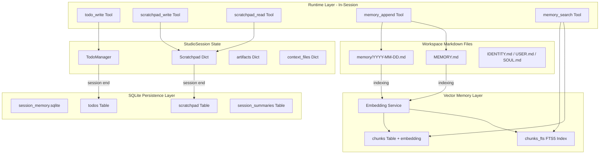

# Agent Loop 上下文持久化完整方案

## 现状诊断

当前 AgenticX agent loop 在三个核心点的支持情况：

- **上下文持久化**：仅有 `session.artifacts` / `session.context_files` 隐式传递，缺少 TodoWrite 和 Scratchpad
- **程序化工具调用**：已对标 Claude v1（`tool_choice="auto"` + JSON function calling），合格
- **递归调度**：已超越 Claude v3（并行 subagent + 资源监控 + 生命周期管理），合格

**核心差距**：缺少 Claude v2 的 TodoWrite + 缺少 Memory 写入工具 + 缺少 SQLite 持久化层 + 缺少语义记忆检索

## 架构全景




## Phase 0: TodoWrite 工具（对标 Claude v2）

**目标**：让模型的"计划"外化为可见、可追踪的状态机

### 新建 `agenticx/runtime/todo_manager.py`

```python
class TodoManager:
    items: List[TodoItem]  # max 20 items
    # TodoItem: {content: str, status: str, active_form: str}
    # status: "pending" | "in_progress" | "completed"
    # active_form: 现在进行时描述，如 "正在分析认证模块..."
    
    def update(self, items: list) -> str:  # 验证 + 渲染
    def render(self) -> str:               # 文本渲染给模型看
```

**设计决策**：新建轻量 TodoManager 而非复用 `plan_storage.py` 的 SubTask/Plan，原因：

- `SubTask` 要求 `expected_outcome` 等字段，对 agent loop 内的快速规划过重
- Claude v2 的 TodoManager 刻意极简（content + status + activeForm），约束即能力
- `plan_storage` 面向长期项目规划，TodoManager 面向单次对话内的任务追踪
- 后续 Phase 2 会增加 SQLite 持久化桥接

### 修改 `agenticx/cli/agent_tools.py`

- 在 `STUDIO_TOOLS` 中新增 `todo_write` 工具定义
- 在 `dispatch_tool_async` 中新增 `todo_write` 分发逻辑

### 修改 `agenticx/cli/studio.py`

- `StudioSession` 新增 `todo_manager: TodoManager` 字段

### 修改 `agenticx/runtime/agent_runtime.py`

- `_build_agent_system_prompt()` 注入当前 todo 列表状态
- 增加 nag reminder 机制：连续 N 轮未更新 todo 时注入 `<reminder>` 到 user message

### 修改 `agenticx/runtime/prompts/meta_agent.py`

- `build_meta_agent_system_prompt()` 注入 todo 状态
- 调度策略中增加 "拆解子任务前先用 `todo_write` 记录计划" 的指导

## Phase 1: Scratchpad + Memory 写入工具

### 1a. Scratchpad（会话内中间结果暂存）

**新建 `agenticx/runtime/scratchpad.py`**

```python
class Scratchpad:
    _store: Dict[str, str]  # key -> value, max 50 keys, max 10KB per value
    
    def write(self, key: str, value: str) -> str
    def read(self, key: str) -> str
    def list_keys(self) -> List[str]
    def render_summary(self) -> str  # 给 system prompt 用的摘要
```

**修改 `agenticx/cli/agent_tools.py`**

- 新增 `scratchpad_write` 工具：写入 key-value
- 新增 `scratchpad_read` 工具：读取指定 key 或 list keys

**修改 `agenticx/cli/studio.py`**

- `StudioSession` 新增 `scratchpad: Scratchpad` 字段

**修改 `agenticx/runtime/agent_runtime.py`**

- System prompt 注入 scratchpad 摘要（key 列表 + 每个 value 的前 200 字符预览）

**修改 `agenticx/runtime/team_manager.py`**

- `_build_isolated_session()` 时将 parent session 的 scratchpad 复制一份给 subagent（只读快照）

### 1b. Memory 写入工具

**修改 `agenticx/workspace/loader.py`**

- 将 `_append_daily_memory_note()` 改为 public `append_daily_memory(workspace_dir, note)` 
- 新增 `append_long_term_memory(workspace_dir, note)` — 追加到 MEMORY.md

**修改 `agenticx/cli/agent_tools.py`**

- 新增 `memory_append` 工具：
  - 参数：`target` ("daily" | "long_term")，`content` (str)
  - daily: 追加到 `memory/YYYY-MM-DD.md`
  - long_term: 追加到 `MEMORY.md`（需要 confirm）

## Phase 2: SQLite 持久化层

**目标**：跨会话恢复 todo/scratchpad/session summary，类似 OpenClaw 的 `main.sqlite`

### 新建 `agenticx/memory/session_store.py`

```python
class SessionStore:
    """SQLite persistence for session state across conversations."""
    
    def __init__(self, db_path: Path):  # 默认 ~/.agenticx/memory/sessions.sqlite
    
    # Todo 持久化
    async def save_todos(self, session_id: str, items: list) -> None
    async def load_todos(self, session_id: str) -> list
    
    # Scratchpad 持久化
    async def save_scratchpad(self, session_id: str, data: dict) -> None
    async def load_scratchpad(self, session_id: str) -> dict
    
    # Session summary 持久化（会话结束时自动摘要）
    async def save_session_summary(self, session_id: str, summary: str, metadata: dict) -> None
    async def search_session_summaries(self, query: str, limit: int = 5) -> list
```

**Schema 设计（3 张表）**

```sql
CREATE TABLE todos (
    session_id TEXT NOT NULL,
    data TEXT NOT NULL,        -- JSON array of todo items
    updated_at TEXT NOT NULL,
    PRIMARY KEY (session_id)
);

CREATE TABLE scratchpad (
    session_id TEXT NOT NULL,
    key TEXT NOT NULL,
    value TEXT NOT NULL,
    updated_at TEXT NOT NULL,
    PRIMARY KEY (session_id, key)
);

CREATE TABLE session_summaries (
    id TEXT PRIMARY KEY,
    session_id TEXT NOT NULL,
    summary TEXT NOT NULL,
    metadata TEXT,             -- JSON: provider, model, duration, tool_count
    created_at TEXT NOT NULL
);
```

### 修改 `agenticx/studio/session_manager.py`

- `ManagedSession` 创建时加载 SQLite 中的 todo/scratchpad
- Session 销毁时自动保存 todo/scratchpad + 生成 session summary

### 修改 `agenticx/workspace/loader.py`

- `ensure_workspace()` 中初始化 `~/.agenticx/memory/` 目录和 SQLite 文件

## Phase 3: 向量 Embedding + FTS 语义记忆检索

**目标**：对标 OpenClaw 的 `main.sqlite`（chunks + FTS5 + embedding_cache），让 agent 能语义检索历史记忆

### 新建 `agenticx/memory/workspace_memory.py`

```python
class WorkspaceMemoryStore:
    """SQLite + FTS5 + Embedding for workspace markdown memory files."""
    
    def __init__(self, db_path: Path, embedding_provider: str = "default"):
        # 默认 ~/.agenticx/memory/main.sqlite
    
    async def index_file(self, file_path: Path) -> int:
        # 读取 markdown -> 分块 -> embedding -> 存入 chunks + FTS
    
    async def index_workspace(self, workspace_dir: Path) -> dict:
        # 索引 MEMORY.md + memory/*.md + IDENTITY.md + USER.md
    
    async def search(self, query: str, limit: int = 5, mode: str = "hybrid") -> list:
        # mode: "fts" (纯全文) | "semantic" (纯向量) | "hybrid" (混合)
    
    async def get_recent_memories(self, days: int = 7, limit: int = 10) -> list:
        # 按时间获取最近记忆
```

**Schema 设计（对标 OpenClaw）**

```sql
CREATE TABLE files (
    path TEXT PRIMARY KEY,
    hash TEXT NOT NULL,
    mtime REAL NOT NULL,
    size INTEGER NOT NULL
);

CREATE TABLE chunks (
    id TEXT PRIMARY KEY,
    path TEXT NOT NULL,
    source TEXT,
    start_line INTEGER,
    end_line INTEGER,
    model TEXT,
    text TEXT NOT NULL,
    embedding BLOB,
    created_at TEXT NOT NULL
);

CREATE VIRTUAL TABLE chunks_fts USING fts5(text, content=chunks, content_rowid=rowid);

CREATE TABLE embedding_cache (
    provider TEXT NOT NULL,
    model TEXT NOT NULL,
    hash TEXT NOT NULL,
    embedding BLOB NOT NULL,
    PRIMARY KEY (provider, model, hash)
);
```

### Embedding 服务

复用 `agenticx/integrations/mem0/embeddings/` 已有的 embedding provider（OpenAI/Ollama/HuggingFace 等），通过 `ProviderResolver` 或配置文件选择。

### 修改 `agenticx/cli/agent_tools.py`

- 新增 `memory_search` 工具：
  - 参数：`query` (str)，`mode` ("fts" | "semantic" | "hybrid")，`limit` (int)
  - 返回匹配的记忆片段 + 来源文件 + 相关度

### 修改 `agenticx/runtime/meta_tools.py`

- Meta-Agent 工具列表新增 `memory_search`

### 索引触发时机

- `ensure_workspace()` 时检查文件 hash，增量索引变更的 markdown 文件
- `memory_append` 写入后自动增量索引新内容
- 可选：配置定时全量重索引

### 修改 `agenticx/workspace/loader.py`

- `ensure_workspace()` 新增可选的 `index_memory=True` 参数
- 调用 `WorkspaceMemoryStore.index_workspace()` 进行增量索引

## 关键文件清单


| 操作  | 文件                                                                               | Phase |
| --- | -------------------------------------------------------------------------------- | ----- |
| 新建  | `agenticx/runtime/todo_manager.py`                                               | P0    |
| 新建  | `agenticx/runtime/scratchpad.py`                                                 | P1    |
| 新建  | `agenticx/memory/session_store.py`                                               | P2    |
| 新建  | `agenticx/memory/workspace_memory.py`                                            | P3    |
| 新建  | `tests/test_todo_manager.py`                                                     | P0    |
| 新建  | `tests/test_scratchpad.py`                                                       | P1    |
| 新建  | `tests/test_session_store.py`                                                    | P2    |
| 新建  | `tests/test_workspace_memory.py`                                                 | P3    |
| 修改  | [agenticx/cli/agent_tools.py](agenticx/cli/agent_tools.py)                       | P0-P3 |
| 修改  | [agenticx/cli/studio.py](agenticx/cli/studio.py)                                 | P0-P1 |
| 修改  | [agenticx/runtime/agent_runtime.py](agenticx/runtime/agent_runtime.py)           | P0-P1 |
| 修改  | [agenticx/runtime/prompts/meta_agent.py](agenticx/runtime/prompts/meta_agent.py) | P0    |
| 修改  | [agenticx/runtime/team_manager.py](agenticx/runtime/team_manager.py)             | P1    |
| 修改  | [agenticx/runtime/meta_tools.py](agenticx/runtime/meta_tools.py)                 | P3    |
| 修改  | [agenticx/workspace/loader.py](agenticx/workspace/loader.py)                     | P1-P3 |
| 修改  | [agenticx/studio/session_manager.py](agenticx/studio/session_manager.py)         | P2    |


## 与 OpenClaw 三层记忆架构的对齐


| OpenClaw 层                    | AgenticX 对应                         | Phase |
| ----------------------------- | ----------------------------------- | ----- |
| `MEMORY.md` 长期精选              | `memory_append(target="long_term")` | P1    |
| `memory/YYYY-MM-DD.md` 每日日志   | `memory_append(target="daily")`     | P1    |
| `sessions/` 会话历史              | `session_summaries` in SQLite       | P2    |
| `main.sqlite` chunks + FTS5   | `WorkspaceMemoryStore`              | P3    |
| `main.sqlite` embedding_cache | 复用 mem0 embeddings                  | P3    |


## 约束与风险

- **Phase 0-1 无新依赖**：纯 Python 标准库 + 已有 agenticx 基础
- **Phase 2 依赖 `aiosqlite`**：已在 `plan_storage.py` 中使用，非新增
- **Phase 3 依赖 embedding provider**：需要用户配置 API key 或本地模型；FTS5 不依赖 embedding，可独立使用
- **向后兼容**：所有新工具为 opt-in，不影响现有 STUDIO_TOOLS 和 META_AGENT_TOOLS 的行为

