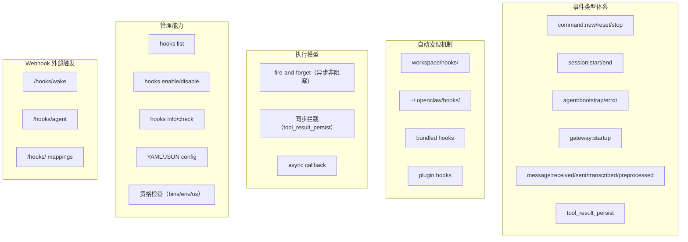

# AgenticX Hooks 系统进化规划

## 现状分析

### AgenticX 已有的 hooks（2 类，4 个切面）

- [agenticx/core/hooks/llm_hooks.py](agenticx/core/hooks/llm_hooks.py) — `before_llm_call` / `after_llm_call`
- [agenticx/core/hooks/tool_hooks.py](agenticx/core/hooks/tool_hooks.py) — `before_tool_call` / `after_tool_call`
- [agenticx/core/hooks/types.py](agenticx/core/hooks/types.py) — `LLMCallHookContext` / `ToolCallHookContext`
- [agenticx/collaboration/workforce/hooks.py](agenticx/collaboration/workforce/hooks.py) — Workforce 事件通知 hooks（桥接到 EventBus）
- [agenticx/server/event_hooks.py](agenticx/server/event_hooks.py) — Server 层 EventBus hooks

**核心问题**：hooks 只覆盖 LLM/Tool 两个切面，且全部同步执行。

### OpenClaw 的完整架构（调研结论）

OpenClaw 的 hooks 源码位于 `src/hooks/`，48 个文件，核心架构：




## 差距矩阵

- **P0 - 事件类型扩展**：只有 LLM/Tool hooks，缺 Agent 生命周期（start/stop/reset）、Session、Gateway、Message 事件
- **P0 - 异步执行模型**：所有 hooks 同步阻塞，缺 fire-and-forget 和 async callback 两种模式
- **P1 - 目录自动发现**：只支持代码级注册，缺目录扫描+HOOK.md 元数据+热加载
- **P1 - CLI 管理**：无 `agenticx hooks` 子命令
- **P2 - Webhook 外部触发**：无 HTTP endpoint 让外部系统触发 Agent 工作流
- **P2 - 内置 Hooks**：无 session-memory、command-logger 等开箱即用的 hooks

## 分阶段实施

### Phase 1: 统一事件模型 + 异步执行（P0，最高优先级）

**目标**：建立与 OpenClaw `InternalHookEvent` 对等的统一事件体系，让一个 hook handler 能处理所有类型事件。

#### 1.1 定义统一事件类型

在 [agenticx/core/hooks/types.py](agenticx/core/hooks/types.py) 中新增：

```python
@dataclass
class HookEvent:
    type: str          # "command" | "agent" | "session" | "server" | "message" | "llm" | "tool"
    action: str        # "new" | "reset" | "stop" | "start" | "bootstrap" | "before_call" | "after_call"
    agent_id: str
    session_key: str = ""
    context: Dict[str, Any] = field(default_factory=dict)
    timestamp: datetime = field(default_factory=datetime.now)
    messages: List[str] = field(default_factory=list)  # hooks 可以向这里 push 用户可见消息
```

**参考**：[internal-hooks.ts L186-L199](research/codedeepresearch/openclaw/openclaw/src/hooks/internal-hooks.ts)

#### 1.2 统一 Hook Handler 签名

```python
HookHandler = Callable[[HookEvent], Awaitable[Optional[bool]]]
```

- 返回 `None` / `True`：继续执行
- 返回 `False`：阻止后续处理（仅 before 类型 hooks）
- handler 默认是 async 的

#### 1.3 注册表重构

参考 OpenClaw `internal-hooks.ts` 的 `Map<string, Handler[]>` 设计，在新文件 `agenticx/core/hooks/registry.py` 中：

```python
class HookRegistry:
    _handlers: Dict[str, List[HookHandler]]  # "command:new" -> [handler1, handler2]

    def register(self, event_key: str, handler: HookHandler) -> None: ...
    def unregister(self, event_key: str, handler: HookHandler) -> None: ...
    async def trigger(self, event: HookEvent) -> None: ...
    def get_registered_keys(self) -> List[str]: ...
    def clear(self) -> None: ...
```

`trigger` 实现时：

1. 先匹配通用 key（如 `"command"`），再匹配具体 key（如 `"command:new"`）
2. 按注册顺序执行
3. 错误捕获不影响其他 handler

**参考**：[internal-hooks.ts L297-L315](research/codedeepresearch/openclaw/openclaw/src/hooks/internal-hooks.ts) `triggerInternalHook` 函数

#### 1.4 Fire-and-Forget 工具函数

新文件 `agenticx/core/hooks/fire_and_forget.py`：

```python
def fire_and_forget(coro: Coroutine, label: str) -> None:
    """非阻塞触发，错误只记日志不传播"""
    task = asyncio.ensure_future(coro)
    task.add_done_callback(lambda t: _log_if_failed(t, label))
```

**参考**：[fire-and-forget.ts](research/codedeepresearch/openclaw/openclaw/src/hooks/fire-and-forget.ts) — 仅 11 行代码，但极其关键

#### 1.5 Agent 生命周期事件埋点

在 `AgentExecutor` 和 `AgentServer` 的关键节点触发事件：

- `agent:start` — Agent 开始执行任务时
- `agent:stop` — Agent 完成或被中止时
- `agent:error` — Agent 遇到异常时
- `server:startup` — AgentServer 启动时
- `session:start` / `session:end` — 会话开始/结束时

#### 1.6 向后兼容

保留现有 `register_before_llm_call_hook` 等 API 作为 thin wrapper，内部委托给新的 `HookRegistry`：

```python
def register_before_llm_call_hook(hook):
    # 转换为新格式并注册
    _registry.register("llm:before_call", _adapt_legacy_hook(hook))
```

### Phase 2: 目录自动发现 + CLI 管理（P1）

#### 2.1 Hook 目录结构

模仿 OpenClaw 的三级目录发现：

```
~/.agenticx/hooks/           # 全局 hooks（managed）
<workspace>/hooks/           # 工作区 hooks（最高优先级）
agenticx/hooks/bundled/      # 内置 hooks
```

每个 hook 的结构：

```
my-hook/
  HOOK.yaml          # 元数据（替代 OpenClaw 的 HOOK.md frontmatter）
  handler.py         # Python handler
```

`HOOK.yaml` 示例：

```yaml
name: session-memory
description: "Save session context to memory on reset"
events: ["command:new", "command:reset"]
requires:
  env: ["AGENTICX_WORKSPACE"]
enabled: true
```

**参考**：

- [workspace.ts](research/codedeepresearch/openclaw/openclaw/src/hooks/workspace.ts) — 目录扫描逻辑
- [frontmatter.ts](research/codedeepresearch/openclaw/openclaw/src/hooks/frontmatter.ts) — 元数据解析
- [config.ts](research/codedeepresearch/openclaw/openclaw/src/hooks/config.ts) — 资格检查（bins/env/os）

#### 2.2 Hook Loader

新文件 `agenticx/core/hooks/loader.py`：

1. 扫描三级目录
2. 解析 HOOK.yaml
3. 检查资格（Python 版本、环境变量、依赖包）
4. 动态导入 handler.py
5. 注册到 HookRegistry

**参考**：[loader.ts](research/codedeepresearch/openclaw/openclaw/src/hooks/loader.ts) `loadInternalHooks` 函数

#### 2.3 CLI 子命令

在 `agenticx/cli/main.py` 新增 hooks 子命令组：

```bash
agenticx hooks list [--eligible] [--json]     # 列出所有 hooks
agenticx hooks enable <name>                   # 启用 hook
agenticx hooks disable <name>                  # 禁用 hook
agenticx hooks info <name>                     # 查看 hook 详情
agenticx hooks check                           # 检查资格
```

**参考**：OpenClaw 文档中的 [CLI 命令](#cli-命令) 一节

#### 2.4 配置集成

在 `agenticx.yaml` 中新增 hooks 配置段：

```yaml
hooks:
  internal:
    enabled: true
    entries:
      session-memory:
        enabled: true
      command-logger:
        enabled: false
```

### Phase 3: 内置 Hooks + Webhook（P2）

#### 3.1 Bundled Hooks

参考 OpenClaw 的三个内置 hooks，为 AgenticX 实现：

**session-memory**：

- 事件：`command:new` / `command:reset`
- 功能：保存会话上下文到 `~/.agenticx/workspace/memory/YYYY-MM-DD-slug.md`
- 参考：[session-memory/handler.ts](research/codedeepresearch/openclaw/openclaw/src/hooks/bundled/session-memory/handler.ts)

**command-logger**：

- 事件：`command`（所有命令）
- 功能：JSONL 格式记录到 `~/.agenticx/logs/commands.log`
- 参考：[command-logger/handler.ts](research/codedeepresearch/openclaw/openclaw/src/hooks/bundled/command-logger/handler.ts)

**agent-metrics**（AgenticX 原创）：

- 事件：`agent:start` / `agent:stop` / `llm:after_call` / `tool:after_call`
- 功能：收集 Agent 执行指标（token 使用量、执行时间、工具调用次数）

#### 3.2 Webhook 端点

在 `agenticx/server/` 中新增 webhook 路由：

- `POST /hooks/wake` — 唤醒主 Agent（注入系统消息）
- `POST /hooks/agent` — 运行隔离 Agent 回合
- Bearer token 认证

**参考**：[webhook.md](research/codedeepresearch/openclaw/openclaw/docs/zh-CN/automation/webhook.md)

#### 3.3 Message Hooks

扩展事件类型支持消息生命周期：

- `message:received` — 收到用户消息时
- `message:sent` — 发送回复时
- `message:preprocessed` — 消息预处理完成时

**参考**：[internal-hooks.ts L46-L185](research/codedeepresearch/openclaw/openclaw/src/hooks/internal-hooks.ts) 的 Message hook 类型定义

## 关键文件变更清单


| 操作  | 文件路径                                     | 说明                |
| --- | ---------------------------------------- | ----------------- |
| 重构  | `agenticx/core/hooks/types.py`           | 新增统一 `HookEvent`  |
| 新增  | `agenticx/core/hooks/registry.py`        | 统一注册表             |
| 新增  | `agenticx/core/hooks/fire_and_forget.py` | 异步非阻塞工具           |
| 重构  | `agenticx/core/hooks/__init__.py`        | 导出新 API + 兼容旧 API |
| 修改  | `agenticx/core/agent_executor.py`        | 生命周期事件埋点          |
| 修改  | `agenticx/server/server.py`              | startup 事件埋点      |
| 新增  | `agenticx/core/hooks/loader.py`          | 目录自动发现            |
| 新增  | `agenticx/core/hooks/frontmatter.py`     | HOOK.yaml 解析      |
| 新增  | `agenticx/core/hooks/config.py`          | 资格检查              |
| 新增  | `agenticx/core/hooks/status.py`          | 状态报告              |
| 新增  | `agenticx/cli/hooks_commands.py`         | CLI 子命令           |
| 新增  | `agenticx/hooks/bundled/session_memory/` | 内置 hook           |
| 新增  | `agenticx/hooks/bundled/command_logger/` | 内置 hook           |
| 新增  | `agenticx/hooks/bundled/agent_metrics/`  | 内置 hook           |
| 新增  | `agenticx/server/webhook.py`             | Webhook HTTP 端点   |


## 设计原则

1. **OpenClaw 的灵魂 + Python 的实现**：学习其事件模型和发现机制，但用 Python asyncio + dataclass 实现，不照搬 TypeScript
2. **向后兼容**：Phase 1 完成后旧 API 仍可用，已有代码无需修改
3. **默认异步非阻塞**：hooks 默认 fire-and-forget，需要拦截时显式声明 `blocking=True`
4. **HOOK.yaml 而非 HOOK.md**：Python 生态更适合 YAML 作为元数据格式
5. **渐进式增强**：Phase 1 单独可交付，Phase 2/3 依赖 Phase 1 但可独立排期

## 实施补充记录（本次开发已落地）

### 一、实际落地文件（相对计划新增）

> 说明：初版计划中写的是 `agenticx/core/hooks/*`，实际实现统一落在 `agenticx/hooks/*`，并通过 `agenticx/core/agent_executor.py` 与 `agenticx/server/server.py` 集成触发。

- `agenticx/hooks/types.py`：新增统一 `HookEvent`、`HookHandler`
- `agenticx/hooks/registry.py`：统一事件注册/触发中心（支持 `type` + `type:action`）
- `agenticx/hooks/fire_and_forget.py`：异步后台任务封装
- `agenticx/hooks/frontmatter.py`：`HOOK.yaml` 元数据解析
- `agenticx/hooks/config.py`：hooks 运行时配置与资格检查
- `agenticx/hooks/loader.py`：三级目录发现与动态加载
- `agenticx/hooks/status.py`：hooks 状态聚合
- `agenticx/hooks/bundled/session_memory/*`：内置会话快照 hook
- `agenticx/hooks/bundled/command_logger/*`：内置命令日志 hook
- `agenticx/hooks/bundled/agent_metrics/*`：内置指标 hook
- `agenticx/cli/hooks_commands.py`：`agenticx hooks` 子命令
- `agenticx/server/webhook.py`：`/hooks/wake` 与 `/hooks/agent` 端点
- `agenticx/core/agent_executor.py`：`agent/session/command` 生命周期事件埋点
- `agenticx/server/server.py`：`server/message` 事件埋点与 webhook 路由接入
- `agenticx/deploy/config.py`：hooks 配置归一化与兼容逻辑

### 二、测试补充（Smoke）

- `tests/test_smoke_openclaw_hooks_system.py`
  - 覆盖：目录发现、加载触发、legacy before/after 兼容、webhook 鉴权与执行、配置读写
- `tests/test_smoke_openclaw_hooks_template.py`
  - 覆盖：模板化 workspace hook 可发现性

### 三、示例补充（Examples）

- `examples/hooks_quickstart_demo.py`
  - 演示：发现加载 + 自定义 runtime hook 注册 + 事件触发 + legacy after_llm_call 改写
- `examples/hooks_custom_template/README.md`
  - 可复制模板说明
- `examples/hooks_custom_template/hooks/notify-on-new/HOOK.yaml`
- `examples/hooks_custom_template/hooks/notify-on-new/handler.py`
- `examples/hooks_custom_template/run_workspace_hook_demo.py`
  - 一键演示 workspace hook 生效链路

### 四、执行验证结果

- `pytest tests/test_smoke_openclaw_hooks_system.py tests/test_smoke_openclaw_hooks_template.py -q`
  - 结果：`5 passed`
- `python examples/hooks_quickstart_demo.py`
  - 结果：成功加载并触发 hooks
- `python examples/hooks_custom_template/run_workspace_hook_demo.py`
  - 结果：成功发现 `notify-on-new` 并触发 `command:new`

### 五、后续建议（可选）

- 补充 `examples/hooks_custom_template/webhook_curl_examples.sh`，沉淀 webhook 端到端联调脚本
- 将 hooks 章节并入 `docs/cli.md` 与 `README_ZN.md` 的安装后验证路径

